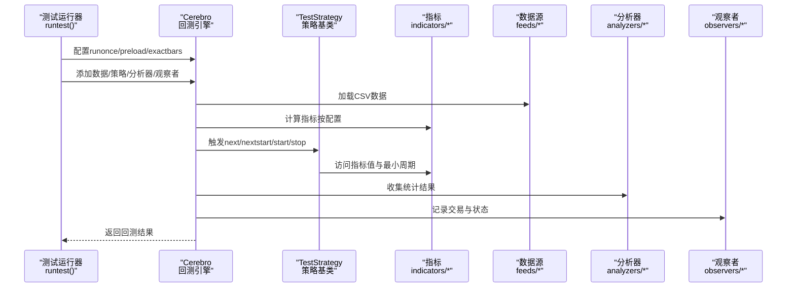
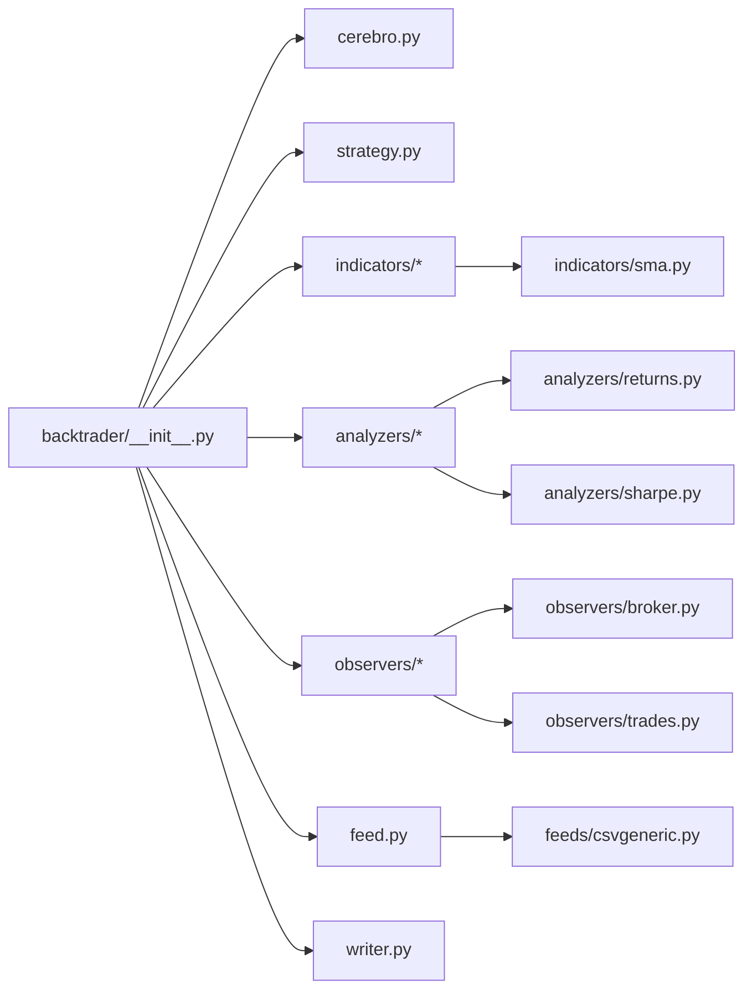

# 测试与质量保证

<cite>
**本文引用的文件**
- [tests/testcommon.py](file://tests/testcommon.py)
- [.travis.yml](file://.travis.yml)
- [tests/test_strategy_optimized.py](file://tests/test_strategy_optimized.py)
- [tests/test_ind_sma.py](file://tests/test_ind_sma.py)
- [tests/test_data_resample.py](file://tests/test_data_resample.py)
- [tests/test_data_multiframe.py](file://tests/test_data_multiframe.py)
- [tests/test_metaclass.py](file://tests/test_metaclass.py)
- [backtrader/__init__.py](file://backtrader/__init__.py)
- [backtrader/cerebro.py](file://backtrader/cerebro.py)
- [backtrader/strategy.py](file://backtrader/strategy.py)
- [backtrader/analyzers/__init__.py](file://backtrader/analyzers/__init__.py)
- [backtrader/analyzers/returns.py](file://backtrader/analyzers/returns.py)
- [backtrader/analyzers/sharpe.py](file://backtrader/analyzers/sharpe.py)
- [backtrader/analyzers/tradeanalyzer.py](file://backtrader/analyzers/tradeanalyzer.py)
- [backtrader/observers/__init__.py](file://backtrader/observers/__init__.py)
- [backtrader/observers/broker.py](file://backtrader/observers/broker.py)
- [backtrader/observers/trades.py](file://backtrader/observers/trades.py)
- [backtrader/writer.py](file://backtrader/writer.py)
- [backtrader/feed.py](file://backtrader/feed.py)
- [backtrader/feeds/__init__.py](file://backtrader/feeds/__init__.py)
- [backtrader/feeds/csvgeneric.py](file://backtrader/feeds/csvgeneric.py)
- [backtrader/indicators/__init__.py](file://backtrader/indicators/__init__.py)
- [backtrader/indicators/sma.py](file://backtrader/indicators/sma.py)
- [backtrader/indicators/macd.py](file://backtrader/indicators/macd.py)
- [backtrader/indicators/rsi.py](file://backtrader/indicators/rsi.py)
- [backtrader/indicators/stochastic.py](file://backtrader/indicators/stochastic.py)
- [backtrader/indicators/atr.py](file://backtrader/indicators/atr.py)
- [backtrader/indicators/bollinger.py](file://backtrader/indicators/bollinger.py)
- [backtrader/indicators/ichimoku.py](file://backtrader/indicators/ichimoku.py)
- [backtrader/indicators/cci.py](file://backtrader/indicators/cci.py)
- [backtrader/indicators/ultimateoscillator.py](file://backtrader/indicators/ultimateoscillator.py)
- [backtrader/indicators/roc.py](file://backtrader/indicators/roc.py)
- [backtrader/indicators/momentum.py](file://backtrader/indicators/momentum.py)
- [backtrader/indicators/priceoscillator.py](file://backtrader/indicators/priceoscillator.py)
- [backtrader/indicators/ppo.py](file://backtrader/indicators/ppo.py)
- [backtrader/indicators/williams.py](file://backtrader/indicators/williams.py)
- [backtrader/indicators/psar.py](file://backtrader/indicators/psar.py)
- [backtrader/indicators/vortex.py](file://backtrader/indicators/vortex.py)
- [backtrader/indicators/zlema.py](file://backtrader/indicators/zlema.py)
- [backtrader/indicators/zlind.py](file://backtrader/indicators/zlind.py)
- [backtrader/indicators/heikinashi.py](file://backtrader/indicators/heikinashi.py)
- [backtrader/indicators/hma.py](file://backtrader/indicators/hma.py)
- [backtrader/indicators/kama.py](file://backtrader/indicators/kama.py)
- [backtrader/indicators/kst.py](file://backtrader/indicators/kst.py)
- [backtrader/indicators/lrsi.py](file://backtrader/indicators/lrsi.py)
- [backtrader/indicators/mabase.py](file://backtrader/indicators/mabase.py)
- [backtrader/indicators/ols.py](file://backtrader/indicators/ols.py)
- [backtrader/indicators/oscillator.py](file://backtrader/indicators/oscillator.py)
- [backtrader/indicators/percentchange.py](file://backtrader/indicators/percentchange.py)
- [backtrader/indicators/percentrank.py](file://backtrader/indicators/percentrank.py)
- [backtrader/indicators/pivotpoint.py](file://backtrader/indicators/pivotpoint.py)
- [backtrader/indicators/prettygoodoscillator.py](file://backtrader/indicators/prettygoodoscillator.py)
- [backtrader/indicators/rmi.py](file://backtrader/indicators/rmi.py)
- [backtrader/indicators/smmma.py](file://backtrader/indicators/smmma.py)
- [backtrader/indicators/stochastic.py](file://backtrader/indicators/stochastic.py)
- [backtrader/indicators/trix.py](file://backtrader/indicators/trix.py)
- [backtrader/indicators/tsi.py](file://backtrader/indicators/tsi.py)
- [backtrader/indicators/ulimit.py](file://backtrader/indicators/ulimit.py)
- [backtrader/indicators/vwr.py](file://backtrader/indicators/vwr.py)
- [backtrader/indicators/williams.py](file://backtrader/indicators/williams.py)
- [backtrader/indicators/wma.py](file://backtrader/indicators/wma.py)
- [backtrader/indicators/accdecoscillator.py](file://backtrader/indicators/accdecoscillator.py)
- [backtrader/indicators/aroon.py](file://backtrader/indicators/aroon.py)
- [backtrader/indicators/awesomeoscillator.py](file://backtrader/indicators/awesomeoscillator.py)
- [backtrader/indicators/basicops.py](file://backtrader/indicators/basicops.py)
- [backtrader/indicators/crossover.py](file://backtrader/indicators/crossover.py)
- [backtrader/indicators/dema.py](file://backtrader/indicators/dema.py)
- [backtrader/indicators/deviation.py](file://backtrader/indicators/deviation.py)
- [backtrader/indicators/directionalmove.py](file://backtrader/indicators/directionalmove.py)
- [backtrader/indicators/dma.py](file://backtrader/indicators/dma.py)
- [backtrader/indicators/dpo.py](file://backtrader/indicators/dpo.py)
- [backtrader/indicators/dv2.py](file://backtrader/indicators/dv2.py)
- [backtrader/indicators/envelope.py](file://backtrader/indicators/envelope.py)
- [backtrader/indicators/hurst.py](file://backtrader/indicators/hurst.py)
- [backtrader/indicators/ma.py](file://backtrader/indicators/ma.py)
- [backtrader/indicators/minperiod.py](file://backtrader/indicators/minperiod.py)
- [backtrader/indicators/sumn.py](file://backtrader/indicators/sumn.py)
- [backtrader/indicators/tema.py](file://backtrader/indicators/tema.py)
- [backtrader/indicators/tenkan.py](file://backtrader/indicators/tenkan.py)
- [backtrader/indicators/tvm.py](file://backtrader/indicators/tvm.py)
- [backtrader/indicators/volume.py](file://backtrader/indicators/volume.py)
- [backtrader/indicators/vwma.py](file://backtrader/indicators/vwma.py)
- [backtrader/indicators/yen.py](file://backtrader/indicators/yen.py)
- [backtrader/indicators/zero.py](file://backtrader/indicators/zero.py)
- [backtrader/indicators/contrib/vortex.py](file://backtrader/indicators/contrib/vortex.py)
- [backtrader/studies/__init__.py](file://backtrader/studies/__init__.py)
- [backtrader/studies/contrib/fractal.py](file://backtrader/studies/contrib/fractal.py)
- [backtrader/utils/date.py](file://backtrader/utils/date.py)
- [backtrader/utils/ordereddefaultdict.py](file://backtrader/utils/ordereddefaultdict.py)
- [backtrader/utils/autodict.py](file://backtrader/utils/autodict.py)
- [backtrader/utils/py3.py](file://backtrader/utils/py3.py)
- [backtrader/utils/flushfile.py](file://backtrader/utils/flushfile.py)
- [backtrader/utils/dateintern.py](file://backtrader/utils/dateintern.py)
- [backtrader/functions.py](file://backtrader/functions.py)
- [backtrader/linebuffer.py](file://backtrader/linebuffer.py)
- [backtrader/lineiterator.py](file://backtrader/lineiterator.py)
- [backtrader/lineroot.py](file://backtrader/lineroot.py)
- [backtrader/lineseries.py](file://backtrader/lineseries.py)
- [backtrader/mathsupport.py](file://backtrader/mathsupport.py)
- [backtrader/metabase.py](file://backtrader/metabase.py)
- [backtrader/order.py](file://backtrader/order.py)
- [backtrader/trade.py](file://backtrader/trade.py)
- [backtrader/position.py](file://backtrader/position.py)
- [backtrader/comminfo.py](file://backtrader/comminfo.py)
- [backtrader/sizer.py](file://backtrader/sizer.py)
- [backtrader/sizers/__init__.py](file://backtrader/sizers/__init__.py)
- [backtrader/sizers/fixedsize.py](file://backtrader/sizers/fixedsize.py)
- [backtrader/sizers/percents_sizer.py](file://backtrader/sizers/percents_sizer.py)
- [backtrader/broker.py](file://backtrader/broker.py)
- [backtrader/brokers/__init__.py](file://backtrader/brokers/__init__.py)
- [backtrader/brokers/bbroker.py](file://backtrader/brokers/bbroker.py)
- [backtrader/brokers/ibbroker.py](file://backtrader/brokers/ibbroker.py)
- [backtrader/brokers/oandabroker.py](file://backtrader/brokers/oandabroker.py)
- [backtrader/brokers/vcbroker.py](file://backtrader/brokers/vcbroker.py)
- [backtrader/store.py](file://backtrader/store.py)
- [backtrader/stores/__init__.py](file://backtrader/stores/__init__.py)
- [backtrader/stores/ibstore.py](file://backtrader/stores/ibstore.py)
- [backtrader/stores/oandastore.py](file://backtrader/stores/oandastore.py)
- [backtrader/stores/vcstore.py](file://backtrader/stores/vcstore.py)
- [backtrader/stores/vchartfile.py](file://backtrader/stores/vchartfile.py)
- [backtrader/resamplerfilter.py](file://backtrader/resamplerfilter.py)
- [backtrader/filters/__init__.py](file://backtrader/filters/__init__.py)
- [backtrader/filters/datafiller.py](file://backtrader/filters/datafiller.py)
- [backtrader/filters/datafilter.py](file://backtrader/filters/datafilter.py)
- [backtrader/filters/heikinashi.py](file://backtrader/filters/heikinashi.py)
- [backtrader/filters/renko.py](file://backtrader/filters/renko.py)
- [backtrader/filters/session.py](file://backtrader/filters/session.py)
- [backtrader/filters/calendar_days.py](file://backtrader/filters/calendar_days.py)
- [backtrader/filters/daysteps.py](file://backtrader/filters/daysteps.py)
- [backtrader/filters/bsplitter.py](file://backtrader/filters/bsplitter.py)
- [backtrader/talib.py](file://backtrader/talib.py)
- [backtrader/timer.py](file://backtrader/timer.py)
- [backtrader/tradingcal.py](file://backtrader/tradingcal.py)
- [backtrader/version.py](file://backtrader/version.py)
- [setup.py](file://setup.py)
- [README.rst](file://README.rst)
- [datas/2006-day-001.txt](file://datas/2006-day-001.txt)
- [datas/2006-week-001.txt](file://datas/2006-week-001.txt)
</cite>

## 目录
1. 引言
2. 项目结构
3. 核心组件
4. 架构总览
5. 组件详解
6. 依赖关系分析
7. 性能考量
8. 故障排查指南
9. 结论
10. 附录

## 引言
本文件面向Backtrader项目的测试与质量保证，系统化梳理测试框架与质量控制方法，覆盖单元测试、集成测试、策略与指标测试、数据处理测试、持续集成与自动化测试、代码覆盖率与质量度量、性能与基准测试、以及测试过程中的常见问题与解决方案。文档同时给出可操作的测试编写指南与最佳实践，帮助开发者在量化项目中高效落地测试驱动开发（TDD）与行为驱动开发（BDD）。

## 项目结构
Backtrader采用模块化分层组织：核心引擎位于backtrader包内，测试集中于tests目录，示例与样例位于samples目录，真实交易模块位于real_trade目录，测试数据位于datas目录。测试体系以统一的测试基类与运行器为核心，围绕策略、指标、数据流、分析器、观察者等模块进行覆盖。

```mermaid
graph TB
subgraph "测试层"
TCommon["tests/testcommon.py<br/>通用测试基类与运行器"]
TStratOpt["tests/test_strategy_optimized.py<br/>优化策略测试"]
TIndSMA["tests/test_ind_sma.py<br/>指标测试样例"]
TDataResample["tests/test_data_resample.py<br/>数据重采样测试"]
TDataMulti["tests/test_data_multiframe.py<br/>多时间框架测试"]
TMeta["tests/test_metaclass.py<br/>元类与参数继承测试"]
end
subgraph "核心引擎"
Init["backtrader/__init__.py<br/>导出入口"]
Cerebro["backtrader/cerebro.py<br/>回测引擎"]
Strategy["backtrader/strategy.py<br/>策略基类"]
Feed["backtrader/feed.py<br/>数据接口"]
Indicators["backtrader/indicators/*<br/>指标库"]
Analyzers["backtrader/analyzers/*<br/>分析器"]
Observers["backtrader/observers/*<br/>观察者"]
Writers["backtrader/writer.py<br/>输出写入"]
end
subgraph "数据与示例"
Datas["datas/*.txt<br/>基准数据"]
Samples["samples/*<br/>示例与演示"]
RealTrade["real_trade/*<br/>实盘模块"]
end
TCommon --> Cerebro
TCommon --> Strategy
TCommon --> Indicators
TCommon --> Analyzers
TCommon --> Observers
TCommon --> Writers
TCommon --> Feed
TCommon --> Datas
TStratOpt --> Cerebro
TIndSMA --> Cerebro
TDataResample --> Cerebro
TDataMulti --> Cerebro
TMeta --> Strategy
```

图示来源
- [tests/testcommon.py](file://tests/testcommon.py#L1-L238)
- [backtrader/cerebro.py](file://backtrader/cerebro.py#L1-L200)
- [backtrader/strategy.py](file://backtrader/strategy.py#L1-L200)
- [backtrader/feed.py](file://backtrader/feed.py#L1-L200)
- [backtrader/indicators/__init__.py](file://backtrader/indicators/__init__.py#L1-L200)
- [backtrader/analyzers/__init__.py](file://backtrader/analyzers/__init__.py#L1-L200)
- [backtrader/observers/__init__.py](file://backtrader/observers/__init__.py#L1-L200)
- [backtrader/writer.py](file://backtrader/writer.py#L1-L200)
- [datas/2006-day-001.txt](file://datas/2006-day-001.txt#L1-L200)

章节来源
- [tests/testcommon.py](file://tests/testcommon.py#L1-L238)
- [README.rst](file://README.rst#L1-L171)

## 核心组件
- 测试基座与运行器
  - 通用数据加载与Cerebro运行封装，支持多种运行模式组合（预加载、一次性计算、精确栏数等），便于对比不同配置下的行为一致性。
  - 提供TestStrategy用于指标与策略验证，内置断言点位与最小周期检查。
- 策略与指标
  - 策略基类提供内存节省、时钟同步、参数收集等机制；指标库覆盖广泛技术指标，具备稳定的最小周期与输出一致性。
- 数据与分析
  - 数据接口支持CSV、在线源等多种输入；分析器与观察者提供收益、风险、交易历史等评估维度。
- 持续集成
  - Travis CI配置使用nose执行tests目录下测试，覆盖多Python版本矩阵。

章节来源
- [tests/testcommon.py](file://tests/testcommon.py#L50-L117)
- [backtrader/strategy.py](file://backtrader/strategy.py#L107-L200)
- [backtrader/cerebro.py](file://backtrader/cerebro.py#L60-L200)
- [.travis.yml](file://.travis.yml#L1-L23)

## 架构总览
测试架构围绕“统一运行器 + 多场景测试用例”展开，通过Cerebro的参数组合与TestStrategy的断言，实现对策略、指标、数据处理的系统性验证。

图示来源
- [tests/testcommon.py](file://tests/testcommon.py#L61-L117)
- [backtrader/cerebro.py](file://backtrader/cerebro.py#L60-L200)
- [backtrader/strategy.py](file://backtrader/strategy.py#L107-L200)
- [backtrader/indicators/__init__.py](file://backtrader/indicators/__init__.py#L1-L200)
- [backtrader/analyzers/__init__.py](file://backtrader/analyzers/__init__.py#L1-L200)
- [backtrader/observers/__init__.py](file://backtrader/observers/__init__.py#L1-L200)

## 组件详解

### 测试基座与运行器（testcommon）
- 数据加载
  - 从datas目录读取CSV基准数据，支持指定日期范围与数据文件索引。
- 运行器
  - 自动组合runonce、preload、exactbars等参数，遍历所有组合运行Cerebro，确保不同配置下的稳定性。
  - 支持添加策略、分析器、观察者与写入器，并在结束时断言关键指标与最小周期。
- 测试策略
  - 内置指标初始化与多数据源适配，提供next/nextstart/start/stop生命周期断言，支持自定义断言点位与期望值比较。

图示来源
- [tests/testcommon.py](file://tests/testcommon.py#L61-L117)

章节来源
- [tests/testcommon.py](file://tests/testcommon.py#L50-L117)

### 策略测试（优化策略）
- 目标
  - 验证策略在不同参数空间内的稳定性与一致性，确保优化流程正确产出预期净值与现金序列。
- 方法
  - 使用runtest组合多种运行模式，对策略停止时的净值与现金进行断言，与基准值比对。
  - 在主模式下打印实际与期望差异，辅助调试。

图示来源
- [tests/test_strategy_optimized.py](file://tests/test_strategy_optimized.py#L121-L164)
- [tests/testcommon.py](file://tests/testcommon.py#L61-L117)

章节来源
- [tests/test_strategy_optimized.py](file://tests/test_strategy_optimized.py#L1-L164)

### 指标测试（SMA）
- 目标
  - 验证指标在给定数据上的输出与最小周期一致性。
- 方法
  - 通过testcommon.TestStrategy包装指标，设置期望值与最小周期，断言关键点位输出。

图示来源
- [tests/test_ind_sma.py](file://tests/test_ind_sma.py#L38-L51)
- [tests/testcommon.py](file://tests/testcommon.py#L120-L225)

章节来源
- [tests/test_ind_sma.py](file://tests/test_ind_sma.py#L1-L51)

### 数据处理测试（重采样、多时间框架）
- 重采样
  - 对日线数据进行周级别重采样，验证指标在重采样后的时间轴上的一致性。
- 多时间框架
  - 同时加载日线与周线数据，验证跨时间框架的指标与最小周期行为。

图示来源
- [tests/test_data_resample.py](file://tests/test_data_resample.py#L39-L54)
- [tests/test_data_multiframe.py](file://tests/test_data_multiframe.py#L37-L47)

章节来源
- [tests/test_data_resample.py](file://tests/test_data_resample.py#L1-L58)
- [tests/test_data_multiframe.py](file://tests/test_data_multiframe.py#L1-L51)

### 元类与参数继承测试
- 目标
  - 验证从基类继承使用frompackages导入机制不会破坏功能。
- 方法
  - 实例化测试类，确保无异常抛出。

章节来源
- [tests/test_metaclass.py](file://tests/test_metaclass.py#L1-L43)

## 依赖关系分析
- 导出与模块组织
  - backtrader/__init__.py统一导出核心模块，便于测试用例直接引用。
- 指标与分析器生态
  - 指标与分析器均通过__init__.py暴露，测试用例可直接导入使用。
- 数据接口
  - CSV数据通过csvgeneric等实现，测试用例通过BacktraderCSVData加载基准数据。

图示来源
- [backtrader/__init__.py](file://backtrader/__init__.py#L1-L91)
- [backtrader/feeds/csvgeneric.py](file://backtrader/feeds/csvgeneric.py#L1-L200)
- [backtrader/indicators/sma.py](file://backtrader/indicators/sma.py#L1-L200)
- [backtrader/analyzers/returns.py](file://backtrader/analyzers/returns.py#L1-L200)
- [backtrader/analyzers/sharpe.py](file://backtrader/analyzers/sharpe.py#L1-L200)
- [backtrader/observers/broker.py](file://backtrader/observers/broker.py#L1-L200)
- [backtrader/observers/trades.py](file://backtrader/observers/trades.py#L1-L200)

章节来源
- [backtrader/__init__.py](file://backtrader/__init__.py#L1-L91)

## 性能考量
- 运行模式对性能的影响
  - runonce与preload可显著提升向量化计算效率；exactbars可减少内存占用但会禁用绘图。
- 优化策略的性能
  - 通过参数范围与多进程（maxcpus）加速搜索，需结合数据预加载与一次性计算以获得最佳效果。
- 基准测试建议
  - 固定数据集与参数组合，记录CPU时间或进程时间，对比不同配置下的吞吐与稳定性。

章节来源
- [backtrader/cerebro.py](file://backtrader/cerebro.py#L60-L200)
- [tests/test_strategy_optimized.py](file://tests/test_strategy_optimized.py#L24-L30)

## 故障排查指南
- 测试数据一致性
  - 确保基准数据路径与日期范围一致；若断言失败，先在主模式下打印实际值与期望值，定位偏差点位。
- 测试环境隔离
  - 使用独立的临时目录存放输出与中间结果，避免跨用例污染；必要时清理Cerebro状态。
- 参数组合爆炸
  - 优先在小数据集与少量参数范围内验证，再逐步扩大范围；利用优化模式减少重复计算。
- 绘图与内存
  - 若启用exactbars，绘图将被禁用；需要可视化时选择合适的exactbars值或关闭该选项。
- 分析器与观察者
  - 确认已正确添加分析器与观察者；若统计缺失，检查命名与别名冲突。

章节来源
- [tests/testcommon.py](file://tests/testcommon.py#L61-L117)
- [backtrader/cerebro.py](file://backtrader/cerebro.py#L121-L162)

## 结论
Backtrader的测试体系以统一运行器为核心，配合策略、指标、数据处理与分析器的多维测试用例，形成完整的质量保障闭环。通过规范化的测试编写、持续集成与性能基准，能够有效提升代码质量与回归稳定性。建议在新功能开发中遵循TDD/BDD流程，先编写测试用例，再实现功能，确保可测试性与可维护性。

## 附录

### 测试用例编写指南
- 策略测试
  - 使用runtest组合runonce/preload/exactbars，断言净值与现金序列；在主模式下打印实际值辅助调试。
- 指标测试
  - 通过TestStrategy包装指标，设置期望值与最小周期，断言关键点位输出。
- 数据处理测试
  - 对重采样与多时间框架分别编写用例，断言输出与最小周期；注意时间轴对齐。
- 元类与参数继承
  - 验证从基类继承使用frompackages不破坏功能，实例化测试类确保无异常。

章节来源
- [tests/test_strategy_optimized.py](file://tests/test_strategy_optimized.py#L121-L164)
- [tests/test_ind_sma.py](file://tests/test_ind_sma.py#L38-L51)
- [tests/test_data_resample.py](file://tests/test_data_resample.py#L39-L54)
- [tests/test_data_multiframe.py](file://tests/test_data_multiframe.py#L37-L47)
- [tests/test_metaclass.py](file://tests/test_metaclass.py#L33-L42)

### 持续集成与自动化测试
- CI配置
  - 使用Travis CI与nose执行tests目录下的测试，覆盖多Python版本矩阵。
- 安装与运行
  - 通过pip安装backtrader，确保matplotlib（可选）满足绘图需求；在tests目录下执行nose以运行全部测试。

章节来源
- [.travis.yml](file://.travis.yml#L1-L23)
- [README.rst](file://README.rst#L126-L141)

### 代码覆盖率与质量度量
- 覆盖率建议
  - 在本地与CI中引入覆盖率工具（如coverage.py），对策略、指标、数据处理模块分别统计覆盖率。
- 质量度量
  - 关注断言命中率、异常捕获覆盖率、边界条件覆盖情况；定期审查断言点位与期望值的合理性。

[本节为通用指导，无需特定文件引用]

### 性能测试与基准测试实施
- 基准数据
  - 使用固定大小的CSV数据集，设定统一的参数组合与运行模式。
- 基准指标
  - 记录CPU时间、内存峰值、回测耗时；对比不同配置下的吞吐与稳定性。
- 报告与回归
  - 将基准结果存档，建立回归阈值，CI中失败即告警。

章节来源
- [tests/test_strategy_optimized.py](file://tests/test_strategy_optimized.py#L24-L30)
- [datas/2006-day-001.txt](file://datas/2006-day-001.txt#L1-L200)

### 测试驱动开发与行为驱动开发
- TDD流程
  - 编写最小可运行的测试用例 → 实现功能 → 重构与完善 → 重复迭代。
- BDD风格
  - 以“场景”描述测试目标（如“策略在给定参数下应产生稳定收益”），通过断言验证行为。
- 在量化项目中的应用
  - 将市场假设、交易规则、风控逻辑转化为可执行的测试场景，确保策略在不同市场环境下稳健。

[本节为概念性内容，无需特定文件引用]