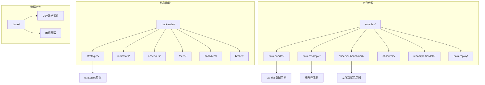
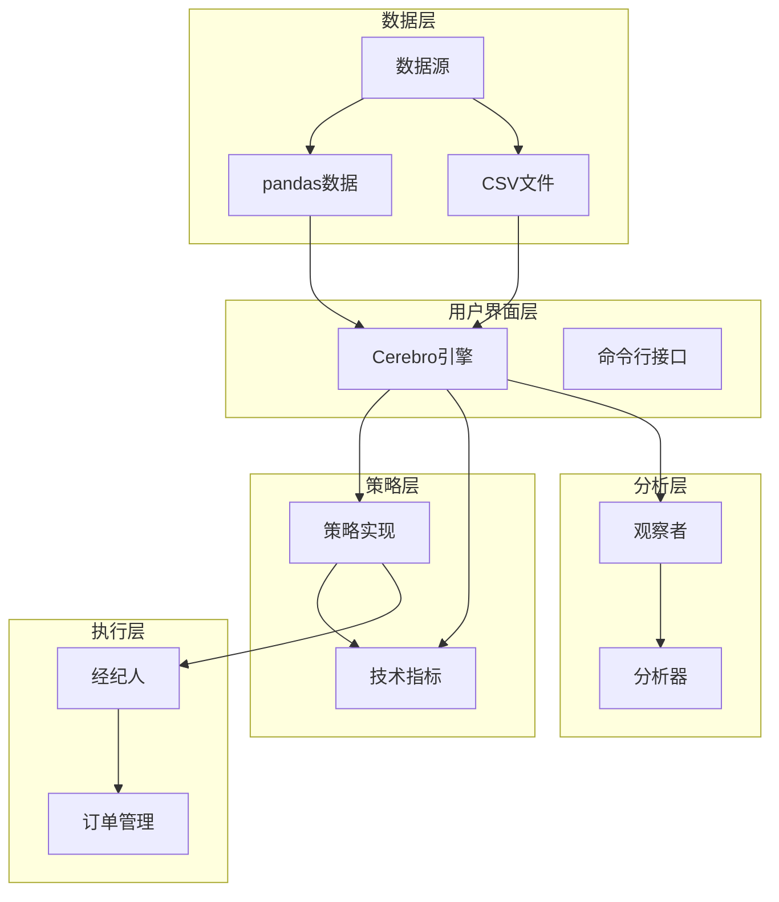
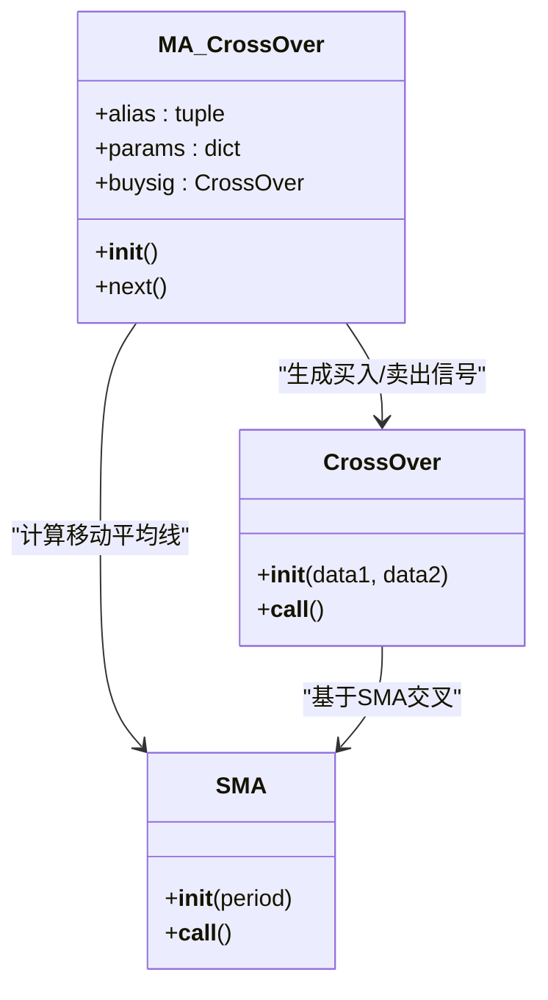
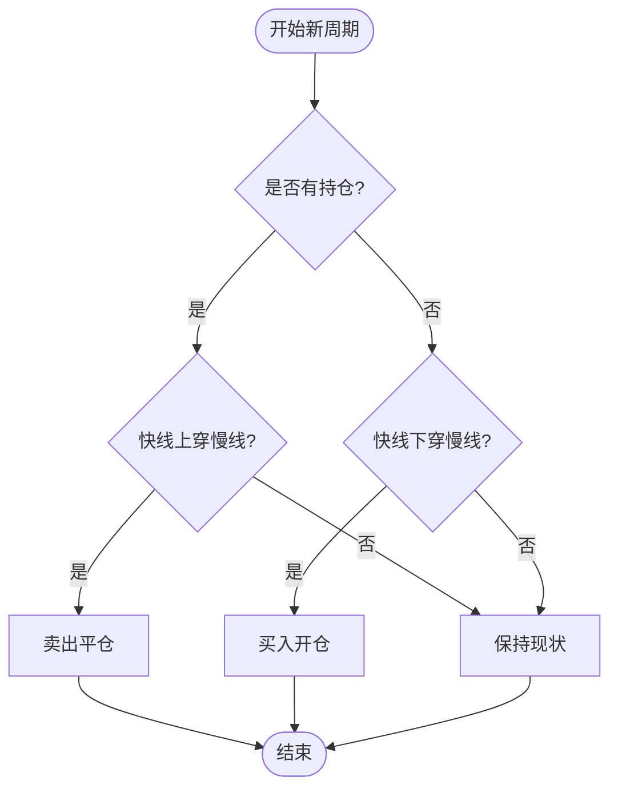
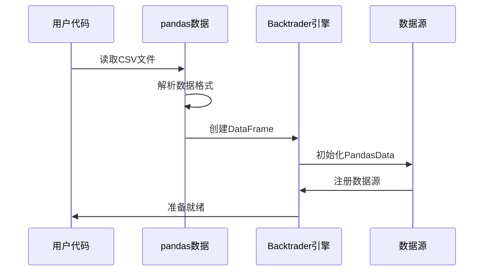
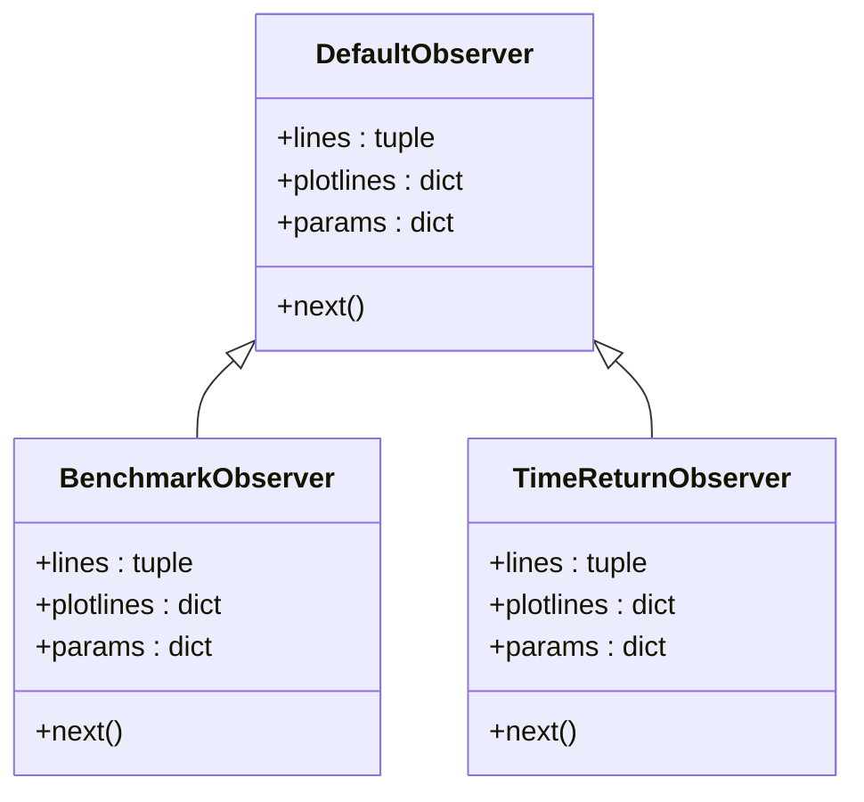
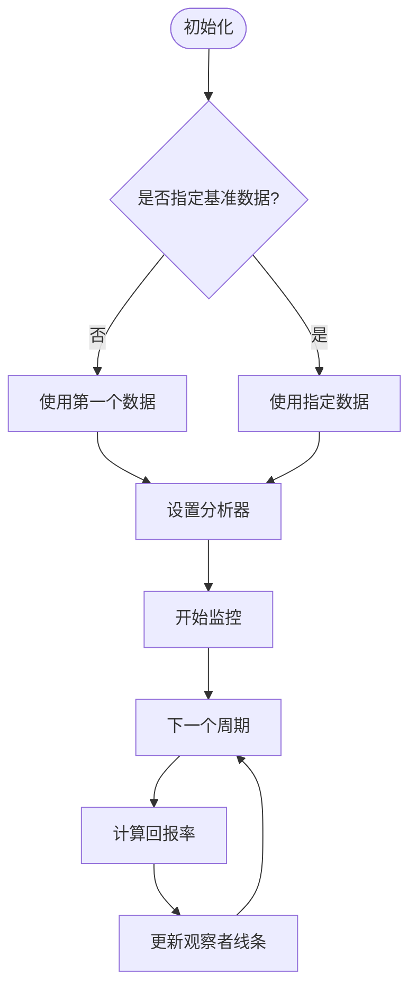
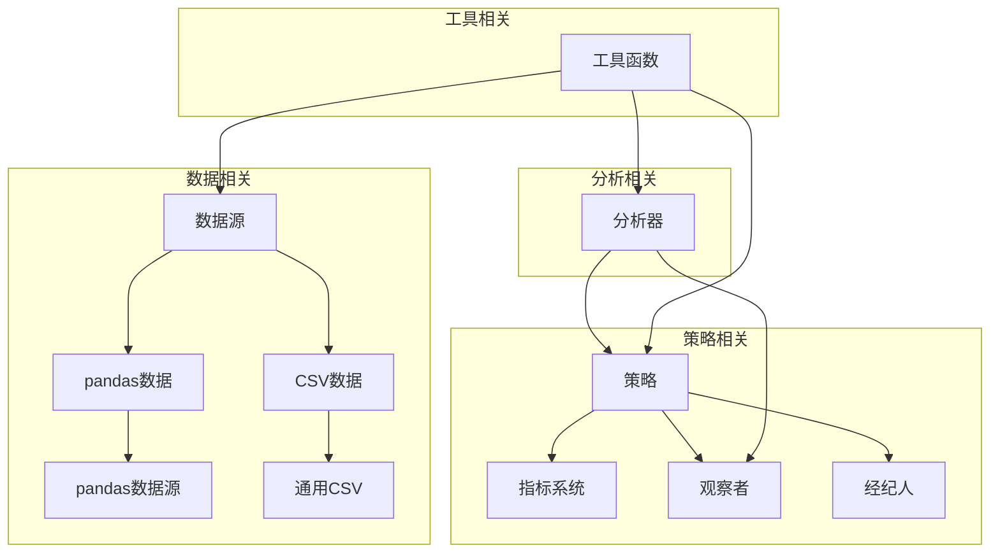

# 基础示例

<cite>
**本文档引用的文件**
- [sma_crossover.py](file://backtrader/strategies/sma_crossover.py)
- [data-pandas.py](file://samples/data-pandas/data-pandas.py)
- [data-resample.py](file://samples/data-resample/data-resample.py)
- [observer-benchmark.py](file://samples/observer-benchmark/observer-benchmark.py)
- [benchmark.py](file://backtrader/observers/benchmark.py)
- [pandafeed.py](file://backtrader/feeds/pandafeed.py)
- [observers-default.py](file://samples/observers/observers-default.py)
- [resample-tickdata.py](file://samples/resample-tickdata/resample-tickdata.py)
- [data-replay.py](file://samples/data-replay/data-replay.py)
- [__init__.py](file://backtrader/observers/__init__.py)
- [2006-day-001.txt](file://datas/2006-day-001.txt)
- [2006-day-001-optix.txt](file://datas/2006-day-001-optix.txt)
</cite>

## 目录
1. [简介](#简介)
2. [项目结构](#项目结构)
3. [核心组件](#核心组件)
4. [架构概览](#架构概览)
5. [详细组件分析](#详细组件分析)
6. [依赖关系分析](#依赖关系分析)
7. [性能考虑](#性能考虑)
8. [故障排除指南](#故障排除指南)
9. [结论](#结论)
10. [附录](#附录)

## 简介

本文件为Backtrader基础示例的详细文档，专注于入门级策略开发案例。Backtrader是一个功能强大的Python量化交易回测框架，支持多种数据源、策略类型和分析工具。本文档将深入解析以下核心主题：

- 简单移动平均交叉策略的完整实现
- 观察者（Observer）系统的使用方法
- pandas数据源的集成与配置
- 数据重采样和重播技术
- 参数设置、信号生成和交易逻辑
- 错误处理和调试技巧

Backtrader提供了丰富的内置组件，包括策略基类、指标计算、观察者、数据源等，使得开发者能够快速构建和测试交易策略。

## 项目结构

Backtrader项目采用模块化设计，主要目录结构如下：



**图表来源**
- [sma_crossover.py](file://backtrader/strategies/sma_crossover.py#L1-L75)
- [data-pandas.py](file://samples/data-pandas/data-pandas.py#L1-L93)
- [data-resample.py](file://samples/data-resample/data-resample.py#L1-L96)

**章节来源**
- [sma_crossover.py](file://backtrader/strategies/sma_crossover.py#L1-L75)
- [data-pandas.py](file://samples/data-pandas/data-pandas.py#L1-L93)
- [data-resample.py](file://samples/data-resample/data-resample.py#L1-L96)

## 核心组件

### 策略基类系统

Backtrader的核心是策略基类，所有自定义策略都继承自它。策略基类提供了：

- 生命周期管理：`__init__`、`start`、`pre_next`、`next`、`stop`
- 数据访问：通过`self.data`访问市场数据
- 位置管理：`self.position`跟踪当前持仓状态
- 订单执行：`buy()`、`sell()`、`close()`等方法

### 指标系统

Backtrader内置了丰富的技术指标，包括：
- 移动平均线：SMA、EMA、WMA等
- 动量指标：RSI、MACD、CCI等
- 成交量指标：OBV、AD等
- 组合指标：交叉、布林带等

### 观察者系统

观察者用于监控和记录策略运行过程中的各种信息：
- 默认观察者：记录基本的账户和交易信息
- 基准观察者：比较策略表现与基准资产
- 时间回报观察者：计算投资回报率

**章节来源**
- [sma_crossover.py](file://backtrader/strategies/sma_crossover.py#L29-L75)
- [benchmark.py](file://backtrader/observers/benchmark.py#L28-L120)

## 架构概览

Backtrader的整体架构采用分层设计，各组件协同工作：



**图表来源**
- [sma_crossover.py](file://backtrader/strategies/sma_crossover.py#L29-L75)
- [benchmark.py](file://backtrader/observers/benchmark.py#L28-L120)
- [pandafeed.py](file://backtrader/feeds/pandafeed.py#L107-L274)

## 详细组件分析

### 简单移动平均交叉策略

#### 策略实现详解

简单移动平均交叉策略是最基础且常用的趋势跟踪策略之一。该策略的核心逻辑基于两个不同周期的移动平均线交叉信号。



**图表来源**
- [sma_crossover.py](file://backtrader/strategies/sma_crossover.py#L29-L75)

#### 参数配置

策略参数在类定义中进行配置：

| 参数名称 | 类型 | 默认值 | 描述 |
|---------|------|--------|------|
| fast | int | 10 | 快速移动平均周期 |
| slow | int | 30 | 慢速移动平均周期 |
| _movav | class | btind.MovAv.SMA | 移动平均算法 |

#### 信号生成机制

策略通过移动平均线交叉产生交易信号：



**图表来源**
- [sma_crossover.py](file://backtrader/strategies/sma_crossover.py#L68-L75)

**章节来源**
- [sma_crossover.py](file://backtrader/strategies/sma_crossover.py#L29-L75)

### pandas数据源使用

#### 数据加载流程

pandas数据源提供了灵活的数据加载方式，支持多种数据格式：



**图表来源**
- [data-pandas.py](file://samples/data-pandas/data-pandas.py#L32-L75)
- [pandafeed.py](file://backtrader/feeds/pandafeed.py#L107-L274)

#### 数据格式转换

pandas数据源支持自动列名匹配和索引处理：

| 参数 | 类型 | 描述 |
|------|------|------|
| dataname | DataFrame | pandas DataFrame对象 |
| datetime | int/string | 日期时间列标识 |
| open | int/string | 开盘价列标识 |
| high | int/string | 最高价列标识 |
| low | int/string | 最低价列标识 |
| close | int/string | 收盘价列标识 |
| volume | int/string | 成交量列标识 |
| openinterest | int/string | 持仓量列标识 |

**章节来源**
- [data-pandas.py](file://samples/data-pandas/data-pandas.py#L32-L93)
- [pandafeed.py](file://backtrader/feeds/pandafeed.py#L107-L274)

### 观察者系统

#### 默认观察者配置

默认观察者提供了基本的交易监控功能：



**图表来源**
- [benchmark.py](file://backtrader/observers/benchmark.py#L28-L120)
- [__init__.py](file://backtrader/observers/__init__.py#L27-L35)

#### 基准观察者实现

基准观察者用于比较策略表现与基准资产的表现：



**图表来源**
- [benchmark.py](file://backtrader/observers/benchmark.py#L99-L120)

**章节来源**
- [observer-benchmark.py](file://samples/observer-benchmark/observer-benchmark.py#L95-L140)
- [benchmark.py](file://backtrader/observers/benchmark.py#L28-L120)

### 数据重采样

#### 重采样概念

数据重采样是将高频数据转换为低频数据的过程，常用于：

- 将分钟级数据转换为日线数据
- 将Tick数据转换为Bar数据
- 统一不同时间框架的数据

#### 实现方法对比

Backtrader提供了两种重采样实现方式：

| 方法 | 优点 | 缺点 | 使用场景 |
|------|------|------|----------|
| 新式重采样 | 更灵活，支持更多参数 | 需要更新代码 | 新项目推荐 |
| 旧式重采样 | 兼容性好 | 功能有限 | 迁移现有项目 |

**章节来源**
- [data-resample.py](file://samples/data-resample/data-resample.py#L30-L72)
- [resample-tickdata.py](file://samples/resample-tickdata/resample-tickdata.py#L30-L76)

## 依赖关系分析

Backtrader的组件间存在复杂的依赖关系：



**图表来源**
- [sma_crossover.py](file://backtrader/strategies/sma_crossover.py#L25-L26)
- [pandafeed.py](file://backtrader/feeds/pandafeed.py#L24-L27)

**章节来源**
- [sma_crossover.py](file://backtrader/strategies/sma_crossover.py#L25-L26)
- [pandafeed.py](file://backtrader/feeds/pandafeed.py#L24-L27)

## 性能考虑

### 内存优化

Backtrader在处理大量数据时需要注意内存使用：

- 合理设置数据长度限制
- 及时清理不需要的数据缓存
- 使用适当的时间框架减少数据量

### 计算效率

- 避免在`next()`方法中进行复杂计算
- 利用向量化操作提高性能
- 合理使用缓存机制

### 并发处理

Backtrader支持多线程处理，但需要谨慎使用：

- 确保策略代码线程安全
- 避免共享可变状态
- 使用适当的同步机制

## 故障排除指南

### 常见问题及解决方案

#### 数据格式问题

**问题**：pandas数据无法正确解析
**解决方案**：
1. 检查CSV文件格式是否正确
2. 确认列名与参数设置一致
3. 验证日期时间格式

#### 策略逻辑错误

**问题**：交易信号不符合预期
**解决方案**：
1. 检查移动平均线参数设置
2. 验证交叉信号生成逻辑
3. 确认交易条件判断

#### 观察者显示异常

**问题**：基准观察者数据显示不正确
**解决方案**：
1. 检查基准数据源设置
2. 验证时间框架一致性
3. 确认观察者参数配置

**章节来源**
- [data-pandas.py](file://samples/data-pandas/data-pandas.py#L77-L88)
- [observer-benchmark.py](file://samples/observer-benchmark/observer-benchmark.py#L142-L202)

## 结论

Backtrader为量化交易策略开发提供了完整的解决方案。通过本文档的学习，您应该能够：

1. 理解Backtrader的核心架构和组件关系
2. 掌握简单移动平均交叉策略的实现方法
3. 学会使用pandas数据源进行数据加载
4. 应用观察者系统监控策略表现
5. 实现数据重采样和重播功能
6. 处理常见问题和调试技巧

建议在实际开发中：
- 从简单的策略开始，逐步增加复杂度
- 充分利用Backtrader的调试工具
- 建立完善的测试体系
- 关注性能优化和内存管理

## 附录

### 快速开始示例

以下是一个最小化的策略运行示例：

```python
import backtrader as bt

# 创建Cerebro引擎
cerebro = bt.Cerebro()

# 添加策略
cerebro.addstrategy(bt.Strategy)

# 添加数据
data = bt.feeds.BacktraderCSVData(dataname='datas/2006-day-001.txt')
cerebro.adddata(data)

# 运行回测
cerebro.run()

# 绘制结果
cerebro.plot()
```

### 参数调优建议

- **移动平均周期**：根据市场波动性调整，通常在10-50之间
- **资金管理**：合理设置初始资金和风险控制
- **交易成本**：考虑佣金和滑点对策略的影响
- **数据质量**：确保数据的完整性和准确性

### 扩展资源

- 官方文档和API参考
- 社区论坛和讨论组
- 第三方扩展和插件
- 性能基准测试工具