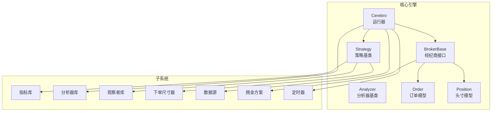
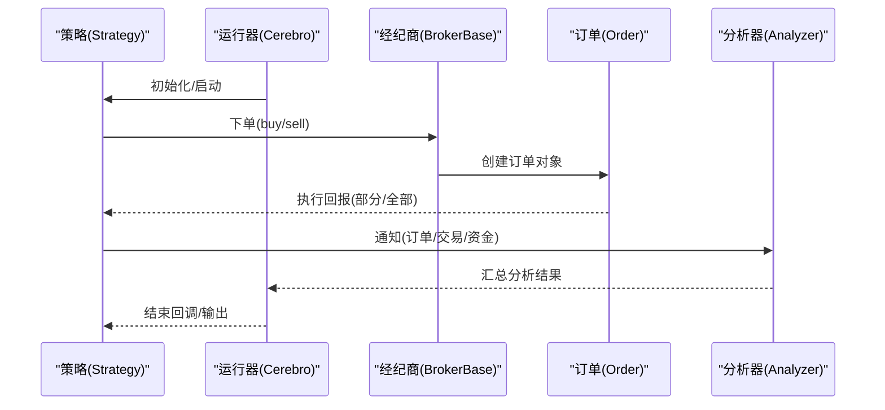
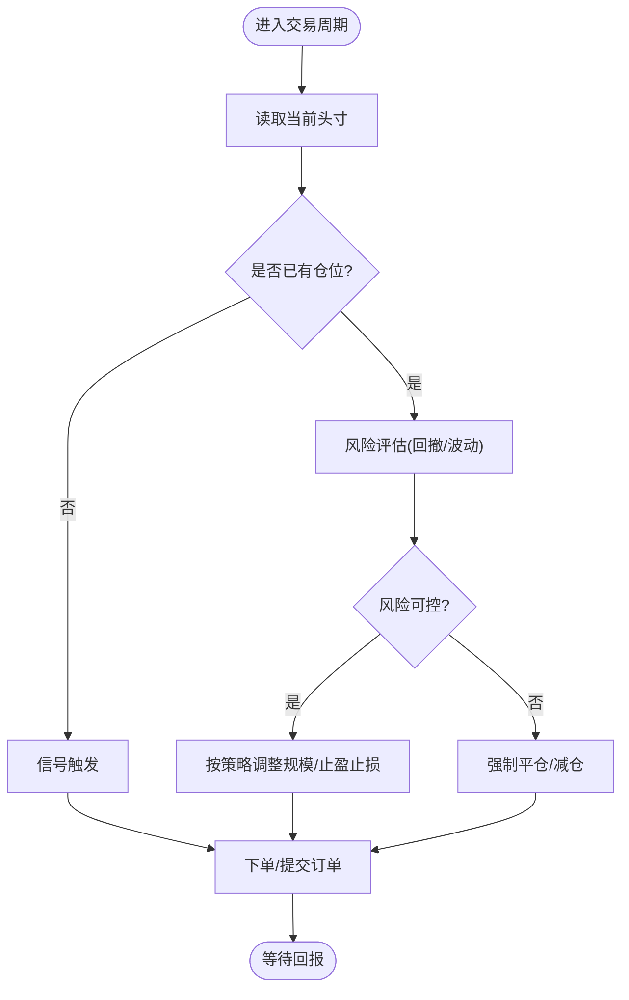
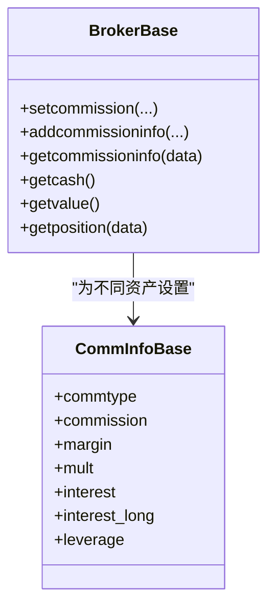
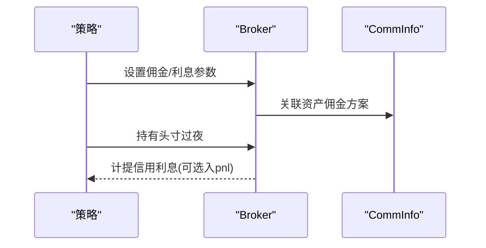
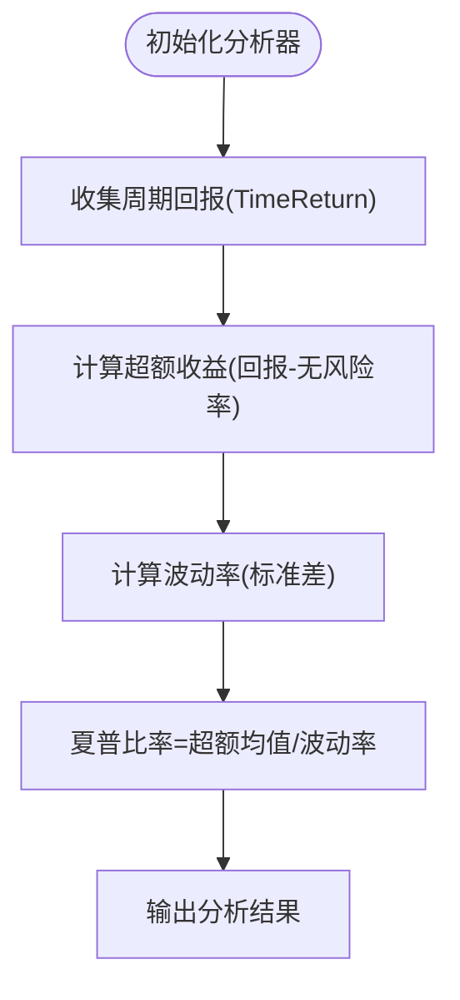
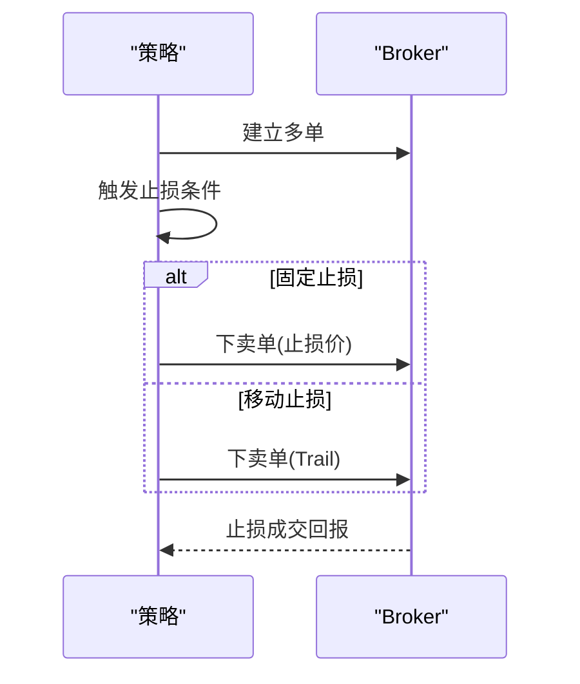
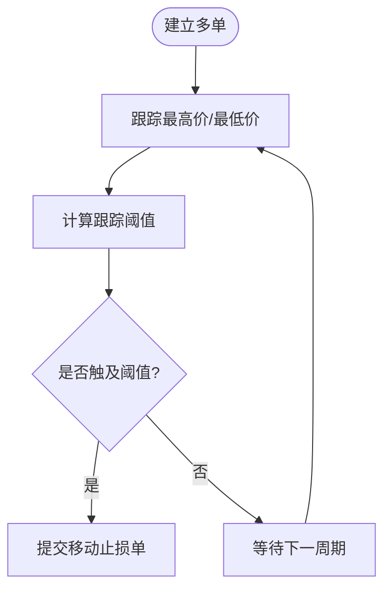
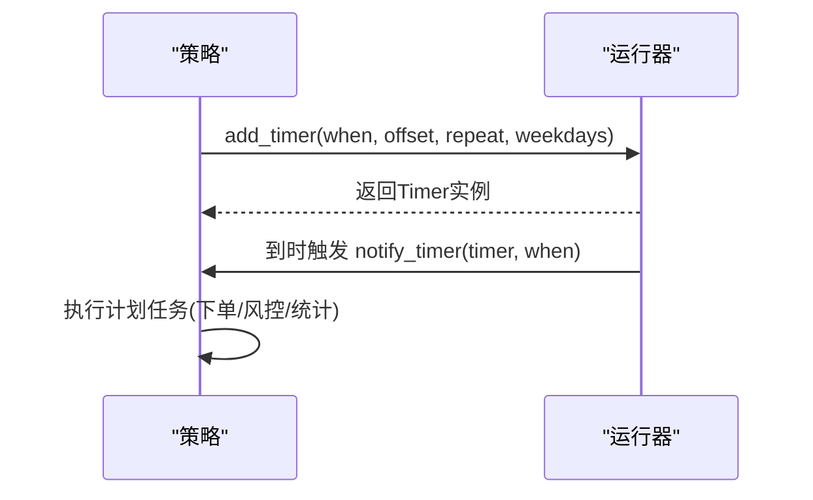
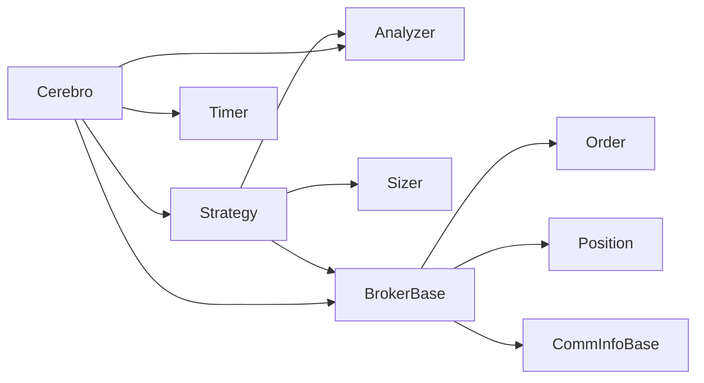

# 开发最佳实践

<cite>
**本文档引用的文件**
- [backtrader/__init__.py](file://backtrader/__init__.py)
- [backtrader/cerebro.py](file://backtrader/cerebro.py)
- [backtrader/strategy.py](file://backtrader/strategy.py)
- [backtrader/analyzer.py](file://backtrader/analyzer.py)
- [backtrader/broker.py](file://backtrader/broker.py)
- [backtrader/order.py](file://backtrader/order.py)
- [backtrader/position.py](file://backtrader/position.py)
- [backtrader/analyzers/sharpe.py](file://backtrader/analyzers/sharpe.py)
- [backtrader/analyzers/returns.py](file://backtrader/analyzers/returns.py)
- [backtrader/analyzers/drawdown.py](file://backtrader/analyzers/drawdown.py)
- [backtrader/sizers/fixedsize.py](file://backtrader/sizers/fixedsize.py)
- [backtrader/sizers/percents_sizer.py](file://backtrader/sizers/percents_sizer.py)
- [samples/credit-interest/credit-interest.py](file://samples/credit-interest/credit-interest.py)
- [samples/sharpe-timereturn/sharpe-timereturn.py](file://samples/sharpe-timereturn/sharpe-timereturn.py)
- [samples/stop-trading/stop-loss-approaches.py](file://samples/stop-trading/stop-loss-approaches.py)
- [samples/stoptrail/trail.py](file://samples/stoptrail/trail.py)
- [samples/commission-schemes/commission-schemes.py](file://samples/commission-schemes/commission-schemes.py)
- [samples/timers/scheduled.py](file://samples/timers/scheduled.py)
</cite>

## 目录
1. [简介](#简介)
2. [项目结构](#项目结构)
3. [核心组件](#核心组件)
4. [架构总览](#架构总览)
5. [详细组件分析](#详细组件分析)
6. [依赖关系分析](#依赖关系分析)
7. [性能考虑](#性能考虑)
8. [故障排除指南](#故障排除指南)
9. [结论](#结论)
10. [附录](#附录)

## 简介
本指南面向Backtrader开发者，系统梳理策略开发与项目管理的最佳实践，覆盖仓位测试与风险管理、佣金方案设计与成本控制、信用利息计算与影响分析、风险调整收益指标（如夏普比率）的使用、止损策略实现与对比、移动止损机制、定时器与计划任务、以及代码结构、命名规范、错误处理与文档编写等工程化要点，并给出项目组织与版本管理建议。

## 项目结构
Backtrader采用模块化分层架构：核心引擎在顶层包中，数据、指标、分析器、观察者、订单与头寸管理、委托与佣金、定时器、运行器等按职责划分到独立子模块。示例位于samples目录，涵盖佣金、信用利息、夏普比率、止损、移动止损、定时器等主题。

图表来源
- [backtrader/cerebro.py](file://backtrader/cerebro.py#L60-L120)
- [backtrader/strategy.py](file://backtrader/strategy.py#L107-L120)
- [backtrader/analyzer.py](file://backtrader/analyzer.py#L89-L140)
- [backtrader/broker.py](file://backtrader/broker.py#L49-L110)
- [backtrader/order.py](file://backtrader/order.py#L35-L120)
- [backtrader/position.py](file://backtrader/position.py#L28-L70)

章节来源
- [backtrader/__init__.py](file://backtrader/__init__.py#L24-L91)

## 核心组件
- 运行器（Cerebro）：负责注册数据、策略、分析器、观察者、定时器、委托与佣金配置，协调回测/实盘执行流程。
- 策略（Strategy）：定义交易逻辑，接收通知（订单、成交、资金），支持定时器调度。
- 分析器（Analyzer）：封装统计分析，支持按时间框架聚合与输出。
- 经纪商（BrokerBase）：抽象佣金、资金、头寸、下单/撤单等接口。
- 订单与头寸（Order/Position）：记录执行细节、开平仓、手续费与盈亏。
- 尺寸器（Sizers）：固定/百分比/目标等下单规模策略。
- 定时器（Timer）：基于会话或自定义周期的计划任务。

章节来源
- [backtrader/cerebro.py](file://backtrader/cerebro.py#L60-L295)
- [backtrader/strategy.py](file://backtrader/strategy.py#L107-L757)
- [backtrader/analyzer.py](file://backtrader/analyzer.py#L89-L287)
- [backtrader/broker.py](file://backtrader/broker.py#L49-L169)
- [backtrader/order.py](file://backtrader/order.py#L35-L200)
- [backtrader/position.py](file://backtrader/position.py#L28-L200)

## 架构总览
下图展示从策略到执行、再到分析与输出的关键交互路径。

图表来源
- [backtrader/strategy.py](file://backtrader/strategy.py#L770-L800)
- [backtrader/broker.py](file://backtrader/broker.py#L151-L163)
- [backtrader/order.py](file://backtrader/order.py#L35-L120)
- [backtrader/analyzer.py](file://backtrader/analyzer.py#L148-L201)

## 详细组件分析

### 仓位测试与风险管理
- 仓位更新与状态：Position维护size与price，支持同向增减、反向反转与平仓后的价格归零。
- 风险监控：通过分析器计算最大回撤、区间回报与对数收益，结合定时器定期检查风险阈值。
- 资金与头寸联动：BrokerBase提供getcash/getvalue/getposition等接口，策略可据此动态调整规模。

图表来源
- [backtrader/position.py](file://backtrader/position.py#L124-L200)
- [backtrader/broker.py](file://backtrader/broker.py#L112-L163)
- [backtrader/analyzer.py](file://backtrader/analyzer.py#L178-L245)

章节来源
- [backtrader/position.py](file://backtrader/position.py#L28-L200)
- [backtrader/broker.py](file://backtrader/broker.py#L49-L169)

### 佣金方案设计与成本控制
- 佣金信息：BrokerBase.setcommission/addcommissioninfo支持设置费率/固定费用/保证金/杠杆/利息等参数。
- 示例应用：commission-schemes样例演示不同佣金类型（无/比例/固定）对交易成本的影响。
- 成本核算：Order/Trade层面记录每笔开仓/平仓的手续费，便于分析器汇总。

图表来源
- [backtrader/broker.py](file://backtrader/broker.py#L85-L111)
- [backtrader/commission-schemes/commission-schemes.py](file://samples/commission-schemes/commission-schemes.py#L108-L120)

章节来源
- [backtrader/broker.py](file://backtrader/broker.py#L49-L169)
- [samples/commission-schemes/commission-schemes.py](file://samples/commission-schemes/commission-schemes.py#L108-L120)

### 信用利息的计算与影响分析
- 利息参数：支持按多/空方向设置interest/interest_long；可选择是否将利息计入pnl。
- 实战示例：credit-interest样例展示如何启用信用利息、设置保证金与乘数，并观察对收益与回撤的影响。

图表来源
- [samples/credit-interest/credit-interest.py](file://samples/credit-interest/credit-interest.py#L102-L110)
- [backtrader/broker.py](file://backtrader/broker.py#L85-L111)

章节来源
- [samples/credit-interest/credit-interest.py](file://samples/credit-interest/credit-interest.py#L64-L120)

### 风险调整收益指标：夏普比率
- 指标实现：SharpeRatio基于TimeReturn或AnnualReturn计算超额收益与波动率，支持年化与样本修正标准差。
- 使用方式：sharpe-timereturn样例演示添加TimeReturn与SharpeRatio分析器，并配置时间框架与无风险利率。

图表来源
- [backtrader/analyzers/sharpe.py](file://backtrader/analyzers/sharpe.py#L134-L206)
- [backtrader/analyzers/returns.py](file://backtrader/analyzers/returns.py#L104-L156)
- [samples/sharpe-timereturn/sharpe-timereturn.py](file://samples/sharpe-timereturn/sharpe-timereturn.py#L60-L83)

章节来源
- [backtrader/analyzers/sharpe.py](file://backtrader/analyzers/sharpe.py#L33-L222)
- [backtrader/analyzers/returns.py](file://backtrader/analyzers/returns.py#L30-L156)
- [samples/sharpe-timereturn/sharpe-timereturn.py](file://samples/sharpe-timereturn/sharpe-timereturn.py#L30-L97)

### 止损策略实现与效果对比
- 手动止损/移动止损：stop-loss-approaches样例对比手动下单止损与自动组合止盈止损的差异。
- 强制开盘价执行：cheat-on-open模式可在下一个bar开盘前提交订单，用于更贴近真实开盘价的策略执行。
- 移动止损：stoptrail样例展示StopTrail/StopTrailLimit的实现与跟踪机制。

图表来源
- [samples/stop-trading/stop-loss-approaches.py](file://samples/stop-trading/stop-loss-approaches.py#L44-L105)
- [samples/stoptrail/trail.py](file://samples/stoptrail/trail.py#L30-L87)
- [backtrader/strategy.py](file://backtrader/strategy.py#L770-L800)

章节来源
- [samples/stop-trading/stop-loss-approaches.py](file://samples/stop-trading/stop-loss-approaches.py#L30-L162)
- [samples/stoptrail/trail.py](file://samples/stoptrail/trail.py#L30-L163)

### 移动止损的实现与跟踪机制
- 跟踪条件：支持trailamount（绝对点数）与trailpercent（百分比）两种跟踪方式。
- 记录与打印：通过日志输出跟踪价格与触发阈值，便于回测复盘与参数优化。

图表来源
- [samples/stoptrail/trail.py](file://samples/stoptrail/trail.py#L46-L87)

章节来源
- [samples/stoptrail/trail.py](file://samples/stoptrail/trail.py#L30-L163)

### 定时器使用与计划任务
- 定时器注册：策略与运行器均可通过add_timer注册，支持会话开始/结束、偏移、重复、工作日过滤、时区等。
- 计划任务：定时器在指定时刻触发notify_timer，可用于每日结算、风控检查、信号重置等。

图表来源
- [backtrader/strategy.py](file://backtrader/strategy.py#L615-L724)
- [backtrader/cerebro.py](file://backtrader/cerebro.py#L446-L543)
- [samples/timers/scheduled.py](file://samples/timers/scheduled.py#L30-L84)

章节来源
- [backtrader/strategy.py](file://backtrader/strategy.py#L615-L724)
- [backtrader/cerebro.py](file://backtrader/cerebro.py#L446-L543)
- [samples/timers/scheduled.py](file://samples/timers/scheduled.py#L30-L165)

### 代码结构、命名规范、错误处理与文档编写
- 结构化组织：策略、指标、分析器、观察者、尺寸器、定时器分别置于独立模块，遵循单一职责。
- 命名规范：类名使用帕斯卡命名，参数使用下划线命名；方法与属性清晰表达意图（如getcash/getvalue）。
- 错误处理：在订单/交易通知中区分Completed/Canceled/Margin等状态，避免对未完成订单进行二次处理。
- 文档编写：分析器提供get_analysis统一输出；策略可通过WriterFile导出CSV报告。

章节来源
- [backtrader/analyzer.py](file://backtrader/analyzer.py#L255-L287)
- [backtrader/strategy.py](file://backtrader/strategy.py#L495-L576)

### 项目组织与版本管理建议
- 模块化：将策略按主题拆分为独立文件，共享的工具函数放入utils。
- 版本控制：使用语义化版本，变更日志记录破坏性更新；分支策略采用Git Flow。
- 测试：为关键分析器与策略编写单元测试，覆盖边界条件与异常路径。
- 文档：README包含快速上手、示例清单与贡献指南；示例脚本提供命令行参数说明与绘图选项。

## 依赖关系分析

图表来源
- [backtrader/strategy.py](file://backtrader/strategy.py#L107-L120)
- [backtrader/analyzer.py](file://backtrader/analyzer.py#L89-L140)
- [backtrader/broker.py](file://backtrader/broker.py#L49-L110)
- [backtrader/cerebro.py](file://backtrader/cerebro.py#L60-L120)

章节来源
- [backtrader/__init__.py](file://backtrader/__init__.py#L24-L91)

## 性能考虑
- 向量化与预加载：Cerebro.runonce与preload可显著提升指标计算速度，但需权衡内存占用。
- 内存节省：qbuffer与exactbars策略减少历史数据存储，适合长周期回测。
- 并行优化：多CPU并行优化时注意数据预加载与结果缓存以避免重复计算。
- I/O与绘图：绘图与writer会增加开销，仅在需要时开启。

## 故障排除指南
- 订单状态异常：确认订单状态枚举（Submitted/Accepted/Completed/Canceled/Margin）后再处理。
- 资金不足：在下单前检查broker.getcash与commInfo.margin，避免Margin拒绝。
- 时间同步问题：使用cheat-on-open或定时器确保在正确时点提交订单。
- 分析器缺失：确保在cerebro.run前已addanalyzer并正确传参（如timeframe/compression）。

章节来源
- [backtrader/strategy.py](file://backtrader/strategy.py#L495-L614)
- [backtrader/broker.py](file://backtrader/broker.py#L112-L163)
- [backtrader/analyzer.py](file://backtrader/analyzer.py#L148-L201)

## 结论
Backtrader提供了高度模块化的交易回测框架。通过合理运用策略、分析器、定时器与佣金/头寸模型，可以构建稳健的风险管理体系与高效的交易系统。建议在项目中坚持模块化、可测试与可文档化的工程实践，配合示例与分析器输出持续迭代策略参数与风控规则。

## 附录
- 常用分析器清单：Returns、SharpeRatio、DrawDown、TimeReturn等。
- 常用尺寸器：FixedSize、PercentSizer、FixedTarget等。
- 示例参考：commission-schemes、credit-interest、sharpe-timereturn、stop-loss-approaches、stoptrail、timers等。