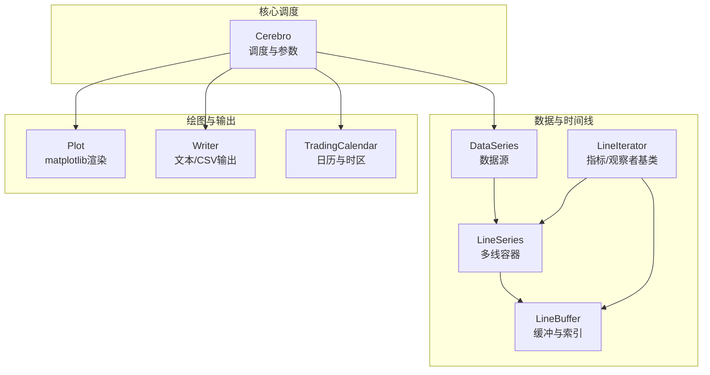
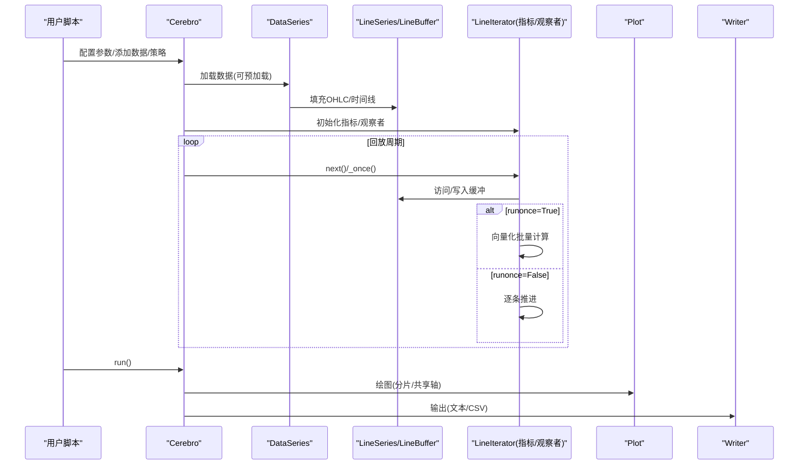
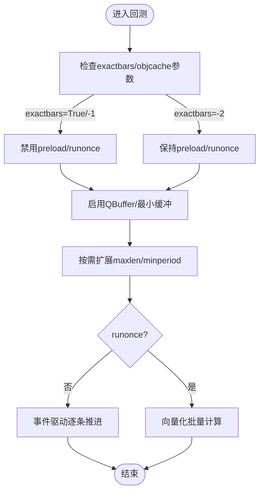
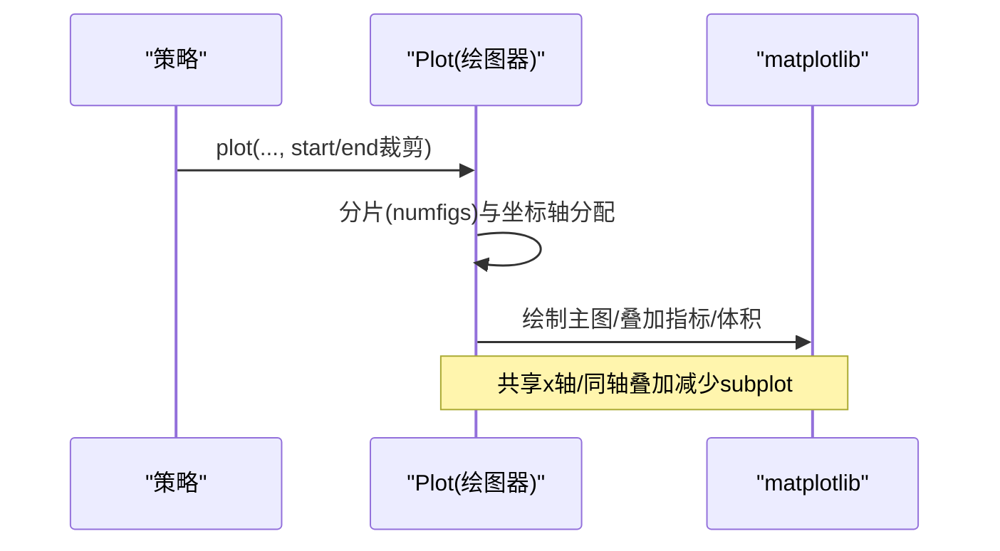
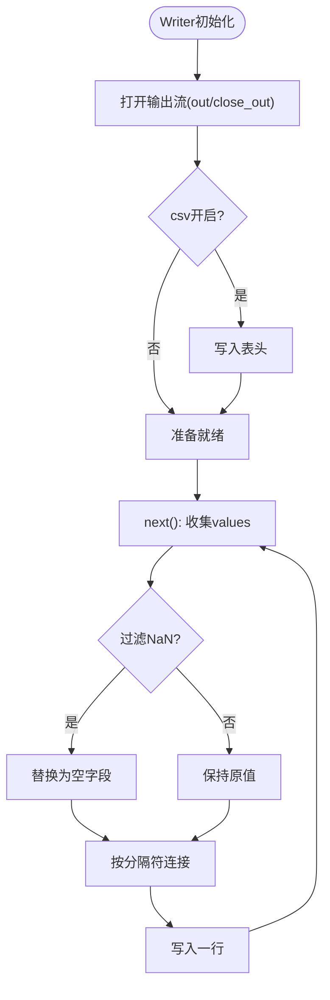
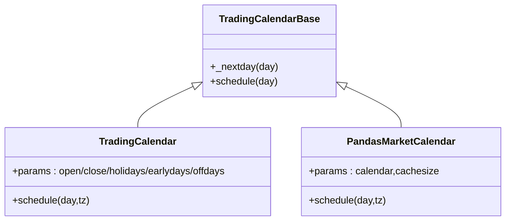
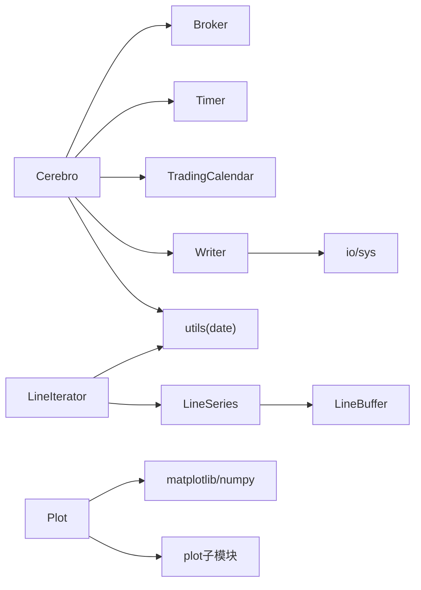

# 性能优化实践

<cite>
**本文档引用的文件**
- [backtrader/__init__.py](file://backtrader/__init__.py)
- [backtrader/cerebro.py](file://backtrader/cerebro.py)
- [backtrader/plot/plot.py](file://backtrader/plot/plot.py)
- [backtrader/writer.py](file://backtrader/writer.py)
- [backtrader/tradingcal.py](file://backtrader/tradingcal.py)
- [backtrader/linebuffer.py](file://backtrader/linebuffer.py)
- [backtrader/lineseries.py](file://backtrader/lineseries.py)
- [backtrader/lineiterator.py](file://backtrader/lineiterator.py)
- [backtrader/utils/date.py](file://backtrader/utils/date.py)
- [samples/memory-savings/memory-savings.py](file://samples/memory-savings/memory-savings.py)
- [samples/lineplotter/lineplotter.py](file://samples/lineplotter/lineplotter.py)
- [samples/partial-plot/partial-plot.py](file://samples/partial-plot/partial-plot.py)
- [samples/plot-same-axis/plot-same-axis.py](file://samples/plot-same-axis/plot-same-axis.py)
- [samples/tradingcalendar/tcal.py](file://samples/tradingcalendar/tcal.py)
</cite>

## 目录
1. [简介](#简介)
2. [项目结构](#项目结构)
3. [核心组件](#核心组件)
4. [架构总览](#架构总览)
5. [详细组件分析](#详细组件分析)
6. [依赖关系分析](#依赖关系分析)
7. [性能考量](#性能考量)
8. [故障排查指南](#故障排查指南)
9. [结论](#结论)
10. [附录](#附录)

## 简介
本指南聚焦于Backtrader在大规模回测与实时场景下的性能优化实践，围绕以下主题展开：内存节省（数据缓存、最小缓冲区、对象复用）、图形渲染优化（lineplotter高效使用、部分绘图、同轴绘图）、writer输出优化、交易日历高效实现与时区处理，以及针对不同硬件配置的大规模数据回测策略建议。

## 项目结构
Backtrader采用模块化设计，核心由Cerebro调度器、数据流（DataSeries/LineSeries）、指标与观察者（LineIterator）构成；绘图子系统位于plot包，writer负责运行期输出，tradingcal提供交易日历与时区支持。

图表来源
- [backtrader/cerebro.py](file://backtrader/cerebro.py#L60-L294)
- [backtrader/lineseries.py](file://backtrader/lineseries.py#L444-L478)
- [backtrader/linebuffer.py](file://backtrader/linebuffer.py#L50-L127)
- [backtrader/lineiterator.py](file://backtrader/lineiterator.py#L148-L200)
- [backtrader/plot/plot.py](file://backtrader/plot/plot.py#L119-L274)
- [backtrader/writer.py](file://backtrader/writer.py#L43-L106)
- [backtrader/tradingcal.py](file://backtrader/tradingcal.py#L106-L144)

章节来源
- [backtrader/__init__.py](file://backtrader/__init__.py#L24-L91)
- [backtrader/cerebro.py](file://backtrader/cerebro.py#L60-L294)

## 核心组件
- 调度器（Cerebro）：控制回测流程、参数（preload/runonce/exactbars等）、多进程优化、writer集成、时区与日历设置。
- 数据与时间线（DataSeries/LineSeries/LineBuffer）：提供可变长缓冲、最小缓冲模式、绑定机制、日期时间转换。
- 指标与观察者（LineIterator）：统一的迭代与计算框架，支持向量化（runonce）与事件驱动模式。
- 绘图（Plot）：基于matplotlib，支持分片绘制、共享坐标轴、叠加体积、标签与填充。
- 输出（Writer）：文本/CSV输出，支持过滤NaN、计数器、格式化。
- 交易日历与时区（TradingCalendar/Utils）：封装pandas_market_calendars或自定义日历，提供缓存与时区转换。

章节来源
- [backtrader/cerebro.py](file://backtrader/cerebro.py#L274-L294)
- [backtrader/lineseries.py](file://backtrader/lineseries.py#L444-L478)
- [backtrader/linebuffer.py](file://backtrader/linebuffer.py#L50-L127)
- [backtrader/lineiterator.py](file://backtrader/lineiterator.py#L148-L200)
- [backtrader/plot/plot.py](file://backtrader/plot/plot.py#L119-L274)
- [backtrader/writer.py](file://backtrader/writer.py#L43-L106)
- [backtrader/tradingcal.py](file://backtrader/tradingcal.py#L106-L144)

## 架构总览
下图展示了从数据加载到指标计算、绘图与输出的关键交互路径，以及性能关键点（runonce、exactbars、QBuffer、绘图分片）。

图表来源
- [backtrader/cerebro.py](file://backtrader/cerebro.py#L60-L294)
- [backtrader/lineiterator.py](file://backtrader/lineiterator.py#L602-L634)
- [backtrader/plot/plot.py](file://backtrader/plot/plot.py#L119-L274)
- [backtrader/writer.py](file://backtrader/writer.py#L108-L160)

## 详细组件分析

### 内存节省与数据缓存（LineBuffer/QBuffer）
- 最小缓冲模式：通过QBuffer与minbuffer动态调整缓冲上限，避免无谓存储。
- 对象缓存：objcache可重用相同签名的Line对象，减少重复实例化。
- exactbars策略：
  - True/-1/-2分别控制保留最小周期、允许绘图、禁用绘图等行为，影响preload/runonce。
- 运行期内存评估：示例展示如何统计各数据/指标/观察者的内存单元数量，便于定位内存热点。

图表来源
- [backtrader/cerebro.py](file://backtrader/cerebro.py#L121-L176)
- [backtrader/linebuffer.py](file://backtrader/linebuffer.py#L121-L147)
- [backtrader/lineiterator.py](file://backtrader/lineiterator.py#L602-L634)

章节来源
- [backtrader/cerebro.py](file://backtrader/cerebro.py#L121-L176)
- [backtrader/linebuffer.py](file://backtrader/linebuffer.py#L121-L147)
- [samples/memory-savings/memory-savings.py](file://samples/memory-savings/memory-savings.py#L72-L121)

### 图形渲染优化（lineplotter、部分绘图、同轴绘图）
- lineplotter高效使用：将派生指标作为LinePlotterIndicator直接叠加，避免额外绘图开销。
- 部分绘图：通过起止日期裁剪绘制区间，减少matplotlib绘制量。
- 同轴绘图：利用plotmaster与sameaxis在同一坐标轴上叠加不同时间尺度的数据/指标，降低subplot数量与布局成本。

图表来源
- [backtrader/plot/plot.py](file://backtrader/plot/plot.py#L119-L274)
- [samples/lineplotter/lineplotter.py](file://samples/lineplotter/lineplotter.py#L35-L43)
- [samples/partial-plot/partial-plot.py](file://samples/partial-plot/partial-plot.py#L57-L68)
- [samples/plot-same-axis/plot-same-axis.py](file://samples/plot-same-axis/plot-same-axis.py#L54-L64)

章节来源
- [backtrader/plot/plot.py](file://backtrader/plot/plot.py#L119-L274)
- [samples/lineplotter/lineplotter.py](file://samples/lineplotter/lineplotter.py#L35-L43)
- [samples/partial-plot/partial-plot.py](file://samples/partial-plot/partial-plot.py#L57-L68)
- [samples/plot-same-axis/plot-same-axis.py](file://samples/plot-same-axis/plot-same-axis.py#L54-L64)

### writer性能测试与输出优化
- CSV输出：支持过滤NaN、计数器、分隔符、缩进、四舍五入等，减少冗余字段与字符串拼接。
- 多进程安全：在多进程优化中自动处理stdout，避免竞态。
- 输出时机：next()按批输出，避免每步频繁I/O。

图表来源
- [backtrader/writer.py](file://backtrader/writer.py#L108-L160)
- [backtrader/writer.py](file://backtrader/writer.py#L162-L218)

章节来源
- [backtrader/writer.py](file://backtrader/writer.py#L43-L106)
- [backtrader/writer.py](file://backtrader/writer.py#L108-L160)
- [backtrader/writer.py](file://backtrader/writer.py#L162-L218)

### 交易日历的高效实现与时区处理
- 自定义日历：继承TradingCalendar，配置节假日、早收市、休市日。
- pandas_market_calendars：内置缓存（有效交易日索引与会话表），按cachesize窗口预取，显著降低查找开销。
- 时区处理：tzparse与UTC本地化/转换，确保跨时区一致性。

图表来源
- [backtrader/tradingcal.py](file://backtrader/tradingcal.py#L47-L104)
- [backtrader/tradingcal.py](file://backtrader/tradingcal.py#L106-L194)
- [backtrader/tradingcal.py](file://backtrader/tradingcal.py#L197-L280)

章节来源
- [backtrader/tradingcal.py](file://backtrader/tradingcal.py#L106-L194)
- [backtrader/tradingcal.py](file://backtrader/tradingcal.py#L197-L280)
- [samples/tradingcalendar/tcal.py](file://samples/tradingcalendar/tcal.py#L30-L43)

## 依赖关系分析
- Cerebro依赖：Broker、Timer、TradingCalendar、Writer、utils（时区解析）。
- 指标/观察者依赖：LineIterator（统一迭代）、LineSeries/LineBuffer（数据访问）、utils（日期时间工具）。
- 绘图依赖：matplotlib、numpy、plot子模块（样式/定位器/格式化）。
- writer依赖：标准库io与sys，支持字符串流与文件输出。

图表来源
- [backtrader/cerebro.py](file://backtrader/cerebro.py#L40-L48)
- [backtrader/lineiterator.py](file://backtrader/lineiterator.py#L38-L36)
- [backtrader/plot/plot.py](file://backtrader/plot/plot.py#L32-L47)
- [backtrader/writer.py](file://backtrader/writer.py#L24-L36)
- [backtrader/utils/date.py](file://backtrader/utils/date.py#L25-L29)

章节来源
- [backtrader/cerebro.py](file://backtrader/cerebro.py#L40-L48)
- [backtrader/lineiterator.py](file://backtrader/lineiterator.py#L38-L36)
- [backtrader/plot/plot.py](file://backtrader/plot/plot.py#L32-L47)
- [backtrader/writer.py](file://backtrader/writer.py#L24-L36)
- [backtrader/utils/date.py](file://backtrader/utils/date.py#L25-L29)

## 性能考量
- 参数调优
  - runonce=True：优先向量化计算，显著提速；若需要逐条事件推进，设为False。
  - preload=True：预加载数据，减少I/O；大规模数据可考虑False以节省内存。
  - exactbars：选择合适的内存/绘图策略组合。
  - objcache：实验性功能，避免重复实例化，注意边界情况。
  - optdatas/optreturn：优化阶段预加载与结果简化，减少通信与序列化开销。
- 缓冲与内存
  - 使用QBuffer与minbuffer限制最大长度，避免无限增长。
  - 在指标链路中合理设置最小周期，避免过早计算。
- 绘图优化
  - 分片(numfigs)与共享x轴，减少subplot数量。
  - 部分绘图裁剪区间，仅渲染必要范围。
  - 同轴绘图合并坐标轴，降低布局与渲染复杂度。
- 输出优化
  - CSV过滤NaN、关闭计数器、减少列数。
  - 批量输出（next()）而非逐行flush。
- 日历与时间
  - pandas日历缓存cachesize，按需扩大窗口。
  - 明确tz参数，避免重复时区转换。

[本节为通用指导，无需列出具体文件来源]

## 故障排查指南
- 绘图异常
  - 若出现坐标轴错位或标签重叠，检查plotmaster/sameaxis设置与numfigs分片。
  - 部分绘图时start/end类型不匹配，需确保传入数值或日期并正确转换。
- writer输出问题
  - 多进程时stdout竞争：保持out=None让子进程自动初始化。
  - CSV列过多导致内存压力：关闭csv或减少输出字段。
- 内存溢出
  - 提升exactbars级别或启用QBuffer/minbuffer。
  - 关闭不需要的绘图项（plot=False）。
- 交易日历与时区
  - pandas日历未命中缓存：增大cachesize或预热。
  - 时区转换错误：确认tzparse输入与UTC转换逻辑。

章节来源
- [backtrader/plot/plot.py](file://backtrader/plot/plot.py#L119-L274)
- [backtrader/writer.py](file://backtrader/writer.py#L108-L160)
- [backtrader/tradingcal.py](file://backtrader/tradingcal.py#L224-L240)

## 结论
通过合理配置Cerebro参数、利用QBuffer与最小缓冲、优化绘图分片与同轴叠加、精简writer输出、以及高效使用交易日历与时区工具，可在Backtrader中实现稳定且高效的回测与实盘表现。对于超大规模数据，建议结合硬件资源（CPU/GPU/内存/磁盘I/O）进行参数与架构权衡，并持续监控内存与I/O瓶颈。

[本节为总结性内容，无需列出具体文件来源]

## 附录
- 示例参考
  - 内存节省：[memory-savings.py](file://samples/memory-savings/memory-savings.py#L72-L121)
  - lineplotter：[lineplotter.py](file://samples/lineplotter/lineplotter.py#L35-L43)
  - 部分绘图：[partial-plot.py](file://samples/partial-plot/partial-plot.py#L57-L68)
  - 同轴绘图：[plot-same-axis.py](file://samples/plot-same-axis/plot-same-axis.py#L54-L64)
  - 交易日历：[tcal.py](file://samples/tradingcalendar/tcal.py#L105-L109)

[本节为补充说明，无需列出具体文件来源]