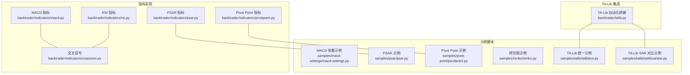
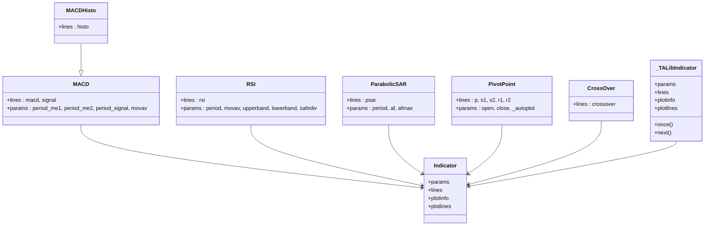
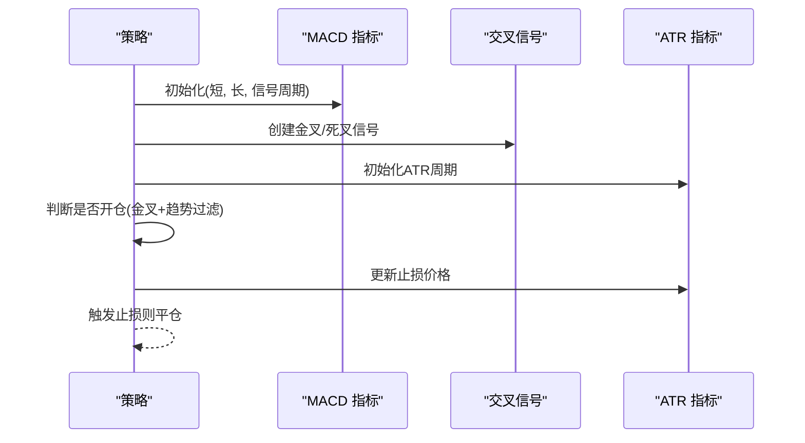
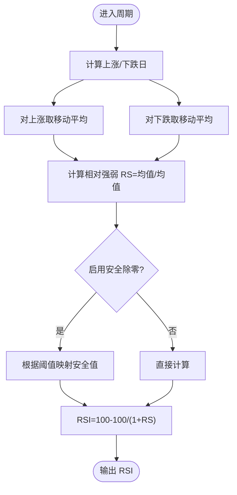
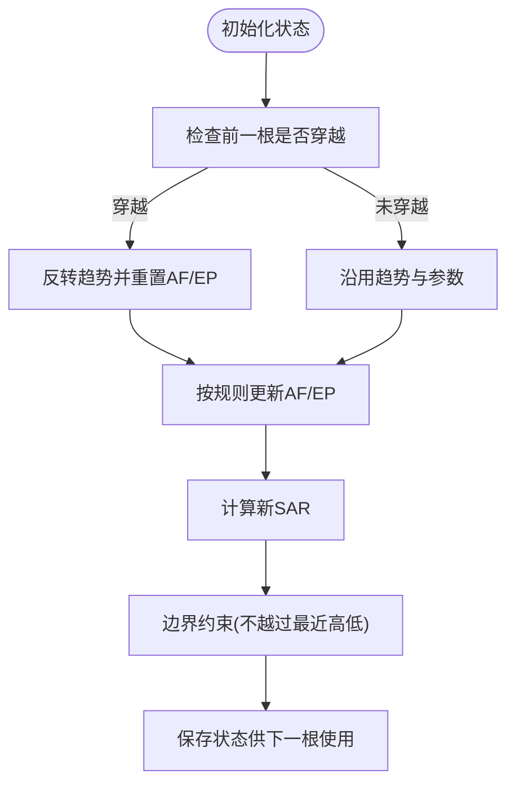
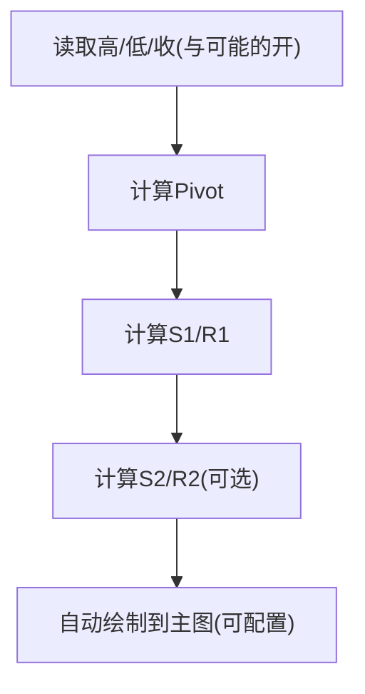
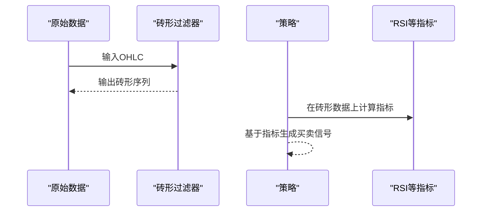
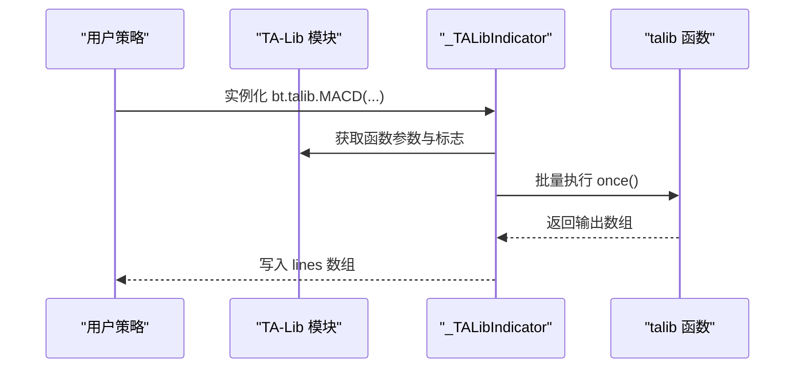
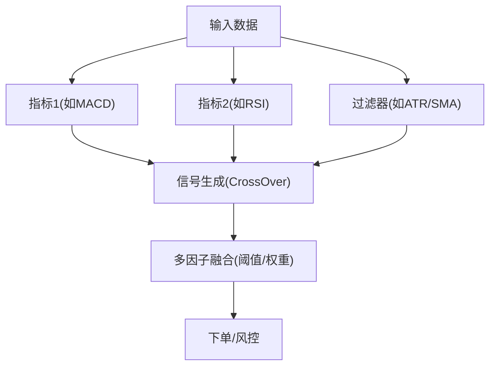
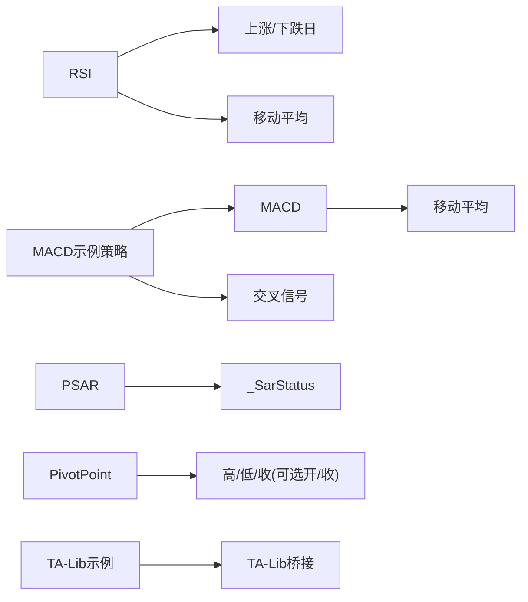

# 技术分析示例

<cite>
**本文引用的文件**
- [backtrader/indicators/macd.py](file://backtrader/indicators/macd.py)
- [backtrader/indicators/rsi.py](file://backtrader/indicators/rsi.py)
- [backtrader/indicators/psar.py](file://backtrader/indicators/psar.py)
- [backtrader/indicators/pivotpoint.py](file://backtrader/indicators/pivotpoint.py)
- [backtrader/indicators/crossover.py](file://backtrader/indicators/crossover.py)
- [backtrader/talib.py](file://backtrader/talib.py)
- [samples/macd-settings/macd-settings.py](file://samples/macd-settings/macd-settings.py)
- [samples/pivot-point/pivotpoint.py](file://samples/pivot-point/pivotpoint.py)
- [samples/psar/psar.py](file://samples/psar/psar.py)
- [samples/renko/renko.py](file://samples/renko/renko.py)
- [samples/talib/talibtest.py](file://samples/talib/talibtest.py)
- [samples/talib/tablibsartest.py](file://samples/talib/tablibsartest.py)
- [tests/test_ind_macdhisto.py](file://tests/test_ind_macdhisto.py)
- [tests/test_ind_rsi.py](file://tests/test_ind_rsi.py)
- [tests/test_ind_ppo.py](file://tests/test_ind_ppo.py)
</cite>

## 目录
1. [引言](#引言)
2. [项目结构](#项目结构)
3. [核心组件](#核心组件)
4. [架构总览](#架构总览)
5. [详细组件分析](#详细组件分析)
6. [依赖关系分析](#依赖关系分析)
7. [性能考量](#性能考量)
8. [故障排查指南](#故障排查指南)
9. [结论](#结论)
10. [附录](#附录)

## 引言
本文件面向希望系统掌握BackTrader中技术指标与分析方法的读者，围绕以下主题展开：MACD参数调优与使用、RSI高级应用与变体、抛物线转向（PSAR）多时间框架应用、Pivot Point支撑阻力位计算与应用、砖形图（Renko）构建与交易信号、TA-Lib集成与性能优势、指标组合与信号融合的最佳实践，以及技术分析的可视化与结果解读技巧。文中所有分析均基于仓库中的源码与示例脚本，并通过图表与流程图帮助理解。

## 项目结构
BackTrader将指标实现集中在 backtrader/indicators 子模块，示例与测试分别位于 samples 与 tests 目录。TA-Lib桥接在 backtrader/talib.py 中自动注入大量TA函数类；策略示例则演示了如何在策略中组合使用这些指标。

**图表来源**
- [backtrader/indicators/macd.py](file://backtrader/indicators/macd.py#L27-L85)
- [backtrader/indicators/rsi.py](file://backtrader/indicators/rsi.py#L122-L233)
- [backtrader/indicators/psar.py](file://backtrader/indicators/psar.py#L45-L173)
- [backtrader/indicators/pivotpoint.py](file://backtrader/indicators/pivotpoint.py#L27-L267)
- [backtrader/indicators/crossover.py](file://backtrader/indicators/crossover.py#L112-L139)
- [backtrader/talib.py](file://backtrader/talib.py#L65-L239)
- [samples/macd-settings/macd-settings.py](file://samples/macd-settings/macd-settings.py#L54-L132)
- [samples/psar/psar.py](file://samples/psar/psar.py#L31-L44)
- [samples/pivot-point/pivotpoint.py](file://samples/pivot-point/pivotpoint.py#L27-L64)
- [samples/renko/renko.py](file://samples/renko/renko.py#L30-L40)
- [samples/talib/talibtest.py](file://samples/talib/talibtest.py#L30-L115)
- [samples/talib/tablibsartest.py](file://samples/talib/tablibsartest.py#L30-L34)

**章节来源**
- [backtrader/indicators/macd.py](file://backtrader/indicators/macd.py#L1-L85)
- [backtrader/indicators/rsi.py](file://backtrader/indicators/rsi.py#L1-L233)
- [backtrader/indicators/psar.py](file://backtrader/indicators/psar.py#L1-L173)
- [backtrader/indicators/pivotpoint.py](file://backtrader/indicators/pivotpoint.py#L1-L267)
- [backtrader/indicators/crossover.py](file://backtrader/indicators/crossover.py#L1-L139)
- [backtrader/talib.py](file://backtrader/talib.py#L1-L239)
- [samples/macd-settings/macd-settings.py](file://samples/macd-settings/macd-settings.py#L1-L290)
- [samples/psar/psar.py](file://samples/psar/psar.py#L1-L120)
- [samples/pivot-point/pivotpoint.py](file://samples/pivot-point/pivotpoint.py#L1-L64)
- [samples/renko/renko.py](file://samples/renko/renko.py#L1-L136)
- [samples/talib/talibtest.py](file://samples/talib/talibtest.py#L1-L193)
- [samples/talib/tablibsartest.py](file://samples/talib/tablibsartest.py#L1-L103)

## 核心组件
- MACD：衡量短期与长期均线距离以识别趋势，提供信号线与柱状图扩展。
- RSI：衡量动量，提供多种平滑方式与安全除零处理。
- PSAR：抛物线停损反转，用于趋势跟踪与反转信号。
- Pivot Point：基于更大周期数据计算支撑/阻力位，支持斐波那契与Demark变体。
- TA-Lib：自动桥接TA-Lib函数为BackTrader指标类，统一参数与绘图。
- 交叉信号：CrossOver等工具用于生成金叉/死叉信号。

**章节来源**
- [backtrader/indicators/macd.py](file://backtrader/indicators/macd.py#L27-L85)
- [backtrader/indicators/rsi.py](file://backtrader/indicators/rsi.py#L122-L233)
- [backtrader/indicators/psar.py](file://backtrader/indicators/psar.py#L45-L173)
- [backtrader/indicators/pivotpoint.py](file://backtrader/indicators/pivotpoint.py#L27-L267)
- [backtrader/talib.py](file://backtrader/talib.py#L65-L239)
- [backtrader/indicators/crossover.py](file://backtrader/indicators/crossover.py#L112-L139)

## 架构总览
BackTrader的指标体系以 Indicator 基类为核心，具体指标通过组合移动平均、差分与条件判断实现。TA-Lib桥接通过元类在导入时动态生成指标类，统一参数与绘图配置。示例策略通过组合多个指标形成信号链路。

**图表来源**
- [backtrader/indicators/macd.py](file://backtrader/indicators/macd.py#L27-L85)
- [backtrader/indicators/rsi.py](file://backtrader/indicators/rsi.py#L122-L233)
- [backtrader/indicators/psar.py](file://backtrader/indicators/psar.py#L45-L173)
- [backtrader/indicators/pivotpoint.py](file://backtrader/indicators/pivotpoint.py#L27-L267)
- [backtrader/indicators/crossover.py](file://backtrader/indicators/crossover.py#L112-L139)
- [backtrader/talib.py](file://backtrader/talib.py#L92-L239)

## 详细组件分析

### MACD 指标：参数调优与使用
- 计算逻辑：短均线与长均线之差作为MACD，再对MACD做移动平均得到信号线；可选生成柱状图（MACD-信号）。
- 关键参数：短周期、长周期、信号周期、移动平均类型。
- 使用建议：
  - 趋势确认：MACD与信号线金叉/死叉。
  - 动能变化：柱状图放大/收窄。
  - 参数调优：结合回测优化不同周期组合，注意最小周期要求与过拟合风险。
- 示例策略：MACD与SMA方向过滤、ATR止损结合，形成稳健的趋势跟踪策略。

**图表来源**
- [samples/macd-settings/macd-settings.py](file://samples/macd-settings/macd-settings.py#L92-L131)
- [backtrader/indicators/macd.py](file://backtrader/indicators/macd.py#L57-L64)
- [backtrader/indicators/crossover.py](file://backtrader/indicators/crossover.py#L112-L139)

**章节来源**
- [backtrader/indicators/macd.py](file://backtrader/indicators/macd.py#L27-L85)
- [samples/macd-settings/macd-settings.py](file://samples/macd-settings/macd-settings.py#L54-L132)
- [tests/test_ind_macdhisto.py](file://tests/test_ind_macdhisto.py#L30-L48)

### RSI 指标：高级应用与变体
- 核心思想：通过上涨/下跌平均值的比率衡量动量，标准化到0-100区间。
- 变体与高级用法：
  - 平滑方式：Wilder SMMA、SMA、EMA，默认SMMA。
  - 安全除零：safediv开启时，针对0/0与x/0场景给出安全取值。
  - 区间阈值：默认超买/超卖阈值可自定义。
  - 多周期与过滤：结合趋势过滤器避免震荡市误判。
- 实战要点：结合价格行为、成交量或柱状图变化，避免仅看数值穿越。

**图表来源**
- [backtrader/indicators/rsi.py](file://backtrader/indicators/rsi.py#L178-L191)
- [backtrader/indicators/rsi.py](file://backtrader/indicators/rsi.py#L193-L199)

**章节来源**
- [backtrader/indicators/rsi.py](file://backtrader/indicators/rsi.py#L122-L233)
- [tests/test_ind_rsi.py](file://tests/test_ind_rsi.py#L29-L36)

### 抛物线转向（PSAR）：多时间框架应用
- 算法要点：加速因子递增、极值点更新、突破反转。
- 多时间框架思路：在更高周期上识别趋势，在低周期上用PSAR捕捉入场/出场。
- 注意事项：初始值设定与价格穿透判定，避免频繁反转。

**图表来源**
- [backtrader/indicators/psar.py](file://backtrader/indicators/psar.py#L119-L173)

**章节来源**
- [backtrader/indicators/psar.py](file://backtrader/indicators/psar.py#L45-L173)
- [samples/psar/psar.py](file://samples/psar/psar.py#L31-L44)

### Pivot Point：支撑阻力位的计算与应用
- 公式族：标准、含开盘价、含收盘价；斐波那契与Demark变体。
- 多时间框架：以大周期数据计算Pivot，绘制到小周期图表上辅助定位支撑/阻力。
- 应用：结合成交量、K线形态与趋势确认，提高命中率。

**图表来源**
- [backtrader/indicators/pivotpoint.py](file://backtrader/indicators/pivotpoint.py#L80-L99)
- [backtrader/indicators/pivotpoint.py](file://backtrader/indicators/pivotpoint.py#L164-L185)
- [backtrader/indicators/pivotpoint.py](file://backtrader/indicators/pivotpoint.py#L251-L266)

**章节来源**
- [backtrader/indicators/pivotpoint.py](file://backtrader/indicators/pivotpoint.py#L27-L267)
- [samples/pivot-point/pivotpoint.py](file://samples/pivot-point/pivotpoint.py#L27-L64)

### 砖形图（Renko）：构建与交易信号
- 思想：按固定价格步进构建“砖块”，过滤噪音，突出趋势。
- 实现：通过过滤器将原始数据转换为砖形序列；可在同一数据源上叠加其他指标。
- 信号：结合RSI等震荡指标在砖形图上识别转折。

**图表来源**
- [samples/renko/renko.py](file://samples/renko/renko.py#L34-L40)
- [samples/renko/renko.py](file://samples/renko/renko.py#L59-L69)

**章节来源**
- [samples/renko/renko.py](file://samples/renko/renko.py#L1-L136)

### TA-Lib 集成：使用方法与性能优势
- 自动化桥接：导入时扫描TA-Lib函数，动态生成指标类，继承统一的参数与绘图接口。
- 性能优势：底层C实现，批处理执行，适合大规模数据与高频回测。
- 使用方法：直接以 bt.talib.<函数名> 的形式在策略中使用，参数与返回行与原函数一致。

**图表来源**
- [backtrader/talib.py](file://backtrader/talib.py#L187-L232)
- [samples/talib/talibtest.py](file://samples/talib/talibtest.py#L37-L115)
- [samples/talib/tablibsartest.py](file://samples/talib/tablibsartest.py#L30-L34)

**章节来源**
- [backtrader/talib.py](file://backtrader/talib.py#L1-L239)
- [samples/talib/talibtest.py](file://samples/talib/talibtest.py#L1-L193)
- [samples/talib/tablibsartest.py](file://samples/talib/tablibsartest.py#L1-L103)

### 指标组合与信号融合：最佳实践
- 信号合成：使用 CrossOver 生成金叉/死叉信号，再叠加趋势过滤（如SMA方向）与波动率过滤（如ATR）。
- 多时间框架：以大周期趋势为主，小周期信号为辅，降低假信号概率。
- 风险控制：止损止盈与资金管理（固定比例下单）配合指标信号。
- 测试验证：通过测试用例与回测报告校验组合效果，避免过拟合。

**图表来源**
- [samples/macd-settings/macd-settings.py](file://samples/macd-settings/macd-settings.py#L92-L131)
- [backtrader/indicators/crossover.py](file://backtrader/indicators/crossover.py#L112-L139)
- [tests/test_ind_ppo.py](file://tests/test_ind_ppo.py#L29-L37)

**章节来源**
- [samples/macd-settings/macd-settings.py](file://samples/macd-settings/macd-settings.py#L54-L132)
- [backtrader/indicators/crossover.py](file://backtrader/indicators/crossover.py#L112-L139)
- [tests/test_ind_ppo.py](file://tests/test_ind_ppo.py#L29-L37)

## 依赖关系分析
- 指标内部依赖：MACD 依赖移动平均；RSI 依赖上涨/下跌日与移动平均；PSAR 依赖状态机与TR/EP/AF；Pivot Point 依赖高/低/收（与可选开/收）。
- 示例与指标耦合：示例策略通过组合多个指标形成信号链；TA-Lib示例对比原生与TA-Lib实现的一致性。
- 测试用例：覆盖最小周期、输出值与指标类型，确保实现正确性。

**图表来源**
- [backtrader/indicators/macd.py](file://backtrader/indicators/macd.py#L57-L64)
- [backtrader/indicators/rsi.py](file://backtrader/indicators/rsi.py#L178-L191)
- [backtrader/indicators/psar.py](file://backtrader/indicators/psar.py#L92-L118)
- [backtrader/indicators/pivotpoint.py](file://backtrader/indicators/pivotpoint.py#L80-L99)
- [samples/macd-settings/macd-settings.py](file://samples/macd-settings/macd-settings.py#L92-L106)
- [samples/talib/talibtest.py](file://samples/talib/talibtest.py#L37-L115)

**章节来源**
- [backtrader/indicators/macd.py](file://backtrader/indicators/macd.py#L27-L85)
- [backtrader/indicators/rsi.py](file://backtrader/indicators/rsi.py#L122-L233)
- [backtrader/indicators/psar.py](file://backtrader/indicators/psar.py#L45-L173)
- [backtrader/indicators/pivotpoint.py](file://backtrader/indicators/pivotpoint.py#L27-L267)
- [samples/macd-settings/macd-settings.py](file://samples/macd-settings/macd-settings.py#L54-L132)
- [samples/talib/talibtest.py](file://samples/talib/talibtest.py#L1-L193)

## 性能考量
- 批处理执行：TA-Lib桥接采用一次性数组批处理，显著提升大规模数据回测效率。
- 最小周期：指标元类根据TA函数标志与参数推导最小预热期，避免早期无效输出。
- 绘图与内存：合理选择绘图项与子图，减少不必要的数组写入与图形渲染开销。

**章节来源**
- [backtrader/talib.py](file://backtrader/talib.py#L71-L91)
- [backtrader/talib.py](file://backtrader/talib.py#L187-L232)

## 故障排查指南
- MACD 柱状图异常：确认信号周期与短/长周期设置，检查最小周期是否满足。
- RSI 除零/边界问题：启用 safediv 或调整阈值，避免极端行情下的数值不稳定。
- PSAR 初始值与反转：检查加速因子与极值更新规则，关注首次穿越的判定。
- Pivot Point 自动绘图：若未显示在主图，检查 _autoplot 与 plotmaster 设置。
- TA-Lib 未安装：导入失败时会清空可用列表，需安装TA-Lib后重试。

**章节来源**
- [backtrader/indicators/macd.py](file://backtrader/indicators/macd.py#L51-L55)
- [backtrader/indicators/rsi.py](file://backtrader/indicators/rsi.py#L144-L167)
- [backtrader/indicators/psar.py](file://backtrader/indicators/psar.py#L75-L86)
- [backtrader/indicators/pivotpoint.py](file://backtrader/indicators/pivotpoint.py#L74-L104)
- [backtrader/talib.py](file://backtrader/talib.py#L33-L37)

## 结论
BackTrader在指标实现上提供了清晰的抽象与丰富的扩展能力。通过组合MACD、RSI、PSAR、Pivot Point等指标，并结合TA-Lib的高性能实现与多时间框架策略，可以构建稳健且可量化的交易系统。建议在实盘前充分进行回测与压力测试，并持续优化参数与信号融合策略。

## 附录
- 可视化与结果解读：
  - 使用 plotinfo/plotlines 控制线条样式与标注。
  - 将关键支撑/阻力位与信号点叠加在同一图表，便于观察一致性。
  - 结合收益曲线、最大回撤与夏普比率等指标评估策略稳定性。