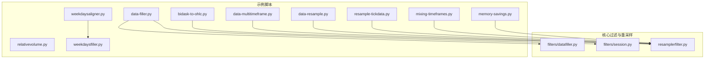
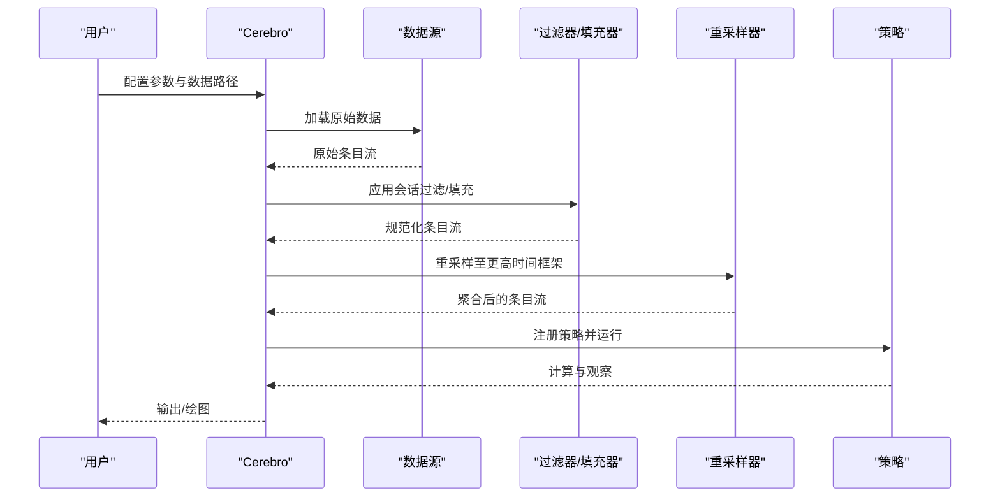
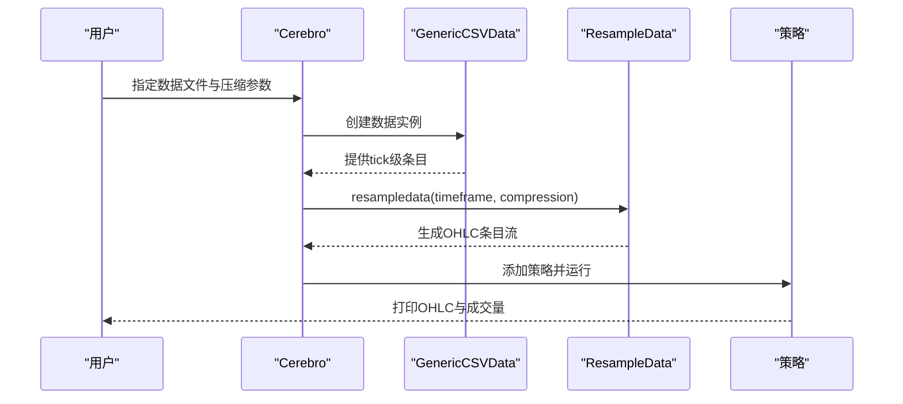
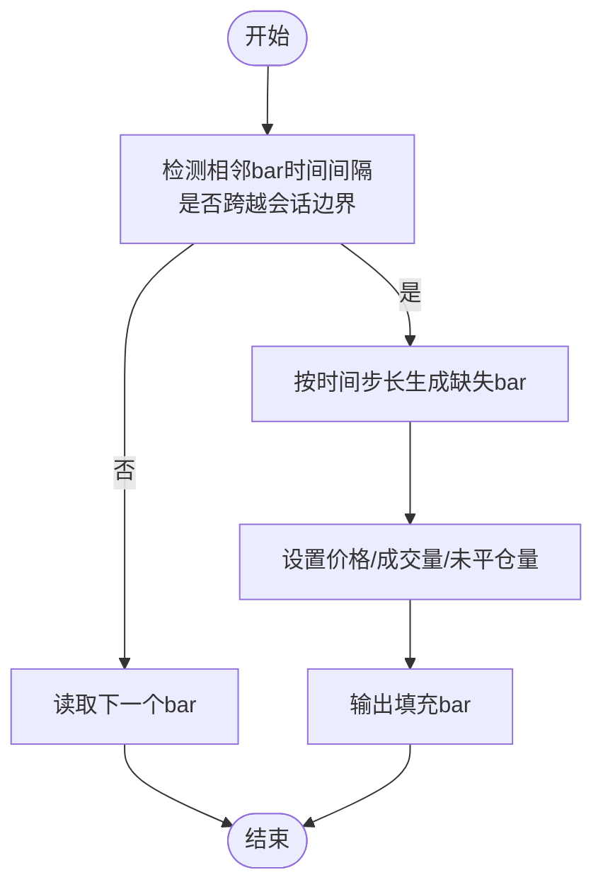
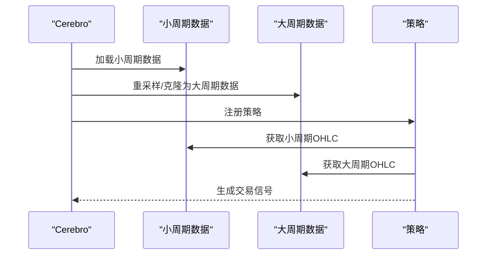
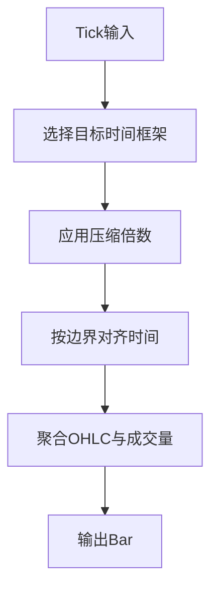
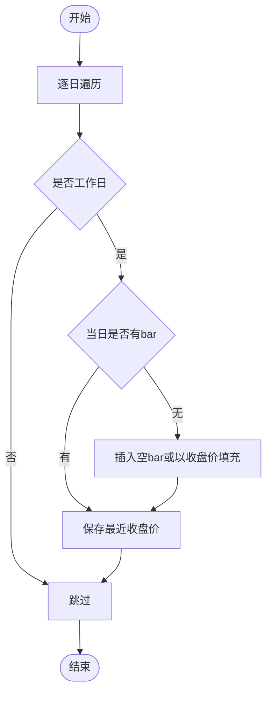
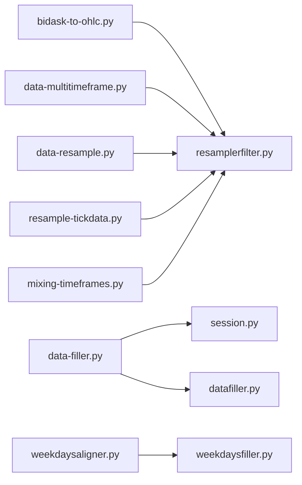

# 数据处理示例

<cite>
**本文引用的文件**
- [samples/bidask-to-ohlc/bidask-to-ohlc.py](file://samples/bidask-to-ohlc/bidask-to-ohlc.py)
- [samples/data-filler/data-filler.py](file://samples/data-filler/data-filler.py)
- [samples/data-filler/relativevolume.py](file://samples/data-filler/relativevolume.py)
- [samples/data-multitimeframe/data-multitimeframe.py](file://samples/data-multitimeframe/data-multitimeframe.py)
- [samples/data-resample/data-resample.py](file://samples/data-resample/data-resample.py)
- [samples/resample-tickdata/resample-tickdata.py](file://samples/resample-tickdata/resample-tickdata.py)
- [samples/weekdays-filler/weekdaysfiller.py](file://samples/weekdays-filler/weekdaysfiller.py)
- [samples/weekdays-filler/weekdaysaligner.py](file://samples/weekdays-filler/weekdaysaligner.py)
- [samples/mixing-timeframes/mixing-timeframes.py](file://samples/mixing-timeframes/mixing-timeframes.py)
- [samples/memory-savings/memory-savings.py](file://samples/memory-savings/memory-savings.py)
- [backtrader/filters/datafiller.py](file://backtrader/filters/datafiller.py)
- [backtrader/filters/session.py](file://backtrader/filters/session.py)
- [backtrader/resamplerfilter.py](file://backtrader/resamplerfilter.py)
- [datas/bidask2.csv](file://datas/bidask2.csv)
- [datas/ticksample.csv](file://datas/ticksample.csv)
</cite>

## 目录
1. [简介](#简介)
2. [项目结构](#项目结构)
3. [核心组件](#核心组件)
4. [架构总览](#架构总览)
5. [详细组件分析](#详细组件分析)
6. [依赖关系分析](#依赖关系分析)
7. [性能考虑与内存优化](#性能考虑与内存优化)
8. [故障排查指南](#故障排查指南)
9. [结论](#结论)
10. [附录](#附录)

## 简介
本文件面向BackTrader用户，系统化梳理仓库中的数据处理示例，围绕以下主题展开：买卖价差数据到OHLC的转换、数据填充器（缺失数据与相对成交量）、多时间框架数据的合并与混合、tick到bar的重采样、工作日填充器与周末数据处理、数据质量检查与清洗最佳实践，以及大数据集下的性能优化与内存管理。

## 项目结构
示例主要分布在samples目录下，核心数据处理能力由backtrader内部的filters与resampler模块提供支撑。示例脚本通过Cerebro引擎加载数据、应用过滤器或重采样器，并运行策略或直接输出结果。

图示来源
- [samples/bidask-to-ohlc/bidask-to-ohlc.py](file://samples/bidask-to-ohlc/bidask-to-ohlc.py#L40-L68)
- [samples/data-filler/data-filler.py](file://samples/data-filler/data-filler.py#L37-L88)
- [samples/data-multitimeframe/data-multitimeframe.py](file://samples/data-multitimeframe/data-multitimeframe.py#L93-L172)
- [samples/data-resample/data-resample.py](file://samples/data-resample/data-resample.py#L30-L72)
- [samples/resample-tickdata/resample-tickdata.py](file://samples/resample-tickdata/resample-tickdata.py#L30-L76)
- [samples/weekdays-filler/weekdaysfiller.py](file://samples/weekdays-filler/weekdaysfiller.py#L27-L67)
- [samples/weekdays-filler/weekdaysaligner.py](file://samples/weekdays-filler/weekdaysaligner.py#L55-L88)
- [samples/mixing-timeframes/mixing-timeframes.py](file://samples/mixing-timeframes/mixing-timeframes.py#L58-L71)
- [samples/memory-savings/memory-savings.py](file://samples/memory-savings/memory-savings.py#L123-L136)
- [backtrader/filters/datafiller.py](file://backtrader/filters/datafiller.py#L30-L177)
- [backtrader/filters/session.py](file://backtrader/filters/session.py#L31-L245)
- [backtrader/resamplerfilter.py](file://backtrader/resamplerfilter.py#L96-L753)

章节来源
- [samples/bidask-to-ohlc/bidask-to-ohlc.py](file://samples/bidask-to-ohlc/bidask-to-ohlc.py#L1-L90)
- [samples/data-filler/data-filler.py](file://samples/data-filler/data-filler.py#L1-L153)
- [samples/data-multitimeframe/data-multitimeframe.py](file://samples/data-multitimeframe/data-multitimeframe.py#L1-L226)
- [samples/data-resample/data-resample.py](file://samples/data-resample/data-resample.py#L1-L96)
- [samples/resample-tickdata/resample-tickdata.py](file://samples/resample-tickdata/resample-tickdata.py#L1-L114)
- [samples/weekdays-filler/weekdaysfiller.py](file://samples/weekdays-filler/weekdaysfiller.py#L1-L67)
- [samples/weekdays-filler/weekdaysaligner.py](file://samples/weekdays-filler/weekdaysaligner.py#L1-L130)
- [samples/mixing-timeframes/mixing-timeframes.py](file://samples/mixing-timeframes/mixing-timeframes.py#L1-L93)
- [samples/memory-savings/memory-savings.py](file://samples/memory-savings/memory-savings.py#L1-L163)
- [backtrader/filters/datafiller.py](file://backtrader/filters/datafiller.py#L1-L177)
- [backtrader/filters/session.py](file://backtrader/filters/session.py#L1-L245)
- [backtrader/resamplerfilter.py](file://backtrader/resamplerfilter.py#L1-L753)

## 核心组件
- 数据填充器（SessionFiller/DataFiller）：在会话边界内或跨会话边界填充缺失的bar，支持价格、成交量、未平仓量的填充策略。
- 会话过滤器（SessionFilter/SessionFilterSimple）：过滤掉非交易时段的bar，确保仅保留有效交易时间内的数据。
- 重采样器（Resampler/Replayer）：将细粒度数据（如tick/秒/分钟）聚合为更高时间框架（日/周/月/年），支持对齐边界、调整时间等参数。
- 工作日填充器（WeekDaysFiller）：在工作日缺失时插入空bar或以最近收盘价填充，用于补齐周末与节假日空白。
- 相对成交量指标（RelativeVolume）：基于历史窗口计算相对成交量，支持NaN处理策略。

章节来源
- [backtrader/filters/datafiller.py](file://backtrader/filters/datafiller.py#L30-L177)
- [backtrader/filters/session.py](file://backtrader/filters/session.py#L31-L245)
- [backtrader/resamplerfilter.py](file://backtrader/resamplerfilter.py#L435-L753)
- [samples/weekdays-filler/weekdaysfiller.py](file://samples/weekdays-filler/weekdaysfiller.py#L27-L67)
- [samples/data-filler/relativevolume.py](file://samples/data-filler/relativevolume.py#L29-L51)

## 架构总览
下图展示了从数据源到策略执行的关键流程：数据加载 → 过滤/填充 → 重采样/回放 → 策略运行 → 可选绘图与输出。

图示来源
- [samples/data-resample/data-resample.py](file://samples/data-resample/data-resample.py#L30-L72)
- [samples/data-multitimeframe/data-multitimeframe.py](file://samples/data-multitimeframe/data-multitimeframe.py#L93-L172)
- [samples/data-filler/data-filler.py](file://samples/data-filler/data-filler.py#L37-L88)
- [backtrader/resamplerfilter.py](file://backtrader/resamplerfilter.py#L435-L753)
- [backtrader/filters/session.py](file://backtrader/filters/session.py#L216-L245)

## 详细组件分析

### 买卖价差到OHLC转换
- 目标：将买卖价差（bid/ask）与成交量等字段转换为OHLC序列，便于后续技术分析与策略回测。
- 关键点：
  - 使用GenericCSVData读取包含时间戳与bid/ask/volume的CSV。
  - 通过Cerebro.resampledata将原始tick级数据按指定压缩倍数聚合为更高时间框架的bar。
  - 在策略中打印OHLC与成交量，验证转换结果。

图示来源
- [samples/bidask-to-ohlc/bidask-to-ohlc.py](file://samples/bidask-to-ohlc/bidask-to-ohlc.py#L40-L68)
- [datas/bidask2.csv](file://datas/bidask2.csv#L1-L11)

章节来源
- [samples/bidask-to-ohlc/bidask-to-ohlc.py](file://samples/bidask-to-ohlc/bidask-to-ohlc.py#L1-L90)
- [datas/bidask2.csv](file://datas/bidask2.csv#L1-L11)

### 数据填充器：缺失数据处理与相对成交量
- 缺失数据处理：
  - SessionFiller：在会话开始/结束之间按时间步长填充空bar，可选择以NaN或上一bar收盘价填充价格列。
  - DataFiller：跨会话边界（如夜盘到次日早盘）自动补全缺失bar，支持自定义填充价格、成交量与未平仓量。
- 相对成交量：
  - RelativeVolume：基于固定窗口计算相对成交量，支持NaN除法保护（DivByZero）或以零替代策略。

图示来源
- [backtrader/filters/session.py](file://backtrader/filters/session.py#L104-L140)
- [backtrader/filters/datafiller.py](file://backtrader/filters/datafiller.py#L110-L177)

章节来源
- [samples/data-filler/data-filler.py](file://samples/data-filler/data-filler.py#L37-L88)
- [samples/data-filler/relativevolume.py](file://samples/data-filler/relativevolume.py#L29-L51)
- [backtrader/filters/session.py](file://backtrader/filters/session.py#L31-L245)
- [backtrader/filters/datafiller.py](file://backtrader/filters/datafiller.py#L30-L177)

### 多时间框架数据的合并与混合
- 合并方式：
  - 通过DataResampler/DataReplayer或新的resampledata接口将低时间框架数据重采样为高时间框架。
  - 也可直接加载更高时间框架数据作为备选数据源。
- 混合策略：
  - 在同一策略中同时访问小周期与大周期数据，实现跨周期信号联动（如小周期入场、大周期趋势过滤）。

图示来源
- [samples/data-multitimeframe/data-multitimeframe.py](file://samples/data-multitimeframe/data-multitimeframe.py#L93-L172)
- [samples/mixing-timeframes/mixing-timeframes.py](file://samples/mixing-timeframes/mixing-timeframes.py#L58-L71)

章节来源
- [samples/data-multitimeframe/data-multitimeframe.py](file://samples/data-multitimeframe/data-multitimeframe.py#L1-L226)
- [samples/mixing-timeframes/mixing-timeframes.py](file://samples/mixing-timeframes/mixing-timeframes.py#L1-L93)

### Tick到Bar的重采样
- 支持从tick/微秒/秒/分钟到日/周/月/年的多层级重采样。
- 关键参数：
  - timeframe/compression：目标时间框架与压缩倍数。
  - bar2edge/adjbartime/rightedge：控制bar时间对齐边界与时间调整行为。
  - writer：可选输出CSV以便核查重采样结果。

图示来源
- [samples/resample-tickdata/resample-tickdata.py](file://samples/resample-tickdata/resample-tickdata.py#L58-L76)
- [backtrader/resamplerfilter.py](file://backtrader/resamplerfilter.py#L435-L561)

章节来源
- [samples/resample-tickdata/resample-tickdata.py](file://samples/resample-tickdata/resample-tickdata.py#L1-L114)
- [backtrader/resamplerfilter.py](file://backtrader/resamplerfilter.py#L1-L753)

### 工作日填充器与周末数据处理
- WeekDaysFiller：
  - 遍历日期序列，若某工作日无bar，则在该日会话结束时间插入空bar或以最近收盘价填充。
  - 仅填充周一至周五，跳过周末与节假日。
- weekdaysaligner示例：
  - 将两个数据源分别添加填充器，保证两数据在日期轴上对齐，便于对比分析。

图示来源
- [samples/weekdays-filler/weekdaysfiller.py](file://samples/weekdays-filler/weekdaysfiller.py#L37-L67)

章节来源
- [samples/weekdays-filler/weekdaysfiller.py](file://samples/weekdays-filler/weekdaysfiller.py#L1-L67)
- [samples/weekdays-filler/weekdaysaligner.py](file://samples/weekdays-filler/weekdaysaligner.py#L55-L88)

### 数据质量检查与清洗最佳实践
- 会话过滤：
  - 使用SessionFilter/SessionFilterSimple剔除非交易时段数据，避免前复权/后复权与盘前盘后异常波动干扰。
- 边界对齐与时间调整：
  - 合理设置bar2edge与adjbartime，确保bar时间落在明确的时间边界上，提升可视化与回测一致性。
- 缺失数据填补：
  - 对于高频数据，使用SessionFiller/DataFiller填补跨会话与会内缺失，保持时间连续性。
- 相对成交量：
  - 使用RelativeVolume评估当日成交量相对于历史水平，识别异常放量或缩量。

章节来源
- [backtrader/filters/session.py](file://backtrader/filters/session.py#L216-L245)
- [backtrader/filters/datafiller.py](file://backtrader/filters/datafiller.py#L30-L177)
- [samples/data-filler/relativevolume.py](file://samples/data-filler/relativevolume.py#L29-L51)

## 依赖关系分析
- 示例脚本与核心模块的耦合关系清晰：示例通过Cerebro调用filters与resampler模块，形成“数据加载—过滤/填充—重采样—策略”的链路。
- 多时间框架示例同时依赖重采样器与策略层，体现跨周期分析的典型模式。

图示来源
- [samples/bidask-to-ohlc/bidask-to-ohlc.py](file://samples/bidask-to-ohlc/bidask-to-ohlc.py#L40-L68)
- [samples/data-filler/data-filler.py](file://samples/data-filler/data-filler.py#L37-L88)
- [samples/data-multitimeframe/data-multitimeframe.py](file://samples/data-multitimeframe/data-multitimeframe.py#L93-L172)
- [samples/data-resample/data-resample.py](file://samples/data-resample/data-resample.py#L30-L72)
- [samples/resample-tickdata/resample-tickdata.py](file://samples/resample-tickdata/resample-tickdata.py#L58-L76)
- [samples/weekdays-filler/weekdaysaligner.py](file://samples/weekdays-filler/weekdaysaligner.py#L74-L88)
- [samples/mixing-timeframes/mixing-timeframes.py](file://samples/mixing-timeframes/mixing-timeframes.py#L64-L71)
- [backtrader/resamplerfilter.py](file://backtrader/resamplerfilter.py#L435-L753)
- [backtrader/filters/session.py](file://backtrader/filters/session.py#L216-L245)
- [backtrader/filters/datafiller.py](file://backtrader/filters/datafiller.py#L30-L177)
- [samples/weekdays-filler/weekdaysfiller.py](file://samples/weekdays-filler/weekdaysfiller.py#L27-L67)

## 性能考虑与内存优化
- 内存占用评估：
  - memory-savings示例通过遍历数据线与指标线数组长度统计总内存单元，帮助识别内存热点。
- 运行参数优化：
  - runonce与exactbars参数可减少重复计算与缓存开销。
  - preload与runnext影响数据预加载与迭代方式，需根据数据规模与内存情况权衡。
- 指标与绘图：
  - 关闭不必要的绘图与统计项可显著降低内存与CPU消耗。

章节来源
- [samples/memory-savings/memory-savings.py](file://samples/memory-savings/memory-savings.py#L123-L136)
- [samples/memory-savings/memory-savings.py](file://samples/memory-savings/memory-savings.py#L69-L121)

## 故障排查指南
- 重采样边界不一致：
  - 检查bar2edge与rightedge参数，确保时间对齐策略符合预期。
- 会话过滤导致数据过少：
  - 核对sessionstart/sessionend配置，确认是否误删有效交易时段。
- 相对成交量异常：
  - 若存在NaN体积，确认RelativeVolume的volisnan参数与DivByZero策略设置。
- 多时间框架不同步：
  - 使用DataClone+Resampler/Replayer确保两个数据源在同一时间轴上对齐。

章节来源
- [backtrader/resamplerfilter.py](file://backtrader/resamplerfilter.py#L435-L561)
- [backtrader/filters/session.py](file://backtrader/filters/session.py#L216-L245)
- [samples/data-filler/relativevolume.py](file://samples/data-filler/relativevolume.py#L29-L51)
- [samples/data-multitimeframe/data-multitimeframe.py](file://samples/data-multitimeframe/data-multitimeframe.py#L140-L156)

## 结论
本文件系统梳理了BackTrader中数据处理的关键示例与核心模块，覆盖从原始tick到OHLC、缺失数据填补、会话过滤、多时间框架合并与混合、重采样与周末处理、以及内存优化与质量检查。建议在实际项目中结合业务需求，合理组合这些工具，以获得稳定、高效且可维护的数据处理流水线。

## 附录
- 示例数据文件：
  - [datas/bidask2.csv](file://datas/bidask2.csv#L1-L11)
  - [datas/ticksample.csv](file://datas/ticksample.csv#L1-L137)