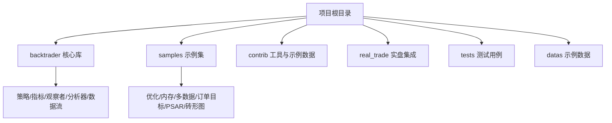
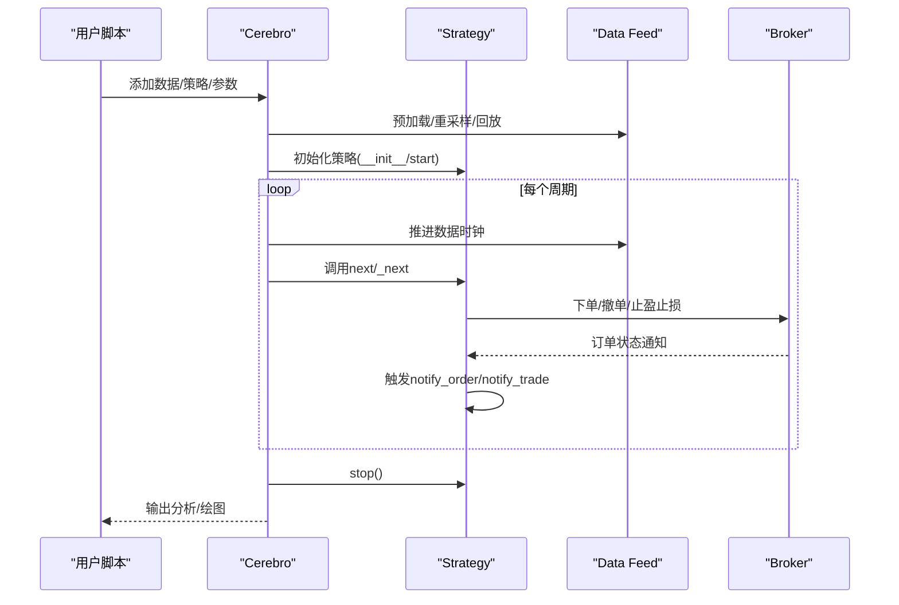
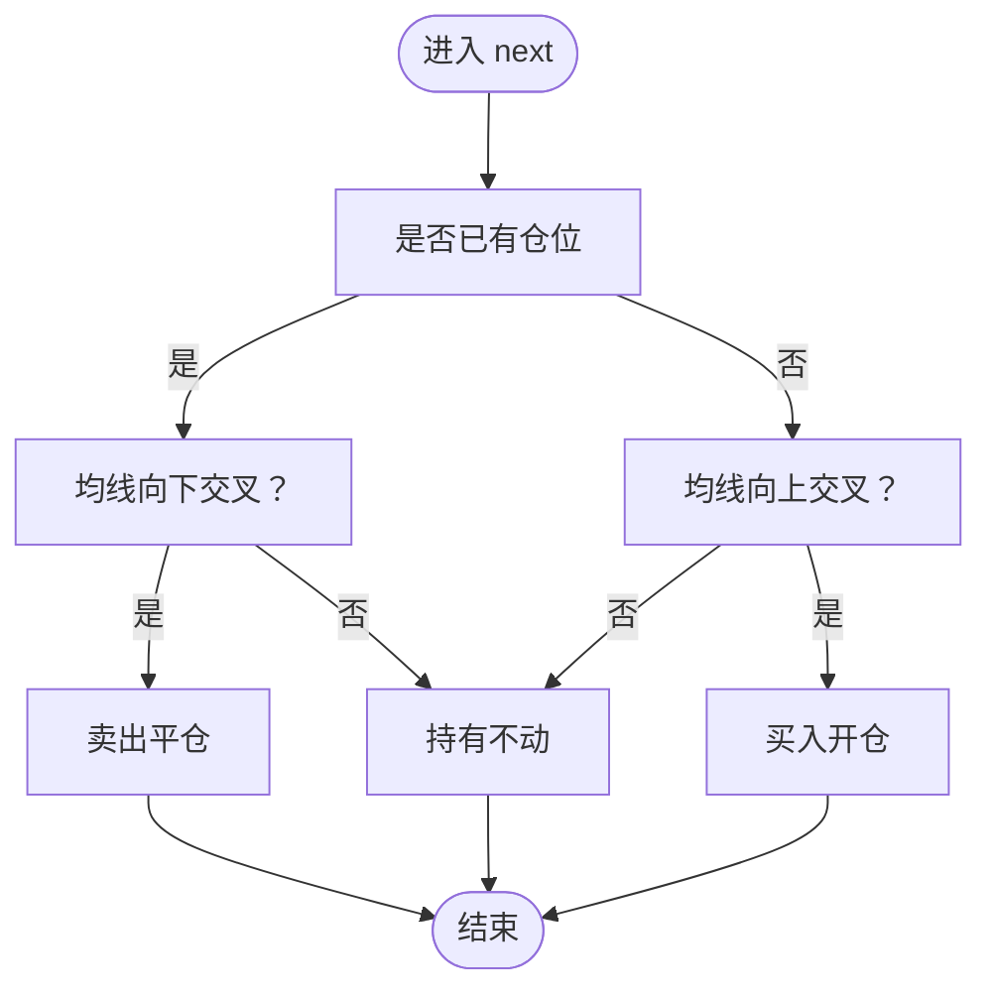
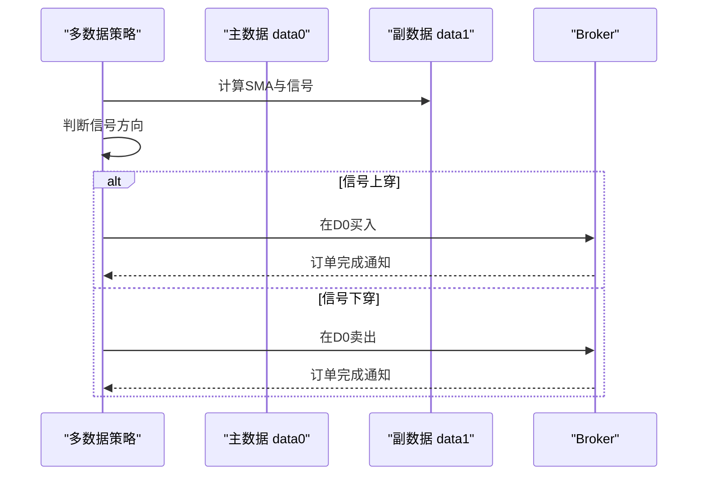
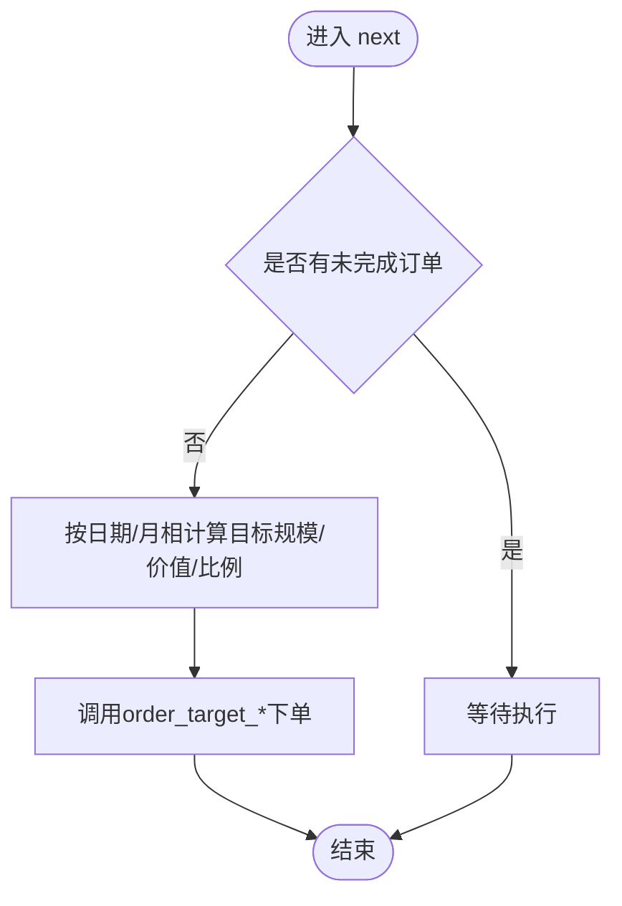
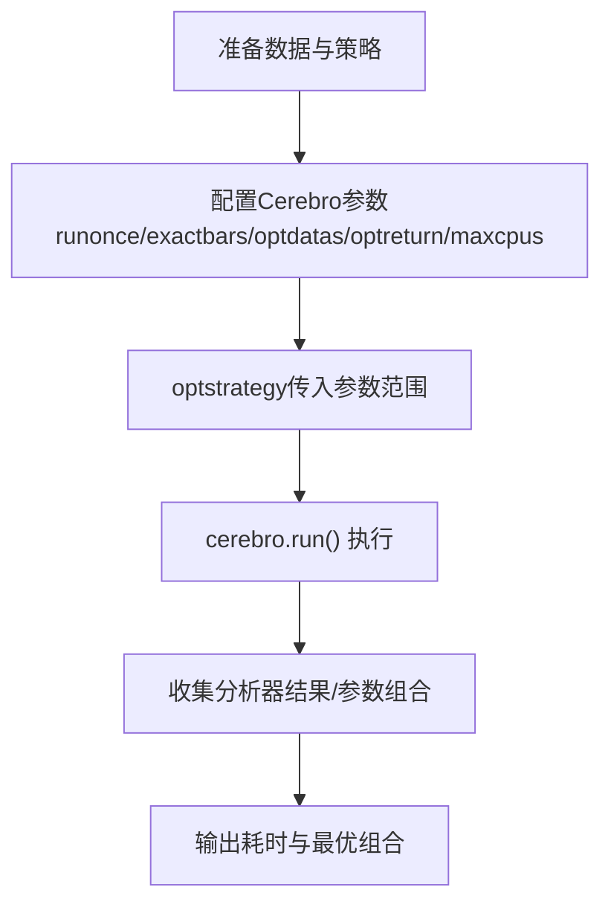
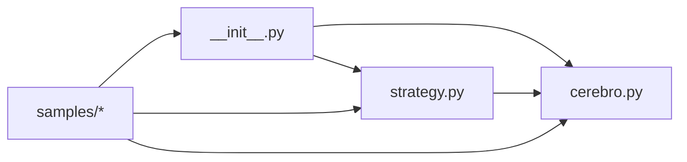

# 示例与最佳实践

<cite>
**本文引用的文件**
- [README.rst](file://README.rst)
- [backtrader/__init__.py](file://backtrader/__init__.py)
- [backtrader/strategy.py](file://backtrader/strategy.py)
- [backtrader/cerebro.py](file://backtrader/cerebro.py)
- [backtrader/strategies/sma_crossover.py](file://backtrader/strategies/sma_crossover.py)
- [samples/optimization/optimization.py](file://samples/optimization/optimization.py)
- [samples/memory-savings/memory-savings.py](file://samples/memory-savings/memory-savings.py)
- [samples/data-pandas/data-pandas.py](file://samples/data-pandas/data-pandas.py)
- [samples/multidata-strategy/multidata-strategy.py](file://samples/multidata-strategy/multidata-strategy.py)
- [samples/order_target/order_target.py](file://samples/order_target/order_target.py)
- [samples/psar/psar.py](file://samples/psar/psar.py)
- [samples/renko/renko.py](file://samples/renko/renko.py)
</cite>

## 目录
1. [引言](#引言)
2. [项目结构](#项目结构)
3. [核心组件](#核心组件)
4. [架构总览](#架构总览)
5. [详细组件分析](#详细组件分析)
6. [依赖关系分析](#依赖关系分析)
7. [性能考虑](#性能考虑)
8. [故障排查指南](#故障排查指南)
9. [结论](#结论)
10. [附录](#附录)

## 引言
本指南面向Backtrader用户与开发者，系统梳理仓库中samples目录下的示例与最佳实践，覆盖从基础策略到高级应用、性能优化、数据处理与分析、调试测试、项目组织与常见陷阱规避等主题。通过逐个示例的代码级分析与可视化流程图，帮助读者快速掌握策略开发的关键路径与工程化方法。

## 项目结构
Backtrader核心位于backtrader包，samples为示例集合，contrib提供额外数据与工具，real_trade展示真实交易集成（可选），tests用于单元测试与回归验证。samples按功能域划分，涵盖优化、内存节省、多数据源、订单目标、技术指标等主题。

**章节来源**
- [README.rst](file://README.rst#L1-L171)
- [backtrader/__init__.py](file://backtrader/__init__.py#L1-L91)

## 核心组件
- 策略基类：提供策略生命周期钩子（start/next/stop）、通知回调（notify_order/notify_trade）、下单接口（buy/sell）与定时器支持。
- 运行引擎：Cerebro负责数据注册、策略添加、运行参数配置（预加载、向量化、内存节省、并行优化等）、观察者/分析器装配与结果输出。
- 数据与指标：内置丰富指标族，支持自定义指标；提供多种数据源适配与过滤器（如Renko）。
- 订单与资金：Broker模拟执行、Commission方案、Sizer自动建仓、Slippage与成交量填充策略。

**章节来源**
- [backtrader/strategy.py](file://backtrader/strategy.py#L107-L800)
- [backtrader/cerebro.py](file://backtrader/cerebro.py#L60-L800)
- [backtrader/__init__.py](file://backtrader/__init__.py#L34-L91)

## 架构总览
下图展示了策略在Cerebro驱动下的典型执行流程：数据进入、策略初始化、周期推进、通知分发与统计输出。

**图表来源**
- [backtrader/cerebro.py](file://backtrader/cerebro.py#L296-L800)
- [backtrader/strategy.py](file://backtrader/strategy.py#L393-L494)

**章节来源**
- [backtrader/cerebro.py](file://backtrader/cerebro.py#L60-L800)
- [backtrader/strategy.py](file://backtrader/strategy.py#L107-L800)

## 详细组件分析

### 基础策略：SMA交叉
- 目标：演示最简单的均线交叉策略，包含参数化、信号生成与买卖逻辑。
- 关键点：使用CrossOver生成买卖信号；根据持仓状态决定是否建仓或平仓。
- 最佳实践：将参数集中于params；在next中保持轻量逻辑；必要时使用start/stop进行一次性初始化与收尾。

**图表来源**
- [backtrader/strategies/sma_crossover.py](file://backtrader/strategies/sma_crossover.py#L29-L75)

**章节来源**
- [backtrader/strategies/sma_crossover.py](file://backtrader/strategies/sma_crossover.py#L29-L75)

### 多数据策略：双数据联动
- 目标：在主数据上执行交易，在副数据上生成信号（如SMA交叉），体现多数据协同。
- 关键点：使用data0作为交易载体，data1生成信号；严格控制并发订单；打印对齐状态便于调试。
- 最佳实践：明确数据间关系与职责；在next中先判断信号再下单；注意数据长度与时间对齐。

**图表来源**
- [samples/multidata-strategy/multidata-strategy.py](file://samples/multidata-strategy/multidata-strategy.py#L75-L115)

**章节来源**
- [samples/multidata-strategy/multidata-strategy.py](file://samples/multidata-strategy/multidata-strategy.py#L33-L217)

### 订单目标：按目标规模/价值/比例建仓
- 目标：演示order_target系列接口，按日动态目标规模、目标价值或目标比例下单。
- 关键点：避免重复挂单；根据组合价值/数据价值动态计算目标；打印日志辅助验证。
- 最佳实践：在start设置哨兵；在next前检查pending订单；结合ATR/波动率设定止损。

**图表来源**
- [samples/order_target/order_target.py](file://samples/order_target/order_target.py#L66-L114)

**章节来源**
- [samples/order_target/order_target.py](file://samples/order_target/order_target.py#L30-L199)

### 技术指标：抛物线转向（PSAR）
- 目标：在数据上叠加PSAR指标，输出其值以供策略参考。
- 关键点：直接实例化指标并打印；可配合其他信号形成交易规则。
- 最佳实践：将指标输出设为不绘图以减少内存占用；仅在需要时启用绘图。

**章节来源**
- [samples/psar/psar.py](file://samples/psar/psar.py#L31-L120)

### 形态过滤：砖形图（Renko）
- 目标：通过Renko过滤器将连续价格变动转换为“砖块”，用于识别突破。
- 关键点：可在单一数据上叠加或克隆第二份数据；可对比原K线与Renko形态。
- 最佳实践：合理设置Brick大小；关注过滤后的时间轴变化；结合RSI等指标确认趋势强度。

**章节来源**
- [samples/renko/renko.py](file://samples/renko/renko.py#L30-L136)

### 数据接入：Pandas DataFrame
- 目标：演示如何将pandas DataFrame注入Backtrader数据流。
- 关键点：设置索引列与日期解析；可选择是否使用表头；stdstats关闭以减少默认观察者开销。
- 最佳实践：确保日期列为索引且已排序；缺失列名时通过参数映射；必要时自定义字段别名。

**章节来源**
- [samples/data-pandas/data-pandas.py](file://samples/data-pandas/data-pandas.py#L32-L93)

### 性能优化：参数寻优
- 目标：通过Cerebro的优化框架对策略参数网格搜索，提升回测效率。
- 关键点：optstrategy传入参数范围；runonce与exactbars影响内存与速度；optdatas/optreturn减少对象创建与返回。
- 最佳实践：优先使用向量化（runonce）；在大规模网格时开启optdatas/optreturn；合理设置maxcpus并行度。

**图表来源**
- [samples/optimization/optimization.py](file://samples/optimization/optimization.py#L51-L102)

**章节来源**
- [samples/optimization/optimization.py](file://samples/optimization/optimization.py#L35-L197)

### 内存优化：精确条目与子指标回收
- 目标：评估与对比不同内存保存策略对指标/数据/观察者的内存占用。
- 关键点：exactbars=-1/-2控制不同层级的内存节省；TestInd演示子指标数组累加；stop阶段统计总cells数。
- 最佳实践：在长周期回测中启用适度内存节省；对不参与绘图的指标设置plot=False；谨慎开启objcache以避免边界情况。

**章节来源**
- [samples/memory-savings/memory-savings.py](file://samples/memory-savings/memory-savings.py#L41-L163)

## 依赖关系分析
- backtrader/__init__.py统一导出核心模块，形成清晰的API入口。
- 策略与Cerebro通过元类与环境绑定建立强耦合，保证数据/指标/分析器的生命周期一致。
- 示例脚本独立于核心库，仅通过标准API调用，便于移植与扩展。

**图表来源**
- [backtrader/__init__.py](file://backtrader/__init__.py#L1-L91)
- [backtrader/strategy.py](file://backtrader/strategy.py#L107-L120)
- [backtrader/cerebro.py](file://backtrader/cerebro.py#L60-L120)

**章节来源**
- [backtrader/__init__.py](file://backtrader/__init__.py#L1-L91)
- [backtrader/strategy.py](file://backtrader/strategy.py#L107-L120)
- [backtrader/cerebro.py](file://backtrader/cerebro.py#L60-L120)

## 性能考虑
- 向量化与预加载：runonce=True可显著加速指标计算；preload=True减少IO等待。
- 内存节省：exactbars=-1/-2按需释放历史缓存；对非绘图指标设置plot=False。
- 并行优化：maxcpus设置CPU核数；optdatas/optreturn减少进程间对象传递与返回体积。
- 数据与指标：避免在next中频繁创建临时对象；尽量复用已实例化的指标。
- I/O与绘图：stdstats关闭默认观察者；plot仅在必要时开启。

[本节为通用建议，无需特定文件引用]

## 故障排查指南
- 订单未成交/延迟：检查notify_order回调是否正确处理Completed/Expired/Canceled/Margin状态；确认Broker参数（滑点、手续费、最小跳价）。
- 数据不同步：多数据场景下核对数据长度与时间戳；必要时使用oldsync或显式对齐。
- 内存溢出：启用exactbars并降低绘图指标；减少不必要的中间变量；及时清理不再使用的指标。
- 回测与实盘差异：确认数据频率、开盘休市、节假日；检查滑点与手续费模型；验证下单类型与价格约束。
- 参数寻优过慢：缩小参数空间；开启optdatas/optreturn；限制maxcpus；使用更短的历史区间做探索性回测。

[本节为通用建议，无需特定文件引用]

## 结论
通过samples中的多样化示例，Backtrader提供了从入门到进阶的完整路径。建议以SMA交叉起步，逐步引入多数据、订单目标、技术指标与性能优化，并在真实项目中遵循参数化、轻逻辑、可观测与可测试的原则，持续迭代策略与工程化流程。

[本节为总结性内容，无需特定文件引用]

## 附录

### 常见交易策略实现思路
- 趋势跟踪：基于均线/通道/动量指标生成入场/出场信号；结合ATR设定止损。
- 均值回归：在布林带上下轨附近反向做多/空；设置宽/紧带参数与时间窗。
- 套利交易：跨品种/跨期现价差回归；对残差序列做ADF检验与滚动协整。

[本节为概念性内容，无需特定文件引用]

### 数据处理与分析最佳实践
- 数据质量：缺失值插值/删除、异常值检测、时间对齐与去重。
- 特征工程：技术指标作为特征矩阵；滞后项/动量/波动率；PCA降维。
- 回测验证：样本外分割、滚动窗口/增长窗口、walk-forward；基准对比与风险调整收益。

[本节为通用建议，无需特定文件引用]

### 代码组织与命名规范
- 文件：按功能拆分（策略/指标/分析器/观察者），示例脚本独立存放。
- 类名：Strategy/Indicator/Observer/Analyzer首字母大写；参数使用小写加下划线。
- 方法：生命周期钩子（start/next/stop）、通知回调（notify_*）、业务动作（buy/sell）。
- 日志：统一格式化输出，包含日期、指标值与账户状态。

[本节为通用建议，无需特定文件引用]