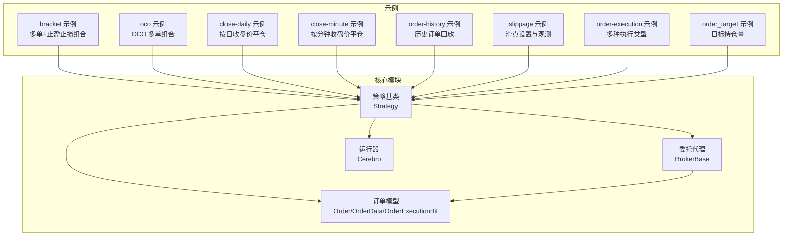
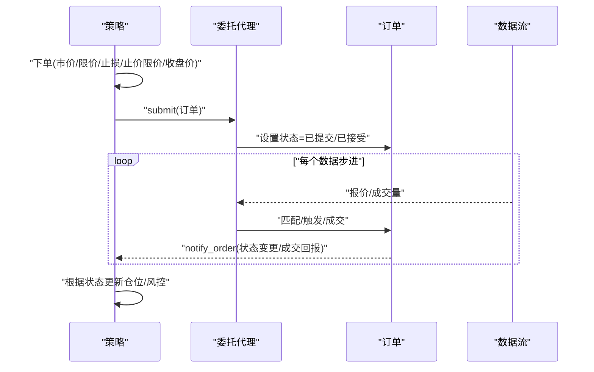
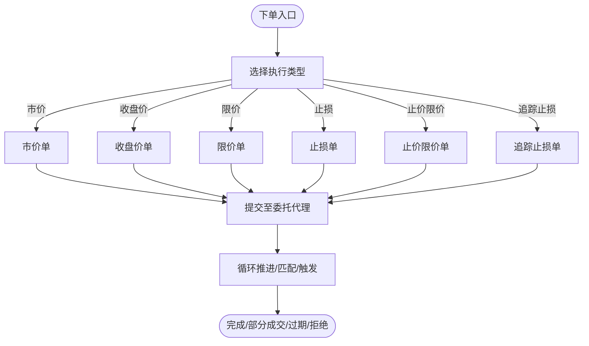
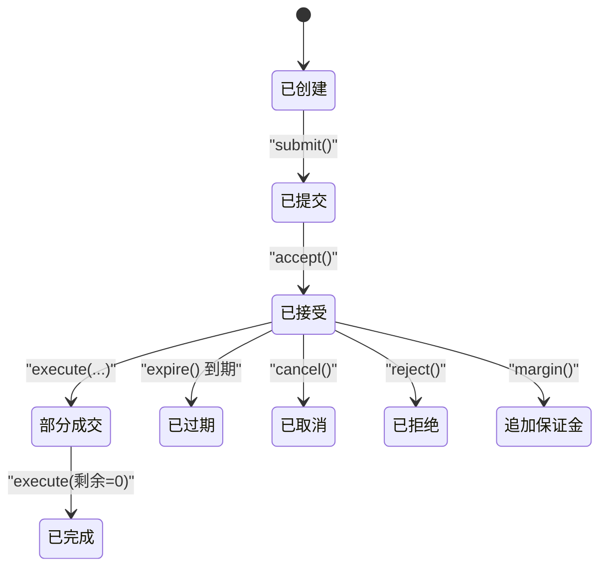
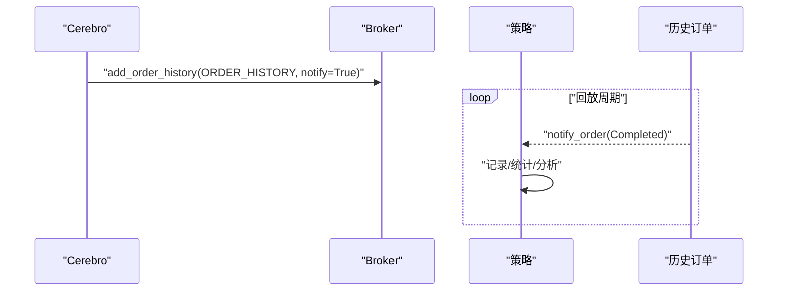
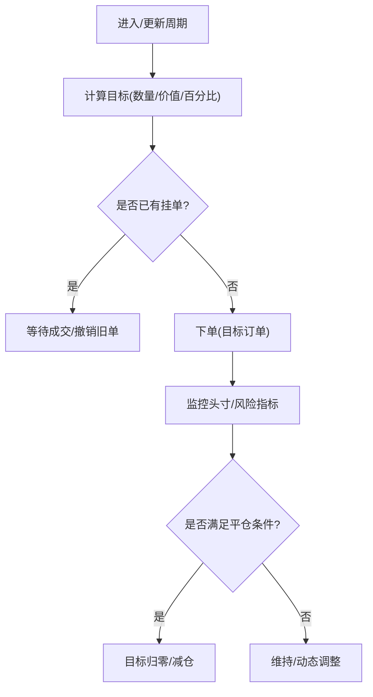
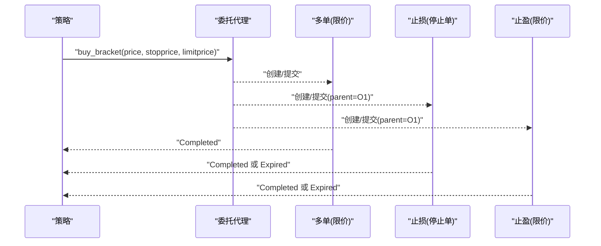
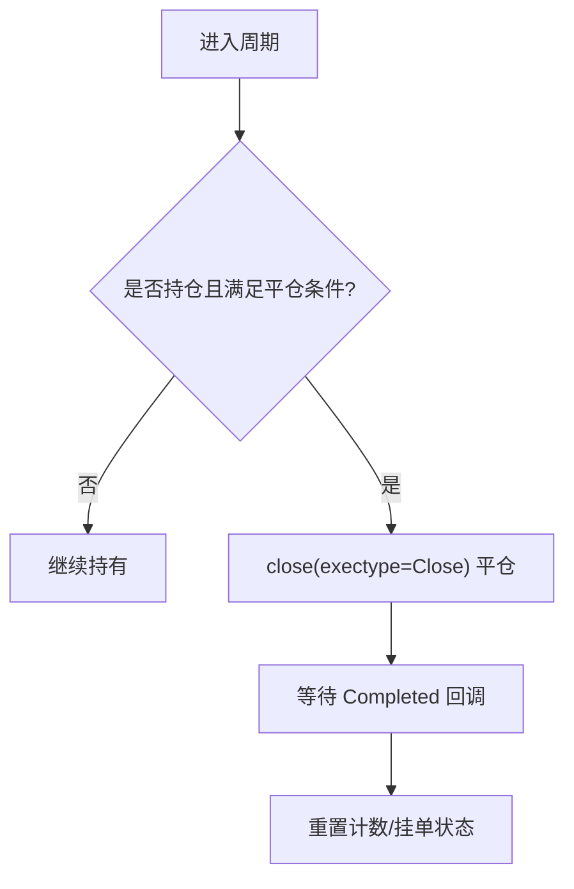
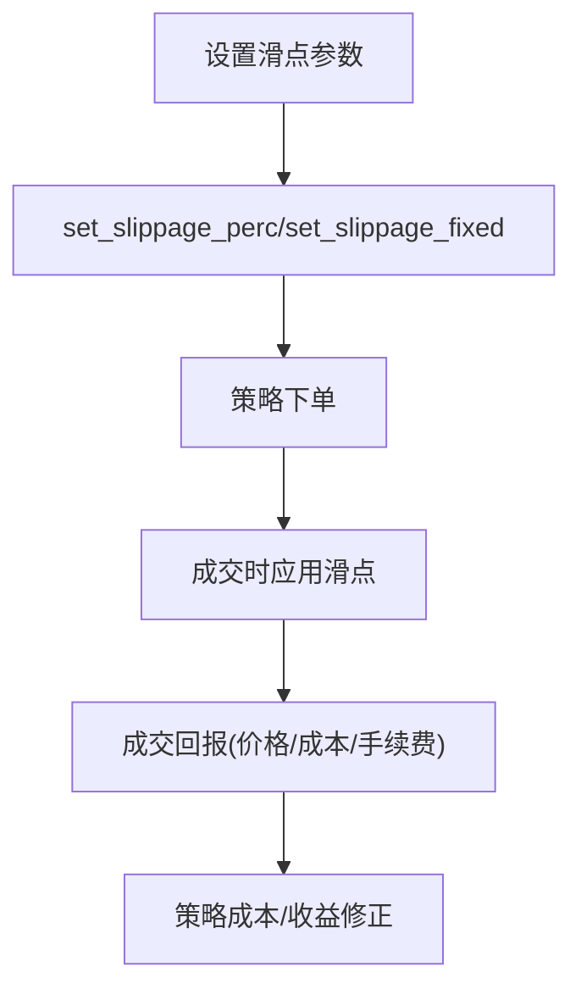
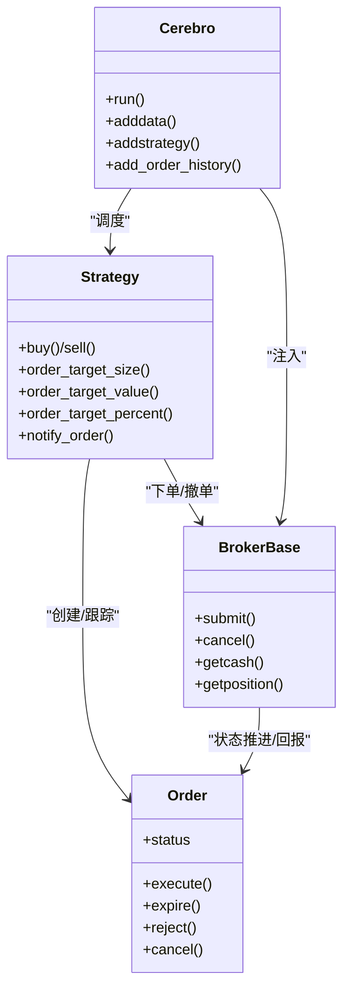

# 订单管理示例

<cite>
**本文引用的文件**
- [samples/bracket/bracket.py](file://samples/bracket/bracket.py)
- [samples/oco/oco.py](file://samples/oco/oco.py)
- [samples/order-close/close-daily.py](file://samples/order-close/close-daily.py)
- [samples/order-close/close-minute.py](file://samples/order-close/close-minute.py)
- [samples/order-history/order-history.py](file://samples/order-history/order-history.py)
- [samples/slippage/slippage.py](file://samples/slippage/slippage.py)
- [samples/order-execution/order-execution.py](file://samples/order-execution/order-execution.py)
- [samples/order-target/order_target.py](file://samples/order-target/order_target.py)
- [backtrader/order.py](file://backtrader/order.py)
- [backtrader/broker.py](file://backtrader/broker.py)
- [backtrader/cerebro.py](file://backtrader/cerebro.py)
- [backtrader/strategy.py](file://backtrader/strategy.py)
</cite>

## 目录
1. [简介](#简介)
2. [项目结构](#项目结构)
3. [核心组件](#核心组件)
4. [架构总览](#架构总览)
5. [详细组件分析](#详细组件分析)
6. [依赖关系分析](#依赖关系分析)
7. [性能考虑](#性能考虑)
8. [故障排查指南](#故障排查指南)
9. [结论](#结论)
10. [附录](#附录)

## 简介
本文件系统性梳理 BackTrader 订单管理示例与核心机制，围绕以下主题展开：
- 各类订单类型与执行策略：市价、收盘价、限价、止损、止价限价、追踪止损等
- 订单执行全流程与状态管理：从创建到完成/过期/拒绝/取消/展期
- 订单历史记录的保存与查询
- 目标持仓量订单（按数量/按价值/按百分比）与风险管理
- Bracket 订单与 OCO 组合使用
- 按日与按分钟的平仓策略
- 滑点模型设置与影响分析
- 订单优化与成本控制最佳实践
- 性能监控与异常处理

## 项目结构
BackTrader 的订单管理由“策略层 + 执行层 + 委托簿层 + 数据层”构成。示例代码位于 samples 目录，核心对象定义在 backtrader 包中。

图表来源
- [samples/bracket/bracket.py](file://samples/bracket/bracket.py#L31-L125)
- [samples/oco/oco.py](file://samples/oco/oco.py#L31-L120)
- [samples/order-close/close-daily.py](file://samples/order-close/close-daily.py#L34-L62)
- [samples/order-close/close-minute.py](file://samples/order-close/close-minute.py#L31-L61)
- [samples/order-history/order-history.py](file://samples/order-history/order-history.py#L83-L103)
- [samples/slippage/slippage.py](file://samples/slippage/slippage.py#L42-L94)
- [samples/order-execution/order-execution.py](file://samples/order-execution/order-execution.py#L36-L162)
- [samples/order-target/order_target.py](file://samples/order-target/order_target.py#L30-L113)
- [backtrader/strategy.py](file://backtrader/strategy.py#L107-L120)
- [backtrader/order.py](file://backtrader/order.py#L222-L527)
- [backtrader/broker.py](file://backtrader/broker.py#L49-L167)
- [backtrader/cerebro.py](file://backtrader/cerebro.py#L60-L200)

章节来源
- [backtrader/order.py](file://backtrader/order.py#L222-L527)
- [backtrader/broker.py](file://backtrader/broker.py#L49-L167)
- [backtrader/cerebro.py](file://backtrader/cerebro.py#L60-L200)
- [backtrader/strategy.py](file://backtrader/strategy.py#L107-L120)

## 核心组件
- 订单模型与状态机
  - 订单类型：市价、收盘价、限价、止损、止价限价、追踪止损、历史单
  - 订单状态：已创建、已提交、已接受、部分成交、已完成、已取消、已过期、追加保证金、被拒绝
  - 订单数据：创建数据与执行数据，支持多次成交片段累加
- 委托代理
  - 提供下单、撤单、查询资金/头寸、佣金方案注册等接口
- 运行器
  - 驱动策略、数据、观察者、分析器的生命周期
- 策略基类
  - 提供下单入口（市价/限价/止损/止价限价/收盘价）、目标持仓量下单、通知回调等

章节来源
- [backtrader/order.py](file://backtrader/order.py#L222-L527)
- [backtrader/broker.py](file://backtrader/broker.py#L49-L167)
- [backtrader/cerebro.py](file://backtrader/cerebro.py#L60-L200)
- [backtrader/strategy.py](file://backtrader/strategy.py#L107-L120)

## 架构总览
下面以“策略下单 → 委托代理 → 订单状态推进 → 执行回报 → 策略回调”的主线展示订单执行链路。

图表来源
- [backtrader/strategy.py](file://backtrader/strategy.py#L107-L120)
- [backtrader/broker.py](file://backtrader/broker.py#L145-L163)
- [backtrader/order.py](file://backtrader/order.py#L450-L527)

## 详细组件分析

### 订单类型与执行策略
- 市价单：立即以市场最优价成交
- 收盘价单：在当日收盘时以收盘价成交
- 限价单：设定价格上限（做多）或下限（做空），达到后成交
- 止损单：达到触发价即转为市价或限价成交
- 止价限价单：先触发止损再按限价成交
- 追踪止损：随价格变动调整止损位
- 历史单：用于历史回放与评估

图表来源
- [samples/order-execution/order-execution.py](file://samples/order-execution/order-execution.py#L110-L162)
- [backtrader/order.py](file://backtrader/order.py#L242-L246)

章节来源
- [samples/order-execution/order-execution.py](file://samples/order-execution/order-execution.py#L36-L162)
- [backtrader/order.py](file://backtrader/order.py#L242-L246)

### 订单状态管理与生命周期
- 创建：生成唯一引用号、初始化创建数据、设置有效期与到期日
- 提交/接受：等待撮合
- 部分/完成：多次成交片段累加
- 过期/拒绝/取消：终止可执行性
- 触发与追踪：止损/止价限价/追踪止损的价格条件推进

图表来源
- [backtrader/order.py](file://backtrader/order.py#L250-L258)
- [backtrader/order.py](file://backtrader/order.py#L450-L527)

章节来源
- [backtrader/order.py](file://backtrader/order.py#L250-L258)
- [backtrader/order.py](file://backtrader/order.py#L528-L642)

### 订单历史记录的保存与查询
- 历史订单回放：通过运行器注入历史订单序列，策略在回放期间收到成交通知
- 查询与打印：在策略的订单通知中输出执行日期、方向、价格等信息

图表来源
- [samples/order-history/order-history.py](file://samples/order-history/order-history.py#L130-L142)
- [samples/order-history/order-history.py](file://samples/order-history/order-history.py#L64-L96)

章节来源
- [samples/order-history/order-history.py](file://samples/order-history/order-history.py#L30-L142)
- [backtrader/broker.py](file://backtrader/broker.py#L69-L71)

### 目标持仓量订单与风险管理
- 按数量目标：order_target_size(target)
- 按价值目标：order_target_value(target)
- 按百分比目标：order_target_percent(target)
- 风险管理要点：每日/每月目标值与百分比结合，避免过度集中；结合止损与止盈保护

图表来源
- [samples/order-target/order_target.py](file://samples/order-target/order_target.py#L66-L113)

章节来源
- [samples/order-target/order_target.py](file://samples/order-target/order_target.py#L30-L113)

### Bracket 订单与 OCO 订单组合
- Bracket 订单：多单+止损+止盈三单组合，支持有效期与价格切换
- OCO 订单：互为停止条件的多单组合，任一单成交则其余单自动失效

图表来源
- [samples/bracket/bracket.py](file://samples/bracket/bracket.py#L113-L120)
- [samples/bracket/bracket.py](file://samples/bracket/bracket.py#L84-L111)
- [samples/oco/oco.py](file://samples/oco/oco.py#L99-L115)

章节来源
- [samples/bracket/bracket.py](file://samples/bracket/bracket.py#L31-L125)
- [samples/oco/oco.py](file://samples/oco/oco.py#L31-L120)

### 按日与按分钟的平仓策略
- 按日：在每日结束或指定时间点使用收盘价单平仓
- 按分钟：基于时间计数（如持有 N 分钟）触发收盘价单平仓

图表来源
- [samples/order-close/close-daily.py](file://samples/order-close/close-daily.py#L49-L62)
- [samples/order-close/close-minute.py](file://samples/order-close/close-minute.py#L47-L61)

章节来源
- [samples/order-close/close-daily.py](file://samples/order-close/close-daily.py#L34-L62)
- [samples/order-close/close-minute.py](file://samples/order-close/close-minute.py#L31-L61)

### 滑点模型设置与影响分析
- 设置方式：按百分比或固定点数滑点，可配置开盘点滑点、成交滑点、是否封顶
- 影响：降低利润、增加交易成本、改变止盈止损命中概率

图表来源
- [samples/slippage/slippage.py](file://samples/slippage/slippage.py#L82-L93)
- [samples/slippage/slippage.py](file://samples/slippage/slippage.py#L45-L53)

章节来源
- [samples/slippage/slippage.py](file://samples/slippage/slippage.py#L42-L94)

### 订单优化与成本控制最佳实践
- 优先使用收盘价单进行日级别平仓，减少跳空与滑点影响
- 将止损与止盈设置在关键支撑/阻力附近，提高命中率并控制最大回撤
- 使用目标订单按价值/百分比管理头寸，避免一次性大额冲击
- 合理设置有效期与过期策略，防止在流动性差时段强制成交
- 通过佣金与滑点模型校准成本，确保策略在净收益层面可行

[本节为通用建议，不直接分析具体文件]

### 性能监控与异常处理
- 性能监控：在策略中记录订单状态变化、成交回报、手续费与净值曲线
- 异常处理：对拒绝/过期/取消等状态进行告警与重试策略；对保证金不足场景进行风控拦截

章节来源
- [samples/order-execution/order-execution.py](file://samples/order-execution/order-execution.py#L52-L78)
- [backtrader/order.py](file://backtrader/order.py#L471-L493)

## 依赖关系分析
策略通过下单接口创建订单，委托代理负责订单生命周期管理与回报推送，运行器驱动整体流程。

图表来源
- [backtrader/strategy.py](file://backtrader/strategy.py#L107-L120)
- [backtrader/order.py](file://backtrader/order.py#L222-L527)
- [backtrader/broker.py](file://backtrader/broker.py#L145-L167)
- [backtrader/cerebro.py](file://backtrader/cerebro.py#L60-L200)

章节来源
- [backtrader/strategy.py](file://backtrader/strategy.py#L107-L120)
- [backtrader/order.py](file://backtrader/order.py#L222-L527)
- [backtrader/broker.py](file://backtrader/broker.py#L49-L167)
- [backtrader/cerebro.py](file://backtrader/cerebro.py#L60-L200)

## 性能考虑
- 启用向量化运行（runonce）可显著提升指标计算速度，但需注意内存占用与绘图限制
- 精简策略逻辑，避免每周期重复昂贵操作
- 使用内存节省模式（exactbars）降低存储压力，但会禁用绘图
- 对于高频数据，优先采用收盘价单与批量下单策略，减少微小波动带来的噪声交易

[本节为通用指导，不直接分析具体文件]

## 故障排查指南
- 订单未成交
  - 检查有效期设置与过期逻辑
  - 核对限价/止损触发价与当前价格关系
- 成交回报异常
  - 查看成交片段与累计成交，确认手续费与滑点设置
- 委托代理未响应
  - 确认资金充足与佣金方案正确
  - 检查是否启用了历史订单回放模式
- 平仓不生效
  - 确认收盘价单的时间点与会话结束标志

章节来源
- [samples/order-execution/order-execution.py](file://samples/order-execution/order-execution.py#L52-L78)
- [samples/order-close/close-daily.py](file://samples/order-close/close-daily.py#L38-L47)
- [samples/order-close/close-minute.py](file://samples/order-close/close-minute.py#L37-L46)
- [samples/order-history/order-history.py](file://samples/order-history/order-history.py#L87-L96)

## 结论
BackTrader 的订单管理以清晰的状态机与可扩展的委托代理为核心，配合丰富的订单类型与执行策略，能够覆盖从简单市价单到复杂 Bracket/OCO 组合的全场景需求。通过目标订单、滑点与佣金模型、历史订单回放以及按日/按分钟平仓策略，用户可在保证性能的同时实现稳健的风险控制与成本优化。

## 附录
- 示例命令参考
  - 运行订单执行示例：python samples/order-execution/order-execution.py --exectype Market
  - 运行 Bracket 示例：python samples/bracket/bracket.py
  - 运行 OCO 示例：python samples/oco/oco.py
  - 运行按日收盘价平仓：python samples/order-close/close-daily.py
  - 运行按分钟收盘价平仓：python samples/order-close/close-minute.py
  - 运行滑点示例：python samples/slippage/slippage.py --slip_perc 0.01
  - 运行目标订单示例：python samples/order-target/order_target.py --target-size
  - 运行历史订单示例：python samples/order-history/order-history.py --order-history