# 集成应用示例

<cite>
**本文档引用的文件**
- [bybit-live-trading.py](file://samples/ccxt-bybit/bybit-live-trading.py)
- [broker.py](file://real_trade/bybit/broker.py)
- [store.py](file://real_trade/bybit/store.py)
- [datafeed.py](file://real_trade/bybit/datafeed.py)
- [oandastore.py](file://backtrader/stores/oandastore.py)
- [oandabroker.py](file://backtrader/brokers/oandabroker.py)
- [ibstore.py](file://backtrader/stores/ibstore.py)
- [pyfolio.py](file://backtrader/analyzers/pyfolio.py)
- [pyfoliotest.py](file://samples/pyfolio2/pyfoliotest.py)
- [yahoo.py](file://backtrader/feeds/yahoo.py)
- [yahoo-test.py](file://samples/yahoo-test/yahoo-test.py)
- [oandatest.py](file://samples/oandatest/oandatest.py)
- [ibtest.py](file://samples/ibtest/ibtest.py)
- [basic_trading.py](file://real_trade/bybit/examples/basic_trading.py)
</cite>

## 目录
1. [简介](#简介)
2. [项目结构](#项目结构)
3. [核心组件](#核心组件)
4. [架构概览](#架构概览)
5. [详细组件分析](#详细组件分析)
6. [依赖关系分析](#依赖关系分析)
7. [性能考虑](#性能考虑)
8. [故障排除指南](#故障排除指南)
9. [结论](#结论)
10. [附录](#附录)

## 简介

本文件详细介绍了Backtrader与其他金融系统和库的集成应用示例。涵盖了以下关键集成场景：

- **CCXT库与Bybit交易所的实盘交易集成**：展示了基于CCXT库的Bybit交易所连接、数据获取和订单执行的完整实现
- **Interactive Brokers连接配置与数据获取**：提供了IB连接设置、数据订阅和订单管理的详细说明
- **OANDA外汇平台集成**：演示了OANDA外汇市场的数据接入和交易流程
- **Pyfolio绩效分析库集成**：介绍了如何使用Pyfolio进行投资组合绩效分析和报告生成
- **Yahoo Finance数据源使用**：展示了Yahoo Finance数据的获取和处理方法

这些集成示例提供了从开发、测试到生产的完整解决方案，包括最佳实践、错误处理和部署注意事项。

## 项目结构

Backtrader项目采用模块化架构设计，各个集成组件分布在不同的目录中：

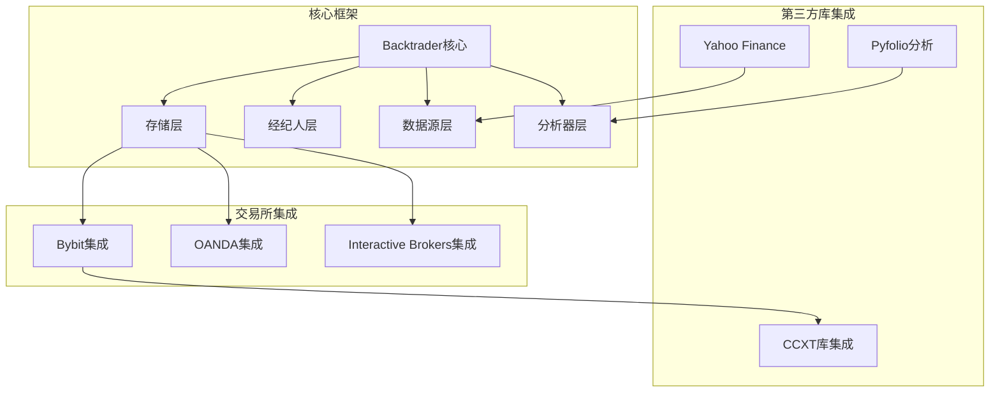
```mermaid
graph TB
subgraph "核心框架"
BT[Backtrader核心]
Stores[存储层]
Brokers[经纪人层]
Feeds[数据源层]
Analyzers[分析器层]
end
subgraph "交易所集成"
BYBIT[Bybit集成]
OANDA[OANDA集成]
IB[Interactive Brokers集成]
end
subgraph "第三方库集成"
CCXT[CCXT库集成]
PYFOLIO[Pyfolio分析]
YAHOO[Yahoo Finance]
end
BT --> Stores
BT --> Brokers
BT --> Feeds
BT --> Analyzers
Stores --> BYBIT
Stores --> OANDA
Stores --> IB
BYBIT --> CCXT
PYFOLIO --> Analyzers
YAHOO --> Feeds
```

**图表来源**
- [bybit-live-trading.py](file://samples/ccxt-bybit/bybit-live-trading.py#L1-L878)
- [oandastore.py](file://backtrader/stores/oandastore.py#L1-L660)
- [ibstore.py](file://backtrader/stores/ibstore.py#L1-L800)

**章节来源**
- [bybit-live-trading.py](file://samples/ccxt-bybit/bybit-live-trading.py#L1-L878)
- [oandastore.py](file://backtrader/stores/oandastore.py#L1-L660)
- [ibstore.py](file://backtrader/stores/ibstore.py#L1-L800)

## 核心组件

### Bybit交易所集成组件

Bybit集成提供了完整的实时交易解决方案，包含三个核心组件：

1. **BybitStore** - 交易所连接管理器
2. **BybitData** - 数据源实现
3. **BybitBroker** - 经纪人服务

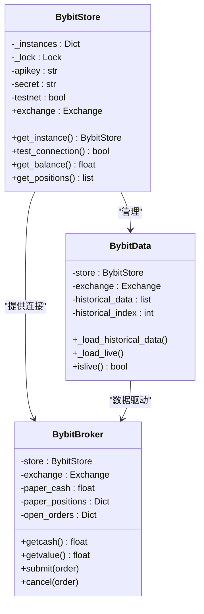
```mermaid
classDiagram
class BybitStore {
-_instances : Dict
-_lock : Lock
-apikey : str
-secret : str
-testnet : bool
+get_instance() BybitStore
+exchange : Exchange
+test_connection() bool
+get_balance() float
+get_positions() list
}
class BybitData {
-store : BybitStore
-exchange : Exchange
-historical_data : list
-historical_index : int
+_load_historical_data()
+_load_live()
+islive() bool
}
class BybitBroker {
-store : BybitStore
-exchange : Exchange
-paper_cash : float
-paper_positions : Dict
-open_orders : Dict
+getcash() float
+getvalue() float
+submit(order)
+cancel(order)
}
BybitStore --> BybitData : "管理"
BybitStore --> BybitBroker : "提供连接"
BybitData --> BybitBroker : "数据驱动"
```

**图表来源**
- [store.py](file://real_trade/bybit/store.py#L16-L262)
- [datafeed.py](file://real_trade/bybit/datafeed.py#L19-L235)
- [broker.py](file://real_trade/bybit/broker.py#L18-L381)

### OANDA外汇平台组件

OANDA集成为外汇市场提供了专业的数据和交易服务：

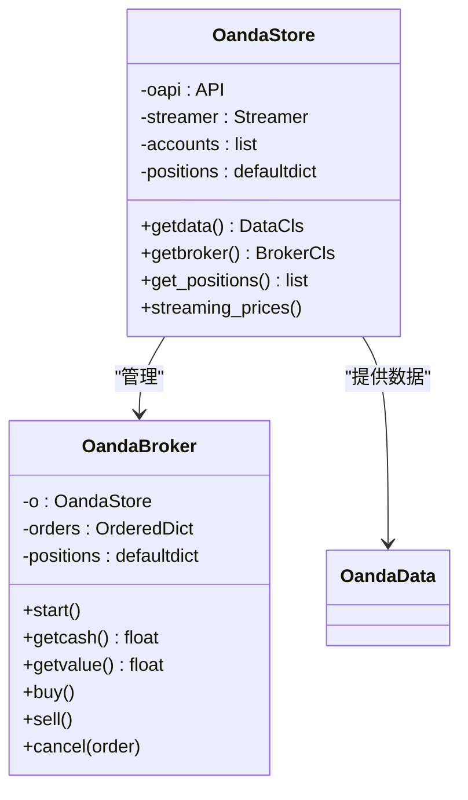
```mermaid
classDiagram
class OandaStore {
-oapi : API
-streamer : Streamer
-accounts : list
-positions : defaultdict
+getdata() DataCls
+getbroker() BrokerCls
+get_positions() list
+streaming_prices()
}
class OandaBroker {
-o : OandaStore
-orders : OrderedDict
-positions : defaultdict
+start()
+getcash() float
+getvalue() float
+buy()
+sell()
+cancel(order)
}
OandaStore --> OandaBroker : "管理"
OandaStore --> OandaData : "提供数据"
```

**图表来源**
- [oandastore.py](file://backtrader/stores/oandastore.py#L177-L660)
- [oandabroker.py](file://backtrader/brokers/oandabroker.py#L60-L358)

### Pyfolio分析器组件

Pyfolio集成为投资组合分析提供了强大的工具链：

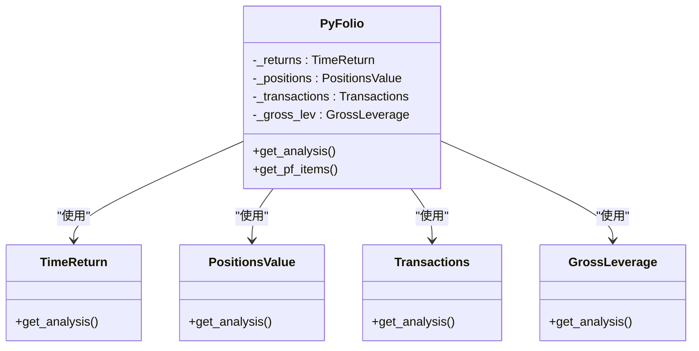
```mermaid
classDiagram
class PyFolio {
-_returns : TimeReturn
-_positions : PositionsValue
-_transactions : Transactions
-_gross_lev : GrossLeverage
+get_analysis()
+get_pf_items()
}
class TimeReturn {
+get_analysis()
}
class PositionsValue {
+get_analysis()
}
class Transactions {
+get_analysis()
}
class GrossLeverage {
+get_analysis()
}
PyFolio --> TimeReturn : "使用"
PyFolio --> PositionsValue : "使用"
PyFolio --> Transactions : "使用"
PyFolio --> GrossLeverage : "使用"
```

**图表来源**
- [pyfolio.py](file://backtrader/analyzers/pyfolio.py#L33-L164)

**章节来源**
- [store.py](file://real_trade/bybit/store.py#L16-L262)
- [datafeed.py](file://real_trade/bybit/datafeed.py#L19-L235)
- [broker.py](file://real_trade/bybit/broker.py#L18-L381)
- [oandastore.py](file://backtrader/stores/oandastore.py#L177-L660)
- [oandabroker.py](file://backtrader/brokers/oandabroker.py#L60-L358)
- [pyfolio.py](file://backtrader/analyzers/pyfolio.py#L33-L164)

## 架构概览

### 实时数据流架构

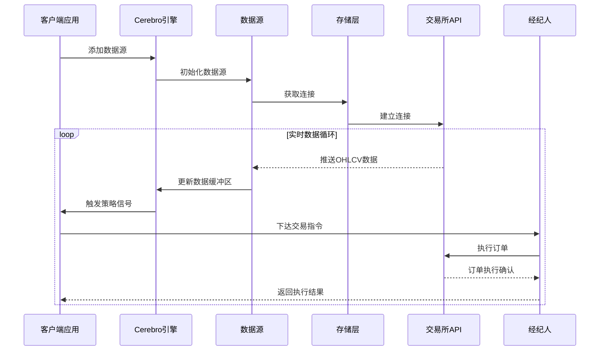
```mermaid
sequenceDiagram
participant Client as 客户端应用
participant Cerebro as Cerebro引擎
participant Data as 数据源
participant Store as 存储层
participant Exchange as 交易所API
participant Broker as 经纪人
Client->>Cerebro : 添加数据源
Cerebro->>Data : 初始化数据源
Data->>Store : 获取连接
Store->>Exchange : 建立连接
loop 实时数据循环
Exchange-->>Data : 推送OHLCV数据
Data->>Cerebro : 更新数据缓冲区
Cerebro->>Client : 触发策略信号
Client->>Broker : 下达交易指令
Broker->>Exchange : 执行订单
Exchange-->>Broker : 订单执行确认
Broker-->>Client : 返回执行结果
end
```

**图表来源**
- [bybit-live-trading.py](file://samples/ccxt-bybit/bybit-live-trading.py#L659-L782)
- [datafeed.py](file://real_trade/bybit/datafeed.py#L196-L222)

### 交易执行流程

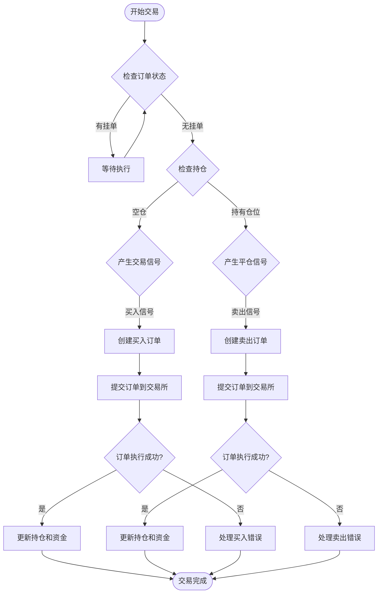
```mermaid
flowchart TD
Start([开始交易]) --> CheckOrder{检查订单状态}
CheckOrder --> |有挂单| Wait[等待执行]
CheckOrder --> |无挂单| CheckPosition{检查持仓}
CheckPosition --> |空仓| Signal{产生交易信号}
CheckPosition --> |持有仓位| ExitSignal{产生平仓信号}
Signal --> |买入信号| BuyOrder[创建买入订单]
ExitSignal --> |卖出信号| SellOrder[创建卖出订单]
BuyOrder --> SubmitBuy[提交订单到交易所]
SellOrder --> SubmitSell[提交订单到交易所]
SubmitBuy --> BuyExec{订单执行成功?}
SubmitSell --> SellExec{订单执行成功?}
BuyExec --> |是| UpdateBuy[更新持仓和资金]
BuyExec --> |否| HandleBuyError[处理买入错误]
SellExec --> |是| UpdateSell[更新持仓和资金]
SellExec --> |否| HandleSellError[处理卖出错误]
UpdateBuy --> End([交易完成])
UpdateSell --> End
HandleBuyError --> End
HandleSellError --> End
Wait --> CheckOrder
```

**图表来源**
- [broker.py](file://real_trade/bybit/broker.py#L133-L332)
- [bybit-live-trading.py](file://samples/ccxt-bybit/bybit-live-trading.py#L107-L163)

**章节来源**
- [bybit-live-trading.py](file://samples/ccxt-bybit/bybit-live-trading.py#L659-L782)
- [broker.py](file://real_trade/bybit/broker.py#L133-L332)

## 详细组件分析

### CCXT Bybit集成实现

#### 数据获取机制

Bybit数据源实现了两种数据获取模式：历史数据下载和实时数据流。

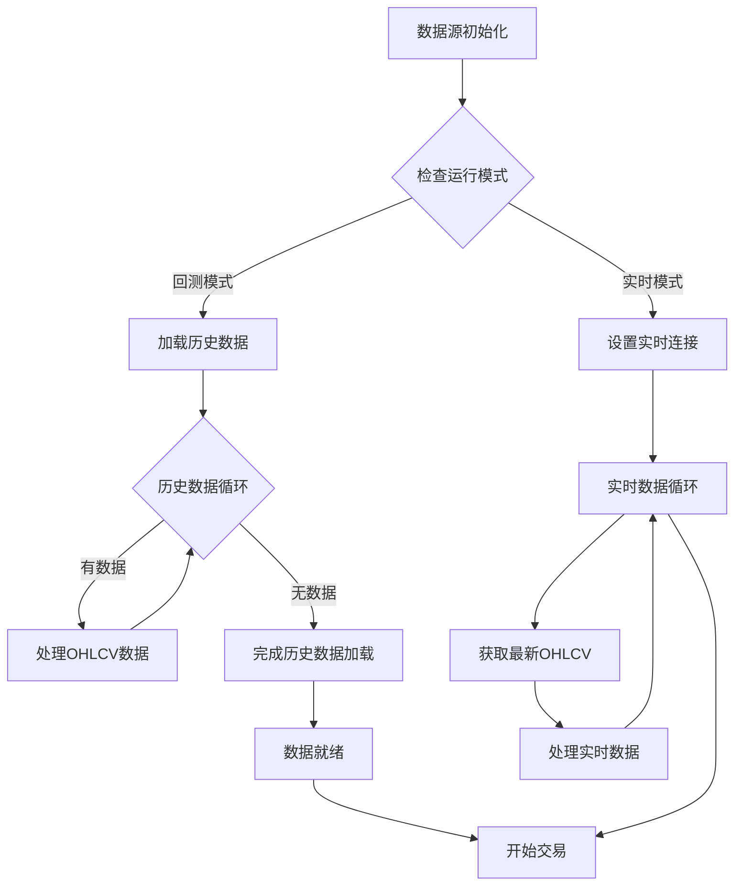
```mermaid
flowchart TD
DataInit[数据源初始化] --> CheckMode{检查运行模式}
CheckMode --> |回测模式| LoadHistorical[加载历史数据]
CheckMode --> |实时模式| SetupLive[设置实时连接]
LoadHistorical --> HistoricalLoop{历史数据循环}
HistoricalLoop --> |有数据| ProcessHistorical[处理OHLCV数据]
HistoricalLoop --> |无数据| CompleteHistorical[完成历史数据加载]
ProcessHistorical --> HistoricalLoop
CompleteHistorical --> Ready[数据就绪]
SetupLive --> LiveLoop[实时数据循环]
LiveLoop --> FetchLive[获取最新OHLCV]
FetchLive --> ProcessLive[处理实时数据]
ProcessLive --> LiveLoop
Ready --> Trading[开始交易]
LiveLoop --> Trading
```

**图表来源**
- [bybit-live-trading.py](file://samples/ccxt-bybit/bybit-live-trading.py#L236-L321)
- [datafeed.py](file://real_trade/bybit/datafeed.py#L119-L222)

#### 订单执行流程

订单执行系统支持模拟交易和实盘交易两种模式：

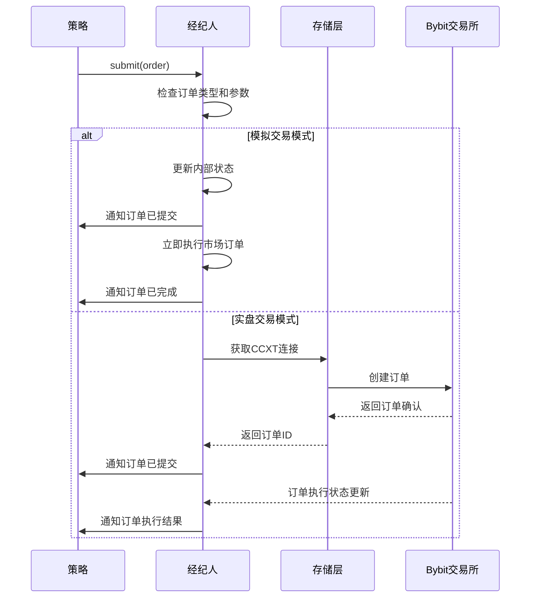
```mermaid
sequenceDiagram
participant Strategy as 策略
participant Broker as 经纪人
participant Store as 存储层
participant Exchange as Bybit交易所
Strategy->>Broker : submit(order)
Broker->>Broker : 检查订单类型和参数
alt 模拟交易模式
Broker->>Broker : 更新内部状态
Broker->>Strategy : 通知订单已提交
Broker->>Broker : 立即执行市场订单
Broker->>Strategy : 通知订单已完成
else 实盘交易模式
Broker->>Store : 获取CCXT连接
Store->>Exchange : 创建订单
Exchange-->>Store : 返回订单确认
Store-->>Broker : 返回订单ID
Broker->>Strategy : 通知订单已提交
Exchange-->>Broker : 订单执行状态更新
Broker->>Strategy : 通知订单执行结果
end
```

**图表来源**
- [broker.py](file://real_trade/bybit/broker.py#L133-L219)
- [bybit-live-trading.py](file://samples/ccxt-bybit/bybit-live-trading.py#L445-L521)

**章节来源**
- [bybit-live-trading.py](file://samples/ccxt-bybit/bybit-live-trading.py#L172-L321)
- [broker.py](file://real_trade/bybit/broker.py#L133-L332)

### Interactive Brokers集成

#### 连接配置

IB集成提供了灵活的连接配置选项：

| 参数 | 默认值 | 描述 |
|------|--------|------|
| host | 127.0.0.1 | TWS或IB Gateway的主机地址 |
| port | 7496 | 连接端口（模拟环境使用7497） |
| clientId | None | 客户端ID（None时自动生成随机ID） |
| notifyall | False | 是否通知所有消息 |
| reconnect | 3 | 重连尝试次数 |
| timeout | 3.0 | 重连间隔秒数 |

#### 数据请求映射

IB支持多种数据请求类型和时间框架映射：

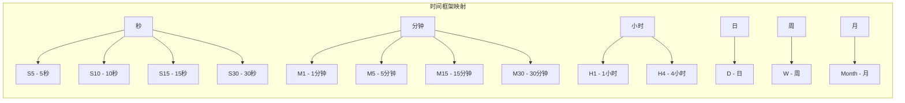
```mermaid
graph LR
subgraph "时间框架映射"
Seconds[秒] --> S5[S5 - 5秒]
Seconds --> S10[S10 - 10秒]
Seconds --> S15[S15 - 15秒]
Seconds --> S30[S30 - 30秒]
Minutes[分钟] --> M1[M1 - 1分钟]
Minutes --> M5[M5 - 5分钟]
Minutes --> M15[M15 - 15分钟]
Minutes --> M30[M30 - 30分钟]
Hours[小时] --> H1[H1 - 1小时]
Hours --> H4[H4 - 4小时]
Days[日] --> D[D - 日]
Weeks[周] --> W[W - 周]
Months[月] --> M[Month - 月]
end
```

**图表来源**
- [ibstore.py](file://backtrader/stores/ibstore.py#L272-L295)

**章节来源**
- [ibstore.py](file://backtrader/stores/ibstore.py#L105-L800)
- [ibtest.py](file://samples/ibtest/ibtest.py#L211-L340)

### OANDA外汇平台集成

#### 数据流处理

OANDA集成了复杂的事件流处理机制：

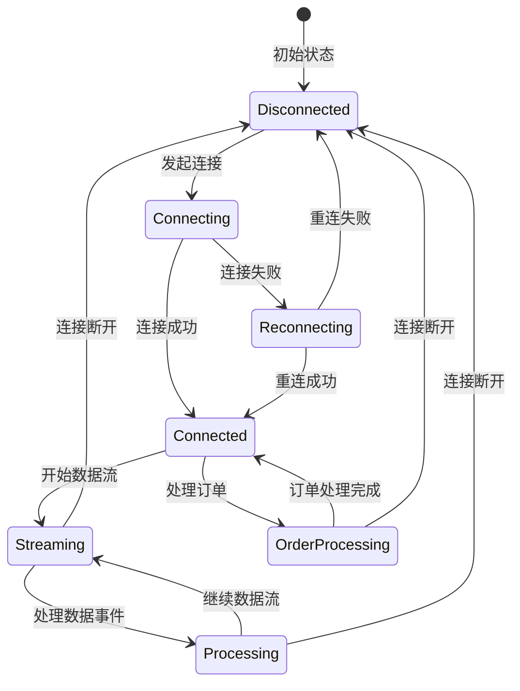
```mermaid
stateDiagram-v2
[*] --> Disconnected : 初始状态
Disconnected --> Connecting : 发起连接
Connecting --> Connected : 连接成功
Connecting --> Reconnecting : 连接失败
Reconnecting --> Connected : 重连成功
Reconnecting --> Disconnected : 重连失败
Connected --> Streaming : 开始数据流
Streaming --> Processing : 处理数据事件
Processing --> Streaming : 继续数据流
Connected --> OrderProcessing : 处理订单
OrderProcessing --> Connected : 订单处理完成
Streaming --> Disconnected : 连接断开
Processing --> Disconnected : 连接断开
OrderProcessing --> Disconnected : 连接断开
```

**图表来源**
- [oandastore.py](file://backtrader/stores/oandastore.py#L332-L441)

#### 订单生命周期

OANDA订单处理遵循严格的生命周期管理：

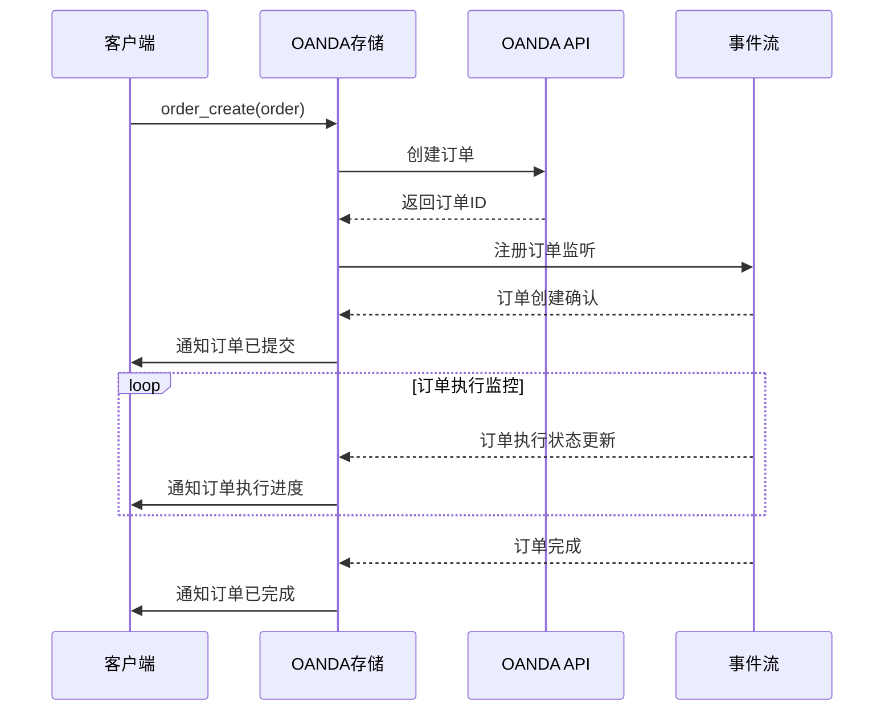
```mermaid
sequenceDiagram
participant Client as 客户端
participant Store as OANDA存储
participant API as OANDA API
participant Streamer as 事件流
Client->>Store : order_create(order)
Store->>API : 创建订单
API-->>Store : 返回订单ID
Store->>Streamer : 注册订单监听
Streamer-->>Store : 订单创建确认
Store->>Client : 通知订单已提交
loop 订单执行监控
Streamer-->>Store : 订单执行状态更新
Store->>Client : 通知订单执行进度
end
Streamer-->>Store : 订单完成
Store->>Client : 通知订单已完成
```

**图表来源**
- [oandastore.py](file://backtrader/stores/oandastore.py#L502-L548)

**章节来源**
- [oandastore.py](file://backtrader/stores/oandastore.py#L177-L660)
- [oandabroker.py](file://backtrader/brokers/oandabroker.py#L60-L358)
- [oandatest.py](file://samples/oandatest/oandatest.py#L191-L340)

### Pyfolio绩效分析集成

#### 分析器组合

Pyfolio分析器通过组合多个子分析器来提供全面的投资组合分析：

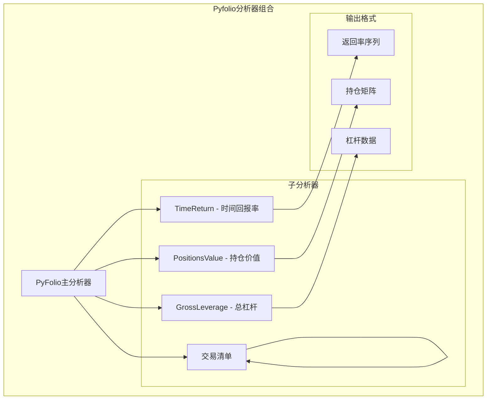
```mermaid
graph TB
subgraph "Pyfolio分析器组合"
PyFolio[PyFolio主分析器]
subgraph "子分析器"
TimeReturn[TimeReturn - 时间回报率]
PositionsValue[PositionsValue - 持仓价值]
Transactions[Transactions - 交易记录]
GrossLeverage[GrossLeverage - 总杠杆]
end
subgraph "输出格式"
Returns[返回率序列]
Positions[持仓矩阵]
Transactions[交易清单]
Leverage[杠杆数据]
end
end
PyFolio --> TimeReturn
PyFolio --> PositionsValue
PyFolio --> Transactions
PyFolio --> GrossLeverage
TimeReturn --> Returns
PositionsValue --> Positions
Transactions --> Transactions
GrossLeverage --> Leverage
```

**图表来源**
- [pyfolio.py](file://backtrader/analyzers/pyfolio.py#L33-L101)

#### 数据转换流程

Pyfolio集成了复杂的数据转换和格式化过程：

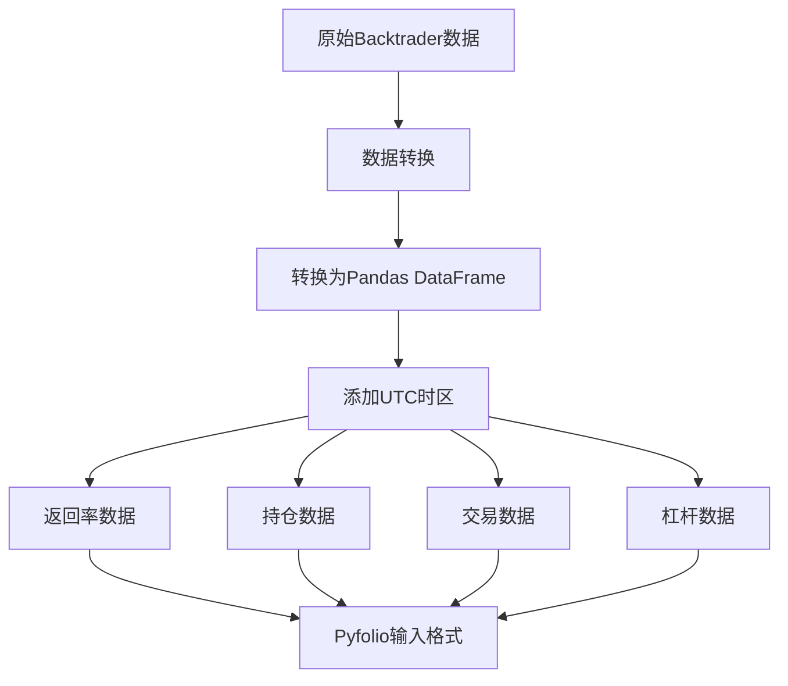
```mermaid
flowchart TD
RawData[原始Backtrader数据] --> Transform[数据转换]
Transform --> PandasDF[转换为Pandas DataFrame]
PandasDF --> DateTimeTZ[添加UTC时区]
DateTimeTZ --> Returns[返回率数据]
DateTimeTZ --> Positions[持仓数据]
DateTimeTZ --> Transactions[交易数据]
DateTimeTZ --> Leverage[杠杆数据]
Returns --> PyFolioInput[Pyfolio输入格式]
Positions --> PyFolioInput
Transactions --> PyFolioInput
Leverage --> PyFolioInput
```

**图表来源**
- [pyfolio.py](file://backtrader/analyzers/pyfolio.py#L102-L163)

**章节来源**
- [pyfolio.py](file://backtrader/analyzers/pyfolio.py#L33-L164)
- [pyfoliotest.py](file://samples/pyfolio2/pyfoliotest.py#L94-L183)

### Yahoo Finance数据源

#### 数据下载机制

Yahoo Finance集成了现代化的yfinance库进行数据获取：

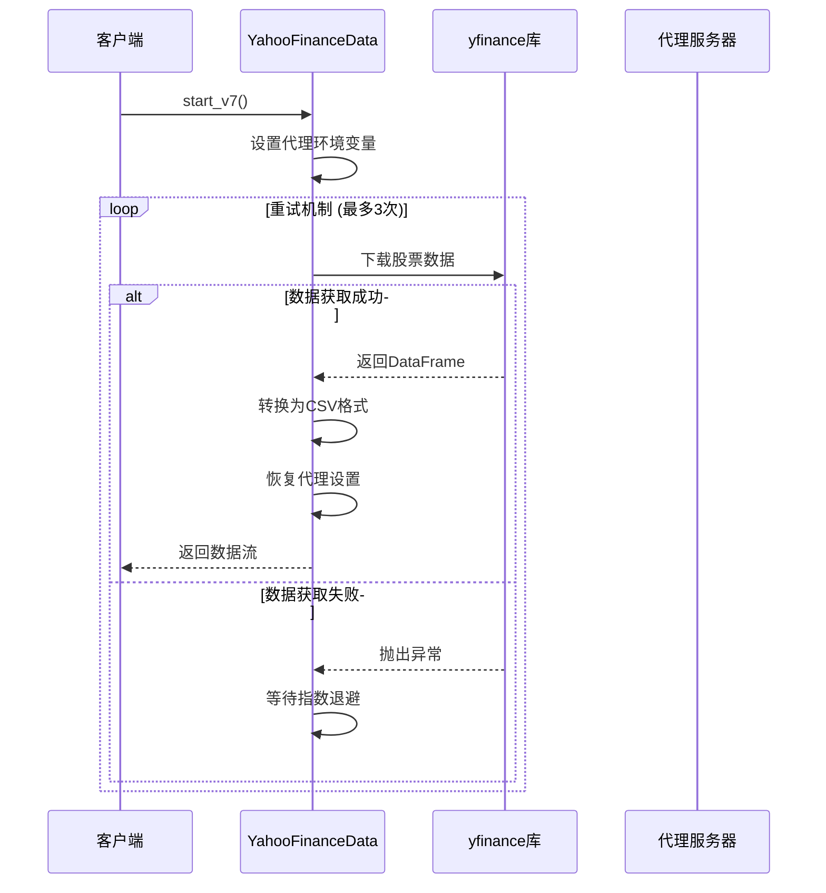
```mermaid
sequenceDiagram
participant Client as 客户端
participant YahooData as YahooFinanceData
participant YF as yfinance库
participant Proxy as 代理服务器
Client->>YahooData : start_v7()
YahooData->>YahooData : 设置代理环境变量
loop 重试机制 (最多3次)
YahooData->>YF : 下载股票数据
alt 数据获取成功
YF-->>YahooData : 返回DataFrame
YahooData->>YahooData : 转换为CSV格式
YahooData->>YahooData : 恢复代理设置
YahooData-->>Client : 返回数据流
else 数据获取失败
YF-->>YahooData : 抛出异常
YahooData->>YahooData : 等待指数退避
end
end
```

**图表来源**
- [yahoo.py](file://backtrader/feeds/yahoo.py#L253-L357)

#### 错误处理策略

Yahoo Finance数据源实现了完善的错误处理和重试机制：

| 错误类型 | 处理策略 | 重试次数 | 等待时间 |
|----------|----------|----------|----------|
| 网络超时 | 指数退避重试 | 3次 | 5+2^n 秒 |
| 数据为空 | 用户友好错误提示 | 3次 | 3+2^n 秒 |
| API限制 | 等待后重试 | 3次 | 固定等待 |
| 代理错误 | 恢复原始设置 | 1次 | 立即重试 |

**章节来源**
- [yahoo.py](file://backtrader/feeds/yahoo.py#L253-L357)
- [yahoo-test.py](file://samples/yahoo-test/yahoo-test.py#L33-L67)

## 依赖关系分析

### 组件间依赖关系

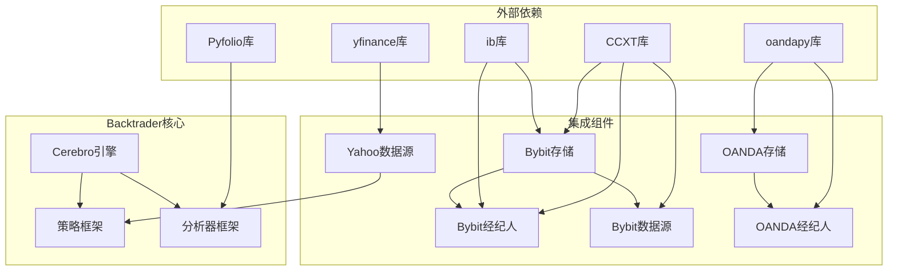
```mermaid
graph TB
subgraph "外部依赖"
CCXT[CCXT库]
Pyfolio[Pyfolio库]
YFinance[yfinance库]
OANDA[oandapy库]
IB[ib库]
end
subgraph "Backtrader核心"
Cerebro[Cerebro引擎]
Strategy[策略框架]
Analyzer[分析器框架]
end
subgraph "集成组件"
BybitStore[Bybit存储]
BybitBroker[Bybit经纪人]
BybitData[Bybit数据源]
OandaStore[OANDA存储]
OandaBroker[OANDA经纪人]
YahooData[Yahoo数据源]
end
CCXT --> BybitStore
CCXT --> BybitBroker
CCXT --> BybitData
Pyfolio --> Analyzer
YFinance --> YahooData
OANDA --> OandaStore
OANDA --> OandaBroker
IB --> BybitStore
IB --> BybitBroker
Cerebro --> Strategy
Cerebro --> Analyzer
BybitStore --> BybitBroker
BybitStore --> BybitData
OandaStore --> OandaBroker
YahooData --> Strategy
```

**图表来源**
- [bybit-live-trading.py](file://samples/ccxt-bybit/bybit-live-trading.py#L63-L63)
- [oandastore.py](file://backtrader/stores/oandastore.py#L30-L36)
- [yahoo.py](file://backtrader/feeds/yahoo.py#L254-L256)

### 数据流依赖

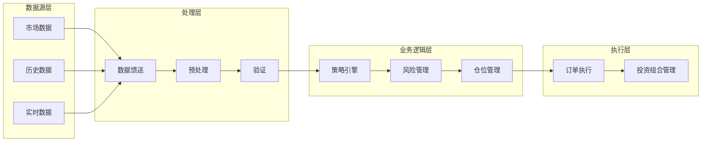
```mermaid
flowchart LR
subgraph "数据源层"
MarketData[市场数据]
HistoricalData[历史数据]
RealTimeData[实时数据]
end
subgraph "处理层"
DataFeed[数据馈送]
Preprocessing[预处理]
Validation[验证]
end
subgraph "业务逻辑层"
Strategy[策略引擎]
RiskManagement[风险管理]
PositionSizing[仓位管理]
end
subgraph "执行层"
OrderExecution[订单执行]
PortfolioManagement[投资组合管理]
end
MarketData --> DataFeed
HistoricalData --> DataFeed
RealTimeData --> DataFeed
DataFeed --> Preprocessing
Preprocessing --> Validation
Validation --> Strategy
Strategy --> RiskManagement
RiskManagement --> PositionSizing
PositionSizing --> OrderExecution
OrderExecution --> PortfolioManagement
```

**图表来源**
- [bybit-live-trading.py](file://samples/ccxt-bybit/bybit-live-trading.py#L659-L782)
- [broker.py](file://real_trade/bybit/broker.py#L133-L332)

**章节来源**
- [bybit-live-trading.py](file://samples/ccxt-bybit/bybit-live-trading.py#L659-L782)
- [oandastore.py](file://backtrader/stores/oandastore.py#L177-L660)
- [pyfolio.py](file://backtrader/analyzers/pyfolio.py#L33-L164)

## 性能考虑

### 内存优化策略

1. **数据流控制**
   - 实时数据流采用队列机制，避免内存溢出
   - 历史数据分批加载，支持大数据集处理
   - 自动垃圾回收机制

2. **连接池管理**
   - 单例模式确保连接复用
   - 连接超时自动重连
   - 错误连接自动清理

3. **缓存策略**
   - 价格数据本地缓存
   - 历史数据索引优化
   - 频繁访问数据预加载

### 并发处理

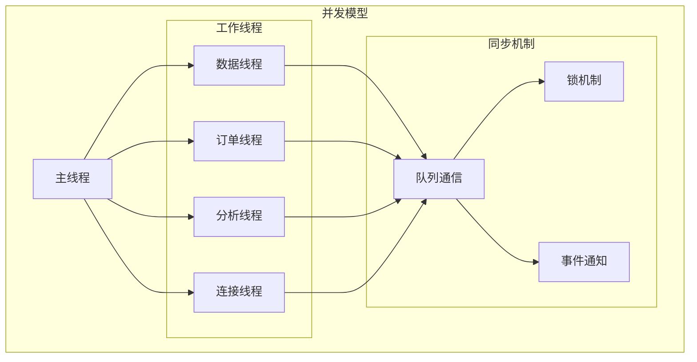
```mermaid
graph TB
subgraph "并发模型"
MainThread[主线程]
subgraph "工作线程"
DataThread[数据线程]
OrderThread[订单线程]
AnalysisThread[分析线程]
ConnectionThread[连接线程]
end
subgraph "同步机制"
Queue[队列通信]
Lock[锁机制]
Event[事件通知]
end
end
MainThread --> DataThread
MainThread --> OrderThread
MainThread --> AnalysisThread
MainThread --> ConnectionThread
DataThread --> Queue
OrderThread --> Queue
AnalysisThread --> Queue
ConnectionThread --> Queue
Queue --> Lock
Queue --> Event
```

**图表来源**
- [oandastore.py](file://backtrader/stores/oandastore.py#L332-L441)

### 网络优化

1. **请求合并**
   - 批量数据请求
   - 连接复用
   - 压缩传输

2. **超时管理**
   - 动态超时调整
   - 重试策略优化
   - 断线检测

## 故障排除指南

### 常见问题诊断

#### 连接问题

| 问题症状 | 可能原因 | 解决方案 |
|----------|----------|----------|
| 无法连接Bybit | API密钥错误或网络问题 | 验证API密钥和网络连接 |
| IB连接失败 | TWS未启动或端口错误 | 检查TWS状态和端口配置 |
| OANDA连接中断 | 账户权限不足 | 验证账户权限和token |
| Yahoo数据下载失败 | 网络超时或API限制 | 实施重试机制和代理设置 |

#### 订单执行问题

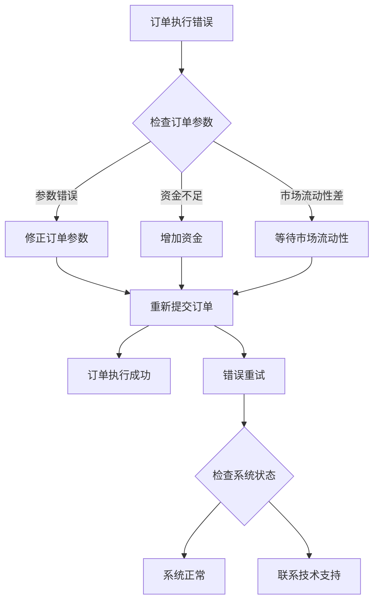
```mermaid
flowchart TD
OrderError[订单执行错误] --> CheckParams{检查订单参数}
CheckParams --> |参数错误| FixParams[修正订单参数]
CheckParams --> |资金不足| AddFunds[增加资金]
CheckParams --> |市场流动性差| WaitMarket[等待市场流动性]
FixParams --> Resubmit[重新提交订单]
AddFunds --> Resubmit
WaitMarket --> Resubmit
Resubmit --> Success[订单执行成功]
Resubmit --> ErrorRetry[错误重试]
ErrorRetry --> CheckSystem{检查系统状态}
CheckSystem --> SystemOK[系统正常]
CheckSystem --> ContactSupport[联系技术支持]
```

**图表来源**
- [broker.py](file://real_trade/bybit/broker.py#L301-L332)

#### 数据质量问题

1. **数据缺失**
   - 实现数据完整性检查
   - 自动数据修复机制
   - 备用数据源切换

2. **时间戳问题**
   - 统一时区处理
   - 时钟偏移校正
   - 闰秒处理

**章节来源**
- [broker.py](file://real_trade/bybit/broker.py#L301-L332)
- [bybit-live-trading.py](file://samples/ccxt-bybit/bybit-live-trading.py#L197-L227)

### 调试技巧

1. **日志记录**
   - 启用详细日志模式
   - 区分不同组件的日志级别
   - 实时日志监控

2. **性能监控**
   - 关键指标跟踪
   - 内存使用监控
   - 网络延迟测量

3. **错误追踪**
   - 异常堆栈跟踪
   - 请求响应日志
   - 状态码分析

## 结论

Backtrader的集成应用示例展示了现代量化交易系统的完整架构。通过模块化的组件设计和标准化的接口，系统能够灵活地集成各种金融数据源和交易执行平台。

### 主要优势

1. **高度可扩展性** - 模块化设计支持新组件快速集成
2. **多平台兼容** - 统一的接口适配不同的交易所和数据提供商
3. **生产级稳定性** - 完善的错误处理和恢复机制
4. **性能优化** - 高效的数据处理和内存管理

### 最佳实践建议

1. **分层架构设计** - 明确各层职责，保持接口简洁
2. **错误处理优先** - 实现全面的异常处理和降级策略
3. **监控告警** - 建立完善的系统监控和告警机制
4. **测试覆盖** - 单元测试、集成测试和压力测试并重

### 未来发展方向

1. **云原生支持** - 容器化部署和微服务架构
2. **机器学习集成** - AI驱动的策略优化和风险管理
3. **实时分析** - 流式数据处理和实时决策
4. **合规监控** - 自动化合规检查和报告生成

## 附录

### 配置模板

#### Bybit集成配置

```python
# 基础配置
config = {
    'apikey': 'YOUR_API_KEY',
    'secret': 'YOUR_SECRET',
    'symbol': 'BTC/USDT',
    'testnet': True,
    'paper_trading': True,
    'initial_cash': 10000.0
}

# 高级配置
advanced_config = {
    'proxy': 'http://127.0.0.1:7890',
    'timeframe': '1m',
    'market_type': 'spot',
    'historical_limit': 1000
}
```

#### Pyfolio分析配置

```python
# 分析器配置
analyzer_config = {
    'timeframe': bt.TimeFrame.Days,
    'compression': 1,
    'headers': True,
    'cash': True
}

# 输出格式配置
output_config = {
    'returns': True,
    'positions': True,
    'transactions': True,
    'gross_lev': True
}
```

### 部署检查清单

1. **环境准备**
   - Python版本兼容性验证
   - 第三方库依赖安装
   - 系统资源评估

2. **配置验证**
   - API密钥有效性检查
   - 网络连接测试
   - 权限配置验证

3. **功能测试**
   - 回测功能验证
   - 实盘交易测试
   - 异常处理测试

4. **监控设置**
   - 日志系统配置
   - 性能指标监控
   - 告警规则设置