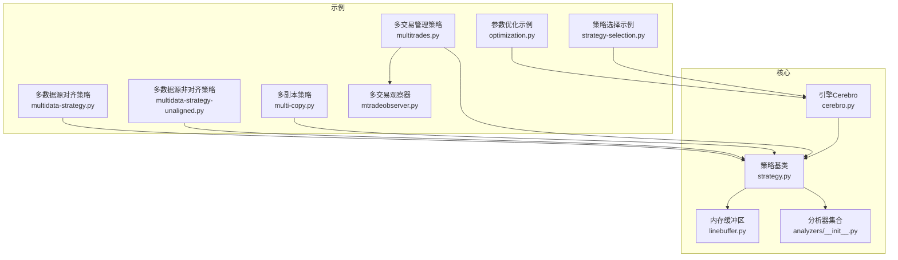
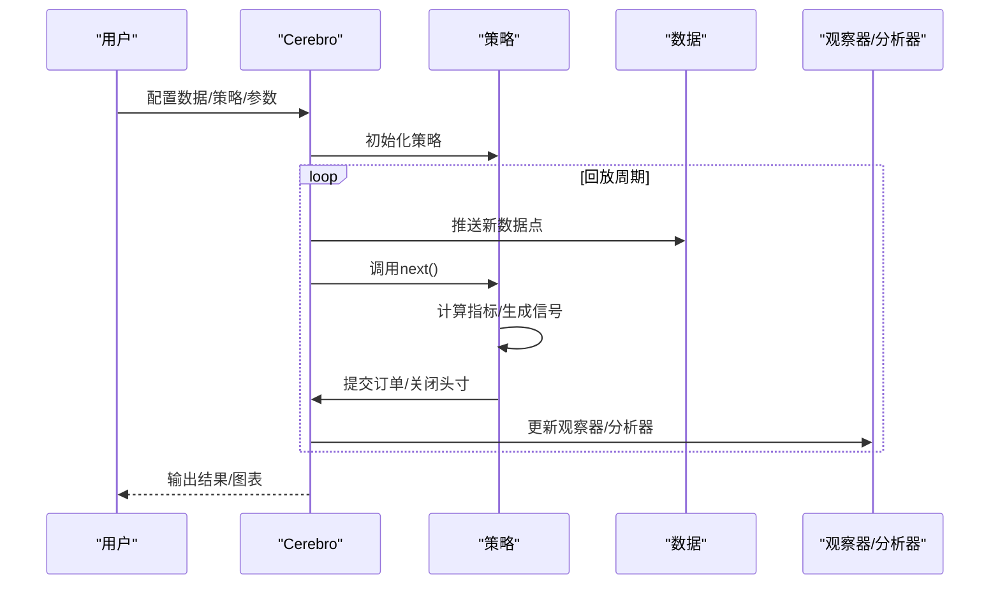
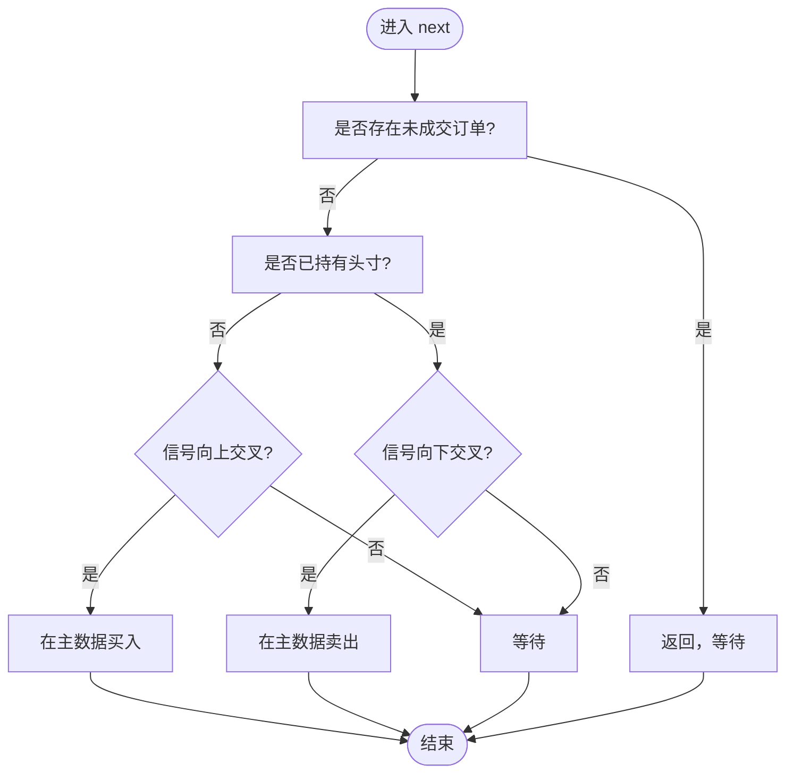
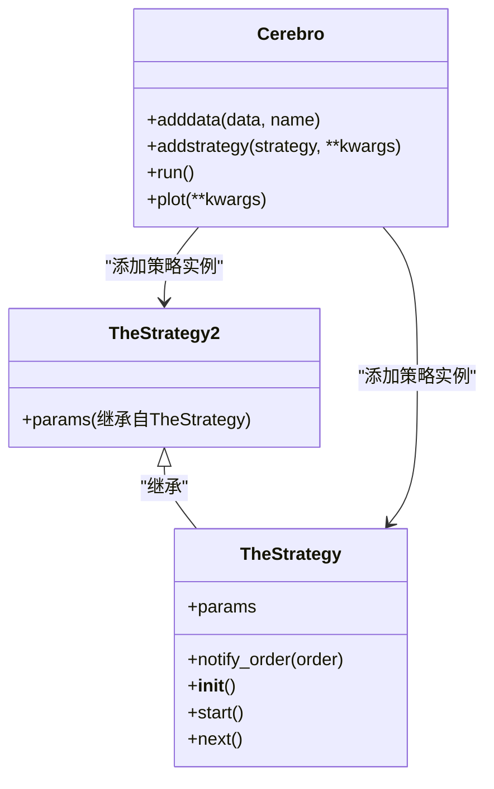
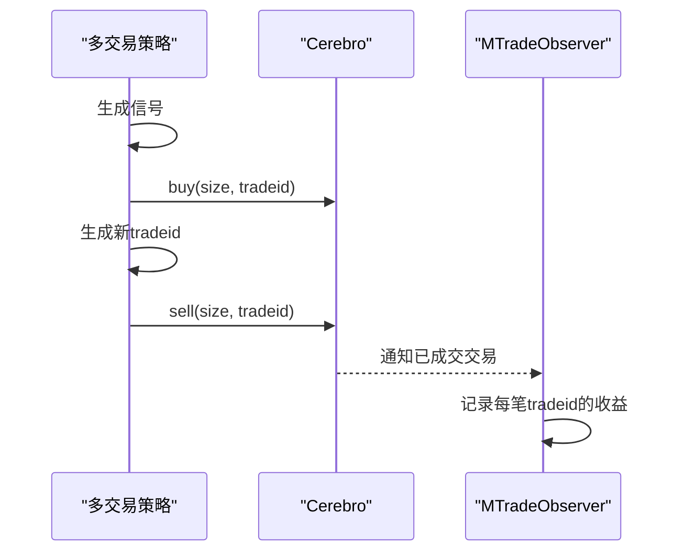
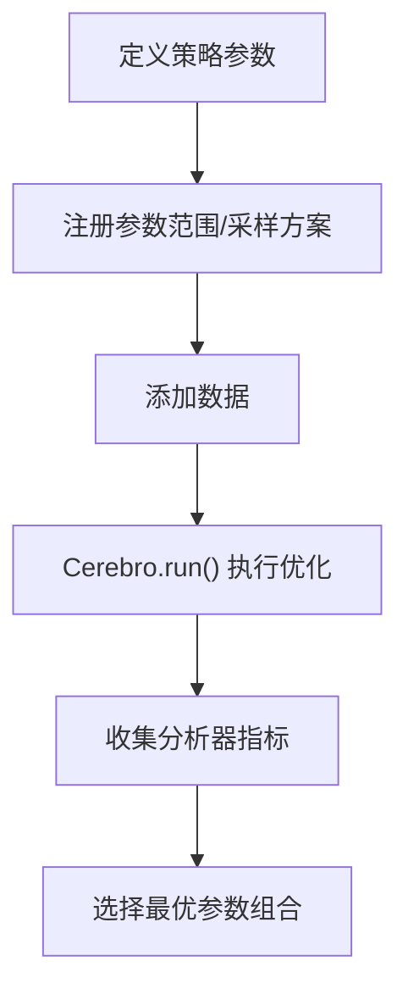
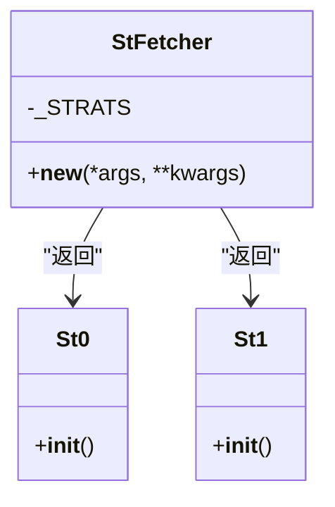
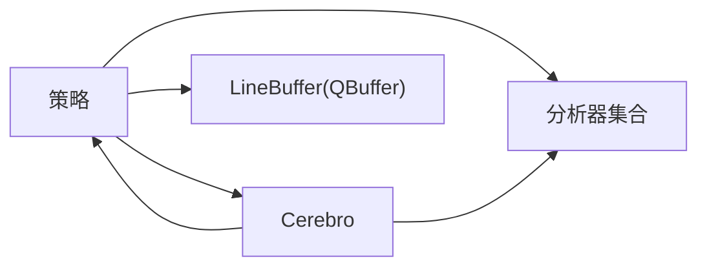

# 高级策略示例

<cite>
**本文引用的文件**   
- [samples/multidata-strategy/multidata-strategy.py](file://samples/multidata-strategy/multidata-strategy.py)
- [samples/multidata-strategy/multidata-strategy-unaligned.py](file://samples/multidata-strategy/multidata-strategy-unaligned.py)
- [samples/multi-copy/multi-copy.py](file://samples/multi-copy/multi-copy.py)
- [samples/multitrades/multitrades.py](file://samples/multitrades/multitrades.py)
- [samples/multitrades/mtradeobserver.py](file://samples/multitrades/mtradeobserver.py)
- [samples/optimization/optimization.py](file://samples/optimization/optimization.py)
- [samples/strategy-selection/strategy-selection.py](file://samples/strategy-selection/strategy-selection.py)
- [backtrader/strategy.py](file://backtrader/strategy.py)
- [backtrader/cerebro.py](file://backtrader/cerebro.py)
- [backtrader/linebuffer.py](file://backtrader/linebuffer.py)
- [backtrader/analyzers/__init__.py](file://backtrader/analyzers/__init__.py)
- [README.rst](file://README.rst)
</cite>

## 目录
1. [引言](#引言)
2. [项目结构](#项目结构)
3. [核心组件](#核心组件)
4. [架构总览](#架构总览)
5. [详细组件分析](#详细组件分析)
6. [依赖关系分析](#依赖关系分析)
7. [性能考虑](#性能考虑)
8. [故障排查指南](#故障排查指南)
9. [结论](#结论)
10. [附录](#附录)

## 引言
本文件面向希望在Backtrader中构建“高级策略”的用户，系统梳理多数据源策略、多副本策略、多交易同时管理、参数优化与策略选择机制，并给出性能优化与调试方法。内容基于仓库中的示例与核心模块源码进行归纳总结，帮助读者从架构到实现细节全面掌握。

## 项目结构
本仓库包含策略示例、核心引擎与分析器等模块。与高级策略密切相关的示例位于samples目录下，核心运行时由backtrader包提供。

**图表来源**
- [samples/multidata-strategy/multidata-strategy.py](file://samples/multidata-strategy/multidata-strategy.py#L1-L217)
- [samples/multidata-strategy/multidata-strategy-unaligned.py](file://samples/multidata-strategy/multidata-strategy-unaligned.py#L1-L215)
- [samples/multi-copy/multi-copy.py](file://samples/multi-copy/multi-copy.py#L1-L250)
- [samples/multitrades/multitrades.py](file://samples/multitrades/multitrades.py#L1-L221)
- [samples/multitrades/mtradeobserver.py](file://samples/multitrades/mtradeobserver.py#L1-L50)
- [samples/optimization/optimization.py](file://samples/optimization/optimization.py#L1-L197)
- [samples/strategy-selection/strategy-selection.py](file://samples/strategy-selection/strategy-selection.py#L1-L93)
- [backtrader/strategy.py](file://backtrader/strategy.py#L107-L200)
- [backtrader/cerebro.py](file://backtrader/cerebro.py#L60-L200)
- [backtrader/linebuffer.py](file://backtrader/linebuffer.py#L82-L182)
- [backtrader/analyzers/__init__.py](file://backtrader/analyzers/__init__.py#L1-L44)

**章节来源**
- [README.rst](file://README.rst#L66-L101)

## 核心组件
- 策略基类与生命周期：策略基类负责注册指标、初始化资金、订单与交易容器、内存节省策略等；支持next/notify_order/notify_trade等钩子。
- 引擎Cerebro：统一调度数据、策略、分析器、观察器与回测流程，支持优化、多进程、预加载与内存节省等配置。
- 内存缓冲区：通过QBuffer机制按需保留最小必要长度，降低内存占用。
- 分析器集合：提供收益、最大回撤、夏普比率、交易统计等分析能力。

**章节来源**
- [backtrader/strategy.py](file://backtrader/strategy.py#L107-L200)
- [backtrader/cerebro.py](file://backtrader/cerebro.py#L60-L200)
- [backtrader/linebuffer.py](file://backtrader/linebuffer.py#L82-L182)
- [backtrader/analyzers/__init__.py](file://backtrader/analyzers/__init__.py#L1-L44)

## 架构总览
Backtrader采用“引擎+策略+数据+指标/观察器/分析器”的分层架构。Cerebro作为顶层调度器，驱动策略在给定数据上迭代执行，策略通过指标生成信号并提交订单，观察器与分析器在过程中记录状态与指标。

**图表来源**
- [backtrader/cerebro.py](file://backtrader/cerebro.py#L60-L200)
- [backtrader/strategy.py](file://backtrader/strategy.py#L107-L200)

## 详细组件分析

### 多数据源策略（对齐与非对齐）
- 对齐数据策略要点
  - 使用两个数据源，第二个数据用于生成信号，第一个数据执行买卖操作。
  - 在信号交叉时下单，避免同一时刻重复下单。
  - 支持打印数据长度与时间戳，便于对齐校验。
- 非对齐数据策略要点
  - 两个数据源时间轴不同步，策略通过信号交叉判断入场/出场。
  - 同样避免重复下单，且可打印两数据的时间戳差异。

**图表来源**
- [samples/multidata-strategy/multidata-strategy.py](file://samples/multidata-strategy/multidata-strategy.py#L84-L108)
- [samples/multidata-strategy/multidata-strategy-unaligned.py](file://samples/multidata-strategy/multidata-strategy-unaligned.py#L84-L106)

**章节来源**
- [samples/multidata-strategy/multidata-strategy.py](file://samples/multidata-strategy/multidata-strategy.py#L33-L115)
- [samples/multidata-strategy/multidata-strategy-unaligned.py](file://samples/multidata-strategy/multidata-strategy-unaligned.py#L33-L113)

### 多副本策略（同策略实例化多次）
- 设计思路
  - 同一策略类通过不同参数实例化多个副本，分别作用于同一或复制后的数据。
  - 通过命名数据源与目标数据选择，实现多信号源协同。
- 实现细节
  - 参数覆盖与eval解析，支持命令行传参。
  - 数据复制与共享，控制信号权重与头寸规模。
  - 观察不同信号的开平仓行为，避免重复下单。

**图表来源**
- [samples/multi-copy/multi-copy.py](file://samples/multi-copy/multi-copy.py#L32-L137)
- [samples/multi-copy/multi-copy.py](file://samples/multi-copy/multi-copy.py#L139-L250)

**章节来源**
- [samples/multi-copy/multi-copy.py](file://samples/multi-copy/multi-copy.py#L32-L137)
- [samples/multi-copy/multi-copy.py](file://samples/multi-copy/multi-copy.py#L139-L250)

### 多交易同时管理策略
- 关键点
  - 利用tradeid实现多笔交易并行管理，循环分配不同的tradeid。
  - 通过close(tradeid=...)对特定交易进行平仓，避免全仓一次性平掉。
  - 结合自定义观察器记录每笔交易的收益曲线。
- 适用场景
  - 同一信号源产生多笔独立交易，需要精细化管理每笔交易的风险与收益。

**图表来源**
- [samples/multitrades/multitrades.py](file://samples/multitrades/multitrades.py#L36-L121)
- [samples/multitrades/mtradeobserver.py](file://samples/multitrades/mtradeobserver.py#L29-L50)

**章节来源**
- [samples/multitrades/multitrades.py](file://samples/multitrades/multitrades.py#L36-L121)
- [samples/multitrades/mtradeobserver.py](file://samples/multitrades/mtradeobserver.py#L29-L50)

### 参数优化（网格搜索与随机优化）
- 网格搜索
  - 使用Cerebro的optstrategy与range指定参数范围，遍历所有组合。
  - 可设置多进程maxcpus、优化数据预加载与返回值以提升性能。
- 随机优化
  - 可在参数空间中采样随机组合，结合分析器评估指标选择最优组合。
- 流程
  - 定义策略参数 → 注册优化参数范围 → 添加数据 → 运行 → 解析结果。

**图表来源**
- [samples/optimization/optimization.py](file://samples/optimization/optimization.py#L51-L102)
- [backtrader/cerebro.py](file://backtrader/cerebro.py#L60-L200)

**章节来源**
- [samples/optimization/optimization.py](file://samples/optimization/optimization.py#L51-L102)
- [backtrader/cerebro.py](file://backtrader/cerebro.py#L60-L200)

### 策略选择机制
- 通过工厂类根据索引动态选择策略，结合优化器遍历不同策略实现对比。
- 典型做法：定义多个策略类，使用工厂类返回对应实例，再用optstrategy遍历。

**图表来源**
- [samples/strategy-selection/strategy-selection.py](file://samples/strategy-selection/strategy-selection.py#L29-L51)

**章节来源**
- [samples/strategy-selection/strategy-selection.py](file://samples/strategy-selection/strategy-selection.py#L29-L51)

## 依赖关系分析
- 策略与引擎
  - 策略通过Cerebro注册与运行，受其调度与配置影响。
  - 策略内部维护订单、交易、观察器与分析器集合。
- 内存与性能
  - 策略可通过qbuffer启用内存节省，减少历史数据缓存。
  - 数据缓冲区LineBuffer支持QBuffer模式，按最小周期限制长度。
- 分析器
  - 分析器集合提供多种指标，可在策略中直接调用或在Cerebro中注册。

**图表来源**
- [backtrader/strategy.py](file://backtrader/strategy.py#L120-L154)
- [backtrader/linebuffer.py](file://backtrader/linebuffer.py#L121-L148)
- [backtrader/analyzers/__init__.py](file://backtrader/analyzers/__init__.py#L1-L44)

**章节来源**
- [backtrader/strategy.py](file://backtrader/strategy.py#L120-L154)
- [backtrader/linebuffer.py](file://backtrader/linebuffer.py#L121-L148)
- [backtrader/analyzers/__init__.py](file://backtrader/analyzers/__init__.py#L1-L44)

## 性能考虑
- 内存节省
  - 使用exactbars=-1/-2在保持绘图与预加载的同时减少内存占用。
  - 策略与指标启用qbuffer，仅保留最小必要长度。
- 并行优化
  - 设置maxcpus使用多核加速参数优化。
  - 开启optdatas/optreturn减少数据预加载与返回对象开销。
- 数据与运行模式
  - preload/runonce影响向量化计算与事件驱动执行的平衡。
  - live模式会禁用预加载与runonce，适合实时场景。

**章节来源**
- [backtrader/cerebro.py](file://backtrader/cerebro.py#L60-L200)
- [backtrader/strategy.py](file://backtrader/strategy.py#L120-L154)
- [samples/optimization/optimization.py](file://samples/optimization/optimization.py#L54-L68)

## 故障排查指南
- 订单状态与日志
  - 在notify_order中记录订单完成/过期/取消/保证金不足等状态，便于定位执行问题。
- 多数据源对齐
  - 打印两数据的时间戳与长度，确认是否对齐；非对齐时注意信号与下单的数据源一致性。
- 多交易管理
  - 明确tradeid分配与平仓范围，避免误关其他交易。
- 观察器与分析器
  - 确保已添加所需观察器与分析器，以便输出交易收益与风险指标。

**章节来源**
- [samples/multidata-strategy/multidata-strategy.py](file://samples/multidata-strategy/multidata-strategy.py#L56-L74)
- [samples/multidata-strategy/multidata-strategy-unaligned.py](file://samples/multidata-strategy/multidata-strategy-unaligned.py#L56-L71)
- [samples/multitrades/multitrades.py](file://samples/multitrades/multitrades.py#L94-L121)

## 结论
通过多数据源策略、多副本策略与多交易管理，Backtrader能够支持复杂的跨市场、跨信号源的高级交易逻辑。配合参数优化与策略选择机制，可以系统性地筛选最优策略与参数组合。在性能方面，合理使用内存节省、并行优化与运行模式配置，能够在保证精度的同时显著提升效率。

## 附录
- 快速开始与特性概览可参考项目说明文档。
- 示例覆盖了多数据源、多副本、多交易、优化与策略选择等主题，适合作为进阶学习的参考。

**章节来源**
- [README.rst](file://README.rst#L66-L101)