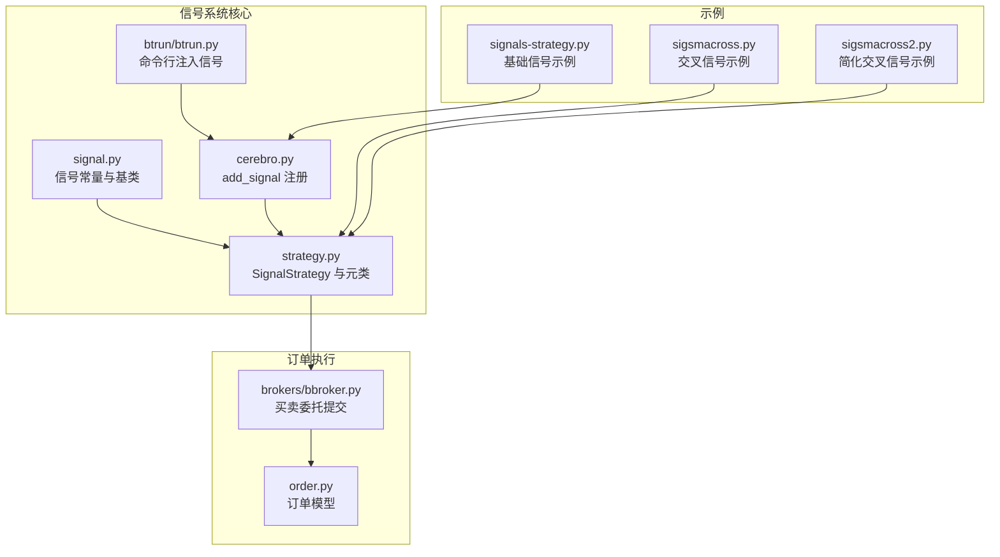
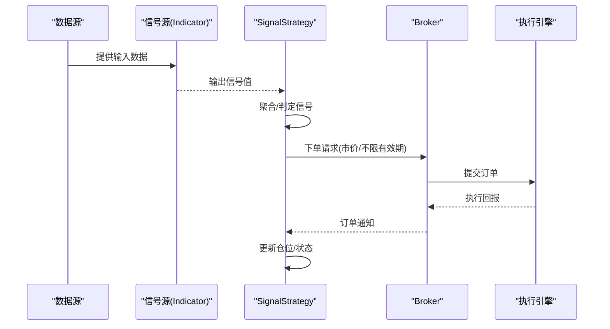
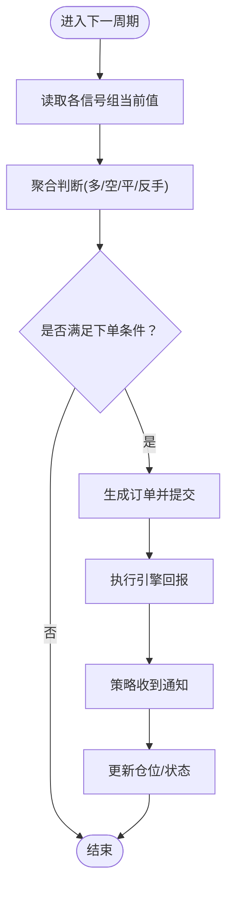
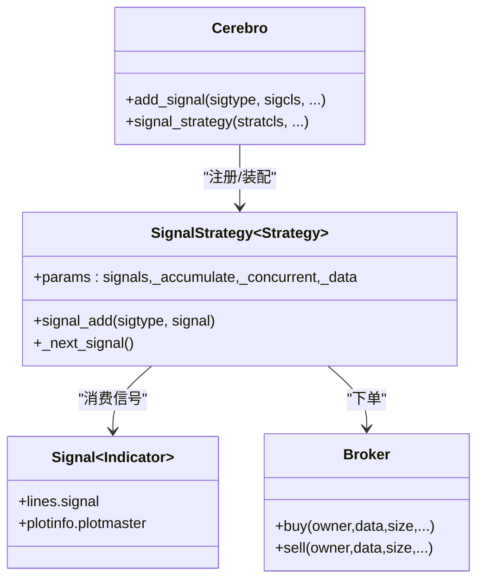

# 信号系统

<cite>
**本文引用的文件**
- [backtrader/signal.py](file://backtrader/signal.py)
- [backtrader/strategy.py](file://backtrader/strategy.py)
- [backtrader/cerebro.py](file://backtrader/cerebro.py)
- [samples/signals-strategy/signals-strategy.py](file://samples/signals-strategy/signals-strategy.py)
- [samples/sigsmacross/sigsmacross.py](file://samples/sigsmacross/sigsmacross.py)
- [samples/sigsmacross/sigsmacross2.py](file://samples/sigsmacross/sigsmacross2.py)
- [backtrader/btrun/btrun.py](file://backtrader/btrun/btrun.py)
- [backtrader/brokers/bbroker.py](file://backtrader/brokers/bbroker.py)
- [backtrader/order.py](file://backtrader/order.py)
</cite>

## 目录
1. [简介](#简介)
2. [项目结构](#项目结构)
3. [核心组件](#核心组件)
4. [架构总览](#架构总览)
5. [组件详解](#组件详解)
6. [依赖关系分析](#依赖关系分析)
7. [性能考量](#性能考量)
8. [故障排查指南](#故障排查指南)
9. [结论](#结论)
10. [附录](#附录)

## 简介
本文件系统化梳理 Backtrader 的信号系统，重点围绕 SignalStrategy 类的设计与使用展开，涵盖信号的生成、传播与处理机制；信号类型与分类（买入、卖出、中性等）；信号系统的架构（信号源、信号处理器、信号接收器）；信号生命周期（从生成到执行）；信号组合与过滤（多信号融合、信号验证）；以及与订单管理的集成方式。文末提供可直接定位到示例代码路径的参考，便于读者快速上手。

## 项目结构
与信号系统直接相关的模块与示例分布如下：
- 核心信号定义：backtrader/signal.py
- 信号策略与元类：backtrader/strategy.py
- 运行器与信号注册：backtrader/cerebro.py
- 命令行参数解析（信号注入）：backtrader/btrun/btrun.py
- 示例：samples/signals-strategy/signals-strategy.py、samples/sigsmacross/sigsmacross*.py
- 订单与执行：backtrader/order.py、backtrader/brokers/bbroker.py

图表来源
- [backtrader/signal.py](file://backtrader/signal.py#L26-L63)
- [backtrader/strategy.py](file://backtrader/strategy.py#L1472-L1521)
- [backtrader/cerebro.py](file://backtrader/cerebro.py#L592-L610)
- [backtrader/btrun/btrun.py](file://backtrader/btrun/btrun.py#L540-L572)
- [samples/signals-strategy/signals-strategy.py](file://samples/signals-strategy/signals-strategy.py#L61-L96)
- [samples/sigsmacross/sigsmacross.py](file://samples/sigsmacross/sigsmacross.py#L30-L51)
- [samples/sigsmacross/sigsmacross2.py](file://samples/sigsmacross/sigsmacross2.py#L25-L31)
- [backtrader/order.py](file://backtrader/order.py#L145-L193)
- [backtrader/brokers/bbroker.py](file://backtrader/brokers/bbroker.py#L667-L685)

章节来源
- [backtrader/signal.py](file://backtrader/signal.py#L26-L63)
- [backtrader/strategy.py](file://backtrader/strategy.py#L1524-L1719)
- [backtrader/cerebro.py](file://backtrader/cerebro.py#L592-L610)
- [backtrader/btrun/btrun.py](file://backtrader/btrun/btrun.py#L540-L572)
- [samples/signals-strategy/signals-strategy.py](file://samples/signals-strategy/signals-strategy.py#L61-L96)
- [samples/sigsmacross/sigsmacross.py](file://samples/sigsmacross/sigsmacross.py#L30-L51)
- [samples/sigsmacross/sigsmacross2.py](file://samples/sigsmacross/sigsmacross2.py#L25-L31)
- [backtrader/order.py](file://backtrader/order.py#L145-L193)
- [backtrader/brokers/bbroker.py](file://backtrader/brokers/bbroker.py#L667-L685)

## 核心组件
- 信号常量与类型
  - 定义了 14 种信号类型，覆盖“无信号”、“多空同开”、“做多”、“做多反向/任意”、“做空”、“做空反向/任意”、“做多平仓”、“做空平仓”及其反向/任意变体。
  - 参考路径：[信号常量与类型定义](file://backtrader/signal.py#L26-L53)

- Signal 基类
  - 继承自 Indicator，输出名为 signal 的单一线条，用于承载信号值。
  - 参考路径：[Signal 基类](file://backtrader/signal.py#L56-L63)

- SignalStrategy 策略
  - 自动化交易策略，基于信号进行下单决策。
  - 支持主组（LONGSHORT/LONG/SHORT）与退出组（LONGEXIT/SHORTEXIT），并内置并发与累计参数控制。
  - 参考路径：[SignalStrategy 类与参数](file://backtrader/strategy.py#L1524-L1610)、[信号计算与下单逻辑](file://backtrader/strategy.py#L1635-L1719)

- 信号注册与运行器
  - Cerebro 提供 add_signal 接口，将信号按类型注册到 SignalStrategy。
  - 参考路径：[add_signal 与策略装配](file://backtrader/cerebro.py#L592-L610)

- 命令行注入信号
  - btrun 提供 --signal 参数，支持以模块:类型:类名:参数 的形式注入信号。
  - 参考路径：[命令行信号参数](file://backtrader/btrun/btrun.py#L540-L572)

章节来源
- [backtrader/signal.py](file://backtrader/signal.py#L26-L63)
- [backtrader/strategy.py](file://backtrader/strategy.py#L1524-L1719)
- [backtrader/cerebro.py](file://backtrader/cerebro.py#L592-L610)
- [backtrader/btrun/btrun.py](file://backtrader/btrun/btrun.py#L540-L572)

## 架构总览
信号系统采用“信号源 → 信号处理器（策略）→ 订单执行”的分层架构。信号源通常为 Indicator 输出的信号值；SignalStrategy 作为信号处理器，聚合多信号并根据规则生成订单；订单通过 Broker 提交至市场执行。

图表来源
- [backtrader/signal.py](file://backtrader/signal.py#L56-L63)
- [backtrader/strategy.py](file://backtrader/strategy.py#L1635-L1719)
- [backtrader/brokers/bbroker.py](file://backtrader/brokers/bbroker.py#L667-L685)
- [backtrader/order.py](file://backtrader/order.py#L145-L193)

## 组件详解

### 信号类型与分类
- 主组
  - LONGSHORT：同时产生多头与空头信号，双向入场。
  - LONG：多头信号入场；空头信号用于平多（若无 LONGEXIT 则可用 SHORT 信号先平再反手）。
  - SHORT：空头信号入场；多头信号用于平空（若无 SHORTEXIT 则可用 LONG 信号先平再反手）。
- 退出组
  - LONGEXIT：空头信号用于平多；或反向/任意变体。
  - SHORTEXIT：多头信号用于平空；或反向/任意变体。
- 反向与任意
  - 各类型均提供反向（INV）与任意（ANY）变体，用于更灵活的信号组合与过滤。

信号类型定义参考路径：
- [信号类型枚举与集合](file://backtrader/signal.py#L26-L53)

章节来源
- [backtrader/signal.py](file://backtrader/signal.py#L26-L53)
- [backtrader/strategy.py](file://backtrader/strategy.py#L1524-L1610)

### SignalStrategy 设计与使用
- 元类与初始化
  - 元类负责在类创建后将用户自定义的 next 包装为内部调用，并在实例化时收集信号列表、确定目标数据源。
  - 参考路径：[元类与预/后初始化](file://backtrader/strategy.py#L1472-L1521)

- 信号聚合与决策
  - 对各信号组（LONGSHORT/LONG/SHORT/LONGEXIT/SHORTEXIT）分别计算当前是否满足条件（>0/<0/任意）。
  - 若存在反手信号且未配置对应 EXIT，则允许反手平仓后再开仓。
  - 参考路径：[信号聚合与决策逻辑](file://backtrader/strategy.py#L1635-L1685)

- 订单下发与并发控制
  - 使用哨兵（sentinel）避免并发订单；支持 _accumulate 参数在持仓中继续加仓。
  - 参考路径：[下单与并发控制](file://backtrader/strategy.py#L1687-L1719)

- 与订单管理集成
  - 通过 buy/sell/close 方法生成订单；Broker 将订单提交给执行引擎；订单模型记录成交细节。
  - 参考路径：[下单接口](file://backtrader/strategy.py#L1688-L1719)、[Broker 买卖委托](file://backtrader/brokers/bbroker.py#L667-L685)、[订单模型](file://backtrader/order.py#L145-L193)

章节来源
- [backtrader/strategy.py](file://backtrader/strategy.py#L1472-L1719)
- [backtrader/brokers/bbroker.py](file://backtrader/brokers/bbroker.py#L667-L685)
- [backtrader/order.py](file://backtrader/order.py#L145-L193)

### 信号生命周期
从生成到执行的关键步骤：
1. 信号源（Indicator）输出信号值。
2. SignalStrategy 在 next 中读取各信号组的当前值并进行聚合判断。
3. 根据策略规则决定是否下单（多/空/平仓/反手）。
4. 通过策略下单接口生成订单并提交至 Broker。
5. 执行引擎反馈执行结果，策略收到通知并更新状态。

图表来源
- [backtrader/strategy.py](file://backtrader/strategy.py#L1635-L1719)
- [backtrader/brokers/bbroker.py](file://backtrader/brokers/bbroker.py#L667-L685)
- [backtrader/order.py](file://backtrader/order.py#L145-L193)

章节来源
- [backtrader/strategy.py](file://backtrader/strategy.py#L1635-L1719)
- [backtrader/brokers/bbroker.py](file://backtrader/brokers/bbroker.py#L667-L685)
- [backtrader/order.py](file://backtrader/order.py#L145-L193)

### 信号组合与过滤
- 多信号融合
  - 通过 cerebro.add_signal 注册多个信号，SignalStrategy 会将它们按类型分组并统一参与决策。
  - 参考路径：[注册信号](file://backtrader/cerebro.py#L592-L595)、[策略收集信号](file://backtrader/strategy.py#L1509-L1511)

- 信号验证与优先级
  - 退出组信号优先于普通入场信号；反手信号在无 EXIT 时才允许反手。
  - 参考路径：[退出与反手逻辑](file://backtrader/strategy.py#L1666-L1685)

- 命令行注入与参数化
  - 使用 btrun 的 --signal 参数以模块:类型:类名:参数 的形式注入信号，便于快速实验不同信号组合。
  - 参考路径：[命令行注入](file://backtrader/btrun/btrun.py#L540-L572)

章节来源
- [backtrader/cerebro.py](file://backtrader/cerebro.py#L592-L595)
- [backtrader/strategy.py](file://backtrader/strategy.py#L1509-L1511)
- [backtrader/strategy.py](file://backtrader/strategy.py#L1666-L1685)
- [backtrader/btrun/btrun.py](file://backtrader/btrun/btrun.py#L540-L572)

### 示例代码路径
- 基础信号示例（含主信号与退出信号）
  - [示例入口与参数解析](file://samples/signals-strategy/signals-strategy.py#L61-L96)
  - [信号类定义](file://samples/signals-strategy/signals-strategy.py#L43-L58)

- 交叉信号示例（SMA 交叉）
  - [策略类与信号添加](file://samples/sigsmacross/sigsmacross.py#L30-L51)
  - [简化版本](file://samples/sigsmacross/sigsmacross2.py#L25-L31)

- 命令行注入信号
  - [命令行参数定义](file://backtrader/btrun/btrun.py#L540-L572)

章节来源
- [samples/signals-strategy/signals-strategy.py](file://samples/signals-strategy/signals-strategy.py#L43-L58)
- [samples/signals-strategy/signals-strategy.py](file://samples/signals-strategy/signals-strategy.py#L61-L96)
- [samples/sigsmacross/sigsmacross.py](file://samples/sigsmacross/sigsmacross.py#L30-L51)
- [samples/sigsmacross/sigsmacross2.py](file://samples/sigsmacross/sigsmacross2.py#L25-L31)
- [backtrader/btrun/btrun.py](file://backtrader/btrun/btrun.py#L540-L572)

## 依赖关系分析
- Signal 与 Indicator 的继承关系确保信号以指标的形式自然接入数据流。
- SignalStrategy 依赖 cerebro 的 add_signal 注册机制，将信号按类型分发到策略内部的字典结构。
- 订单下发通过策略的 buy/sell/close 方法，最终由 Broker 提交至执行引擎。

图表来源
- [backtrader/signal.py](file://backtrader/signal.py#L56-L63)
- [backtrader/strategy.py](file://backtrader/strategy.py#L1524-L1610)
- [backtrader/cerebro.py](file://backtrader/cerebro.py#L592-L610)
- [backtrader/brokers/bbroker.py](file://backtrader/brokers/bbroker.py#L667-L685)

章节来源
- [backtrader/signal.py](file://backtrader/signal.py#L56-L63)
- [backtrader/strategy.py](file://backtrader/strategy.py#L1524-L1610)
- [backtrader/cerebro.py](file://backtrader/cerebro.py#L592-L610)
- [backtrader/brokers/bbroker.py](file://backtrader/brokers/bbroker.py#L667-L685)

## 性能考量
- 信号聚合复杂度
  - SignalStrategy 对每个信号组进行布尔聚合（all 条件），整体复杂度与信号组数量线性相关。
- 并发与累计
  - _concurrent 与 _accumulate 参数影响订单生成频率与策略行为，需结合回测/实盘场景权衡。
- 数据与绘图
  - Signal 的 plotmaster 指向数据或时钟，有助于可视化信号与数据对齐。

## 故障排查指南
- 未产生订单
  - 检查信号是否正确注册与类型匹配；确认信号值是否满足聚合条件。
  - 参考路径：[信号注册](file://backtrader/cerebro.py#L592-L595)、[信号聚合](file://backtrader/strategy.py#L1635-L1685)

- 并发订单被忽略
  - 若 _concurrent 为 False，且已有未完成订单，策略会跳过新订单；可调整参数或等待订单完成。
  - 参考路径：[并发控制](file://backtrader/strategy.py#L1635-L1637)

- 订单未成交或延迟
  - 检查 Broker 配置与执行引擎状态；关注订单通知回调。
  - 参考路径：[Broker 下单](file://backtrader/brokers/bbroker.py#L667-L685)、[订单模型](file://backtrader/order.py#L145-L193)

章节来源
- [backtrader/cerebro.py](file://backtrader/cerebro.py#L592-L595)
- [backtrader/strategy.py](file://backtrader/strategy.py#L1635-L1685)
- [backtrader/brokers/bbroker.py](file://backtrader/brokers/bbroker.py#L667-L685)
- [backtrader/order.py](file://backtrader/order.py#L145-L193)

## 结论
Backtrader 的信号系统以 Signal 为基础，通过 SignalStrategy 实现信号的自动聚合与下单执行。其设计清晰地分离了信号源、信号处理器与订单执行层，既支持灵活的信号组合与过滤，又提供了并发与累计等高级控制选项。配合 cerebro 的注册机制与命令行注入能力，用户可以快速搭建并迭代各类信号策略。

## 附录
- 快速上手建议
  - 从 signals-strategy 示例入手，理解主信号与退出信号的搭配。
  - 使用 sigsmacross 示例学习如何将 CrossOver 作为信号源接入策略。
  - 通过命令行参数快速切换不同信号组合，验证策略效果。

章节来源
- [samples/signals-strategy/signals-strategy.py](file://samples/signals-strategy/signals-strategy.py#L61-L96)
- [samples/sigsmacross/sigsmacross.py](file://samples/sigsmacross/sigsmacross.py#L30-L51)
- [backtrader/btrun/btrun.py](file://backtrader/btrun/btrun.py#L540-L572)