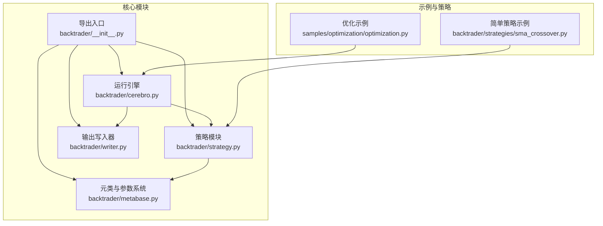
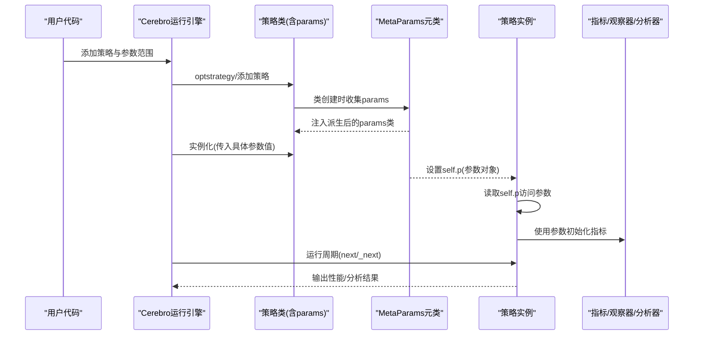
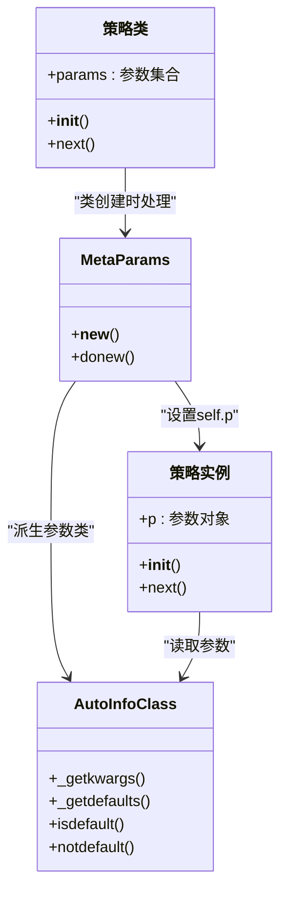
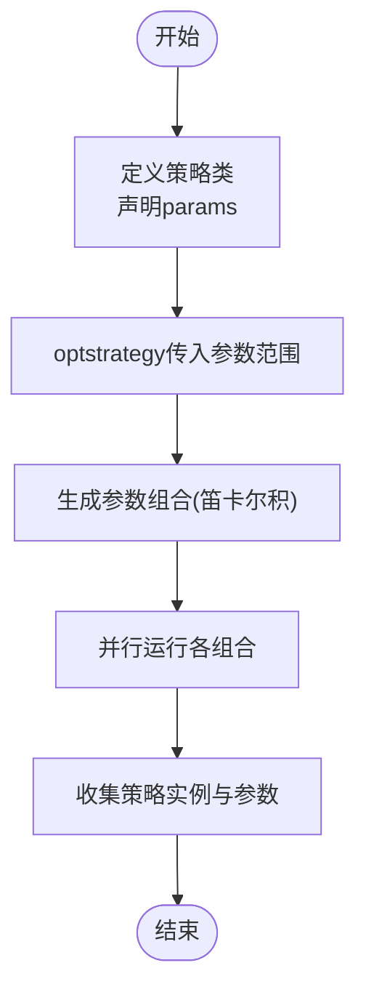
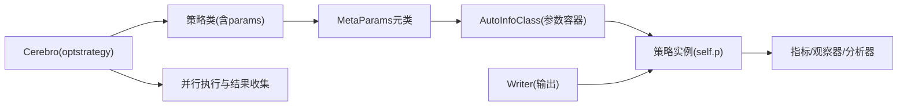

# 参数管理与配置

<cite>
**本文档引用的文件**
- [backtrader/strategy.py](file://backtrader/strategy.py)
- [backtrader/metabase.py](file://backtrader/metabase.py)
- [backtrader/cerebro.py](file://backtrader/cerebro.py)
- [backtrader/__init__.py](file://backtrader/__init__.py)
- [backtrader/writer.py](file://backtrader/writer.py)
- [samples/optimization/optimization.py](file://samples/optimization/optimization.py)
- [backtrader/strategies/sma_crossover.py](file://backtrader/strategies/sma_crossover.py)
</cite>

## 目录
1. [简介](#简介)
2. [项目结构](#项目结构)
3. [核心组件](#核心组件)
4. [架构总览](#架构总览)
5. [详细组件分析](#详细组件分析)
6. [依赖关系分析](#依赖关系分析)
7. [性能考虑](#性能考虑)
8. [故障排除指南](#故障排除指南)
9. [结论](#结论)
10. [附录](#附录)

## 简介
本指南系统性地讲解Backtrader中的参数管理与配置，涵盖策略参数的定义、声明与使用方式，参数类型与默认值、范围限制，参数配置（策略类内直接定义、元类机制自动处理），参数优化（网格搜索、随机搜索、多策略组合）、参数验证与约束、参数持久化（保存、加载、版本管理）、以及结合示例展示参数寻优与性能评估。同时阐明参数与策略性能之间的关系与影响。

## 项目结构
Backtrader围绕“策略-参数-指标-观察器-分析器”的层次化架构组织，参数系统由元类机制统一管理，贯穿策略实例化、参数注入、运行期访问与优化流程。

图表来源
- [backtrader/__init__.py](file://backtrader/__init__.py#L56-L84)
- [backtrader/strategy.py](file://backtrader/strategy.py#L107-L120)
- [backtrader/metabase.py](file://backtrader/metabase.py#L203-L294)
- [backtrader/cerebro.py](file://backtrader/cerebro.py#L60-L200)
- [backtrader/writer.py](file://backtrader/writer.py#L39-L106)
- [samples/optimization/optimization.py](file://samples/optimization/optimization.py#L35-L68)
- [backtrader/strategies/sma_crossover.py](file://backtrader/strategies/sma_crossover.py#L29-L60)

章节来源
- [backtrader/__init__.py](file://backtrader/__init__.py#L56-L84)

## 核心组件
- 元类与参数系统：通过MetaParams元类在类创建阶段收集、派生与注入参数，支持默认值、继承合并、包导入等特性。
- 策略基类：Strategy类提供参数访问接口（self.p）与生命周期钩子，支撑参数在运行期被读取与使用。
- 运行引擎：Cerebro负责策略实例化、参数优化组合生成、并行执行与结果收集。
- 写入器：Writer用于输出参数与分析结果，便于持久化与版本化记录。
- 示例策略：展示参数在策略中的使用方式与优化场景。

章节来源
- [backtrader/metabase.py](file://backtrader/metabase.py#L203-L294)
- [backtrader/strategy.py](file://backtrader/strategy.py#L107-L120)
- [backtrader/cerebro.py](file://backtrader/cerebro.py#L60-L200)
- [backtrader/writer.py](file://backtrader/writer.py#L39-L106)
- [backtrader/strategies/sma_crossover.py](file://backtrader/strategies/sma_crossover.py#L29-L60)

## 架构总览
Backtrader参数管理的关键流程如下：

图表来源
- [backtrader/cerebro.py](file://backtrader/cerebro.py#L1030-L1145)
- [backtrader/metabase.py](file://backtrader/metabase.py#L203-L294)
- [backtrader/strategy.py](file://backtrader/strategy.py#L455-L480)

## 详细组件分析

### 1) 参数定义、声明与使用
- 在策略类中直接定义参数
  - 策略类通过类属性params声明参数及其默认值；运行时通过self.p访问。
  - 示例：简单移动平均交叉策略在类级别声明fast、slow与_movav等参数，并在__init__中使用self.p访问。
- 元类机制自动处理
  - MetaParams在类创建阶段移除类中的params，派生新的参数类，合并父类参数，设置默认值，并在实例化前将参数对象赋给self.p。
  - AutoInfoClass提供参数键值对、默认值、序列化等能力，支持递归派生与默认值判断。

图表来源
- [backtrader/metabase.py](file://backtrader/metabase.py#L203-L294)
- [backtrader/metabase.py](file://backtrader/metabase.py#L93-L201)
- [backtrader/strategy.py](file://backtrader/strategy.py#L455-L480)
- [backtrader/strategies/sma_crossover.py](file://backtrader/strategies/sma_crossover.py#L53-L60)

章节来源
- [backtrader/strategies/sma_crossover.py](file://backtrader/strategies/sma_crossover.py#L29-L60)
- [backtrader/metabase.py](file://backtrader/metabase.py#L203-L294)
- [backtrader/metabase.py](file://backtrader/metabase.py#L93-L201)

### 2) 参数类型、默认值与范围限制
- 类型与默认值
  - 参数以键值形式在类的params中声明，默认值即为该键对应的值。
  - 运行时可通过AutoInfoClass的_getdefaults/_getkwargs等方法获取默认值或当前值字典。
- 范围限制
  - 代码未内置参数范围校验逻辑，建议在策略__init__或参数设置处自行校验，或在外部优化框架中提供约束检查。
- 命名与可见性
  - 以“_”开头的参数通常为内部使用，写入器默认会过滤掉以“_”开头的参数键。

章节来源
- [backtrader/metabase.py](file://backtrader/metabase.py#L164-L190)
- [backtrader/strategy.py](file://backtrader/strategy.py#L455-L480)

### 3) 参数配置方式
- 策略类内直接定义
  - 在策略类中以元组形式声明params，如((键1, 默认值1), (键2, 默认值2), ...)。
- 元类机制自动处理
  - MetaParams在类创建时解析params，合并父类参数，设置packages/frompackages等，实例化后将参数对象赋给self.p。
- 运行期访问
  - 策略实例通过self.p.键名访问参数；也可调用p._getkwargs()输出参数字典供写入器或日志记录。

章节来源
- [backtrader/metabase.py](file://backtrader/metabase.py#L203-L294)
- [backtrader/strategy.py](file://backtrader/strategy.py#L455-L480)

### 4) 参数优化实现
- 网格搜索
  - 通过Cerebro的optstrategy传入多个参数的取值范围（如range），系统自动生成参数组合并并行运行。
  - 示例：优化SMA周期与MACD周期，使用range(args.low, args.high)生成候选集。
- 并行与加速
  - Cerebro支持多核并行（maxcpus），可显著提升网格搜索效率。
- 结果收集
  - run返回每组参数对应策略实例，可通过实例的p._getkwargs()获取最终参数值。

图表来源
- [samples/optimization/optimization.py](file://samples/optimization/optimization.py#L62-L68)
- [samples/optimization/optimization.py](file://samples/optimization/optimization.py#L86-L101)
- [backtrader/cerebro.py](file://backtrader/cerebro.py#L1127-L1145)

章节来源
- [samples/optimization/optimization.py](file://samples/optimization/optimization.py#L35-L101)
- [backtrader/cerebro.py](file://backtrader/cerebro.py#L1030-L1145)

### 5) 参数验证与约束机制
- 内置机制
  - 代码未提供参数范围/类型自动校验；参数有效性需由用户在策略逻辑或优化前检查。
- 建议实践
  - 在策略__init__中对关键参数进行边界检查与合理性校验。
  - 在外部优化框架中增加参数合法性过滤器，避免无效组合进入回测。
  - 对于数值型参数，建议提供最小/最大/步长约束，防止极端值导致计算异常或性能问题。

章节来源
- [backtrader/strategy.py](file://backtrader/strategy.py#L455-L480)

### 6) 参数持久化方案
- 参数保存
  - 使用策略实例的p._getkwargs()获取参数字典，结合Writer或自定义存储（JSON/CSV）保存。
- 参数加载
  - 将保存的参数字典作为关键字参数重新实例化策略，或在optstrategy中复用参数范围。
- 版本管理
  - 建议在参数字典中加入版本号字段，便于后续对比与迁移。
- 性能评估
  - Writer可输出参数与分析结果，便于建立参数-收益-风险的映射表，支持后续版本迭代。

章节来源
- [backtrader/strategy.py](file://backtrader/strategy.py#L455-L480)
- [backtrader/writer.py](file://backtrader/writer.py#L39-L106)

### 7) 实际优化示例与性能评估
- 示例策略
  - OptimizeStrategy在类中声明多个周期参数，并在__init__中使用这些参数初始化指标。
- 优化流程
  - 通过optstrategy传入多个参数范围，Cerebro生成组合并运行，最后打印每组参数的最终值。
- 性能评估
  - 可结合分析器输出（如收益、夏普比率等）对不同参数组合进行排序与筛选。

章节来源
- [samples/optimization/optimization.py](file://samples/optimization/optimization.py#L35-L101)

### 8) 参数与策略性能的关系与影响
- 参数直接影响策略信号与交易行为
  - 移动平均周期过短可能产生过多噪声交易；过长则滞后性强，错过趋势转折。
  - MACD快慢周期与信号周期的组合对动量信号敏感度有显著影响。
- 参数优化的目标函数
  - 常用目标包括年化收益最大化、最大回撤最小化、夏普比率最大化等；需根据业务目标选择合适的评估指标。
- 过拟合风险
  - 在样本内过度优化可能导致泛化能力下降；建议采用样本外测试与交叉验证策略。

章节来源
- [samples/optimization/optimization.py](file://samples/optimization/optimization.py#L35-L101)
- [backtrader/strategies/sma_crossover.py](file://backtrader/strategies/sma_crossover.py#L29-L75)

## 依赖关系分析
参数系统的关键依赖链路如下：

图表来源
- [backtrader/metabase.py](file://backtrader/metabase.py#L203-L294)
- [backtrader/strategy.py](file://backtrader/strategy.py#L455-L480)
- [backtrader/cerebro.py](file://backtrader/cerebro.py#L1030-L1145)
- [backtrader/writer.py](file://backtrader/writer.py#L39-L106)

章节来源
- [backtrader/metabase.py](file://backtrader/metabase.py#L203-L294)
- [backtrader/strategy.py](file://backtrader/strategy.py#L455-L480)
- [backtrader/cerebro.py](file://backtrader/cerebro.py#L1030-L1145)
- [backtrader/writer.py](file://backtrader/writer.py#L39-L106)

## 性能考虑
- 参数组合爆炸
  - 多参数网格搜索的组合数量随参数个数与取值范围呈指数增长；建议先粗后细的分层搜索策略。
- 并行与内存
  - 多核并行可显著提速，但需注意数据预加载与内存占用；必要时启用精确栏位模式以节省内存。
- 计算复杂度
  - 指标计算复杂度与参数（如周期）相关；应避免过大周期导致的计算瓶颈。

## 故障排除指南
- 参数未生效
  - 检查是否在策略类中正确声明params并在实例化时传入了期望值；确认p._getkwargs()输出符合预期。
- 优化结果为空
  - 排查参数范围是否合理、数据是否正确加载、Cerebro是否成功启动运行。
- 性能异常
  - 检查参数取值是否极端（如周期过大/过小）、是否存在无效组合、是否启用了不必要的预加载或向量化。

章节来源
- [backtrader/strategy.py](file://backtrader/strategy.py#L455-L480)
- [backtrader/cerebro.py](file://backtrader/cerebro.py#L1030-L1145)

## 结论
Backtrader的参数系统通过元类机制实现了参数的声明式定义与自动注入，配合Cerebro的优化能力，能够高效完成参数寻优与性能评估。实践中应重视参数验证、范围控制与版本管理，结合合理的评估指标与防过拟合策略，构建稳健的参数管理体系。

## 附录
- 关键API路径参考
  - 策略参数访问：[策略实例.p](file://backtrader/strategy.py#L455-L480)
  - 参数序列化：[p._getkwargs](file://backtrader/metabase.py#L183-L187)
  - 策略优化入口：[Cerebro.optstrategy](file://samples/optimization/optimization.py#L62-L68)
  - 运行与结果收集：[Cerebro.run](file://backtrader/cerebro.py#L1030-L1145)
  - 输出写入：[WriterFile](file://backtrader/writer.py#L43-L106)