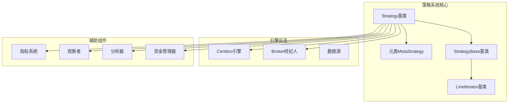
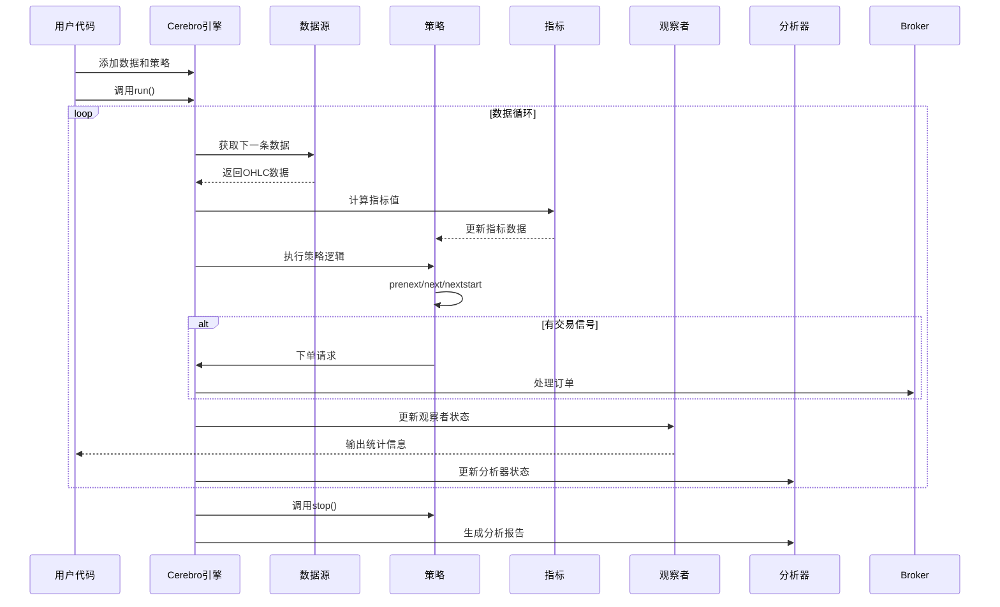
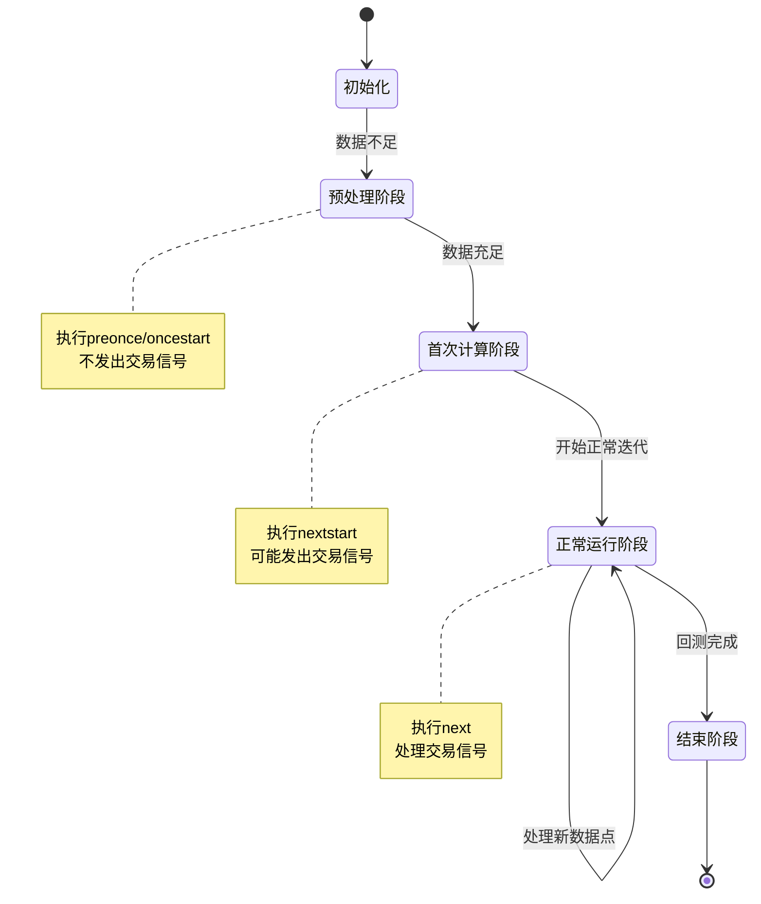
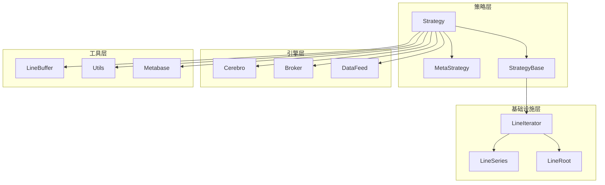

# 策略基类详解

<cite>
**本文档引用的文件**
- [strategy.py](file://backtrader/strategy.py)
- [cerebro.py](file://backtrader/cerebro.py)
- [lineiterator.py](file://backtrader/lineiterator.py)
- [linebuffer.py](file://backtrader/linebuffer.py)
- [sma_crossover.py](file://backtrader/strategies/sma_crossover.py)
- [memory-savings.py](file://samples/memory-savings/memory-savings.py)
</cite>

## 目录
1. [引言](#引言)
2. [项目结构](#项目结构)
3. [核心组件](#核心组件)
4. [架构概览](#架构概览)
5. [详细组件分析](#详细组件分析)
6. [依赖关系分析](#依赖关系分析)
7. [性能考虑](#性能考虑)
8. [故障排除指南](#故障排除指南)
9. [结论](#结论)

## 引言

Backtrader是一个强大的Python量化交易回测框架，其中Strategy类是整个系统的核心基础。本文档深入解析Strategy基类的设计架构和核心功能，包括策略生命周期管理、初始化过程、next方法的作用机制，以及策略与Cerebro引擎的交互方式。

Strategy类不仅定义了策略的基本行为模式，还提供了完整的生命周期管理、内存优化机制和丰富的API接口，使得开发者能够构建复杂而高效的量化交易策略。

## 项目结构

Backtrader策略系统主要由以下几个关键模块组成：



**图表来源**
- [strategy.py](file://backtrader/strategy.py#L107-L118)
- [lineiterator.py](file://backtrader/lineiterator.py#L148-L152)

**章节来源**
- [strategy.py](file://backtrader/strategy.py#L1-L50)
- [cerebro.py](file://backtrader/cerebro.py#L60-L90)

## 核心组件

### Strategy基类设计

Strategy类是Backtrader策略系统的基石，它继承自`StrategyBase`并通过元类`MetaStrategy`进行特殊处理。该类提供了完整的策略生命周期管理和事件驱动的执行模型。

#### 基本属性和配置

Strategy类具有以下核心属性：
- `_ltype = LineIterator.StratType`: 定义策略类型为线性迭代器
- `csv = True`: 默认启用CSV输出支持
- `_oldsync = False`: 控制数据同步方式
- `lines = ('datetime',)`: 定义内置的时间序列行

#### 元类MetaStrategy的功能

MetaStrategy元类负责：
1. **方法重命名兼容性**: 自动将旧版本的`notify`方法重命名为`notify_order`
2. **子类注册**: 将策略类注册到内部索引中
3. **环境绑定**: 为策略实例绑定Cerebro环境和broker实例
4. **ID分配**: 为每个策略实例分配唯一ID

**章节来源**
- [strategy.py](file://backtrader/strategy.py#L43-L105)

## 架构概览

Backtrader采用事件驱动的架构模式，策略在每个数据点到达时被触发执行。整个执行流程如下：



**图表来源**
- [cerebro.py](file://backtrader/cerebro.py#L1498-L1599)
- [lineiterator.py](file://backtrader/lineiterator.py#L259-L285)

## 详细组件分析

### 策略生命周期管理

策略的生命周期由多个阶段组成，每个阶段都有特定的职责和调用时机：

#### 初始化阶段 (`__init__`)

策略初始化时会执行以下操作：
1. 创建指标和数据绑定
2. 设置默认的sizer（资金管理器）
3. 初始化订单和交易列表
4. 准备观察者和分析器集合

#### 启动阶段 (`start`)

启动阶段在回测开始前调用，用于：
- 执行策略特有的初始化逻辑
- 准备必要的数据结构
- 设置初始状态

#### 运行阶段

运行阶段包含三个核心方法：
- `prenext()`: 数据不足时的预处理
- `nextstart()`: 数据充足时的首次计算
- `next()`: 正常的数据点处理

#### 结束阶段 (`stop`)

结束阶段清理资源并生成最终报告。



**图表来源**
- [lineiterator.py](file://backtrader/lineiterator.py#L316-L354)

**章节来源**
- [strategy.py](file://backtrader/strategy.py#L393-L493)
- [lineiterator.py](file://backtrader/lineiterator.py#L323-L354)

### 内存管理机制

Strategy类提供了强大的内存管理功能，通过`qbuffer`方法实现不同级别的内存优化：

#### qbuffer方法详解

```python
def qbuffer(self, savemem=0, replaying=False):
    """
    启用内存节省方案
    参数:
    - savemem: 0(无节省) | 1(严格最小值) | -1(保留绘图) | -2(禁用绘图)
    - replaying: 是否为回放模式
    """
```

内存优化策略：
1. **完全内存保存** (`savemem=0`): 保持所有历史数据
2. **严格最小内存** (`savemem=1`): 使用严格最小的必要内存
3. **保留绘图内存** (`savemem=-1`): 保留策略层指标和观察者的内存
4. **禁用绘图内存** (`savemem=-2`): 禁用绘图相关的内存保存

#### 底层内存管理

内存管理基于`LineBuffer`系统，通过队列缓冲区实现：
- 动态调整缓冲区大小
- 支持回放和重采样操作
- 优化数据访问性能

**章节来源**
- [strategy.py](file://backtrader/strategy.py#L120-L154)
- [linebuffer.py](file://backtrader/linebuffer.py#L121-L147)

### 策略与Cerebro引擎的交互

#### 数据绑定机制

策略通过Cerebro引擎自动绑定数据源：
- 自动识别和绑定所有数据源
- 支持多数据源策略
- 提供数据访问便捷方法

#### 指标注册和管理

策略可以动态注册和管理指标：
- 在`__init__`中创建指标
- 自动计算最小周期要求
- 支持复杂的指标依赖关系

#### 观察者和分析器管理

策略可以添加多种类型的观察者和分析器：
- 内置标准观察者（Broker、Trades、BuySell）
- 自定义观察者
- 分析器用于性能评估

**章节来源**
- [strategy.py](file://backtrader/strategy.py#L225-L267)
- [cerebro.py](file://backtrader/cerebro.py#L636-L667)

### 订单管理和交易执行

Strategy类提供了完整的订单管理功能：

#### 下单方法

```python
def buy(self, data=None, size=None, price=None, exectype=None, **kwargs):
    """买入下单"""
    pass

def sell(self, data=None, size=None, price=None, exectype=None, **kwargs):
    """卖出下单"""
    pass

def close(self, data=None, size=None, **kwargs):
    """平仓"""
    pass
```

#### 资金管理

策略通过`sizer`对象管理资金：
- 默认使用固定金额sizer
- 支持自定义sizer
- 自动计算订单规模

#### 订单组合

支持复杂的订单组合：
- Bracket订单（止损止盈）
- OCO订单（互斥订单）
- 条件订单

**章节来源**
- [strategy.py](file://backtrader/strategy.py#L770-L1000)
- [strategy.py](file://backtrader/strategy.py#L1247-L1376)

### 通知系统

策略实现了完整的事件通知系统：

#### 订单通知

```python
def notify_order(self, order):
    """接收订单状态变更通知"""
    pass
```

#### 交易通知

```python
def notify_trade(self, trade):
    """接收交易完成通知"""
    pass
```

#### 现金和资产通知

```python
def notify_cashvalue(self, cash, value):
    """接收现金和资产状态通知"""
    pass

def notify_fund(self, cash, value, fundvalue, shares):
    """接收基金状态通知"""
    pass
```

**章节来源**
- [strategy.py](file://backtrader/strategy.py#L738-L756)
- [strategy.py](file://backtrader/strategy.py#L577-L613)

## 依赖关系分析

策略系统各组件之间的依赖关系如下：



**图表来源**
- [strategy.py](file://backtrader/strategy.py#L107-L118)
- [lineiterator.py](file://backtrader/lineiterator.py#L148-L152)

**章节来源**
- [strategy.py](file://backtrader/strategy.py#L34-L40)
- [lineiterator.py](file://backtrader/lineiterator.py#L38-L104)

## 性能考虑

### 内存优化策略

Backtrader提供了多层次的内存优化：

1. **数据缓冲区优化**: 使用队列缓冲区减少内存占用
2. **指标缓存**: 避免重复计算相同指标
3. **批量处理**: 在可能的情况下使用向量运算

### 执行效率优化

1. **延迟计算**: 指标在需要时才计算
2. **智能调度**: 根据数据可用性智能调度计算
3. **资源共享**: 多策略共享相同数据源

### 实际应用建议

根据实际需求选择合适的内存优化级别：
- **开发调试**: 使用`exactbars=0`获得完整历史数据
- **性能测试**: 使用`exactbars=1`优化内存使用
- **生产环境**: 根据具体需求平衡内存和性能

**章节来源**
- [cerebro.py](file://backtrader/cerebro.py#L121-L162)
- [memory-savings.py](file://samples/memory-savings/memory-savings.py#L132-L162)

## 故障排除指南

### 常见问题和解决方案

#### 策略未执行问题

**症状**: 策略的`next()`方法从未被调用

**原因和解决**:
1. 数据源为空或未正确添加
2. 策略参数设置错误
3. 最小周期未满足

**检查清单**:
- 确认数据已正确添加到Cerebro
- 验证策略参数设置
- 检查指标依赖关系

#### 内存溢出问题

**症状**: 程序运行一段时间后内存持续增长

**解决方法**:
1. 启用内存优化：`cerebro.run(exactbars=1)`
2. 使用`qbuffer()`方法
3. 及时清理不需要的数据

#### 性能问题

**症状**: 回测执行速度过慢

**优化建议**:
1. 使用`runonce=True`（如果适用）
2. 减少不必要的指标计算
3. 优化策略逻辑

**章节来源**
- [strategy.py](file://backtrader/strategy.py#L120-L154)
- [cerebro.py](file://backtrader/cerebro.py#L68-L84)

## 结论

Backtrader的Strategy基类设计精良，提供了完整的策略开发框架。其核心特点包括：

1. **清晰的生命周期管理**: 从初始化到结束的完整流程控制
2. **灵活的内存管理**: 支持多种内存优化策略
3. **强大的事件驱动架构**: 基于Cerebro引擎的高效执行模型
4. **丰富的API接口**: 完整的订单管理和通知系统
5. **优秀的扩展性**: 支持自定义指标、观察者和分析器

通过深入理解Strategy类的设计原理和实现细节，开发者可以构建更加高效、稳定和可维护的量化交易策略。无论是简单的技术分析策略还是复杂的多因子模型，Backtrader都提供了坚实的基础架构支持。