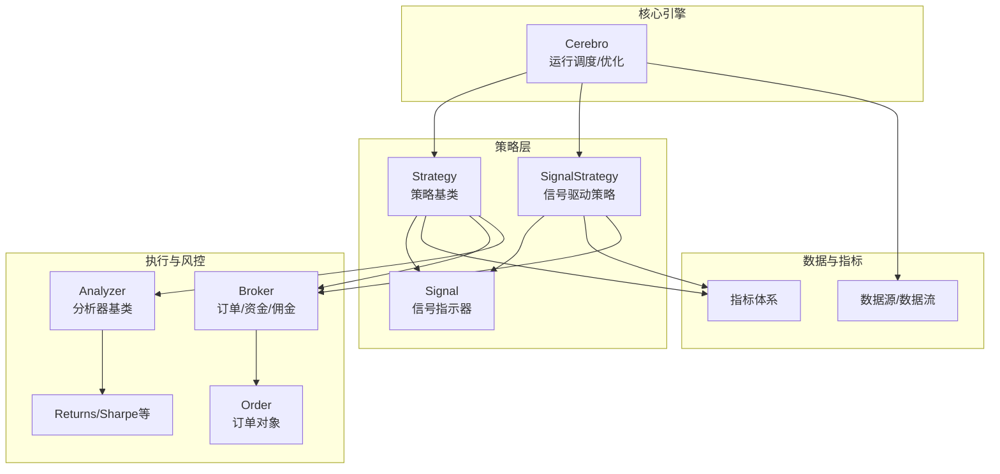
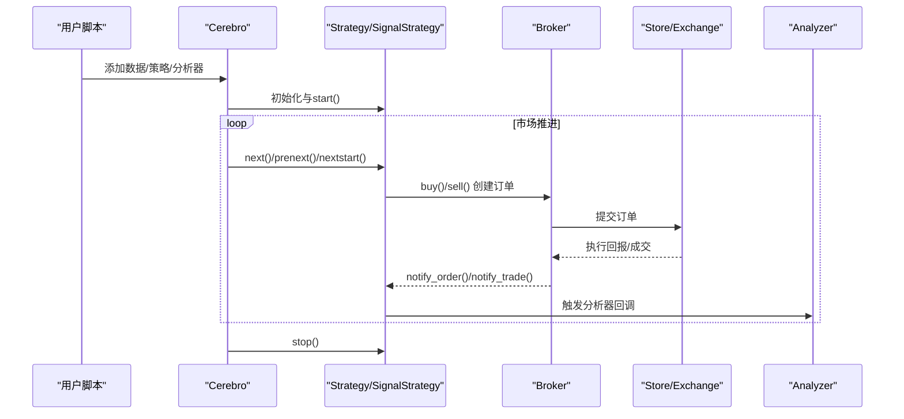
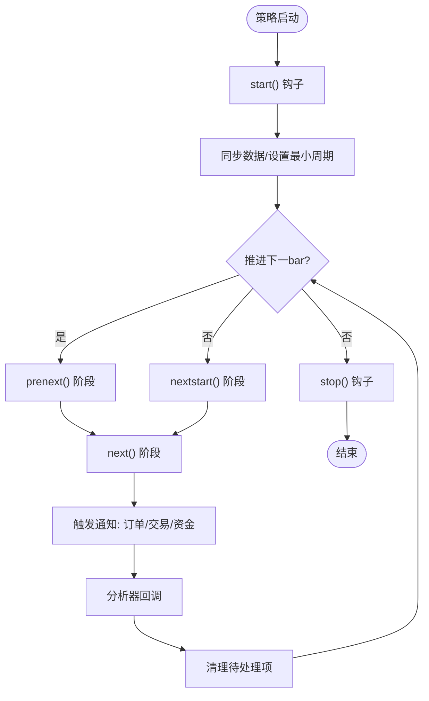
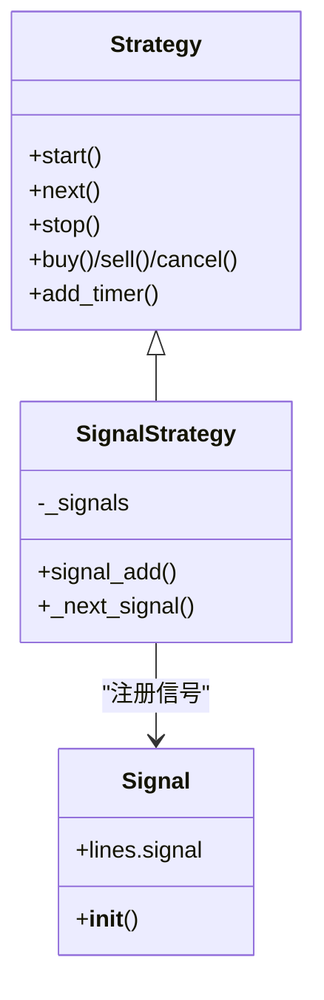
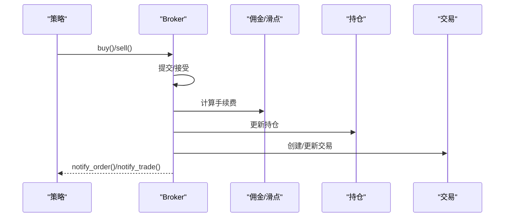
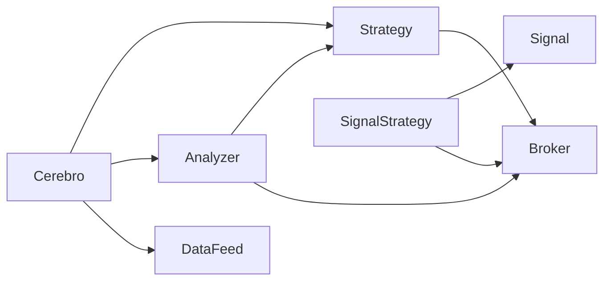

# 策略开发

<cite>
**本文引用的文件**
- [backtrader/__init__.py](file://backtrader/__init__.py)
- [backtrader/strategy.py](file://backtrader/strategy.py)
- [backtrader/signal.py](file://backtrader/signal.py)
- [backtrader/cerebro.py](file://backtrader/cerebro.py)
- [backtrader/analyzer.py](file://backtrader/analyzer.py)
- [backtrader/analyzers/returns.py](file://backtrader/analyzers/returns.py)
- [backtrader/analyzers/sharpe.py](file://backtrader/analyzers/sharpe.py)
- [backtrader/order.py](file://backtrader/order.py)
- [backtrader/brokers/bbroker.py](file://backtrader/brokers/bbroker.py)
- [backtrader/brokers/oandabroker.py](file://backtrader/brokers/oandabroker.py)
- [backtrader/stores/oandastore.py](file://backtrader/stores/oandastore.py)
- [backtrader/strategies/sma_crossover.py](file://backtrader/strategies/sma_crossover.py)
- [samples/multidata-strategy/multidata-strategy.py](file://samples/multidata-strategy/multidata-strategy.py)
- [samples/sigsmacross/sigsmacross.py](file://samples/sigsmacross/sigsmacross.py)
- [samples/optimization/optimization.py](file://samples/optimization/optimization.py)
- [samples/ccxt-bybit/bybit-live-trading.py](file://samples/ccxt-bybit/bybit-live-trading.py)
- [.claude/architecture.md](file://.claude/architecture.md)
</cite>

## 目录
1. [引言](#引言)
2. [项目结构](#项目结构)
3. [核心组件](#核心组件)
4. [架构总览](#架构总览)
5. [详细组件分析](#详细组件分析)
6. [依赖关系分析](#依赖关系分析)
7. [性能考量](#性能考量)
8. [故障排查指南](#故障排查指南)
9. [结论](#结论)
10. [附录](#附录)

## 引言
本指南面向Backtrader策略开发者，从基础概念到高级应用全面覆盖。内容涵盖Strategy基类设计与使用、信号系统工作原理、参数管理与优化、策略开发全流程、订单与风险管理、性能优化与最佳实践，以及常见问题与调试方法。文档结合源码与示例，帮助读者快速构建稳健、可维护且高性能的量化策略。

## 项目结构
Backtrader采用模块化设计，围绕Cerebro引擎组织策略、指标、观察者、分析器、订单与经纪商等子系统。策略层通过Strategy基类统一生命周期；信号层通过SignalStrategy与Signal类型驱动自动化交易；分析器提供回测后的统计输出；Cerebro负责数据加载、运行调度与优化。

图示来源
- [backtrader/cerebro.py](file://backtrader/cerebro.py#L60-L200)
- [backtrader/strategy.py](file://backtrader/strategy.py#L107-L120)
- [backtrader/signal.py](file://backtrader/signal.py#L56-L64)
- [backtrader/analyzer.py](file://backtrader/analyzer.py#L89-L139)

章节来源
- [backtrader/__init__.py](file://backtrader/__init__.py#L34-L62)
- [backtrader/cerebro.py](file://backtrader/cerebro.py#L60-L200)

## 核心组件
- Strategy基类：定义策略生命周期（start/next/prenext/nextstart/stop）、通知回调（notify_order/notify_trade/notify_cashvalue/notify_fund）、订单接口（buy/sell/cancel）、定时器（add_timer）与内存节省（qbuffer）等。
- SignalStrategy与Signal：基于信号的自动化策略框架，支持多信号组合与方向控制（LONG/LONGSHORT/EXIT等），自动下单与风险控制。
- Cerebro：回测/实盘运行主控，负责数据预加载、运行模式（runonce/exactbars）、优化（optstrategy/optcallback）与可视化。
- Analyzer与内置分析器：提供收益、夏普比率等统计输出，支持按时间窗口聚合与年度化处理。
- 订单与执行：Order对象承载订单状态与执行细节；Broker负责提交、接受、成交、佣金与资金管理；Store/Exchange负责外部连接。

章节来源
- [backtrader/strategy.py](file://backtrader/strategy.py#L107-L120)
- [backtrader/strategy.py](file://backtrader/strategy.py#L774-L800)
- [backtrader/strategy.py](file://backtrader/strategy.py#L1524-L1649)
- [backtrader/signal.py](file://backtrader/signal.py#L56-L64)
- [backtrader/cerebro.py](file://backtrader/cerebro.py#L60-L200)
- [backtrader/analyzer.py](file://backtrader/analyzer.py#L89-L139)
- [backtrader/analyzers/returns.py](file://backtrader/analyzers/returns.py#L30-L90)
- [backtrader/analyzers/sharpe.py](file://backtrader/analyzers/sharpe.py#L33-L125)
- [backtrader/order.py](file://backtrader/order.py#L528-L564)
- [backtrader/brokers/bbroker.py](file://backtrader/brokers/bbroker.py#L545-L595)

## 架构总览
下图展示策略从初始化到下单、执行、通知与分析的整体流程。

图示来源
- [backtrader/cerebro.py](file://backtrader/cerebro.py#L1030-L1048)
- [backtrader/strategy.py](file://backtrader/strategy.py#L393-L418)
- [backtrader/strategy.py](file://backtrader/strategy.py#L577-L614)
- [backtrader/analyzer.py](file://backtrader/analyzer.py#L148-L200)
- [.claude/architecture.md](file://.claude/architecture.md#L614-L683)

## 详细组件分析

### Strategy基类：生命周期与next机制
- 生命周期钩子：start()在回测开始前调用；next()/prenext()/nextstart()在每个bar推进时按阶段调用；stop()在结束时调用。
- 数据同步与最小周期：内部维护各指标与数据的最小周期，确保在足够历史长度后才进入next阶段。
- 通知与清理：每轮推进后触发notify_order/notify_trade/notify_cashvalue/notify_fund，并清理待处理订单与交易。
- 订单接口：buy()/sell()支持size/price/plimit/exectype/valid等参数；cancel()取消未成交订单。
- 定时器：add_timer()可在特定时刻或会话时段触发策略回调。

图示来源
- [backtrader/strategy.py](file://backtrader/strategy.py#L274-L318)
- [backtrader/strategy.py](file://backtrader/strategy.py#L393-L418)
- [backtrader/strategy.py](file://backtrader/strategy.py#L577-L614)

章节来源
- [backtrader/strategy.py](file://backtrader/strategy.py#L274-L318)
- [backtrader/strategy.py](file://backtrader/strategy.py#L393-L418)
- [backtrader/strategy.py](file://backtrader/strategy.py#L577-L614)
- [backtrader/strategy.py](file://backtrader/strategy.py#L774-L800)

### SignalStrategy与Signal系统
- 信号类型：SIGNAL_LONG/LONGSHORT/LONGEXIT等，支持多信号组合与并发控制。
- 信号添加：signal_add()将信号指示器注册到策略，Signal指示器通常输出数值（>0做多，<0做空）。
- 自动下单：策略根据信号组合与当前持仓状态自动执行买卖，支持累计建仓与并发限制。
- 信号策略配置：Cerebro提供add_signal/signal_strategy/signal_concurrent/signal_accumulate等接口。

图示来源
- [backtrader/strategy.py](file://backtrader/strategy.py#L1524-L1649)
- [backtrader/signal.py](file://backtrader/signal.py#L56-L64)
- [backtrader/cerebro.py](file://backtrader/cerebro.py#L592-L611)

章节来源
- [backtrader/strategy.py](file://backtrader/strategy.py#L1524-L1649)
- [backtrader/signal.py](file://backtrader/signal.py#L56-L64)
- [backtrader/cerebro.py](file://backtrader/cerebro.py#L592-L611)

### 参数管理与配置
- 参数定义：在策略类中以params元组声明，默认值与类型约束由MetaParams继承链处理。
- 参数优化：Cerebro.optstrategy()支持对策略参数进行网格/范围搜索；optcallback()可接收优化回调；optreturn与optdatas提升优化效率。
- 参数验证：可通过策略内校验逻辑与分析器参数（如Returns/Sharpe的timeframe/compression）保障一致性。

章节来源
- [backtrader/cerebro.py](file://backtrader/cerebro.py#L859-L1012)
- [backtrader/analyzer.py](file://backtrader/analyzer.py#L34-L86)
- [backtrader/analyzers/returns.py](file://backtrader/analyzers/returns.py#L92-L96)
- [backtrader/analyzers/sharpe.py](file://backtrader/analyzers/sharpe.py#L112-L125)

### 多数据与多信号策略
- 多数据策略：在多个相关数据上生成信号并在主数据上执行交易，示例展示了双数据联动的交叉信号策略。
- 多信号组合：SignalStrategy可注册多个信号，策略根据组合规则决定入场/出场。

章节来源
- [samples/multidata-strategy/multidata-strategy.py](file://samples/multidata-strategy/multidata-strategy.py#L33-L114)

### 信号驱动策略示例
- SMA交叉信号：通过两个SMA与交叉信号作为多头信号，直接注册到SignalStrategy，自动下单并打印成交与收益。

章节来源
- [samples/sigsmacross/sigsmacross.py](file://samples/sigsmacross/sigsmacross.py#L30-L51)

### SMA交叉策略示例
- 简单移动平均交叉：快线上穿慢线做多，下穿慢线平仓；策略简洁清晰，适合入门与回测验证。

章节来源
- [backtrader/strategies/sma_crossover.py](file://backtrader/strategies/sma_crossover.py#L29-L75)

### 订单管理与风险管理
- 订单状态：Submitted/Accepted/Partial/Completed/Canceled/Expired/Margin/Rejected等。
- 执行流程：Broker提交订单、检查资金、接受/拒绝、成交、更新持仓与交易、通知策略与分析器。
- 风险控制：通过sizer控制仓位规模，通过信号/策略逻辑控制并发与累计建仓，通过分析器监控回撤与收益。

图示来源
- [.claude/architecture.md](file://.claude/architecture.md#L614-L683)
- [backtrader/order.py](file://backtrader/order.py#L528-L564)
- [backtrader/brokers/bbroker.py](file://backtrader/brokers/bbroker.py#L545-L595)

章节来源
- [backtrader/order.py](file://backtrader/order.py#L222-L232)
- [backtrader/order.py](file://backtrader/order.py#L528-L564)
- [backtrader/brokers/bbroker.py](file://backtrader/brokers/bbroker.py#L545-L595)
- [backtrader/brokers/oandabroker.py](file://backtrader/brokers/oandabroker.py#L281-L311)
- [backtrader/stores/oandastore.py](file://backtrader/stores/oandastore.py#L494-L535)

### 实盘与Live Trading
- 实盘示例：演示了取消订单、查询订单状态、纸模拟与真实交易所交互的流程，便于对接不同交易所与存储订单状态。

章节来源
- [samples/ccxt-bybit/bybit-live-trading.py](file://samples/ccxt-bybit/bybit-live-trading.py#L613-L648)

### 分析器：收益与夏普比率
- Returns：支持按日/周/月/年等时间窗口计算复合/平均/年化收益。
- Sharpe：基于无风险利率与标准差计算夏普比率，支持样本修正与年度化。

章节来源
- [backtrader/analyzers/returns.py](file://backtrader/analyzers/returns.py#L30-L156)
- [backtrader/analyzers/sharpe.py](file://backtrader/analyzers/sharpe.py#L33-L200)

### 策略开发流程（从市场分析到测试验证）
- 市场分析：选择标的、时间范围、频率与数据质量；识别趋势/均值回归/套利机会。
- 策略构思：定义信号生成逻辑（技术指标/多因子）、入场/出场条件、止盈止损与风控。
- 代码实现：继承Strategy或SignalStrategy，注册信号/指标，实现next/notify_*回调。
- 测试验证：使用Cerebro.run()/optstrategy()进行回测与参数优化；添加Returns/Shapre等分析器评估表现。
- 结果可视化：利用plot功能观察收益曲线、交易点位与指标信号。

章节来源
- [backtrader/cerebro.py](file://backtrader/cerebro.py#L1030-L1048)
- [backtrader/analyzer.py](file://backtrader/analyzer.py#L89-L139)
- [backtrader/analyzers/returns.py](file://backtrader/analyzers/returns.py#L30-L90)
- [backtrader/analyzers/sharpe.py](file://backtrader/analyzers/sharpe.py#L33-L125)

## 依赖关系分析
策略层与执行层解耦，通过Cerebro统一编排。SignalStrategy依赖Signal指示器与Broker；分析器通过Analyzer基类与策略生命周期集成。

图示来源
- [backtrader/strategy.py](file://backtrader/strategy.py#L107-L120)
- [backtrader/analyzer.py](file://backtrader/analyzer.py#L89-L139)
- [backtrader/cerebro.py](file://backtrader/cerebro.py#L60-L200)

章节来源
- [backtrader/strategy.py](file://backtrader/strategy.py#L107-L120)
- [backtrader/analyzer.py](file://backtrader/analyzer.py#L89-L139)
- [backtrader/cerebro.py](file://backtrader/cerebro.py#L60-L200)

## 性能考量
- 运行模式：runonce=True可向量化加速指标计算；exactbars级别影响内存占用与绘图能力。
- 内存节省：qbuffer与exactbars配合使用，减少历史数据缓存；plot关闭时可启用更激进的内存回收。
- 优化加速：optdatas/optreturn/maxcpus提升多参数搜索效率；避免不必要的指标与分析器。
- 数据加载：preload=True减少重复读取成本；多数据对齐需权衡内存与计算。

章节来源
- [backtrader/cerebro.py](file://backtrader/cerebro.py#L61-L199)
- [backtrader/strategy.py](file://backtrader/strategy.py#L120-L154)
- [samples/optimization/optimization.py](file://samples/optimization/optimization.py#L55-L68)

## 故障排查指南
- 订单状态异常：检查Broker提交/接受/拒绝流程，确认资金是否充足；关注Margin/Rejected状态。
- 信号未触发：核对Signal指示器输入数据与周期，确保数据对齐与最小周期满足。
- 回测与实盘差异：核对佣金/滑点设置、下单类型（市价/限价）与交易所规则；实盘示例展示了取消与状态查询流程。
- 性能瓶颈：减少不必要的绘图与分析器；使用runonce与exactbars；合并相似指标。

章节来源
- [backtrader/brokers/bbroker.py](file://backtrader/brokers/bbroker.py#L545-L595)
- [backtrader/brokers/oandabroker.py](file://backtrader/brokers/oandabroker.py#L281-L311)
- [backtrader/stores/oandastore.py](file://backtrader/stores/oandastore.py#L494-L535)
- [samples/ccxt-bybit/bybit-live-trading.py](file://samples/ccxt-bybit/bybit-live-trading.py#L613-L648)

## 结论
Backtrader提供了从策略基类、信号系统、订单执行到分析器与优化的完整工具链。遵循本文的生命周期与最佳实践，结合示例策略与分析器，可高效构建稳健的量化策略并进行系统性验证与优化。

## 附录
- 快速参考
  - 生命周期：start → prenext → nextstart → next → notify → analyzer → clear → stop
  - 信号类型：LONG/LONGSHORT/LONGEXIT等
  - 订单状态：Submitted/Accepted/Partial/Completed/Canceled/Expired/Margin/Rejected
  - 分析器：Returns、SharpeRatio等