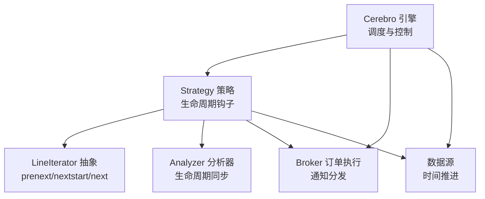
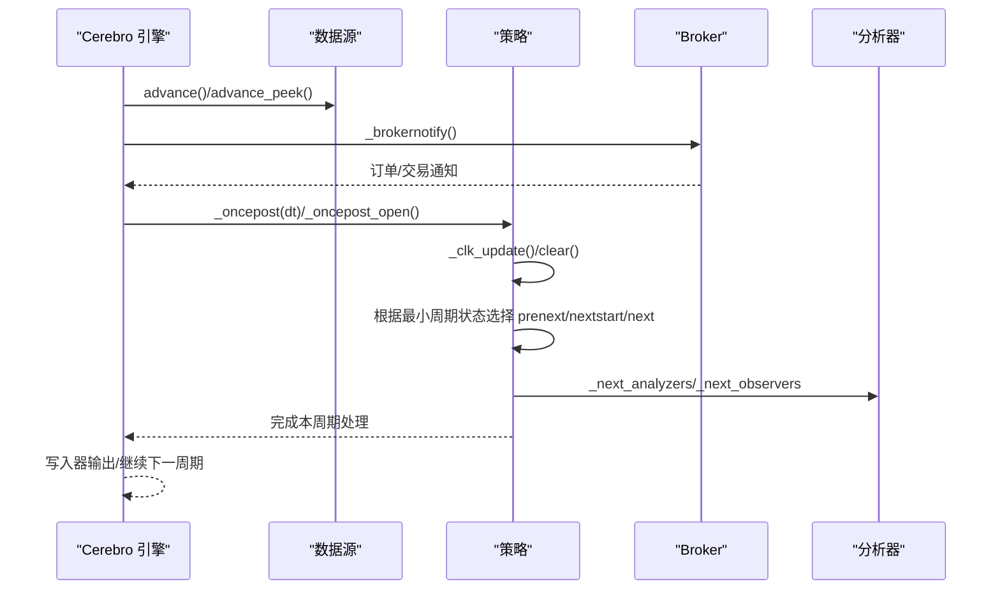
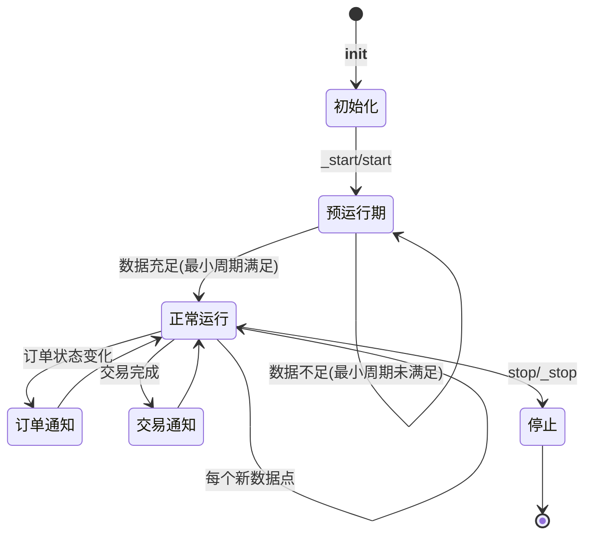
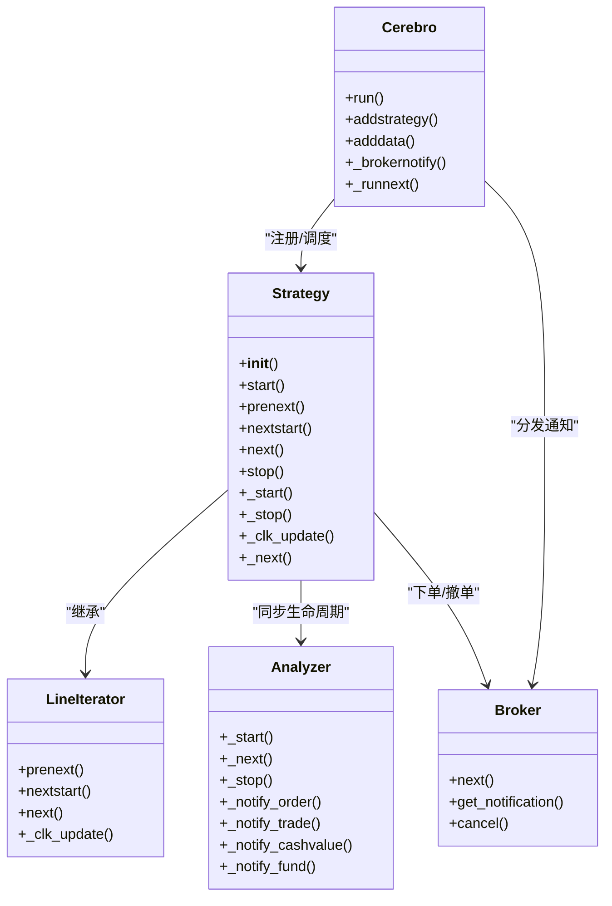
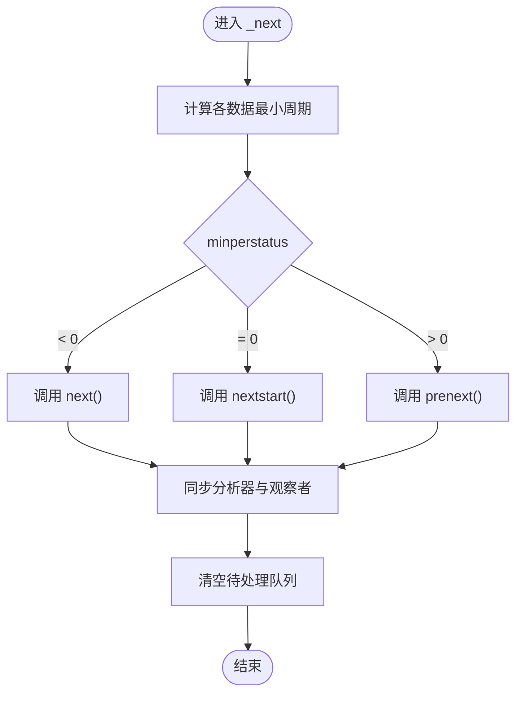
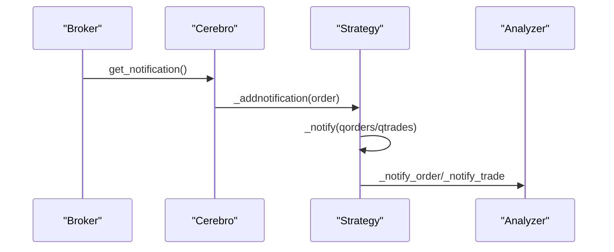
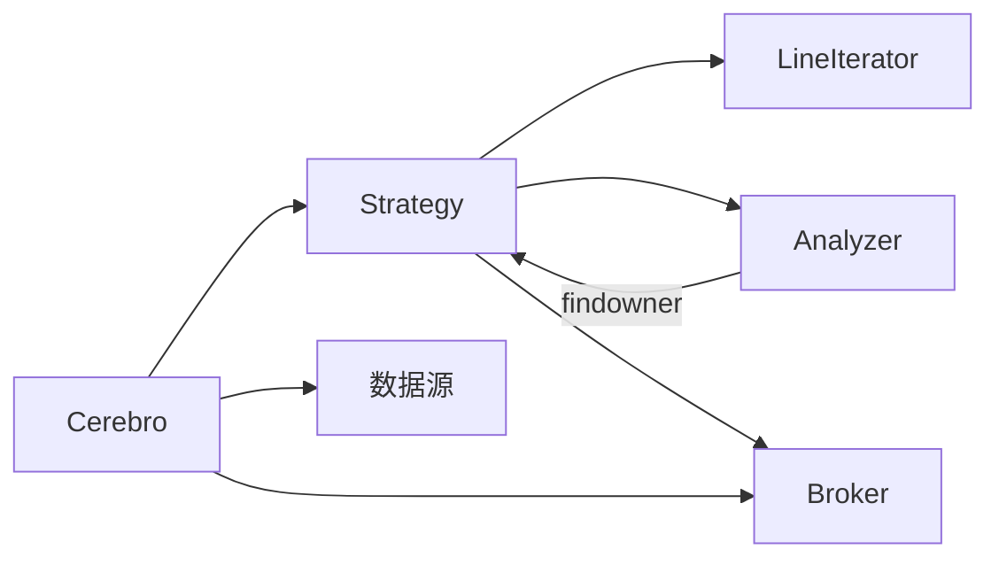

# 策略生命周期

<cite>
**本文引用的文件**
- [backtrader/strategy.py](file://backtrader/strategy.py)
- [backtrader/cerebro.py](file://backtrader/cerebro.py)
- [backtrader/lineiterator.py](file://backtrader/lineiterator.py)
- [backtrader/analyzer.py](file://backtrader/analyzer.py)
- [backtrader/metabase.py](file://backtrader/metabase.py)
- [backtrader/errors.py](file://backtrader/errors.py)
- [backtrader/brokers/bbroker.py](file://backtrader/brokers/bbroker.py)
- [backtrader/strategies/sma_crossover.py](file://backtrader/strategies/sma_crossover.py)
- [.claude/architecture.md](file://.claude/architecture.md)
</cite>

## 目录
1. [简介](#简介)
2. [项目结构](#项目结构)
3. [核心组件](#核心组件)
4. [架构总览](#架构总览)
5. [详细组件分析](#详细组件分析)
6. [依赖关系分析](#依赖关系分析)
7. [性能考量](#性能考量)
8. [故障排查指南](#故障排查指南)
9. [结论](#结论)
10. [附录：生命周期管理示例](#附录生命周期管理示例)

## 简介
本文件系统性梳理 Backtrader 策略从创建到销毁的完整生命周期，覆盖初始化、启动、运行、停止、清理等阶段；详解生命周期钩子（如 __init__、start、next、stop 等）的职责与调用时机；说明策略状态管理（活跃、暂停、终止）与 Cerebro 引擎的协作机制（策略注册、数据绑定、事件通知）；提供监控与调试方法（状态检查、性能监控、错误处理）以及可操作的生命周期管理示例。

## 项目结构
Backtrader 的策略生命周期由以下关键模块协同实现：
- 策略基类与生命周期钩子：backtrader/strategy.py
- 运行时调度与引擎控制：backtrader/cerebro.py
- 生命周期抽象与迭代器模式：backtrader/lineiterator.py
- 分析器生命周期同步：backtrader/analyzer.py
- 元类与对象所有权查找：backtrader/metabase.py
- 错误类型与异常控制：backtrader/errors.py
- 订单执行与通知分发：backtrader/brokers/bbroker.py
- 示例策略：backtrader/strategies/sma_crossover.py

图表来源
- [backtrader/cerebro.py](file://backtrader/cerebro.py#L1030-L1338)
- [backtrader/strategy.py](file://backtrader/strategy.py#L393-L493)
- [backtrader/lineiterator.py](file://backtrader/lineiterator.py#L323-L354)
- [backtrader/analyzer.py](file://backtrader/analyzer.py#L89-L200)

章节来源
- [backtrader/cerebro.py](file://backtrader/cerebro.py#L1030-L1338)
- [backtrader/strategy.py](file://backtrader/strategy.py#L393-L493)
- [backtrader/lineiterator.py](file://backtrader/lineiterator.py#L323-L354)
- [backtrader/analyzer.py](file://backtrader/analyzer.py#L89-L200)

## 核心组件
- 策略基类与生命周期钩子
  - __init__/start/stop：策略构造、启动、停止的钩子
  - next/prenext/nextstart：按最小周期约束驱动的主循环
  - _start/_stop/_next/_clk_update：内部生命周期与时钟推进
  - notify_order/notify_trade/notify_cashvalue/notify_fund：事件通知
- 引擎（Cerebro）
  - run()/runstop()：执行回测并支持中途停止
  - _runnext/_runonce：推进数据与策略迭代
  - _brokernotify：从 Broker 获取通知并分发给策略
- 生命周期抽象（LineIterator）
  - 提供 prenext/nextstart/next 的统一调度入口
- 分析器（Analyzer）
  - 与策略生命周期同步：_start/_stop/_next/_notify_* 系列
- 元类与所有权查找（MetaBase）
  - 通过 findowner 在对象树中定位父级容器（如 Strategy）

章节来源
- [backtrader/strategy.py](file://backtrader/strategy.py#L393-L493)
- [backtrader/lineiterator.py](file://backtrader/lineiterator.py#L323-L354)
- [backtrader/analyzer.py](file://backtrader/analyzer.py#L89-L200)
- [backtrader/metabase.py](file://backtrader/metabase.py#L42-L63)

## 架构总览
策略生命周期在 Cerebro 引擎的驱动下，遵循“最小周期约束 + 事件驱动”的模式。引擎推进各数据源的时间指针，触发策略的 _clk_update 与 _next，再根据最小周期状态调用 prenext/nextstart/next；期间 Broker 的订单与交易通知通过 _brokernotify 分发至策略，策略再调用相应 notify_* 钩子。

图表来源
- [backtrader/cerebro.py](file://backtrader/cerebro.py#L1667-L1716)
- [backtrader/strategy.py](file://backtrader/strategy.py#L304-L353)
- [backtrader/strategy.py](file://backtrader/strategy.py#L381-L391)

章节来源
- [backtrader/cerebro.py](file://backtrader/cerebro.py#L1667-L1716)
- [backtrader/strategy.py](file://backtrader/strategy.py#L304-L353)

## 详细组件分析

### 生命周期阶段与钩子详解
- 初始化阶段（__init__）
  - 用户在策略 __init__ 中创建指标、设置参数、注册观察者/分析器
  - MetaStrategy 在实例化后自动注入 cerebro、broker、默认 sizer 等上下文
- 启动阶段（_start/start）
  - _start：计算最小周期、启动分析器与观察者、切换到阶段2、记录初始状态
  - start：用户自定义启动逻辑（如打印起始信息）
- 运行阶段（_clk_update/_next/_oncepost）
  - _clk_update：对齐多数据源时钟，推进策略与子对象指针
  - _next：按最小周期状态调用 prenext/nextstart/next，并同步分析器与观察者
  - _oncepost/_oncepost_open：cheat-on-open 模式下的开盘前处理
- 停止阶段（_stop/stop）
  - stop：用户自定义停止逻辑（如保存中间结果）
  - _stop：停止分析器与观察者、切换回阶段1（允许复用数据）
- 清理阶段（clear）
  - 清空待处理订单与交易，准备下一周期

图表来源
- [.claude/architecture.md](file://.claude/architecture.md#L448-L487)
- [backtrader/strategy.py](file://backtrader/strategy.py#L393-L493)
- [backtrader/lineiterator.py](file://backtrader/lineiterator.py#L323-L354)

章节来源
- [backtrader/strategy.py](file://backtrader/strategy.py#L393-L493)
- [backtrader/lineiterator.py](file://backtrader/lineiterator.py#L323-L354)
- [.claude/architecture.md](file://.claude/architecture.md#L448-L487)

### 生命周期钩子的职责与调用时机
- __init__：策略构造，创建指标与参数
- start：回测开始前，进行一次性初始化
- prenext：最小周期未满足时的预热阶段（不执行交易逻辑）
- nextstart：首次满足最小周期时调用一次，随后进入 next
- next：每个新数据点都会调用，执行主要交易逻辑
- stop：回测结束时进行清理
- _start/_stop/_next/_clk_update：内部生命周期与时钟推进
- notify_order/notify_trade/notify_cashvalue/notify_fund：接收来自 Broker 的事件通知

章节来源
- [backtrader/strategy.py](file://backtrader/strategy.py#L393-L493)
- [backtrader/lineiterator.py](file://backtrader/lineiterator.py#L323-L354)

### 策略状态管理
- 活跃状态：策略已注册到 Cerebro，正在运行中
- 暂停状态：当前周期内不执行交易逻辑（最小周期未满足），仍参与分析器/观察者的 prenext
- 终止状态：stop 调用后，策略进入停止阶段，等待清理与退出

章节来源
- [backtrader/strategy.py](file://backtrader/strategy.py#L393-L493)
- [backtrader/lineiterator.py](file://backtrader/lineiterator.py#L323-L354)

### 策略与 Cerebro 的协作机制
- 策略注册：Cerebro.addstrategy 将策略加入运行列表
- 数据绑定：策略通过 cerebro.datas 访问数据源，LineIterator 自动建立时钟关系
- 事件通知：Cerebro._brokernotify 从 Broker 获取订单/交易通知，调用策略的 _addnotification/_notify
- 生命周期同步：Cerebro 在每个周期调用策略的 _oncepost/_oncepost_open，再调用 _next

图表来源
- [backtrader/cerebro.py](file://backtrader/cerebro.py#L1030-L1338)
- [backtrader/strategy.py](file://backtrader/strategy.py#L393-L493)
- [backtrader/lineiterator.py](file://backtrader/lineiterator.py#L148-L354)
- [backtrader/analyzer.py](file://backtrader/analyzer.py#L89-L200)

章节来源
- [backtrader/cerebro.py](file://backtrader/cerebro.py#L1030-L1338)
- [backtrader/strategy.py](file://backtrader/strategy.py#L393-L493)
- [backtrader/lineiterator.py](file://backtrader/lineiterator.py#L148-L354)
- [backtrader/analyzer.py](file://backtrader/analyzer.py#L89-L200)

### 生命周期算法流程（最小周期判定）
策略通过 _getminperstatus 计算各数据源与指标的最小周期状态，决定调用 prenext/nextstart/next：

图表来源
- [backtrader/strategy.py](file://backtrader/strategy.py#L268-L353)

章节来源
- [backtrader/strategy.py](file://backtrader/strategy.py#L268-L353)

### 订单与交易通知链路
- Broker 生成订单/交易通知
- Cerebro._brokernotify 取出通知并调用策略的 _addnotification/_notify
- 策略分发到各 Analyzer 的 _notify_order/_notify_trade

图表来源
- [backtrader/cerebro.py](file://backtrader/cerebro.py#L1360-L1375)
- [backtrader/strategy.py](file://backtrader/strategy.py#L503-L613)
- [backtrader/analyzer.py](file://backtrader/analyzer.py#L172-L176)

章节来源
- [backtrader/cerebro.py](file://backtrader/cerebro.py#L1360-L1375)
- [backtrader/strategy.py](file://backtrader/strategy.py#L503-L613)
- [backtrader/analyzer.py](file://backtrader/analyzer.py#L172-L176)

## 依赖关系分析
- 策略依赖 LineIterator 的生命周期抽象，确保按最小周期约束执行
- 分析器通过 MetaAnalyzer 注册到策略，生命周期与策略保持一致
- Cerebro 作为调度中心，协调数据源推进、Broker 通知与策略执行
- MetaBase 的 findowner 支持在对象树中向上查找父级容器（如 Strategy）

图表来源
- [backtrader/strategy.py](file://backtrader/strategy.py#L107-L108)
- [backtrader/analyzer.py](file://backtrader/analyzer.py#L34-L86)
- [backtrader/metabase.py](file://backtrader/metabase.py#L42-L63)

章节来源
- [backtrader/strategy.py](file://backtrader/strategy.py#L107-L108)
- [backtrader/analyzer.py](file://backtrader/analyzer.py#L34-L86)
- [backtrader/metabase.py](file://backtrader/metabase.py#L42-L63)

## 性能考量
- runonce 与向量化：Cerebro 在 preload+runonce 条件下采用向量化推进，减少循环开销
- 内存节省：qbuffer 与 exactbars 参数可在不同场景下平衡内存占用与绘图需求
- 最小周期优化：合理设置指标周期，避免不必要的 prenext 循环
- 分析器与观察者：尽量减少非必要的分析器数量，降低每周期同步成本

## 故障排查指南
- 策略跳过：在 __init__ 阶段抛出 StrategySkipError 可请求平台跳过该策略
- 异常基类：BacktraderError 作为所有异常的基类，便于统一捕获与处理
- 订单/交易通知缺失：检查 Cerebro._brokernotify 是否被调用，确认 Broker 状态与连接
- 生命周期异常：核对最小周期状态（_getminperstatus）与 prenext/nextstart/next 的调用分支

章节来源
- [backtrader/errors.py](file://backtrader/errors.py#L28-L36)
- [backtrader/cerebro.py](file://backtrader/cerebro.py#L1360-L1375)
- [backtrader/strategy.py](file://backtrader/strategy.py#L268-L353)

## 结论
Backtrader 的策略生命周期以“最小周期约束 + 事件驱动”为核心，通过 Cerebro 统一调度，策略、分析器与观察者在生命周期钩子上保持高度一致性。掌握生命周期钩子、最小周期判定与通知分发机制，是编写稳定高效策略的关键。

## 附录：生命周期管理示例
- 示例策略：简单移动平均交叉策略，演示在 next 中根据信号发出买卖指令
- 生命周期要点：
  - 在 __init__ 中创建指标与参数
  - 在 next 中根据信号与持仓状态决策
  - 在 stop 中进行最终统计或输出

章节来源
- [backtrader/strategies/sma_crossover.py](file://backtrader/strategies/sma_crossover.py#L62-L75)