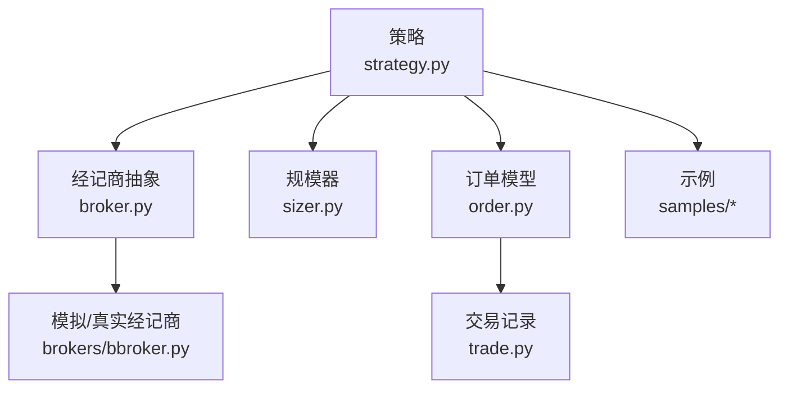
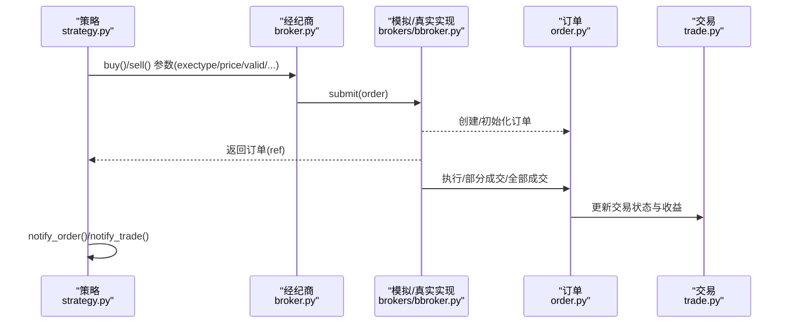
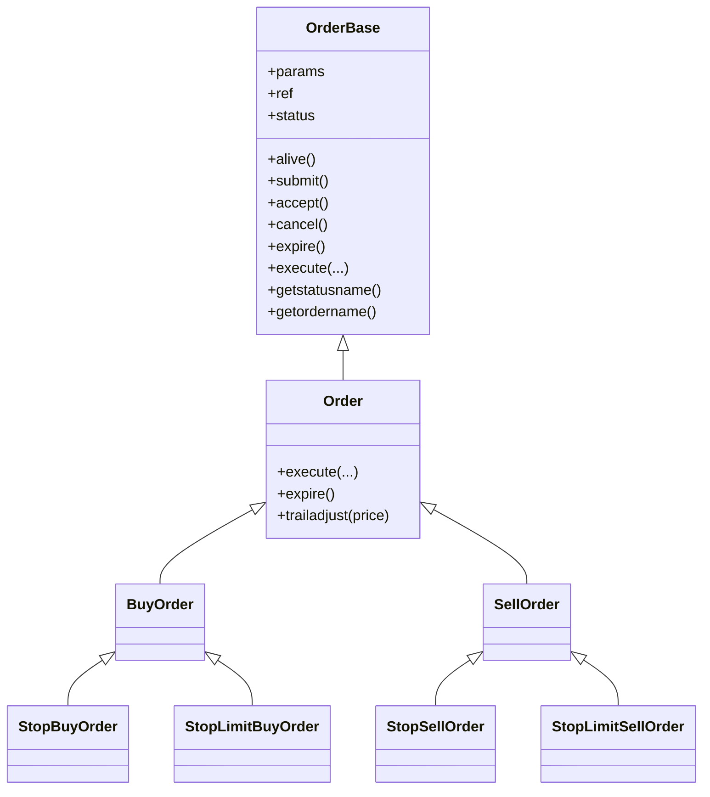
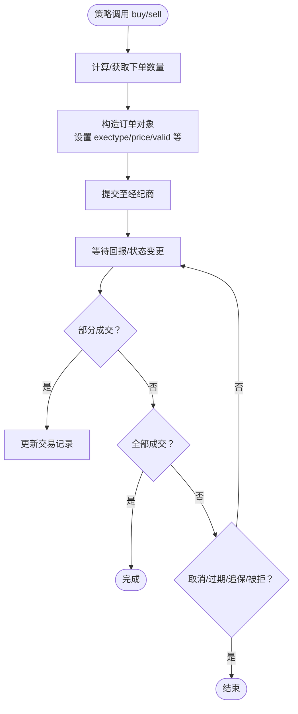
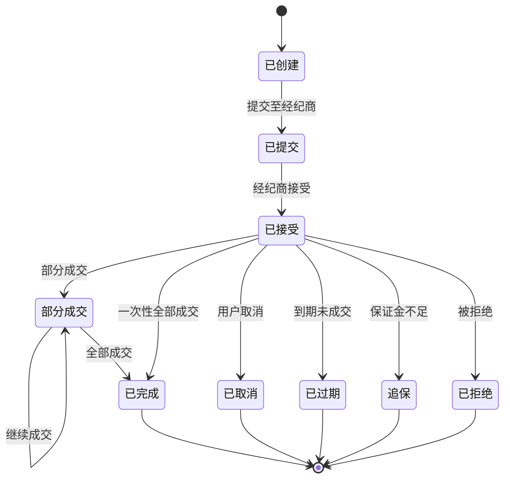
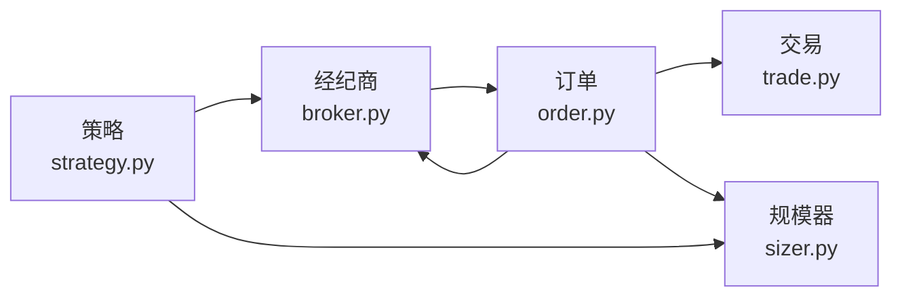

# 订单管理

<cite>
**本文引用的文件**
- [order.py](file://backtrader/order.py)
- [broker.py](file://backtrader/broker.py)
- [strategy.py](file://backtrader/strategy.py)
- [trade.py](file://backtrader/trade.py)
- [sizer.py](file://backtrader/sizer.py)
- [bbroker.py](file://backtrader/brokers/bbroker.py)
- [order-execution.py](file://samples/order-execution/order-execution.py)
- [oco.py](file://samples/oco/oco.py)
- [bracket.py](file://samples/bracket/bracket.py)
</cite>

## 目录
1. [引言](#引言)
2. [项目结构](#项目结构)
3. [核心组件](#核心组件)
4. [架构总览](#架构总览)
5. [详细组件分析](#详细组件分析)
6. [依赖关系分析](#依赖关系分析)
7. [性能考虑](#性能考虑)
8. [故障排查指南](#故障排查指南)
9. [结论](#结论)
10. [附录：代码示例与最佳实践](#附录代码示例与最佳实践)

## 引言
本文件系统性梳理 Backtrader 的订单管理机制，覆盖从订单创建、提交、执行到管理的全生命周期；详解市价单、限价单、止损单、止盈单、OCO（相互取消）与 Bracket（套娃式止盈止损）等订单类型；说明订单参数（价格、数量、有效期、触发条件等）与执行机制（部分成交、成交确认、成交回报），并给出风险控制、资金管理与滑点处理的最佳实践。

## 项目结构
围绕订单管理的关键模块与样例：
- 核心模型与状态机：order.py
- 策略接口与下单入口：strategy.py
- 经纪商抽象与实现：broker.py、brokers/bbroker.py
- 成交与交易记录：trade.py
- 规模器（下单数量决策）：sizer.py
- 示例：samples/order-execution、samples/oco、samples/bracket

图表来源
- [strategy.py](file://backtrader/strategy.py#L774-L971)
- [broker.py](file://backtrader/broker.py#L145-L163)
- [bbroker.py](file://backtrader/brokers/bbroker.py#L36-L120)
- [order.py](file://backtrader/order.py#L222-L527)
- [trade.py](file://backtrader/trade.py#L94-L146)
- [sizer.py](file://backtrader/sizer.py#L29-L84)

章节来源
- [strategy.py](file://backtrader/strategy.py#L774-L971)
- [broker.py](file://backtrader/broker.py#L145-L163)
- [bbroker.py](file://backtrader/brokers/bbroker.py#L36-L120)
- [order.py](file://backtrader/order.py#L222-L527)
- [trade.py](file://backtrader/trade.py#L94-L146)
- [sizer.py](file://backtrader/sizer.py#L29-L84)

## 核心组件
- 订单模型与状态机
  - 订单类型：市价、限价、止损、止盈、停 trail、停 trail 限价、收市价、历史单
  - 订单状态：已创建、已提交、已接受、部分成交、已完成、已取消、已过期、追保、被拒
  - 关键字段：ref、created/executed、info、comminfo、触发状态、存活状态
- 策略下单入口
  - buy()/sell()/close()/buy_bracket() 等 API，支持 exectype、price、pricelimit、valid、oco、parent、transmit、trailamount、trailpercent 等参数
- 经纪商抽象与实现
  - BrokerBase 抽象定义 buy/sell/cancel/submit 等接口；BackBroker 为默认模拟实现，支持滑点、填充器、cheat-on-open/close 等
- 成交与交易
  - OrderData/OrderExecutionBit 记录执行细节；Trade 记录一次建仓到平仓的完整交易
- 规模器
  - Sizer 决策下单数量，结合佣金方案与可用资金

章节来源
- [order.py](file://backtrader/order.py#L222-L527)
- [strategy.py](file://backtrader/strategy.py#L774-L971)
- [broker.py](file://backtrader/broker.py#L145-L163)
- [bbroker.py](file://backtrader/brokers/bbroker.py#L36-L120)
- [trade.py](file://backtrader/trade.py#L94-L146)
- [sizer.py](file://backtrader/sizer.py#L29-L84)

## 架构总览
Backtrader 的订单管理以“策略-经纪商-订单-交易”为主线，策略通过统一的下单 API 发起请求，经由经纪商封装为订单对象，进入状态机流转，并在成交后更新交易记录。

图表来源
- [strategy.py](file://backtrader/strategy.py#L774-L971)
- [broker.py](file://backtrader/broker.py#L145-L163)
- [bbroker.py](file://backtrader/brokers/bbroker.py#L662-L691)
- [order.py](file://backtrader/order.py#L502-L581)
- [trade.py](file://backtrader/trade.py#L220-L312)

## 详细组件分析

### 订单模型与状态机
- 订单类型与执行方式
  - 市价单：按下一时刻可执行价格成交
  - 限价单：仅在达到或更好价格时成交
  - 止损单：达到触发价后转市价单执行
  - 止盈单：达到触发价后转限价单执行
  - 停止移动单/停止移动限价单：随价格变动动态调整触发价
  - 收市价单：按当日收盘价成交
  - 历史单：用于历史回测评估
- 订单状态流转
  - Created → Submitted → Accepted → Partial/Completed 或 Cancelled/Expired/Margin/Rejected
  - 生命周期中可多次收到成交回报，状态在部分成交与完成之间切换
- 关键数据结构
  - OrderData：记录创建与执行的聚合信息（时间、数量、价格、限价、trail、累计价值/手续费/PnL/占用保证金、当前持仓等）
  - OrderExecutionBit：单次成交片段，包含成交时间、成交量、成交价、开仓/平仓部分、对应市值与手续费、净 PnL、当前持仓等

图表来源
- [order.py](file://backtrader/order.py#L222-L641)

章节来源
- [order.py](file://backtrader/order.py#L88-L220)
- [order.py](file://backtrader/order.py#L222-L527)
- [order.py](file://backtrader/order.py#L528-L641)

### 策略下单与参数详解
- 下单入口
  - buy(data, size, price, plimit, exectype, valid, tradeid, oco, parent, transmit, trailamount, trailpercent, ...)
  - sell(data, size, price, plimit, exectype, valid, tradeid, oco, parent, transmit, trailamount, trailpercent, ...)
  - close(data, size, ...) 自动反手
  - buy_bracket(...) 快速构建“止盈止损”组合单
- 关键参数
  - exectype：执行类型（市价/限价/止损/止盈/收市/停trail/停trail限价/历史）
  - price/plimit：触发价/限价
  - valid：有效期（None/GTC、到期日、当日、数值时间编码）
  - oco：与其他订单组成“相互取消”
  - parent/transmit：父子订单与批量发送控制
  - trailamount/trailpercent：移动止损距离（绝对/百分比）
  - size：若为空则由规模器决定
- 回调通知
  - notify_order(order)：订单状态变化
  - notify_trade(trade)：交易变化
  - notify_cashvalue/cashvalue/fund：资金与净值变化

图表来源
- [strategy.py](file://backtrader/strategy.py#L774-L971)
- [order.py](file://backtrader/order.py#L502-L581)
- [trade.py](file://backtrader/trade.py#L220-L312)

章节来源
- [strategy.py](file://backtrader/strategy.py#L774-L971)
- [strategy.py](file://backtrader/strategy.py#L1001-L1063)

### 经纪商抽象与实现
- BrokerBase
  - 定义 getcash/getvalue/getposition/setcommission/addcommissioninfo 等基础能力
  - buy/sell/cancel/submit 抽象方法，具体由实现类提供
- BackBroker（默认实现）
  - 支持多种执行器（filler）、滑点（slip_perc/slip_fixed/slip_open/slip_match/slip_limit/slip_out）
  - 支持 Cheat-On-Close/On-Open（coo/coc）
  - 支持 OCO、Bracket 子订单的父子关系与批量发送
  - _execute 内部驱动订单执行与状态推进

章节来源
- [broker.py](file://backtrader/broker.py#L145-L163)
- [bbroker.py](file://backtrader/brokers/bbroker.py#L36-L120)
- [bbroker.py](file://backtrader/brokers/bbroker.py#L662-L691)

### 成交与交易记录
- OrderData/OrderExecutionBit
  - 记录每次成交的 dt/size/price、开仓/平仓部分、市值/手续费/PnL、当前持仓等
  - 支持 pending 迭代与克隆，便于增量通知
- Trade
  - 记录一次建仓到平仓的完整生命周期：open/close 时间、bar 开始/结束、累计 PnL、手续费、历史轨迹等
  - 支持历史记录开关，便于复盘

章节来源
- [order.py](file://backtrader/order.py#L88-L220)
- [trade.py](file://backtrader/trade.py#L94-L146)
- [trade.py](file://backtrader/trade.py#L220-L312)

### 订单类型与适用场景
- 市价单
  - 特点：瞬时成交，无价格限制
  - 适用：流动性充足、追求即时成交的场景
- 限价单
  - 特点：限定最优成交价，可能不成交
  - 适用：避免劣价成交，适合震荡或趋势初期
- 止损单
  - 特点：跌破/升破触发后转市价止损
  - 适用：风控止盈止损
- 止盈单
  - 特点：达到目标价后转限价止盈
  - 适用：锁定利润
- 移动止损/止盈
  - 特点：随价格变动动态调整触发价
  - 适用：趋势跟踪中的动态保护
- 收市价单
  - 特点：按当日收盘价成交
  - 适用：对冲尾盘波动或满足特定规则
- 历史单
  - 特点：用于历史回测评估
  - 适用：事后分析与策略验证

章节来源
- [order.py](file://backtrader/order.py#L242-L246)
- [strategy.py](file://backtrader/strategy.py#L838-L854)

### 订单生命周期与状态机

图表来源
- [order.py](file://backtrader/order.py#L250-L258)
- [order.py](file://backtrader/order.py#L519-L593)

章节来源
- [order.py](file://backtrader/order.py#L250-L258)
- [order.py](file://backtrader/order.py#L519-L593)

### 订单参数配置与执行机制
- 价格与数量
  - price/plimit：触发价/限价；size 为空时由规模器决定
- 有效期
  - None/GTC、到期日、当日、数值时间编码；过期自动标记为已过期
- 触发条件
  - 止损/止盈/移动止损/移动止盈；StopTrail/StopTrailLimit 动态调整触发价
- 执行机制
  - 市价单在下一 bar 开盘价成交；限价单在触及或更好价格成交；止损/止盈在触发后按市价/限价执行
  - 支持滑点与匹配策略（slip_match/slip_limit/slip_out）

章节来源
- [strategy.py](file://backtrader/strategy.py#L856-L876)
- [strategy.py](file://backtrader/strategy.py#L838-L854)
- [bbroker.py](file://backtrader/brokers/bbroker.py#L129-L177)

## 依赖关系分析
- 策略依赖经纪商进行下单与取消；经纪商内部维护订单集合与回报队列
- 订单依赖规模器确定数量；依赖佣金方案计算成本
- 订单执行后更新交易记录，策略通过回调获知变化

图表来源
- [strategy.py](file://backtrader/strategy.py#L774-L971)
- [broker.py](file://backtrader/broker.py#L145-L163)
- [order.py](file://backtrader/order.py#L222-L527)
- [trade.py](file://backtrader/trade.py#L94-L146)
- [sizer.py](file://backtrader/sizer.py#L29-L84)

章节来源
- [strategy.py](file://backtrader/strategy.py#L774-L971)
- [broker.py](file://backtrader/broker.py#L145-L163)
- [order.py](file://backtrader/order.py#L222-L527)
- [trade.py](file://backtrader/trade.py#L94-L146)
- [sizer.py](file://backtrader/sizer.py#L29-L84)

## 性能考虑
- 滑点与填充器
  - 合理设置滑点参数，避免过度偏离真实成交；在高波动市场谨慎使用“开盘滑点”
- OCO/Bracket 批量发送
  - 使用 transmit 控制父子订单的批量发送，减少多次往返
- 订单有效期
  - 合理设置 valid，避免过长导致积压或过短导致频繁失效
- 回调频率
  - notify_order/notify_trade 在高频回测中可能带来额外开销，建议按需记录

## 故障排查指南
- 订单被拒
  - 检查资金/保证金是否充足；确认 exectype 与价格是否符合最小跳动要求
- 订单未成交
  - 检查 valid 是否过短；限价单是否未达到或更好价格；滑点是否过大
- 订单过期
  - 检查 valid 设置；确认数据时间编码与系统时钟
- 取消失败
  - 确认订单状态仍可取消；检查 OCO/Bracket 子订单的父子关系

章节来源
- [order.py](file://backtrader/order.py#L471-L493)
- [order.py](file://backtrader/order.py#L519-L593)
- [bbroker.py](file://backtrader/brokers/bbroker.py#L687-L691)

## 结论
Backtrader 的订单管理以清晰的状态机与可扩展的执行模型为核心，配合策略层统一的下单 API、经纪商层的多样化实现与交易层的完整记录，形成一套完整的订单生命周期管理体系。通过合理配置参数、选择合适订单类型与执行策略，可在回测与实盘中实现稳健的风险控制与资金管理。

## 附录：代码示例与最佳实践

### 示例一：不同执行类型的订单
- 展示市价、收市价、限价、止损、停-限价等执行类型
- 适用于理解各类型特点与适用场景

章节来源
- [order-execution.py](file://samples/order-execution/order-execution.py#L109-L162)

### 示例二：OCO（相互取消）订单
- 多个订单组成 OCO 组，任一成交即取消其余
- 适用于互斥策略或对锁仓的保护

章节来源
- [oco.py](file://samples/oco/oco.py#L92-L115)

### 示例三：Bracket（套娃式止盈止损）
- 通过 buy_bracket 快速构建“止盈止损”组合单
- 支持 parent/transmit 控制批量发送与父子关系

章节来源
- [bracket.py](file://samples/bracket/bracket.py#L114-L119)

### 最佳实践清单
- 风险控制
  - 使用止损单/移动止损控制最大回撤；合理设置 trailamount/trailpercent
  - 使用 OCO 避免多重挂单互相影响
- 资金管理
  - 通过规模器（Sizer）根据账户净值/波动率动态调整仓位
  - 严格校验 commission/margin，避免低估成本
- 滑点处理
  - 在模拟环境中适度设置滑点参数；实盘中结合交易所规则与流动性评估
- 订单生命周期管理
  - 明确 valid 与 exectype 的组合；及时 cancel/expired 状态处理
  - 在 notify_order 中记录关键事件，便于回测分析与复盘