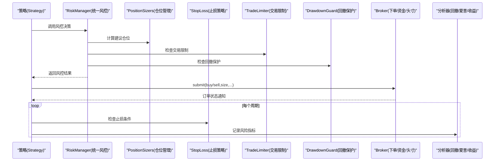
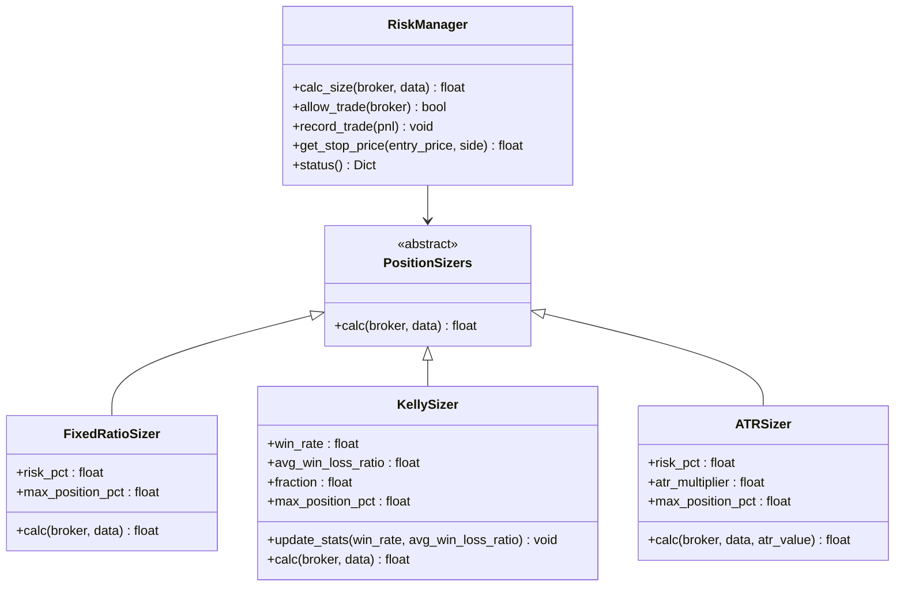
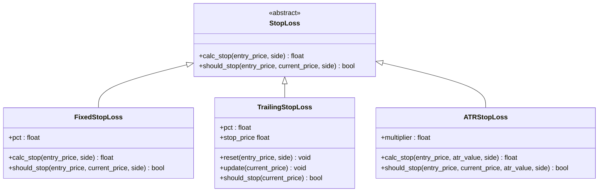
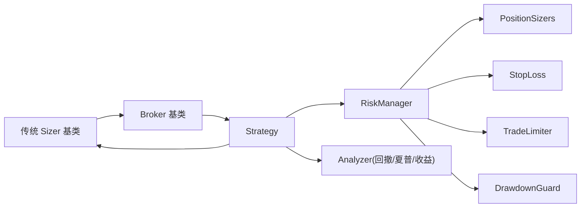

# 风险管理

<cite>
**本文引用的文件**
- [backtrader/sizers/__init__.py](file://backtrader/sizers/__init__.py)
- [backtrader/sizers/fixedsize.py](file://backtrader/sizers/fixedsize.py)
- [backtrader/sizers/percents_sizer.py](file://backtrader/sizers/percents_sizer.py)
- [backtrader/sizer.py](file://backtrader/sizer.py)
- [backtrader/analyzers/drawdown.py](file://backtrader/analyzers/drawdown.py)
- [backtrader/analyzers/sharpe.py](file://backtrader/analyzers/sharpe.py)
- [backtrader/analyzers/vwr.py](file://backtrader/analyzers/vwr.py)
- [backtrader/analyzers/calmar.py](file://backtrader/analyzers/calmar.py)
- [backtrader/analyzers/returns.py](file://backtrader/analyzers/returns.py)
- [real_trade/risk/__init__.py](file://real_trade/risk/__init__.py)
- [real_trade/risk/manager.py](file://real_trade/risk/manager.py)
- [real_trade/risk/position_sizer.py](file://real_trade/risk/position_sizer.py)
- [real_trade/risk/stop_loss.py](file://real_trade/risk/stop_loss.py)
- [real_trade/risk/drawdown.py](file://real_trade/risk/drawdown.py)
- [real_trade/risk/limits.py](file://real_trade/risk/limits.py)
- [real_trade/strategies/base.py](file://real_trade/strategies/base.py)
- [samples/sizertest/sizertest.py](file://samples/sizertest/sizertest.py)
- [samples/stop-trading/stop-loss-approaches.py](file://samples/stop-trading/stop-loss-approaches.py)
- [samples/stoptrail/trail.py](file://samples/stoptrail/trail.py)
- [backtrader/broker.py](file://backtrader/broker.py)
- [backtrader/strategy.py](file://backtrader/strategy.py)
</cite>

## 更新摘要
**变更内容**
- 新增RealTrade Risk模块的详细分析，包括RiskManager统一风控管理
- 添加多种高级仓位管理策略：固定比例、凯利准则、ATR波动率管理
- 新增多种止损策略：固定止损、移动追踪止损、ATR动态止损
- 添加交易限制和回撤保护机制
- 更新架构图以反映新的风控组件层次结构

## 目录
1. [引言](#引言)
2. [项目结构](#项目结构)
3. [核心组件](#核心组件)
4. [架构总览](#架构总览)
5. [详细组件分析](#详细组件分析)
6. [依赖关系分析](#依赖关系分析)
7. [性能考量](#性能考量)
8. [故障排查指南](#故障排查指南)
9. [结论](#结论)
10. [附录](#附录)

## 引言
本指南系统梳理 Backtrader 的风险管理能力，围绕"风险识别—风险评估—风险控制"三段式流程，结合传统仓位管理（固定、百分比、目标规模）与新增的RealTrade Risk模块提供的高级风控功能，包括统一风控管理器、多种仓位管理策略（固定比例、凯利准则、ATR波动率）、多种止损策略（固定、移动追踪、ATR动态）以及交易限制和回撤保护机制。文档同时通过示例脚本展示如何在策略中集成这些机制，并讨论风险管理与策略收益之间的平衡。

## 项目结构
Backtrader 将风险管理相关能力分布在多个模块：
- 传统风控：sizers 子包提供固定与百分比两类基础 Sizer 实现，并以基类 Sizer 抽象出统一接口。
- RealTrade Risk模块：提供统一的风控管理器和多种高级风控组件。
- 风险指标：analyzers 子包提供回撤、夏普、Calmar、VWR、收益等分析器。
- 策略与执行：strategy 提供策略生命周期钩子；broker 提供下单、资金、头寸查询等底层能力。
- 示例：samples 中包含仓位测试、止损策略与追踪止损示例，便于对照学习。

```mermaid
graph TB
subgraph "策略层"
STRAT["Strategy<br/>策略生命周期/订单/观察者/分析器注册"]
REALSTRAT["RealTradeStrategyBase<br/>实盘策略基类"]
END
subgraph "执行层"
BROKER["BrokerBase<br/>下单/取消/资金/头寸/佣金信息"]
END
subgraph "传统风控工具"
SIZERBASE["Sizer 基类"]
FS["FixedSize 固定大小"]
PS["PercentSizer 百分比"]
RET["Returns 收益"]
END
subgraph "RealTrade Risk模块"
RM["RiskManager<br/>统一风控管理器"]
PSIZER["PositionSizers<br/>固定比例/凯利/ATR"]
SL["StopLoss<br/>固定/追踪/ATR止损"]
TL["TradeLimiter<br/>交易限制"]
DG["DrawdownGuard<br/>回撤保护"]
END
subgraph "风险指标"
DD["DrawDown 最大回撤"]
SR["SharpeRatio 夏普比率"]
CAL["Calmar Calmar 比率"]
VWR["VWR 可变权重回报"]
END
STRAT --> SIZERBASE
REALSTRAT --> RM
STRAT --> BROKER
STRAT --> DD
STRAT --> SR
STRAT --> CAL
STRAT --> VWR
SIZERBASE --> FS
SIZERBASE --> PS
BROKER --> STRAT
RM --> PSIZER
RM --> SL
RM --> TL
RM --> DG
```

**图表来源**
- [backtrader/strategy.py](file://backtrader/strategy.py#L107-L104)
- [backtrader/broker.py](file://backtrader/broker.py#L49-L168)
- [backtrader/sizer.py](file://backtrader/sizer.py#L29-L82)
- [real_trade/risk/manager.py](file://real_trade/risk/manager.py#L20-L93)
- [real_trade/risk/position_sizer.py](file://real_trade/risk/position_sizer.py#L15-L109)
- [real_trade/risk/stop_loss.py](file://real_trade/risk/stop_loss.py#L17-L112)
- [real_trade/risk/limits.py](file://real_trade/risk/limits.py#L14-L67)
- [real_trade/risk/drawdown.py](file://real_trade/risk/drawdown.py#L12-L42)

**章节来源**
- [backtrader/sizers/__init__.py](file://backtrader/sizers/__init__.py#L27-L29)
- [backtrader/sizer.py](file://backtrader/sizer.py#L29-L82)
- [backtrader/strategy.py](file://backtrader/strategy.py#L107-L104)
- [backtrader/broker.py](file://backtrader/broker.py#L49-L168)
- [real_trade/risk/__init__.py](file://real_trade/risk/__init__.py#L9-L33)

## 核心组件
- 传统 Sizer 基类与派生类
  - Sizer 定义统一的 getsizing 接口，内部调用 _getsizing 计算下单数量，参数包含佣金信息、可用现金、目标数据与方向。
  - 固定大小：FixedSize、FixedReverser、FixedSizeTarget。
  - 百分比：PercentSizer、AllInSizer、PercentSizerInt、AllInSizerInt。
- RealTrade RiskManager 统一风控管理器
  - 集成多种风控组件，提供统一的风控决策接口。
  - 包含仓位计算、止损策略、交易限制、回撤保护等功能。
- 高级仓位管理策略
  - FixedRatioSizer：固定比例仓位计算，基于账户风险百分比。
  - KellySizer：凯利公式仓位计算，基于胜率和盈亏比。
  - ATRSizer：基于ATR波动率的动态仓位管理。
- 多种止损策略
  - FixedStopLoss：固定百分比止损。
  - TrailingStopLoss：移动追踪止损，跟随最优价格调整。
  - ATRStopLoss：基于ATR的动态止损。
- 交易限制和回撤保护
  - TradeLimiter：限制每日交易次数、单日亏损和交易冷却时间。
  - DrawdownGuard：最大回撤保护，防止账户从峰值大幅回撤。
- 分析器
  - DrawDown/TimeDrawDown：计算当前与历史最大回撤及其周期。
  - SharpeRatio/SharpeRatio_A：基于时间窗收益与无风险利率计算夏普比率。
  - Calmar：基于滚动期对数年化收益与最大回撤的比值。
  - VWR：使用对数收益与波动性加权的改进型回报度量。
  - Returns：复合/平均/年化/归一化收益。
- Broker 基类
  - 提供 getcash、getvalue、getposition、getcommissioninfo 等方法，为 Sizer 与分析器提供资金与头寸上下文。

**章节来源**
- [backtrader/sizer.py](file://backtrader/sizer.py#L29-L82)
- [backtrader/sizers/fixedsize.py](file://backtrader/sizers/fixedsize.py#L27-L109)
- [backtrader/sizers/percents_sizer.py](file://backtrader/sizers/percents_sizer.py#L29-L91)
- [real_trade/risk/manager.py](file://real_trade/risk/manager.py#L20-L93)
- [real_trade/risk/position_sizer.py](file://real_trade/risk/position_sizer.py#L15-L109)
- [real_trade/risk/stop_loss.py](file://real_trade/risk/stop_loss.py#L17-L112)
- [real_trade/risk/limits.py](file://real_trade/risk/limits.py#L14-L67)
- [real_trade/risk/drawdown.py](file://real_trade/risk/drawdown.py#L12-L42)
- [backtrader/analyzers/drawdown.py](file://backtrader/analyzers/drawdown.py#L31-L111)
- [backtrader/analyzers/sharpe.py](file://backtrader/analyzers/sharpe.py#L33-L206)
- [backtrader/analyzers/calmar.py](file://backtrader/analyzers/calmar.py#L31-L114)
- [backtrader/analyzers/vwr.py](file://backtrader/analyzers/vwr.py#L32-L174)
- [backtrader/analyzers/returns.py](file://backtrader/analyzers/returns.py#L30-L156)
- [backtrader/broker.py](file://backtrader/broker.py#L49-L168)

## 架构总览
下图展示从策略到执行再到分析的整体链路，以及风险管理关键节点，包括新增的RealTrade Risk模块：



**图表来源**
- [backtrader/strategy.py](file://backtrader/strategy.py#L107-L104)
- [backtrader/sizer.py](file://backtrader/sizer.py#L50-L77)
- [backtrader/broker.py](file://backtrader/broker.py#L145-L163)
- [real_trade/risk/manager.py](file://real_trade/risk/manager.py#L62-L86)
- [real_trade/risk/position_sizer.py](file://real_trade/risk/position_sizer.py#L22-L30)
- [real_trade/risk/stop_loss.py](file://real_trade/risk/stop_loss.py#L23-L34)
- [real_trade/risk/limits.py](file://real_trade/risk/limits.py#L39-L54)
- [real_trade/risk/drawdown.py](file://real_trade/risk/drawdown.py#L22-L34)

## 详细组件分析

### 统一风控管理器（RiskManager）
RiskManager 是 RealTrade Risk 模块的核心组件，提供统一的风控决策接口，将多个风控子模块整合为一个完整的风控体系。

**主要功能**
- 仓位计算：集成多种仓位管理策略，根据风险偏好和市场波动动态调整仓位
- 交易限制：控制每日交易频率、单日亏损和交易冷却时间
- 回撤保护：监控账户回撤，防止从峰值大幅回撤
- 止损管理：提供多种止损策略，支持固定止损、移动追踪止损和ATR动态止损

**使用方式**
```python
# 创建风控管理器
rm = RiskManager(
    max_position_pct=0.3,      # 最大仓位占比
    risk_per_trade=0.02,       # 单笔风险百分比
    max_drawdown_pct=0.15,     # 最大回撤限制
    max_daily_trades=20,       # 每日最大交易次数
)

# 在策略中使用
size = rm.calc_size(broker, data)  # 计算建议仓位
if rm.allow_trade(broker):        # 检查是否允许开仓
    order = self.buy(size=size)
```

**章节来源**
- [real_trade/risk/manager.py](file://real_trade/risk/manager.py#L20-L93)

### 高级仓位管理策略

#### 固定比例仓位（FixedRatioSizer）
基于账户风险百分比计算仓位，是最简单的风险管理方式。

**特点**
- 简单直观：根据固定的风险百分比计算仓位
- 动态调整：随账户价值变化自动调整仓位大小
- 上限控制：可设置最大仓位占比，防止过度集中

**计算公式**
```
仓位 = min((账户价值 × 风险百分比) / 价格, (账户价值 × 最大仓位百分比) / 价格)
```

#### 凯利公式仓位（KellySizer）
基于统计学原理的最优仓位管理策略，考虑胜率和盈亏比。

**特点**
- 理论基础：基于凯利公式，理论上最大化长期财富增长率
- 动态更新：可根据实际交易结果更新胜率和盈亏比
- 保守策略：支持半凯利等保守策略，降低波动性

**计算公式**
```
凯利比例 = (胜率 × 盈利期望 - 亏损概率) / 盈利期望
仓位 = min(凯利比例 × 保守系数, 最大仓位百分比) × 账户价值 / 价格
```

#### ATR波动率仓位（ATRSizer）
基于ATR（平均真实波幅）的动态仓位管理，波动越大仓位越小。

**特点**
- 波动率敏感：根据市场波动性动态调整仓位
- 风险控制：波动大时自动减少仓位，降低风险
- 参数灵活：可调整ATR周期和乘数参数

**计算公式**
```
风险金额 = 账户价值 × 风险百分比
风险单位 = ATR × 乘数
仓位 = min(风险金额 / 风险单位, (账户价值 × 最大仓位百分比) / 价格)
```



**图表来源**
- [real_trade/risk/manager.py](file://real_trade/risk/manager.py#L62-L86)
- [real_trade/risk/position_sizer.py](file://real_trade/risk/position_sizer.py#L15-L109)

**章节来源**
- [real_trade/risk/position_sizer.py](file://real_trade/risk/position_sizer.py#L15-L109)
- [real_trade/risk/manager.py](file://real_trade/risk/manager.py#L40-L58)

### 多种止损策略

#### 固定百分比止损（FixedStopLoss）
最简单的止损方式，基于入场价格的固定百分比设置止损。

**特点**
- 简单易用：设置固定止损百分比即可
- 快速执行：无需复杂的计算，执行效率高
- 适用广泛：适合大多数市场环境

**计算公式**
```
多头止损 = 入场价格 × (1 - 止损百分比)
空头止损 = 入场价格 × (1 + 止损百分比)
```

#### 移动追踪止损（TrailingStopLoss）
止损价跟随最优价格移动，只朝有利方向调整，永不回退。

**特点**
- 最大化利润：随着价格向有利方向移动自动提高止损
- 风险控制：在有利趋势中减少强制平仓风险
- 参数调节：可调整追踪百分比适应不同市场

**实现机制**
- 记录最优价格（多头取最高价，空头取最低价）
- 每根K线更新最优价格
- 基于最优价格计算当前止损价

#### ATR动态止损（ATRStopLoss）
基于ATR波动率的动态止损，波动大时止损距离更远。

**特点**
- 波动率敏感：根据市场波动性调整止损距离
- 避免假突破：在高波动环境中提供更合理的止损距离
- 参数优化：可调整ATR周期和乘数参数

**计算公式**
```
多头止损 = 入场价格 - ATR × 乘数
空头止损 = 入场价格 + ATR × 乘数
```



**图表来源**
- [real_trade/risk/stop_loss.py](file://real_trade/risk/stop_loss.py#L17-L112)

**章节来源**
- [real_trade/risk/stop_loss.py](file://real_trade/risk/stop_loss.py#L17-L112)

### 交易限制和回撤保护

#### 交易限制器（TradeLimiter）
控制交易频率、单日亏损和交易冷却时间，防止过度交易。

**功能特性**
- 每日交易次数限制：防止频繁交易导致的高额手续费
- 单日亏损限制：当达到预设亏损时暂停交易
- 交易冷却时间：设置两笔交易间的最小间隔时间
- 自动日期重置：每日自动重置交易统计

**实现机制**
- 维护每日交易计数和累计盈亏
- 检查新交易日并重置统计
- 应用各种限制条件进行判断

#### 回撤保护器（DrawdownGuard）
监控账户从峰值的回撤，当超过阈值时暂停开仓。

**功能特性**
- 峰值跟踪：实时跟踪账户历史最高价值
- 回撤计算：计算当前回撤相对于峰值的比例
- 动态暂停：当回撤超过阈值时暂停开仓
- 状态查询：提供回撤比例计算和状态查询功能

**计算公式**
```
回撤比例 = (峰值 - 当前价值) / 峰值
允许开仓当回撤比例 < 最大允许回撤比例
```

**章节来源**
- [real_trade/risk/limits.py](file://real_trade/risk/limits.py#L14-L67)
- [real_trade/risk/drawdown.py](file://real_trade/risk/drawdown.py#L12-L42)

### 传统仓位管理策略
- 固定大小（FixedSize）
  - 特点：每次交易固定手数，支持按"档位"分批建仓。
  - 适用：趋势跟踪、均值回归等明确信号且不追求动态风控的策略。
- 固定反向（FixedReverser）
  - 特点：开仓按固定手数，反仓时翻倍，适合对冲或先减仓再反向。
- 目标规模（FixedSizeTarget）
  - 特点：配合目标订单，按目标总规模与分档逐步建/平仓。
- 百分比仓位（PercentSizer/AllInSizer）
  - 特点：按可用资金百分比下单，支持整数截断版本。
  - 适用：追求固定风险敞口比例的策略；AllIn 用于全仓进攻。
- 与策略集成
  - 在策略初始化后设置 Sizer，即可在 next 中直接 buy()/sell()，由 Sizer 决定下单数量。

**章节来源**
- [backtrader/sizers/fixedsize.py](file://backtrader/sizers/fixedsize.py#L27-L109)
- [backtrader/sizers/percents_sizer.py](file://backtrader/sizers/percents_sizer.py#L29-L91)
- [backtrader/sizer.py](file://backtrader/sizer.py#L29-L82)
- [samples/sizertest/sizertest.py](file://samples/sizertest/sizertest.py#L46-L68)

### 止损与止盈机制
- 手动止损/追踪止损（ManualStopOrStopTrail）
  - 进场完成后根据入场价设定固定止损或移动止损单；支持 Cheat-on-Close 模式下以收盘价触发。
- 自动止损（AutoStopOrStopTrail）
  - 将止损作为挂单与市价/限价委托的父子单发送，确保下单与风控同步。
- 追踪止损（StopTrail）
  - 支持 StopTrail/StopTrailLimit，可按金额或百分比追踪，实时更新触发阈值。

**章节来源**
- [samples/stop-trading/stop-loss-approaches.py](file://samples/stop-trading/stop-loss-approaches.py#L44-L156)
- [samples/stoptrail/trail.py](file://samples/stoptrail/trail.py#L30-L87)
- [backtrader/broker.py](file://backtrader/broker.py#L151-L163)

### 风险分散与组合管理
- 多标的管理
  - 使用多数据源（MultiData）在同一策略中管理多个标的，分别设置 Sizer 与风控参数。
- 资产配置
  - 通过 PercentSizer 对不同资产分配资金比例，结合止损/止盈限制单个标的的最大回撤贡献。
- 组合层面风控
  - 利用 Broker 的 getvalue/fundvalue 获取组合净值，结合 DrawDown/Sharpe/Calmar/VWR 等指标进行组合层面的动态再平衡与风控。

**章节来源**
- [backtrader/analyzers/drawdown.py](file://backtrader/analyzers/drawdown.py#L90-L111)
- [backtrader/analyzers/sharpe.py](file://backtrader/analyzers/sharpe.py#L134-L206)
- [backtrader/analyzers/calmar.py](file://backtrader/analyzers/calmar.py#L83-L114)
- [backtrader/analyzers/vwr.py](file://backtrader/analyzers/vwr.py#L114-L174)
- [backtrader/broker.py](file://backtrader/broker.py#L112-L127)

### 风险指标计算与监控
- 最大回撤（DrawDown/TimeDrawDown）
  - 计算当前回撤与历史最大回撤，支持按资金模式切换。
- 夏普比率（SharpeRatio/SharpeRatio_A）
  - 基于时间窗收益与无风险利率，支持年化与样本修正标准差。
- Calmar 比率
  - 滚动期对数年化收益除以最大回撤，衡量收益回撤比。
- VWR（可变权重回报）
  - 使用对数收益与波动性加权，对极端波动更稳健。
- 收益（Returns）
  - 提供复合/平均/年化/归一化收益，支撑其他指标计算。

**章节来源**
- [backtrader/analyzers/drawdown.py](file://backtrader/analyzers/drawdown.py#L31-L111)
- [backtrader/analyzers/sharpe.py](file://backtrader/analyzers/sharpe.py#L33-L206)
- [backtrader/analyzers/calmar.py](file://backtrader/analyzers/calmar.py#L31-L114)
- [backtrader/analyzers/vwr.py](file://backtrader/analyzers/vwr.py#L32-L174)
- [backtrader/analyzers/returns.py](file://backtrader/analyzers/returns.py#L30-L156)

### 实际案例：在策略中集成风险管理
- 传统仓位测试样例
  - 展示自定义 LongOnly 与 FixedReverser 的用法，演示如何在策略中注入 Sizer 并控制下单数量。
- RealTrade RiskManager 实战示例
  - 展示如何在实盘策略中使用 RiskManager 进行统一风控管理。
- 高级风控策略示例
  - 展示固定比例、凯利准则、ATR波动率等高级仓位管理策略的使用。
- 止损策略样例
  - 展示手动/自动止损与追踪止损的实现方式，涵盖订单父子单、Cheat-on-Close 等场景。
- 追踪止损样例
  - 展示 StopTrail/StopTrailLimit 的参数与触发逻辑，便于对比不同追踪方式。

**章节来源**
- [samples/sizertest/sizertest.py](file://samples/sizertest/sizertest.py#L46-L101)
- [samples/stop-trading/stop-loss-approaches.py](file://samples/stop-trading/stop-loss-approaches.py#L44-L156)
- [samples/stoptrail/trail.py](file://samples/stoptrail/trail.py#L30-L87)
- [real_trade/examples/live_trading.py](file://real_trade/examples/live_trading.py#L28-L34)

## 依赖关系分析
- Sizer 与 Broker 的耦合
  - Sizer 通过 Broker 查询佣金、现金与头寸，从而决定下单规模。
- RiskManager 与各子模块的集成
  - RiskManager 统一管理 PositionSizers、StopLoss、TradeLimiter、DrawdownGuard 等子模块。
  - 各子模块通过 RiskManager 的接口进行交互，形成完整的风控体系。
- 策略与分析器的耦合
  - 策略在初始化阶段注册分析器，分析器在运行期间收集数据并输出指标。
- RealTrade 策略与风控模块的交互
  - RealTradeStrategyBase 基类提供风控辅助方法，支持 RiskManager 的集成。
- 示例与核心模块的交互
  - 样例脚本通过 cerebro.addsizer/addstrategy/addanalyzer 将风险管理组件接入策略。



**图表来源**
- [backtrader/sizer.py](file://backtrader/sizer.py#L29-L82)
- [backtrader/broker.py](file://backtrader/broker.py#L49-L168)
- [backtrader/strategy.py](file://backtrader/strategy.py#L107-L104)
- [real_trade/risk/manager.py](file://real_trade/risk/manager.py#L14-L17)

**章节来源**
- [backtrader/sizer.py](file://backtrader/sizer.py#L29-L82)
- [backtrader/broker.py](file://backtrader/broker.py#L49-L168)
- [backtrader/strategy.py](file://backtrader/strategy.py#L107-L104)
- [real_trade/risk/manager.py](file://real_trade/risk/manager.py#L14-L17)

## 性能考量
- 计算复杂度
  - Sizer 的计算通常为 O(1)，对性能影响极小。
  - RiskManager 的风控决策涉及多个子模块的计算，但总体仍保持 O(1) 复杂度。
  - 分析器在每个周期记录指标，时间复杂度与周期数线性相关；建议按需启用必要指标。
- 内存占用
  - 分析器会缓存收益序列，长回测周期下注意内存使用；可通过分析器的时间窗参数减少存储。
  - RiskManager 需要维护风控状态，如峰值价值、最优价格等，内存占用相对较小。
- 执行延迟
  - 追踪止损需要每周期更新阈值，对高频回测略有额外开销；可选择 Stop 或 StopTrail 的折中方案。
  - RiskManager 的风控检查在每个交易周期都会执行，但计算量很小，对性能影响可忽略。

## 故障排查指南
- 下单数量异常
  - 检查 Sizer 参数（如 PercentSizer 的百分比、FixedReverser 的 stake）与 Broker 现金是否充足。
  - 对于 RiskManager，检查风险参数设置是否合理，如风险百分比、最大仓位占比等。
- 回撤指标异常
  - 确认资金模式（fundmode）与分析器参数（fund），避免以份额而非净值计算导致偏差。
  - 检查 RiskManager 的峰值跟踪是否正常工作。
- 夏普比率为空
  - 检查收益序列长度与样本修正参数，确保至少有两期有效收益。
- 止损未触发
  - 确认订单类型（Stop/StopTrail）与参数（trailamount/trailpercent），以及数据是否支持该执行类型。
  - 对于 RiskManager，检查止损策略配置和风控状态。
- 风控限制过多
  - 检查 TradeLimiter 的参数设置，如每日交易次数、单日亏损限制等。
  - 确认账户回撤是否超过 DrawdownGuard 的阈值。

**章节来源**
- [backtrader/sizers/percents_sizer.py](file://backtrader/sizers/percents_sizer.py#L44-L54)
- [backtrader/analyzers/drawdown.py](file://backtrader/analyzers/drawdown.py#L67-L111)
- [backtrader/analyzers/sharpe.py](file://backtrader/analyzers/sharpe.py#L182-L206)
- [backtrader/broker.py](file://backtrader/broker.py#L151-L163)
- [real_trade/risk/limits.py](file://real_trade/risk/limits.py#L39-L54)
- [real_trade/risk/drawdown.py](file://real_trade/risk/drawdown.py#L22-L34)

## 结论
Backtrader 提供了从传统仓位管理到高级风控的完整工具链。新增的 RealTrade Risk 模块进一步增强了风险管理能力，通过 RiskManager 统一管理多种风控组件，包括高级仓位管理策略、多种止损策略、交易限制和回撤保护。这些组件相互配合，形成了完整的风控体系，能够在保证策略收益的同时有效控制回撤与波动。

实践中应结合策略特性与市场环境，在"进攻性"与"防御性"之间找到平衡点。对于新手用户，可以从简单的固定比例仓位和固定止损开始；对于经验丰富的交易者，可以探索凯利准则和ATR波动率等高级策略。利用分析器输出指导动态再平衡与风控参数优化，是实现长期稳定收益的关键。

## 附录
- 关键实现路径参考
  - 传统 Sizer 基类与派生类：[backtrader/sizer.py](file://backtrader/sizer.py#L29-L82)、[backtrader/sizers/fixedsize.py](file://backtrader/sizers/fixedsize.py#L27-L109)、[backtrader/sizers/percents_sizer.py](file://backtrader/sizers/percents_sizer.py#L29-L91)
  - RealTrade Risk 模块：[real_trade/risk/__init__.py](file://real_trade/risk/__init__.py#L9-L33)、[real_trade/risk/manager.py](file://real_trade/risk/manager.py#L20-L93)、[real_trade/risk/position_sizer.py](file://real_trade/risk/position_sizer.py#L15-L109)、[real_trade/risk/stop_loss.py](file://real_trade/risk/stop_loss.py#L17-L112)、[real_trade/risk/limits.py](file://real_trade/risk/limits.py#L14-L67)、[real_trade/risk/drawdown.py](file://real_trade/risk/drawdown.py#L12-L42)
  - 风险指标：[backtrader/analyzers/drawdown.py](file://backtrader/analyzers/drawdown.py#L31-L111)、[backtrader/analyzers/sharpe.py](file://backtrader/analyzers/sharpe.py#L33-L206)、[backtrader/analyzers/calmar.py](file://backtrader/analyzers/calmar.py#L31-L114)、[backtrader/analyzers/vwr.py](file://backtrader/analyzers/vwr.py#L32-L174)、[backtrader/analyzers/returns.py](file://backtrader/analyzers/returns.py#L30-L156)
  - 示例：[samples/sizertest/sizertest.py](file://samples/sizertest/sizertest.py#L46-L101)、[samples/stop-trading/stop-loss-approaches.py](file://samples/stop-trading/stop-loss-approaches.py#L44-L156)、[samples/stoptrail/trail.py](file://samples/stoptrail/trail.py#L30-L87)、[real_trade/examples/live_trading.py](file://real_trade/examples/live_trading.py#L28-L34)