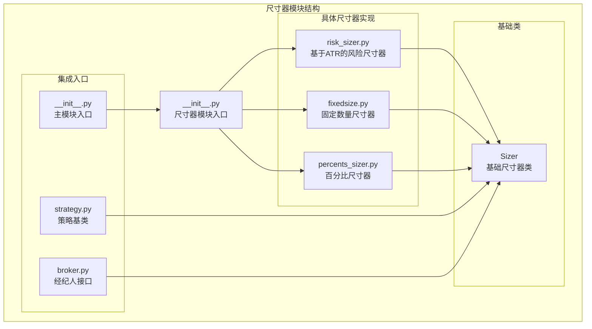
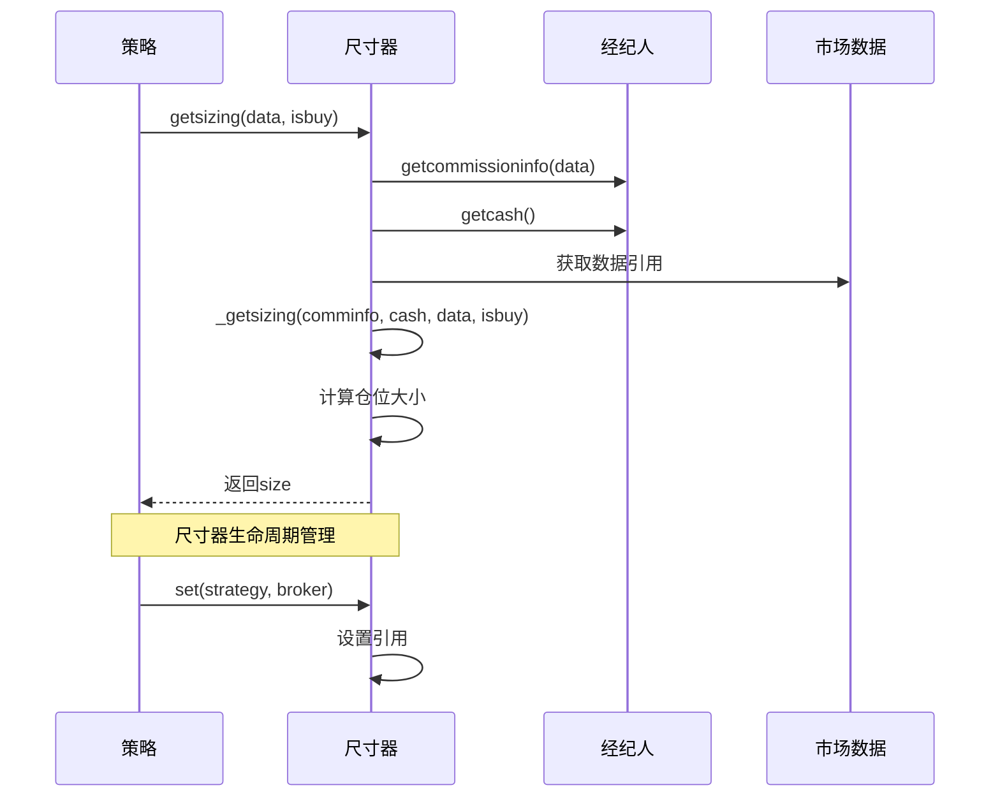
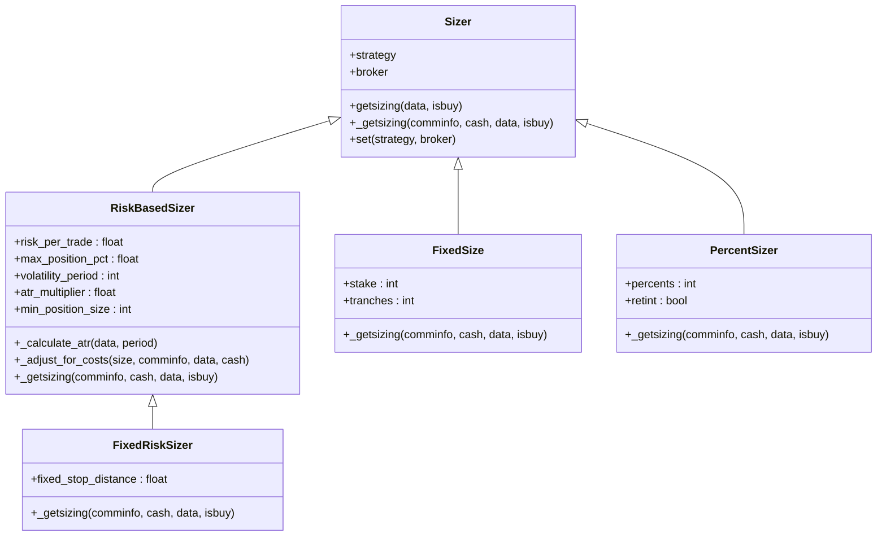
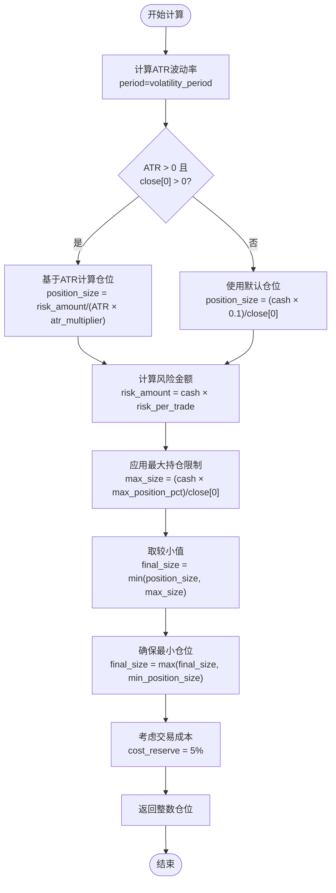
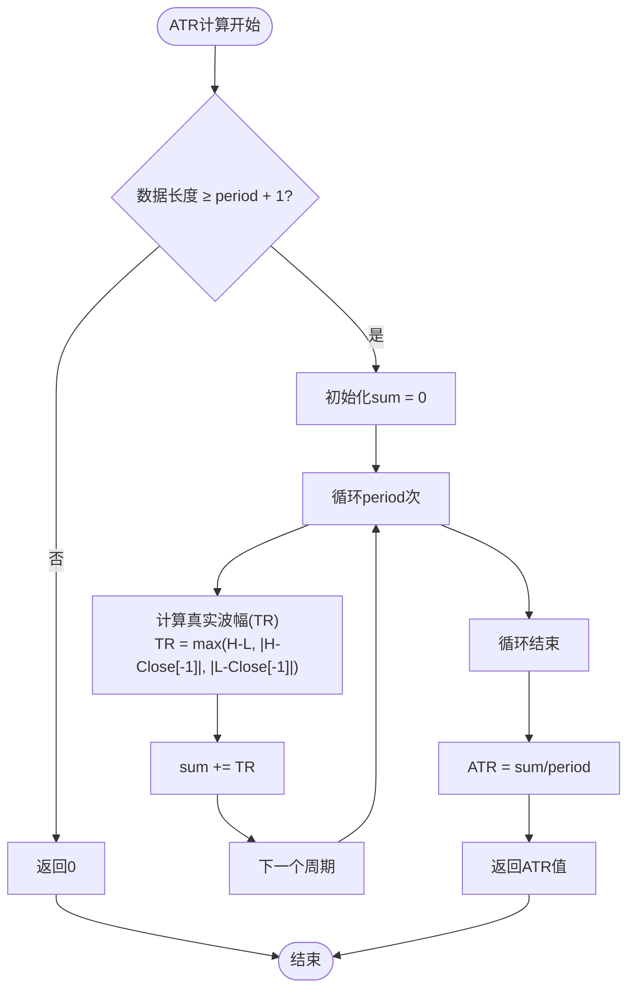
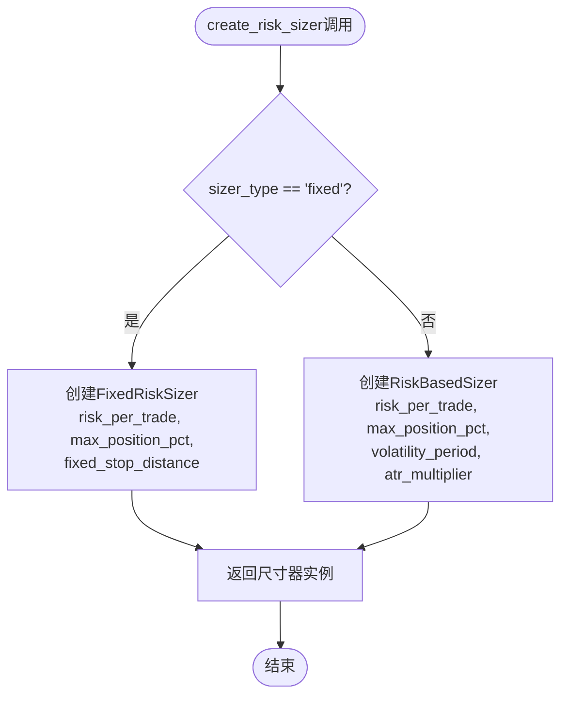
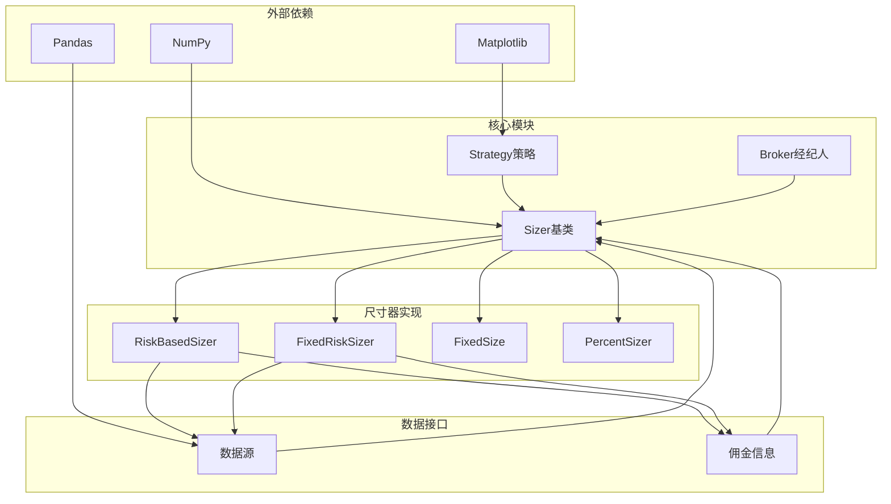

# 风险尺寸器

<cite>
**本文档引用的文件**
- [backtrader/sizers/__init__.py](file://backtrader/sizers/__init__.py)
- [backtrader/sizers/risk_sizer.py](file://backtrader/sizers/risk_sizer.py)
- [backtrader/sizers/fixedsize.py](file://backtrader/sizers/fixedsize.py)
- [backtrader/sizers/percents_sizer.py](file://backtrader/sizers/percents_sizer.py)
- [backtrader/sizer.py](file://backtrader/sizer.py)
- [backtrader/__init__.py](file://backtrader/__init__.py)
- [backtrader/strategy.py](file://backtrader/strategy.py)
- [backtrader/broker.py](file://backtrader/broker.py)
- [samples/sizertest/sizertest.py](file://samples/sizertest/sizertest.py)
- [README.rst](file://README.rst)
</cite>

## 目录
1. [简介](#简介)
2. [项目结构](#项目结构)
3. [核心组件](#核心组件)
4. [架构概览](#架构概览)
5. [详细组件分析](#详细组件分析)
6. [依赖关系分析](#依赖关系分析)
7. [性能考虑](#性能考虑)
8. [故障排除指南](#故障排除指南)
9. [结论](#结论)

## 简介

风险尺寸器（Risk Sizer）是BackTrader交易系统中的关键组件，负责根据预设的风险参数自动计算每笔交易的仓位大小。BackTrader提供了多种不同类型的尺寸器，包括基于ATR波动率的风险管理、固定百分比仓位管理和固定数量仓位管理等。

本文档深入分析了BackTrader中风险尺寸器的实现，重点介绍了基于ATR波动率的风险尺寸器算法、固定风险尺寸器以及便捷创建函数。通过详细的代码分析和架构图解，帮助开发者理解和使用这些风险管理工具。

## 项目结构

BackTrader的尺寸器模块位于`backtrader/sizers/`目录下，包含多个不同类型的尺寸器实现：



**图表来源**
- [backtrader/sizers/__init__.py](file://backtrader/sizers/__init__.py#L27-L29)
- [backtrader/sizers/risk_sizer.py](file://backtrader/sizers/risk_sizer.py#L13-L26)
- [backtrader/sizer.py](file://backtrader/sizer.py#L29-L48)

**章节来源**
- [backtrader/sizers/__init__.py](file://backtrader/sizers/__init__.py#L24-L29)
- [backtrader/sizers/risk_sizer.py](file://backtrader/sizers/risk_sizer.py#L1-L220)
- [backtrader/sizers/fixedsize.py](file://backtrader/sizers/fixedsize.py#L1-L109)
- [backtrader/sizers/percents_sizer.py](file://backtrader/sizers/percents_sizer.py#L1-L91)

## 核心组件

BackTrader的尺寸器系统由以下核心组件构成：

### 基础尺寸器类
所有尺寸器都继承自`Sizer`基类，该类定义了统一的接口和生命周期管理：

- `_getsizing()`方法：子类必须实现的核心方法
- `getsizing()`方法：对外提供的公共接口
- `set()`方法：设置策略和经纪人引用

### 风险尺寸器家族
- `RiskBasedSizer`：基于ATR波动率的动态风险管理系统
- `FixedRiskSizer`：使用固定止损距离的简化版本
- `create_risk_sizer()`：便捷工厂函数

### 其他尺寸器类型
- `FixedSize`：固定数量的简单尺寸器
- `PercentSizer`：基于可用资金百分比的尺寸器
- `AllInSizer`：全仓投入的极端情况尺寸器

**章节来源**
- [backtrader/sizer.py](file://backtrader/sizer.py#L29-L82)
- [backtrader/sizers/risk_sizer.py](file://backtrader/sizers/risk_sizer.py#L13-L220)
- [backtrader/sizers/fixedsize.py](file://backtrader/sizers/fixedsize.py#L27-L109)
- [backtrader/sizers/percents_sizer.py](file://backtrader/sizers/percents_sizer.py#L29-L91)

## 架构概览

BackTrader的尺寸器架构采用分层设计，确保了灵活性和可扩展性：



**图表来源**
- [backtrader/sizer.py](file://backtrader/sizer.py#L50-L52)
- [backtrader/strategy.py](file://backtrader/strategy.py#L81-L102)

### 类层次结构



**图表来源**
- [backtrader/sizer.py](file://backtrader/sizer.py#L29-L82)
- [backtrader/sizers/risk_sizer.py](file://backtrader/sizers/risk_sizer.py#L13-L26)
- [backtrader/sizers/fixedsize.py](file://backtrader/sizers/fixedsize.py#L27-L47)
- [backtrader/sizers/percents_sizer.py](file://backtrader/sizers/percents_sizer.py#L29-L54)

**章节来源**
- [backtrader/sizer.py](file://backtrader/sizer.py#L29-L82)
- [backtrader/sizers/risk_sizer.py](file://backtrader/sizers/risk_sizer.py#L13-L220)
- [backtrader/sizers/fixedsize.py](file://backtrader/sizers/fixedsize.py#L27-L109)
- [backtrader/sizers/percents_sizer.py](file://backtrader/sizers/percents_sizer.py#L29-L91)

## 详细组件分析

### 风险基于尺寸器（RiskBasedSizer）

`RiskBasedSizer`是最复杂的尺寸器实现，采用了动态风险管理系统：

#### 核心算法流程



**图表来源**
- [backtrader/sizers/risk_sizer.py](file://backtrader/sizers/risk_sizer.py#L28-L88)

#### 参数配置详解

| 参数名 | 默认值 | 含义 | 影响范围 |
|--------|--------|------|----------|
| `risk_per_trade` | 0.02 | 每笔交易风险比例 | 风险预算分配 |
| `max_position_pct` | 0.3 | 最大持仓比例 | 风险集中度控制 |
| `volatility_period` | 20 | ATR计算周期 | 波动率稳定性 |
| `atr_multiplier` | 2.0 | ATR止损倍数 | 止损距离设定 |
| `min_position_size` | 1 | 最小仓位大小 | 流动性考虑 |

#### ATR计算实现

ATR（平均真实波幅）是衡量市场波动性的关键指标：



**图表来源**
- [backtrader/sizers/risk_sizer.py](file://backtrader/sizers/risk_sizer.py#L90-L120)

**章节来源**
- [backtrader/sizers/risk_sizer.py](file://backtrader/sizers/risk_sizer.py#L13-L220)

### 固定风险尺寸器（FixedRiskSizer）

`FixedRiskSizer`是`RiskBasedSizer`的简化版本，使用固定的止损距离：

#### 计算逻辑

固定风险尺寸器的核心公式：
```
position_size = risk_amount / stop_distance
stop_distance = close[0] × fixed_stop_distance
```

这种设计简化了波动率计算，适用于趋势跟踪策略或对波动率不敏感的交易场景。

**章节来源**
- [backtrader/sizers/risk_sizer.py](file://backtrader/sizers/risk_sizer.py#L144-L183)

### 便捷创建函数

`create_risk_sizer()`提供了一键创建风险尺寸器的功能：



**图表来源**
- [backtrader/sizers/risk_sizer.py](file://backtrader/sizers/risk_sizer.py#L186-L219)

**章节来源**
- [backtrader/sizers/risk_sizer.py](file://backtrader/sizers/risk_sizer.py#L186-L219)

### 其他尺寸器对比

#### 固定数量尺寸器（FixedSize）
- 简单直接，适合测试和演示
- 不考虑市场条件和风险预算
- 适用于固定规模的投资组合

#### 百分比尺寸器（PercentSizer）
- 基于可用资金的百分比计算
- 更灵活但缺乏风险控制机制
- 适合稳健的资金管理策略

**章节来源**
- [backtrader/sizers/fixedsize.py](file://backtrader/sizers/fixedsize.py#L27-L109)
- [backtrader/sizers/percents_sizer.py](file://backtrader/sizers/percents_sizer.py#L29-L91)

## 依赖关系分析

BackTrader尺寸器系统的依赖关系体现了清晰的分层架构：



**图表来源**
- [backtrader/__init__.py](file://backtrader/__init__.py#L54-L81)
- [backtrader/strategy.py](file://backtrader/strategy.py#L81-L102)
- [backtrader/broker.py](file://backtrader/broker.py#L77-L83)

### 关键依赖链

1. **策略到尺寸器**：策略通过`set()`方法注入尺寸器引用
2. **尺寸器到经纪人**：尺寸器通过`getcommissioninfo()`获取佣金信息
3. **尺寸器到数据源**：尺寸器直接访问数据的OHLC价格
4. **尺寸器到市场**：尺寸器计算订单规模但不直接执行交易

**章节来源**
- [backtrader/strategy.py](file://backtrader/strategy.py#L81-L102)
- [backtrader/broker.py](file://backtrader/broker.py#L77-L83)
- [backtrader/sizer.py](file://backtrader/sizer.py#L50-L52)

## 性能考虑

### 计算复杂度分析

风险尺寸器的计算复杂度主要取决于ATR计算：

- **ATR计算**：O(n)时间复杂度，其中n为波动率周期长度
- **整体尺寸器**：O(n)时间复杂度，主要受ATR计算影响
- **内存使用**：O(1)额外空间，仅存储临时变量

### 优化建议

1. **缓存机制**：可以考虑缓存ATR计算结果避免重复计算
2. **批量处理**：在多数据源环境下优化数据访问模式
3. **参数预计算**：对常用参数进行预计算和缓存

### 内存管理

- 尺寸器实例通常在策略初始化时创建
- 避免在每次计算时创建大量临时对象
- 合理使用Python的垃圾回收机制

## 故障排除指南

### 常见问题及解决方案

#### ATR计算异常
**问题**：ATR返回0或异常值
**原因**：数据长度不足或价格数据异常
**解决**：检查数据质量和周期参数设置

#### 仓位计算错误
**问题**：返回负数或异常大的仓位
**原因**：参数配置不当或数据异常
**解决**：验证参数范围和数据质量

#### 成本调整问题
**问题**：实际交易量与预期不符
**原因**：佣金和滑点估算不准确
**解决**：调整成本预留比例参数

### 调试技巧

1. **启用调试模式**：设置`_debug=True`查看详细计算过程
2. **参数验证**：检查所有输入参数的有效性
3. **边界条件**：测试极端情况下的行为

**章节来源**
- [backtrader/sizers/risk_sizer.py](file://backtrader/sizers/risk_sizer.py#L44-L88)
- [backtrader/sizers/risk_sizer.py](file://backtrader/sizers/risk_sizer.py#L180-L183)

## 结论

BackTrader的风险尺寸器系统展现了优秀的工程设计，通过以下特点实现了高效的风险管理：

### 设计优势

1. **模块化架构**：清晰的类层次结构便于扩展和维护
2. **算法稳健性**：基于ATR的动态风险控制机制
3. **灵活性**：支持多种尺寸器类型满足不同需求
4. **易用性**：提供便捷的工厂函数简化使用

### 实践建议

1. **参数调优**：根据具体交易品种和市场环境调整参数
2. **监控机制**：建立仓位变化的监控和报警机制
3. **回测验证**：在实盘前充分进行历史数据回测
4. **风险隔离**：合理设置最大持仓比例防止过度集中

### 发展方向

随着量化交易的发展，风险尺寸器系统可以进一步：
- 集成机器学习算法进行自适应参数调整
- 支持更复杂的多资产组合风险管理
- 提供实时风险监控和预警功能

通过深入理解BackTrader风险尺寸器的设计理念和实现细节，开发者可以构建更加稳健和高效的量化交易系统。