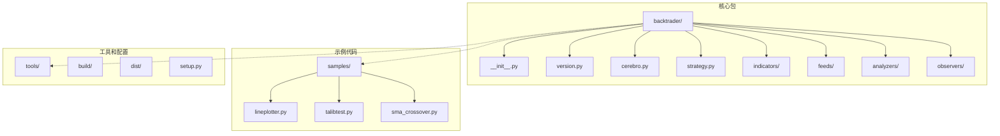
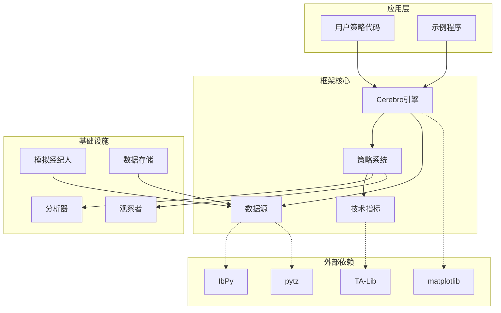
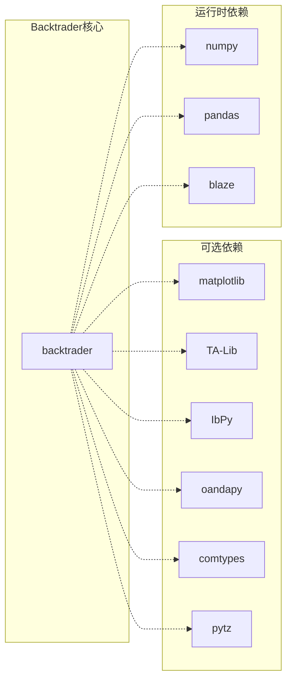

# 安装配置指南

<cite>
**本文档引用的文件**
- [setup.py](file://setup.py)
- [README.rst](file://README.rst)
- [backtrader/version.py](file://backtrader/version.py)
- [backtrader/__init__.py](file://backtrader/__init__.py)
- [backtrader.egg-info/PKG-INFO](file://backtrader.egg-info/PKG-INFO)
- [backtrader.egg-info/requires.txt](file://backtrader.egg-info/requires.txt)
- [.travis.yml](file://.travis.yml)
- [samples/lineplotter/lineplotter.py](file://samples/lineplotter/lineplotter.py)
- [samples/talib/talibtest.py](file://samples/talib/talibtest.py)
- [backtrader/strategies/sma_crossover.py](file://backtrader/strategies/sma_crossover.py)
</cite>

## 目录
1. [简介](#简介)
2. [项目结构](#项目结构)
3. [核心组件](#核心组件)
4. [架构概览](#架构概览)
5. [详细组件分析](#详细组件分析)
6. [依赖关系分析](#依赖关系分析)
7. [性能考虑](#性能考虑)
8. [故障排除指南](#故障排除指南)
9. [结论](#结论)
10. [附录](#附录)

## 简介

Backtrader是一个用Python编写的量化交易框架，提供了完整的回测引擎和实时交易功能。该框架支持多种数据源、技术指标、分析器和绘图功能，是量化交易开发者的重要工具。

根据项目文档，Backtrader具有以下特点：
- 支持Python 3.2及以上版本
- 自包含设计（除绘图功能外无外部依赖）
- 支持多种数据源：CSV文件、在线数据、pandas数据等
- 集成多种技术指标和分析器
- 支持实时交易与回测

## 项目结构

Backtrader项目的整体结构如下：



**图表来源**
- [setup.py](file://setup.py#L104-L105)
- [backtrader/__init__.py](file://backtrader/__init__.py#L1-L91)

**章节来源**
- [setup.py](file://setup.py#L104-L105)
- [backtrader/__init__.py](file://backtrader/__init__.py#L1-L91)

## 核心组件

### 版本管理
Backtrader使用语义化版本控制，当前版本为1.9.78.123。版本信息在多个位置定义以确保一致性。

### 包结构
框架采用模块化设计，主要组件包括：
- **核心引擎**：Cerebro类负责运行回测和实盘交易
- **策略系统**：Strategy基类及其派生类
- **技术指标**：丰富的技术分析指标库
- **数据源**：多种数据格式和来源的支持
- **分析器**：性能评估和统计分析工具
- **观察者**：交易过程监控和记录

**章节来源**
- [backtrader/version.py](file://backtrader/version.py#L25-L27)
- [backtrader/__init__.py](file://backtrader/__init__.py#L24-L86)

## 架构概览

Backtrader的整体架构采用分层设计，各组件职责明确：



**图表来源**
- [backtrader/__init__.py](file://backtrader/__init__.py#L39-L86)
- [setup.py](file://setup.py#L118-L120)

## 详细组件分析

### 安装方式对比

#### PyPI安装方式
这是最推荐的安装方式，适用于大多数用户场景。

**优点：**
- 安装简单快捷
- 自动处理依赖关系
- 版本更新方便
- 跨平台兼容性好

**适用场景：**
- 新手用户快速开始
- 生产环境部署
- 团队协作开发

**安装命令：**
```bash
# 基础安装
pip install backtrader

# 包含绘图功能的完整安装
pip install backtrader[plotting]
```

#### 源码安装方式
适用于需要最新功能或进行二次开发的高级用户。

**优点：**
- 可以使用最新功能
- 可以进行定制化修改
- 便于学习框架内部实现

**适用场景：**
- 开发者贡献代码
- 需要特定功能定制
- 学习框架实现原理

**安装步骤：**
1. 克隆源码仓库
2. 进入项目根目录
3. 执行安装命令

**章节来源**
- [README.rst](file://README.rst#L126-L154)
- [setup.py](file://setup.py#L118-L120)

### Python环境准备

#### 版本要求
- Python >= 3.2
- 推荐使用Python 3.6-3.8
- 支持PyPy和PyPy3（无绘图功能）

#### 虚拟环境配置
建议使用虚拟环境隔离依赖：

```bash
# 使用venv创建虚拟环境
python -m venv backtrader_env

# 激活虚拟环境
# Windows:
backtrader_env\Scripts\activate
# macOS/Linux:
source backtrader_env/bin/activate

# 安装Backtrader
pip install backtrader
```

**章节来源**
- [README.rst](file://README.rst#L118-L125)
- [.travis.yml](file://.travis.yml#L3-L9)

### 可选功能安装

#### 绘图功能
Backtrader的绘图功能需要matplotlib支持：

```bash
# 安装绘图功能
pip install backtrader[plotting]

# 或者单独安装matplotlib
pip install matplotlib>=1.4.1
```

#### TA-Lib集成
用于高性能技术指标计算：

```bash
# 安装TA-Lib Python绑定
pip install TA-Lib

# 在策略中使用
import backtrader as bt
import backtrader.talib as btalib
```

#### 实时数据源
针对不同数据提供商的额外依赖：

```bash
# Interactive Brokers
pip install git+https://github.com/blampe/IbPy.git

# OANDA
pip install oandapy

# Visual Chart
pip install comtypes

# 通用依赖
pip install pytz
```

**章节来源**
- [README.rst](file://README.rst#L142-L153)
- [backtrader.egg-info/requires.txt](file://backtrader.egg-info/requires.txt#L3-L3)

### 开发环境配置

#### IDE设置建议
- **VS Code**: 安装Python扩展，配置Python解释器
- **PyCharm**: 创建Python项目，配置虚拟环境
- **Jupyter**: 适合数据分析和可视化

#### 调试工具
```python
# 启用详细日志
import logging
logging.basicConfig(level=logging.DEBUG)

# 使用断点调试
import pdb; pdb.set_trace()

# 性能分析
import cProfile
cProfile.run('your_backtrader_code()')
```

## 依赖关系分析

Backtrader的依赖关系相对简单，体现了其自包含的设计理念：



**图表来源**
- [setup.py](file://setup.py#L118-L120)
- [backtrader.egg-info/requires.txt](file://backtrader.egg-info/requires.txt#L3-L3)

**章节来源**
- [setup.py](file://setup.py#L118-L120)
- [backtrader.egg-info/PKG-INFO](file://backtrader.egg-info/PKG-INFO#L26-L27)

## 性能考虑

### 内存优化
- 使用数据过滤器减少内存占用
- 合理设置数据缓存大小
- 及时释放不需要的数据对象

### 计算效率
- 利用TA-Lib进行高性能计算
- 避免不必要的数据复制
- 使用向量化操作

### 并行处理
Backtrader支持多进程优化：
```python
# 设置并行参数
cerebro = bt.Cerebro()
cerebro.worker(nworkers=4, qsize=100)
```

## 故障排除指南

### 常见安装问题

#### 依赖冲突
**问题**：安装过程中出现依赖版本冲突
**解决方案**：
```bash
# 清理缓存重新安装
pip cache purge
pip install --upgrade --force-reinstall backtrader

# 使用隔离环境
python -m venv clean_env
source clean_env/bin/activate
pip install backtrader
```

#### 权限问题
**问题**：权限不足导致安装失败
**解决方案**：
```bash
# 使用用户目录安装
pip install --user backtrader

# 或使用sudo（不推荐）
sudo pip install backtrader
```

#### 绘图功能缺失
**问题**：导入matplotlib时报错
**解决方案**：
```bash
# 安装完整版本
pip install backtrader[plotting]

# 或单独安装matplotlib
pip install matplotlib>=1.4.1
```

#### 数据源连接问题
**问题**：无法连接到数据提供商
**解决方案**：
```python
# 检查网络连接
import urllib.request
try:
    urllib.request.urlopen('https://finance.yahoo.com')
    print("网络连接正常")
except:
    print("网络连接异常")

# 更新数据源配置
# 检查API密钥和配置文件
```

### 验证安装

#### 基本功能测试
```python
# 导入测试
import backtrader as bt
print(f"Backtrader版本: {bt.__version__}")

# 简单策略测试
class TestStrategy(bt.Strategy):
    def __init__(self):
        self.sma = bt.indicators.SMA(period=10)
    
    def next(self):
        pass

# 创建Cerebro实例
cerebro = bt.Cerebro()
print("Backtrader安装成功!")
```

#### 功能完整性检查
```python
# 检查核心功能
required_modules = ['cerebro', 'strategy', 'indicators', 'feeds']
for module in required_modules:
    assert hasattr(bt, module), f"{module}模块缺失"

# 检查可选功能
optional_modules = ['plot', 'talib']
for module in optional_modules:
    if hasattr(bt, module):
        print(f"{module}功能可用")
    else:
        print(f"{module}功能不可用")
```

**章节来源**
- [samples/lineplotter/lineplotter.py](file://samples/lineplotter/lineplotter.py#L27-L27)
- [samples/talib/talibtest.py](file://samples/talib/talibtest.py#L27-L27)

## 结论

Backtrader提供了灵活且强大的量化交易框架。通过本文档的安装配置指南，用户可以根据自己的需求选择合适的安装方式，并正确配置开发环境。

**关键要点总结：**
- PyPI安装是最推荐的方式，简单可靠
- 源码安装适合需要定制化的高级用户
- 虚拟环境是最佳实践，避免依赖冲突
- 可选功能按需安装，保持环境简洁
- 完善的测试验证确保安装成功

## 附录

### 不同操作系统的特殊注意事项

#### Windows系统
- 建议使用PowerShell而非cmd
- 注意路径分隔符使用正斜杠
- matplotlib可能需要额外的图形后端配置

#### macOS系统
- 使用Homebrew管理Python版本
- 注意Xcode命令行工具的安装
- matplotlib可能需要额外的字体配置

#### Linux系统
- Ubuntu/Debian: `sudo apt-get install python3-dev python3-pip`
- CentOS/RHEL: `sudo yum install python3-devel python3-pip`
- 注意系统级依赖的安装

### 最佳实践建议

1. **版本管理**：始终使用虚拟环境
2. **依赖管理**：定期更新依赖包
3. **备份策略**：重要项目定期备份
4. **文档阅读**：仔细阅读官方文档
5. **社区参与**：积极参加社区讨论