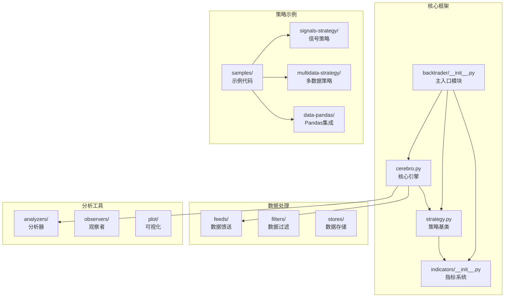
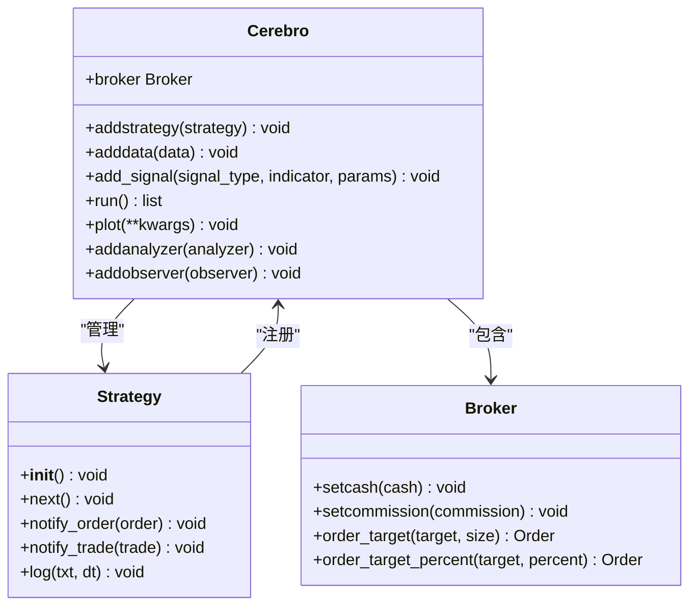
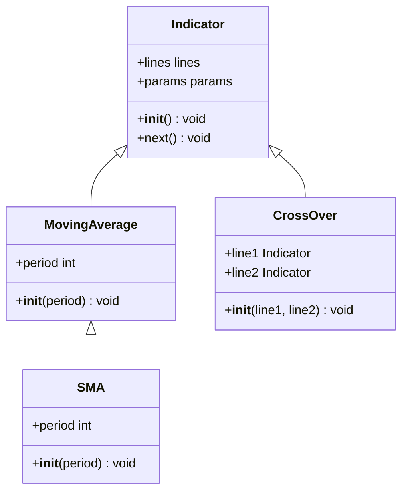
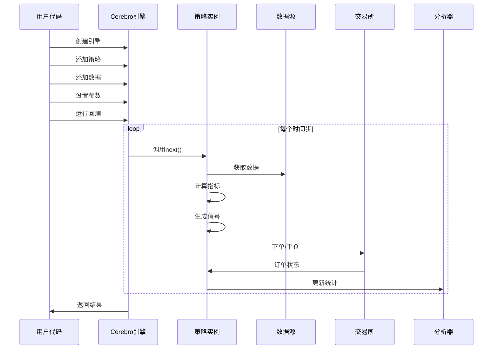
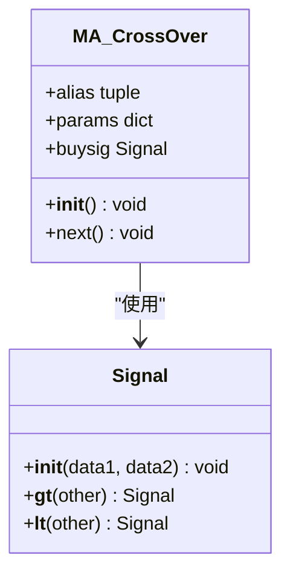
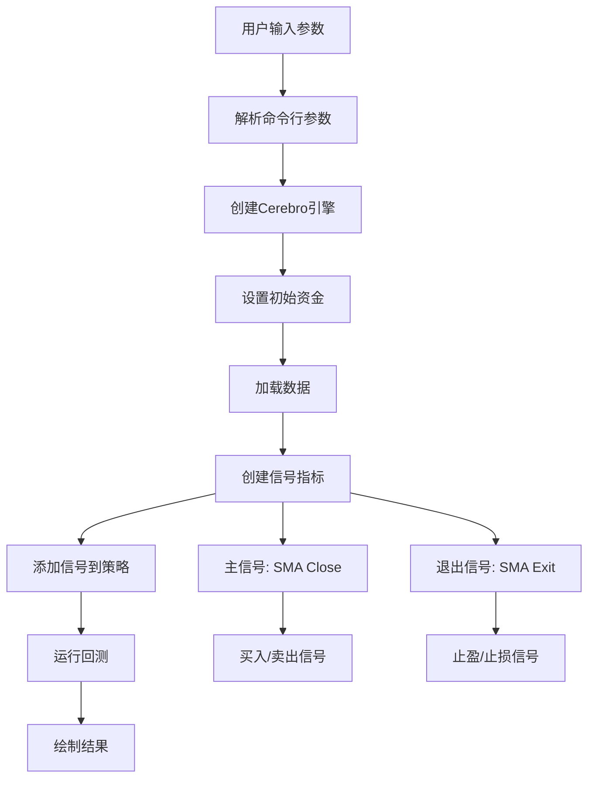
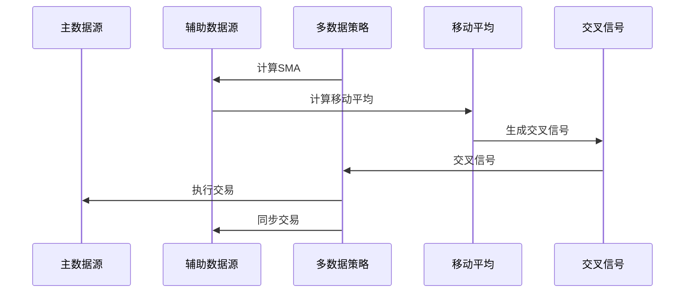
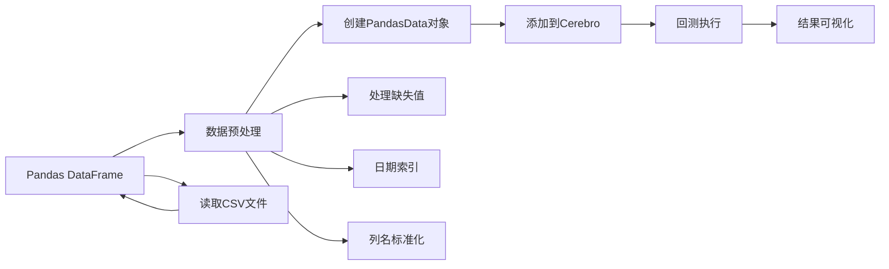
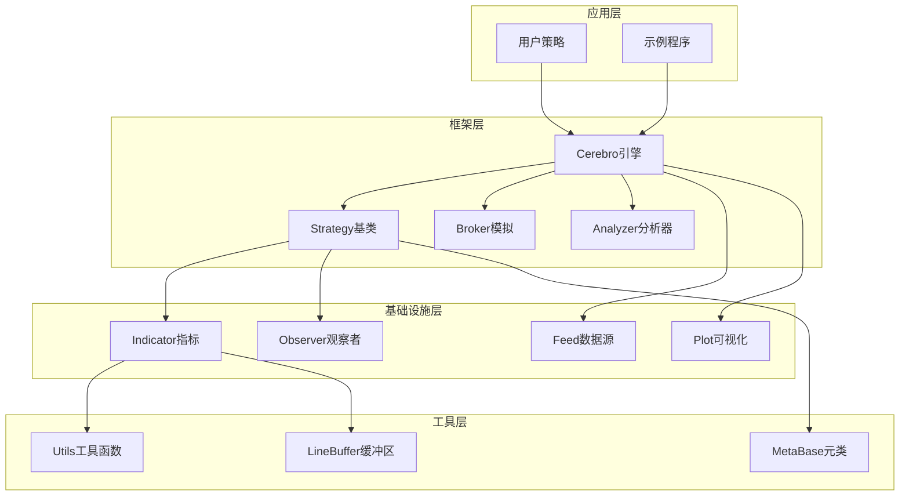

# 快速开始示例

<cite>
**本文档引用的文件**
- [backtrader/__init__.py](file://backtrader/__init__.py)
- [backtrader/strategies/sma_crossover.py](file://backtrader/strategies/sma_crossover.py)
- [backtrader/strategy.py](file://backtrader/strategy.py)
- [backtrader/cerebro.py](file://backtrader/cerebro.py)
- [backtrader/indicators/__init__.py](file://backtrader/indicators/__init__.py)
- [samples/signals-strategy/signals-strategy.py](file://samples/signals-strategy/signals-strategy.py)
- [samples/multidata-strategy/multidata-strategy.py](file://samples/multidata-strategy/multidata-strategy.py)
- [samples/data-pandas/data-pandas.py](file://samples/data-pandas/data-pandas.py)
- [datas/2006-day-001.txt](file://datas/2006-day-001.txt)
- [datas/orcl-1995-2014.txt](file://datas/orcl-1995-2014.txt)
- [README.rst](file://README.rst)
</cite>

## 目录
1. [简介](#简介)
2. [项目结构](#项目结构)
3. [核心组件](#核心组件)
4. [架构概览](#架构概览)
5. [详细组件分析](#详细组件分析)
6. [依赖关系分析](#依赖关系分析)
7. [性能考虑](#性能考虑)
8. [故障排除指南](#故障排除指南)
9. [结论](#结论)
10. [附录](#附录)

## 简介

Backtrader是一个功能强大的Python量化交易框架，专为回测和实盘交易而设计。它提供了完整的生态系统，包括数据馈送、策略开发、指标计算、订单执行、分析器和可视化工具。

本快速开始示例旨在帮助初学者快速上手Backtrader，通过三个不同复杂度的示例展示从数据加载到策略执行再到结果可视化的完整流程。

## 项目结构

Backtrader采用模块化架构设计，主要包含以下核心模块：



**图表来源**
- [backtrader/__init__.py](file://backtrader/__init__.py#L1-L91)
- [backtrader/cerebro.py](file://backtrader/cerebro.py#L60-L200)
- [backtrader/strategy.py](file://backtrader/strategy.py#L107-L200)

**章节来源**
- [backtrader/__init__.py](file://backtrader/__init__.py#L1-L91)
- [README.rst](file://README.rst#L1-L171)

## 核心组件

### Cerebro核心引擎

Cerebro是Backtrader的核心引擎，负责协调整个回测过程：



**图表来源**
- [backtrader/cerebro.py](file://backtrader/cerebro.py#L60-L200)
- [backtrader/strategy.py](file://backtrader/strategy.py#L107-L200)

### 指标系统

Backtrader提供了丰富的技术指标库，支持多种移动平均线、动量指标和振荡器：



**图表来源**
- [backtrader/indicators/__init__.py](file://backtrader/indicators/__init__.py#L1-L91)

**章节来源**
- [backtrader/cerebro.py](file://backtrader/cerebro.py#L60-L200)
- [backtrader/strategy.py](file://backtrader/strategy.py#L107-L200)
- [backtrader/indicators/__init__.py](file://backtrader/indicators/__init__.py#L1-L91)

## 架构概览

Backtrader采用事件驱动的架构模式，通过Cerebro引擎协调各个组件：



**图表来源**
- [backtrader/cerebro.py](file://backtrader/cerebro.py#L60-L200)
- [backtrader/strategy.py](file://backtrader/strategy.py#L107-L200)

## 详细组件分析

### 示例1：简单移动平均交叉策略

这是最基础的策略示例，展示了如何实现经典的移动平均交叉策略：

#### 策略类定义



**图表来源**
- [backtrader/strategies/sma_crossover.py](file://backtrader/strategies/sma_crossover.py#L29-L75)

#### 关键实现要点

1. **策略参数配置**：
   - 快速移动平均周期（默认10）
   - 慢速移动平均周期（默认30）
   - 移动平均类型（SMA）

2. **信号生成逻辑**：
   - 当快线上穿慢线时产生买入信号
   - 当快线下穿慢线时产生卖出信号

3. **订单执行**：
   - 使用市价单执行
   - 长期策略，不支持做空

**章节来源**
- [backtrader/strategies/sma_crossover.py](file://backtrader/strategies/sma_crossover.py#L1-L75)

### 示例2：基于信号的策略

这个示例展示了如何使用Backtrader的信号系统：

#### 信号策略架构



**图表来源**
- [samples/signals-strategy/signals-strategy.py](file://samples/signals-strategy/signals-strategy.py#L61-L97)

#### 信号类型说明

1. **主信号类型**：
   - `longshort`: 多空双向信号
   - `longonly`: 仅多头信号
   - `shortonly`: 仅空头信号

2. **退出信号类型**：
   - `longexit`: 多头退出信号
   - `shortexit`: 空头退出信号

**章节来源**
- [samples/signals-strategy/signals-strategy.py](file://samples/signals-strategy/signals-strategy.py#L1-L152)

### 示例3：多数据源策略

这个示例展示了如何同时使用多个数据源进行交易决策：

#### 多数据策略流程



**图表来源**
- [samples/multidata-strategy/multidata-strategy.py](file://samples/multidata-strategy/multidata-strategy.py#L75-L115)

#### 多数据策略特点

1. **数据同步**：两个数据源必须保持时间同步
2. **信号生成**：在辅助数据源上生成信号
3. **交易执行**：在主数据源上执行交易
4. **风险管理**：支持订单状态跟踪和通知

**章节来源**
- [samples/multidata-strategy/multidata-strategy.py](file://samples/multidata-strategy/multidata-strategy.py#L1-L217)

### 示例4：Pandas数据集成

这个示例展示了如何使用Pandas DataFrame作为数据源：

#### Pandas数据处理流程



**图表来源**
- [samples/data-pandas/data-pandas.py](file://samples/data-pandas/data-pandas.py#L32-L75)

**章节来源**
- [samples/data-pandas/data-pandas.py](file://samples/data-pandas/data-pandas.py#L1-L93)

## 依赖关系分析

Backtrader的模块间依赖关系体现了清晰的分层架构：



**图表来源**
- [backtrader/__init__.py](file://backtrader/__init__.py#L1-L91)
- [backtrader/cerebro.py](file://backtrader/cerebro.py#L60-L200)

**章节来源**
- [backtrader/__init__.py](file://backtrader/__init__.py#L1-L91)

## 性能考虑

### 内存管理

Backtrader提供了多种内存优化策略：

1. **精确条目模式** (`exactbars=True`)：
   - 只保留必要的历史数据
   - 自动计算最小周期缓冲区

2. **分层内存保存** (`savemem=-1`)：
   - 保持策略级别的指标数据
   - 允许绘图功能

3. **全局内存保存** (`savemem=1`)：
   - 所有数据对象都启用内存保存

### 计算优化

1. **向量化计算**：在可能的情况下使用向量化操作
2. **缓存机制**：重用相似的指标对象
3. **延迟计算**：只在需要时计算指标值

## 故障排除指南

### 常见问题及解决方案

#### 1. 数据格式问题

**问题**：数据无法正确加载
**解决方案**：
- 确保CSV文件包含正确的列标题
- 检查日期格式是否符合要求
- 验证数值格式是否正确

#### 2. 策略执行问题

**问题**：策略没有产生任何交易信号
**解决方案**：
- 检查移动平均周期设置是否合理
- 验证数据时间范围是否足够长
- 确认信号阈值设置是否适当

#### 3. 内存不足问题

**问题**：长时间运行导致内存占用过高
**解决方案**：
- 启用内存保存模式
- 减少保留的历史数据条数
- 优化指标计算复杂度

**章节来源**
- [backtrader/cerebro.py](file://backtrader/cerebro.py#L121-L177)

## 结论

Backtrader为量化交易提供了一个功能完整、易于使用的平台。通过本文档的四个示例，您可以看到从简单的移动平均交叉策略到复杂的多数据源策略的完整开发流程。

关键学习要点：
1. 理解Cerebro引擎的工作原理
2. 掌握策略类的基本结构
3. 学会使用各种技术指标
4. 熟悉数据加载和处理方法
5. 了解结果可视化和分析工具

建议的后续学习路径：
1. 深入研究指标系统的扩展机制
2. 探索自定义分析器的开发
3. 学习高级订单管理和风险管理
4. 研究实时数据流和实盘交易

## 附录

### 快速开始步骤

1. **安装Backtrader**：
   ```bash
   pip install backtrader
   ```

2. **运行第一个示例**：
   ```bash
   python samples/signals-strategy/signals-strategy.py
   ```

3. **查看结果**：
   - 回测结果显示在控制台
   - 图形化结果通过matplotlib显示

### 参数配置参考

| 参数 | 类型 | 默认值 | 描述 |
|------|------|--------|------|
| `cash` | float | 50000 | 初始资金 |
| `smaperiod` | int | 30 | 移动平均周期 |
| `exitperiod` | int | 5 | 退出信号周期 |
| `period` | int | 15 | SMA周期 |
| `stake` | int | 10 | 每次交易份额 |

### 扩展建议

1. **自定义指标**：基于现有指标开发新的技术指标
2. **多因子策略**：结合多个技术指标构建复合信号
3. **机器学习集成**：将机器学习模型融入交易策略
4. **风险管理**：添加止损、止盈和仓位管理机制