# 快速开始示例

<cite>
**本文档引用的文件**
- [backtrader/__init__.py](file://backtrader/__init__.py)
- [backtrader/strategies/sma_crossover.py](file://backtrader/strategies/sma_crossover.py)
- [backtrader/strategy.py](file://backtrader/strategy.py)
- [backtrader/cerebro.py](file://backtrader/cerebro.py)
- [backtrader/indicators/__init__.py](file://backtrader/indicators/__init__.py)
- [samples/signals-strategy/signals-strategy.py](file://samples/signals-strategy/signals-strategy.py)
- [samples/multidata-strategy/multidata-strategy.py](file://samples/multidata-strategy/multidata-strategy.py)
- [samples/data-pandas/data-pandas.py](file://samples/data-pandas/data-pandas.py)
- [datas/2006-day-001.txt](file://datas/2006-day-001.txt)
- [datas/orcl-1995-2014.txt](file://datas/orcl-1995-2014.txt)
- [README.rst](file://README.rst)
- [real_trade/examples/quickstart.py](file://real_trade/examples/quickstart.py)
- [real_trade/engine/runner.py](file://real_trade/engine/runner.py)
- [real_trade/strategies/trend/ma_cross.py](file://real_trade/strategies/trend/ma_cross.py)
- [real_trade/brokers/binancebroker.py](file://real_trade/brokers/binancebroker.py)
- [real_trade/feeds/binancedata.py](file://real_trade/feeds/binancedata.py)
- [real_trade/stores/binancestore.py](file://real_trade/stores/binancestore.py)
- [real_trade/strategies/base.py](file://real_trade/strategies/base.py)
- [real_trade/engine/__init__.py](file://real_trade/engine/__init__.py)
- [real_trade/brokers/__init__.py](file://real_trade/brokers/__init__.py)
- [real_trade/feeds/__init__.py](file://real_trade/feeds/__init__.py)
- [real_trade/stores/__init__.py](file://real_trade/stores/__init__.py)
- [real_trade/examples/live_trading.py](file://real_trade/examples/live_trading.py)
- [real_trade/examples/config_example.py](file://real_trade/examples/config_example.py)
</cite>

## 目录
1. [简介](#简介)
2. [项目结构](#项目结构)
3. [核心组件](#核心组件)
4. [架构概览](#架构概览)
5. [详细组件分析](#详细组件分析)
6. [依赖关系分析](#依赖关系分析)
7. [性能考虑](#性能考虑)
8. [故障排除指南](#故障排除指南)
9. [结论](#结论)
10. [附录](#附录)

## 简介

Backtrader是一个功能强大的Python量化交易框架，专为回测和实盘交易而设计。它提供了完整的生态系统，包括数据馈送、策略开发、指标计算、订单执行、分析器和可视化工具。

**更新** 本版本增加了对real_trade模块的支持，该模块提供了更高级的交易功能，包括统一的交易运行器、策略基类和风险管理组件。

本快速开始示例旨在帮助初学者快速上手Backtrader，通过四个不同复杂度的示例展示从数据加载到策略执行再到结果可视化的完整流程，包括传统的Backtrader示例和基于real_trade模块的新示例。

## 项目结构

Backtrader采用模块化架构设计，主要包含以下核心模块：

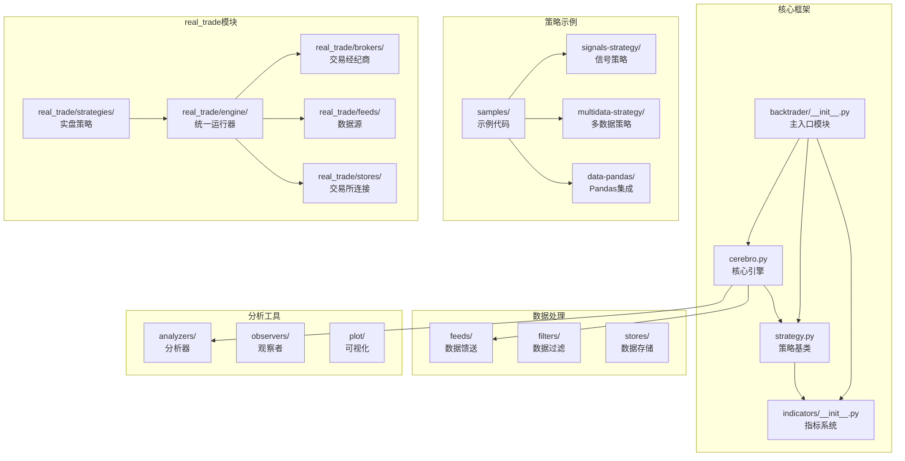

**图表来源**
- [backtrader/__init__.py](file://backtrader/__init__.py#L1-L91)
- [backtrader/cerebro.py](file://backtrader/cerebro.py#L60-L200)
- [backtrader/strategy.py](file://backtrader/strategy.py#L107-L200)
- [real_trade/engine/__init__.py](file://real_trade/engine/__init__.py#L1-L14)
- [real_trade/strategies/base.py](file://real_trade/strategies/base.py#L1-L159)

**章节来源**
- [backtrader/__init__.py](file://backtrader/__init__.py#L1-L91)
- [README.rst](file://README.rst#L1-L171)
- [real_trade/engine/__init__.py](file://real_trade/engine/__init__.py#L1-L14)

## 核心组件

### Cerebro核心引擎

Cerebro是Backtrader的核心引擎，负责协调整个回测过程：

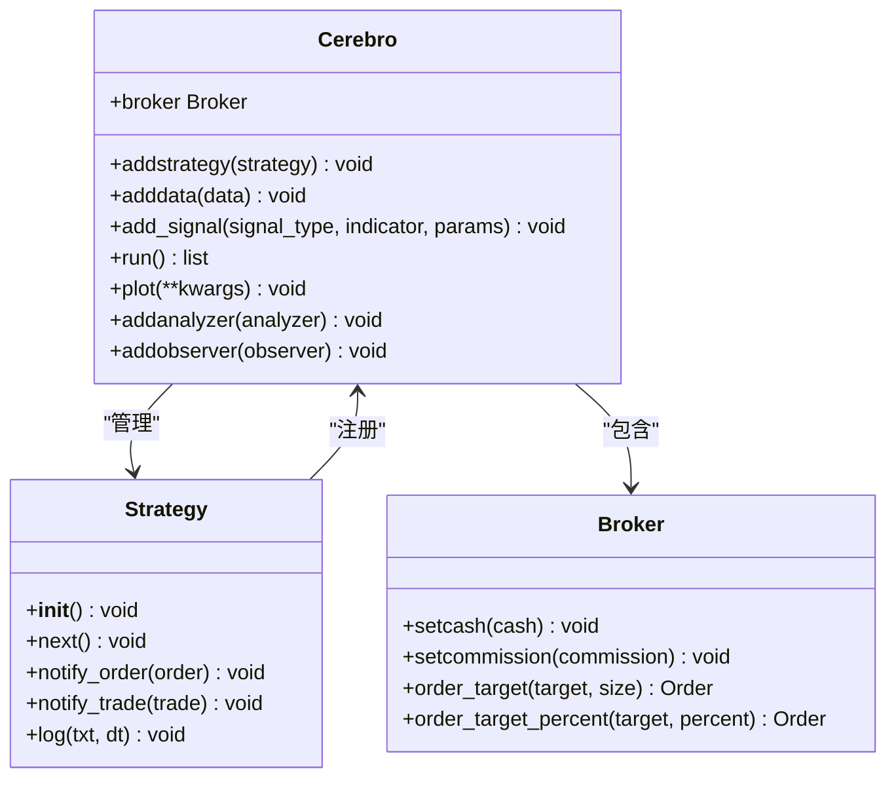

**图表来源**
- [backtrader/cerebro.py](file://backtrader/cerebro.py#L60-L200)
- [backtrader/strategy.py](file://backtrader/strategy.py#L107-L200)

### real_trade统一运行器

**新增** real_trade模块提供了更高级的交易功能，其中TradingRunner是核心组件：

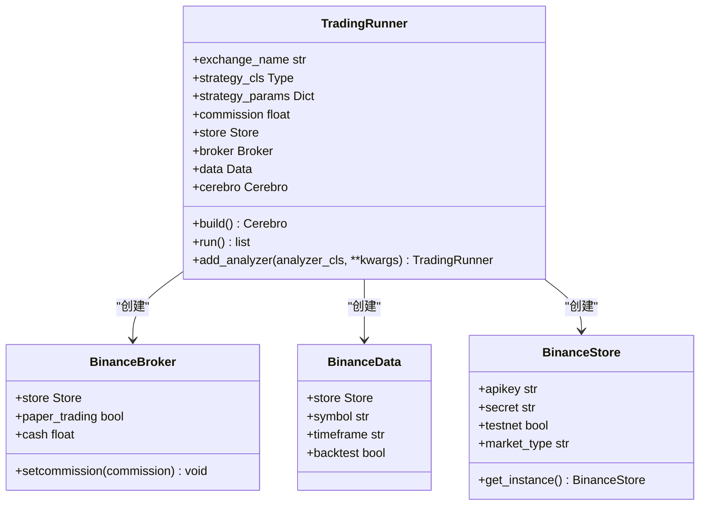

**图表来源**
- [real_trade/engine/runner.py](file://real_trade/engine/runner.py#L105-L183)
- [real_trade/brokers/binancebroker.py](file://real_trade/brokers/binancebroker.py#L14-L18)
- [real_trade/feeds/binancedata.py](file://real_trade/feeds/binancedata.py#L14-L18)
- [real_trade/stores/binancestore.py](file://real_trade/stores/binancestore.py#L17-L96)

### 指标系统

Backtrader提供了丰富的技术指标库，支持多种移动平均线、动量指标和振荡器：

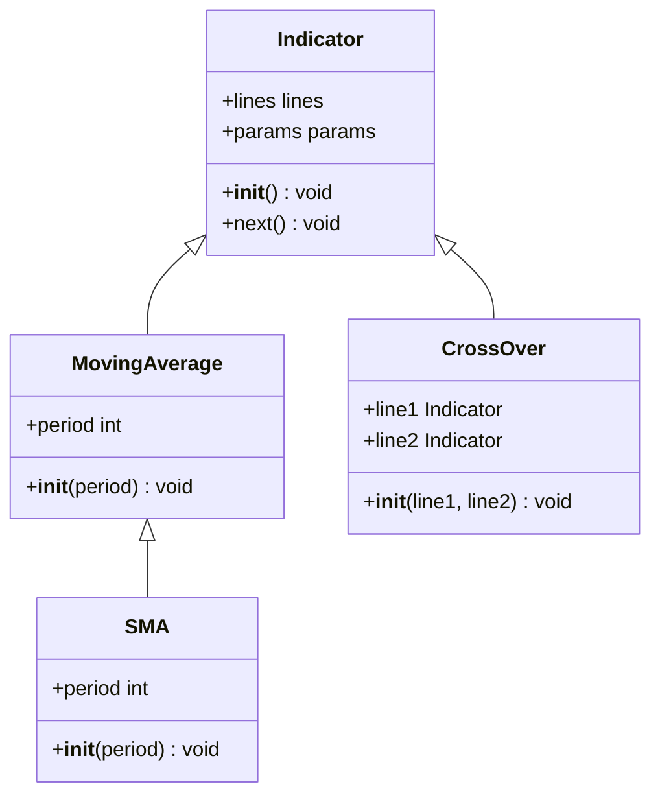

**图表来源**
- [backtrader/indicators/__init__.py](file://backtrader/indicators/__init__.py#L1-L91)

**章节来源**
- [backtrader/cerebro.py](file://backtrader/cerebro.py#L60-L200)
- [backtrader/strategy.py](file://backtrader/strategy.py#L107-L200)
- [backtrader/indicators/__init__.py](file://backtrader/indicators/__init__.py#L1-L91)
- [real_trade/engine/runner.py](file://real_trade/engine/runner.py#L105-L183)

## 架构概览

Backtrader采用事件驱动的架构模式，通过Cerebro引擎协调各个组件：

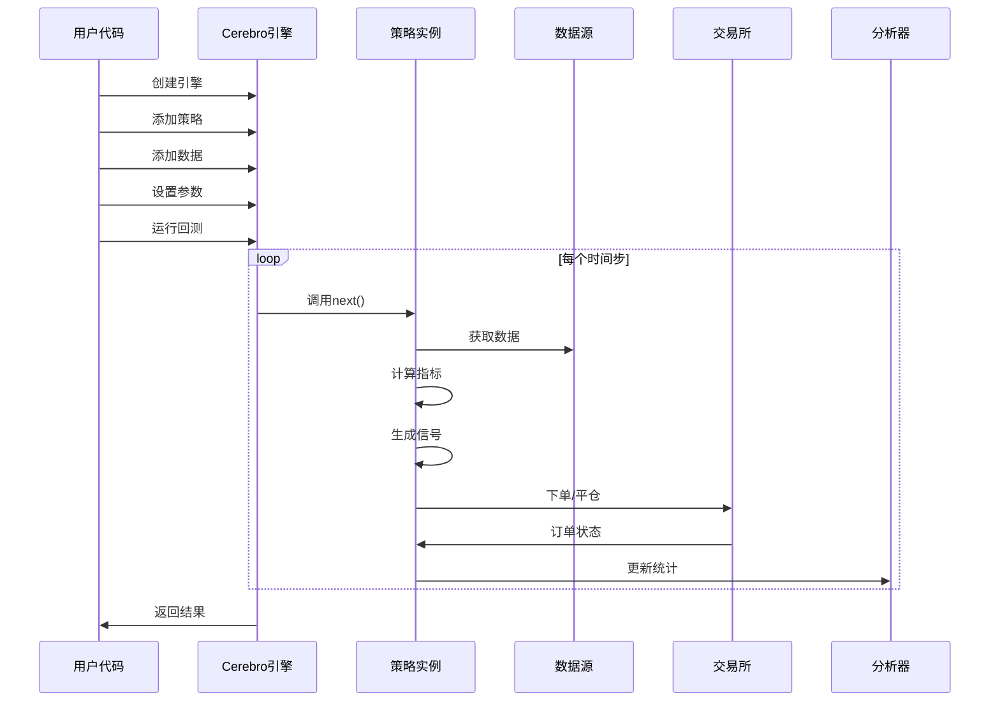

**图表来源**
- [backtrader/cerebro.py](file://backtrader/cerebro.py#L60-L200)
- [backtrader/strategy.py](file://backtrader/strategy.py#L107-L200)

**更新** real_trade模块提供了两种运行方式：

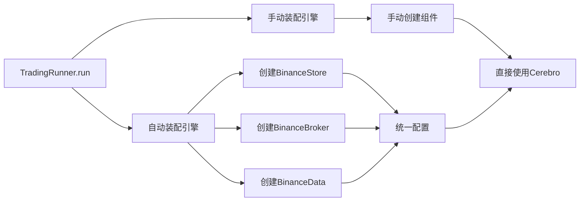

**图表来源**
- [real_trade/examples/quickstart.py](file://real_trade/examples/quickstart.py#L18-L34)
- [real_trade/examples/quickstart.py](file://real_trade/examples/quickstart.py#L36-L57)
- [real_trade/engine/runner.py](file://real_trade/engine/runner.py#L151-L178)

## 详细组件分析

### 示例1：简单移动平均交叉策略

这是最基础的策略示例，展示了如何实现经典的移动平均交叉策略：

#### 策略类定义

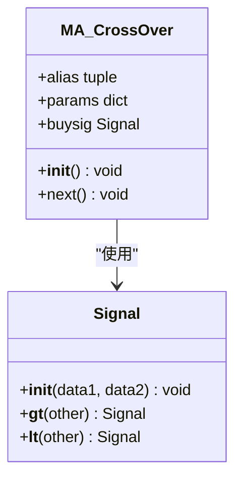

**图表来源**
- [backtrader/strategies/sma_crossover.py](file://backtrader/strategies/sma_crossover.py#L29-L75)

#### 关键实现要点

1. **策略参数配置**：
   - 快速移动平均周期（默认10）
   - 慢速移动平均周期（默认30）
   - 移动平均类型（SMA）

2. **信号生成逻辑**：
   - 当快线上穿慢线时产生买入信号
   - 当快线下穿慢线时产生卖出信号

3. **订单执行**：
   - 使用市价单执行
   - 长期策略，不支持做空

**章节来源**
- [backtrader/strategies/sma_crossover.py](file://backtrader/strategies/sma_crossover.py#L1-L75)

### 示例2：基于信号的策略

这个示例展示了如何使用Backtrader的信号系统：

#### 信号策略架构

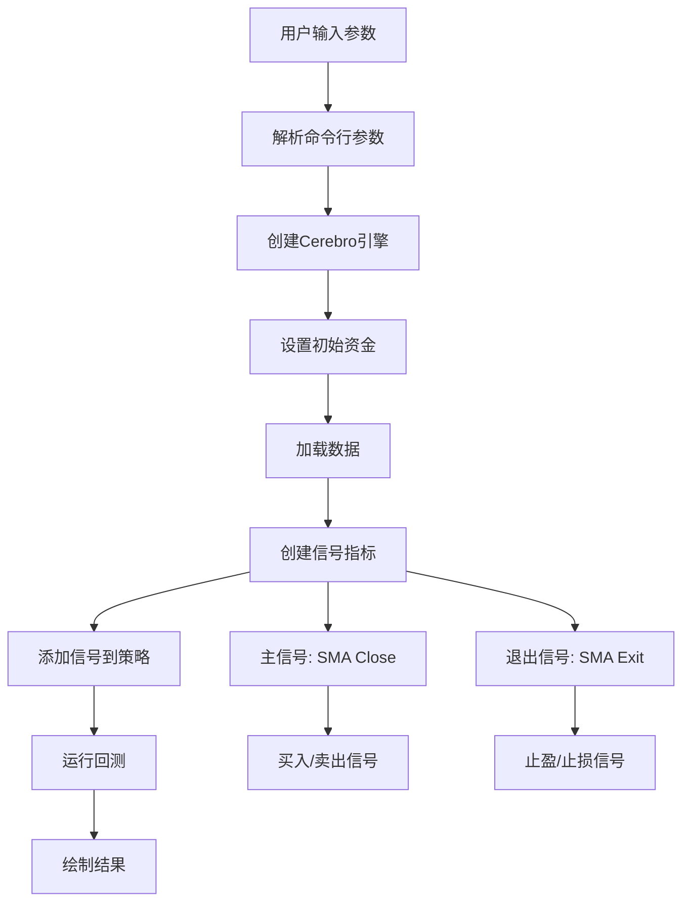

**图表来源**
- [samples/signals-strategy/signals-strategy.py](file://samples/signals-strategy/signals-strategy.py#L61-L97)

#### 信号类型说明

1. **主信号类型**：
   - `longshort`: 多空双向信号
   - `longonly`: 仅多头信号
   - `shortonly`: 仅空头信号

2. **退出信号类型**：
   - `longexit`: 多头退出信号
   - `shortexit`: 空头退出信号

**章节来源**
- [samples/signals-strategy/signals-strategy.py](file://samples/signals-strategy/signals-strategy.py#L1-L152)

### 示例3：多数据源策略

这个示例展示了如何同时使用多个数据源进行交易决策：

#### 多数据策略流程

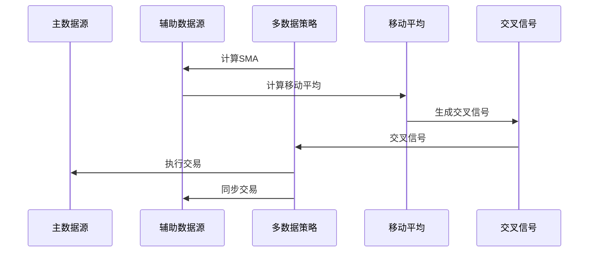

**图表来源**
- [samples/multidata-strategy/multidata-strategy.py](file://samples/multidata-strategy/multidata-strategy.py#L75-L115)

#### 多数据策略特点

1. **数据同步**：两个数据源必须保持时间同步
2. **信号生成**：在辅助数据源上生成信号
3. **交易执行**：在主数据源上执行交易
4. **风险管理**：支持订单状态跟踪和通知

**章节来源**
- [samples/multidata-strategy/multidata-strategy.py](file://samples/multidata-strategy/multidata-strategy.py#L1-L217)

### 示例4：Pandas数据集成

这个示例展示了如何使用Pandas DataFrame作为数据源：

#### Pandas数据处理流程

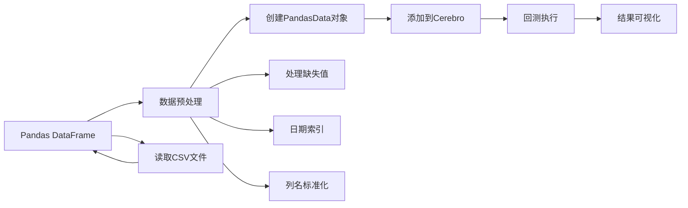

**图表来源**
- [samples/data-pandas/data-pandas.py](file://samples/data-pandas/data-pandas.py#L32-L75)

**章节来源**
- [samples/data-pandas/data-pandas.py](file://samples/data-pandas/data-pandas.py#L1-L93)

### 示例5：real_trade统一运行器快速开始

**新增** 这是最新的快速开始示例，展示了如何使用real_trade模块的统一运行器：

#### 快速开始流程

```mermaid
flowchart TD
A[导入real_trade.engine.TradingRunner] --> B[创建TradingRunner实例]
B --> C[配置交易参数]
C --> D[调用run()方法]
D --> E[自动装配引擎组件]
E --> F[执行策略回测]
F --> G[返回结果]
```

**图表来源**
- [real_trade/examples/quickstart.py](file://real_trade/examples/quickstart.py#L18-L34)

#### 关键特性

1. **简化配置**：
   - 一行代码启动完整交易引擎
   - 自动处理Binance交易所连接
   - 支持回测、纸面交易和实盘模式

2. **参数配置**：
   - `exchange`: 交易所名称（默认"binance"）
   - `symbol`: 交易对（默认"BTC/USDT"）
   - `timeframe`: 时间框架（默认"1h"）
   - `strategy_cls`: 策略类
   - `strategy_params`: 策略参数
   - `testnet`: 测试网模式
   - `paper_trading`: 纸面交易模式
   - `backtest`: 回测模式
   - `historical_limit`: 历史数据限制

3. **两种运行方式**：
   - **推荐方式**：使用`TradingRunner`自动装配
   - **手动方式**：分别创建`BinanceStore`、`BinanceBroker`、`BinanceData`

**章节来源**
- [real_trade/examples/quickstart.py](file://real_trade/examples/quickstart.py#L1-L61)
- [real_trade/engine/runner.py](file://real_trade/engine/runner.py#L105-L183)

### 示例6：基于real_trade策略基类的策略

**新增** 展示了如何使用real_trade的策略基类：

#### 策略基类架构

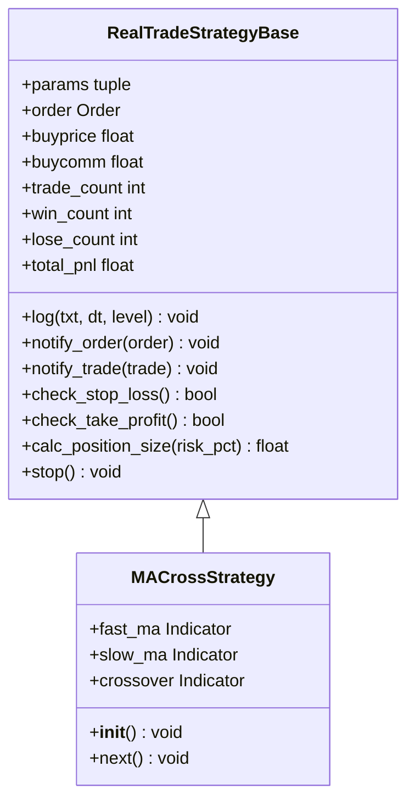

**图表来源**
- [real_trade/strategies/base.py](file://real_trade/strategies/base.py#L19-L159)
- [real_trade/strategies/trend/ma_cross.py](file://real_trade/strategies/trend/ma_cross.py#L15-L51)

#### 策略特点

1. **统一日志系统**：
   - 格式化的日志输出
   - 支持不同日志级别
   - 自动时间戳记录

2. **风险管理**：
   - 内置止损检查
   - 内置止盈检查
   - 动态仓位计算

3. **交易统计**：
   - 交易次数统计
   - 胜率计算
   - 总盈亏统计

**章节来源**
- [real_trade/strategies/base.py](file://real_trade/strategies/base.py#L1-L159)
- [real_trade/strategies/trend/ma_cross.py](file://real_trade/strategies/trend/ma_cross.py#L1-L51)

### 示例7：完整实盘交易示例

**新增** 展示了如何使用real_trade的完整功能栈：

#### 实盘交易流程

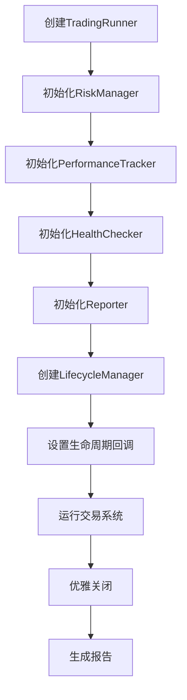

**图表来源**
- [real_trade/examples/live_trading.py](file://real_trade/examples/live_trading.py#L20-L55)

#### 完整功能

1. **风险管理**：
   - 最大仓位比例控制
   - 每笔交易风险控制
   - 最大回撤限制
   - 每日交易次数限制

2. **监控系统**：
   - 性能跟踪
   - 健康检查
   - 交易报告

3. **生命周期管理**：
   - 优雅启动
   - 错误处理
   - 重试机制
   - 资源清理

**章节来源**
- [real_trade/examples/live_trading.py](file://real_trade/examples/live_trading.py#L1-L59)

## 依赖关系分析

Backtrader的模块间依赖关系体现了清晰的分层架构：

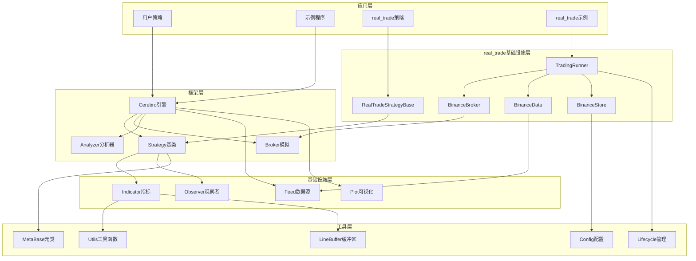

**图表来源**
- [backtrader/__init__.py](file://backtrader/__init__.py#L1-L91)
- [backtrader/cerebro.py](file://backtrader/cerebro.py#L60-L200)
- [real_trade/strategies/base.py](file://real_trade/strategies/base.py#L19-L159)
- [real_trade/engine/runner.py](file://real_trade/engine/runner.py#L105-L183)
- [real_trade/brokers/binancebroker.py](file://real_trade/brokers/binancebroker.py#L14-L18)
- [real_trade/feeds/binancedata.py](file://real_trade/feeds/binancedata.py#L14-L18)
- [real_trade/stores/binancestore.py](file://real_trade/stores/binancestore.py#L17-L96)

**章节来源**
- [backtrader/__init__.py](file://backtrader/__init__.py#L1-L91)
- [real_trade/engine/__init__.py](file://real_trade/engine/__init__.py#L1-L14)
- [real_trade/brokers/__init__.py](file://real_trade/brokers/__init__.py#L1-L17)
- [real_trade/feeds/__init__.py](file://real_trade/feeds/__init__.py#L1-L18)
- [real_trade/stores/__init__.py](file://real_trade/stores/__init__.py#L1-L17)

## 性能考虑

### 内存管理

Backtrader提供了多种内存优化策略：

1. **精确条目模式** (`exactbars=True`)：
   - 只保留必要的历史数据
   - 自动计算最小周期缓冲区

2. **分层内存保存** (`savemem=-1`)：
   - 保持策略级别的指标数据
   - 允许绘图功能

3. **全局内存保存** (`savemem=1`)：
   - 所有数据对象都启用内存保存

### real_trade性能优化

**新增** real_trade模块提供了额外的性能优化：

1. **组件复用**：
   - BinanceStore使用单例模式
   - 自动重用已创建的组件实例

2. **配置验证**：
   - 在创建阶段验证参数
   - 提前发现配置错误

3. **智能回测**：
   - 支持历史数据限制
   - 自动处理测试网模式

### 计算优化

1. **向量化计算**：在可能的情况下使用向量化操作
2. **缓存机制**：重用相似的指标对象
3. **延迟计算**：只在需要时计算指标值

## 故障排除指南

### 常见问题及解决方案

#### 1. 数据格式问题

**问题**：数据无法正确加载
**解决方案**：
- 确保CSV文件包含正确的列标题
- 检查日期格式是否符合要求
- 验证数值格式是否正确

#### 2. 策略执行问题

**问题**：策略没有产生任何交易信号
**解决方案**：
- 检查移动平均周期设置是否合理
- 验证数据时间范围是否足够长
- 确认信号阈值设置是否适当

#### 3. 内存不足问题

**问题**：长时间运行导致内存占用过高
**解决方案**：
- 启用内存保存模式
- 减少保留的历史数据条数
- 优化指标计算复杂度

#### 4. real_trade模块问题

**新增** real_trade特有的问题：

**问题**：ImportError: No module named 'real_trade'
**解决方案**：
- 确保real_trade模块在Python路径中
- 检查模块安装是否正确
- 验证相对路径配置

**问题**：CCXT版本不兼容
**解决方案**：
- 升级ccxt到支持enable_demo_trading的版本
- 检查Binance API密钥配置
- 验证测试网模式设置

**问题**：策略基类继承问题
**解决方案**：
- 确保策略继承RealTradeStrategyBase而非bt.Strategy
- 检查策略参数定义
- 验证next()方法实现

**章节来源**
- [backtrader/cerebro.py](file://backtrader/cerebro.py#L121-L177)
- [real_trade/engine/runner.py](file://real_trade/engine/runner.py#L50-L62)
- [real_trade/stores/binancestore.py](file://real_trade/stores/binancestore.py#L85-L92)

## 结论

Backtrader为量化交易提供了一个功能完整、易于使用的平台。通过本文档的七个示例，您可以看到从简单的移动平均交叉策略到复杂的多数据源策略，以及最新的real_trade模块功能的完整开发流程。

**更新** real_trade模块的引入为Backtrader带来了更高级的功能：
1. **统一运行器**：简化了交易引擎的创建和配置
2. **策略基类**：提供了统一的风险管理和日志系统
3. **完整功能栈**：集成了风险管理、监控和生命周期管理
4. **模块化设计**：清晰分离了交易所连接、数据源和交易执行

关键学习要点：
1. 理解Cerebro引擎的工作原理
2. 掌握策略类的基本结构
3. 学会使用各种技术指标
4. 熟悉数据加载和处理方法
5. 了解结果可视化和分析工具
6. **掌握real_trade模块的高级功能**
7. **理解统一运行器的使用方法**
8. **学会使用策略基类进行风险管理**

建议的后续学习路径：
1. 深入研究指标系统的扩展机制
2. 探索自定义分析器的开发
3. 学习高级订单管理和风险管理
4. 研究实时数据流和实盘交易
5. **探索real_trade模块的更多功能**
6. **学习配置管理和部署最佳实践**

## 附录

### 快速开始步骤

1. **安装Backtrader**：
   ```bash
   pip install backtrader
   ```

2. **运行传统示例**：
   ```bash
   python samples/signals-strategy/signals-strategy.py
   ```

3. **运行real_trade示例**：
   ```bash
   python real_trade/examples/quickstart.py
   ```

4. **查看结果**：
   - 回测结果显示在控制台
   - 图形化结果通过matplotlib显示
   - real_trade示例提供更详细的日志输出

### 参数配置参考

| 参数 | 类型 | 默认值 | 描述 |
|------|------|--------|------|
| `cash` | float | 50000 | 初始资金 |
| `smaperiod` | int | 30 | 移动平均周期 |
| `exitperiod` | int | 5 | 退出信号周期 |
| `period` | int | 15 | SMA周期 |
| `stake` | int | 10 | 每次交易份额 |
| **real_trade新增参数** |  |  |  |
| `exchange` | str | "binance" | 交易所名称 |
| `symbol` | str | "BTC/USDT" | 交易对 |
| `timeframe` | str | "1h" | 时间框架 |
| `testnet` | bool | True | 测试网模式 |
| `paper_trading` | bool | True | 纸面交易模式 |
| `backtest` | bool | False | 回测模式 |

### 扩展建议

1. **自定义指标**：基于现有指标开发新的技术指标
2. **多因子策略**：结合多个技术指标构建复合信号
3. **机器学习集成**：将机器学习模型融入交易策略
4. **风险管理**：添加止损、止盈和仓位管理机制
5. **real_trade扩展**：
   - 开发自定义策略基类
   - 实现其他交易所的Broker和Store
   - 添加自定义分析器和观察者
   - 集成通知系统和监控工具