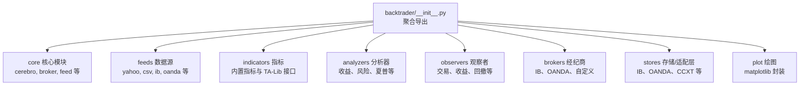
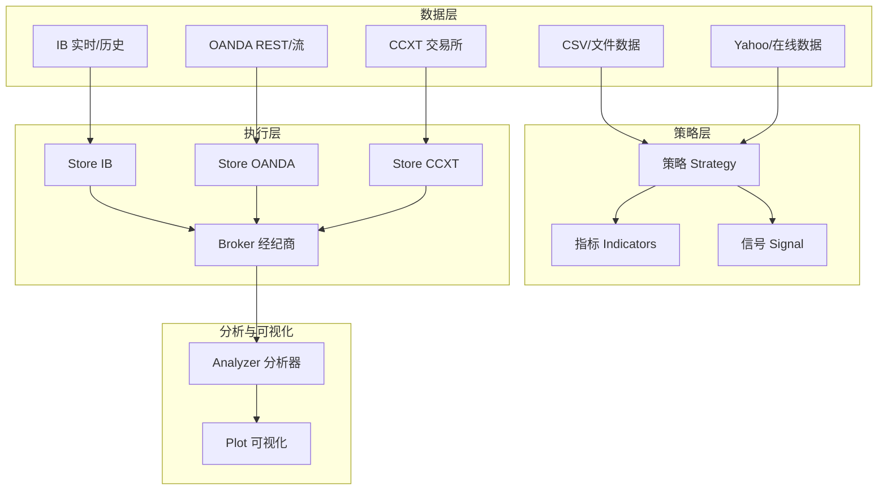
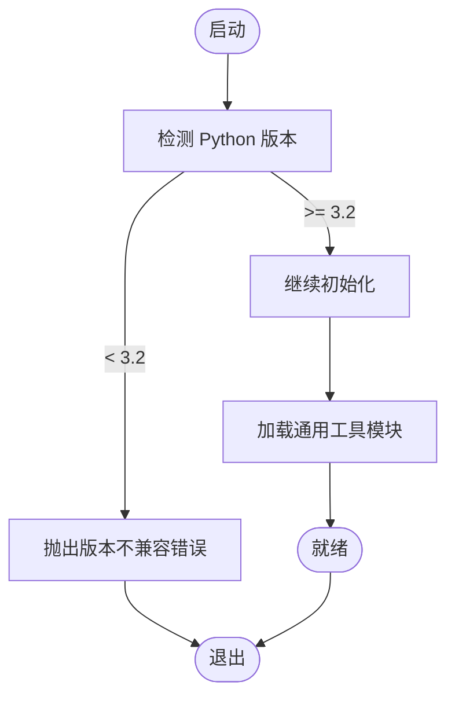
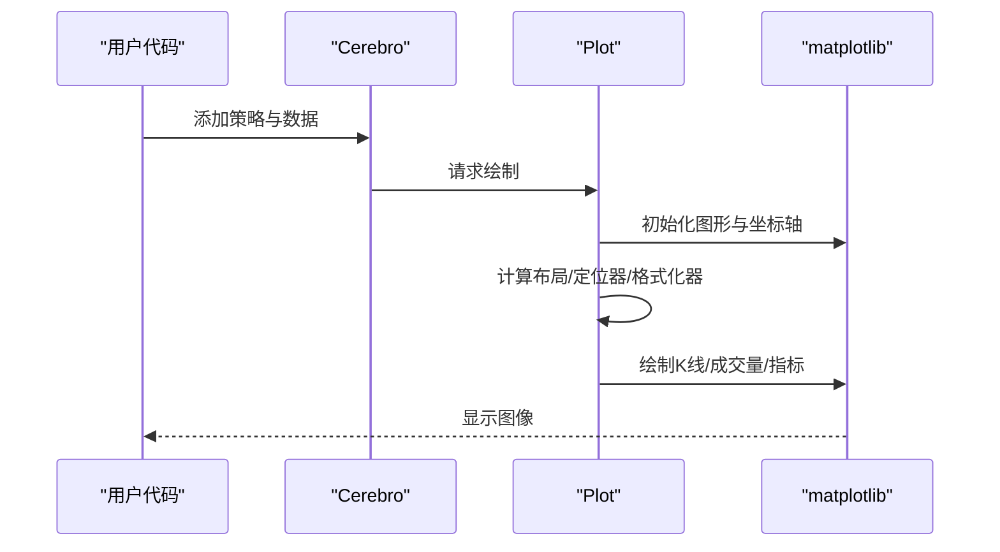
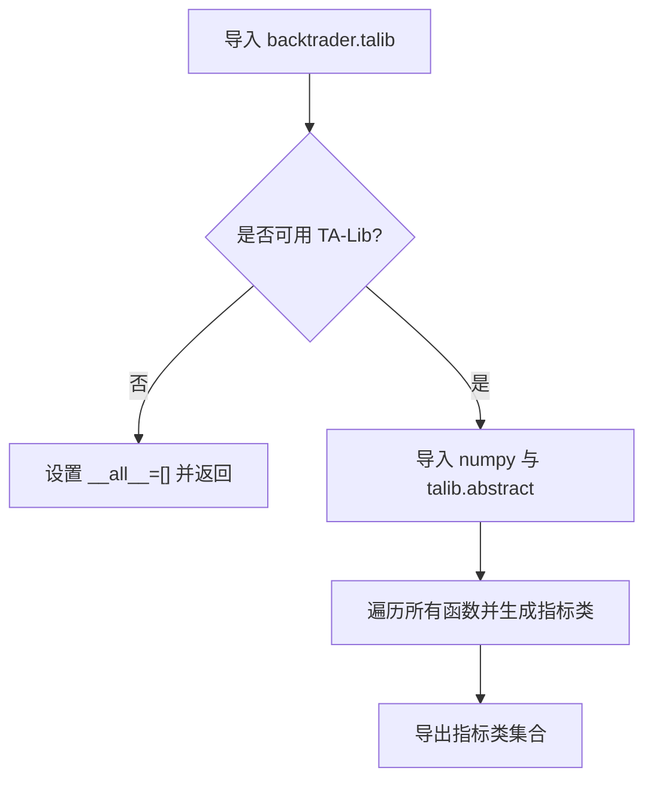
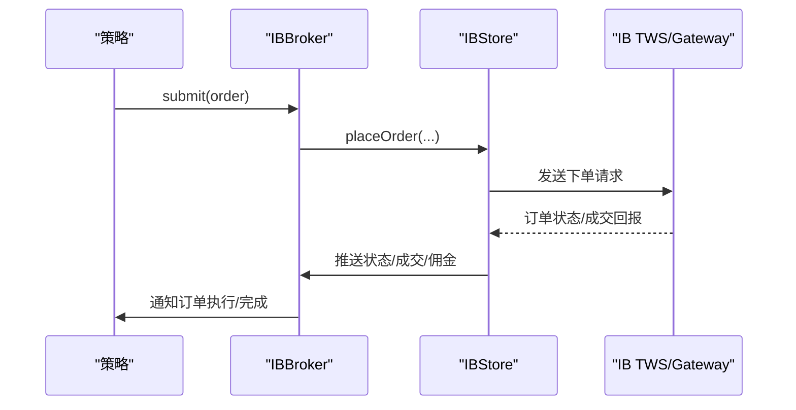
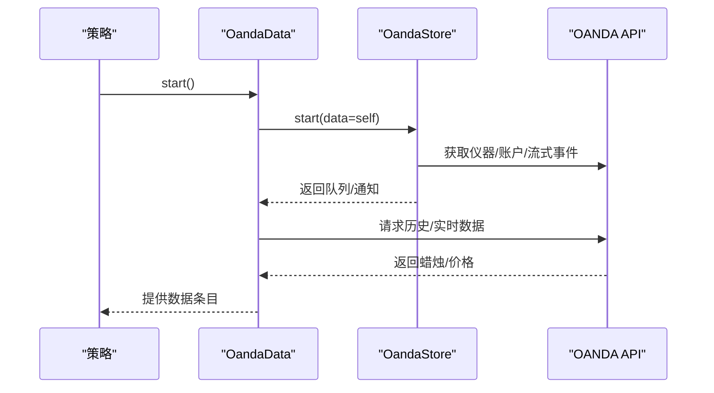
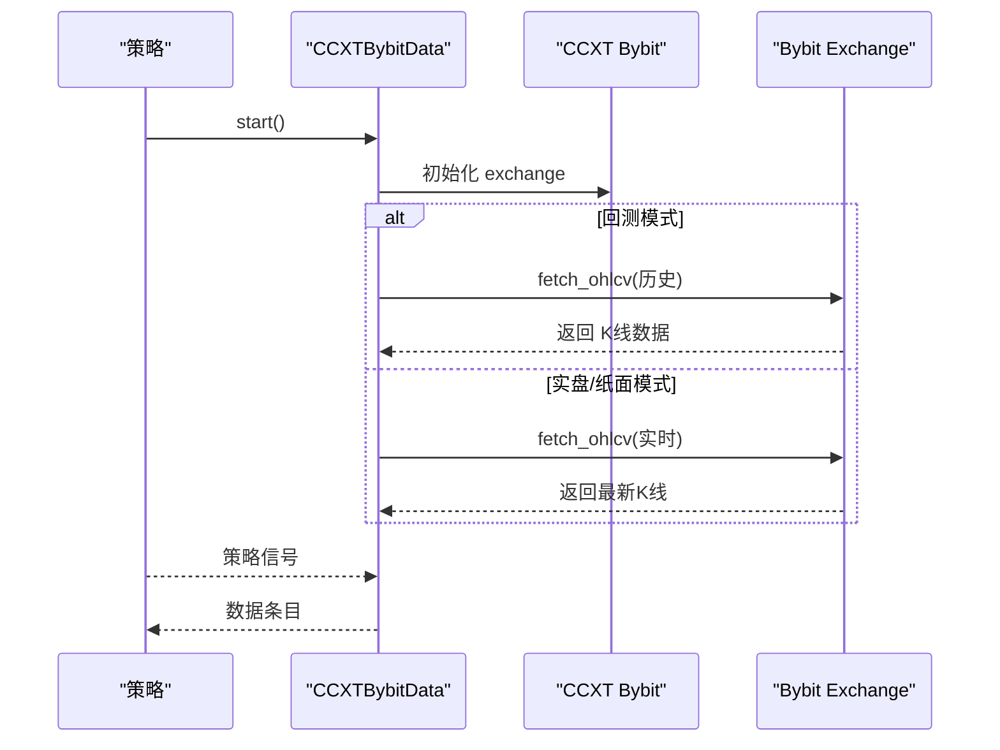
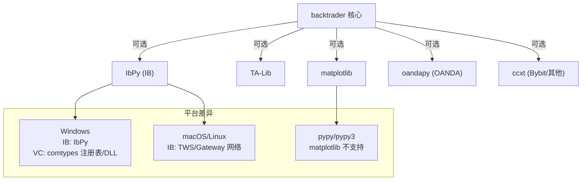

# 技术栈与依赖关系

<cite>
**本文档引用的文件**
- [setup.py](file://setup.py)
- [README.rst](file://README.rst)
- [backtrader/__init__.py](file://backtrader/__init__.py)
- [backtrader/version.py](file://backtrader/version.py)
- [backtrader/utils/py3.py](file://backtrader/utils/py3.py)
- [backtrader/talib.py](file://backtrader/talib.py)
- [backtrader/plot/plot.py](file://backtrader/plot/plot.py)
- [backtrader/brokers/ibbroker.py](file://backtrader/brokers/ibbroker.py)
- [backtrader/stores/ibstore.py](file://backtrader/stores/ibstore.py)
- [backtrader/feeds/oanda.py](file://backtrader/feeds/oanda.py)
- [backtrader/stores/oandastore.py](file://backtrader/stores/oandastore.py)
- [samples/ccxt-bybit/bybit-live-trading.py](file://samples/ccxt-bybit/bybit-live-trading.py)
- [backtrader.egg-info/requires.txt](file://backtrader.egg-info/requires.txt)
- [backtrader.egg-info/PKG-INFO](file://backtrader.egg-info/PKG-INFO)
</cite>

## 目录
1. [引言](#引言)
2. [项目结构](#项目结构)
3. [核心组件](#核心组件)
4. [架构总览](#架构总览)
5. [详细组件分析](#详细组件分析)
6. [依赖关系分析](#依赖关系分析)
7. [性能考量](#性能考量)
8. [故障排除指南](#故障排除指南)
9. [结论](#结论)
10. [附录](#附录)

## 引言
本文件系统化梳理 Backtrader 量化交易框架的技术栈与依赖关系，重点说明：
- Python 版本要求（3.2+）的设计动机与兼容性考虑
- 必需依赖与可选依赖的区分及作用边界
- 第三方数据与交易接口（Interactive Brokers、OANDA、CCXT 等）的集成方式与依赖要求
- 不同平台（Windows/macOS/Linux）下的安装注意事项与常见冲突处理
- 面向开发者的最佳实践与技术选型背景知识

## 项目结构
Backtrader 采用模块化分层设计：核心引擎位于 backtrader 包，按功能划分为数据源 feeds、策略 strategy、指标 indicators、分析器 analyzers、观察者 observers、经纪商 brokers、存储 stores、绘图 plot 等子模块；顶层入口通过 __init__.py 汇聚导出。

图表来源
- [backtrader/__init__.py](file://backtrader/__init__.py#L24-L91)

章节来源
- [backtrader/__init__.py](file://backtrader/__init__.py#L24-L91)

## 核心组件
- Python 版本与兼容性
  - 支持 Python 3.2 及以上版本，同时兼容 pypy/pypy3（绘图不支持 pypy）。
  - 内部通过工具模块统一处理 Python 2/3 差异，确保跨版本一致性。
- 核心运行时
  - Cerebro 作为主控引擎，协调数据、策略、指标、分析器、观察者与经纪商。
  - Broker 提供订单生命周期管理与资金头寸模拟。
  - Store/Feed 负责外部数据与交易接口的桥接。
- 可选绘图能力
  - 通过 matplotlib 实现策略回测结果可视化，属于可选依赖。

章节来源
- [README.rst](file://README.rst#L118-L125)
- [backtrader/utils/py3.py](file://backtrader/utils/py3.py#L27-L134)
- [backtrader/plot/plot.py](file://backtrader/plot/plot.py#L32-L47)

## 架构总览
Backtrader 的整体架构围绕“数据流—策略—执行—分析—可视化”的闭环展开。数据源从本地 CSV、在线服务或第三方接口拉取；策略在 Cerebro 中运行，通过指标与信号生成订单；订单经由 Broker 执行，Store 层负责与外部交易所或数据提供商对接；最后用 Plot 进行结果展示。

图表来源
- [backtrader/brokers/ibbroker.py](file://backtrader/brokers/ibbroker.py#L240-L576)
- [backtrader/stores/ibstore.py](file://backtrader/stores/ibstore.py#L105-L800)
- [backtrader/feeds/oanda.py](file://backtrader/feeds/oanda.py#L44-L450)
- [backtrader/stores/oandastore.py](file://backtrader/stores/oandastore.py#L177-L660)
- [samples/ccxt-bybit/bybit-live-trading.py](file://samples/ccxt-bybit/bybit-live-trading.py#L172-L878)

## 详细组件分析

### Python 版本与兼容性（3.2+）
- 设计动机
  - 早期版本同时支持 Python 2/3，但为简化维护与现代化演进，逐步转向仅支持 Python 3。
  - 3.2+ 是一个平衡点：既覆盖主流发行版，又避免过旧版本的生态限制。
- 兼容性实现
  - 使用工具模块统一处理字符串、字节、IO、URL、队列等差异，保证在 3.x 下的稳定行为。
  - 版本号与打包元数据明确声明支持范围与操作系统无关。

图表来源
- [backtrader/utils/py3.py](file://backtrader/utils/py3.py#L27-L134)
- [backtrader/version.py](file://backtrader/version.py#L25-L28)
- [setup.py](file://setup.py#L87-L96)

章节来源
- [README.rst](file://README.rst#L118-L125)
- [backtrader/utils/py3.py](file://backtrader/utils/py3.py#L27-L134)
- [backtrader/version.py](file://backtrader/version.py#L25-L28)
- [setup.py](file://setup.py#L87-L96)

### 绘图与可视化（matplotlib，可选）
- 作用与必要性
  - 提供 OHLC、K线、成交量、指标叠加等可视化能力，便于策略验证与结果展示。
  - 默认不包含该依赖，避免非可视化用户引入不必要的包。
- 安装与使用
  - 通过 extras_require 指定可选组，安装时可选择启用绘图功能。
  - 在 Jupyter 环境下自动切换后端以获得更好的交互体验。

图表来源
- [backtrader/plot/plot.py](file://backtrader/plot/plot.py#L119-L274)
- [setup.py](file://setup.py#L118-L120)
- [backtrader.egg-info/requires.txt](file://backtrader.egg-info/requires.txt#L2-L4)

章节来源
- [README.rst](file://README.rst#L129-L141)
- [backtrader/plot/plot.py](file://backtrader/plot/plot.py#L32-L47)
- [setup.py](file://setup.py#L118-L120)
- [backtrader.egg-info/requires.txt](file://backtrader.egg-info/requires.txt#L2-L4)

### TA-Lib 技术指标支持（可选）
- 作用与必要性
  - 提供大量成熟的技术指标函数族，提升策略开发效率与准确性。
  - 通过反射式封装将 TA-Lib 函数映射为 Backtrader 指标类，保持一致的调用与绘图接口。
- 依赖与加载机制
  - 若未安装 TA-Lib，则模块导出空列表，不影响基础功能。
  - 自动解析函数标志位与输出类型，动态生成绘图配置。

图表来源
- [backtrader/talib.py](file://backtrader/talib.py#L33-L62)
- [backtrader/talib.py](file://backtrader/talib.py#L234-L239)

章节来源
- [README.rst](file://README.rst#L88-L89)
- [backtrader/talib.py](file://backtrader/talib.py#L33-L62)
- [backtrader/talib.py](file://backtrader/talib.py#L234-L239)

### Interactive Brokers（IB）集成
- 数据与交易接口
  - Store/IBStore 负责连接 TWS/Gateway，管理连接、重连、时间偏移、合约详情、历史/实时数据请求。
  - Broker/IBBroker 将 Backtrader 订单模型映射到 IB 原生订单类型，处理状态、成交、佣金与账户更新。
- 依赖与安装
  - 需要 IbPy（通过 pip 安装），可选 pytz 优化时区处理。
- 错误处理与重连策略
  - 对多种错误码进行分类处理，支持有限次重试与断线恢复。

图表来源
- [backtrader/brokers/ibbroker.py](file://backtrader/brokers/ibbroker.py#L327-L403)
- [backtrader/stores/ibstore.py](file://backtrader/stores/ibstore.py#L349-L398)

章节来源
- [README.rst](file://README.rst#L112-L117)
- [backtrader/brokers/ibbroker.py](file://backtrader/brokers/ibbroker.py#L240-L576)
- [backtrader/stores/ibstore.py](file://backtrader/stores/ibstore.py#L105-L800)

### OANDA 集成
- 数据与交易接口
  - Store/OandaStore 提供 REST 历史数据与流式价格订阅，支持多时间框架映射与账户信息轮询。
  - Data/OandaData 封装数据拉取、回填与断线重连逻辑。
- 依赖与安装
  - 需要 oandapy 库，REST API 无需流式支持。
- 时间与粒度管理
  - 内置时间框架到 OANDA 粒度的映射表，确保请求合法性。

图表来源
- [backtrader/feeds/oanda.py](file://backtrader/feeds/oanda.py#L180-L251)
- [backtrader/stores/oandastore.py](file://backtrader/stores/oandastore.py#L348-L408)

章节来源
- [README.rst](file://README.rst#L116-L117)
- [backtrader/feeds/oanda.py](file://backtrader/feeds/oanda.py#L44-L450)
- [backtrader/stores/oandastore.py](file://backtrader/stores/oandastore.py#L177-L660)

### CCXT/Bybit 集成（示例）
- 功能特性
  - 通过 CCXT 访问 Bybit，支持实盘/纸面交易、历史回测与实时数据流。
  - 提供自定义 Data/ Broker 适配器，演示如何扩展至其他交易所。
- 依赖与安装
  - 需要安装 ccxt；可通过参数控制代理、测试网、时间框架映射等。
- 使用场景
  - 适合希望快速接入多家交易所的开发者，作为 Store/Feed 的参考实现。

图表来源
- [samples/ccxt-bybit/bybit-live-trading.py](file://samples/ccxt-bybit/bybit-live-trading.py#L197-L322)

章节来源
- [samples/ccxt-bybit/bybit-live-trading.py](file://samples/ccxt-bybit/bybit-live-trading.py#L1-L878)

## 依赖关系分析
- 必需依赖
  - 无硬性外部依赖：核心功能可在无任何第三方库的情况下运行。
- 可选依赖
  - 绘图：matplotlib（可选组 plotting）
  - 技术指标：TA-Lib（可选）
  - 第三方接口：IB（IbPy）、OANDA（oandapy）、CCXT（ccxt）
- 平台相关注意
  - Windows：IB 需要 IbPy；若使用 comtypes（Visual Chart）需特定注册表路径与 DLL。
  - macOS/Linux：IB/TWS/Gateway 通常通过网络连接；注意防火墙与端口配置。
  - pypy/pypy3：绘图不可用（matplotlib 不支持），但核心逻辑仍可运行。

图表来源
- [setup.py](file://setup.py#L118-L120)
- [backtrader.egg-info/requires.txt](file://backtrader.egg-info/requires.txt#L2-L4)
- [README.rst](file://README.rst#L142-L153)
- [backtrader/stores/vcstore.py](file://backtrader/stores/vcstore.py#L259-L304)

章节来源
- [setup.py](file://setup.py#L118-L120)
- [backtrader.egg-info/requires.txt](file://backtrader.egg-info/requires.txt#L2-L4)
- [README.rst](file://README.rst#L142-L153)
- [backtrader/stores/vcstore.py](file://backtrader/stores/vcstore.py#L259-L304)

## 性能考量
- 数据与指标
  - 大量指标计算与历史回测会带来内存与 CPU 压力，建议合理设置压缩倍数与时间框架。
  - 使用数组/NumPy 向量化操作减少循环开销（TA-Lib 已内建优化）。
- 可视化
  - 绘图在大数据集上可能成为瓶颈，建议在调试阶段开启，生产回测关闭或降低刷新频率。
- 网络与外部接口
  - IB/OANDA/CCXT 等接口存在网络抖动与限流，应配置合理的超时、重试与退避策略。
- 并发与锁
  - Store 层广泛使用线程锁与队列，确保多数据源并发下的数据一致性与顺序性。

## 故障排除指南
- 版本不兼容
  - 症状：运行时报错提示 Python 版本过低。
  - 处理：升级至 Python 3.2+；确认环境变量与解释器路径。
- 缺少可选依赖
  - 症状：绘图失败或 TA-Lib 指标不可用。
  - 处理：安装对应 extras 或第三方库；例如 `pip install backtrader[plotting]` 或 `pip install ta-lib`。
- IB 连接问题
  - 症状：无法连接 TWS/Gateway、端口被占用、clientId 冲突。
  - 处理：检查主机/端口配置、客户端 ID、防火墙；必要时重启 TWS 并调整端口。
- OANDA 网络异常
  - 症状：请求超时、流式断开、时间框架不支持。
  - 处理：确认 token/account、网络连通性；使用支持的时间框架映射。
- CCXT 代理与测试网
  - 症状：访问受限、实盘误触发。
  - 处理：正确配置代理；默认使用纸面交易，显式关闭实盘开关。

章节来源
- [README.rst](file://README.rst#L129-L153)
- [backtrader/brokers/ibbroker.py](file://backtrader/brokers/ibbroker.py#L543-L564)
- [backtrader/stores/ibstore.py](file://backtrader/stores/ibstore.py#L440-L540)
- [backtrader/stores/oandastore.py](file://backtrader/stores/oandastore.py#L540-L660)
- [samples/ccxt-bybit/bybit-live-trading.py](file://samples/ccxt-bybit/bybit-live-trading.py#L197-L227)

## 结论
Backtrader 以“零依赖核心 + 可插拔扩展”为设计理念，通过清晰的 Store/Feed/Broker 分层与丰富的内置指标、分析器与可视化能力，为量化研究与实盘交易提供了高扩展性与易用性。Python 3.2+ 的最低版本要求兼顾了稳定性与现代性；可选依赖策略降低了非必要用户的安装负担。针对 IB/OANDA/CCXT 等第三方接口，项目提供了成熟的适配层与错误处理机制，配合合理的平台与网络配置，能够满足从回测到实盘的多样化需求。

## 附录
- 安装命令示例
  - 基础安装：`pip install backtrader`
  - 启用绘图：`pip install backtrader[plotting]`
  - TA-Lib：`pip install TA-Lib`
  - IB：`pip install git+https://github.com/blampe/IbPy.git`
  - OANDA：`pip install oandapy`
  - CCXT：`pip install ccxt`
- 最低 matplotlib 版本：1.4.1（见安装说明）

章节来源
- [README.rst](file://README.rst#L132-L153)
- [backtrader.egg-info/PKG-INFO](file://backtrader.egg-info/PKG-INFO#L26-L27)