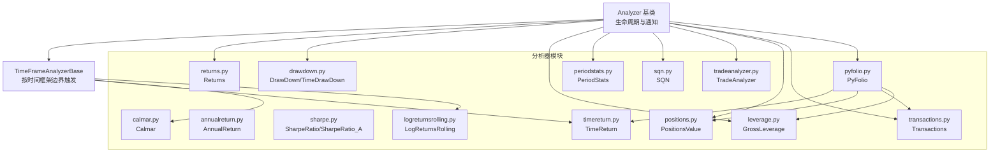
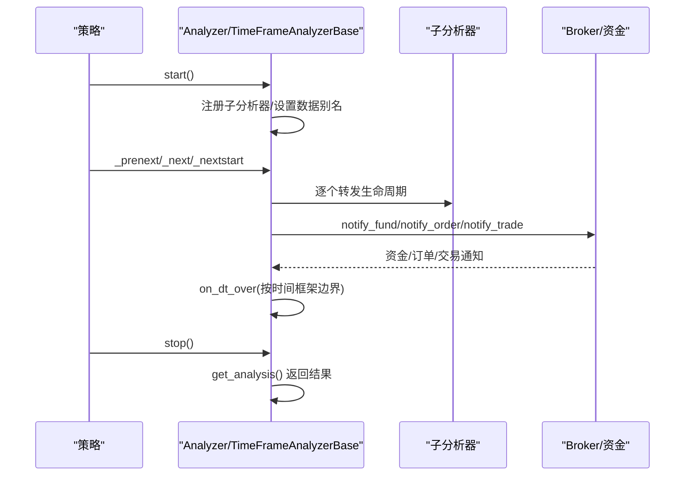
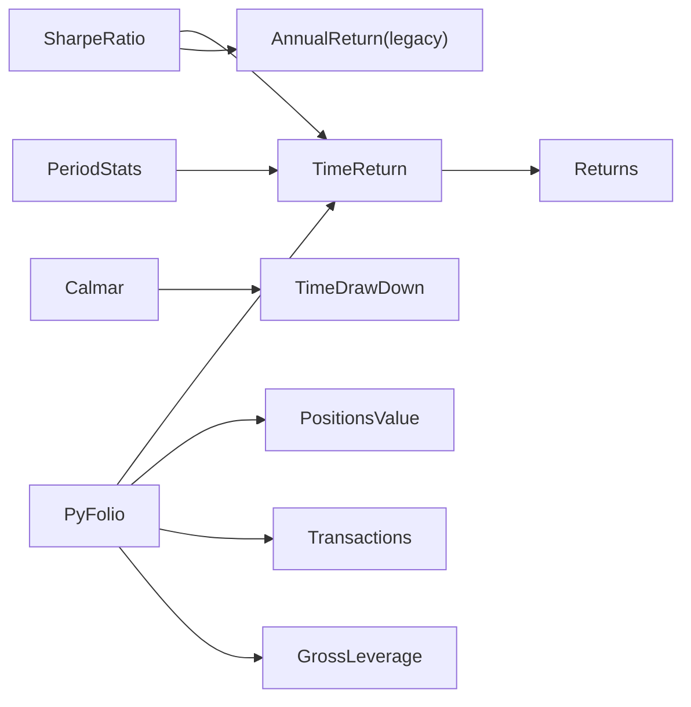
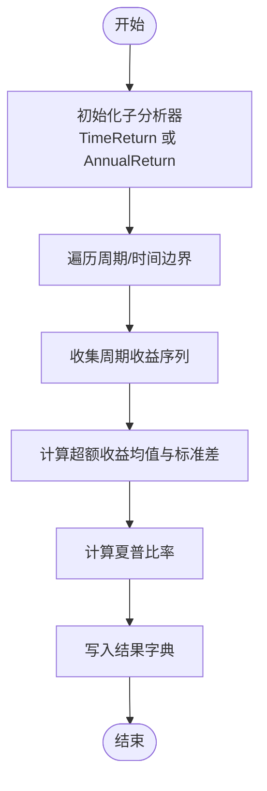

# 内置分析器详解

<cite>
**本文档引用的文件**
- [analyzers/__init__.py](file://backtrader/analyzers/__init__.py)
- [analyzer.py](file://backtrader/analyzer.py)
- [annualreturn.py](file://backtrader/analyzers/annualreturn.py)
- [calmar.py](file://backtrader/analyzers/calmar.py)
- [drawdown.py](file://backtrader/analyzers/drawdown.py)
- [leverage.py](file://backtrader/analyzers/leverage.py)
- [logreturnsrolling.py](file://backtrader/analyzers/logreturnsrolling.py)
- [periodstats.py](file://backtrader/analyzers/periodstats.py)
- [positions.py](file://backtrader/analyzers/positions.py)
- [pyfolio.py](file://backtrader/analyzers/pyfolio.py)
- [returns.py](file://backtrader/analyzers/returns.py)
- [sharpe.py](file://backtrader/analyzers/sharpe.py)
- [sqn.py](file://backtrader/analyzers/sqn.py)
- [timereturn.py](file://backtrader/analyzers/timereturn.py)
- [tradeanalyzer.py](file://backtrader/analyzers/tradeanalyzer.py)
- [transactions.py](file://backtrader/analyzers/transactions.py)
</cite>

## 目录
1. [简介](#简介)
2. [项目结构](#项目结构)
3. [核心组件](#核心组件)
4. [架构总览](#架构总览)
5. [详细组件分析](#详细组件分析)
6. [依赖关系分析](#依赖关系分析)
7. [性能考量](#性能考量)
8. [故障排查指南](#故障排查指南)
9. [结论](#结论)
10. [附录](#附录)

## 简介
本文件系统性梳理 Backtrader 的内置分析器，覆盖收益分析、风险评估、夏普比率、最大回撤、杠杆、交易统计、PYFOLIO 集成等模块。内容包含：
- 每个分析器的功能特性与适用场景
- 参数配置、输出格式与结果解读
- 计算公式与实现要点
- 在策略中的集成方式与最佳实践
- 分析器之间的关系与组合使用建议

## 项目结构
Backtrader 的分析器位于 backtrader/analyzers 目录，通过一个统一入口导出，并基于通用基类 Analyzer 或 TimeFrameAnalyzerBase 提供生命周期钩子（start/next/stop）与通知回调（notify_*），支持按时间框架聚合与滚动窗口计算。

图表来源
- [analyzer.py](file://backtrader/analyzer.py#L89-L287)
- [returns.py](file://backtrader/analyzers/returns.py#L30-L156)
- [timereturn.py](file://backtrader/analyzers/timereturn.py#L27-L143)
- [annualreturn.py](file://backtrader/analyzers/annualreturn.py#L30-L90)
- [drawdown.py](file://backtrader/analyzers/drawdown.py#L31-L198)
- [sharpe.py](file://backtrader/analyzers/sharpe.py#L33-L222)
- [calmar.py](file://backtrader/analyzers/calmar.py#L31-L114)
- [leverage.py](file://backtrader/analyzers/leverage.py#L27-L72)
- [periodstats.py](file://backtrader/analyzers/periodstats.py#L34-L113)
- [sqn.py](file://backtrader/analyzers/sqn.py#L31-L86)
- [tradeanalyzer.py](file://backtrader/analyzers/tradeanalyzer.py#L31-L209)
- [positions.py](file://backtrader/analyzers/positions.py#L28-L86)
- [transactions.py](file://backtrader/analyzers/transactions.py#L31-L104)
- [pyfolio.py](file://backtrader/analyzers/pyfolio.py#L33-L164)
- [logreturnsrolling.py](file://backtrader/analyzers/logreturnsrolling.py#L33-L141)

章节来源
- [analyzers/__init__.py](file://backtrader/analyzers/__init__.py#L27-L44)
- [analyzer.py](file://backtrader/analyzer.py#L89-L287)

## 核心组件
- Analyzer 基类：提供统一的生命周期（start/next/stop）、通知回调（notify_*）、自动注册子分析器、返回分析结果的约定接口。
- TimeFrameAnalyzerBase：在时间框架边界（如日/周/月/年或分钟级压缩）触发 on_dt_over，便于按周期聚合指标。
- 各内置分析器：围绕收益、风险、交易行为、杠杆、位置价值、交易记录、PYFOLIO 兼容数据集等主题构建。

章节来源
- [analyzer.py](file://backtrader/analyzer.py#L89-L287)

## 架构总览
下图展示分析器在策略运行时的调用链与典型交互：

图表来源
- [analyzer.py](file://backtrader/analyzer.py#L148-L201)
- [analyzer.py](file://backtrader/analyzer.py#L307-L360)

## 详细组件分析

### 收益相关分析器

#### Returns（对数复合/年化收益）
- 功能：按对数法计算总复合回报、平均回报、年化/标准化回报。
- 关键参数：
  - timeframe/compression：时间框架与压缩倍数
  - tann：年化期数（天=252、周=52、月=12、年=1）
  - fund：资金模式（净值/基金值）
- 输出键：
  - rtot：总复合回报（对数值）
  - ravg：期间平均回报
  - rnorm：年化/标准化回报
  - rnorm100：百分比形式的人类可读值
- 使用场景：评估策略整体收益水平与时间尺度归一化比较。
- 结果解读：rnorm 更适合跨时间框架对比；rnorm100 便于直观理解。

章节来源
- [returns.py](file://backtrader/analyzers/returns.py#L30-L156)

#### TimeReturn（按时间框架收益）
- 功能：在时间框架边界计算期初/期末价值的简单收益率。
- 关键参数：
  - data：跟踪参考资产而非组合价值
  - firstopen：首期无上期收盘价时使用开盘价
  - fund：资金模式
- 输出：字典，键为时间边界（如月末日），值为期收益率。
- 使用场景：分段收益可视化、基准资产对比。

章节来源
- [timereturn.py](file://backtrader/analyzers/timereturn.py#L27-L143)

#### AnnualReturn（年度收益）
- 功能：按自然年计算年度复合回报，返回年份到回报的映射。
- 输出：有序字典，键为年份，值为该年收益。
- 使用场景：年度收益趋势分析。

章节来源
- [annualreturn.py](file://backtrader/analyzers/annualreturn.py#L30-L90)

#### LogReturnsRolling（滚动对数收益）
- 功能：按指定时间框架与压缩计算滚动对数收益序列。
- 关键参数：data、firstopen、fund、timeframe/compression。
- 输出：字典，键为时间边界，值为对数收益。
- 使用场景：滚动收益序列用于波动率估计、相关性分析。

章节来源
- [logreturnsrolling.py](file://backtrader/analyzers/logreturnsrolling.py#L33-L141)

### 风险评估分析器

#### DrawDown / TimeDrawDown（最大回撤）
- 功能：计算当前回撤与历史峰值的相对回撤、金额回撤、最大回撤及持续期。
- 关键参数：fund。
- 输出（DrawDown）：.notation 支持的嵌套字典，包含 drawdown、moneydown、len 及其 max.*。
- 输出（TimeDrawDown）：属性 dd/maxdd/maxddlen，以及字典 maxdrawdown/maxdrawdownperiod。
- 使用场景：衡量策略最大回撤与最长回撤持续期，风控阈值设定。

章节来源
- [drawdown.py](file://backtrader/analyzers/drawdown.py#L31-L198)

#### Calmar（卡玛比率）
- 功能：年化对数收益率除以最大回撤，支持滚动窗口。
- 关键参数：timeframe/compression、period（滚动期数）、fund。
- 输出：按时间边界的时间序列 calmar。
- 使用场景：在控制回撤的前提下评估收益能力。

章节来源
- [calmar.py](file://backtrader/analyzers/calmar.py#L31-L114)

### 夏普比率分析器

#### SharpeRatio / SharpeRatio_A（夏普比率）
- 功能：基于无风险利率计算超额收益与波动的比率；支持按时间框架转换与年化。
- 关键参数：
  - timeframe/compression、riskfreerate、convertrate、factor、annualize、stddev_sample
  - legacyannual：使用 AnnualReturn（仅年维度）
  - fund：资金模式
- 输出：字典，键为 "sharperatio"。
- 使用场景：衡量单位风险的超额收益，常用于策略择优与组合优化。

章节来源
- [sharpe.py](file://backtrader/analyzers/sharpe.py#L33-L222)

### 交易与行为分析器

#### TradeAnalyzer（交易统计）
- 功能：统计已平仓交易的总数、胜率、盈亏分布、最长连胜/连败、多空统计、持有长度等。
- 输出：AutoOrderedDict，包含 total/open/closed、streak、pnl（gross/net）、long/short、len（total/avg/max/min）及其细分。
- 使用场景：交易系统质量评估、策略行为诊断。

章节来源
- [tradeanalyzer.py](file://backtrader/analyzers/tradeanalyzer.py#L31-L209)

#### SQN（系统质量指数）
- 功能：基于交易利润序列的 SQN 指标，用于分类交易系统质量等级。
- 输出：字典，键为 "sqn" 与 "trades"。
- 使用场景：快速评估策略稳定性与盈利能力。

章节来源
- [sqn.py](file://backtrader/analyzers/sqn.py#L31-L86)

### 杠杆与头寸分析器

#### GrossLeverage（总杠杆）
- 功能：按时间框架计算总杠杆（(总值-现金)/总值）。
- 关键参数：fund。
- 输出：字典，键为时间点，值为杠杆。
- 使用场景：监控策略加杠杆程度，配合风控。

章节来源
- [leverage.py](file://backtrader/analyzers/leverage.py#L27-L72)

#### PositionsValue（头寸价值）
- 功能：记录每笔数据的头寸价值，可选包含现金。
- 关键参数：headers、cash。
- 输出：字典，键为日期/时间，值为头寸价值列表（可含现金）。
- 使用场景：多资产头寸可视化与分析。

章节来源
- [positions.py](file://backtrader/analyzers/positions.py#L28-L86)

### 交易记录与 PYFOLIO 集成

#### Transactions（交易记录）
- 功能：按周期汇总订单执行，输出每笔交易的 size/price/sid/symbol/value 等字段。
- 关键参数：headers（是否包含列头）。
- 输出：字典，键为时间点，值为交易条目列表。
- 使用场景：与 PYFOLIO 对接，生成交易清单。

章节来源
- [transactions.py](file://backtrader/analyzers/transactions.py#L31-L104)

#### PyFolio（PYFOLIO 数据集）
- 功能：整合 Returns、PositionsValue、Transactions、GrossLeverage 四类数据，生成 PYFOLIO 兼容输入。
- 关键参数：timeframe/compression（默认日频）。
- 输出：字典，键为 "returns"/"positions"/"transactions"/"gross_lev"。
- 方法：get_pf_items 将内部结构转换为 pandas DataFrame，便于直接传入 PYFOLIO 工具链。
- 使用场景：策略回测后进行专业因子分析与报告生成。

章节来源
- [pyfolio.py](file://backtrader/analyzers/pyfolio.py#L33-L164)

### 统计与周期分析

#### PeriodStats（周期统计）
- 功能：基于 TimeReturn 的周期收益序列，计算平均、标准差、正/负/不变期数、最好/最坏周期。
- 关键参数：timeframe/compression、zeroispos（零变化计为正）、fund。
- 输出：字典，键为 average/stddev/positive/negative/nochange/best/worst。
- 使用场景：周期收益分布特征分析。

章节来源
- [periodstats.py](file://backtrader/analyzers/periodstats.py#L34-L113)

## 依赖关系分析

图表来源
- [sharpe.py](file://backtrader/analyzers/sharpe.py#L134-L142)
- [calmar.py](file://backtrader/analyzers/calmar.py#L83-L86)
- [pyfolio.py](file://backtrader/analyzers/pyfolio.py#L86-L94)
- [periodstats.py](file://backtrader/analyzers/periodstats.py#L85-L88)

## 性能考量
- 时间框架与压缩：合理设置 timeframe/compression 可减少不必要的计算次数，提升滚动与周期聚合效率。
- fund 模式：统一使用净值或基金值，避免重复切换导致的额外判断开销。
- 通知驱动：优先利用 notify_* 回调更新状态，减少在 next 中的重复计算。
- 子分析器组合：通过 PyFolio 一次性收集多类指标，降低多次遍历成本。

## 故障排查指南
- 输出为空或未更新
  - 确认已正确在策略中添加分析器并设置 timeframe/compression。
  - 检查 fund 模式与 broker 设置是否一致。
- 夏普比率返回 None
  - 检查样本数量是否满足计算要求（至少 2 期），或关闭 stddev_sample 导致分母为 0。
  - 确认 riskfreerate 与 convertrate/factor 的一致性。
- 最大回撤异常
  - 确认 fund 模式一致；检查 on_dt_over 触发频率与时间边界计算逻辑。
- PYFOLIO 数据缺失
  - 确保已启用 headers 并正确调用 get_pf_items；确认 pandas 可用。

章节来源
- [sharpe.py](file://backtrader/analyzers/sharpe.py#L182-L206)
- [drawdown.py](file://backtrader/analyzers/drawdown.py#L176-L198)
- [pyfolio.py](file://backtrader/analyzers/pyfolio.py#L115-L164)

## 结论
Backtrader 的内置分析器以 Analyzer/TimeFrameAnalyzerBase 为核心，提供了从收益、风险、交易行为到 PYFOLIO 集成的完整分析工具链。通过合理配置参数与组合使用，可在不侵入策略逻辑的前提下获得高质量的回测分析结果，并为策略优化与风控提供量化依据。

## 附录

### 使用示例与配置思路（路径指引）
- 在策略中添加分析器并获取结果
  - 示例路径：[samples/sqh-test/sqh-test.py](file://samples/sqh-test/sqh-test.py)
  - 示例路径：[samples/sqh-test/sqh-test.py](file://samples/sqh-test/sqh-test.py)
- 夏普比率与时间框架收益
  - 示例路径：[samples/sharpe-timereturn/sharpe-timereturn.py](file://samples/sharpe-timereturn/sharpe-timereturn.py)
- PYFOLIO 集成
  - 示例路径：[samples/pyfolio2/pyfoliotest.py](file://samples/pyfolio2/pyfoliotest.py)
  - 示例路径：[samples/pyfolio2/backtrader-pyfolio.ipynb](file://samples/pyfolio2/backtrader-pyfolio.ipynb)

### 计算流程示意（以 SharpeRatio 为例）

图表来源
- [sharpe.py](file://backtrader/analyzers/sharpe.py#L143-L206)