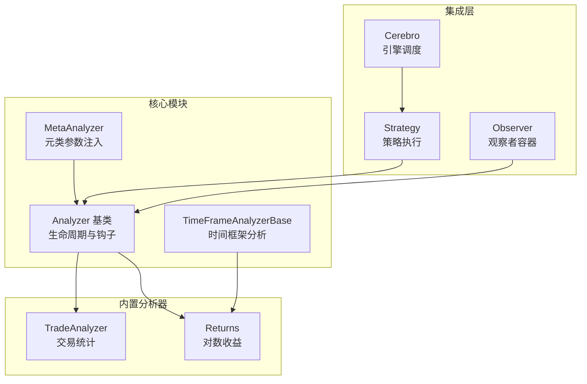
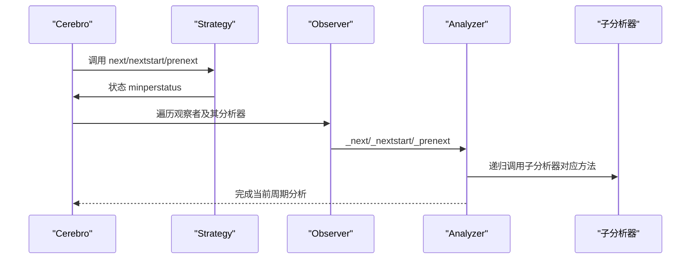
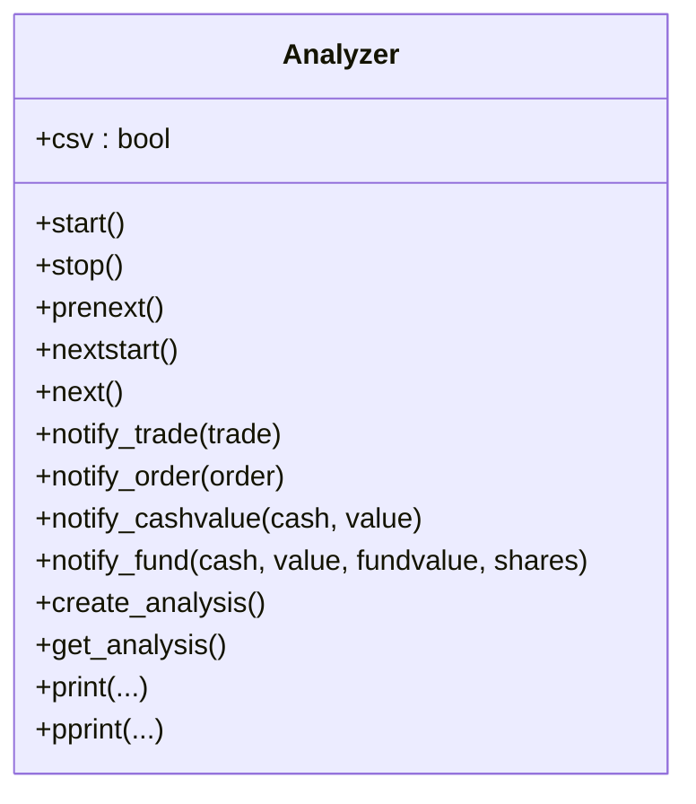
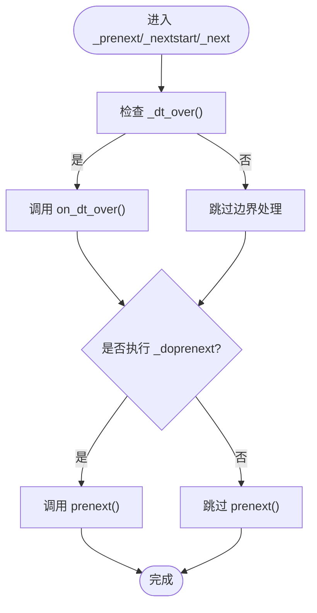
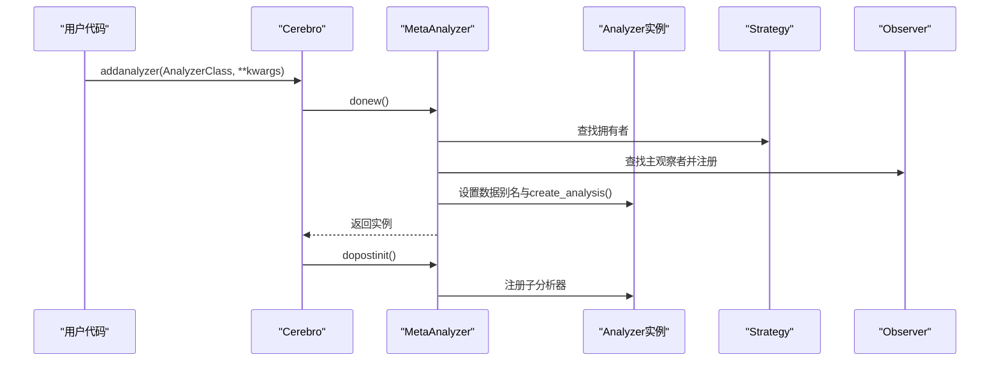
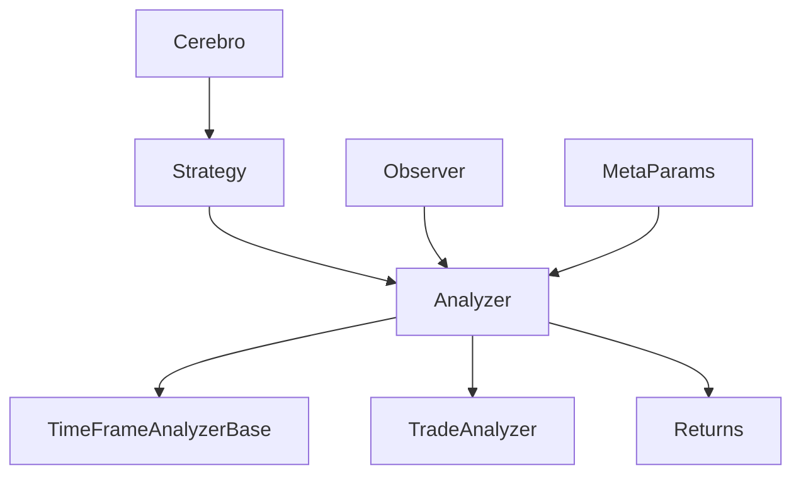

# 分析器基类架构

<cite>
**本文档引用的文件**
- [analyzer.py](file://backtrader/analyzer.py)
- [__init__.py](file://backtrader/__init__.py)
- [analyzers/__init__.py](file://backtrader/analyzers/__init__.py)
- [strategy.py](file://backtrader/strategy.py)
- [cerebro.py](file://backtrader/cerebro.py)
- [tradeanalyzer.py](file://backtrader/analyzers/tradeanalyzer.py)
- [returns.py](file://backtrader/analyzers/returns.py)
- [analyzer-annualreturn.py](file://samples/analyzer-annualreturn/analyzer-annualreturn.py)
- [metabase.py](file://backtrader/metabase.py)
- [observer.py](file://backtrader/observer.py)
- [autodict.py](file://backtrader/utils/autodict.py)
</cite>

## 目录
1. [简介](#简介)
2. [项目结构](#项目结构)
3. [核心组件](#核心组件)
4. [架构总览](#架构总览)
5. [详细组件分析](#详细组件分析)
6. [依赖关系分析](#依赖关系分析)
7. [性能考虑](#性能考虑)
8. [故障排除指南](#故障排除指南)
9. [结论](#结论)
10. [附录：使用示例与最佳实践](#附录使用示例与最佳实践)

## 简介
本文件面向Backtrader框架中的分析器（Analyzer）基类，系统性地阐述其设计理念、核心架构、生命周期管理、数据收集机制、结果输出格式，以及继承关系与扩展点。我们将从代码级视角解析分析器如何通过钩子函数参与策略执行过程，如何配置参数、初始化与运行时行为，并提供可操作的使用示例与最佳实践，帮助开发者正确继承与实现自定义分析器。

## 项目结构
Backtrader的分析器体系位于`backtrader/analyzer.py`中，同时在`backtrader/analyzers/`目录下提供了多种内置分析器实现，如交易分析器、收益分析器等。分析器与策略、观察者、Cerebro引擎之间存在紧密的协作关系。

**图表来源**
- [analyzer.py](file://backtrader/analyzer.py#L89-L447)
- [returns.py](file://backtrader/analyzers/returns.py#L30-L156)
- [tradeanalyzer.py](file://backtrader/analyzers/tradeanalyzer.py#L31-L209)
- [strategy.py](file://backtrader/strategy.py#L349-L388)
- [observer.py](file://backtrader/observer.py#L46-L67)

**章节来源**
- [analyzer.py](file://backtrader/analyzer.py#L89-L447)
- [analyzers/__init__.py](file://backtrader/analyzers/__init__.py#L27-L44)

## 核心组件
- Analyzer基类：定义分析器的生命周期方法（start/stop）、钩子方法（prenext/nextstart/next）、通知回调（notify_trade/notify_order/notify_cashvalue/notify_fund），以及分析结果输出接口（get_analysis/print/pprint）。
- TimeFrameAnalyzerBase：基于Analyzer扩展的时间框架分析基类，提供按日、周、月、年或分钟/秒/微秒粒度的周期边界判断与回调触发。
- MetaAnalyzer：元类负责在实例化过程中注入策略上下文、数据别名、父子分析器注册、以及分析结构创建。
- 内置分析器：如TradeAnalyzer用于统计交易相关指标；Returns用于计算复合/平均/年化对数收益。

**章节来源**
- [analyzer.py](file://backtrader/analyzer.py#L89-L287)
- [analyzer.py](file://backtrader/analyzer.py#L289-L447)
- [metabase.py](file://backtrader/metabase.py#L203-L293)

## 架构总览
分析器在Backtrader中的工作流如下：
- Cerebro在每个时间步调用策略的next/nextstart/prenext，同时按相同状态分发给所有已注册的分析器。
- 观察者作为分析器的容器，支持分析器的嵌套注册与统一调度。
- 时间框架分析器在周期边界到达时触发on_dt_over回调，便于按时间窗口聚合统计。

**图表来源**
- [strategy.py](file://backtrader/strategy.py#L349-L388)
- [observer.py](file://backtrader/observer.py#L61-L62)
- [analyzer.py](file://backtrader/analyzer.py#L148-L201)

**章节来源**
- [strategy.py](file://backtrader/strategy.py#L349-L388)
- [observer.py](file://backtrader/observer.py#L46-L67)

## 详细组件分析

### Analyzer基类设计与生命周期
- 生命周期方法
  - start/stop：在回测开始前与结束时进行初始化与收尾。
  - prenext/nextstart/next：与策略的生命周期同步，分别在达到最小周期前、首次达到最小周期时、以及后续每个周期被调用。
- 钩子与通知
  - notify_trade/notify_order/notify_cashvalue/notify_fund：接收来自Broker的实时通知，适合事件驱动型分析。
- 结果输出
  - create_analysis/get_analysis：默认使用有序字典存储分析结果，可通过重写返回任意dict-like对象。
  - print/pprint：提供标准输出与美化打印两种结果展示方式。

**图表来源**
- [analyzer.py](file://backtrader/analyzer.py#L89-L287)

**章节来源**
- [analyzer.py](file://backtrader/analyzer.py#L89-L287)

### TimeFrameAnalyzerBase时间框架分析
- 参数
  - timeframe/compression：控制分析的时间粒度与压缩倍数。
  - _doprenext：是否在周期边界触发时仍执行prenext。
- 关键机制
  - _start：根据数据源或显式参数确定timeframe与compression，并建立比较键。
  - _dt_over：判断当前策略时间是否跨越了指定时间框架的边界。
  - on_dt_over：在边界到达时触发的回调，适合按周期聚合统计。
  - _get_dt_cmpkey/_get_subday_cmpkey：计算年/月/周/日及子日粒度的比较键与边界时间点。

**图表来源**
- [analyzer.py](file://backtrader/analyzer.py#L315-L342)
- [analyzer.py](file://backtrader/analyzer.py#L346-L446)

**章节来源**
- [analyzer.py](file://backtrader/analyzer.py#L299-L447)

### MetaAnalyzer元类与初始化流程
- 元类职责
  - 在实例化Analyzer时自动注入策略上下文（strategy）、父分析器（_parent）、数据集（datas/data/dataX/dataX_Y等别名）。
  - 注册到包含它的观察者（masterobs）。
  - 调用create_analysis创建分析结构。
  - 在post-init阶段将子分析器注册到父分析器。
- 参数注入
  - 通过MetaParams元类机制，将params定义的默认值与用户传入的kwargs合并，形成可访问的p属性。

**图表来源**
- [analyzer.py](file://backtrader/analyzer.py#L34-L86)
- [metabase.py](file://backtrader/metabase.py#L203-L293)

**章节来源**
- [analyzer.py](file://backtrader/analyzer.py#L34-L86)
- [metabase.py](file://backtrader/metabase.py#L203-L293)

### 内置分析器示例

#### TradeAnalyzer（交易统计）
- 功能要点
  - 统计开仓/平仓次数、净盈亏、胜率/连败、多空分布、持有周期等。
  - 使用AutoOrderedDict/AutoDict实现“懒创建”字段，避免无交易时产生空统计。
  - stop阶段调用_close关闭结构，确保序列化输出时的完整性。
- 典型用法
  - 在策略中直接添加TradeAnalyzer，即可在回测结束后获得详细的交易统计。

**章节来源**
- [tradeanalyzer.py](file://backtrader/analyzers/tradeanalyzer.py#L31-L209)
- [autodict.py](file://backtrader/utils/autodict.py#L80-L146)

#### Returns（对数收益）
- 功能要点
  - 支持按日/周/月/年或子日粒度计算复合/平均/年化对数收益。
  - 自动检测资金模式（broker fundmode），选择资产净值或基金价值作为基准。
  - 在on_dt_over中累加周期计数，用于平均收益与年化收益的计算。
- 典型用法
  - 通过timeframe/compression参数控制分析粒度；通过tann/fund参数定制年化系数与资金模式。

**章节来源**
- [returns.py](file://backtrader/analyzers/returns.py#L30-L156)

## 依赖关系分析
- Analyzer与Strategy：通过策略的生命周期方法分发，实现分析器与策略的解耦协作。
- Analyzer与Observer：观察者作为分析器的容器，支持父子分析器的树形组织与统一调度。
- Analyzer与Cerebro：Cerebro负责在每个时间步将策略状态分发给分析器，保证分析器与策略的时序一致性。
- Analyzer与MetaParams：通过元类机制实现参数注入与实例化流程的标准化。

**图表来源**
- [strategy.py](file://backtrader/strategy.py#L349-L388)
- [observer.py](file://backtrader/observer.py#L61-L62)
- [analyzer.py](file://backtrader/analyzer.py#L89-L447)
- [metabase.py](file://backtrader/metabase.py#L203-L293)

**章节来源**
- [strategy.py](file://backtrader/strategy.py#L349-L388)
- [observer.py](file://backtrader/observer.py#L46-L67)
- [analyzer.py](file://backtrader/analyzer.py#L89-L447)
- [metabase.py](file://backtrader/metabase.py#L203-L293)

## 性能考虑
- 子日粒度计算复杂度：TimeFrameAnalyzerBase在每个周期边界计算比较键与边界时间点，涉及日期/时间运算与取整，建议合理设置compression以减少边界判断频率。
- 数据别名与属性注入：MetaAnalyzer在实例化时为每个数据与线别名创建属性，避免在运行时频繁查找，提升访问效率。
- AutoOrderedDict/AutoDict：懒创建机制避免在无交易场景下产生大量空字段，降低内存占用与序列化成本。
- 运行模式：Cerebro的runonce/preload等参数会影响整体性能，但与分析器本身关系较小；分析器应尽量避免在next中进行高复杂度计算。

[本节不直接分析具体文件，无需章节来源]

## 故障排除指南
- 分析器未收到通知
  - 确认分析器已正确注册到策略或观察者容器中。
  - 检查策略是否实现了相应的notify_*方法，且未覆盖导致通知无法传递。
- 结果为空或缺少字段
  - 使用AutoOrderedDict/AutoDict时，需在stop阶段调用_close以关闭结构，确保序列化输出。
  - 检查get_analysis返回的对象类型是否符合预期。
- 时间框架边界未触发
  - 确认timeframe/compression参数设置正确，且策略时间推进正常。
  - 检查_on_dt_over是否被子类重写或条件分支影响。

**章节来源**
- [tradeanalyzer.py](file://backtrader/analyzers/tradeanalyzer.py#L72-L74)
- [analyzer.py](file://backtrader/analyzer.py#L346-L347)
- [autodict.py](file://backtrader/utils/autodict.py#L48-L58)

## 结论
Analyzer基类通过清晰的生命周期与钩子机制，为Backtrader提供了灵活而强大的分析能力。借助MetaAnalyzer的参数注入与数据别名机制，分析器能够无缝接入策略执行流程；TimeFrameAnalyzerBase进一步扩展了按时间窗口聚合分析的能力。内置分析器如TradeAnalyzer与Returns展示了如何在实际场景中高效实现统计与收益计算。开发者可据此快速构建自定义分析器，满足多样化的回测与实盘监控需求。

[本节不直接分析具体文件，无需章节来源]

## 附录：使用示例与最佳实践

### 使用示例
- 添加多个分析器到回测
  - 可参考样例脚本，演示如何在策略中添加SQN、TimeReturn、SharpeRatio、TradeAnalyzer等分析器，并通过Writer输出结果。
- 时间框架收益分析
  - 使用Returns分析器，通过timeframe/compression参数控制分析粒度，结合tann/fund参数定制年化与资金模式。

**章节来源**
- [analyzer-annualreturn.py](file://samples/analyzer-annualreturn/analyzer-annualreturn.py#L160-L171)
- [returns.py](file://backtrader/analyzers/returns.py#L30-L95)

### 最佳实践
- 合理选择分析粒度
  - 对于高频数据，建议使用较大的compression以减少边界判断开销。
- 事件驱动优先
  - 对于交易相关分析，优先使用notify_trade/notify_order等通知方法，减少在next中的重复计算。
- 结果结构化输出
  - 使用AutoOrderedDict/AutoDict创建层次化结果，便于序列化与可视化。
- 生命周期管理
  - 在start中初始化资源，在stop中清理与计算最终指标，确保结果完整性。
- 打印与调试
  - 使用print/pprint快速查看分析结果，必要时结合WriterFile进行批量输出。

**章节来源**
- [tradeanalyzer.py](file://backtrader/analyzers/tradeanalyzer.py#L68-L74)
- [analyzer.py](file://backtrader/analyzer.py#L270-L286)
- [autodict.py](file://backtrader/utils/autodict.py#L80-L146)