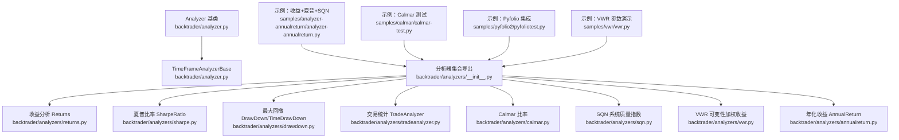
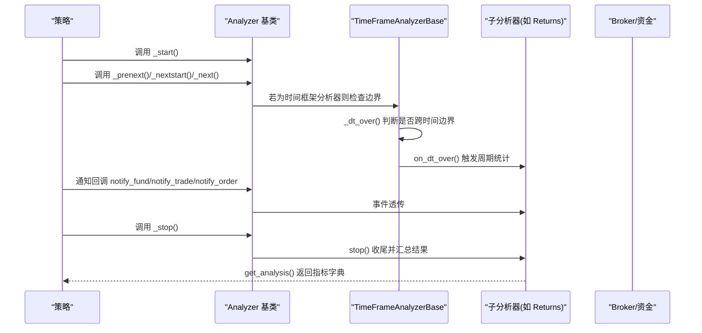
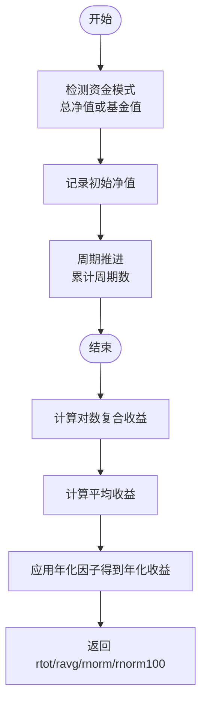
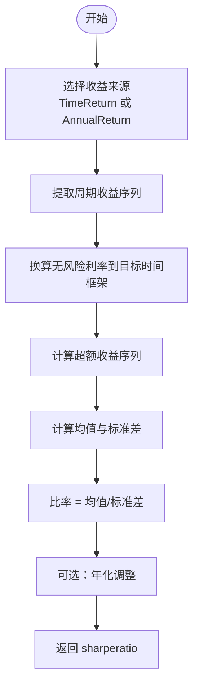
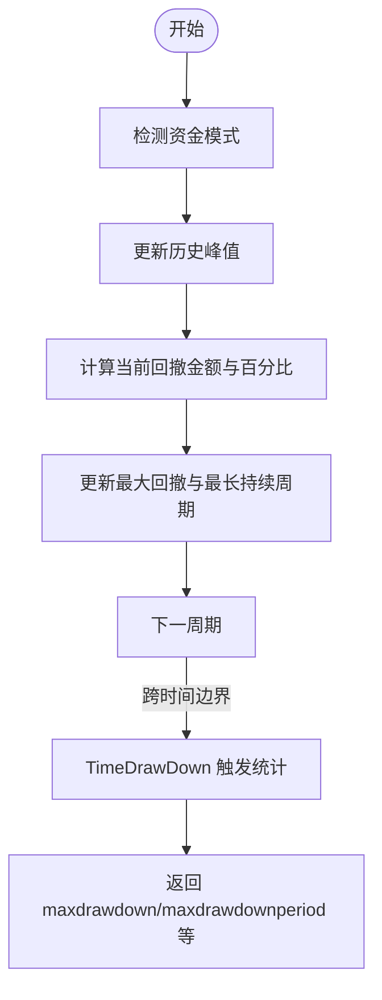
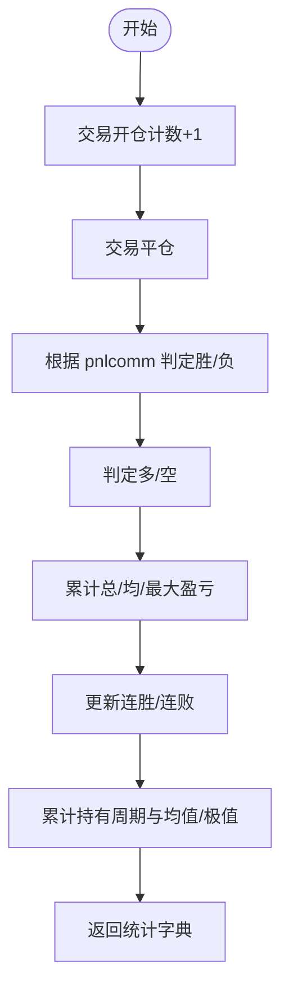
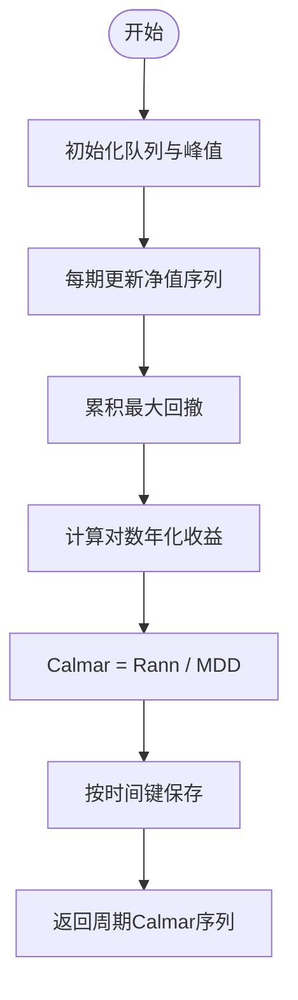
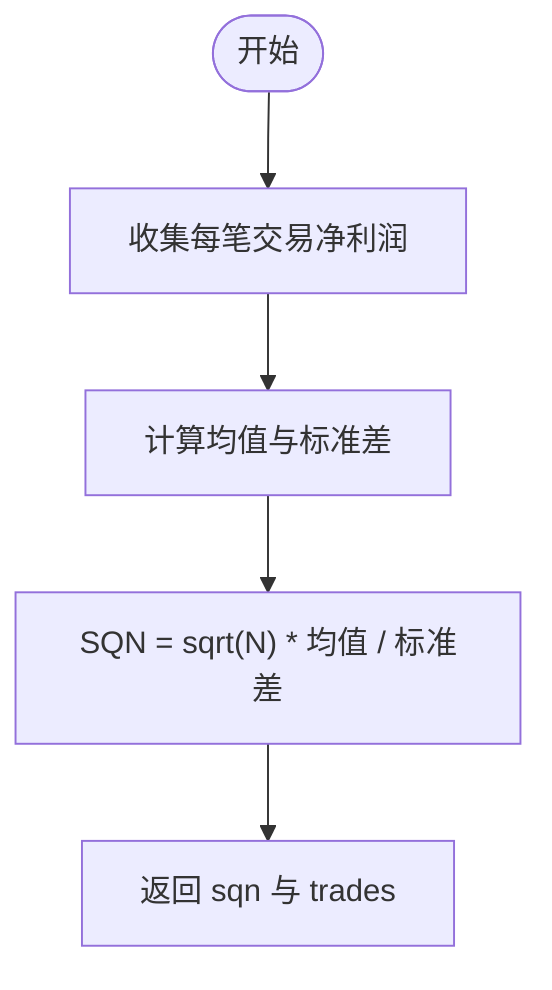
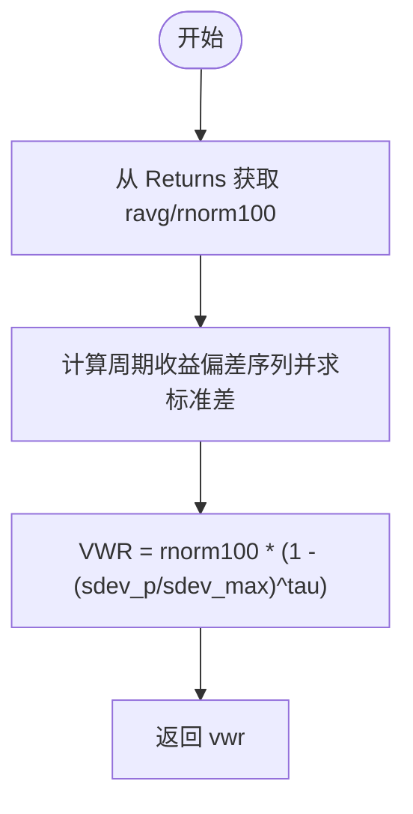
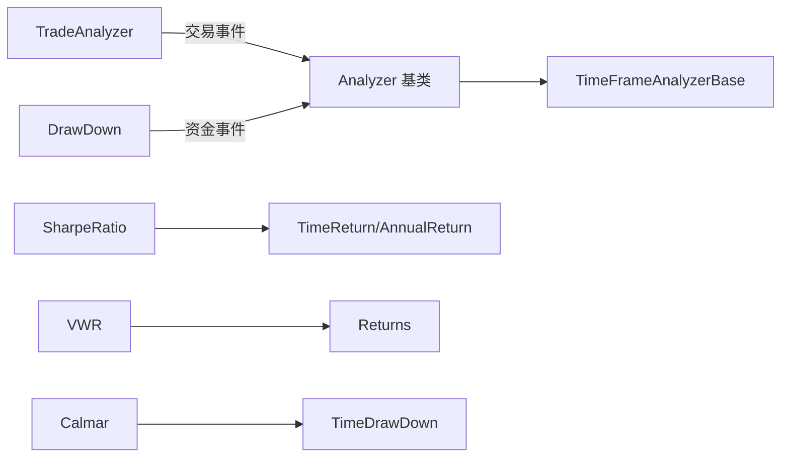

# 分析工具

<cite>
**本文引用的文件**
- [backtrader/analyzer.py](file://backtrader/analyzer.py)
- [backtrader/analyzers/__init__.py](file://backtrader/analyzers/__init__.py)
- [backtrader/analyzers/returns.py](file://backtrader/analyzers/returns.py)
- [backtrader/analyzers/sharpe.py](file://backtrader/analyzers/sharpe.py)
- [backtrader/analyzers/drawdown.py](file://backtrader/analyzers/drawdown.py)
- [backtrader/analyzers/tradeanalyzer.py](file://backtrader/analyzers/tradeanalyzer.py)
- [backtrader/analyzers/calmar.py](file://backtrader/analyzers/calmar.py)
- [backtrader/analyzers/sqn.py](file://backtrader/analyzers/sqn.py)
- [backtrader/analyzers/vwr.py](file://backtrader/analyzers/vwr.py)
- [backtrader/analyzers/annualreturn.py](file://backtrader/analyzers/annualreturn.py)
- [samples/analyzer-annualreturn/analyzer-annualreturn.py](file://samples/analyzer-annualreturn/analyzer-annualreturn.py)
- [samples/calmar/calmar-test.py](file://samples/calmar/calmar-test.py)
- [samples/pyfolio2/pyfoliotest.py](file://samples/pyfolio2/pyfoliotest.py)
- [samples/vwr/vwr.py](file://samples/vwr/vwr.py)
</cite>

## 目录
1. [简介](#简介)
2. [项目结构](#项目结构)
3. [核心组件](#核心组件)
4. [架构总览](#架构总览)
5. [详细组件分析](#详细组件分析)
6. [依赖分析](#依赖分析)
7. [性能考量](#性能考量)
8. [故障排查指南](#故障排查指南)
9. [结论](#结论)
10. [附录：配置与解读示例](#附录配置与解读示例)

## 简介
本章节面向Backtrader分析工具体系，系统梳理内置分析器的功能特性、实现原理与使用方法，覆盖收益分析、风险评估、夏普比率、最大回撤、Calmar比率、系统质量指数（SQN）、可变性加权收益（VWR）等关键指标，并深入解析分析器基类的设计架构（数据收集、统计计算、结果输出），给出自定义分析器的开发步骤与最佳实践，最后提供多维度性能评估建议与结果解读指引。

## 项目结构
Backtrader的分析器模块位于backtrader/analyzers目录，统一由backtrader/analyzers/__init__.py导出；核心基类Analyzer与时间框架基类TimeFrameAnalyzerBase位于backtrader/analyzer.py。示例代码位于samples目录下，展示如何在策略中添加与读取分析器结果。

**图示来源**
- [backtrader/analyzer.py](file://backtrader/analyzer.py#L89-L447)
- [backtrader/analyzers/__init__.py](file://backtrader/analyzers/__init__.py#L27-L44)

**章节来源**
- [backtrader/analyzers/__init__.py](file://backtrader/analyzers/__init__.py#L27-L44)

## 核心组件
- Analyzer基类：定义分析器生命周期（start/next/prenext/nextstart/stop）、通知回调（notify_*）、结果容器（create_analysis/get_analysis）与打印输出（print/pprint）。支持父子分析器树形注册与事件透传。
- TimeFrameAnalyzerBase：在Analyzer基础上按时间边界触发on_dt_over，便于按日/周/月/年等周期统计。
- 各内置分析器：Returns、SharpeRatio、DrawDown/TimeDrawDown、TradeAnalyzer、Calmar、SQN、VWR、AnnualReturn等，分别实现特定指标的采集与计算。

**章节来源**
- [backtrader/analyzer.py](file://backtrader/analyzer.py#L89-L287)
- [backtrader/analyzer.py](file://backtrader/analyzer.py#L299-L447)

## 架构总览
分析器与策略的交互遵循Backtrader的“策略驱动”范式：策略在每个周期调用next/prenext/nextstart时，分析器同步收到对应生命周期回调；同时，分析器通过通知接口接收订单、交易、资金变化等事件，以完成统计。

**图示来源**
- [backtrader/analyzer.py](file://backtrader/analyzer.py#L148-L201)
- [backtrader/analyzer.py](file://backtrader/analyzer.py#L315-L344)
- [backtrader/analyzer.py](file://backtrader/analyzer.py#L346-L446)

## 详细组件分析

### 收益分析（Returns）
- 功能：基于对数收益率计算总复合收益、平均收益、年化/标准化收益，并支持资金模式（总净值 vs 基金值）。
- 关键点：
  - 使用策略期初/期末净值计算对数复合收益。
  - 平均收益按周期计数累加，再乘以年化因子得到年化收益。
  - 时间框架参数用于确定年化周期（日252、周52、月12、年1）。
- 使用场景：衡量策略整体回报水平与时间尺度归一化后的表现。

**图示来源**
- [backtrader/analyzers/returns.py](file://backtrader/analyzers/returns.py#L104-L156)

**章节来源**
- [backtrader/analyzers/returns.py](file://backtrader/analyzers/returns.py#L30-L156)

### 夏普比率（SharpeRatio）
- 功能：基于无风险利率与收益波动计算夏普比率，支持不同时间框架与年化转换。
- 关键点：
  - 可选择使用TimeReturn或旧版AnnualReturn作为收益来源。
  - 支持按时间框架换算无风险利率与收益，以及样本标准差修正（Bessel校正）。
  - 可直接输出年化夏普比率。
- 使用场景：评估单位风险所获得的超额收益，常用于择优排序。

**图示来源**
- [backtrader/analyzers/sharpe.py](file://backtrader/analyzers/sharpe.py#L134-L207)

**章节来源**
- [backtrader/analyzers/sharpe.py](file://backtrader/analyzers/sharpe.py#L33-L222)

### 最大回撤（DrawDown / TimeDrawDown）
- 功能：跟踪净值峰值与当前回撤，统计绝对金额与百分比、最大回撤与最长持续周期。
- 关键点：
  - DrawDown：实时更新峰值与回撤，适合按周期输出。
  - TimeDrawDown：按指定时间框架（年/月/日等）在边界触发时统计一次。
- 使用场景：衡量策略潜在最大损失与恢复能力，是风控的重要指标。

**图示来源**
- [backtrader/analyzers/drawdown.py](file://backtrader/analyzers/drawdown.py#L67-L111)
- [backtrader/analyzers/drawdown.py](file://backtrader/analyzers/drawdown.py#L164-L198)

**章节来源**
- [backtrader/analyzers/drawdown.py](file://backtrader/analyzers/drawdown.py#L31-L198)

### 交易统计（TradeAnalyzer）
- 功能：统计已平仓交易的总数、胜率/连败、盈亏总额/均值/最大单笔、多空分布、持有周期等。
- 关键点：
  - 使用AutoOrderedDict自动扩展字段，避免空交易时的空字典。
  - 对胜/负、多/空、胜负持有周期等维度进行聚合。
- 使用场景：从交易层面评估策略稳定性与信号质量。

**图示来源**
- [backtrader/analyzers/tradeanalyzer.py](file://backtrader/analyzers/tradeanalyzer.py#L76-L209)

**章节来源**
- [backtrader/analyzers/tradeanalyzer.py](file://backtrader/analyzers/tradeanalyzer.py#L31-L209)

### Calmar 比率（Calmar）
- 功能：滚动计算年化对数收益率与最大回撤之比，常用于月度窗口。
- 关键点：
  - 内部组合TimeDrawDown获取最大回撤，结合Returns的对数年化收益。
  - 以dtkey为键输出各周期Calmar值。
- 使用场景：强调收益与最大回撤的相对水平，适合滚动评估。

**图示来源**
- [backtrader/analyzers/calmar.py](file://backtrader/analyzers/calmar.py#L83-L114)

**章节来源**
- [backtrader/analyzers/calmar.py](file://backtrader/analyzers/calmar.py#L31-L114)

### 系统质量指数（SQN）
- 功能：基于交易数量、平均利润与利润标准差计算SQN，用于分类系统质量等级。
- 关键点：
  - 仅在有足够交易数（通常≥30）时可靠。
  - 输出SQN与交易数。
- 使用场景：快速评估策略系统质量与稳定性。

**图示来源**
- [backtrader/analyzers/sqn.py](file://backtrader/analyzers/sqn.py#L63-L86)

**章节来源**
- [backtrader/analyzers/sqn.py](file://backtrader/analyzers/sqn.py#L31-L86)

### 可变性加权收益（VWR）
- 功能：在对数收益基础上引入波动惩罚项，得到更稳健的收益度量。
- 关键点：
  - 依赖Returns获取平均与年化收益，结合周期内收益偏差的标准差。
  - 通过参数tau与sdev_max控制惩罚强度。
- 使用场景：在高波动环境下更保守地评估收益。

**图示来源**
- [backtrader/analyzers/vwr.py](file://backtrader/analyzers/vwr.py#L114-L171)

**章节来源**
- [backtrader/analyzers/vwr.py](file://backtrader/analyzers/vwr.py#L32-L174)

### 年化收益（AnnualReturn）
- 功能：按自然年边界计算每年收益，返回年份到收益的映射。
- 关键点：
  - 遍历数据，识别年变更点并计算年化收益。
- 使用场景：年度维度的收益对比与趋势观察。

**章节来源**
- [backtrader/analyzers/annualreturn.py](file://backtrader/analyzers/annualreturn.py#L30-L90)

## 依赖分析
- Analyzer与TimeFrameAnalyzerBase构成分析器层次结构，前者提供通用生命周期与通知机制，后者提供时间边界触发能力。
- 具体分析器之间存在组合关系：SharpeRatio组合TimeReturn或AnnualReturn；VWR组合Returns；Calmar组合TimeDrawDown。
- 示例脚本通过Cerebro.addanalyzer注册分析器，并在策略结束后读取get_analysis结果。

**图示来源**
- [backtrader/analyzer.py](file://backtrader/analyzer.py#L89-L447)
- [backtrader/analyzers/sharpe.py](file://backtrader/analyzers/sharpe.py#L134-L142)
- [backtrader/analyzers/vwr.py](file://backtrader/analyzers/vwr.py#L114-L118)
- [backtrader/analyzers/calmar.py](file://backtrader/analyzers/calmar.py#L84-L85)

**章节来源**
- [backtrader/analyzers/__init__.py](file://backtrader/analyzers/__init__.py#L27-L44)

## 性能考量
- 计算复杂度
  - Returns/SharpeRatio/VWR/Calmar等涉及周期遍历与统计（均值/标准差），时间复杂度近似O(T)，空间复杂度取决于存储的周期序列长度。
  - TradeAnalyzer在每次交易平仓时增量更新，摊销成本低。
- I/O与内存
  - 使用AutoOrderedDict/OrderedDict减少动态键创建开销；必要时在stop阶段调用_close以冻结结构，避免运行期过度分配。
- 时间框架与边界
  - TimeFrameAnalyzerBase通过_dt_over与_on_dt_over在边界触发统计，避免在每个bar重复计算，提高效率。
- 结果输出
  - print/pprint用于调试；生产环境建议使用WriterFile输出到文件或流。

[本节为通用指导，无需列出具体文件来源]

## 故障排查指南
- 夏普比率为空或异常
  - 检查收益序列长度与标准差是否为零；确认无风险利率换算与年化开关设置正确。
  - 参考路径：[backtrader/analyzers/sharpe.py](file://backtrader/analyzers/sharpe.py#L182-L202)
- 回撤为负或NaN
  - 确认资金模式（总净值/基金值）与起始/终止净值非零；检查边界触发时机。
  - 参考路径：[backtrader/analyzers/drawdown.py](file://backtrader/analyzers/drawdown.py#L116-L198)
- SQN不可靠
  - 交易数过少会导致估计不稳定；建议≥30笔交易。
  - 参考路径：[backtrader/analyzers/sqn.py](file://backtrader/analyzers/sqn.py#L74-L82)
- VWR为None
  - 检查Returns子分析器是否成功生成ravg/rnorm100；确认周期内偏差序列非空。
  - 参考路径：[backtrader/analyzers/vwr.py](file://backtrader/analyzers/vwr.py#L144-L160)

**章节来源**
- [backtrader/analyzers/sharpe.py](file://backtrader/analyzers/sharpe.py#L182-L202)
- [backtrader/analyzers/drawdown.py](file://backtrader/analyzers/drawdown.py#L116-L198)
- [backtrader/analyzers/sqn.py](file://backtrader/analyzers/sqn.py#L74-L82)
- [backtrader/analyzers/vwr.py](file://backtrader/analyzers/vwr.py#L144-L160)

## 结论
Backtrader分析器体系以Analyzer/TimeFrameAnalyzerBase为核心，提供了覆盖收益、风险、交易行为与综合质量的完整指标集。通过清晰的生命周期与事件通知机制，分析器能够高效、准确地完成统计与输出。实践中应结合多种指标进行多维评估，并依据具体策略特征选择合适的时间框架与参数设置。

[本节为总结性内容，无需列出具体文件来源]

## 附录：配置与解读示例

### 在策略中添加分析器与读取结果
- 示例1：收益+夏普+SQN（支持年化与时间框架切换）
  - 添加方式与读取：参考路径
    - [samples/analyzer-annualreturn/analyzer-annualreturn.py](file://samples/analyzer-annualreturn/analyzer-annualreturn.py#L160-L171)
    - [samples/analyzer-annualreturn/analyzer-annualreturn.py](file://samples/analyzer-annualreturn/analyzer-annualreturn.py#L173-L174)
- 示例2：Calmar比率
  - 注册与读取：参考路径
    - [samples/calmar/calmar-test.py](file://samples/calmar/calmar-test.py#L65-L77)
- 示例3：Pyfolio集成（返回策略收益、持仓、交易与杠杆）
  - 注册与读取：参考路径
    - [samples/pyfolio2/pyfoliotest.py](file://samples/pyfolio2/pyfoliotest.py#L122-L130)
    - [samples/pyfolio2/pyfoliotest.py](file://samples/pyfolio2/pyfoliotest.py#L154-L176)
- 示例4：VWR参数演示（时间框架、年化因子、惩罚参数）
  - 注册与参数传递：参考路径
    - [samples/vwr/vwr.py](file://samples/vwr/vwr.py#L67-L84)
    - [samples/vwr/vwr.py](file://samples/vwr/vwr.py#L106-L160)

### 指标解读要点
- 收益类（Returns）
  - rtot：总复合收益，反映策略长期复利效果。
  - ravg/rnorm：平均收益与年化收益，用于比较不同时间尺度的回报。
- 风险类（DrawDown/TimeDrawDown）
  - maxdrawdown/maxdrawdownperiod：最大回撤幅度与持续周期，衡量最大潜在损失与恢复时间。
- 综合类（SharpeRatio/SQN/VWR/Calmar）
  - 夏普：单位风险超额收益，偏好更高数值。
  - SQN：系统质量等级参考，交易数需充足。
  - VWR：考虑波动惩罚的收益修正，适合高波动策略。
  - Calmar：年化收益与最大回撤的比值，滚动窗口评估。

[本节为使用与解读示例，已在相应路径标注来源]