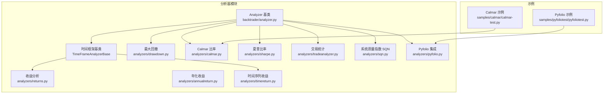
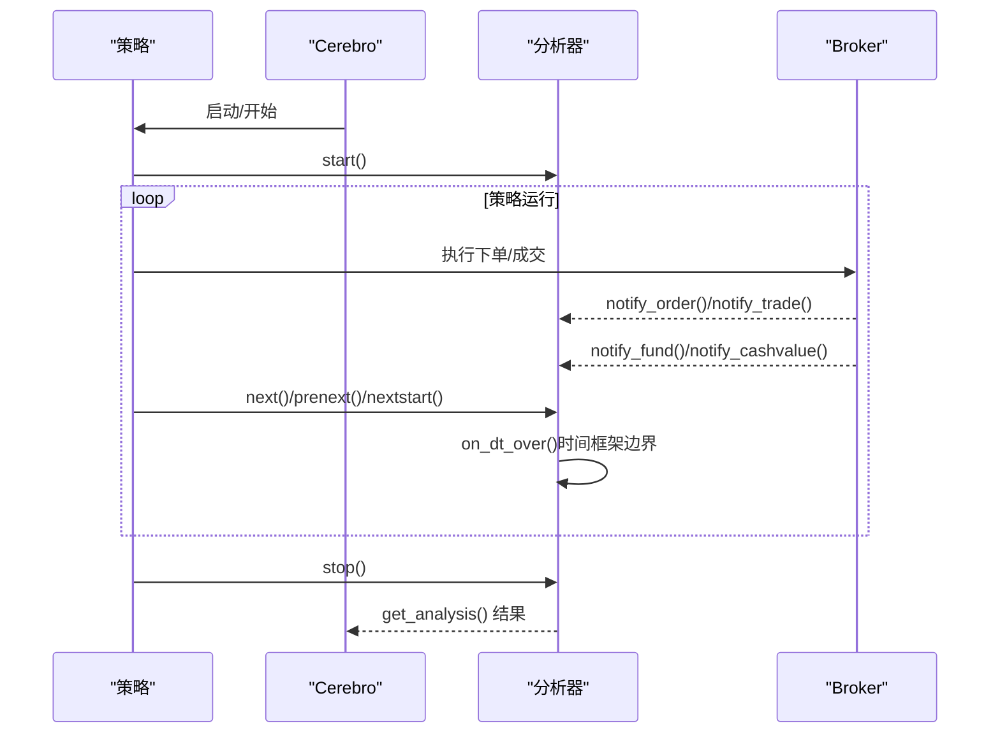
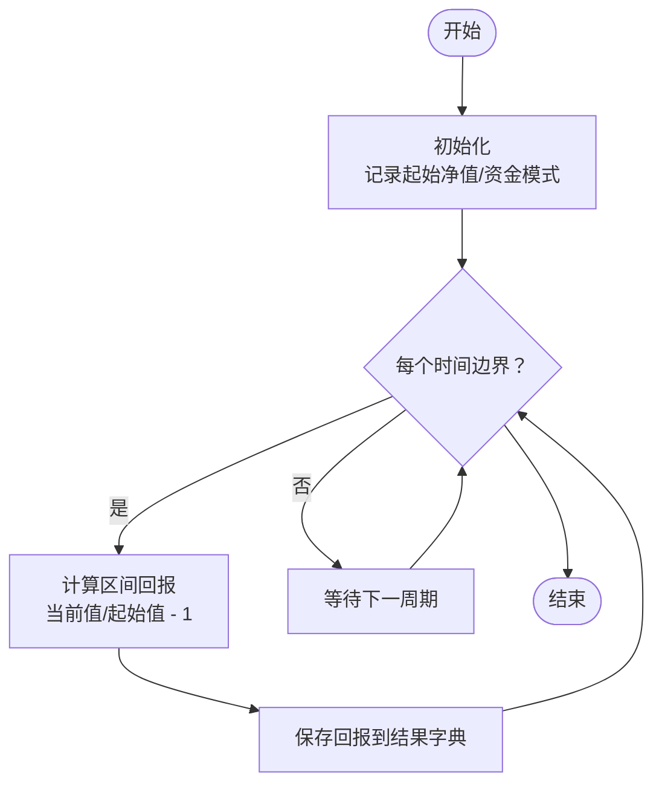
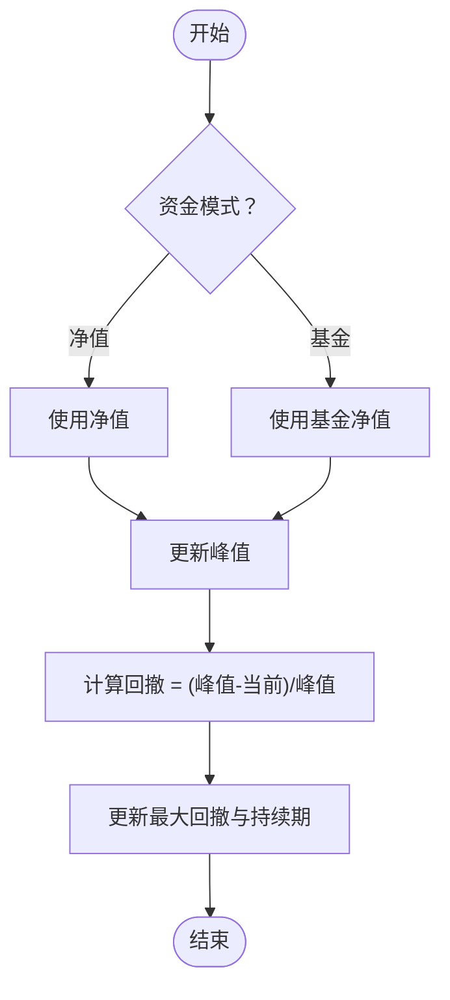
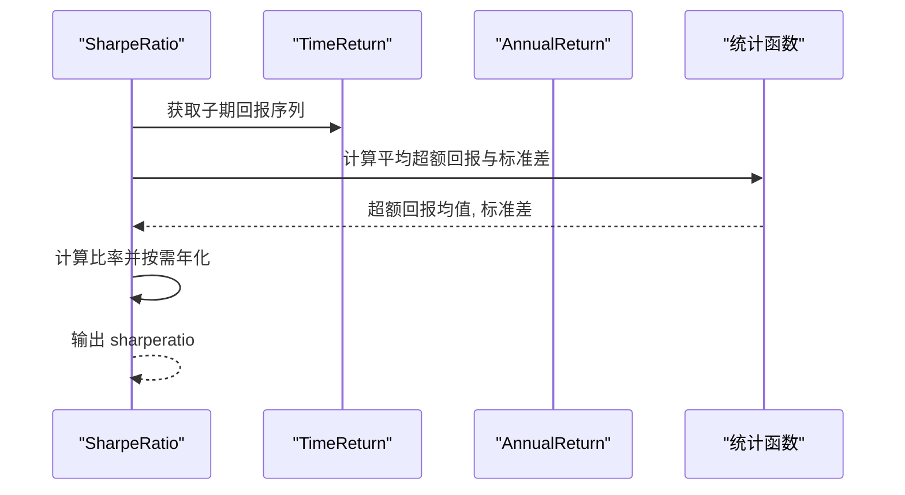
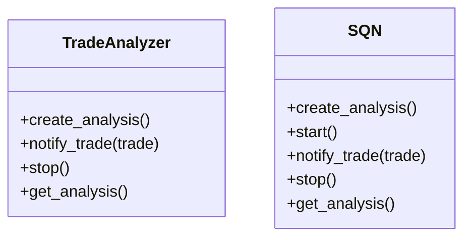
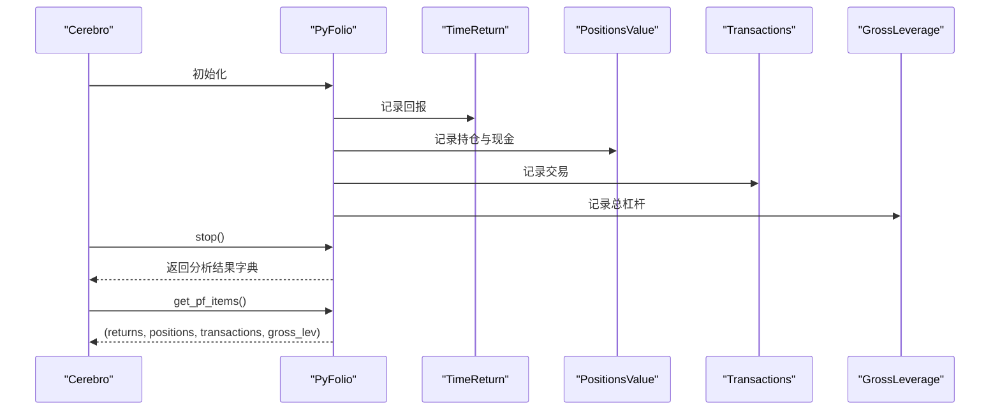
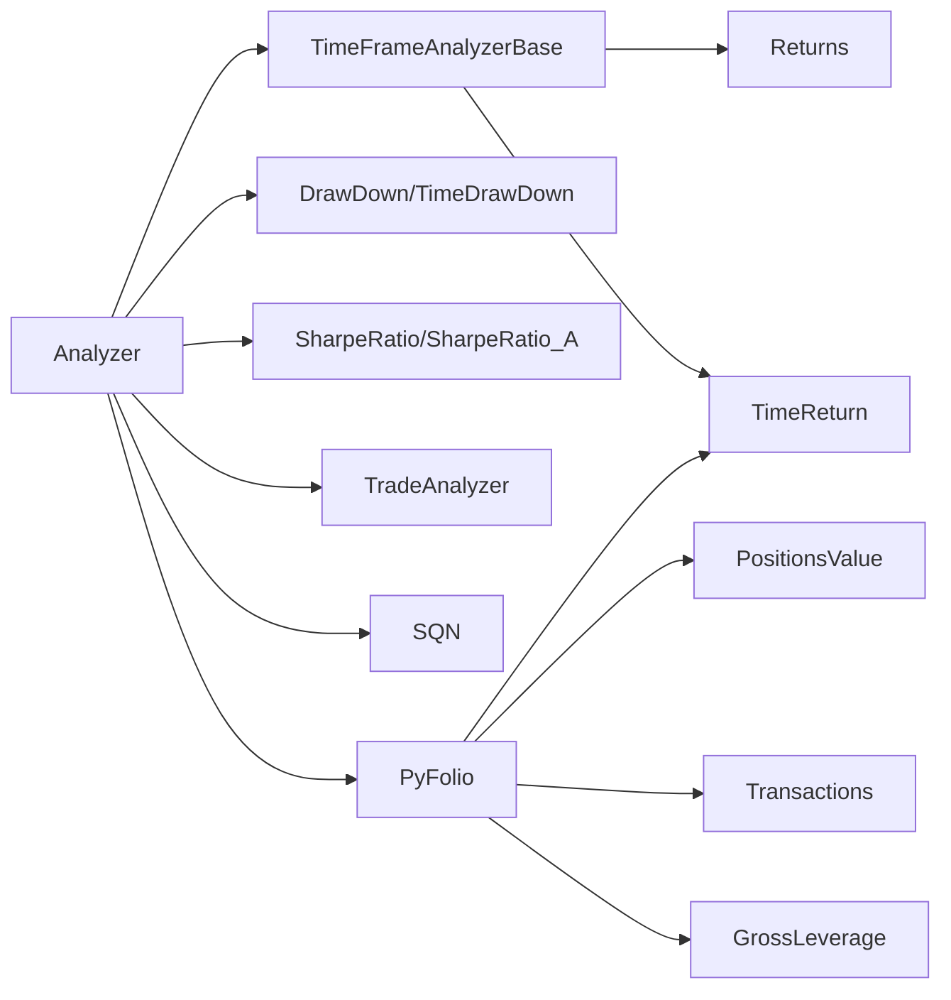

# 性能分析与评估

<cite>
**本文引用的文件**
- [analyzer.py](file://backtrader/analyzer.py)
- [analyzers/__init__.py](file://backtrader/analyzers/__init__.py)
- [analyzers/pyfolio.py](file://backtrader/analyzers/pyfolio.py)
- [analyzers/tradeanalyzer.py](file://backtrader/analyzers/tradeanalyzer.py)
- [analyzers/returns.py](file://backtrader/analyzers/returns.py)
- [analyzers/calmar.py](file://backtrader/analyzers/calmar.py)
- [analyzers/drawdown.py](file://backtrader/analyzers/drawdown.py)
- [analyzers/sharpe.py](file://backtrader/analyzers/sharpe.py)
- [analyzers/sqn.py](file://backtrader/analyzers/sqn.py)
- [analyzers/annualreturn.py](file://backtrader/analyzers/annualreturn.py)
- [analyzers/timereturn.py](file://backtrader/analyzers/timereturn.py)
- [samples/pyfoliotest/pyfoliotest.py](file://samples/pyfoliotest/pyfoliotest.py)
- [samples/calmar/calmar-test.py](file://samples/calmar/calmar-test.py)
</cite>

## 目录
1. [引言](#引言)
2. [项目结构](#项目结构)
3. [核心组件](#核心组件)
4. [架构总览](#架构总览)
5. [详细组件分析](#详细组件分析)
6. [依赖关系分析](#依赖关系分析)
7. [性能考量](#性能考量)
8. [故障排查指南](#故障排查指南)
9. [结论](#结论)
10. [附录](#附录)

## 引言
本指南面向使用 Backtrader 进行策略性能分析与评估的用户，系统讲解如何综合运用内置分析器进行收益稳定性、风险控制与夏普比率优化等方面的评估，并结合专业量化分析工具（如 Pyfolio）进行深度分析。文档覆盖关键指标的含义与计算方法，提供最佳实践与策略优化方向，并给出与 Pyfolio 的集成流程。

## 项目结构
Backtrader 的分析能力由“分析器”体系提供，核心位于 backtrader/analyzers 目录，包含多种内置分析器；同时通过 backtrader/analyzer.py 提供统一的基类与时间框架支持。示例代码位于 samples 目录，展示如何在实盘或回测中添加分析器并输出结果。

**图示来源**
- [analyzer.py](file://backtrader/analyzer.py#L89-L287)
- [analyzers/__init__.py](file://backtrader/analyzers/__init__.py#L24-L44)
- [analyzers/returns.py](file://backtrader/analyzers/returns.py#L30-L156)
- [analyzers/annualreturn.py](file://backtrader/analyzers/annualreturn.py#L30-L90)
- [analyzers/timereturn.py](file://backtrader/analyzers/timereturn.py#L27-L143)
- [analyzers/drawdown.py](file://backtrader/analyzers/drawdown.py#L31-L198)
- [analyzers/calmar.py](file://backtrader/analyzers/calmar.py#L31-L114)
- [analyzers/sharpe.py](file://backtrader/analyzers/sharpe.py#L33-L222)
- [analyzers/tradeanalyzer.py](file://backtrader/analyzers/tradeanalyzer.py#L31-L209)
- [analyzers/sqn.py](file://backtrader/analyzers/sqn.py#L31-L86)
- [analyzers/pyfolio.py](file://backtrader/analyzers/pyfolio.py#L33-L164)
- [samples/pyfoliotest/pyfoliotest.py](file://samples/pyfoliotest/pyfoliotest.py#L85-L140)
- [samples/calmar/calmar-test.py](file://samples/calmar/calmar-test.py#L43-L81)

**章节来源**
- [analyzer.py](file://backtrader/analyzer.py#L89-L287)
- [analyzers/__init__.py](file://backtrader/analyzers/__init__.py#L24-L44)

## 核心组件
- Analyzer 基类：定义分析器生命周期（start/next/prenext/nextstart/stop）、通知回调（notify_trade/notify_order/notify_cashvalue/notify_fund），以及返回分析结果的接口。
- TimeFrameAnalyzerBase：基于时间框架的分析器基类，提供按日/周/月/年或分钟级压缩的时间边界判断与触发逻辑。
- 内置分析器：涵盖收益、回撤、夏普比率、Calmar 比率、交易统计、系统质量指数（SQN）以及与 Pyfolio 的集成分析器。

关键职责与交互要点：
- 生命周期：分析器在策略运行期间接收通知并在合适时机计算指标。
- 时间框架：通过时间边界事件（on_dt_over）实现周期性指标更新。
- 结果输出：统一通过 get_analysis 返回字典或有序字典，便于打印与导出。

**章节来源**
- [analyzer.py](file://backtrader/analyzer.py#L89-L287)
- [analyzer.py](file://backtrader/analyzer.py#L299-L447)

## 架构总览
Backtrader 的分析器遵循统一的生命周期与通知机制，所有分析器均继承自 Analyzer 或 TimeFrameAnalyzerBase。策略运行时，分析器通过回调函数接收订单、交易、资金与净值变化等事件，并在时间边界或结束阶段汇总指标。

**图示来源**
- [analyzer.py](file://backtrader/analyzer.py#L148-L201)
- [analyzer.py](file://backtrader/analyzer.py#L343-L360)

## 详细组件分析

### 收益稳定性分析
- 年化收益（Returns）
  - 计算对数复合收益、平均收益与年化/标准化收益，支持按日/周/月/年时间框架与压缩参数。
  - 关键点：对数收益避免简单回报相加的问题，适合长期复合评估。
- 时间序列收益（TimeReturn）
  - 在时间边界处记录期初与期末价值，计算区间回报，支持跟踪单一数据或组合净值。
- 年度收益（AnnualReturn）
  - 按自然年计算年度回报，便于跨年比较。

**图示来源**
- [analyzers/returns.py](file://backtrader/analyzers/returns.py#L104-L156)
- [analyzers/timereturn.py](file://backtrader/analyzers/timereturn.py#L125-L143)
- [analyzers/annualreturn.py](file://backtrader/analyzers/annualreturn.py#L50-L90)

**章节来源**
- [analyzers/returns.py](file://backtrader/analyzers/returns.py#L30-L156)
- [analyzers/timereturn.py](file://backtrader/analyzers/timereturn.py#L27-L143)
- [analyzers/annualreturn.py](file://backtrader/analyzers/annualreturn.py#L30-L90)

### 风险控制分析
- 最大回撤（DrawDown/TimeDrawDown）
  - 跟踪净值峰值与当前回撤，统计最大回撤金额、百分比与持续长度；支持按时间框架滚动更新。
- Calmar 比率（Calmar）
  - 年化对数回报除以最大回撤，常用于衡量每单位最大回撤所获得的收益。

**图示来源**
- [analyzers/drawdown.py](file://backtrader/analyzers/drawdown.py#L67-L111)
- [analyzers/drawdown.py](file://backtrader/analyzers/drawdown.py#L164-L198)
- [analyzers/calmar.py](file://backtrader/analyzers/calmar.py#L87-L114)

**章节来源**
- [analyzers/drawdown.py](file://backtrader/analyzers/drawdown.py#L31-L198)
- [analyzers/calmar.py](file://backtrader/analyzers/calmar.py#L31-L114)

### 夏普比率优化
- 夏普比率（SharpeRatio/SharpeRatio_A）
  - 使用无风险利率（可按时间框架换算）与回报标准差计算超额收益比率；支持样本修正（Bessel’s correction）与年化输出。
  - 可选择使用 TimeReturn 或 AnnualReturn 子分析器作为回报来源。

**图示来源**
- [analyzers/sharpe.py](file://backtrader/analyzers/sharpe.py#L134-L207)

**章节来源**
- [analyzers/sharpe.py](file://backtrader/analyzers/sharpe.py#L33-L222)

### 交易质量与稳定性
- 交易分析（TradeAnalyzer）
  - 统计总开平仓次数、胜率/连败、净利/平均/最大盈亏、多空分布、持有周期等。
- 系统质量指数（SQN）
  - 基于交易利润序列的统计量，衡量系统质量等级。

**图示来源**
- [analyzers/tradeanalyzer.py](file://backtrader/analyzers/tradeanalyzer.py#L31-L209)
- [analyzers/sqn.py](file://backtrader/analyzers/sqn.py#L31-L86)

**章节来源**
- [analyzers/tradeanalyzer.py](file://backtrader/analyzers/tradeanalyzer.py#L31-L209)
- [analyzers/sqn.py](file://backtrader/analyzers/sqn.py#L31-L86)

### 与 Pyfolio 的集成
- PyFolio 分析器
  - 聚合四个子分析器：TimeReturn、PositionsValue、Transactions、GrossLeverage，生成 Pyfolio 所需的回报、持仓、交易与总杠杆序列。
  - 提供 get_pf_items 将内部结构转换为 pandas DataFrame，直接传入 Pyfolio 的分析函数。
- 示例用法
  - 在 cerebro 中添加 PyFolio 分析器，运行后从分析器获取四元组并调用 Pyfolio 的全量分析报表。

**图示来源**
- [analyzers/pyfolio.py](file://backtrader/analyzers/pyfolio.py#L86-L164)
- [samples/pyfoliotest/pyfoliotest.py](file://samples/pyfoliotest/pyfoliotest.py#L110-L137)

**章节来源**
- [analyzers/pyfolio.py](file://backtrader/analyzers/pyfolio.py#L33-L164)
- [samples/pyfoliotest/pyfoliotest.py](file://samples/pyfoliotest/pyfoliotest.py#L85-L140)

## 依赖关系分析
- 分析器层次
  - Analyzer 为所有分析器的根，TimeFrameAnalyzerBase 继承自 Analyzer，扩展时间边界处理。
- 内部依赖
  - SharpeRatio 依赖 TimeReturn 或 AnnualReturn 获取回报序列；Calmar 依赖 TimeDrawDown 计算最大回撤；PyFolio 聚合多个子分析器。
- 导出入口
  - analyzers/__init__.py 统一导出各分析器，便于按名称导入。

**图示来源**
- [analyzer.py](file://backtrader/analyzer.py#L89-L287)
- [analyzers/__init__.py](file://backtrader/analyzers/__init__.py#L24-L44)
- [analyzers/pyfolio.py](file://backtrader/analyzers/pyfolio.py#L33-L101)

**章节来源**
- [analyzer.py](file://backtrader/analyzer.py#L89-L287)
- [analyzers/__init__.py](file://backtrader/analyzers/__init__.py#L24-L44)

## 性能考量
- 计算复杂度
  - 时间序列收益与回撤通常为 O(N) 遍历；夏普比率涉及均值与标准差计算，整体 O(N)。
  - Calmar 滚动窗口需维护队列与最大回撤，注意窗口大小对内存与更新频率的影响。
- 数据流与内存
  - 大型回测中建议按需启用分析器，避免过多实时统计导致内存压力。
- 时间框架选择
  - 日频以上更适合年化指标；分钟级压缩可提升效率但可能损失细节。

## 故障排查指南
- 回报为负或无穷
  - 对数回报在净值为 0 或负值时会得到无效结果，检查资金模式与净值变化。
- 标准差为零
  - 当回报序列过短或无波动时，夏普比率无法计算，应检查数据长度与波动性。
- 最大回撤异常
  - 确认资金模式一致（净值 vs 基金净值），并确保时间边界事件正确触发。
- Pyfolio 输入格式
  - 确保 pandas 安装且 get_pf_items 能成功转换为 DataFrame；检查索引时区与列名一致性。

**章节来源**
- [analyzers/returns.py](file://backtrader/analyzers/returns.py#L127-L151)
- [analyzers/sharpe.py](file://backtrader/analyzers/sharpe.py#L182-L206)
- [analyzers/drawdown.py](file://backtrader/analyzers/drawdown.py#L90-L111)
- [analyzers/pyfolio.py](file://backtrader/analyzers/pyfolio.py#L115-L164)

## 结论
通过组合使用收益、回撤、夏普比率、Calmar 比率与交易质量分析器，可以全面评估策略的收益稳定性与风险控制水平。结合 Pyfolio 可进一步进行专业层面的因子分解与归因分析。建议在参数优化过程中，优先关注最大回撤与夏普比率的平衡，并辅以交易统计指标验证策略的稳健性。

## 附录

### 关键指标说明与计算要点
- 年化/标准化收益
  - 使用对数复合收益与时间框架换算因子，避免简单线性外推。
- 最大回撤
  - 百分比回撤与持续期是衡量风险的重要指标，建议配合回撤分布与恢复时间分析。
- Calmar 比率
  - 年化对数回报与最大回撤之比，适合跨策略比较。
- 夏普比率
  - 超额回报与波动性的比率，注意无风险利率与时间框架换算的一致性。
- SQN
  - 交易利润序列的统计量，适合作为系统质量的快速筛选指标。

### 最佳实践与优化方向
- 参数优化
  - 以最大回撤不超过阈值为约束，最大化夏普比率或 Calmar 比率。
- 交易质量
  - 提高胜率与改善盈亏比，减少长周期连败，缩短平均持有期。
- 数据质量
  - 确保数据连续性与价格字段完整性，避免因缺失导致的统计偏差。
- 报告与可视化
  - 使用 Pyfolio 生成全量分析报表，结合回撤、收益分布与换手率等维度进行诊断。

### 与 Pyfolio 的集成步骤
- 在 cerebro 中添加 PyFolio 分析器。
- 运行策略后调用 get_pf_items 获取回报、持仓、交易与总杠杆序列。
- 将序列传入 Pyfolio 的分析函数生成报告。

**章节来源**
- [samples/pyfoliotest/pyfoliotest.py](file://samples/pyfoliotest/pyfoliotest.py#L110-L137)
- [analyzers/pyfolio.py](file://backtrader/analyzers/pyfolio.py#L102-L164)