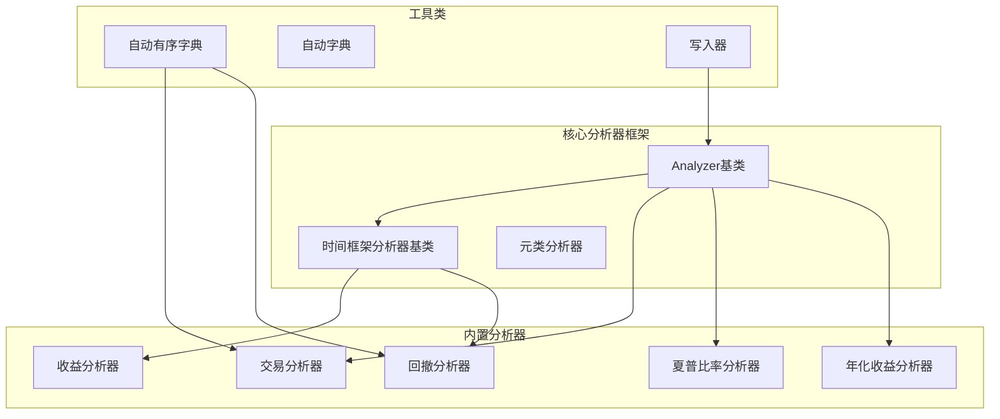
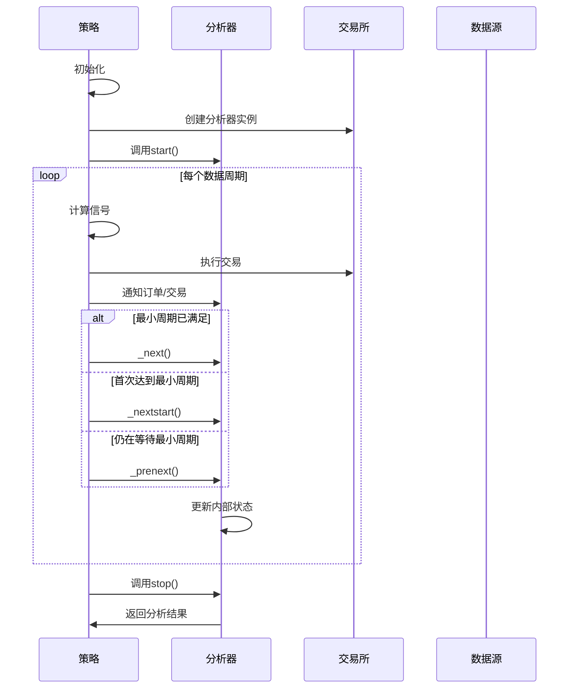
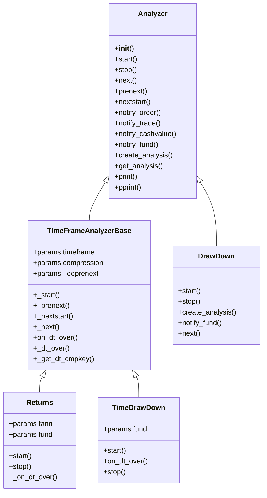
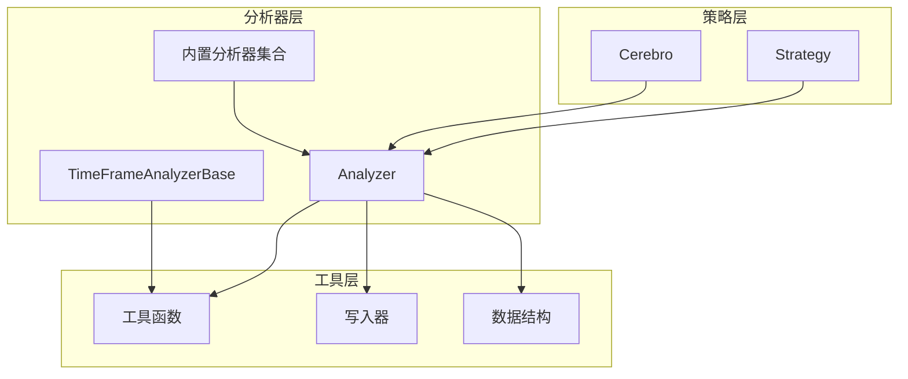

# 自定义分析器开发

<cite>
**本文档引用的文件**
- [analyzer.py](file://backtrader/analyzer.py)
- [strategy.py](file://backtrader/strategy.py)
- [returns.py](file://backtrader/analyzers/returns.py)
- [tradeanalyzer.py](file://backtrader/analyzers/tradeanalyzer.py)
- [drawdown.py](file://backtrader/analyzers/drawdown.py)
- [writer.py](file://backtrader/writer.py)
- [__init__.py](file://backtrader/__init__.py)
- [analyzer-annualreturn.py](file://samples/analyzer-annualreturn/analyzer-annualreturn.py)
- [autodict.py](file://backtrader/utils/autodict.py)
</cite>

## 目录
1. [简介](#简介)
2. [项目结构](#项目结构)
3. [核心组件](#核心组件)
4. [架构概览](#架构概览)
5. [详细组件分析](#详细组件分析)
6. [依赖关系分析](#依赖关系分析)
7. [性能考虑](#性能考虑)
8. [故障排除指南](#故障排除指南)
9. [结论](#结论)
10. [附录](#附录)

## 简介

Backtrader是一个强大的Python量化交易框架，提供了灵活的分析器系统用于策略性能评估和市场数据分析。本文档深入讲解如何继承Analyzer基类创建自定义分析器，包括必要的抽象方法实现、数据收集逻辑和结果计算方法。

分析器是Backtrader框架中的关键组件，它们在策略执行过程中自动收集数据并生成各种统计指标。通过理解分析器的生命周期钩子函数和数据流机制，开发者可以构建从简单统计分析到复杂策略表现评估的各种分析器。

## 项目结构

Backtrader的分析器系统主要由以下几个部分组成：

**图表来源**
- [analyzer.py](file://backtrader/analyzer.py#L89-L447)
- [returns.py](file://backtrader/analyzers/returns.py#L30-L156)
- [tradeanalyzer.py](file://backtrader/analyzers/tradeanalyzer.py#L31-L209)
- [drawdown.py](file://backtrader/analyzers/drawdown.py#L31-L198)

**章节来源**
- [analyzer.py](file://backtrader/analyzer.py#L1-L447)
- [__init__.py](file://backtrader/__init__.py#L52-L52)

## 核心组件

### Analyzer基类

Analyzer是所有分析器的基类，提供了完整的生命周期管理和数据访问接口。其核心特性包括：

- **自动属性设置**：自动为分析器实例设置策略引用和数据访问属性
- **生命周期管理**：提供完整的生命周期钩子函数
- **通知机制**：接收订单、交易、资金等通知
- **结果输出**：支持标准输出和格式化打印

### 生命周期钩子函数

分析器的生命周期包含以下关键阶段：

1. **__init__**：实例化和初始设置
2. **start**：操作开始时的初始化
3. **prenext/nextstart/next**：跟随策略调用的方法族
4. **stop**：操作结束时的清理
5. **dispose**：资源释放（如果需要）

### 数据访问接口

Analyzer基类自动为每个分析器实例设置以下属性：
- `self.strategy`：访问策略及其所有可访问内容
- `self.datas[x]`：访问系统中的数据源数组
- `self.data`：访问第一个数据源
- `self.dataX`：访问指定索引的数据源
- `self.dataX_Y`：访问指定数据源的指定行
- `self.dataX_name`：访问指定数据源的名称

**章节来源**
- [analyzer.py](file://backtrader/analyzer.py#L89-L287)

## 架构概览

Backtrader分析器系统采用事件驱动架构，与策略执行紧密集成：

**图表来源**
- [strategy.py](file://backtrader/strategy.py#L349-L388)
- [analyzer.py](file://backtrader/analyzer.py#L148-L201)

## 详细组件分析

### 时间框架分析器基类

TimeFrameAnalyzerBase扩展了Analyzer基类，提供了基于时间框架的分析能力：

**图表来源**
- [analyzer.py](file://backtrader/analyzer.py#L89-L447)
- [returns.py](file://backtrader/analyzers/returns.py#L30-L156)
- [drawdown.py](file://backtrader/analyzers/drawdown.py#L31-L198)

### 收益分析器实现

Returns分析器展示了如何实现基于时间框架的收益计算：

**关键实现要点**：
1. **参数配置**：支持时间框架、压缩因子和年度化参数
2. **生命周期管理**：在start中初始化起始价值，在stop中计算最终结果
3. **时间框架处理**：使用_on_dt_over方法按时间边界更新计数
4. **结果计算**：计算总复合收益、平均收益和年化收益

**章节来源**
- [returns.py](file://backtrader/analyzers/returns.py#L30-L156)

### 交易分析器实现

TradeAnalyzer展示了如何跟踪和统计交易活动：

**核心功能**：
1. **自动数据结构**：使用AutoOrderedDict自动创建嵌套字典结构
2. **交易状态跟踪**：实时跟踪开仓、平仓和持仓状态
3. **统计指标计算**：计算胜率、盈亏比、最大连续亏损等指标
4. **分类统计**：按方向（多/空）、结果（赢/输）进行分类统计

**章节来源**
- [tradeanalyzer.py](file://backtrader/analyzers/tradeanalyzer.py#L31-L209)

### 回撤分析器实现

DrawDown分析器演示了如何计算和跟踪回撤指标：

**实现特点**：
1. **双模式支持**：支持普通模式和时间框架模式
2. **动态峰值更新**：实时更新历史最高值
3. **长度计算**：跟踪回撤持续时间和最长回撤期
4. **资金模式适配**：自动检测并适配资金管理模式

**章节来源**
- [drawdown.py](file://backtrader/analyzers/drawdown.py#L31-L198)

## 依赖关系分析

分析器系统与其他组件的依赖关系：

**图表来源**
- [strategy.py](file://backtrader/strategy.py#L87-L90)
- [analyzer.py](file://backtrader/analyzer.py#L29-L76)

**章节来源**
- [strategy.py](file://backtrader/strategy.py#L1-L200)
- [analyzer.py](file://backtrader/analyzer.py#L1-L447)

## 性能考虑

### 内存优化策略

1. **延迟初始化**：仅在需要时创建数据结构
2. **自动关闭机制**：使用_auto_close()方法防止动态增长
3. **内存保存模式**：支持可选的内存节省模式

### 计算效率优化

1. **批量处理**：利用时间框架边界进行批量计算
2. **缓存机制**：避免重复计算相同的时间点
3. **条件检查**：在计算前进行必要的条件检查

### 数据结构选择

1. **AutoOrderedDict vs dict**：根据需求选择合适的数据结构
2. **性能权衡**：在灵活性和性能之间找到平衡点
3. **内存占用控制**：合理控制分析器的内存占用

## 故障排除指南

### 常见问题及解决方案

1. **分析器未被调用**
   - 检查是否正确添加到策略中
   - 确认最小周期要求是否满足
   - 验证参数配置是否正确

2. **结果不准确**
   - 检查时间框架设置
   - 确认资金管理模式配置
   - 验证数据源完整性

3. **内存泄漏**
   - 确保在stop中正确清理资源
   - 使用_auto_close()方法关闭动态结构
   - 检查是否有循环引用

### 调试技巧

1. **使用pprint方法**：查看分析器的内部状态
2. **添加日志输出**：在关键方法中添加调试信息
3. **单元测试**：为分析器编写独立的测试用例

**章节来源**
- [analyzer.py](file://backtrader/analyzer.py#L270-L287)
- [writer.py](file://backtrader/writer.py#L177-L200)

## 结论

Backtrader的分析器系统提供了强大而灵活的框架，使开发者能够创建各种类型的分析器来评估策略表现。通过理解分析器的生命周期、数据访问接口和时间框架处理机制，开发者可以构建从基础统计到复杂性能评估的完整分析系统。

关键成功因素包括：
- 正确实现生命周期钩子函数
- 合理设计数据收集和存储结构
- 充分利用Backtrader提供的工具类
- 注重性能优化和内存管理
- 进行充分的测试和调试

## 附录

### 开发最佳实践

1. **参数设计**：合理设计分析器参数，提供清晰的默认值
2. **错误处理**：实现健壮的错误处理机制
3. **文档编写**：为分析器编写清晰的文档和使用示例
4. **兼容性**：确保分析器与不同数据源和时间框架的兼容性

### 示例参考

完整的分析器开发示例可以在以下文件中找到：
- [analyzer-annualreturn.py](file://samples/analyzer-annualreturn/analyzer-annualreturn.py#L160-L170)
- [returns.py](file://backtrader/analyzers/returns.py#L104-L156)
- [tradeanalyzer.py](file://backtrader/analyzers/tradeanalyzer.py#L68-L75)

这些示例展示了从简单到复杂的分析器实现模式，为自定义分析器开发提供了宝贵的参考。