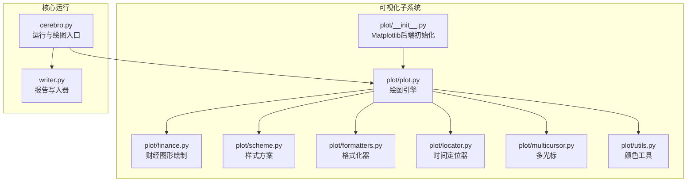
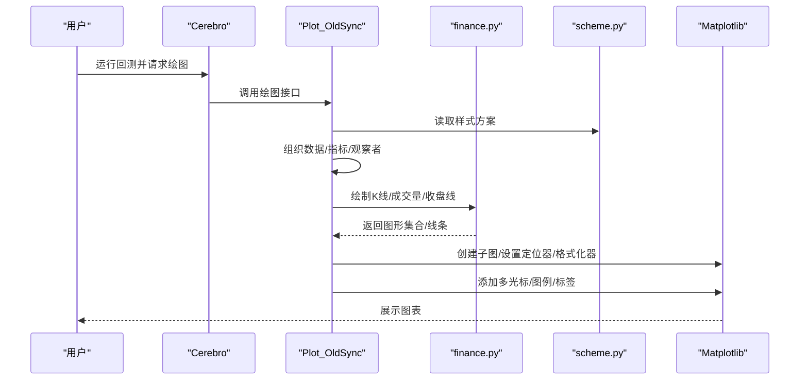
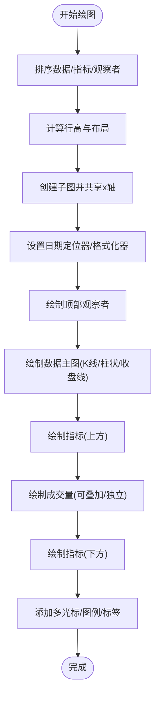
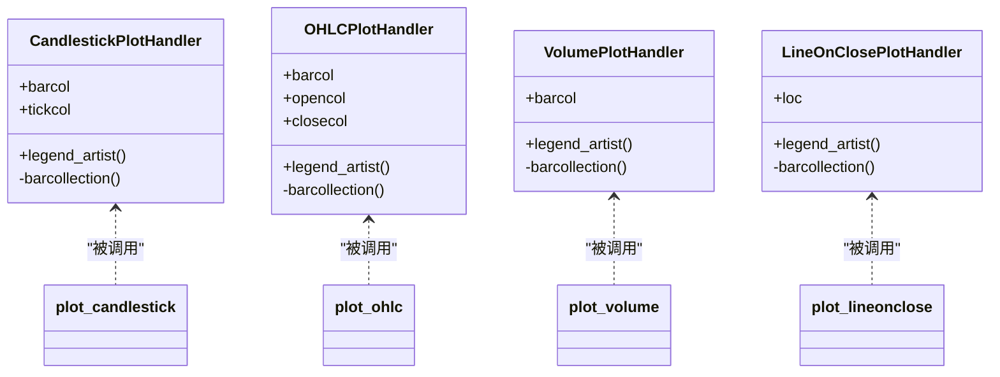
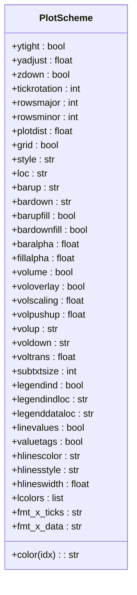
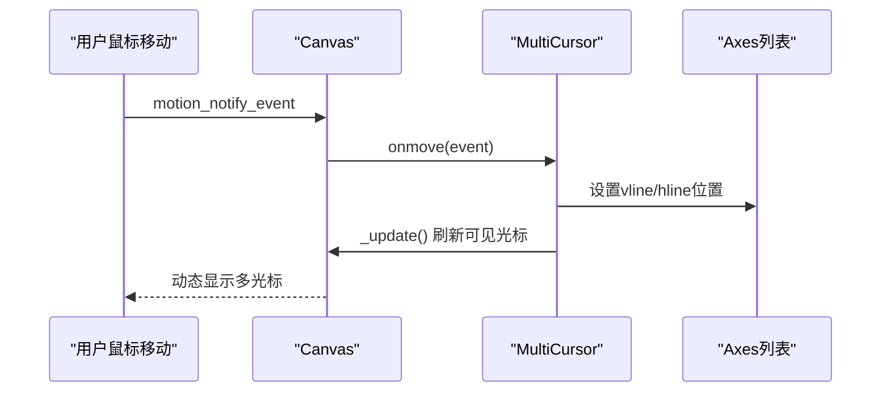
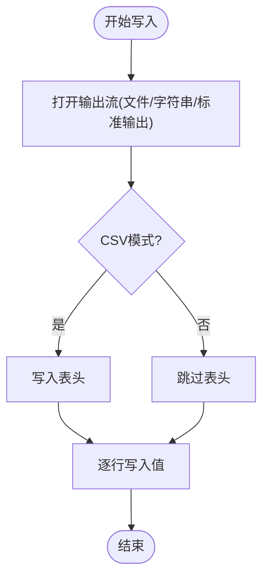
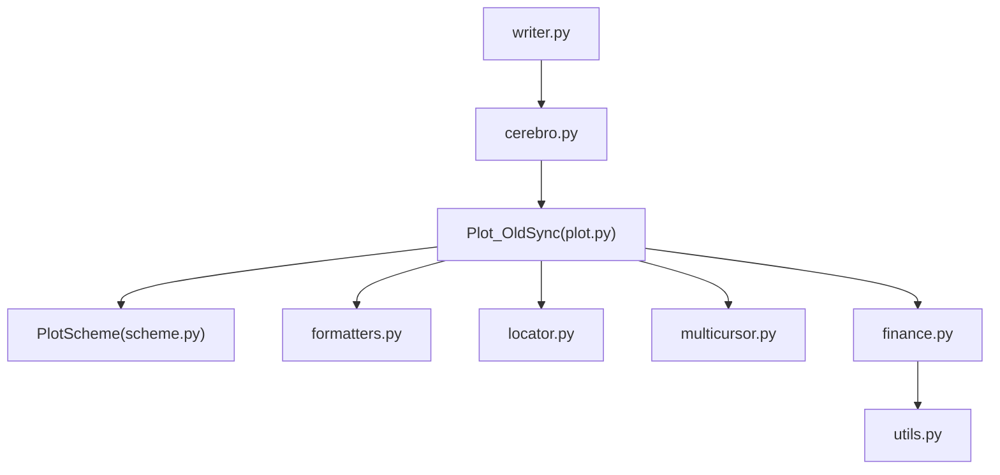

# 可视化系统

<cite>
**本文档引用的文件**
- [backtrader/plot/__init__.py](file://backtrader/plot/__init__.py)
- [backtrader/plot/plot.py](file://backtrader/plot/plot.py)
- [backtrader/plot/finance.py](file://backtrader/plot/finance.py)
- [backtrader/plot/scheme.py](file://backtrader/plot/scheme.py)
- [backtrader/plot/formatters.py](file://backtrader/plot/formatters.py)
- [backtrader/plot/locator.py](file://backtrader/plot/locator.py)
- [backtrader/plot/multicursor.py](file://backtrader/plot/multicursor.py)
- [backtrader/plot/utils.py](file://backtrader/plot/utils.py)
- [backtrader/cerebro.py](file://backtrader/cerebro.py)
- [backtrader/writer.py](file://backtrader/writer.py)
- [samples/lineplotter/lineplotter.py](file://samples/lineplotter/lineplotter.py)
- [samples/partial-plot/partial-plot.py](file://samples/partial-plot/partial-plot.py)
- [samples/plot-same-axis/plot-same-axis.py](file://samples/plot-same-axis/plot-same-axis.py)
</cite>

## 更新摘要
**变更内容**
- 更新了日期格式化系统，增强了MyDateFormatter的灵活性和精度
- 修复了AutoDateLocator和RRuleLocator的索引坐标转换问题
- 增强了多游标交互功能，新增多种配置选项和性能优化
- 改进了时间轴定位器的兼容性和稳定性

## 目录
1. [简介](#简介)
2. [项目结构](#项目结构)
3. [核心组件](#核心组件)
4. [架构总览](#架构总览)
5. [详细组件分析](#详细组件分析)
6. [依赖关系分析](#依赖关系分析)
7. [性能考虑](#性能考虑)
8. [故障排除指南](#故障排除指南)
9. [结论](#结论)
10. [附录](#附录)

## 简介
本文件系统性梳理Backtrader可视化子系统的架构与实现，重点覆盖以下方面：
- 图表绘制架构：Matplotlib集成、数据到图形的映射、多轴与图层管理
- 财经图表能力：K线图、柱状图、成交量图、技术指标叠加图的生成流程
- 样式定制：颜色主题、字体、布局、网格、标签等视觉配置
- 实时监控与交互：多光标联动、日期定位器与格式化器、缩放与平移支持
- 报告生成功能：基于回测结果的文本输出与导出（CSV/文本），以及扩展为PDF/HTML的建议路径

该文档面向不同层次的使用者，既提供高层架构概览，也包含代码级细节与可操作的定制指南。

## 项目结构
Backtrader可视化系统主要位于`backtrader/plot`包中，并通过Cerebro运行期触发绘图。关键模块职责如下：
- plot/__init__.py：导入Matplotlib并设置后端，暴露绘图入口与样式方案
- plot/plot.py：核心绘图引擎，负责策略数据、指标、观察者的组织与渲染
- plot/finance.py：具体财经图形绘制（K线、柱状、成交量、收盘线）
- plot/scheme.py：默认样式方案与配色体系
- plot/formatters.py：日期与成交量格式化器
- plot/locator.py：时间刻度定位器（适配索引坐标系）
- plot/multicursor.py：跨轴多光标交互
- plot/utils.py：颜色工具与标注框路径生成
- cerebro.py：运行回测并调用绘图接口
- writer.py：文本/CSV报告写入器（用于导出分析结果）

**图表来源**
- [backtrader/plot/__init__.py](file://backtrader/plot/__init__.py#L27-L44)
- [backtrader/plot/plot.py](file://backtrader/plot/plot.py#L1-L120)
- [backtrader/plot/finance.py](file://backtrader/plot/finance.py#L211-L240)
- [backtrader/plot/scheme.py](file://backtrader/plot/scheme.py#L77-L190)
- [backtrader/plot/formatters.py](file://backtrader/plot/formatters.py#L30-L125)
- [backtrader/plot/locator.py](file://backtrader/plot/locator.py#L95-L260)
- [backtrader/plot/multicursor.py](file://backtrader/plot/multicursor.py#L95-L240)
- [backtrader/plot/utils.py](file://backtrader/plot/utils.py#L30-L94)
- [backtrader/cerebro.py](file://backtrader/cerebro.py#L60-L120)
- [backtrader/writer.py](file://backtrader/writer.py#L43-L235)

**章节来源**
- [backtrader/plot/__init__.py](file://backtrader/plot/__init__.py#L27-L44)
- [backtrader/plot/plot.py](file://backtrader/plot/plot.py#L1-L120)
- [backtrader/plot/finance.py](file://backtrader/plot/finance.py#L211-L240)
- [backtrader/plot/scheme.py](file://backtrader/plot/scheme.py#L77-L190)
- [backtrader/plot/formatters.py](file://backtrader/plot/formatters.py#L30-L125)
- [backtrader/plot/locator.py](file://backtrader/plot/locator.py#L95-L260)
- [backtrader/plot/multicursor.py](file://backtrader/plot/multicursor.py#L95-L240)
- [backtrader/plot/utils.py](file://backtrader/plot/utils.py#L30-L94)
- [backtrader/cerebro.py](file://backtrader/cerebro.py#L60-L120)
- [backtrader/writer.py](file://backtrader/writer.py#L43-L235)

## 核心组件
- 绘图入口与后端选择
  - 自动检测并设置Matplotlib后端（非macOS使用TKAgg，macOS使用MacOSX），确保在Jupyter等环境中正确渲染
  - 暴露绘图类与样式方案类供外部使用

- 绘图引擎（Plot_OldSync）
  - 将策略中的数据、指标、观察者按subplot规则组织
  - 计算行数比例（主图/副图）、共享x轴、图层z-order、颜色索引
  - 支持分段绘图（多图页）、时间范围裁剪、日期定位器与格式化器
  - 绘制K线/柱状/成交量/收盘线，以及指标线、填充区域、水平线、数值标签

- 财经图形绘制
  - K线图：蜡烛图集合与上下影线集合，支持填充与边框颜色
  - 柱状图：上下影线与开盘/收盘标记
  - 成交量图：基于OHLC的成交量柱状图，支持叠加或独立子图
  - 收盘线：仅连接收盘价的折线图

- 样式方案（PlotScheme）
  - 颜色主题：Tableau系列配色
  - 布局参数：主图/副图行占比、间距、网格、旋转角度
  - 图形参数：K线/柱状/成交量颜色、透明度、填充、叠加与推升
  - 文本与标签：数值标签、图例位置、水平线样式

- 交互与格式化
  - 多光标：跨轴垂直/水平联动，支持动画刷新
  - 定位器：自动时间定位器，适配索引坐标到日期
  - 格式化器：日期格式化、成交量数量单位化显示

- 报告写入器（Writer）
  - 文本/CSV输出，支持分隔符、换行符、计数器、舍入等配置
  - 可作为回测结果导出的基础组件（PDF/HTML需结合外部库）

**章节来源**
- [backtrader/plot/__init__.py](file://backtrader/plot/__init__.py#L27-L44)
- [backtrader/plot/plot.py](file://backtrader/plot/plot.py#L97-L275)
- [backtrader/plot/finance.py](file://backtrader/plot/finance.py#L211-L595)
- [backtrader/plot/scheme.py](file://backtrader/plot/scheme.py#L77-L190)
- [backtrader/plot/multicursor.py](file://backtrader/plot/multicursor.py#L95-L240)
- [backtrader/plot/locator.py](file://backtrader/plot/locator.py#L95-L260)
- [backtrader/plot/formatters.py](file://backtrader/plot/formatters.py#L30-L125)
- [backtrader/writer.py](file://backtrader/writer.py#L43-L235)

## 架构总览
Backtrader的可视化由"运行期驱动 + 绘图引擎 + 图形处理器 + 样式方案"构成。运行时通过Cerebro触发绘图，绘图引擎解析策略对象，组织数据与指标，调用图形处理器绘制K线/成交量/指标等，最终通过Matplotlib展示。

**图表来源**
- [backtrader/cerebro.py](file://backtrader/cerebro.py#L60-L120)
- [backtrader/plot/plot.py](file://backtrader/plot/plot.py#L119-L275)
- [backtrader/plot/finance.py](file://backtrader/plot/finance.py#L211-L595)
- [backtrader/plot/scheme.py](file://backtrader/plot/scheme.py#L77-L190)

## 详细组件分析

### 绘图引擎（Plot_OldSync）与数据流
- 数据与指标排序：根据plotinfo属性决定是否绘制、主从关系、叠加/独立
- 行高计算：rowsmajor/rowsminor决定主图与副图的相对高度
- 子图创建：subplot2grid布局，共享x轴，网格与边距控制
- 时间轴处理：日期定位器与格式化器，自动选择合适的刻度与标签格式
- 图形绘制：按顺序绘制顶部观察者、数据主图、指标上层、数据本身、指标下层；成交量可叠加或独立
- 交互增强：多光标联动，数值标签与填充区域

**图表来源**
- [backtrader/plot/plot.py](file://backtrader/plot/plot.py#L119-L275)
- [backtrader/plot/plot.py](file://backtrader/plot/plot.py#L382-L577)
- [backtrader/plot/plot.py](file://backtrader/plot/plot.py#L578-L800)

**章节来源**
- [backtrader/plot/plot.py](file://backtrader/plot/plot.py#L119-L275)
- [backtrader/plot/plot.py](file://backtrader/plot/plot.py#L382-L577)
- [backtrader/plot/plot.py](file://backtrader/plot/plot.py#L578-L800)

### 财经图形绘制（K线/柱状/成交量/收盘线）
- K线图（CandlestickPlotHandler）
  - 使用PolyCollection绘制实体，LineCollection绘制上下影线
  - 支持填充与边框颜色、透明度、边缘着色
  - 提供图例处理器以正确显示K线图例
- 柱状图（OHLCPlotHandler）
  - 上下影线与开盘/收盘标记分离，便于区分
- 成交量图（VolumePlotHandler）
  - 基于OHLC的成交量柱状图，支持叠加模式下的透明度与推升
- 收盘线（LineOnClosePlotHandler）
  - 仅绘制收盘价连线，适合叠加其他指标

**图表来源**
- [backtrader/plot/finance.py](file://backtrader/plot/finance.py#L34-L240)
- [backtrader/plot/finance.py](file://backtrader/plot/finance.py#L242-L360)
- [backtrader/plot/finance.py](file://backtrader/plot/finance.py#L362-L511)
- [backtrader/plot/finance.py](file://backtrader/plot/finance.py#L513-L595)

**章节来源**
- [backtrader/plot/finance.py](file://backtrader/plot/finance.py#L34-L240)
- [backtrader/plot/finance.py](file://backtrader/plot/finance.py#L242-L360)
- [backtrader/plot/finance.py](file://backtrader/plot/finance.py#L362-L511)
- [backtrader/plot/finance.py](file://backtrader/plot/finance.py#L513-L595)

### 样式方案与颜色主题
- 默认样式：line/candle/bar三种风格
- 颜色体系：Tableau 10系列，通过索引映射到不同线条
- 图形参数：K线填充/透明度、成交量颜色/透明度、叠加比例与推升
- 文本与标签：数值标签、图例位置、水平线样式与宽度
- 布局参数：行高比、间距、网格、日期标签旋转

**图表来源**
- [backtrader/plot/scheme.py](file://backtrader/plot/scheme.py#L77-L190)

**章节来源**
- [backtrader/plot/scheme.py](file://backtrader/plot/scheme.py#L77-L190)

### 交互与格式化（多光标、定位器、格式化器）
- 多光标（MultiCursor）
  - 支持垂直/水平联动，可选择仅当前轴可见
  - 使用blit优化刷新性能，避免全图重绘
  - 新增配置选项：horizMulti、vertMulti、horizShared、vertShared
  - 改进：使用每个轴的独立y限值计算初始位置，避免失真
- 定位器（AutoDateLocator/RRuleLocator）
  - 将索引坐标转换为日期，自动选择合适的时间粒度
  - 修复：改进索引到日期的转换精度和边界处理
- 格式化器（MyDateFormatter/MyVolFormatter）
  - 日期格式化：按时间框架自动选择格式
  - 成交量格式化：千/百万/十亿单位化显示

**图表来源**
- [backtrader/plot/multicursor.py](file://backtrader/plot/multicursor.py#L194-L240)
- [backtrader/plot/locator.py](file://backtrader/plot/locator.py#L95-L260)
- [backtrader/plot/formatters.py](file://backtrader/plot/formatters.py#L30-L125)

**章节来源**
- [backtrader/plot/multicursor.py](file://backtrader/plot/multicursor.py#L95-L240)
- [backtrader/plot/locator.py](file://backtrader/plot/locator.py#L95-L260)
- [backtrader/plot/formatters.py](file://backtrader/plot/formatters.py#L30-L125)

### 报告生成功能（Writer）
- WriterFile：支持输出到stdout/文件/字符串缓冲区，可选CSV模式
- WriterStringIO：返回可读取的字符串流，便于进一步处理
- 配置项：分隔符、换行符、缩进、长度、舍入、CSV过滤NaN、计数器等

**图表来源**
- [backtrader/writer.py](file://backtrader/writer.py#L126-L176)
- [backtrader/writer.py](file://backtrader/writer.py#L177-L235)

**章节来源**
- [backtrader/writer.py](file://backtrader/writer.py#L43-L235)

## 依赖关系分析
- 组件耦合
  - 绘图引擎依赖样式方案、格式化器、定位器、多光标与图形处理器
  - 图形处理器独立封装具体绘图逻辑，便于替换与扩展
  - 运行期通过Cerebro触发绘图，解耦策略与可视化
- 外部依赖
  - Matplotlib：核心渲染与交互
  - NumPy：数组运算与掩码处理
  - dateutil：时间间隔与RRule定位

**图表来源**
- [backtrader/plot/plot.py](file://backtrader/plot/plot.py#L1-L120)
- [backtrader/plot/scheme.py](file://backtrader/plot/scheme.py#L77-L190)
- [backtrader/plot/finance.py](file://backtrader/plot/finance.py#L211-L240)
- [backtrader/plot/formatters.py](file://backtrader/plot/formatters.py#L30-L125)
- [backtrader/plot/locator.py](file://backtrader/plot/locator.py#L95-L260)
- [backtrader/plot/multicursor.py](file://backtrader/plot/multicursor.py#L95-L240)
- [backtrader/plot/utils.py](file://backtrader/plot/utils.py#L30-L94)
- [backtrader/cerebro.py](file://backtrader/cerebro.py#L60-L120)
- [backtrader/writer.py](file://backtrader/writer.py#L43-L120)

**章节来源**
- [backtrader/plot/plot.py](file://backtrader/plot/plot.py#L1-L120)
- [backtrader/plot/scheme.py](file://backtrader/plot/scheme.py#L77-L190)
- [backtrader/plot/finance.py](file://backtrader/plot/finance.py#L211-L240)
- [backtrader/plot/formatters.py](file://backtrader/plot/formatters.py#L30-L125)
- [backtrader/plot/locator.py](file://backtrader/plot/locator.py#L95-L260)
- [backtrader/plot/multicursor.py](file://backtrader/plot/multicursor.py#L95-L240)
- [backtrader/plot/utils.py](file://backtrader/plot/utils.py#L30-L94)
- [backtrader/cerebro.py](file://backtrader/cerebro.py#L60-L120)
- [backtrader/writer.py](file://backtrader/writer.py#L43-L120)

## 性能考虑
- 向量化渲染：启用runonce与向量化指标可显著提升绘图速度
- 分段绘图：通过numfigs将长序列拆分为多个图页，减少单图复杂度
- 动画刷新：多光标使用blit优化，仅重绘必要区域
- 内存占用：exactbars等模式会限制历史数据保留，影响绘图可用性，需在性能与可视化之间权衡

## 故障排除指南
- Matplotlib缺失：若未安装Matplotlib，绘图入口会抛出ImportError提示
- Jupyter环境：在notebook中自动切换nbagg后端，确保交互正常
- 日期显示异常：检查时间框架与格式化器配置，必要时手动指定fmt_x_ticks
- 成交量无显示：确认数据存在volume列且volume为正；叠加模式下注意volscaling与volpushup
- 图例错位：检查legendind与legendindloc配置，确保subplot布局合理

**章节来源**
- [backtrader/plot/__init__.py](file://backtrader/plot/__init__.py#L27-L44)
- [backtrader/plot/plot.py](file://backtrader/plot/plot.py#L119-L175)
- [backtrader/plot/formatters.py](file://backtrader/plot/formatters.py#L53-L125)

## 结论
Backtrader可视化系统以Matplotlib为核心，通过清晰的模块划分实现了从策略到图表的完整链路。其优势在于：
- 易用的绘图入口与丰富的样式配置
- 专业的财经图形绘制能力（K线、成交量、技术指标叠加）
- 交互式多光标与时间轴定位器
- 可扩展的图形处理器与颜色工具

对于报告导出，Writer提供了文本/CSV输出能力，结合外部库可扩展为PDF/HTML等格式。建议在生产环境中结合向量化与分段绘图策略，平衡性能与可视化质量。

## 附录

### 可视化配置示例与定制指南
- 基本绘图
  - 在策略中通过plotinfo控制是否绘制、主从关系、叠加/独立等
  - 示例：[samples/plot-same-axis/plot-same-axis.py](file://samples/plot-same-axis/plot-same-axis.py#L46-L98)
- 样式定制
  - 修改PlotScheme参数：颜色、透明度、布局、网格、标签等
  - 示例：[backtrader/plot/scheme.py](file://backtrader/plot/scheme.py#L77-L190)
- 部分绘图与时间范围裁剪
  - 使用fromdate/todate与时间框架调整
  - 示例：[samples/partial-plot/partial-plot.py](file://samples/partial-plot/partial-plot.py#L54-L83)
- 自定义图形
  - 通过LinePlotterIndicator等机制将任意序列绘制到指定subplot
  - 示例：[samples/lineplotter/lineplotter.py](file://samples/lineplotter/lineplotter.py#L30-L72)
- 报告导出
  - 使用WriterFile/WriterStringIO输出文本/CSV，便于后续转PDF/HTML
  - 示例：[backtrader/writer.py](file://backtrader/writer.py#L43-L235)

### 日期格式化与定位器改进详解
**更新** 本节详细介绍了最新的日期格式化和定位器改进

#### 日期格式化增强
- MyDateFormatter类提供了更精确的日期格式化
- 支持动态时间框架检测，自动选择合适的日期格式
- 改进的边界处理，避免索引越界错误

#### 定位器修复
- AutoDateLocator修复了索引坐标到日期的转换精度问题
- RRuleLocator改进了时间间隔计算和边界处理
- 新增警告机制，当无法选择合适的时间间隔时提供提示

#### 多光标交互增强
- 新增horizMulti和vertMulti配置，控制水平和垂直光标的显示行为
- 新增horizShared和vertShared配置，控制光标在轴间的共享行为
- 改进的性能优化，使用每个轴的独立y限值计算初始位置
- 增强的动画支持，使用blit技术优化刷新性能

**章节来源**
- [samples/plot-same-axis/plot-same-axis.py](file://samples/plot-same-axis/plot-same-axis.py#L46-L98)
- [backtrader/plot/scheme.py](file://backtrader/plot/scheme.py#L77-L190)
- [samples/partial-plot/partial-plot.py](file://samples/partial-plot/partial-plot.py#L54-L83)
- [samples/lineplotter/lineplotter.py](file://samples/lineplotter/lineplotter.py#L30-L72)
- [backtrader/writer.py](file://backtrader/writer.py#L43-L235)
- [backtrader/plot/formatters.py](file://backtrader/plot/formatters.py#L52-L123)
- [backtrader/plot/locator.py](file://backtrader/plot/locator.py#L95-L260)
- [backtrader/plot/multicursor.py](file://backtrader/plot/multicursor.py#L98-L365)