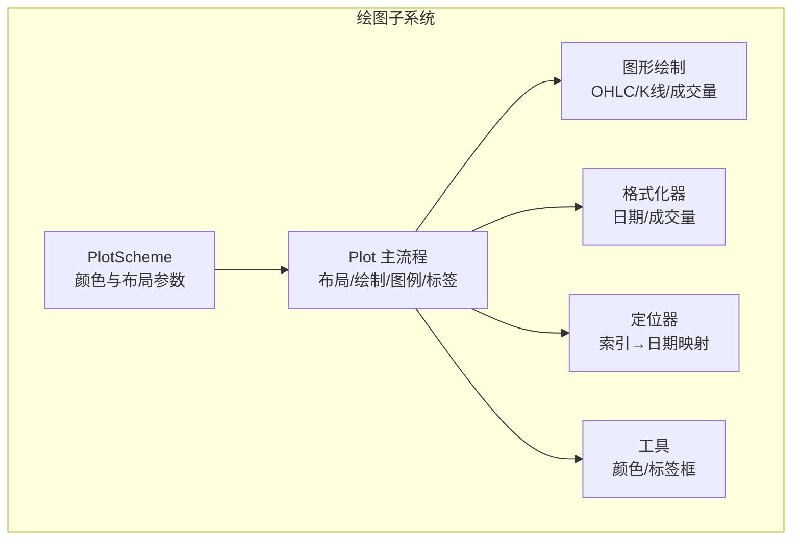
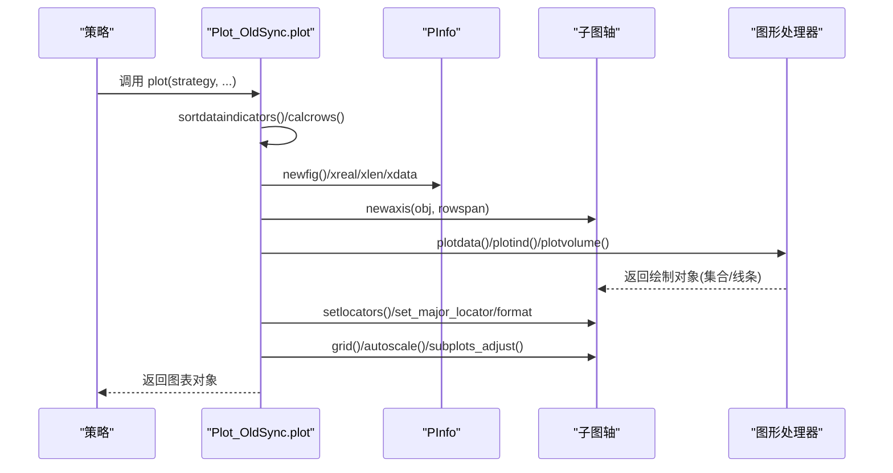
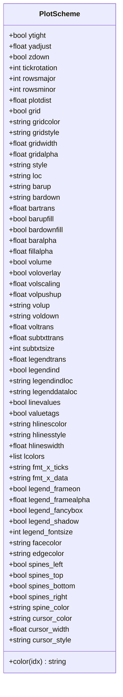
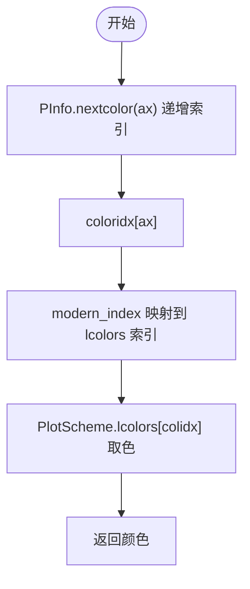
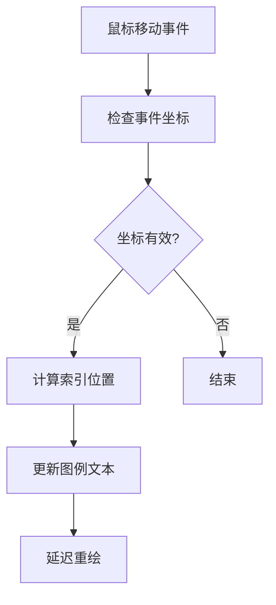
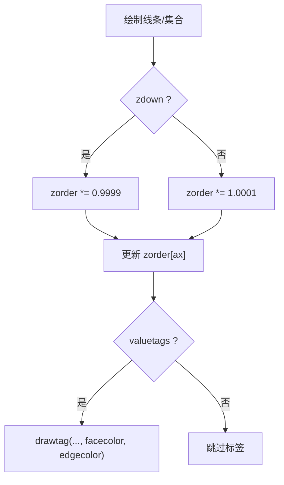
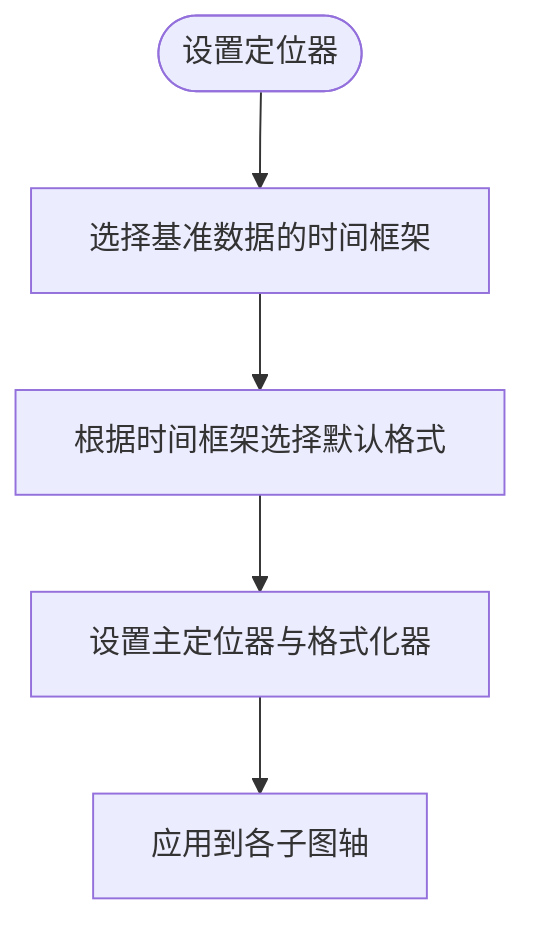
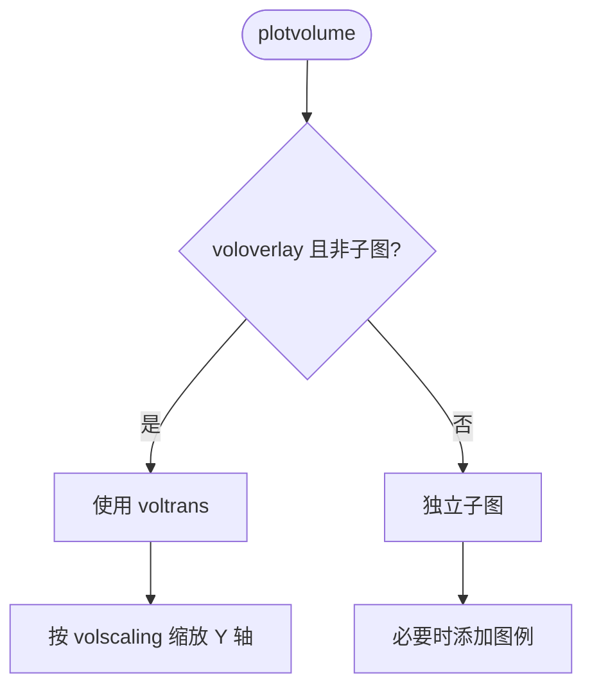
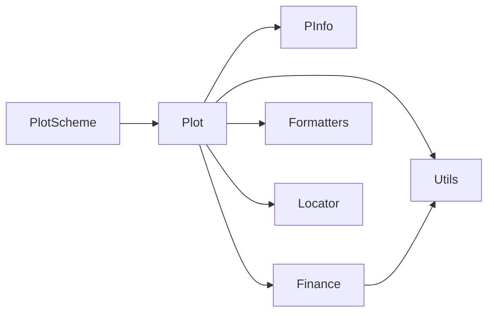

# 图表样式与主题

<cite>
**本文引用的文件**
- [backtrader/plot/scheme.py](file://backtrader/plot/scheme.py)
- [backtrader/plot/plot.py](file://backtrader/plot/plot.py)
- [backtrader/plot/__init__.py](file://backtrader/plot/__init__.py)
- [backtrader/plot/utils.py](file://backtrader/plot/utils.py)
- [backtrader/plot/formatters.py](file://backtrader/plot/formatters.py)
- [backtrader/plot/finance.py](file://backtrader/plot/finance.py)
- [backtrader/plot/locator.py](file://backtrader/plot/locator.py)
</cite>

## 更新摘要
**所做更改**
- 更新了颜色方案管理部分，新增现代调色板（modern10）和索引映射机制
- 增强了图例样式配置选项，包括边框、阴影、圆角等属性
- 新增了图表背景和轴脊柱样式配置
- 更新了游标样式配置，包括颜色、宽度和样式
- 完善了网格样式配置，新增颜色、样式、宽度和透明度参数
- 增强了动态图例更新功能，支持鼠标悬停实时更新

## 目录
1. [简介](#简介)
2. [项目结构](#项目结构)
3. [核心组件](#核心组件)
4. [架构总览](#架构总览)
5. [详细组件分析](#详细组件分析)
6. [依赖关系分析](#依赖关系分析)
7. [性能考量](#性能考量)
8. [故障排查指南](#故障排查指南)
9. [结论](#结论)
10. [附录：样式配置示例与最佳实践](#附录样式配置示例与最佳实践)

## 简介
本指南聚焦 Backtrader 图表样式与主题系统，围绕 PlotScheme 类的设计理念与配置参数展开，系统讲解颜色方案、字体与时间轴格式、布局比例、图层顺序、网格与标签、填充区域、成交量叠加与分轴、水平线标注、图例位置等关键要素。文档同时给出主题定制（预设与自定义）的方法、颜色管理机制（索引、映射、透明度）以及常见视觉效果的配置技巧，并通过序列图与流程图帮助读者建立从概念到实现的完整认知。

**更新** 本次更新重点反映了颜色方案管理系统的现代化改进，包括新的现代调色板、增强的图例样式配置、改进的网格样式以及动态图例更新功能。

## 项目结构
Backtrader 的绘图子系统位于 backtrader/plot 目录，主要模块职责如下：
- scheme.py：定义 PlotScheme 类及内置配色方案（Tableau 系列），提供颜色索引与映射函数。
- plot.py：图表主流程，负责布局计算、坐标轴生成、数据绘制、图例与标签处理、网格与定位器设置。
- finance.py：OHLC、K线、成交量等图形绘制的具体实现，封装为可复用的绘制处理器与集合。
- formatters.py：日期与成交量数值格式化器，以及定位器/格式化的修补工具。
- locator.py：重写 matplotlib 定位器以适配索引型 X 轴与日期转换。
- utils.py：颜色工具（如亮度调整）、标签框路径等辅助功能。
- __init__.py：导入 matplotlib 并导出 Plot 与 PlotScheme，确保后端可用性。

**图表来源**
- [backtrader/plot/scheme.py](file://backtrader/plot/scheme.py#L111-L256)
- [backtrader/plot/plot.py](file://backtrader/plot/plot.py#L101-L1108)
- [backtrader/plot/finance.py](file://backtrader/plot/finance.py#L1-L726)
- [backtrader/plot/formatters.py](file://backtrader/plot/formatters.py#L1-L123)
- [backtrader/plot/locator.py](file://backtrader/plot/locator.py#L1-L260)
- [backtrader/plot/utils.py](file://backtrader/plot/utils.py#L1-L110)

**章节来源**
- [backtrader/plot/__init__.py](file://backtrader/plot/__init__.py#L27-L44)

## 核心组件
- PlotScheme：图表样式与主题的核心配置容器，包含颜色方案、字体大小、布局比例、网格、标签、透明度、图层顺序、时间格式化等参数，并提供 color(idx) 将线序映射到颜色索引。
- PInfo：绘图过程中的上下文信息，维护每个子图的颜色索引、z-order、图例句柄与标签、字体属性等。
- 绘图处理器：OHLCPlotHandler、CandlestickPlotHandler、VolumePlotHandler、LineOnClosePlotHandler，分别负责不同图形类型的绘制与图例呈现。
- 格式化器与定位器：MyDateFormatter、MyVolFormatter、AutoDateLocator/AutoDateFormatter、RRuleLocator，用于时间刻度与数值标签的本地化显示。
- 工具函数：shade_color 提供颜色明暗调节；tag_box_style 定义标签框路径。

**更新** 新增了现代调色板（modern10）和增强的图例样式配置选项。

**章节来源**
- [backtrader/plot/scheme.py](file://backtrader/plot/scheme.py#L29-L256)
- [backtrader/plot/plot.py](file://backtrader/plot/plot.py#L45-L1108)
- [backtrader/plot/finance.py](file://backtrader/plot/finance.py#L32-L726)
- [backtrader/plot/formatters.py](file://backtrader/plot/formatters.py#L29-L123)
- [backtrader/plot/locator.py](file://backtrader/plot/locator.py#L46-L260)
- [backtrader/plot/utils.py](file://backtrader/plot/utils.py#L82-L110)

## 架构总览
下图展示了从策略到最终渲染的关键调用链：策略驱动 → 计算行数与布局 → 创建子图 → 绘制数据/指标/成交量 → 设置定位器与格式化器 → 添加图例与标签 → 多游标与网格。

**图表来源**
- [backtrader/plot/plot.py](file://backtrader/plot/plot.py#L201-L380)
- [backtrader/plot/plot.py](file://backtrader/plot/plot.py#L813-L1108)
- [backtrader/plot/formatters.py](file://backtrader/plot/formatters.py#L52-L123)
- [backtrader/plot/locator.py](file://backtrader/plot/locator.py#L95-L260)

## 详细组件分析

### PlotScheme 设计与配置详解
- 颜色方案
  - 现代调色板：modern10（基于 Matplotlib 的 "tab10" 分类调色板，CSS 十六进制值）
  - 传统调色板：tableau20、tableau10、tableau10_light；默认使用 modern10。
  - 颜色索引映射：modern_index 提供直接顺序访问（无重新映射），tab10_index 定义循环索引规则。
- 字体与文本
  - subtxtsize：标签字号；subtxttrans：文本透明度（未在当前版本广泛使用）。
  - linevalues/valuetags：是否在标签后追加最后值、是否在末端绘制带边框的数值标签。
- 布局与间距
  - rowsmajor/rowsminor：主图（数据）与次图（指标/观察者）占子图行的比例；plotdist：子图间距；yadjust/ytight：Y 轴边距与紧凑模式。
- 时间轴与标签
  - tickrotation：X 轴日期标签旋转角度；fmt_x_ticks/fmt_x_data：日期刻度与数据点值的格式化字符串。
- 图层与网格
  - zdown：新线在 Z 方向的堆叠方向；grid：背景网格开关；新增 gridcolor、gridstyle、gridwidth、gridalpha 网格样式参数。
- K线/蜡烛与柱状图
  - style：'line'/'candle'/'bar'；barup/bardown：涨跌颜色；barupfill/bardownfill：是否填充；baralpha：填充透明度；bartrans：已废弃。
- 成交量
  - volume/voloverlay：是否绘制成交量、是否叠加在主图；volscaling/volpushup：叠加缩放与上移；volup/voldown/voltrans：涨跌颜色与透明度。
- 水平线与图例
  - hlinescolor/hlinesstyle/hlineswidth：水平线颜色、样式、宽度；legendind/legendindloc、legenddataloc：指标与数据图例位置。
  - 新增 legend_frameon、legend_framealpha、legend_fancybox、legend_shadow、legend_fontsize 图例样式配置。
- 图表背景与轴样式
  - facecolor/edgecolor：图表背景颜色；新增 spine 样式配置（spines_left、spines_top、spines_bottom、spines_right、spine_color）。
- 游标样式
  - cursor_color、cursor_width、cursor_style：游标颜色、宽度和样式。
- 其他
  - legendtrans：图例透明度（未广泛使用）；subtxtsize：标签字号。

**图表来源**
- [backtrader/plot/scheme.py](file://backtrader/plot/scheme.py#L111-L256)

**章节来源**
- [backtrader/plot/scheme.py](file://backtrader/plot/scheme.py#L29-L256)

### 颜色管理机制
- 现代调色板系统：使用 modern10 作为默认颜色方案，提供高对比度、色盲友好、视觉和谐的颜色组合。
- 线序到颜色的映射：PInfo.nextcolor() 递增颜色索引，PInfo.color(ax) 通过 PlotScheme.color(idx) 获取颜色。
- 颜色索引循环：modern_index 提供稳定的直接顺序映射，避免颜色重复过快。
- 颜色明暗调节：shade_color 使用 HLS 空间调整亮度，便于生成边框或阴影色。
- 透明度控制：baralpha 控制蜡烛填充透明度；voltrans 控制成交量叠加透明度；fillalpha 控制 fill_between 区域透明度。

**图表来源**
- [backtrader/plot/plot.py](file://backtrader/plot/plot.py#L84-L90)
- [backtrader/plot/scheme.py](file://backtrader/plot/scheme.py#L108-L256)
- [backtrader/plot/utils.py](file://backtrader/plot/utils.py#L82-L110)

**章节来源**
- [backtrader/plot/plot.py](file://backtrader/plot/plot.py#L84-L90)
- [backtrader/plot/utils.py](file://backtrader/plot/utils.py#L82-L110)

### 动态图例更新功能
- 实时更新机制：通过 _on_mouse_move 方法监听鼠标移动事件，动态更新图例中的数值显示。
- 数据绑定：_bind_legend_to_data 方法将图例文本与实际数据关联，支持 OHLC 和线性数据的动态更新。
- 支持的数据类型：OHLC 数据（开盘、最高、最低、收盘）、线性数据（收盘价）、普通数值数组。
- 性能优化：使用事件驱动的方式，在鼠标移动时才更新图例，避免不必要的重绘。

**图表来源**
- [backtrader/plot/plot.py](file://backtrader/plot/plot.py#L146-L200)
- [backtrader/plot/plot.py](file://backtrader/plot/plot.py#L131-L145)

**章节来源**
- [backtrader/plot/plot.py](file://backtrader/plot/plot.py#L131-L200)

### 图表元素层级与标签显示
- 层级管理：zdown 控制新线在 Z 方向上是"向下"还是"向上"堆叠；zordernext/zordercur 用于计算下一图层顺序。
- 标签与数值：valuetags 打开时在末端绘制带边框的数值标签；linevalues 在标题后追加最后值。
- 图例：指标与数据的图例位置由 legendindloc 与 legenddataloc 控制；支持按子图独立设置 legendloc。
- 图例样式：新增完整的图例样式配置，包括边框、阴影、圆角、透明度和字体大小。

**图表来源**
- [backtrader/plot/plot.py](file://backtrader/plot/plot.py#L91-L99)
- [backtrader/plot/plot.py](file://backtrader/plot/plot.py#L111-L130)

**章节来源**
- [backtrader/plot/plot.py](file://backtrader/plot/plot.py#L91-L130)

### 网格、定位器与时间轴格式
- 网格：newaxis 时统一开启 grid；可按需关闭；新增网格样式配置（颜色、样式、宽度、透明度）。
- 定位器：setlocators 自动选择时间粒度并设置主刻度与格式化器；AutoDateLocator/RRuleLocator 支持索引到日期的双向映射。
- 格式化器：MyDateFormatter 根据索引取真实日期并应用格式；MyVolFormatter 对成交量进行千/百万级缩放显示。

**图表来源**
- [backtrader/plot/plot.py](file://backtrader/plot/plot.py#L381-L421)
- [backtrader/plot/formatters.py](file://backtrader/plot/formatters.py#L52-L123)
- [backtrader/plot/locator.py](file://backtrader/plot/locator.py#L95-L260)

**章节来源**
- [backtrader/plot/plot.py](file://backtrader/plot/plot.py#L381-L421)
- [backtrader/plot/formatters.py](file://backtrader/plot/formatters.py#L29-L123)
- [backtrader/plot/locator.py](file://backtrader/plot/locator.py#L46-L260)

### 成交量与叠加/分轴
- 叠加模式：当 voloverlay 且主图无父数据时，成交量叠加在主图上方，使用 voltrans 与 volpushup 调整可见性与范围。
- 分轴模式：否则创建独立子图，使用 MaxNLocator 与自定义 MyVolFormatter 控制刻度与标签。

**图表来源**
- [backtrader/plot/plot.py](file://backtrader/plot/plot.py#L739-L812)

**章节来源**
- [backtrader/plot/plot.py](file://backtrader/plot/plot.py#L739-L812)

### 水平线与填充区域
- 水平线：plothlines/plotyhlines 支持在子图上绘制固定水平线，颜色、样式、宽度由 hlinescolor/hlinesstyle/hlineswidth 控制。
- 填充区域：支持基于比较条件（大于/小于/等于）对两条线之间的区域进行填充，透明度由 fillalpha 控制。

**章节来源**
- [backtrader/plot/plot.py](file://backtrader/plot/plot.py#L694-L705)
- [backtrader/plot/plot.py](file://backtrader/plot/plot.py#L642-L671)

## 依赖关系分析
- Plot_OldSync 依赖 PlotScheme 进行全局样式控制；PInfo 作为上下文持有者协调颜色、z-order、图例与标签。
- 绘图处理器（OHLC/Candlestick/Volume/LineOnClose）依赖 matplotlib collections 与 lines，统一注册图例处理器。
- 格式化器与定位器依赖 backtrader.utils 的日期转换工具，确保索引到日期的正确映射。

**图表来源**
- [backtrader/plot/plot.py](file://backtrader/plot/plot.py#L101-L1108)
- [backtrader/plot/finance.py](file://backtrader/plot/finance.py#L1-L726)
- [backtrader/plot/formatters.py](file://backtrader/plot/formatters.py#L1-L123)
- [backtrader/plot/locator.py](file://backtrader/plot/locator.py#L1-L260)
- [backtrader/plot/utils.py](file://backtrader/plot/utils.py#L1-L110)

**章节来源**
- [backtrader/plot/plot.py](file://backtrader/plot/plot.py#L101-L1108)

## 性能考量
- 子图行数计算：rowsmajor/rowsminor 与 volume 是否叠加直接影响总体行数与渲染开销。
- 填充与透明度：fillalpha 与 baralpha 过低会增加混合成本；建议仅在需要时启用。
- 标签与图例：linevalues/valuetags 会在末尾绘制文本，过多标签可能影响渲染性能。
- 定位器与格式化器：自动选择合适的定位器可减少刻度数量，提升可读性与性能。
- 动态图例更新：鼠标事件驱动的更新机制避免了不必要的重绘，提升了交互性能。

## 故障排查指南
- 无法导入 matplotlib：检查后端初始化与环境安装状态。
- 日期标签错乱：确认 setlocators 已被调用，且 fmt_x_ticks/fmt_x_data 设置合理。
- 图例缺失：检查 legendind 与 plotlegend；确认子图存在有效线条。
- 颜色重复过快：确认 coloridx 正常递增，避免在同一轴上错误复用旧索引。
- 透明度无效：确认使用的是 fillalpha（填充区域）或 baralpha/voltrans（图形/成交量）而非未使用的 subtxttrans。
- 现代调色板问题：确保使用 modern10 作为默认颜色方案，避免与传统调色板混淆。
- 图例样式异常：检查新增的图例样式配置参数（legend_frameon、legend_framealpha 等）是否正确设置。

**章节来源**
- [backtrader/plot/__init__.py](file://backtrader/plot/__init__.py#L27-L44)
- [backtrader/plot/plot.py](file://backtrader/plot/plot.py#L381-L421)
- [backtrader/plot/plot.py](file://backtrader/plot/plot.py#L694-L705)

## 结论
Backtrader 的图表样式系统以 PlotScheme 为核心，结合 PInfo 上下文与各类图形处理器，提供了从颜色、布局、网格、标签到时间轴格式的全链路配置能力。通过现代化的调色板系统、增强的图例样式配置、改进的网格样式以及动态图例更新功能，可以构建既专业又易读的交易分析图表。建议在复杂策略中优先采用现代调色板和预设主题，再按需微调布局与透明度，以获得最佳的可视化效果与性能平衡。

## 附录：样式配置示例与最佳实践
以下为常见场景的配置要点（不直接展示代码，仅给出路径与参数名）：
- 使用现代调色板：将 lcolors 切换为 modern10 或 modern10_light，或在运行时通过 PlotScheme 参数覆盖；参考 [backtrader/plot/scheme.py](file://backtrader/plot/scheme.py#L29-L108)。
- 自定义颜色索引：修改 modern_index 或 lcolors，确保与业务语义匹配；参考 [backtrader/plot/scheme.py](file://backtrader/plot/scheme.py#L108-L256)。
- 调整时间轴格式：设置 fmt_x_ticks 与 fmt_x_data，以适配日线/分钟线等不同粒度；参考 [backtrader/plot/plot.py](file://backtrader/plot/plot.py#L389-L407)。
- 控制透明度与填充：降低 fillalpha 与 baralpha 提升对比度；参考 [backtrader/plot/scheme.py](file://backtrader/plot/scheme.py#L168-L169)。
- 成交量叠加优化：启用 voloverlay 并设置 volscaling 与 volpushup，避免遮挡；参考 [backtrader/plot/plot.py](file://backtrader/plot/plot.py#L746-L784)。
- 图例与标签：统一 legendindloc 与 legenddataloc，开启 linevalues/valuetags 提升可读性；参考 [backtrader/plot/plot.py](file://backtrader/plot/plot.py#L706-L734)。
- 网格样式配置：使用新增的 gridcolor、gridstyle、gridwidth、gridalpha 参数；参考 [backtrader/plot/scheme.py](file://backtrader/plot/scheme.py#L142-L146)。
- 图表背景与轴样式：配置 facecolor、edgecolor 和 spine 样式；参考 [backtrader/plot/scheme.py](file://backtrader/plot/scheme.py#L237-L246)。
- 图例样式美化：使用 legend_frameon、legend_framealpha、legend_fancybox、legend_shadow、legend_fontsize；参考 [backtrader/plot/scheme.py](file://backtrader/plot/scheme.py#L230-L235)。
- 游标样式定制：调整 cursor_color、cursor_width、cursor_style；参考 [backtrader/plot/scheme.py](file://backtrader/plot/scheme.py#L248-L251)。
- 动态图例更新：利用鼠标悬停实时更新图例数值，提升交互体验；参考 [backtrader/plot/plot.py](file://backtrader/plot/plot.py#L146-L200)。