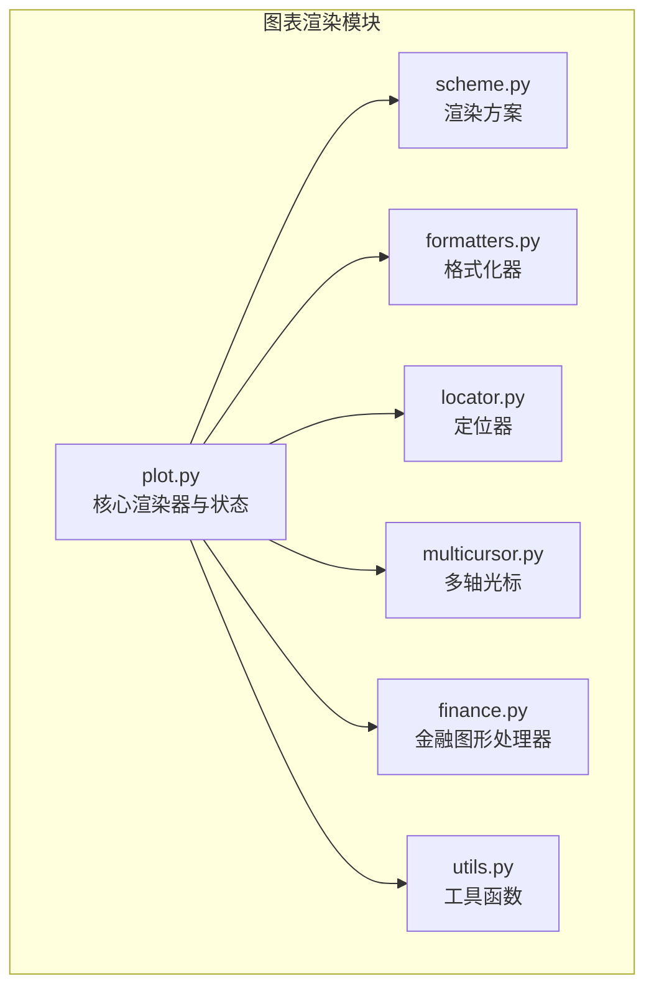
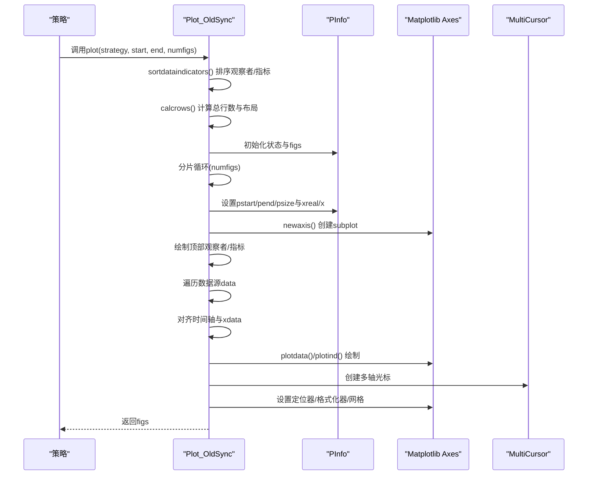
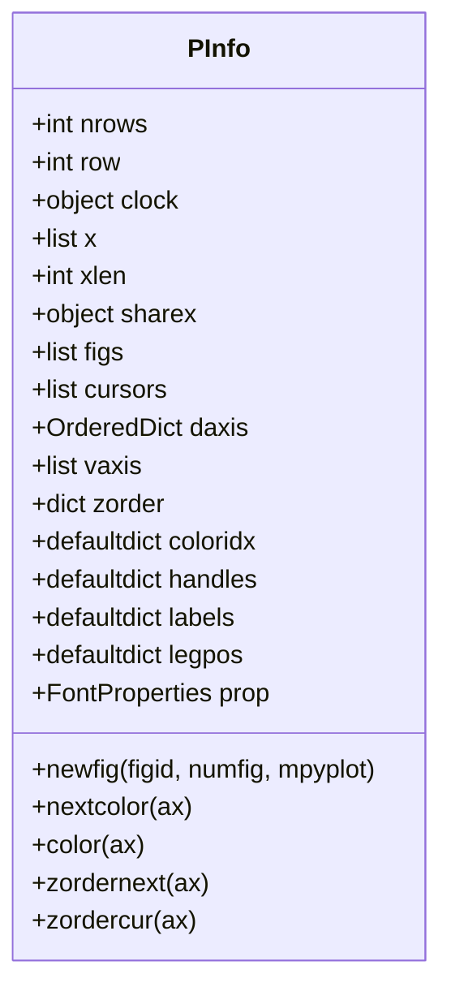
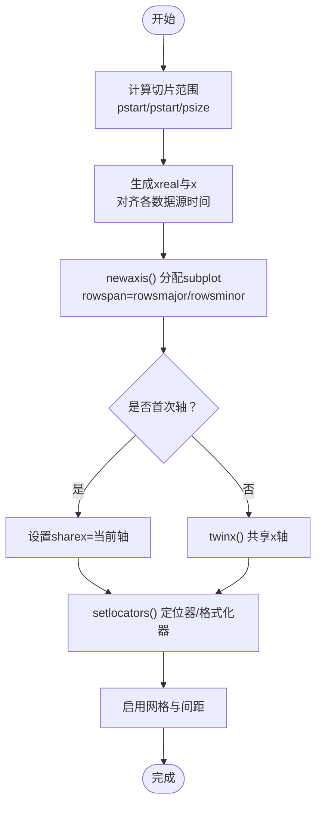
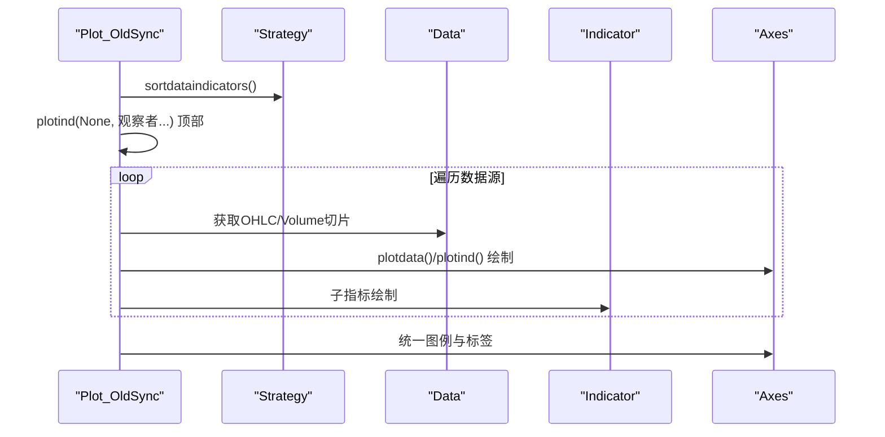
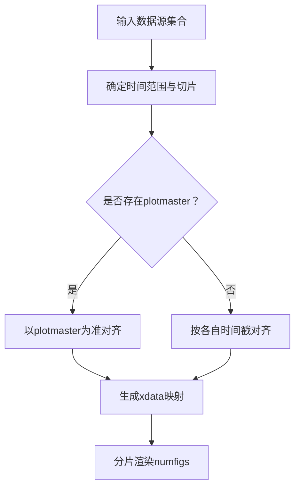
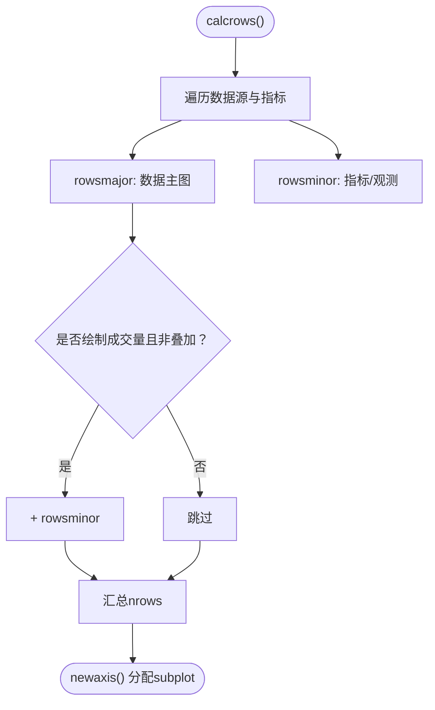
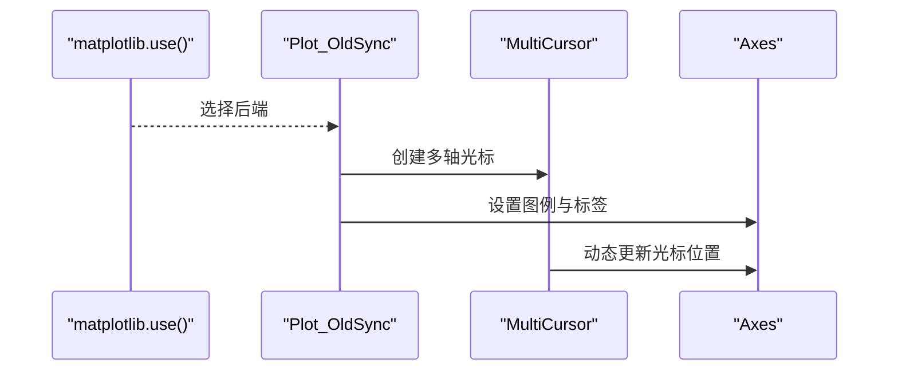
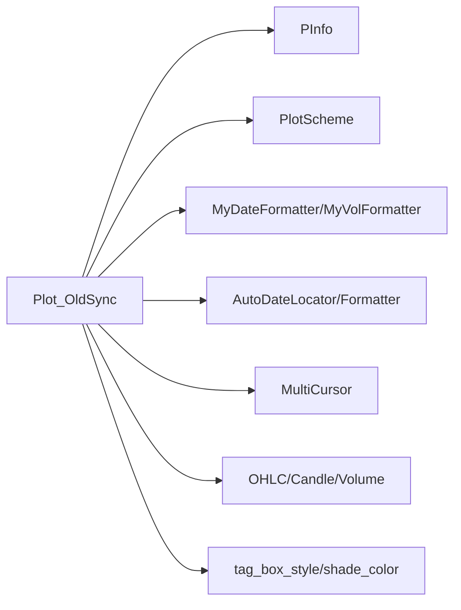

# 图表渲染引擎

<cite>
**本文档引用的文件**
- [backtrader/plot/plot.py](file://backtrader/plot/plot.py)
- [backtrader/plot/scheme.py](file://backtrader/plot/scheme.py)
- [backtrader/plot/formatters.py](file://backtrader/plot/formatters.py)
- [backtrader/plot/locator.py](file://backtrader/plot/locator.py)
- [backtrader/plot/multicursor.py](file://backtrader/plot/multicursor.py)
- [backtrader/plot/finance.py](file://backtrader/plot/finance.py)
- [backtrader/plot/utils.py](file://backtrader/plot/utils.py)
- [backtrader/plot/__init__.py](file://backtrader/plot/__init__.py)
- [backtrader/cerebro.py](file://backtrader/cerebro.py)
- [backtrader/lineseries.py](file://backtrader/lineseries.py)
</cite>

## 目录
1. [简介](#简介)
2. [项目结构](#项目结构)
3. [核心组件](#核心组件)
4. [架构总览](#架构总览)
5. [详细组件分析](#详细组件分析)
6. [依赖关系分析](#依赖关系分析)
7. [性能考虑](#性能考虑)
8. [故障排除指南](#故障排除指南)
9. [结论](#结论)
10. [附录](#附录)

## 简介
本文件面向Backtrader图表渲染引擎，聚焦于Plot_OldSync类及其核心子系统，系统性解析其状态管理（PInfo）、坐标系统与轴分配策略、多数据源支持与时间轴对齐、图表分割与渲染流程等关键能力。文档同时给出Matplotlib集成方式、可定制渲染参数（颜色、样式、交互）以及性能优化建议。

## 项目结构
图表渲染模块位于backtrader/plot目录，主要文件职责如下：
- plot.py：核心渲染器Plot_OldSync及状态容器PInfo；负责排序、布局、坐标计算、绘制与交互
- scheme.py：渲染方案PlotScheme，集中定义颜色、样式、网格、图层等全局渲染参数
- formatters.py：日期与成交量格式化器，以及定位器修补工具
- locator.py：重写AutoDateLocator/AutoDateFormatter以适配索引型x轴
- multicursor.py：多轴共享光标，增强交互体验
- finance.py：OHLC蜡烛图、线图、成交量等绘图处理器
- utils.py：标签框路径生成、颜色明暗调整等通用工具
- __init__.py：导入与后端选择

**图表来源**
- [backtrader/plot/plot.py](file://backtrader/plot/plot.py#L1-L887)
- [backtrader/plot/scheme.py](file://backtrader/plot/scheme.py#L1-L190)
- [backtrader/plot/formatters.py](file://backtrader/plot/formatters.py#L1-L125)
- [backtrader/plot/locator.py](file://backtrader/plot/locator.py#L1-L260)
- [backtrader/plot/multicursor.py](file://backtrader/plot/multicursor.py#L1-L355)
- [backtrader/plot/finance.py](file://backtrader/plot/finance.py#L1-L594)
- [backtrader/plot/utils.py](file://backtrader/plot/utils.py#L1-L94)

**章节来源**
- [backtrader/plot/__init__.py](file://backtrader/plot/__init__.py#L1-L44)

## 核心组件
- Plot_OldSync：主渲染器，负责策略数据与指标的分片绘制、坐标计算、轴分配、图层顺序与交互
- PInfo：渲染状态容器，维护图表行布局、轴映射、颜色索引、z-order、游标等
- PlotScheme：渲染方案，集中控制颜色、样式、网格、图层比例、标签与图例等
- 自定义定位器与格式化器：适配索引型x轴与Backtrader时间编码
- 多轴光标：跨轴同步显示，提升交互体验
- 金融图形处理器：OHLC蜡烛图、线图、成交量绘制

**章节来源**
- [backtrader/plot/plot.py](file://backtrader/plot/plot.py#L50-L95)
- [backtrader/plot/scheme.py](file://backtrader/plot/scheme.py#L77-L190)

## 架构总览
下图展示从策略到最终绘制的高层流程，包括数据分片、坐标计算、轴分配与渲染：

**图表来源**
- [backtrader/plot/plot.py](file://backtrader/plot/plot.py#L119-L274)
- [backtrader/plot/plot.py](file://backtrader/plot/plot.py#L317-L380)
- [backtrader/plot/plot.py](file://backtrader/plot/plot.py#L642-L820)
- [backtrader/plot/multicursor.py](file://backtrader/plot/multicursor.py#L95-L171)

## 详细组件分析

### PInfo状态管理机制
PInfo作为渲染状态容器，承担以下职责：
- 行布局与轴映射：记录nrows、row、sharex、daxis、vaxis等
- 颜色与z-order：coloridx按轴维护颜色索引，zorder记录当前z值
- 图例与标签：handles、labels、legpos用于统一管理图例
- 字体与资源：prop字体属性，以及figs/cursors等资源集合

**图表来源**
- [backtrader/plot/plot.py](file://backtrader/plot/plot.py#L50-L95)

**章节来源**
- [backtrader/plot/plot.py](file://backtrader/plot/plot.py#L50-L95)

### 坐标系统与轴分配策略
- 坐标计算：根据策略时间轴切片，生成xreal（日期数值）与x（索引列表），并处理数据源时间对齐
- 轴分配：使用subplot2grid按行跨度(rowspan)分配子图，首轴作为sharex，后续轴通过twinx共享x但独立y
- 定位器与格式化器：自动选择时间粒度，应用自定义MyDateFormatter与MyVolFormatter
- 网格与间距：按scheme.grid与scheme.plotdist控制网格与子图间距

**图表来源**
- [backtrader/plot/plot.py](file://backtrader/plot/plot.py#L173-L181)
- [backtrader/plot/plot.py](file://backtrader/plot/plot.py#L361-L380)
- [backtrader/plot/plot.py](file://backtrader/plot/plot.py#L276-L316)

**章节来源**
- [backtrader/plot/plot.py](file://backtrader/plot/plot.py#L173-L181)
- [backtrader/plot/plot.py](file://backtrader/plot/plot.py#L361-L380)
- [backtrader/plot/plot.py](file://backtrader/plot/plot.py#L276-L316)

### 图表渲染流程（数据获取→坐标→绘制）
- 数据获取：从strategy.datas与getobservers()/getindicators()中提取待绘制对象
- 坐标计算：对齐各数据源的时间戳，生成xdata；必要时进行时间边界修正
- 绘制执行：先绘制顶部观察者/指标，再逐个数据源绘制，最后绘制其子指标与成交量
- 图例与标签：统一收集handles/labels，按位置插入数据与成交量项

**图表来源**
- [backtrader/plot/plot.py](file://backtrader/plot/plot.py#L188-L232)
- [backtrader/plot/plot.py](file://backtrader/plot/plot.py#L642-L820)

**章节来源**
- [backtrader/plot/plot.py](file://backtrader/plot/plot.py#L188-L232)
- [backtrader/plot/plot.py](file://backtrader/plot/plot.py#L642-L820)

### 多数据源支持与时间轴对齐
- 时间对齐：当数据源时间戳不完全一致时，通过二分查找在xreal范围内映射对应索引，确保同一x轴
- 主从关系：支持plotmaster指定主数据源，非主数据源可同轴或twinx
- 分片渲染：按numfigs将长序列切分为多个片段，分别渲染，避免内存与性能瓶颈

**图表来源**
- [backtrader/plot/plot.py](file://backtrader/plot/plot.py#L200-L214)
- [backtrader/plot/plot.py](file://backtrader/plot/plot.py#L828-L884)

**章节来源**
- [backtrader/plot/plot.py](file://backtrader/plot/plot.py#L200-L214)
- [backtrader/plot/plot.py](file://backtrader/plot/plot.py#L828-L884)

### 图表分割与布局
- 行数计算：依据rowsmajor/rowsminor与volume叠加策略，计算总行数
- 子图分配：使用subplot2grid(rowspan)分配，首轴sharex，后续轴twinx
- 间距与网格：通过scheme.plotdist与scheme.grid控制整体视觉密度

**图表来源**
- [backtrader/plot/plot.py](file://backtrader/plot/plot.py#L317-L359)
- [backtrader/plot/plot.py](file://backtrader/plot/plot.py#L361-L380)

**章节来源**
- [backtrader/plot/plot.py](file://backtrader/plot/plot.py#L317-L359)
- [backtrader/plot/plot.py](file://backtrader/plot/plot.py#L361-L380)

### Matplotlib集成与交互
- 后端选择：优先使用nbagg（Jupyter）或其他平台默认后端
- 多轴光标：MultiCursor在所有轴间共享垂直/水平线，支持动画与刷新
- 图例与标签：统一handles/labels，保证数据与成交量项优先显示

**图表来源**
- [backtrader/plot/__init__.py](file://backtrader/plot/__init__.py#L27-L39)
- [backtrader/plot/plot.py](file://backtrader/plot/plot.py#L233-L241)
- [backtrader/plot/multicursor.py](file://backtrader/plot/multicursor.py#L95-L171)

**章节来源**
- [backtrader/plot/__init__.py](file://backtrader/plot/__init__.py#L27-L39)
- [backtrader/plot/plot.py](file://backtrader/plot/plot.py#L233-L241)
- [backtrader/plot/multicursor.py](file://backtrader/plot/multicursor.py#L95-L171)

### 渲染参数与样式定制
- 颜色方案：通过PlotScheme.lcolors与color()方法按索引取色，支持Tableau系列
- 样式选项：style='line'|'bar'|'candle'，barup/bardown、baralpha、barupfill/bardownfill
- 图例与标签：legendind、legendindloc、legenddataloc、linevalues、valuetags
- 成交量：volume、voloverlay、volscaling、volpushup、volup/voldown、voltrans
- 网格与间距：grid、plotdist、rowsmajor/rowsminor、ytight、yadjust

示例（路径参考）：
- 设置样式与颜色：[backtrader/plot/scheme.py](file://backtrader/plot/scheme.py#L108-L127)
- 控制图例位置与透明度：[backtrader/plot/scheme.py](file://backtrader/plot/scheme.py#L155-L164)
- 明暗调整工具：[backtrader/plot/utils.py](file://backtrader/plot/utils.py#L66-L94)

**章节来源**
- [backtrader/plot/scheme.py](file://backtrader/plot/scheme.py#L77-L190)
- [backtrader/plot/utils.py](file://backtrader/plot/utils.py#L66-L94)

### 金融图形绘制
- 线图（收盘价）：plot_lineonclose，支持宽度、透明度与标签
- OHLC柱状图：plot_ohlc，支持上涨/下跌颜色与刻度
- 蜡烛图：plot_candlestick，支持填充与透明度
- 成交量：plot_volume，支持叠加与缩放

示例（路径参考）：
- OHLC绘制：[backtrader/plot/finance.py](file://backtrader/plot/finance.py#L495-L511)
- 线图绘制：[backtrader/plot/finance.py](file://backtrader/plot/finance.py#L581-L594)

**章节来源**
- [backtrader/plot/finance.py](file://backtrader/plot/finance.py#L495-L594)

## 依赖关系分析
- Plot_OldSync依赖PInfo、PlotScheme、formatters、locator、multicursor、finance、utils
- PInfo持有Matplotlib Figure与Axes映射，管理z-order与颜色索引
- 自定义定位器与格式化器确保索引型x轴正确映射到日期字符串

**图表来源**
- [backtrader/plot/plot.py](file://backtrader/plot/plot.py#L38-L47)
- [backtrader/plot/plot.py](file://backtrader/plot/plot.py#L276-L316)
- [backtrader/plot/finance.py](file://backtrader/plot/finance.py#L1-L594)
- [backtrader/plot/utils.py](file://backtrader/plot/utils.py#L30-L94)

**章节来源**
- [backtrader/plot/plot.py](file://backtrader/plot/plot.py#L38-L47)
- [backtrader/plot/plot.py](file://backtrader/plot/plot.py#L276-L316)

## 性能考虑
- 分片渲染：通过numfigs将长序列切分为多个片段，降低单次渲染压力
- 时间对齐：仅在需要时进行xdata映射与边界修正，避免重复计算
- z-order与颜色：按轴维护coloridx与zorder，减少重复查询
- 交互优化：MultiCursor使用动画与blit，提高响应速度
- 后端选择：在Jupyter环境下使用nbagg，提升交互流畅度

**章节来源**
- [backtrader/plot/plot.py](file://backtrader/plot/plot.py#L155-L164)
- [backtrader/plot/plot.py](file://backtrader/plot/plot.py#L233-L241)
- [backtrader/plot/__init__.py](file://backtrader/plot/__init__.py#L27-L39)

## 故障排除指南
- 缺少Matplotlib：导入时若未安装将抛出异常，需安装matplotlib
- 日期定位异常：确保x轴为日期数值，使用自定义定位器与格式化器
- 图例错位：统一handles/labels并在数据轴前插入数据与成交量项
- 交互无响应：确认MultiCursor引用保持有效，且useblit可用

**章节来源**
- [backtrader/plot/__init__.py](file://backtrader/plot/__init__.py#L27-L31)
- [backtrader/plot/plot.py](file://backtrader/plot/plot.py#L763-L804)
- [backtrader/plot/multicursor.py](file://backtrader/plot/multicursor.py#L173-L183)

## 结论
Backtrader图表渲染引擎以Plot_OldSync为核心，结合PInfo状态管理、PlotScheme渲染方案与自定义定位器/格式化器，实现了对多数据源、时间轴对齐与复杂布局的稳健支持。通过分片渲染、z-order与颜色管理、多轴光标等机制，既保证了可视化质量，也兼顾了性能与交互体验。用户可通过PlotScheme与绘图处理器灵活定制颜色、样式与交互行为。

## 附录
- 代码示例路径（不含具体代码内容）：
  - 设置渲染样式与颜色：[backtrader/plot/scheme.py](file://backtrader/plot/scheme.py#L108-L127)
  - 控制图例与标签：[backtrader/plot/scheme.py](file://backtrader/plot/scheme.py#L155-L169)
  - 明暗调整工具：[backtrader/plot/utils.py](file://backtrader/plot/utils.py#L66-L94)
  - OHLC绘制入口：[backtrader/plot/finance.py](file://backtrader/plot/finance.py#L495-L511)
  - 线图绘制入口：[backtrader/plot/finance.py](file://backtrader/plot/finance.py#L581-L594)