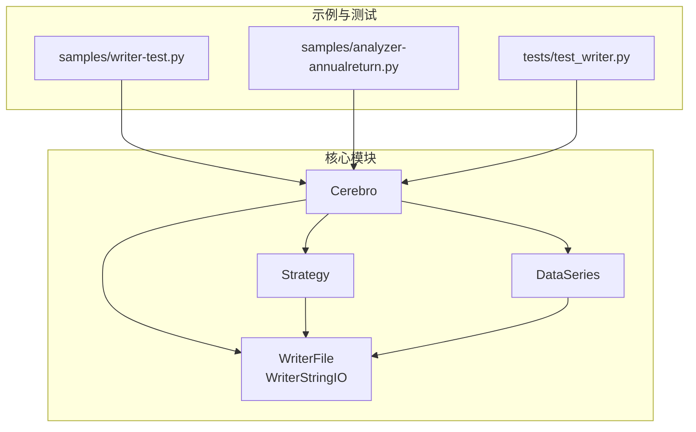
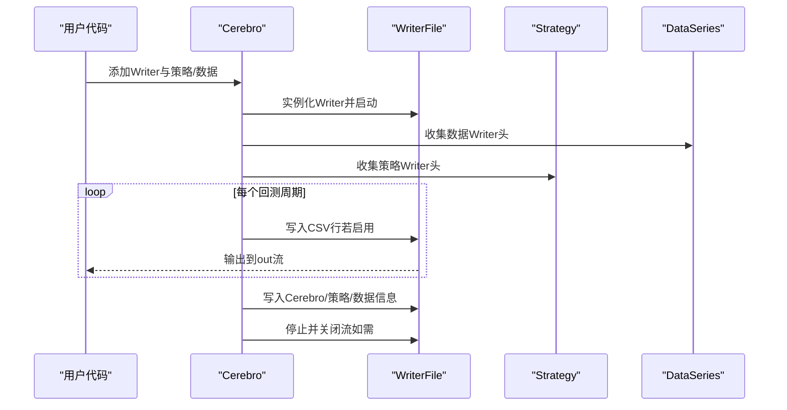
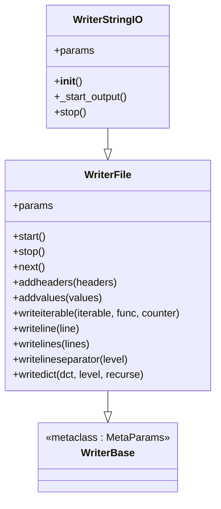
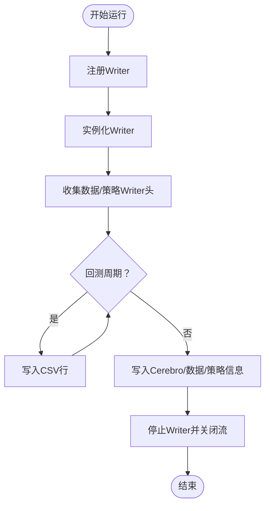
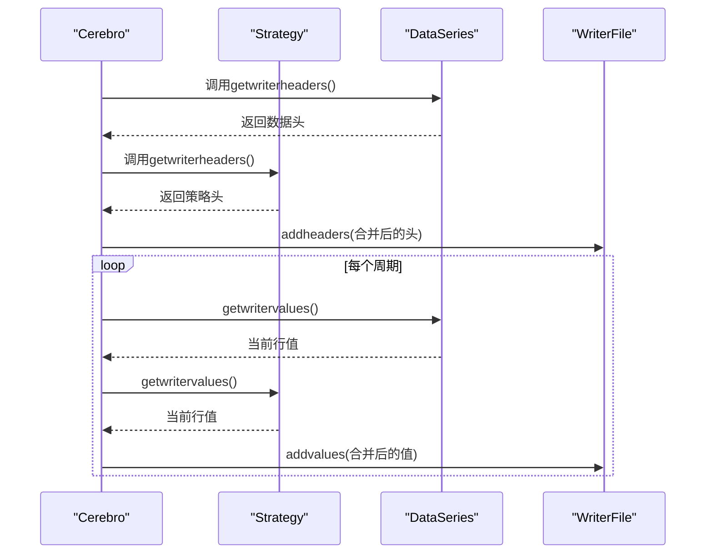
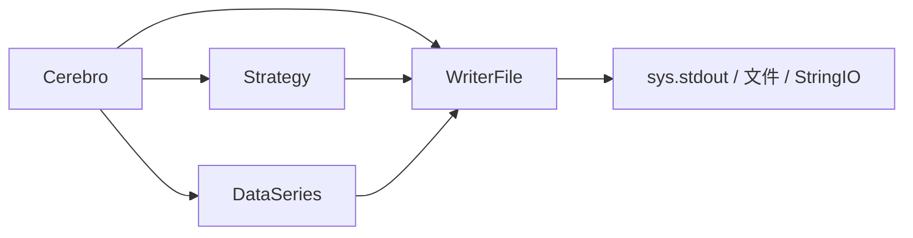

# 报告生成功能

<cite>
**本文引用的文件**
- [backtrader/writer.py](file://backtrader/writer.py)
- [backtrader/cerebro.py](file://backtrader/cerebro.py)
- [backtrader/strategy.py](file://backtrader/strategy.py)
- [backtrader/dataseries.py](file://backtrader/dataseries.py)
- [samples/writer-test/writer-test.py](file://samples/writer-test/writer-test.py)
- [tests/test_writer.py](file://tests/test_writer.py)
- [samples/analyzer-annualreturn/analyzer-annualreturn.py](file://samples/analyzer-annualreturn/analyzer-annualreturn.py)
</cite>

## 目录
1. [简介](#简介)
2. [项目结构](#项目结构)
3. [核心组件](#核心组件)
4. [架构总览](#架构总览)
5. [组件详解](#组件详解)
6. [依赖关系分析](#依赖关系分析)
7. [性能考量与最佳实践](#性能考量与最佳实践)
8. [故障排查指南](#故障排查指南)
9. [结论](#结论)
10. [附录：使用示例与参数参考](#附录使用示例与参数参考)

## 简介
本指南聚焦于Backtrader的报告生成功能，系统讲解Writer类的功能特性、回测结果导出方式、报告格式选择与输出配置，并提供可扩展到更多格式（如PDF、HTML、CSV）的思路与实践建议。文档还包含报告模板定制方法、自动化生成专业交易分析报告的步骤、性能优化与内存管理策略，以及常见问题的排查路径。

## 项目结构
围绕报告生成功能的关键模块与文件如下：
- backtrader/writer.py：Writer基类与WriterFile/WriterStringIO实现，负责文本与CSV输出、字典结构化输出、分隔线与缩进控制等。
- backtrader/cerebro.py：Cerebro运行时集成Writer，收集数据、策略与分析器信息，驱动Writer写入生命周期。
- backtrader/strategy.py：策略侧提供Writer所需的数据头与值，以及结构化信息（含参数、指标、观察者、分析器）。
- backtrader/dataseries.py：数据序列侧提供Writer所需的数据头与值，以及基础元信息。
- samples/writer-test/writer-test.py：演示如何启用WriterFile并输出CSV流。
- tests/test_writer.py：测试用例，验证Writer行为与输出行数。
- samples/analyzer-annualreturn/analyzer-annualreturn.py：示例中同时启用WriterFile与多个分析器。

**图表来源**
- [backtrader/writer.py](file://backtrader/writer.py#L43-L234)
- [backtrader/cerebro.py](file://backtrader/cerebro.py#L1080-L1279)
- [backtrader/strategy.py](file://backtrader/strategy.py#L418-L480)
- [backtrader/dataseries.py](file://backtrader/dataseries.py#L70-L104)
- [samples/writer-test/writer-test.py](file://samples/writer-test/writer-test.py#L155-L158)
- [samples/analyzer-annualreturn/analyzer-annualreturn.py](file://samples/analyzer-annualreturn/analyzer-annualreturn.py#L171-L171)
- [tests/test_writer.py](file://tests/test_writer.py#L42-L73)

**章节来源**
- [backtrader/writer.py](file://backtrader/writer.py#L43-L234)
- [backtrader/cerebro.py](file://backtrader/cerebro.py#L1080-L1279)
- [backtrader/strategy.py](file://backtrader/strategy.py#L418-L480)
- [backtrader/dataseries.py](file://backtrader/dataseries.py#L70-L104)
- [samples/writer-test/writer-test.py](file://samples/writer-test/writer-test.py#L155-L158)
- [samples/analyzer-annualreturn/analyzer-annualreturn.py](file://samples/analyzer-annualreturn/analyzer-annualreturn.py#L171-L171)
- [tests/test_writer.py](file://tests/test_writer.py#L42-L73)

## 核心组件
- WriterBase：Writer的元参数基类，统一参数体系。
- WriterFile：通用文本/CSV输出器，支持：
  - 文本分隔线与缩进控制
  - 字典结构化输出（递归打印键值）
  - CSV头与值的追加、换行、计数列
  - 浮点数四舍五入、NaN过滤、分隔符配置
- WriterStringIO：基于StringIO的WriterFile变体，便于捕获输出供测试或二次处理。
- Cerebro与Strategy/DataSeries：在运行期收集各对象的Writer头与值，驱动Writer写入生命周期。

**章节来源**
- [backtrader/writer.py](file://backtrader/writer.py#L39-L106)
- [backtrader/writer.py](file://backtrader/writer.py#L108-L160)
- [backtrader/writer.py](file://backtrader/writer.py#L169-L219)
- [backtrader/writer.py](file://backtrader/writer.py#L221-L234)

## 架构总览
Writer在Cerebro运行周期内被实例化并贯穿整个回测过程，按阶段收集数据、策略与分析器信息，最终输出到指定输出流（stdout、文件或StringIO）。

**图表来源**
- [backtrader/cerebro.py](file://backtrader/cerebro.py#L1084-L1091)
- [backtrader/cerebro.py](file://backtrader/cerebro.py#L1197-L1205)
- [backtrader/cerebro.py](file://backtrader/cerebro.py#L1271-L1273)
- [backtrader/cerebro.py](file://backtrader/cerebro.py#L1356-L1358)
- [backtrader/writer.py](file://backtrader/writer.py#L126-L140)

## 组件详解

### WriterFile类与WriterStringIO类
- 功能要点
  - 输出目标：支持字符串（文件名）、sys.stdout、任意可写流；可选自动关闭。
  - CSV模式：可开启CSV头与逐行值输出，支持分隔符、NaN过滤、行号计数。
  - 文本模式：支持多级缩进、多种分隔线字符循环使用，形成层次分明的报告结构。
  - 字典输出：递归打印键值对，自动识别字符串、整型、浮点、列表/元组、字典等类型。
  - 浮点精度：通过rounding参数统一四舍五入位数。
- 关键方法
  - start/stop：初始化输出与收尾。
  - addheaders/addvalues：维护CSV头与当前行值。
  - writeiterable/writeline/writelines：拼接与写入一行或多行。
  - writelineseparator：按层级生成分隔线。
  - writedict：结构化输出字典，支持递归。
- 参数概览
  - out/close_out/csv/csvsep/csv_filternan/csv_counter/indent/separators/seplen/rounding

**图表来源**
- [backtrader/writer.py](file://backtrader/writer.py#L39-L106)
- [backtrader/writer.py](file://backtrader/writer.py#L108-L160)
- [backtrader/writer.py](file://backtrader/writer.py#L169-L219)
- [backtrader/writer.py](file://backtrader/writer.py#L221-L234)

**章节来源**
- [backtrader/writer.py](file://backtrader/writer.py#L43-L234)

### Cerebro与Writer集成
- Writer注册与实例化
  - 通过addwriter注册Writer类及参数，运行前统一实例化。
  - 若p.writer为True，则默认添加WriterFile。
- CSV头收集
  - 遍历所有数据与策略，收集Writer头并写入CSV头区段。
- 运行期写入
  - 在每个周期调用writer.addvalues写入当前行值。
- 结束阶段
  - 写入Cerebro、数据与策略的结构化信息，随后停止Writer。

**图表来源**
- [backtrader/cerebro.py](file://backtrader/cerebro.py#L1084-L1091)
- [backtrader/cerebro.py](file://backtrader/cerebro.py#L1197-L1205)
- [backtrader/cerebro.py](file://backtrader/cerebro.py#L1271-L1273)
- [backtrader/cerebro.py](file://backtrader/cerebro.py#L1356-L1358)

**章节来源**
- [backtrader/cerebro.py](file://backtrader/cerebro.py#L1080-L1279)

### 策略与数据序列的Writer接口
- 策略侧
  - getwriterheaders：返回指标/观察者的名称与列别名。
  - getwritervalues：返回当前周期各指标/观察者的值序列。
  - getwriterinfo：返回策略参数、指标/观察者参数与分析器参数与分析结果。
- 数据序列侧
  - getwriterheaders：返回数据名称、长度与各列别名。
  - getwritervalues：返回当前周期各列值。
  - getwriterinfo：返回时间框架、压缩倍数等基础信息。

**图表来源**
- [backtrader/cerebro.py](file://backtrader/cerebro.py#L1197-L1205)
- [backtrader/cerebro.py](file://backtrader/cerebro.py#L1271-L1273)
- [backtrader/strategy.py](file://backtrader/strategy.py#L418-L450)
- [backtrader/dataseries.py](file://backtrader/dataseries.py#L70-L95)

**章节来源**
- [backtrader/strategy.py](file://backtrader/strategy.py#L418-L480)
- [backtrader/dataseries.py](file://backtrader/dataseries.py#L70-L104)

### 报告格式与输出配置
- CSV格式
  - 通过WriterFile的csv参数开启，自动输出头与每周期值。
  - 可配置分隔符、NaN过滤、行号计数、四舍五入位数。
- 文本格式
  - 默认WriterFile即具备文本输出能力，可通过separators、seplen、indent等参数美化输出层次。
- 扩展到其他格式（PDF/HTML）
  - 当前仓库未内置PDF/HTML Writer，但可基于WriterFile的结构化输出进行二次转换：
    - 使用WriterStringIO捕获Writer输出，再转为DataFrame并导出为Excel/HTML/PDF。
    - 或将WriterFile的文本输出重定向到文件后，使用外部工具（如pypandoc、weasyprint等）转换为PDF/HTML。
  - 注意：扩展新格式属于应用层增强，不在仓库原生Writer范围内。

**章节来源**
- [backtrader/writer.py](file://backtrader/writer.py#L93-L106)
- [backtrader/writer.py](file://backtrader/writer.py#L142-L160)
- [backtrader/writer.py](file://backtrader/writer.py#L169-L175)
- [backtrader/writer.py](file://backtrader/writer.py#L177-L219)

### 报告模板定制
- 自定义报告结构
  - 通过writedict递归输出键值，结合分隔线与缩进，形成清晰的章节层次。
  - 在策略或数据序列侧，可调整getwriterinfo返回的内容，以纳入更多业务维度（如交易次数、最大回撤、夏普比率等）。
- 添加特定分析指标
  - 将分析器结果写入策略的分析器字典，由WriterFile的writedict统一输出。
  - 对于需要额外统计的指标，可在策略中计算并注入到getwriterinfo中。
- 格式化输出内容
  - 利用rounding统一数值精度，使用csvsep与csv_filternan控制CSV格式与空值处理。
  - 使用separators与seplen自定义分隔线样式，提升可读性。

**章节来源**
- [backtrader/writer.py](file://backtrader/writer.py#L169-L175)
- [backtrader/writer.py](file://backtrader/writer.py#L177-L219)
- [backtrader/strategy.py](file://backtrader/strategy.py#L452-L480)

### 自动化生成专业交易分析报告
- 示例流程
  - 启用WriterFile并设置csv参数输出CSV流。
  - 添加多个分析器（如收益、波动率、最大回撤、夏普比率等）。
  - 在回测结束后，从WriterFile中读取输出，或保存到文件。
  - 如需PDF/HTML，使用WriterStringIO捕获输出后转换。
- 参考示例
  - writer-test：启用WriterFile并输出CSV。
  - analyzer-annualreturn：同时启用多个分析器与WriterFile。

**章节来源**
- [samples/writer-test/writer-test.py](file://samples/writer-test/writer-test.py#L155-L158)
- [samples/analyzer-annualreturn/analyzer-annualreturn.py](file://samples/analyzer-annualreturn/analyzer-annualreturn.py#L171-L171)

## 依赖关系分析
- WriterFile依赖Cerebro在运行期收集头与值，并在每个周期调用addvalues写入。
- 策略与数据序列分别提供各自的Writer头与值，Cerebro负责合并与传递给Writer。
- WriterFile依赖Python标准库（itertools、io、sys等）与Backtrader内部工具（如string_types、integer_types）。

**图表来源**
- [backtrader/cerebro.py](file://backtrader/cerebro.py#L1084-L1091)
- [backtrader/cerebro.py](file://backtrader/cerebro.py#L1197-L1205)
- [backtrader/cerebro.py](file://backtrader/cerebro.py#L1271-L1273)
- [backtrader/writer.py](file://backtrader/writer.py#L113-L124)

**章节来源**
- [backtrader/cerebro.py](file://backtrader/cerebro.py#L1080-L1279)
- [backtrader/writer.py](file://backtrader/writer.py#L113-L124)

## 性能考量与最佳实践
- 大容量数据处理
  - 使用WriterFile的csv_counter与csvsep减少字符串拼接开销。
  - 合理设置rounding避免过多小数导致的显示与存储膨胀。
  - 在多进程优化场景下，建议将out设为None以避免子进程中重复打开stdout带来的竞争与阻塞。
- 内存优化策略
  - 在策略中仅将需要输出的指标/观察者设置为csv=true，减少CSV列数量。
  - 对于长序列数据，优先使用WriterFile而非WriterStringIO进行直接落盘，避免内存峰值。
  - 若必须使用WriterStringIO，注意在测试或生产中及时seek(0)或截断输出缓冲。
- 输出稳定性
  - 使用close_out参数确保流正确关闭，避免资源泄漏。
  - 对于CSV输出，启用csv_filternan以清理NaN值，避免解析错误。

**章节来源**
- [backtrader/writer.py](file://backtrader/writer.py#L93-L106)
- [backtrader/writer.py](file://backtrader/writer.py#L146-L150)
- [backtrader/writer.py](file://backtrader/writer.py#L113-L124)

## 故障排查指南
- 输出为空或不完整
  - 确认已启用csv参数且对象的csv属性为True（数据与观察者默认为True，指标默认为False）。
  - 检查是否在每个周期调用了addvalues。
- 分隔线与缩进异常
  - 检查separators、seplen、indent参数是否符合预期。
- 数值精度与NaN问题
  - 设置rounding统一精度；启用csv_filternan清理NaN。
- 多进程优化时stdout异常
  - 将out设为None，让子进程自动初始化sys.stdout。
- 测试验证
  - 使用tests/test_writer.py中的断言逻辑验证输出行数与分隔线格式。

**章节来源**
- [tests/test_writer.py](file://tests/test_writer.py#L42-L73)
- [backtrader/writer.py](file://backtrader/writer.py#L93-L106)
- [backtrader/writer.py](file://backtrader/writer.py#L146-L150)
- [backtrader/writer.py](file://backtrader/writer.py#L113-L124)

## 结论
Backtrader的Writer机制提供了统一、可扩展的报告输出能力：既可直接输出结构化的文本报告，也可通过CSV模式导出用于进一步处理与可视化。通过合理配置参数、定制报告模板、遵循性能与内存优化策略，可以高效生成专业的交易分析报告。对于PDF/HTML等格式需求，建议在应用层基于WriterFile的输出进行二次转换，以满足更丰富的展示与归档场景。

## 附录：使用示例与参数参考

### 示例一：启用WriterFile输出CSV
- 在策略中添加WriterFile并设置csv参数，即可在运行期间输出CSV行。
- 参考：samples/writer-test/writer-test.py 中的添加WriterFile与运行回测部分。

**章节来源**
- [samples/writer-test/writer-test.py](file://samples/writer-test/writer-test.py#L155-L158)

### 示例二：同时启用多个分析器与Writer
- 在回测中添加多个分析器，并启用WriterFile输出CSV，便于后续分析。
- 参考：samples/analyzer-annualreturn/analyzer-annualreturn.py 中的分析器与Writer添加部分。

**章节来源**
- [samples/analyzer-annualreturn/analyzer-annualreturn.py](file://samples/analyzer-annualreturn/analyzer-annualreturn.py#L171-L171)

### WriterFile关键参数参考
- out：输出目标（文件名、sys.stdout、或自定义流），默认sys.stdout。
- close_out：当out为流时是否由Writer关闭，默认False。
- csv：是否输出CSV头与行，默认False。
- csvsep：CSV分隔符，默认逗号。
- csv_filternan：是否过滤NaN值，默认True。
- csv_counter：是否输出行号计数列，默认True。
- indent：缩进空格数，默认2。
- separators：分隔线字符列表，默认包含多种符号。
- seplen：分隔线总长度，默认79。
- rounding：浮点数四舍五入位数，默认None。

**章节来源**
- [backtrader/writer.py](file://backtrader/writer.py#L93-L106)