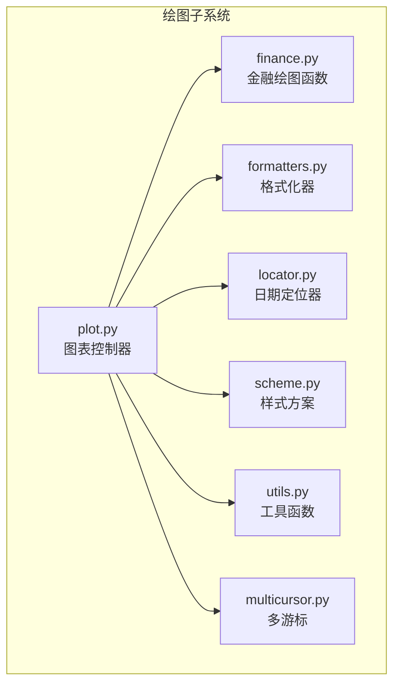
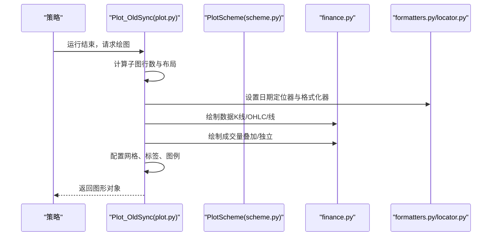
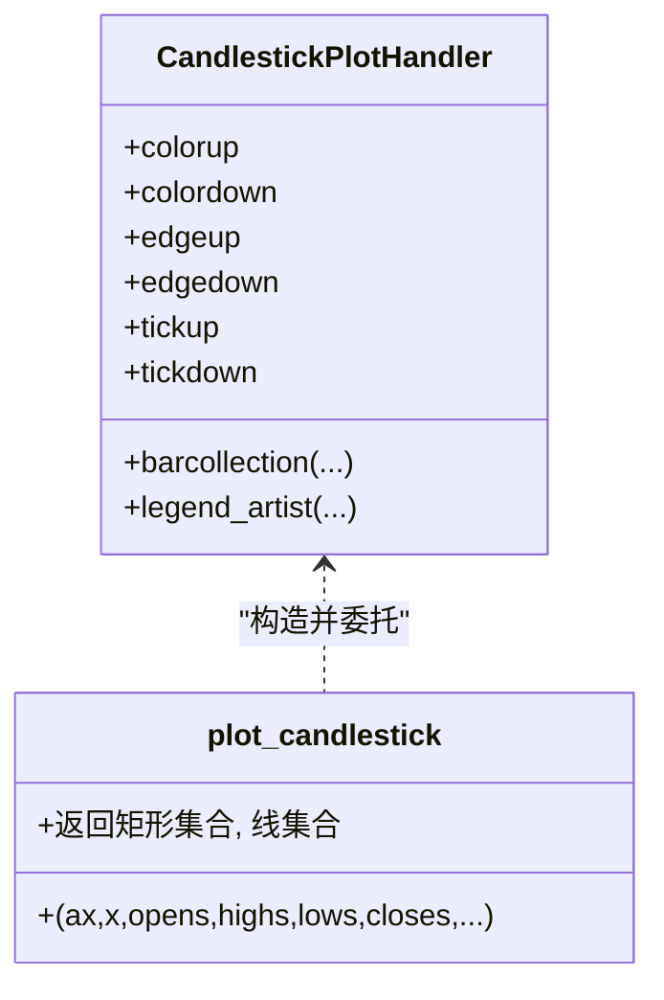
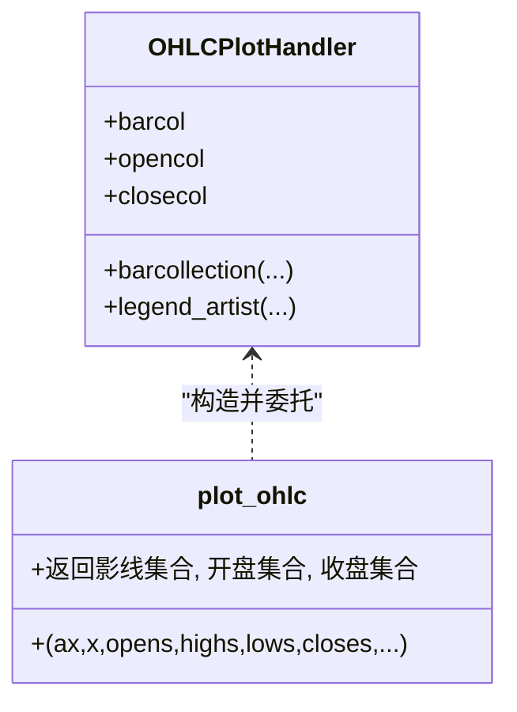
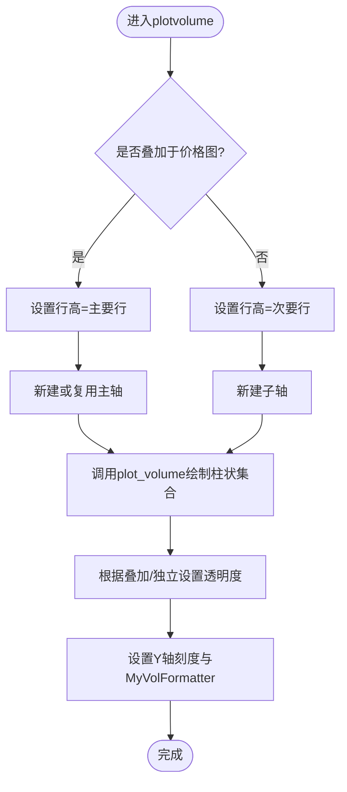
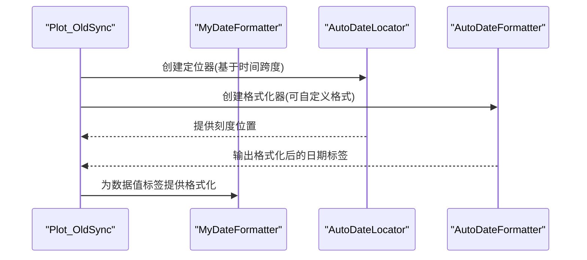
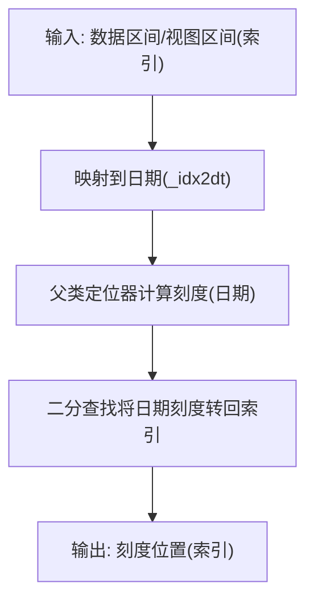
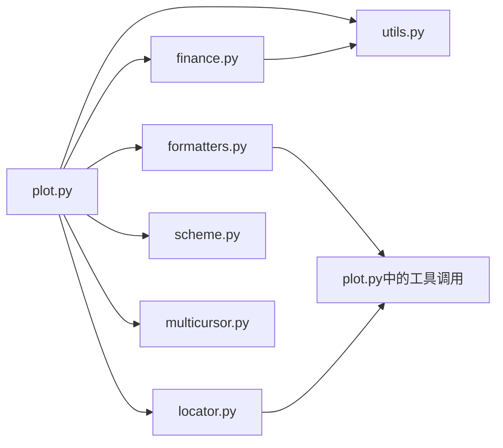

# 金融图表类型

<cite>
**本文引用的文件**
- [backtrader/plot/__init__.py](file://backtrader/plot/__init__.py)
- [backtrader/plot/plot.py](file://backtrader/plot/plot.py)
- [backtrader/plot/finance.py](file://backtrader/plot/finance.py)
- [backtrader/plot/formatters.py](file://backtrader/plot/formatters.py)
- [backtrader/plot/locator.py](file://backtrader/plot/locator.py)
- [backtrader/plot/scheme.py](file://backtrader/plot/scheme.py)
- [backtrader/plot/utils.py](file://backtrader/plot/utils.py)
- [backtrader/plot/multicursor.py](file://backtrader/plot/multicursor.py)
- [samples/lineplotter/lineplotter.py](file://samples/lineplotter/lineplotter.py)
- [samples/plot-same-axis/plot-same-axis.py](file://samples/plot-same-axis/plot-same-axis.py)
- [samples/partial-plot/partial-plot.py](file://samples/partial-plot/partial-plot.py)
</cite>

## 目录
1. [简介](#简介)
2. [项目结构](#项目结构)
3. [核心组件](#核心组件)
4. [架构总览](#架构总览)
5. [详细组件分析](#详细组件分析)
6. [依赖关系分析](#依赖关系分析)
7. [性能考量](#性能考量)
8. [故障排查指南](#故障排查指南)
9. [结论](#结论)
10. [附录](#附录)

## 简介
本章节面向Backtrader的金融图表系统，系统性介绍K线图（蜡烛图）、OHLC图与成交量图的绘制机制与配置方式，深入解析plot_candlestick、plot_ohlc、plot_volume等核心函数的实现原理与参数含义；同时阐述日期格式化器、数值格式化器、定位器等辅助组件的作用与用法；最后给出丰富的图表样式配置示例与最佳实践建议，帮助用户在不同场景下选择合适的图表类型并进行可视化定制。

## 项目结构
Backtrader的绘图子系统位于backtrader/plot目录，围绕策略回测结果生成多轴、多指标的综合图表。关键模块职责如下：
- plot.py：图表主控制器，负责布局、数据切片、坐标轴管理、定位器与格式化器装配、多游标联动、以及调用具体绘图函数。
- finance.py：提供K线图、OHLC线、成交量柱状图等金融专用绘图函数及其内部处理器类。
- formatters.py：日期与成交量数值格式化器，以及定位器/格式化的修补函数。
- locator.py：基于matplotlib日期定位器的重写版本，适配索引型x轴与时间序列转换。
- scheme.py：图表样式方案（颜色、透明度、网格、体积叠加等）的默认配置与索引映射。
- utils.py：绘图实用工具，如标签框样式与颜色明暗调整。
- multicursor.py：跨轴联动游标，提升多子图交互体验。
- 示例脚本：samples目录下的示例展示了如何通过策略参数或plot接口切换图表类型与样式。

**图表来源**
- [backtrader/plot/plot.py](file://backtrader/plot/plot.py#L1-L120)
- [backtrader/plot/finance.py](file://backtrader/plot/finance.py#L1-L120)
- [backtrader/plot/formatters.py](file://backtrader/plot/formatters.py#L1-L60)
- [backtrader/plot/locator.py](file://backtrader/plot/locator.py#L1-L60)
- [backtrader/plot/scheme.py](file://backtrader/plot/scheme.py#L1-L80)
- [backtrader/plot/utils.py](file://backtrader/plot/utils.py#L1-L40)
- [backtrader/plot/multicursor.py](file://backtrader/plot/multicursor.py#L1-L60)

**章节来源**
- [backtrader/plot/__init__.py](file://backtrader/plot/__init__.py#L1-L44)
- [backtrader/plot/plot.py](file://backtrader/plot/plot.py#L1-L120)

## 核心组件
- K线图（蜡烛图）处理器与函数
  - CandlestickPlotHandler：封装K线图的矩形实体（蜡烛体）与上下影线集合，支持涨跌分色、边缘与影线颜色、填充开关、透明度等。
  - plot_candlestick：对外暴露的K线图绘制入口，返回矩形集合与线段集合，便于图例与层级控制。
- OHLC图处理器与函数
  - OHLCPlotHandler：绘制上下影线与开盘/收盘标记，适合强调价格极值与端点。
  - plot_ohlc：返回三条集合（影线、开盘标记、收盘标记），可按需组合。
- 成交量图处理器与函数
  - VolumePlotHandler：绘制涨跌分色的柱状条，支持边缘着色与透明度。
  - plot_volume：返回柱状集合，用于叠加或独立子图展示。
- 图表样式方案
  - PlotScheme：集中定义风格（style）、颜色（barup/bardown/loc/volup/voldown）、透明度（baralpha/voltrans）、网格（grid）、体积显示（volume/voloverlay/volscaling/volpushup）、标签与图例（linevalues/valuetags/legendind/legendindloc/legenddataloc）等。
- 日期与数值格式化器
  - MyDateFormatter：将索引映射到真实日期并按strftime格式化。
  - MyVolFormatter：对成交量进行千位缩放（K/M/G/T/P）显示。
  - getlocator：根据时间跨度选择合适的日期定位器并修补其与日期的互转。
- 定位器
  - AutoDateLocator/RRuleLocator：适配索引型x轴的时间范围定位，支持自动间隔与规则周期定位。
  - AutoDateFormatter：基于定位器输出的日期格式化。
- 工具函数
  - shade_color：按百分比调整颜色明度，便于生成边框或阴影色。
  - tag_box_style：标签框路径样式，用于数值标签背景。
- 多游标
  - MultiCursor：跨轴垂直/水平联动游标，支持动画刷新与可见性控制。

**章节来源**
- [backtrader/plot/finance.py](file://backtrader/plot/finance.py#L34-L240)
- [backtrader/plot/finance.py](file://backtrader/plot/finance.py#L242-L360)
- [backtrader/plot/finance.py](file://backtrader/plot/finance.py#L362-L511)
- [backtrader/plot/scheme.py](file://backtrader/plot/scheme.py#L77-L190)
- [backtrader/plot/formatters.py](file://backtrader/plot/formatters.py#L30-L125)
- [backtrader/plot/locator.py](file://backtrader/plot/locator.py#L46-L260)
- [backtrader/plot/utils.py](file://backtrader/plot/utils.py#L66-L94)
- [backtrader/plot/multicursor.py](file://backtrader/plot/multicursor.py#L95-L240)

## 架构总览
Backtrader的绘图流程从策略运行结束后的数据切片开始，控制器根据策略与数据结构计算子图行数与布局，随后为每个数据源与指标分配坐标轴，设置日期定位器与格式化器，最终调用finance.py中的专用绘图函数完成绘制。

**图表来源**
- [backtrader/plot/plot.py](file://backtrader/plot/plot.py#L119-L274)
- [backtrader/plot/plot.py](file://backtrader/plot/plot.py#L276-L316)
- [backtrader/plot/plot.py](file://backtrader/plot/plot.py#L642-L800)
- [backtrader/plot/scheme.py](file://backtrader/plot/scheme.py#L77-L190)
- [backtrader/plot/finance.py](file://backtrader/plot/finance.py#L211-L240)
- [backtrader/plot/finance.py](file://backtrader/plot/finance.py#L495-L511)
- [backtrader/plot/finance.py](file://backtrader/plot/finance.py#L343-L360)

## 详细组件分析

### K线图（Candlestick）绘制
- 实现要点
  - 使用多边形集合绘制蜡烛体，使用线集合绘制上下影线。
  - 涨跌颜色由开盘/收盘比较决定，支持自定义涨/跌颜色与边框、影线颜色。
  - 支持填充与透明度控制，边框颜色可通过明暗调整生成。
  - 返回两个集合以确保图例优先与层级正确。
- 关键参数
  - colorup/colordown：涨/跌颜色
  - edgeup/edgedown/tickup/tickdown：边框与影线颜色（未指定时按shade_color生成）
  - width/tickwidth：蜡烛体宽度与影线宽度
  - edgeadjust/edgeshading：边框偏移与明暗调整
  - alpha：透明度
  - fillup/filldown：是否填充
- 典型调用位置
  - 在plotdata中根据样式选择调用plot_candlestick或plot_ohlc/plot_lineonclose。

**图表来源**
- [backtrader/plot/finance.py](file://backtrader/plot/finance.py#L34-L208)
- [backtrader/plot/finance.py](file://backtrader/plot/finance.py#L211-L240)

**章节来源**
- [backtrader/plot/finance.py](file://backtrader/plot/finance.py#L34-L240)
- [backtrader/plot/plot.py](file://backtrader/plot/plot.py#L714-L722)

### OHLC图绘制
- 实现要点
  - 分别绘制上下影线、开盘标记与收盘标记三类集合，便于灵活组合。
  - 涨跌颜色同样依据开盘/收盘比较确定。
- 关键参数
  - colorup/colordown：涨/跌颜色
  - width/tickwidth：影线与标记线宽
  - alpha/label：透明度与图例标签
- 典型调用位置
  - 当样式非“candle”时，默认走OHLC绘制。

**图表来源**
- [backtrader/plot/finance.py](file://backtrader/plot/finance.py#L362-L492)
- [backtrader/plot/finance.py](file://backtrader/plot/finance.py#L495-L511)

**章节来源**
- [backtrader/plot/finance.py](file://backtrader/plot/finance.py#L362-L511)
- [backtrader/plot/plot.py](file://backtrader/plot/plot.py#L724-L730)

### 成交量图绘制
- 实现要点
  - 使用多边形集合绘制涨/跌分色柱状条，支持边框颜色与透明度。
  - 可作为叠加图层（与价格图共享x轴）或独立子图展示。
  - Y轴刻度采用MyVolFormatter进行千位缩放显示。
- 关键参数
  - colorup/colordown：涨/跌颜色
  - width/alpha：柱宽与透明度
  - edgeshading/edgeadjust：边框明暗与边距微调
- 典型调用位置
  - plotvolume：根据方案决定叠加或独立，并设置Y轴刻度与格式化器。

**图表来源**
- [backtrader/plot/plot.py](file://backtrader/plot/plot.py#L578-L640)
- [backtrader/plot/finance.py](file://backtrader/plot/finance.py#L343-L360)

**章节来源**
- [backtrader/plot/finance.py](file://backtrader/plot/finance.py#L242-L360)
- [backtrader/plot/plot.py](file://backtrader/plot/plot.py#L578-L640)

### 日期与数值格式化器
- MyDateFormatter
  - 将索引映射到真实日期，再按strftime格式化显示。
  - 与AutoDateFormatter配合，实现x轴日期标签的统一格式。
- MyVolFormatter
  - 对Y轴成交量进行千位缩放（K/M/G/T/P），避免过大数值影响可读性。
- getlocator
  - 基于时间跨度选择合适的日期定位器，并修补其与日期数组的互转逻辑，保证索引与日期的正确映射。

**图表来源**
- [backtrader/plot/plot.py](file://backtrader/plot/plot.py#L276-L316)
- [backtrader/plot/formatters.py](file://backtrader/plot/formatters.py#L53-L125)
- [backtrader/plot/locator.py](file://backtrader/plot/locator.py#L95-L260)

**章节来源**
- [backtrader/plot/formatters.py](file://backtrader/plot/formatters.py#L30-L125)
- [backtrader/plot/locator.py](file://backtrader/plot/locator.py#L46-L260)
- [backtrader/plot/plot.py](file://backtrader/plot/plot.py#L276-L316)

### 定位器适配索引型x轴
- AutoDateLocator/RRuleLocator
  - 重写datalim_to_dt/viewlim_to_dt，将数据区间与视图区间从索引映射到日期，再交由父类定位。
  - tick_values通过二分查找将日期刻度转换回索引位置，确保与数据索引一致。
- AutoDateFormatter
  - 将索引映射到日期后，使用父类格式化能力输出标签。

**图表来源**
- [backtrader/plot/locator.py](file://backtrader/plot/locator.py#L61-L127)
- [backtrader/plot/locator.py](file://backtrader/plot/locator.py#L242-L260)

**章节来源**
- [backtrader/plot/locator.py](file://backtrader/plot/locator.py#L46-L260)

### 图表样式配置（颜色主题、线条样式、填充效果）
- 样式方案（PlotScheme）
  - style：'line'/'bar'/'candle'，决定主图绘制类型。
  - 颜色：loc（线在收盘价）、barup/bardown（K线涨/跌）、volup/voldown（成交量涨/跌）。
  - 透明度：baralpha（K线填充透明度）、voltrans（成交量叠加透明度）。
  - 填充：barupfill/bardownfill（K线是否填充）。
  - 体积：volume（是否显示）、voloverlay（是否叠加）、volscaling（叠加缩放比例）、volpushup（叠加上推）。
  - 网格与标签：grid、linevalues、valuetags、legendind、legendindloc、legenddataloc。
  - 字体与旋转：subtxtsize、tickrotation、fmt_x_ticks/fmt_x_data。
- 颜色索引与主题
  - lcolors与color索引映射，结合shade_color生成边框/阴影色，形成统一主题。

**章节来源**
- [backtrader/plot/scheme.py](file://backtrader/plot/scheme.py#L77-L190)
- [backtrader/plot/utils.py](file://backtrader/plot/utils.py#L66-L94)

### 适用场景与最佳实践
- K线图（candle）
  - 适用于需要突出实体形态与涨跌关系的场景，建议开启填充以增强对比。
  - 若与成交量叠加，建议适度降低透明度并合理设置volpushup避免遮挡。
- OHLC图（bar/line）
  - 适用于强调价格极值与端点变化，适合快速浏览趋势。
  - 可与指标叠加在同一轴，便于观察信号与价格关系。
- 成交量图（volume）
  - 建议与价格图叠加以直观反映量能配合度；若独立展示，注意Y轴刻度缩放（MyVolFormatter）。
  - 涨/跌颜色应与价格保持一致的涨跌语义，便于交叉解读。

**章节来源**
- [backtrader/plot/plot.py](file://backtrader/plot/plot.py#L714-L730)
- [backtrader/plot/plot.py](file://backtrader/plot/plot.py#L671-L760)

## 依赖关系分析
- 组件耦合
  - plot.py作为控制器，依赖finance.py（绘图函数）、formatters.py（格式化器）、locator.py（定位器）、scheme.py（样式）、utils.py（工具）、multicursor.py（游标）。
  - finance.py内部处理器类依赖utils.py的shade_color与matplotlib集合/线段/多边形集合。
  - formatters.py与locator.py共同解决索引型x轴与日期的映射问题。
- 外部依赖
  - matplotlib（collections、lines、dates、ticker、legend等）。
  - numpy（数值处理）。
  - dateutil（相对时间差计算）。

**图表来源**
- [backtrader/plot/plot.py](file://backtrader/plot/plot.py#L42-L47)
- [backtrader/plot/finance.py](file://backtrader/plot/finance.py#L31-L32)
- [backtrader/plot/formatters.py](file://backtrader/plot/formatters.py#L24-L28)
- [backtrader/plot/locator.py](file://backtrader/plot/locator.py#L32-L43)

**章节来源**
- [backtrader/plot/plot.py](file://backtrader/plot/plot.py#L42-L47)

## 性能考量
- 数据切片与索引映射
  - 控制器在绘图前对时间范围进行切片与索引映射，减少不必要的绘制开销。
- 集合绘制
  - 使用matplotlib的集合（PolyCollection/LineCollection）批量绘制，较逐条线段绘制更高效。
- 动画与刷新
  - 多游标支持useblit与动画更新，减少全图重绘成本；但在某些后端可能不支持，会回退到惰性刷新。
- 透明度与层级
  - 合理设置透明度与zorder，避免过度叠加导致的渲染压力。

[本节为通用指导，无需特定文件分析]

## 故障排查指南
- 日期标签异常或越界
  - 检查MyDateFormatter的索引边界保护与strftime格式设置；确认getlocator修补后的viewlim_to_dt/datalim_to_dt行为。
- 成交量无显示或刻度异常
  - 确认volume开关、voloverlay与volscaling设置；检查MyVolFormatter的divisor与suffix计算。
- 游标不同步或多轴错位
  - 检查MultiCursor的共享轴设置与每轴y限；确保各轴y轴范围一致，避免水平线位置错乱。
- 图例顺序与标签缺失
  - 确认legendind与legendindloc设置；检查plotdata中对handles/labels的插入顺序。

**章节来源**
- [backtrader/plot/formatters.py](file://backtrader/plot/formatters.py#L53-L125)
- [backtrader/plot/plot.py](file://backtrader/plot/plot.py#L763-L800)
- [backtrader/plot/multicursor.py](file://backtrader/plot/multicursor.py#L173-L240)

## 结论
Backtrader的金融图表系统通过清晰的模块划分与稳健的数据流设计，实现了从策略数据到K线/OHLC/成交量等专业图表的完整链路。借助PlotScheme统一风格、formatters/locator适配日期、finance.py提供专业绘图函数，以及multicursor提升交互体验，用户可在不同时间尺度与业务场景下灵活选择并定制图表类型，获得高质量的可视化结果。

[本节为总结，无需特定文件分析]

## 附录
- 示例脚本与用法参考
  - 样例：lineplotter.py展示了通过plot参数切换样式（如style="candle"）的用法。
  - 样例：plot-same-axis.py展示了将多个指标绘制在同一轴上的策略与参数设置。
  - 样例：partial-plot.py展示了部分时间段的绘图与参数传递方式。

**章节来源**
- [samples/lineplotter/lineplotter.py](file://samples/lineplotter/lineplotter.py#L65-L73)
- [samples/plot-same-axis/plot-same-axis.py](file://samples/plot-same-axis/plot-same-axis.py#L97-L99)
- [samples/partial-plot/partial-plot.py](file://samples/partial-plot/partial-plot.py#L82-L84)