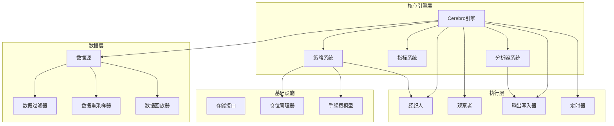
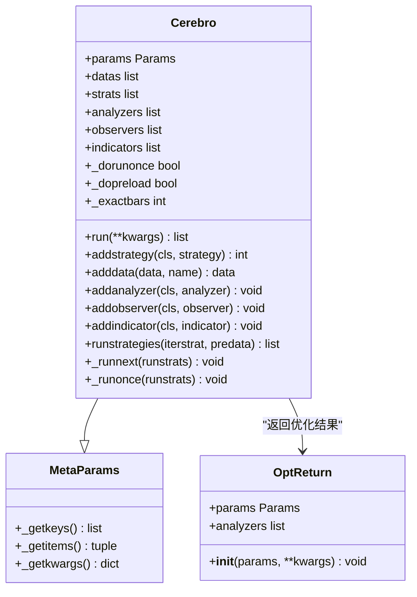
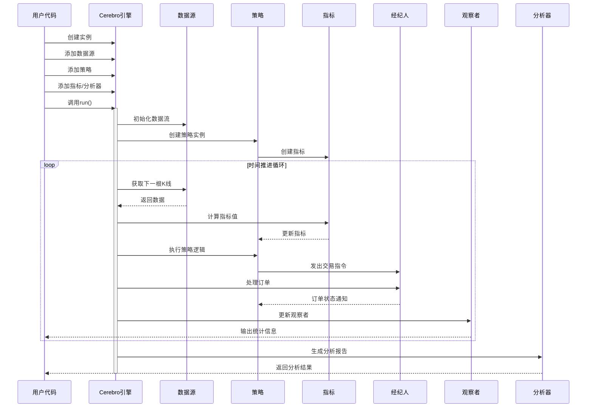
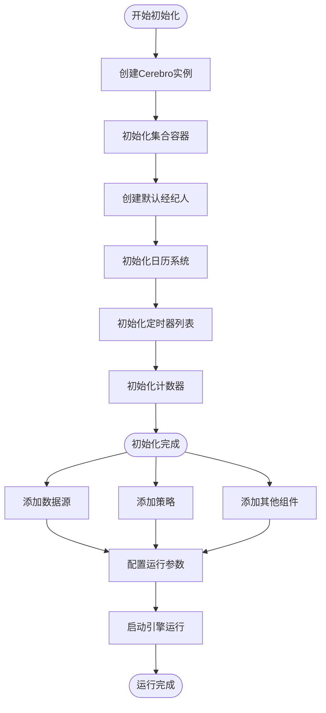
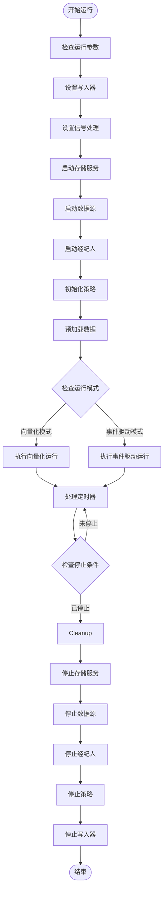
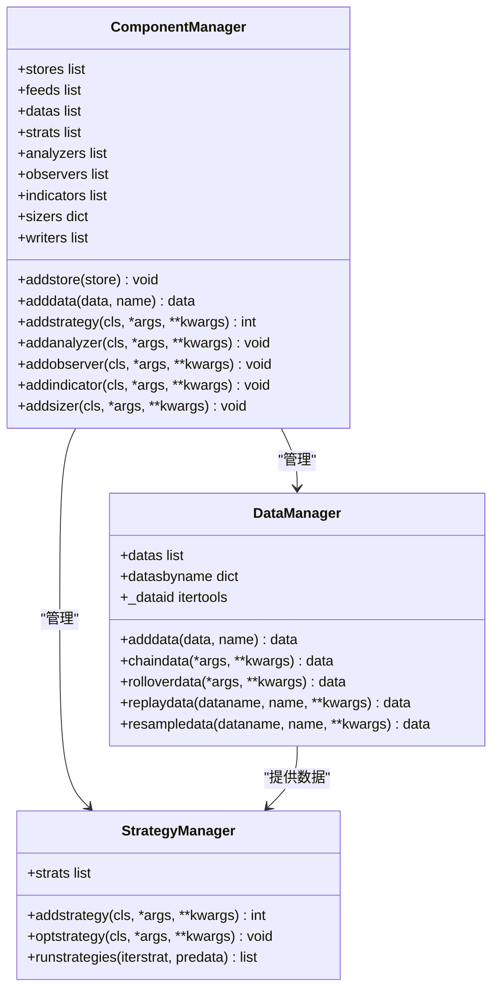
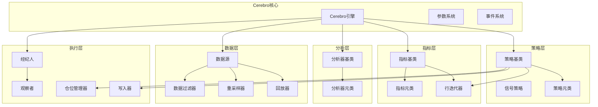

# Cerebro核心引擎

<cite>
**本文档引用的文件**
- [backtrader/cerebro.py](file://backtrader/cerebro.py)
- [backtrader/__init__.py](file://backtrader/__init__.py)
- [backtrader/strategy.py](file://backtrader/strategy.py)
- [backtrader/indicator.py](file://backtrader/indicator.py)
- [backtrader/analyzer.py](file://backtrader/analyzer.py)
- [backtrader/feed.py](file://backtrader/feed.py)
- [samples/yahoo-test/yahoo-test.py](file://samples/yahoo-test/yahoo-test.py)
- [samples/multidata-strategy/multidata-strategy.py](file://samples/multidata-strategy/multidata-strategy.py)
- [backtrader/btrun/btrun.py](file://backtrader/btrun/btrun.py)
</cite>

## 目录
1. [简介](#简介)
2. [项目结构](#项目结构)
3. [核心组件](#核心组件)
4. [架构概览](#架构概览)
5. [详细组件分析](#详细组件分析)
6. [依赖关系分析](#依赖关系分析)
7. [性能考虑](#性能考虑)
8. [故障排除指南](#故障排除指南)
9. [结论](#结论)
10. [附录](#附录)

## 简介

Cerebro是Backtrader框架的核心引擎，负责协调整个回测系统的运行。它作为中央控制器，管理数据源、策略、指标、分析器、观察者等各个组件的生命周期和交互关系。Cerebro提供了灵活的配置选项，支持单进程和多进程优化运行，具备强大的内存管理和性能优化能力。

该引擎采用事件驱动的架构模式，通过统一的时间轴推进所有组件的执行，确保数据同步和计算一致性。同时，Cerebro还支持实时交易、信号处理、定时器等功能，为复杂的交易系统提供完整的支撑。

## 项目结构

Backtrader项目的整体架构围绕Cerebro引擎构建，主要包含以下核心模块：



**图表来源**
- [backtrader/cerebro.py](file://backtrader/cerebro.py#L60-L294)
- [backtrader/__init__.py](file://backtrader/__init__.py#L39-L84)

**章节来源**
- [backtrader/cerebro.py](file://backtrader/cerebro.py#L1-L100)
- [backtrader/__init__.py](file://backtrader/__init__.py#L24-L91)

## 核心组件

### Cerebro类架构

Cerebro类是整个系统的核心控制器，采用了元类编程和参数化设计模式：



**图表来源**
- [backtrader/cerebro.py](file://backtrader/cerebro.py#L60-L294)
- [backtrader/cerebro.py](file://backtrader/cerebro.py#L53-L58)

### 参数配置系统

Cerebro提供了丰富的配置参数，涵盖预加载、向量化运行、内存管理等多个方面：

| 参数名称 | 默认值 | 描述 |
|---------|--------|------|
| `preload` | `True` | 是否预加载数据源 |
| `runonce` | `True` | 是否启用向量化运行模式 |
| `live` | `False` | 是否启用实时模式 |
| `maxcpus` | `None` | 优化时使用的CPU核心数 |
| `stdstats` | `True` | 是否添加默认观察者 |
| `exactbars` | `False` | 内存保存策略 |
| `objcache` | `False` | 是否启用对象缓存 |
| `writer` | `False` | 是否启用默认写入器 |
| `tradehistory` | `False` | 是否记录交易历史 |

**章节来源**
- [backtrader/cerebro.py](file://backtrader/cerebro.py#L61-L294)

## 架构概览

Cerebro引擎采用分层架构设计，各层之间职责明确，耦合度低：



**图表来源**
- [backtrader/cerebro.py](file://backtrader/cerebro.py#L1030-L1163)
- [backtrader/cerebro.py](file://backtrader/cerebro.py#L1171-L1338)

**章节来源**
- [backtrader/cerebro.py](file://backtrader/cerebro.py#L1030-L1338)

## 详细组件分析

### 初始化过程

Cerebro的初始化过程涉及多个步骤，确保系统各组件正确配置：



**图表来源**
- [backtrader/cerebro.py](file://backtrader/cerebro.py#L296-L328)

### 运行时协调机制

Cerebro通过统一的时间轴推进所有组件的执行，确保数据同步和计算一致性：



**图表来源**
- [backtrader/cerebro.py](file://backtrader/cerebro.py#L1030-L1163)
- [backtrader/cerebro.py](file://backtrader/cerebro.py#L1498-L1717)

### 组件管理机制

Cerebro实现了统一的组件管理机制，支持动态添加和移除各种类型的组件：



**图表来源**
- [backtrader/cerebro.py](file://backtrader/cerebro.py#L300-L317)
- [backtrader/cerebro.py](file://backtrader/cerebro.py#L752-L848)

**章节来源**
- [backtrader/cerebro.py](file://backtrader/cerebro.py#L300-L848)

### 配置选项详解

#### 预加载配置 (`preload`)
- **作用**: 控制是否在运行前预加载所有数据到内存中
- **影响**: 启用后可提高运行速度，但会增加内存占用
- **适用场景**: 数据量适中或需要快速回测的场景

#### 向量化运行 (`runonce`)
- **作用**: 启用向量化计算模式，提高计算效率
- **影响**: 在某些情况下可能影响指标的准确性
- **适用场景**: 对性能要求较高且指标计算相对简单的策略

#### 内存管理 (`exactbars`)
- **值类型**: 支持 `True/False/1/-1/-2` 等多种配置
- **功能**: 控制内存保存策略，平衡内存占用和计算精度
- **适用场景**: 大数据量回测或内存受限的环境

#### 实时模式 (`live`)
- **作用**: 启用实时数据处理模式
- **影响**: 自动禁用预加载和向量化运行
- **适用场景**: 实盘交易或需要实时数据处理的场景

**章节来源**
- [backtrader/cerebro.py](file://backtrader/cerebro.py#L63-L177)

## 依赖关系分析

Cerebro引擎与各个子系统之间的依赖关系如下：



**图表来源**
- [backtrader/cerebro.py](file://backtrader/cerebro.py#L40-L48)
- [backtrader/strategy.py](file://backtrader/strategy.py#L43-L104)
- [backtrader/indicator.py](file://backtrader/indicator.py#L32-L89)
- [backtrader/analyzer.py](file://backtrader/analyzer.py#L34-L86)

**章节来源**
- [backtrader/cerebro.py](file://backtrader/cerebro.py#L1-L50)
- [backtrader/strategy.py](file://backtrader/strategy.py#L1-L50)
- [backtrader/indicator.py](file://backtrader/indicator.py#L1-L30)
- [backtrader/analyzer.py](file://backtrader/analyzer.py#L1-L35)

## 性能考虑

### 内存优化策略

Cerebro提供了多种内存优化策略，可根据具体需求选择：

1. **精确栏数模式 (`exactbars=True`)**
   - 最大化内存节省
   - 禁用预加载和向量化运行
   - 不支持绘图功能

2. **部分内存保存 (`exactbars=-1`)**
   - 保留数据源和策略级指标的完整数据
   - 允许绘图和预加载
   - 关闭向量化运行

3. **按需内存保存 (`exactbars=-2`)**
   - 仅保存不参与绘图的指标
   - 保持所有功能可用性

### 并行优化

Cerebro支持多进程优化运行，通过 `maxcpus` 参数控制并行度：

```python
# 示例：启用多进程优化
cerebro = bt.Cerebro()
cerebro.optstrategy(MyStrategy, period=range(10, 30))
cerebro.run(maxcpus=4)  # 使用4个CPU核心
```

### 缓存机制

Cerebro实现了对象缓存机制，通过 `objcache` 参数控制：

- **启用缓存**: 减少重复对象创建开销
- **禁用缓存**: 避免潜在的对象状态冲突问题

**章节来源**
- [backtrader/cerebro.py](file://backtrader/cerebro.py#L121-L177)
- [backtrader/cerebro.py](file://backtrader/cerebro.py#L1055-L1060)

## 故障排除指南

### 常见问题及解决方案

#### 数据预加载问题
**症状**: 内存不足或启动缓慢
**解决方案**: 
- 设置 `preload=False` 禁用预加载
- 使用 `exactbars` 参数优化内存使用
- 考虑使用实时数据源

#### 性能问题
**症状**: 回测运行缓慢
**解决方案**:
- 启用 `runonce=True` 向量化运行
- 减少指标数量和复杂度
- 优化策略逻辑

#### 内存泄漏
**症状**: 长时间运行后内存持续增长
**解决方案**:
- 启用适当的 `exactbars` 模式
- 定期清理不必要的观察者和分析器
- 检查自定义组件的资源释放

### 调试技巧

1. **启用交易历史记录**
   ```python
   cerebro = bt.Cerebro()
   cerebro.p.tradehistory = True  # 记录详细交易历史
   ```

2. **使用默认观察者**
   ```python
   cerebro = bt.Cerebro(stdstats=True)  # 启用标准统计观察者
   ```

3. **配置写入器**
   ```python
   cerebro.addwriter(bt.WriterFile, csv=True)  # 输出CSV格式结果
   ```

**章节来源**
- [backtrader/cerebro.py](file://backtrader/cerebro.py#L184-L188)
- [backtrader/cerebro.py](file://backtrader/cerebro.py#L178-L183)

## 结论

Cerebro核心引擎作为Backtrader框架的中枢，展现了优秀的架构设计和实现质量。其特点包括：

1. **高度模块化**: 通过清晰的组件分离和接口设计，实现了良好的可维护性和可扩展性

2. **灵活配置**: 丰富的参数选项满足不同场景的需求，从简单回测到复杂实盘交易

3. **性能优化**: 采用多种优化策略，在准确性和性能之间取得良好平衡

4. **易于使用**: 简洁的API设计和完善的文档，降低了用户的学习成本

5. **强大功能**: 支持多进程优化、实时交易、信号处理等高级特性

对于开发者而言，理解Cerebro的工作原理有助于更好地利用Backtrader框架进行量化交易开发。建议在实际应用中根据具体需求合理配置参数，充分利用引擎提供的各种优化功能。

## 附录

### 代码示例

#### 基本使用示例
```python
import backtrader as bt

# 创建Cerebro实例
cerebro = bt.Cerebro()

# 添加策略
cerebro.addstrategy(bt.Strategy)

# 添加数据源
data = bt.feeds.YahooFinanceData(dataname='AAPL')
cerebro.adddata(data)

# 运行回测
results = cerebro.run()
```

#### 高级配置示例
```python
import backtrader as bt

# 创建Cerebro实例并配置参数
cerebro = bt.Cerebro(
    preload=True,
    runonce=True,
    exactbars=-1,
    stdstats=True,
    tradehistory=True
)

# 添加自定义组件
cerebro.addanalyzer(bt.analyzers.SharpeRatio)
cerebro.addobserver(bt.observers.DrawDown)
cerebro.addwriter(bt.WriterFile, csv=True)

# 运行优化
cerebro.optstrategy(MyStrategy, period=range(10, 30))
results = cerebro.run(maxcpus=4)
```

#### 多数据源示例
```python
import backtrader as bt

cerebro = bt.Cerebro()

# 添加多个数据源
data1 = bt.feeds.YahooFinanceData(dataname='AAPL')
data2 = bt.feeds.YahooFinanceData(dataname='MSFT')
cerebro.adddata(data1)
cerebro.adddata(data2)

# 使用多数据策略
cerebro.addstrategy(MultiDataStrategy)
results = cerebro.run()
```

**章节来源**
- [samples/yahoo-test/yahoo-test.py](file://samples/yahoo-test/yahoo-test.py#L33-L67)
- [samples/multidata-strategy/multidata-strategy.py](file://samples/multidata-strategy/multidata-strategy.py#L117-L164)

### 命令行参数配置

Cerebro还支持通过命令行参数进行配置：

```bash
# 基本回测命令
python sample.py --data AAPL --fromdate 2020-01-01 --todate 2020-12-31

# 配置Cerebro参数
python sample.py --cerebro "preload=True,runonce=False,exactbars=-1"

# 禁用标准统计观察者
python sample.py --nostdstats
```

**章节来源**
- [backtrader/btrun/btrun.py](file://backtrader/btrun/btrun.py#L427-L451)