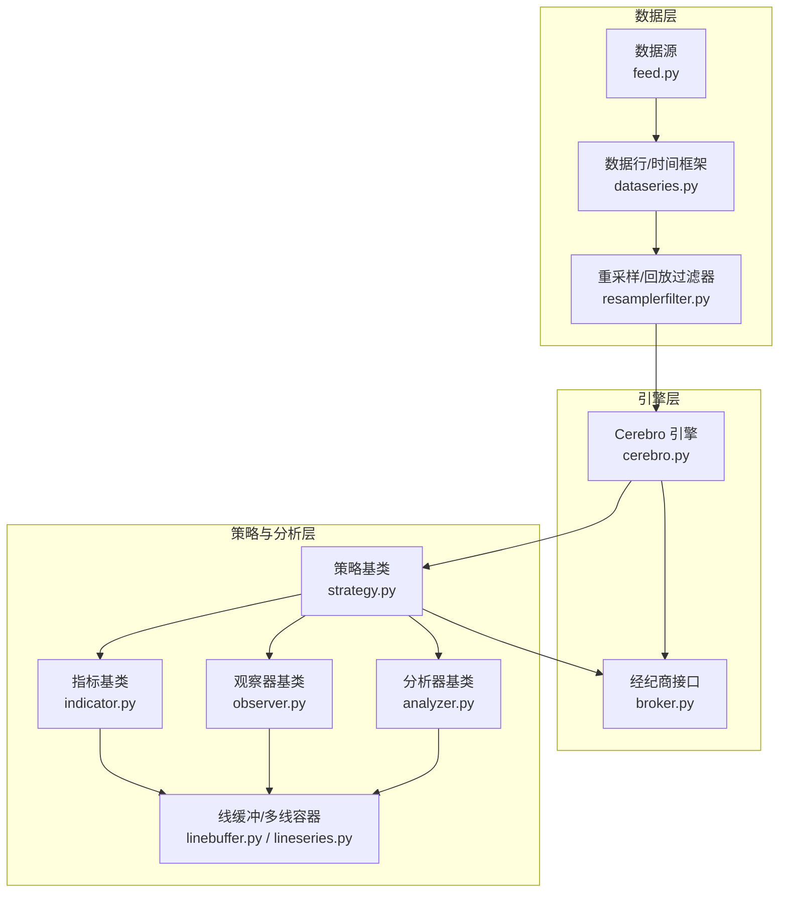
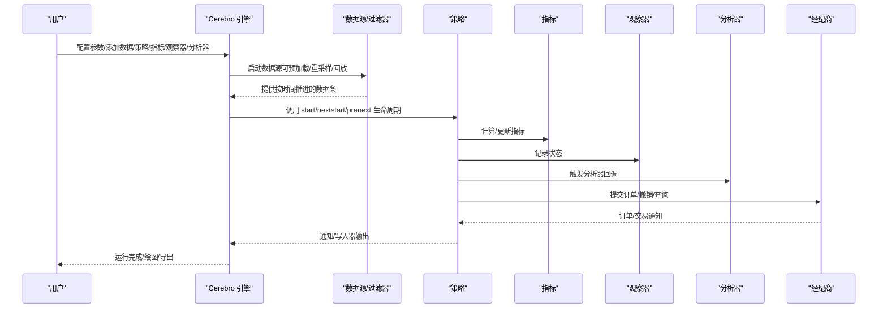
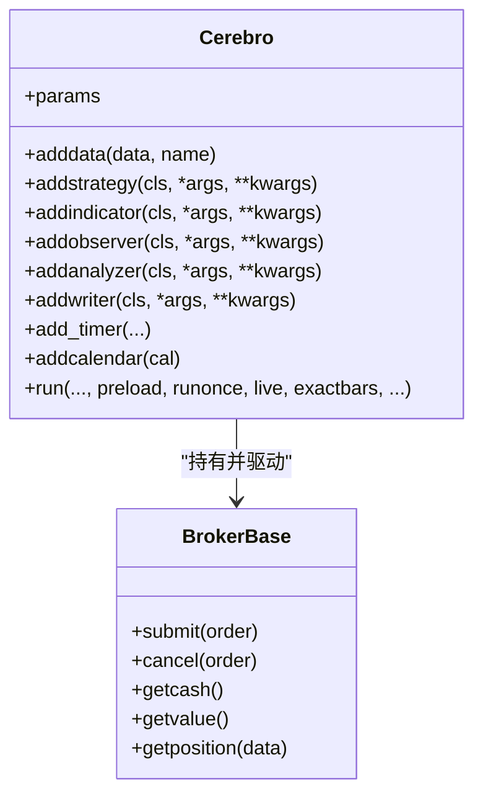
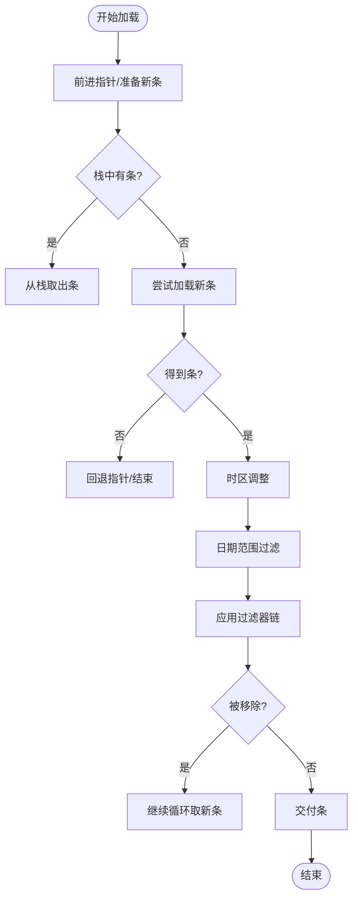
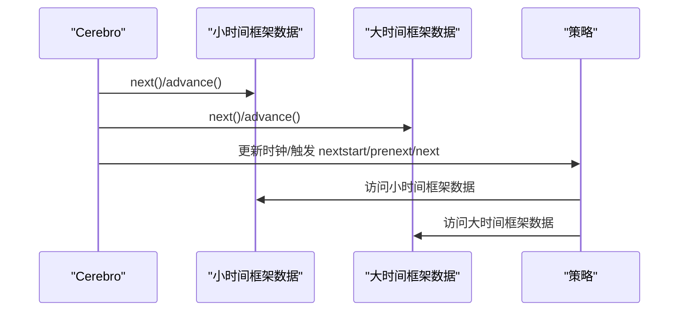
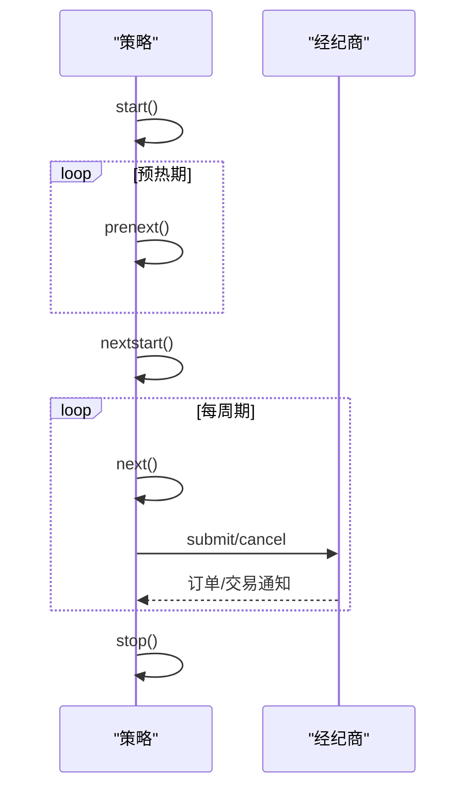
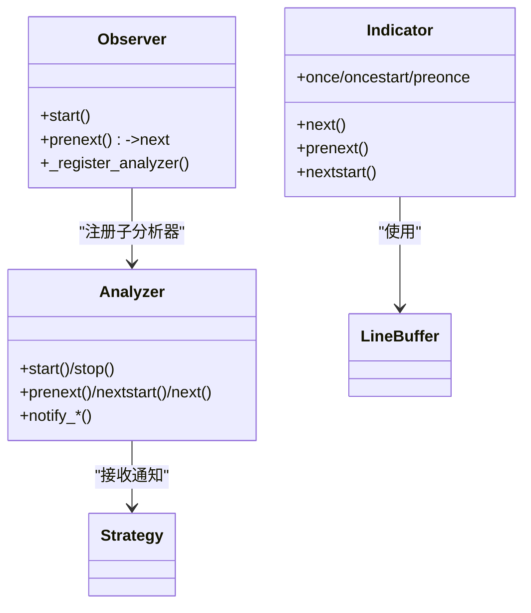
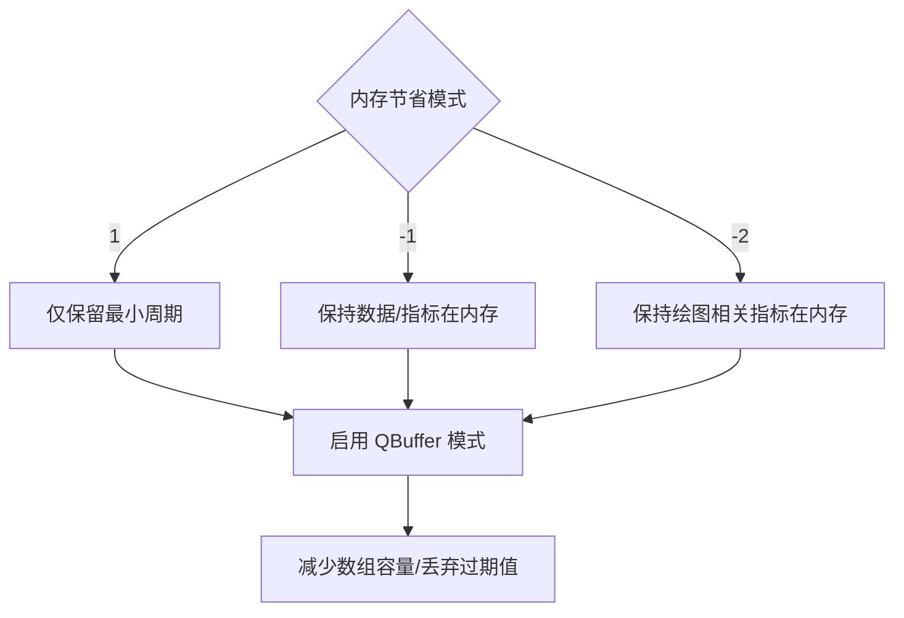
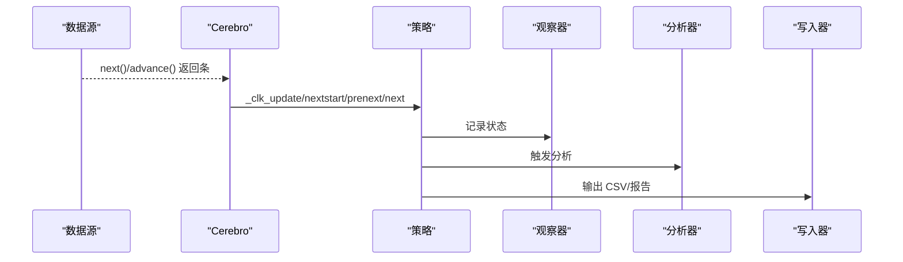
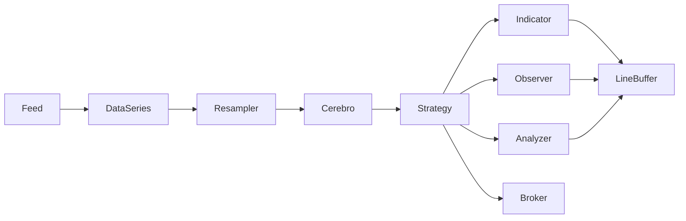

# 回测引擎

<cite>
**本文引用的文件**
- [backtrader/cerebro.py](file://backtrader/cerebro.py)
- [backtrader/feed.py](file://backtrader/feed.py)
- [backtrader/strategy.py](file://backtrader/strategy.py)
- [backtrader/dataseries.py](file://backtrader/dataseries.py)
- [backtrader/linebuffer.py](file://backtrader/linebuffer.py)
- [backtrader/indicator.py](file://backtrader/indicator.py)
- [backtrader/analyzer.py](file://backtrader/analyzer.py)
- [backtrader/observer.py](file://backtrader/observer.py)
- [backtrader/broker.py](file://backtrader/broker.py)
- [backtrader/resamplerfilter.py](file://backtrader/resamplerfilter.py)
- [backtrader/lineseries.py](file://backtrader/lineseries.py)
- [backtrader/__init__.py](file://backtrader/__init__.py)
- [samples/data-multitimeframe/data-multitimeframe.py](file://samples/data-multitimeframe/data-multitimeframe.py)
- [samples/multidata-strategy/multidata-strategy.py](file://samples/multidata-strategy/multidata-strategy.py)
- [samples/memory-savings/memory-savings.py](file://samples/memory-savings/memory-savings.py)
</cite>

## 目录
1. [引言](#引言)
2. [项目结构](#项目结构)
3. [核心组件](#核心组件)
4. [架构总览](#架构总览)
5. [详细组件分析](#详细组件分析)
6. [依赖关系分析](#依赖关系分析)
7. [性能考量](#性能考量)
8. [故障排查指南](#故障排查指南)
9. [结论](#结论)
10. [附录](#附录)

## 引言
本文件系统化梳理 Backtrader 回测引擎的架构与实现，重点覆盖 Cerebro 引擎的核心工作机制：时间序列处理、多数据流与多时间框架支持、策略执行流程、内存管理与向量化计算、性能优化与扩展点。文档同时给出基于仓库示例的配置与使用指引，并通过图示帮助读者建立对引擎整体运作的直观理解。

## 项目结构
Backtrader 的核心模块围绕“数据源 → 引擎（Cerebro）→ 策略/指标/观察器/分析器 → 经纪商/订单/交易”这一主链路组织。关键目录与职责概览如下：
- backtrader/cerebro.py：Cerebro 引擎入口与运行控制
- backtrader/feed.py：数据源抽象与加载、过滤、重采样/回放
- backtrader/strategy.py：策略基类与生命周期钩子
- backtrader/indicator.py：指标基类与运行模式
- backtrader/analyzer.py：分析器基类与时间框架分析
- backtrader/observer.py：观察器基类
- backtrader/broker.py：经纪商接口与委托执行
- backtrader/linebuffer.py、backtrader/lineseries.py：线缓冲与多线容器
- backtrader/dataseries.py：时间框架与数据行定义
- backtrader/resamplerfilter.py：重采样与回放过滤器
- samples/*：示例脚本，演示多时间框架、多数据流、内存节省等用法

图表来源
- [backtrader/cerebro.py](file://backtrader/cerebro.py#L60-L320)
- [backtrader/feed.py](file://backtrader/feed.py#L122-L598)
- [backtrader/strategy.py](file://backtrader/strategy.py#L107-L494)
- [backtrader/indicator.py](file://backtrader/indicator.py#L90-L137)
- [backtrader/analyzer.py](file://backtrader/analyzer.py#L89-L268)
- [backtrader/observer.py](file://backtrader/observer.py#L46-L68)
- [backtrader/broker.py](file://backtrader/broker.py#L49-L167)
- [backtrader/linebuffer.py](file://backtrader/linebuffer.py#L50-L148)
- [backtrader/lineseries.py](file://backtrader/lineseries.py#L444-L573)
- [backtrader/dataseries.py](file://backtrader/dataseries.py#L60-L104)
- [backtrader/resamplerfilter.py](file://backtrader/resamplerfilter.py#L435-L561)

章节来源
- [backtrader/__init__.py](file://backtrader/__init__.py#L24-L91)

## 核心组件
- Cerebro 引擎：统一调度数据、策略、指标、观察器、分析器、经纪商与写入器；控制运行模式（预加载、一次性向量化、实时、内存节省等）
- 数据源与过滤：抽象数据源、时间框架、会话边界、过滤器链、重采样/回放
- 线缓冲与多线容器：提供可前移/后退/扩展的数组式缓冲区，支撑指标与观察器的高效计算与绘图
- 策略/指标/观察器/分析器：策略生命周期与通知；指标向量/事件两种运行模式；观察器记录状态；分析器按周期或全量产出统计
- 经纪商：提交/取消订单、仓位查询、佣金与资金模式

章节来源
- [backtrader/cerebro.py](file://backtrader/cerebro.py#L60-L320)
- [backtrader/feed.py](file://backtrader/feed.py#L122-L598)
- [backtrader/linebuffer.py](file://backtrader/linebuffer.py#L50-L148)
- [backtrader/lineseries.py](file://backtrader/lineseries.py#L444-L573)
- [backtrader/strategy.py](file://backtrader/strategy.py#L107-L494)
- [backtrader/indicator.py](file://backtrader/indicator.py#L90-L137)
- [backtrader/analyzer.py](file://backtrader/analyzer.py#L89-L268)
- [backtrader/observer.py](file://backtrader/observer.py#L46-L68)
- [backtrader/broker.py](file://backtrader/broker.py#L49-L167)

## 架构总览
下图展示从数据加载到策略执行再到结果输出的端到端流程，以及各模块间的交互关系。

图表来源
- [backtrader/cerebro.py](file://backtrader/cerebro.py#L296-L320)
- [backtrader/feed.py](file://backtrader/feed.py#L202-L536)
- [backtrader/strategy.py](file://backtrader/strategy.py#L393-L494)
- [backtrader/analyzer.py](file://backtrader/analyzer.py#L190-L245)
- [backtrader/observer.py](file://backtrader/observer.py#L64-L68)
- [backtrader/broker.py](file://backtrader/broker.py#L145-L166)

## 详细组件分析

### Cerebro 引擎：核心调度与运行模式
- 参数与运行模式
  - 预加载（preload）、一次性向量化（runonce）、实时（live）、内存节省（exactbars）、对象缓存（objcache）、优化加速（optdatas/optreturn）、时区与定时器（tz/add_timer）、作弊开盘（cheat_on_open）等
- 关键方法
  - 添加数据/策略/指标/观察器/分析器/写入器
  - 定时器调度与通知
  - 数据/存储/数据源通知分发
  - 运行控制（run/runonce/stop）

图表来源
- [backtrader/cerebro.py](file://backtrader/cerebro.py#L60-L320)
- [backtrader/broker.py](file://backtrader/broker.py#L49-L167)

章节来源
- [backtrader/cerebro.py](file://backtrader/cerebro.py#L60-L320)
- [backtrader/cerebro.py](file://backtrader/cerebro.py#L421-L543)
- [backtrader/cerebro.py](file://backtrader/cerebro.py#L545-L591)
- [backtrader/cerebro.py](file://backtrader/cerebro.py#L612-L750)

### 数据源与时间序列处理
- 抽象数据源与时间框架
  - 时间框架枚举、数据行别名、日期/时间转换工具
- 数据加载与过滤
  - 加载循环、过滤器栈、最后阶段过滤、会话边界与日历
- 重采样与回放
  - 基于时间边界与压缩的重采样；回放在边界完成时才推进长度

图表来源
- [backtrader/feed.py](file://backtrader/feed.py#L471-L536)
- [backtrader/feed.py](file://backtrader/feed.py#L592-L597)
- [backtrader/resamplerfilter.py](file://backtrader/resamplerfilter.py#L495-L561)

章节来源
- [backtrader/dataseries.py](file://backtrader/dataseries.py#L33-L58)
- [backtrader/feed.py](file://backtrader/feed.py#L122-L598)
- [backtrader/resamplerfilter.py](file://backtrader/resamplerfilter.py#L435-L561)

### 多数据流与多时间框架
- 多数据流
  - 同步不同长度/不同时间框架的数据，策略通过 self.datas 访问
- 多时间框架
  - 使用重采样/回放过滤器生成更高时间框架数据；示例展示日线/周线/月线组合
- 旧同步与新同步
  - 通过参数切换旧版以某数据为主的时间同步策略

图表来源
- [backtrader/strategy.py](file://backtrader/strategy.py#L320-L354)
- [samples/data-multitimeframe/data-multitimeframe.py](file://samples/data-multitimeframe/data-multitimeframe.py#L93-L172)
- [samples/multidata-strategy/multidata-strategy.py](file://samples/multidata-strategy/multidata-strategy.py#L117-L163)

章节来源
- [backtrader/strategy.py](file://backtrader/strategy.py#L320-L354)
- [samples/data-multitimeframe/data-multitimeframe.py](file://samples/data-multitimeframe/data-multitimeframe.py#L93-L172)
- [samples/multidata-strategy/multidata-strategy.py](file://samples/multidata-strategy/multidata-strategy.py#L117-L163)

### 策略执行流程与生命周期
- 生命周期
  - start → prenext（未满足最小周期）→ nextstart（首次满足）→ next（满足后每周期）→ stop
- 通知与事件
  - 订单/交易/资金/定时器/数据源通知在策略中接收
- 订单与交易
  - 通过经纪商下单、撤单、查询仓位与净值

图表来源
- [backtrader/strategy.py](file://backtrader/strategy.py#L393-L494)
- [backtrader/broker.py](file://backtrader/broker.py#L145-L166)

章节来源
- [backtrader/strategy.py](file://backtrader/strategy.py#L274-L354)
- [backtrader/strategy.py](file://backtrader/strategy.py#L577-L614)

### 指标与观察器/分析器
- 指标
  - 支持向量（runonce）与事件（next）两种模式；自动最小周期计算与绑定
- 观察器
  - 默认随策略运行；可注册子分析器
- 分析器
  - 可按时间框架（年/月/周/日/分钟/秒/微秒）在边界触发

图表来源
- [backtrader/indicator.py](file://backtrader/indicator.py#L90-L137)
- [backtrader/observer.py](file://backtrader/observer.py#L46-L68)
- [backtrader/analyzer.py](file://backtrader/analyzer.py#L89-L268)
- [backtrader/linebuffer.py](file://backtrader/linebuffer.py#L50-L148)

章节来源
- [backtrader/indicator.py](file://backtrader/indicator.py#L90-L137)
- [backtrader/observer.py](file://backtrader/observer.py#L46-L68)
- [backtrader/analyzer.py](file://backtrader/analyzer.py#L289-L446)

### 内存管理与向量化计算
- 内存节省模式
  - exactbars=1/-1/-2 控制最小缓冲长度与绘图可用性
  - qbuffer/minbuffer 自动收缩缓冲区
- 向量化与事件模式
  - runonce=True 时优先向量化；策略侧仍可按需事件模式
- 示例验证
  - 内存节省示例打印各数据/指标/观察器单元格数量，便于对比

图表来源
- [backtrader/strategy.py](file://backtrader/strategy.py#L120-L154)
- [backtrader/linebuffer.py](file://backtrader/linebuffer.py#L121-L148)
- [samples/memory-savings/memory-savings.py](file://samples/memory-savings/memory-savings.py#L123-L135)

章节来源
- [backtrader/strategy.py](file://backtrader/strategy.py#L120-L154)
- [backtrader/linebuffer.py](file://backtrader/linebuffer.py#L121-L148)
- [samples/memory-savings/memory-savings.py](file://samples/memory-savings/memory-savings.py#L123-L135)

### 执行流程：从数据到结果输出
- 数据加载与过滤
  - 逐条加载、过滤器链处理、会话边界与日历
- 引擎推进
  - Cerebro 统一推进各数据，触发策略生命周期
- 结果输出
  - 观察器/分析器记录；写入器输出；绘图

图表来源
- [backtrader/feed.py](file://backtrader/feed.py#L400-L436)
- [backtrader/strategy.py](file://backtrader/strategy.py#L320-L354)
- [backtrader/analyzer.py](file://backtrader/analyzer.py#L190-L245)

## 依赖关系分析
- 模块耦合
  - Cerebro 与 Broker、Strategy、Indicator、Observer、Analyzer、Writer 松耦合，通过统一接口交互
  - 数据源与过滤器链解耦，支持重采样/回放独立配置
- 关键依赖链
  - 数据行（LineBuffer/LineSeries）贯穿指标/观察器/分析器
  - 策略通过最小周期计算与数据时钟联动

图表来源
- [backtrader/cerebro.py](file://backtrader/cerebro.py#L296-L320)
- [backtrader/strategy.py](file://backtrader/strategy.py#L155-L216)
- [backtrader/linebuffer.py](file://backtrader/linebuffer.py#L50-L148)
- [backtrader/dataseries.py](file://backtrader/dataseries.py#L60-L104)
- [backtrader/resamplerfilter.py](file://backtrader/resamplerfilter.py#L435-L561)

章节来源
- [backtrader/cerebro.py](file://backtrader/cerebro.py#L296-L320)
- [backtrader/linebuffer.py](file://backtrader/linebuffer.py#L50-L148)
- [backtrader/resamplerfilter.py](file://backtrader/resamplerfilter.py#L435-L561)

## 性能考量
- 向量化优先：runonce=True 时优先一次性向量化计算，显著提升速度
- 预加载：preload=True 减少 IO 与解析开销
- 内存节省：exactbars 模式降低内存占用，但会禁用绘图
- 对象缓存：objcache 可复用相同签名的线对象，减少对象创建成本（实验性）
- 优化开关：optdatas/optreturn 在优化场景下减少重复数据加载与返回对象体积
- 实时模式：live=True 时关闭预加载与向量化，保证事件驱动

章节来源
- [backtrader/cerebro.py](file://backtrader/cerebro.py#L61-L294)
- [backtrader/linebuffer.py](file://backtrader/linebuffer.py#L121-L148)

## 故障排查指南
- 数据未推进/无输出
  - 检查数据是否已预加载、过滤器是否移除了所有条目、会话边界与日历配置
- 多时间框架不同步
  - 使用新同步策略（oldsync=False）或检查数据时间戳与压缩参数
- 内存不足
  - 开启 exactbars 模式，或减少绘图相关指标
- 订单未成交/价格异常
  - 检查佣金设置、滑点、止损止盈参数与执行类型；确认数据时间与会话边界

章节来源
- [backtrader/feed.py](file://backtrader/feed.py#L471-L536)
- [backtrader/resamplerfilter.py](file://backtrader/resamplerfilter.py#L495-L561)
- [backtrader/broker.py](file://backtrader/broker.py#L77-L111)

## 结论
Backtrader 通过清晰的模块划分与灵活的运行模式，实现了从多数据流、多时间框架到策略执行与结果输出的完整闭环。Cerebro 作为中枢，协调数据、策略、指标、观察器、分析器与经纪商，既支持高性能向量化回测，也兼容实时事件驱动与内存节省策略。借助示例脚本与丰富的扩展点，用户可以快速搭建复杂回测流水线并进行深度定制。

## 附录

### 常用配置与示例路径
- 多时间框架示例：[示例脚本](file://samples/data-multitimeframe/data-multitimeframe.py#L93-L172)
- 多数据流策略：[示例脚本](file://samples/multidata-strategy/multidata-strategy.py#L117-L163)
- 内存节省验证：[示例脚本](file://samples/memory-savings/memory-savings.py#L123-L135)

### 关键 API 速览（路径）
- 添加数据：[Cerebro.adddata](file://backtrader/cerebro.py#L752-L774)
- 添加策略：[Cerebro.addstrategy](file://backtrader/cerebro.py#L304-L305)
- 添加指标/观察器/分析器：[Cerebro.addindicator/Cerebro.addobserver/Cerebro.addanalyzer](file://backtrader/cerebro.py#L636-L648)
- 定时器：[Cerebro.add_timer](file://backtrader/cerebro.py#L446-L543)
- 数据重采样/回放：[Data.resample/Data.replay](file://backtrader/feed.py#L592-L597)
- 策略生命周期：[Strategy.start/next*/stop](file://backtrader/strategy.py#L393-L494)
- 分析器时间框架：[TimeFrameAnalyzerBase](file://backtrader/analyzer.py#L299-L446)