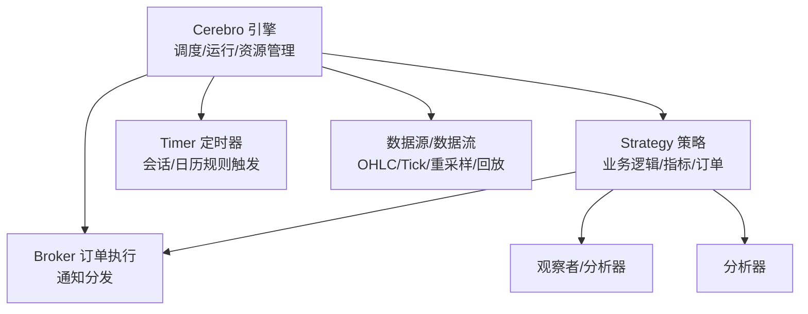
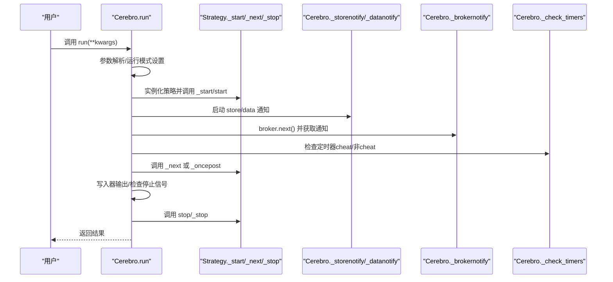
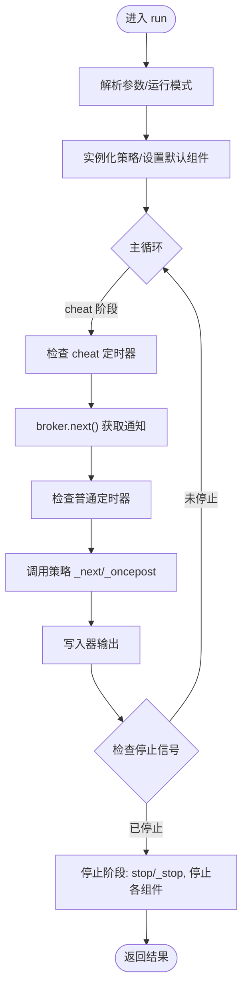
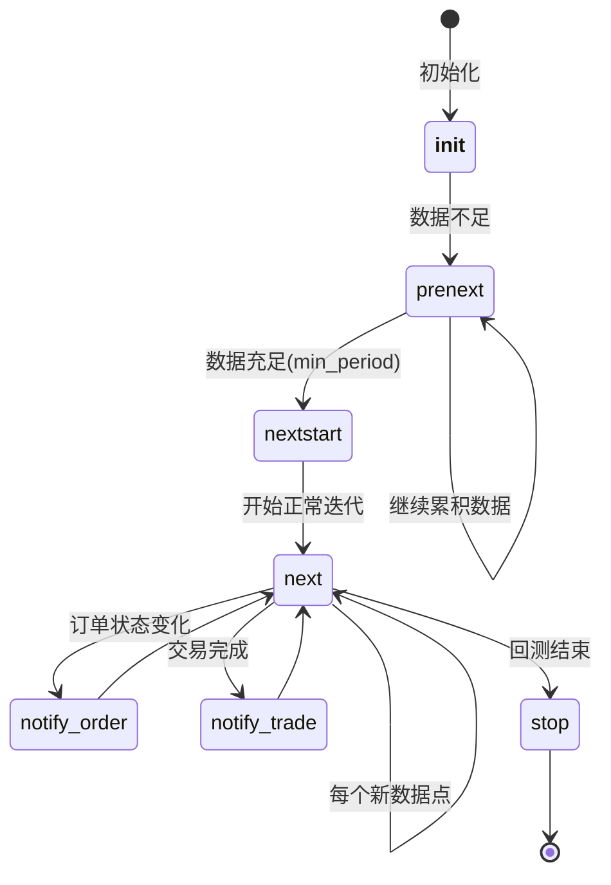
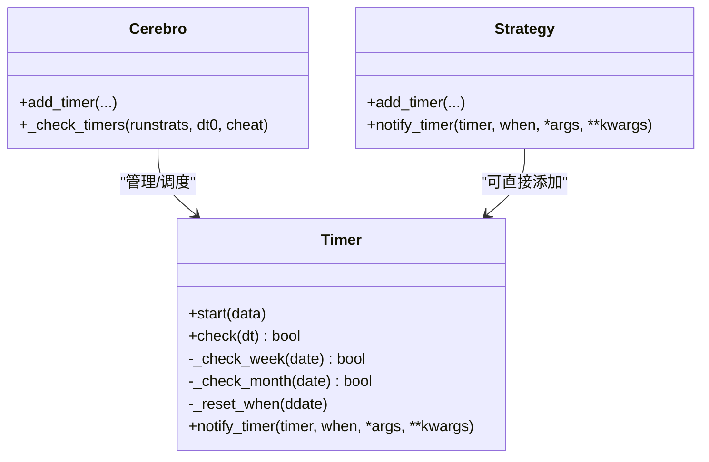
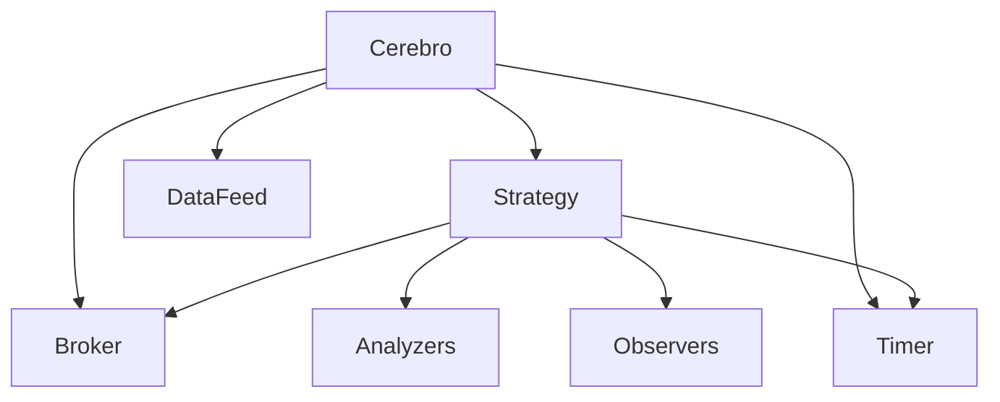

# 执行流程控制

<cite>
**本文引用的文件**
- [backtrader/cerebro.py](file://backtrader/cerebro.py)
- [backtrader/strategy.py](file://backtrader/strategy.py)
- [backtrader/timer.py](file://backtrader/timer.py)
- [backtrader/errors.py](file://backtrader/errors.py)
- [samples/multi-example/mult-values.py](file://samples/multi-example/mult-values.py)
- [samples/multidata-strategy/multidata-strategy.py](file://samples/multidata-strategy/multidata-strategy.py)
- [.claude/architecture.md](file://.claude/architecture.md)
</cite>

## 目录
1. [简介](#简介)
2. [项目结构](#项目结构)
3. [核心组件](#核心组件)
4. [架构总览](#架构总览)
5. [详细组件分析](#详细组件分析)
6. [依赖关系分析](#依赖关系分析)
7. [性能考量](#性能考量)
8. [故障排查指南](#故障排查指南)
9. [结论](#结论)
10. [附录](#附录)

## 简介
本文件围绕 Backtrader 的执行流程控制进行深入解析，覆盖从初始化到结束的完整生命周期管理，详解策略执行的时序控制、事件驱动机制与回调系统，说明引擎如何处理多策略并发执行、数据流调度与资源分配，提供控制回测执行（启动、暂停、停止、重启）的方法示例，以及监控与调试手段、错误处理与异常恢复机制。

## 项目结构
Backtrader 的执行流程主要由三个层次构成：
- 引擎层：Cerebro 负责全局调度、策略实例化、数据预加载、运行模式选择、写入器与定时器管理、多进程优化等。
- 策略层：Strategy 及其子类负责业务逻辑、指标计算、订单生成、通知接收与响应。
- 事件与时间层：Timer 提供基于会话时间、日期规则的定时触发机制；Broker 负责订单执行与通知分发。

图表来源
- [backtrader/cerebro.py](file://backtrader/cerebro.py#L1030-L1338)
- [backtrader/strategy.py](file://backtrader/strategy.py#L107-L150)
- [backtrader/timer.py](file://backtrader/timer.py#L42-L90)

章节来源
- [backtrader/cerebro.py](file://backtrader/cerebro.py#L1030-L1338)
- [backtrader/strategy.py](file://backtrader/strategy.py#L107-L150)
- [backtrader/timer.py](file://backtrader/timer.py#L42-L90)

## 核心组件
- Cerebro：回测引擎核心，负责参数配置、策略注册、数据接入、运行模式（runonce/runnext）、预加载、写入器、定时器、多进程优化、停止信号等。
- Strategy：策略基类，定义生命周期钩子（start/next/prenext/nextstart/stop）、通知回调（notify_order/notify_trade/notify_cashvalue/notify_fund）、订单接口（buy/sell/close/bracket）、定时器接口（add_timer）等。
- Timer：定时器系统，支持会话开始/结束、周/月日过滤、偏移与重复、时区转换、cheat 模式等。
- 错误与异常：统一异常基类与策略跳过异常，保障运行稳定性。

章节来源
- [backtrader/cerebro.py](file://backtrader/cerebro.py#L60-L294)
- [backtrader/strategy.py](file://backtrader/strategy.py#L107-L756)
- [backtrader/timer.py](file://backtrader/timer.py#L42-L226)
- [backtrader/errors.py](file://backtrader/errors.py#L28-L36)

## 架构总览
下图展示了回测执行的主循环与关键交互：

图表来源
- [backtrader/cerebro.py](file://backtrader/cerebro.py#L1030-L1338)
- [backtrader/cerebro.py](file://backtrader/cerebro.py#L1377-L1442)
- [backtrader/cerebro.py](file://backtrader/cerebro.py#L1498-L1647)
- [backtrader/strategy.py](file://backtrader/strategy.py#L393-L493)

## 详细组件分析

### Cerebro 执行生命周期与控制
- 初始化阶段：参数解析、缓存清理、运行模式确定（runonce/preload/exactbars/live/replay）、写入器准备、信号策略注入。
- 策略实例化：按策略清单构建策略实例，设置默认观察者/指标/分析器/资金历史/订单历史。
- 运行阶段：根据 runonce/runnext 选择向量化或逐条推进；在每个时间步中依次执行 store/data 通知、broker 通知、定时器检查、策略 next/oncepost、写入器输出。
- 停止阶段：调用策略 stop/_stop，停止 broker、数据源、存储，关闭写入器。

图表来源
- [backtrader/cerebro.py](file://backtrader/cerebro.py#L1030-L1338)
- [backtrader/cerebro.py](file://backtrader/cerebro.py#L1667-L1716)

章节来源
- [backtrader/cerebro.py](file://backtrader/cerebro.py#L1030-L1338)
- [backtrader/cerebro.py](file://backtrader/cerebro.py#L1667-L1716)

### 策略生命周期与回调系统
- 生命周期：start → prenext（min_period 未满足）→ nextstart（min_period 刚满足）→ next（min_period 已满足）→ stop。
- 回调系统：notify_order/notify_trade/notify_cashvalue/notify_fund/notify_store/notify_data；策略内部通过 _addnotification/_notify 分发。
- 订单接口：buy/sell/close/bracket/order_target_* 系列，支持 OCO、Bracket、Trail 等高级订单类型。

图表来源
- [.claude/architecture.md](file://.claude/architecture.md#L448-L487)

章节来源
- [backtrader/strategy.py](file://backtrader/strategy.py#L274-L320)
- [backtrader/strategy.py](file://backtrader/strategy.py#L503-L614)
- [backtrader/strategy.py](file://backtrader/strategy.py#L738-L748)

### 定时器系统与事件驱动
- Timer 支持：会话开始/结束、周/月日过滤、偏移与重复、允许函数、时区数据、cheat 模式。
- 触发时机：在 cheat 阶段与非 cheat 阶段分别检查，分别调用 owner.notify_timer 与策略 notify_timer。
- 使用场景：开盘前下单（cheat_on_open）、每日定时任务、跨日/跨月事件等。

图表来源
- [backtrader/timer.py](file://backtrader/timer.py#L42-L226)
- [backtrader/cerebro.py](file://backtrader/cerebro.py#L410-L543)
- [backtrader/strategy.py](file://backtrader/strategy.py#L615-L724)

章节来源
- [backtrader/timer.py](file://backtrader/timer.py#L42-L226)
- [backtrader/cerebro.py](file://backtrader/cerebro.py#L410-L543)
- [backtrader/strategy.py](file://backtrader/strategy.py#L615-L724)

### 多策略并发与数据流调度
- 多策略并发：通过 multiprocessing.Pool 在多核环境下并行执行不同参数组合的策略实例。
- 数据流调度：按时间窗对齐，支持 resample/replay、多时间框架、多数据源同步；在主循环中按最小时间推进，确保所有数据在同一时间点前进。
- 资源分配：预加载（preload）与向量化（runonce）可同时启用以提升性能；exactbars 模式下禁用 runonce 以节省内存。

章节来源
- [backtrader/cerebro.py](file://backtrader/cerebro.py#L1127-L1163)
- [backtrader/cerebro.py](file://backtrader/cerebro.py#L1498-L1647)
- [backtrader/cerebro.py](file://backtrader/cerebro.py#L1062-L1080)

### 执行控制：启动、暂停、停止、重启
- 启动：调用 cerebro.run(**kwargs)，传入运行参数（如 runonce、preload、exactbars、live、writer 等）。
- 暂停：Backtrader 未提供显式“暂停”API；可通过外部线程调用 cerebro.runstop() 请求停止，引擎在下一检查点退出。
- 停止：cerebro.runstop() 设置停止标志，主循环检测到后安全退出。
- 重启：在当前 run 结束后再次调用 cerebro.run() 即可重启。

示例参考（路径引用而非代码内容）：
- 多数据多策略示例：[samples/multi-example/mult-values.py](file://samples/multi-example/mult-values.py#L130-L173)
- 多数据策略示例：[samples/multidata-strategy/multidata-strategy.py](file://samples/multidata-strategy/multidata-strategy.py#L117-L163)

章节来源
- [backtrader/cerebro.py](file://backtrader/cerebro.py#L1025-L1048)
- [backtrader/cerebro.py](file://backtrader/cerebro.py#L1377-L1442)
- [samples/multi-example/mult-values.py](file://samples/multi-example/mult-values.py#L130-L173)
- [samples/multidata-strategy/multidata-strategy.py](file://samples/multidata-strategy/multidata-strategy.py#L117-L163)

### 监控与调试：状态跟踪与性能诊断
- 写入器：支持 CSV 输出策略指标与观察者值，便于离线分析。
- 日志与打印：策略内可自定义日志输出（如示例中的打印位置、订单状态）。
- 性能指标：通过内置分析器（Returns、Sharpe、DrawDown 等）评估策略表现。
- 调试技巧：利用 cerebro 的 writer 输出、策略 notify_* 回调、定时器触发点定位、Broker 历史订单注入（set_fund_history/add_order_history）辅助验证。

章节来源
- [backtrader/cerebro.py](file://backtrader/cerebro.py#L1081-L1094)
- [backtrader/strategy.py](file://backtrader/strategy.py#L419-L450)
- [samples/multi-example/mult-values.py](file://samples/multi-example/mult-values.py#L54-L73)

### 错误处理与异常恢复
- 统一异常：BacktraderError 作为基类，StrategySkipError 允许在策略初始化阶段跳过该策略。
- 存储/数据通知：Store/Data 层面的连接中断、错误码等通过通知机制上报，策略可监听 notify_store/notify_data。
- Broker 订单异常：通过订单状态与通知进行反馈，策略可在 notify_order 中处理失败/取消/过期等情况。

章节来源
- [backtrader/errors.py](file://backtrader/errors.py#L28-L36)
- [backtrader/strategy.py](file://backtrader/strategy.py#L750-L756)
- [backtrader/strategy.py](file://backtrader/strategy.py#L503-L614)

## 依赖关系分析

图表来源
- [backtrader/cerebro.py](file://backtrader/cerebro.py#L1171-L1338)
- [backtrader/strategy.py](file://backtrader/strategy.py#L107-L150)
- [backtrader/timer.py](file://backtrader/timer.py#L42-L90)

章节来源
- [backtrader/cerebro.py](file://backtrader/cerebro.py#L1171-L1338)
- [backtrader/strategy.py](file://backtrader/strategy.py#L107-L150)
- [backtrader/timer.py](file://backtrader/timer.py#L42-L90)

## 性能考量
- 向量化 vs 逐条推进：runonce=True 时优先向量化计算，提高整体速度；runnext=True 时逐条推进，更贴近事件驱动。
- 预加载：preload=True 可显著减少 IO 等待，但占用更多内存；replay 模式不支持预加载。
- 内存节省：exactbars 模式可限制缓冲区大小，但会禁用 runonce 与绘图功能。
- 多进程优化：optdatas 与 optreturn 可减少数据拷贝与对象创建，提升优化效率。
- 定时器与通知：避免在定时器回调中执行重型计算，尽量轻量处理。

章节来源
- [backtrader/cerebro.py](file://backtrader/cerebro.py#L1062-L1080)
- [backtrader/cerebro.py](file://backtrader/cerebro.py#L1138-L1158)
- [backtrader/cerebro.py](file://backtrader/cerebro.py#L1294-L1303)

## 故障排查指南
- 回测中途退出：检查是否调用了 cerebro.runstop()；确认主循环中对停止信号的检查点。
- 订单未成交：检查订单状态回调（notify_order），确认价格/成交量/有效期设置；核对佣金与滑点设置。
- 数据不同步：确认多数据源的时间窗对齐与 resample/replay 配置；检查定时填充与 tick 填充逻辑。
- 定时器未触发：核对 when/offset/weekdays/monthdays/allow/tzdata 设置；确认 cheat 模式与触发时机。
- 性能瓶颈：开启 runonce、启用 preload、减少绘图与写入器频率；在优化时使用 optdatas/optreturn。

章节来源
- [backtrader/cerebro.py](file://backtrader/cerebro.py#L1667-L1716)
- [backtrader/strategy.py](file://backtrader/strategy.py#L738-L748)
- [backtrader/timer.py](file://backtrader/timer.py#L150-L226)

## 结论
Backtrader 的执行流程控制以 Cerebro 为核心，通过策略生命周期与事件驱动机制、定时器系统、Broker 通知分发与多策略并发执行，实现了高可配置、可扩展的回测执行环境。合理配置运行模式、数据流与资源策略，结合写入器与回调系统，可有效实现启动/停止/重启控制、状态监控与性能诊断，并通过统一异常体系保障稳定性与可靠性。

## 附录
- 示例参考（路径引用）：
  - 多数据多策略示例：[samples/multi-example/mult-values.py](file://samples/multi-example/mult-values.py#L130-L173)
  - 多数据策略示例：[samples/multidata-strategy/multidata-strategy.py](file://samples/multidata-strategy/multidata-strategy.py#L117-L163)