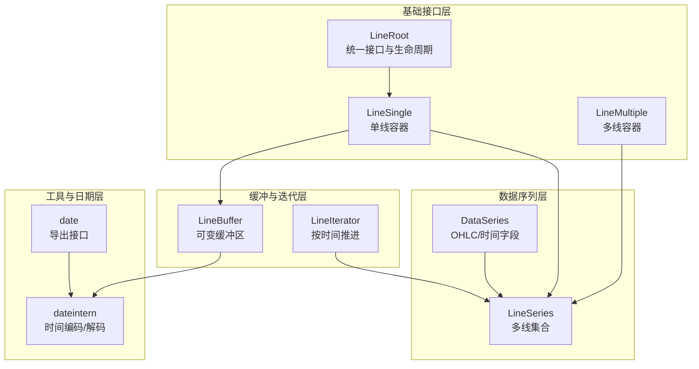
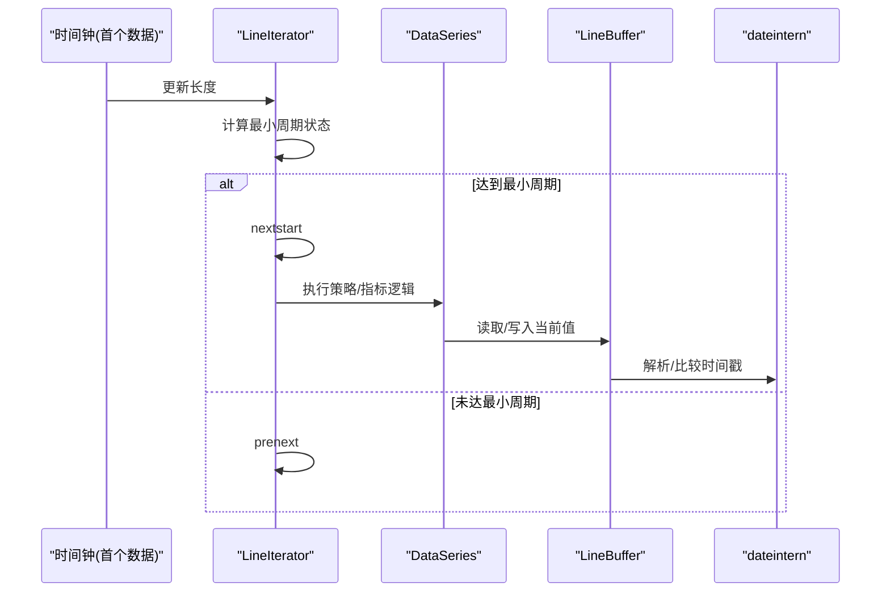
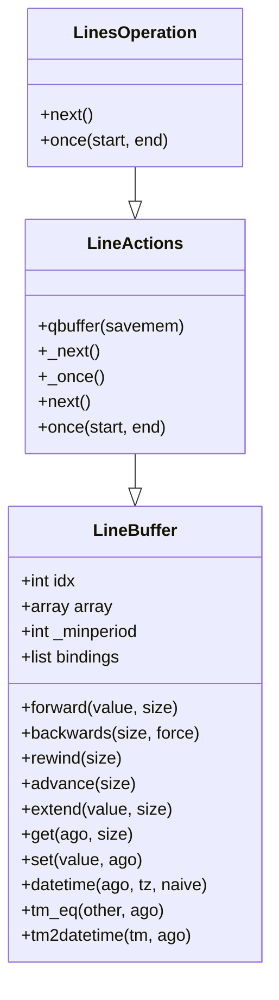
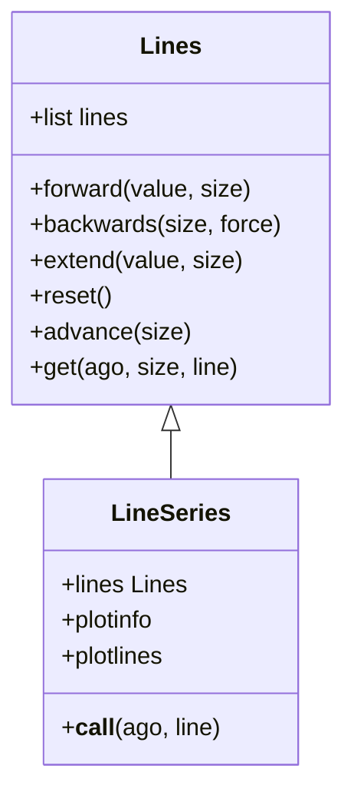
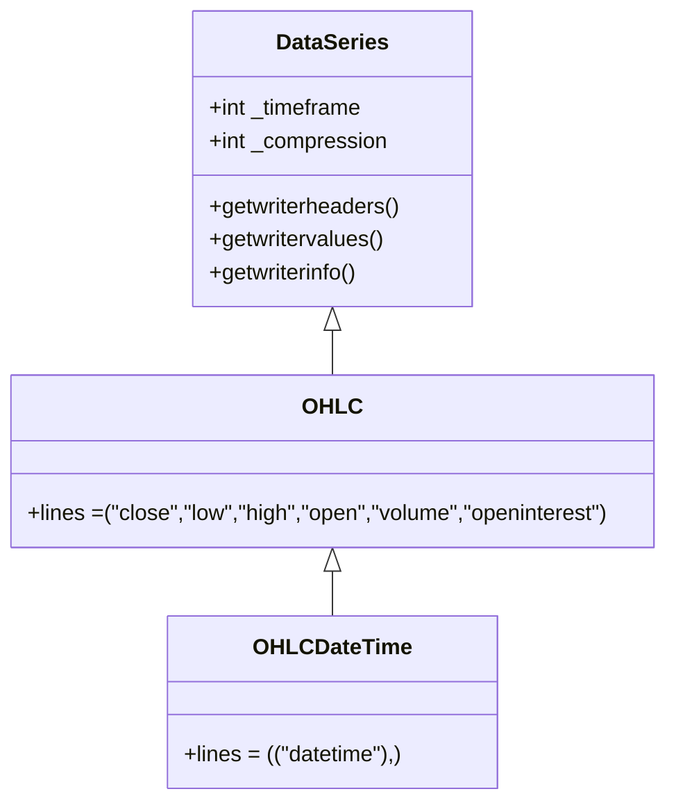
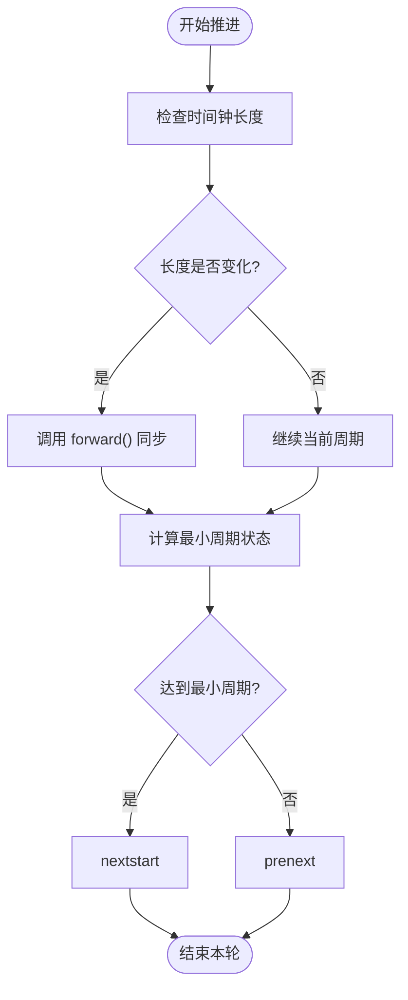
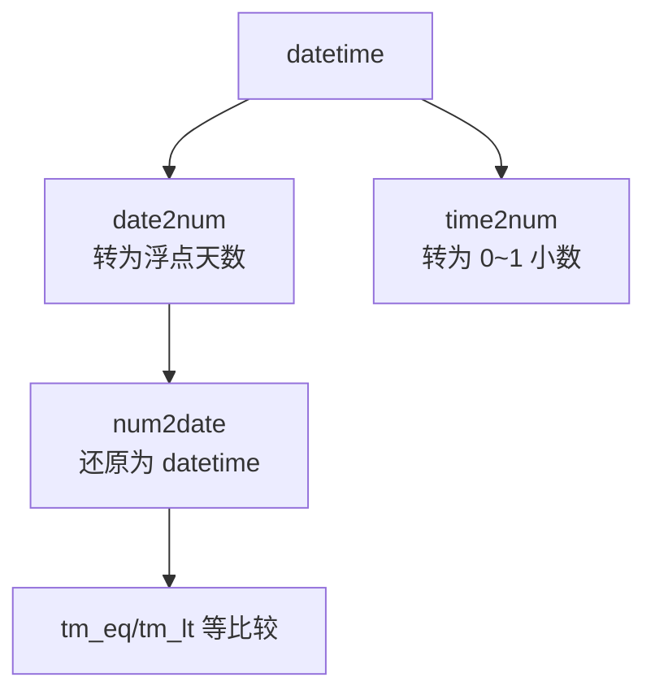
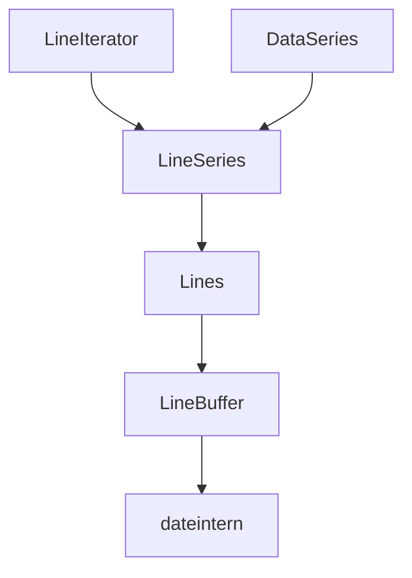

# 时间序列处理机制

<cite>
**本文档引用的文件**
- [linebuffer.py](file://backtrader/linebuffer.py)
- [lineseries.py](file://backtrader/lineseries.py)
- [dataseries.py](file://backtrader/dataseries.py)
- [lineroot.py](file://backtrader/lineroot.py)
- [lineiterator.py](file://backtrader/lineiterator.py)
- [dateintern.py](file://backtrader/utils/dateintern.py)
- [date.py](file://backtrader/utils/date.py)
- [data-multitimeframe.py](file://samples/data-multitimeframe/data-multitimeframe.py)
- [multidata-strategy.py](file://samples/multidata-strategy/multidata-strategy.py)
- [memory-savings.py](file://samples/memory-savings/memory-savings.py)
</cite>

## 目录
1. [简介](#简介)
2. [项目结构](#项目结构)
3. [核心组件](#核心组件)
4. [架构总览](#架构总览)
5. [详细组件分析](#详细组件分析)
6. [依赖关系分析](#依赖关系分析)
7. [性能考虑](#性能考虑)
8. [故障排除指南](#故障排除指南)
9. [结论](#结论)

## 简介
本文件系统性梳理 Backtrader 的时间序列处理机制，重点围绕 LineBuffer 和 LineSeries 的设计与实现，解释数据序列的存储结构、访问模式、索引机制与内存管理策略；阐述多数据流的时间对齐机制（不同时间框架数据的同步处理与数据填充策略）；提供具体示例路径展示如何访问和操作时间序列数据；最后总结性能优化与内存节省策略，帮助在大数据量场景下保持高效处理速度。

## 项目结构
Backtrader 的时间序列处理由多个层次组成：
- 基础接口层：LineRoot 定义统一的接口与生命周期（阶段切换、最小周期、运算符重载等）
- 单线与多线容器层：LineSingle/LineMultiple 提供单条线与多条线的容器能力
- 数据序列层：DataSeries 继承自 LineSeries，定义 OHLC 等标准字段与写入接口
- 缓冲与迭代层：LineBuffer 实现可变长度缓冲区与索引游标；LineIterator 负责按时间推进的计算调度
- 工具与日期层：dateintern/date 提供时间编码/解码与时区处理

图表来源
- [lineroot.py](file://backtrader/lineroot.py#L61-L360)
- [lineseries.py](file://backtrader/lineseries.py#L444-L645)
- [dataseries.py](file://backtrader/dataseries.py#L60-L212)
- [linebuffer.py](file://backtrader/linebuffer.py#L50-L830)
- [lineiterator.py](file://backtrader/lineiterator.py#L148-L489)
- [dateintern.py](file://backtrader/utils/dateintern.py#L149-L241)
- [date.py](file://backtrader/utils/date.py#L25-L30)

章节来源
- [lineroot.py](file://backtrader/lineroot.py#L61-L360)
- [lineseries.py](file://backtrader/lineseries.py#L444-L645)
- [dataseries.py](file://backtrader/dataseries.py#L60-L212)
- [linebuffer.py](file://backtrader/linebuffer.py#L50-L830)
- [lineiterator.py](file://backtrader/lineiterator.py#L148-L489)
- [dateintern.py](file://backtrader/utils/dateintern.py#L149-L241)
- [date.py](file://backtrader/utils/date.py#L25-L30)

## 核心组件
- LineBuffer：提供可变长度数组缓冲区，支持逻辑索引（0 指向当前值）、正向/反向移动、前瞻扩展、绑定传播等；内置时间戳解析与时间比较辅助方法
- LineSeries：多线集合容器，封装 Lines 对象，提供统一的前进/回退/扩展/重置等操作，并暴露便捷的属性访问
- DataSeries：继承 LineSeries，定义标准 OHLC 字段顺序与写入接口，便于 CSV 输出与绘图
- LineIterator：基于时间钟（第一个数据源）推进，协调指标/观察器/策略的最小周期与计算阶段
- LineRoot/LineSingle/LineMultiple：定义统一接口、最小周期更新与多线容器行为

章节来源
- [linebuffer.py](file://backtrader/linebuffer.py#L50-L830)
- [lineseries.py](file://backtrader/lineseries.py#L444-L645)
- [dataseries.py](file://backtrader/dataseries.py#L60-L212)
- [lineiterator.py](file://backtrader/lineiterator.py#L148-L489)
- [lineroot.py](file://backtrader/lineroot.py#L61-L360)

## 架构总览
Backtrader 的时间序列处理以“时间钟”驱动，LineIterator 作为调度中枢，依据各数据源的最小周期决定何时进入 nextstart/next 或 prenext 阶段。LineBuffer 提供灵活的缓冲与索引，支持延迟/前向/运算等操作；DataSeries 将 OHLC 等字段标准化，便于外部消费。

图表来源
- [lineiterator.py](file://backtrader/lineiterator.py#L259-L355)
- [linebuffer.py](file://backtrader/linebuffer.py#L386-L497)
- [dateintern.py](file://backtrader/utils/dateintern.py#L149-L241)

## 详细组件分析

### LineBuffer 设计与实现
- 存储结构
  - 使用 array.array 或 collections.deque 作为底层存储，支持快速数值计算与固定窗口队列
  - 通过逻辑索引 idx 控制“当前值”的位置，0 永远指向当前值，正索引访问过去，负索引访问未来
- 索引与访问模式
  - __getitem__/__setitem__ 基于 idx + ago 访问，支持切片 get(size, ago) 与绝对区间 getzero/getzeroval
  - forward/rewind/advance/extend 提供推进、回退、前瞻扩展等操作
- 内存管理
  - qbuffer 模式启用固定窗口队列，结合 maxlen 与 lenmark 控制实际可用长度
  - buflen 返回真实数据长度，考虑 extension（前瞻扩展）
- 绑定与传播
  - addbinding 支持将自身变化同步到其他 LineBuffer，用于指标/观察器与主数据之间的联动
- 时间戳与时间比较
  - datetime/date/time/tm/dt 等方法提供时间戳解析与时间部分提取，tm_eq/tm_lt 等比较避免精度误差

图表来源
- [linebuffer.py](file://backtrader/linebuffer.py#L50-L830)

章节来源
- [linebuffer.py](file://backtrader/linebuffer.py#L50-L830)

### LineSeries 与多线容器
- 多线集合
  - Lines 类维护一组 LineBuffer，提供统一的 forward/rewind/extend/reset/advance 等代理操作
  - 支持动态派生新 Lines 子类，添加额外行并生成别名访问器
- LineSeries
  - 作为多线容器的基类，提供 plotinfo/plotlines 等可视化配置，以及便捷的 __call__ 返回延迟/耦合对象
  - 通过 LineSeriesStub 支持“从单线派生”的场景，避免重复推进

图表来源
- [lineseries.py](file://backtrader/lineseries.py#L84-L304)
- [lineseries.py](file://backtrader/lineseries.py#L444-L645)

章节来源
- [lineseries.py](file://backtrader/lineseries.py#L84-L304)
- [lineseries.py](file://backtrader/lineseries.py#L444-L645)

### DataSeries 与 OHLC 字段组织
- 标准字段顺序
  - DateTime, Open, High, Low, Close, Volume, OpenInterest 的固定顺序，确保输出一致性
- 写入接口
  - getwriterheaders/getwritervalues/getwriterinfo 提供 CSV 导出所需信息
- 过滤与聚合
  - SimpleFilterWrapper 可包装过滤器，在返回 True 时执行 backwards 回退，实现“删除当前条形”的效果

图表来源
- [dataseries.py](file://backtrader/dataseries.py#L60-L212)

章节来源
- [dataseries.py](file://backtrader/dataseries.py#L60-L212)

### 时间对齐与多时间框架同步
- 时间钟推进
  - LineIterator 以第一个数据源为时间钟，当其长度变化时触发 self.forward() 同步其他数据/指标
- 不同时间框架的对齐
  - 通过 Resampler/Replayer 或 DataClone + Filter 的方式将高/低时间框架数据对齐
  - SingleCoupler/MultiCoupler 在运行时将不同长度的数据对齐到相同时间点
- 数据填充策略
  - 当某数据无法产生新条形时，通过 rewind/forward 空条形或前瞻扩展，保证所有数据在同一时间点推进

图表来源
- [lineiterator.py](file://backtrader/lineiterator.py#L259-L355)
- [data-multitimeframe.py](file://samples/data-multitimeframe/data-multitimeframe.py#L120-L161)

章节来源
- [lineiterator.py](file://backtrader/lineiterator.py#L259-L355)
- [data-multitimeframe.py](file://samples/data-multitimeframe/data-multitimeframe.py#L120-L161)

### 时间戳编码与解析
- 时间戳编码
  - date2num 将 datetime 转换为自 0001-01-01 起的天数（含小时/分钟/秒/微秒），支持时区转换
- 时间戳解码
  - num2date 将浮点天数还原为 datetime，支持本地化与时区转换
- 时间部分处理
  - time2num 将 time 对象映射为 0~1 的小数，便于精确比较与边界判断

图表来源
- [dateintern.py](file://backtrader/utils/dateintern.py#L202-L241)
- [dateintern.py](file://backtrader/utils/dateintern.py#L149-L196)
- [linebuffer.py](file://backtrader/linebuffer.py#L422-L497)

章节来源
- [dateintern.py](file://backtrader/utils/dateintern.py#L202-L241)
- [dateintern.py](file://backtrader/utils/dateintern.py#L149-L196)
- [linebuffer.py](file://backtrader/linebuffer.py#L422-L497)

### 典型使用示例（代码路径）
- 多时间框架数据对齐与策略打印
  - 示例路径：[data-multitimeframe.py](file://samples/data-multitimeframe/data-multitimeframe.py#L58-L91)
- 多数据流策略（信号生成与下单）
  - 示例路径：[multidata-strategy.py](file://samples/multidata-strategy/multidata-strategy.py#L84-L109)
- 内存使用统计与保存
  - 示例路径：[memory-savings.py](file://samples/memory-savings/memory-savings.py#L72-L121)

章节来源
- [data-multitimeframe.py](file://samples/data-multitimeframe/data-multitimeframe.py#L58-L91)
- [multidata-strategy.py](file://samples/multidata-strategy/multidata-strategy.py#L84-L109)
- [memory-savings.py](file://samples/memory-savings/memory-savings.py#L72-L121)

## 依赖关系分析
- 组件耦合
  - LineIterator 依赖 LineSeries/Lines/LineBuffer，负责最小周期与推进流程
  - DataSeries 依赖 LineSeries 与标准字段顺序，提供写入接口
  - LineBuffer 依赖 dateintern 进行时间戳解析与比较
- 外部依赖
  - collections.deque 用于固定窗口队列（QBuffer 模式）
  - array.array 用于高性能数值存储
  - datetime/time 用于时间编码/解码与时区处理

图表来源
- [lineiterator.py](file://backtrader/lineiterator.py#L148-L489)
- [lineseries.py](file://backtrader/lineseries.py#L444-L645)
- [dataseries.py](file://backtrader/dataseries.py#L60-L212)
- [linebuffer.py](file://backtrader/linebuffer.py#L50-L830)
- [dateintern.py](file://backtrader/utils/dateintern.py#L149-L241)

章节来源
- [lineiterator.py](file://backtrader/lineiterator.py#L148-L489)
- [lineseries.py](file://backtrader/lineseries.py#L444-L645)
- [dataseries.py](file://backtrader/dataseries.py#L60-L212)
- [linebuffer.py](file://backtrader/linebuffer.py#L50-L830)
- [dateintern.py](file://backtrader/utils/dateintern.py#L149-L241)

## 性能考虑
- 缓冲模式选择
  - QBuffer 模式使用 deque 固定窗口，减少内存占用，适合长时间序列；需配合 minbuffer 保证指标最小周期
  - UnBounded 模式使用动态 array，适合需要回溯历史的场景
- 批量操作
  - once/oncestart/once 系列在一次性遍历时避免条件分支，直接执行循环赋值，提升批量计算效率
- 时间戳处理
  - time2num 与 num2date 的组合使用可避免浮点精度误差导致的时间比较问题
- 内存节省
  - 通过 cerebro.run(runonce=False) 与 qbuffer/save 选项控制内存占用
  - 示例参考：[memory-savings.py](file://samples/memory-savings/memory-savings.py#L123-L135)

章节来源
- [linebuffer.py](file://backtrader/linebuffer.py#L121-L148)
- [linebuffer.py](file://backtrader/linebuffer.py#L625-L634)
- [linebuffer.py](file://backtrader/linebuffer.py#L422-L497)
- [memory-savings.py](file://samples/memory-savings/memory-savings.py#L123-L135)

## 故障排除指南
- 多数据流长度不一致
  - 使用 SingleCoupler/MultiCoupler 对齐不同长度数据；确认 runonce=False 以启用对齐逻辑
  - 参考：[lineiterator.py](file://backtrader/lineiterator.py#L408-L489)
- 时间戳比较异常
  - 使用 tm_eq/tm_lt 等方法进行时间部分比较，避免整数/小数混合比较带来的精度问题
  - 参考：[linebuffer.py](file://backtrader/linebuffer.py#L422-L497)
- 内存占用过高
  - 启用 qbuffer/save 选项，限制缓冲大小；评估指标最小周期设置
  - 参考：[memory-savings.py](file://samples/memory-savings/memory-savings.py#L123-L135)
- 数据过滤后出现空条形
  - SimpleFilterWrapper 返回 True 时会执行 backwards，确保后续推进不会跳过时间点
  - 参考：[dataseries.py](file://backtrader/dataseries.py#L115-L144)

章节来源
- [lineiterator.py](file://backtrader/lineiterator.py#L408-L489)
- [linebuffer.py](file://backtrader/linebuffer.py#L422-L497)
- [memory-savings.py](file://samples/memory-savings/memory-savings.py#L123-L135)
- [dataseries.py](file://backtrader/dataseries.py#L115-L144)

## 结论
Backtrader 的时间序列处理以 LineBuffer 为核心，结合 LineSeries 的多线容器与 LineIterator 的时间钟推进机制，实现了灵活而高效的数据访问与计算。通过 QBuffer 模式、批量 once 操作与时间戳解析工具，系统在大数据量场景下仍能保持良好性能。多时间框架对齐与数据填充策略确保了跨时间尺度分析的稳定性。建议在实际应用中根据数据规模与指标复杂度合理选择缓冲模式与最小周期，以获得最佳的性能与内存平衡。