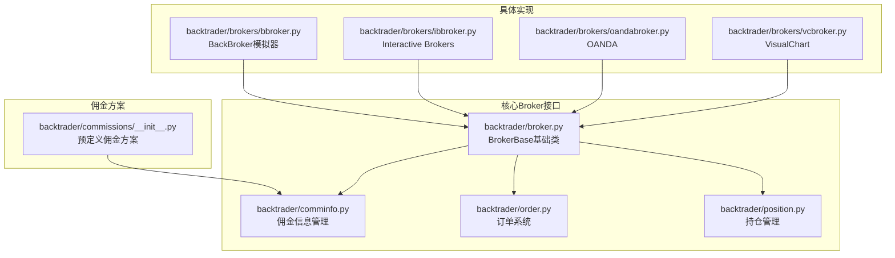
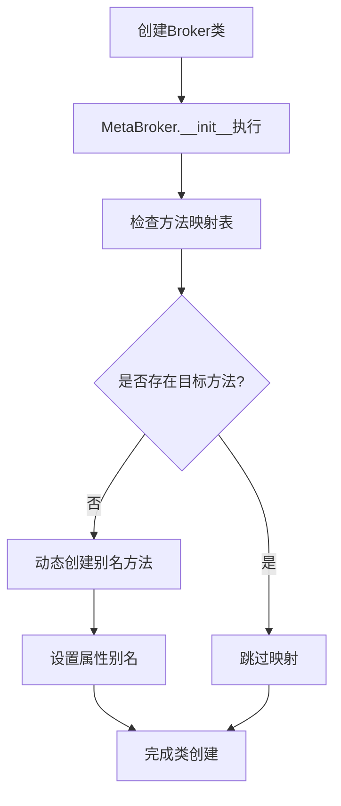
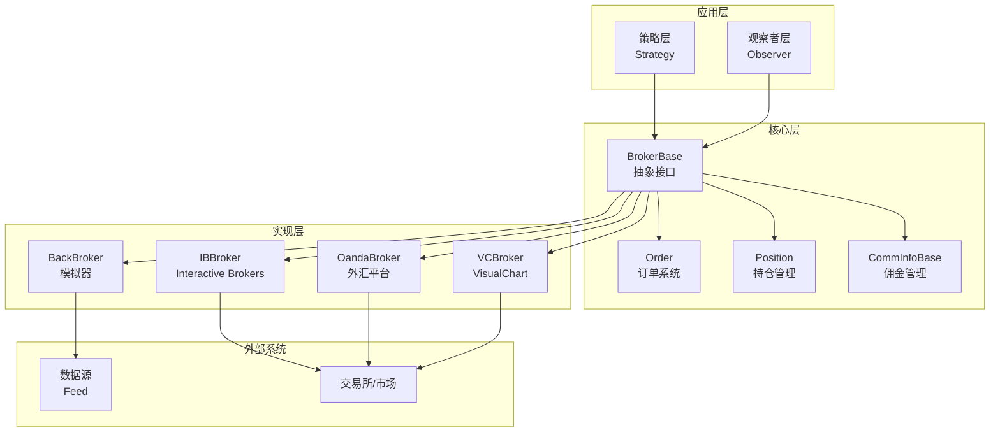
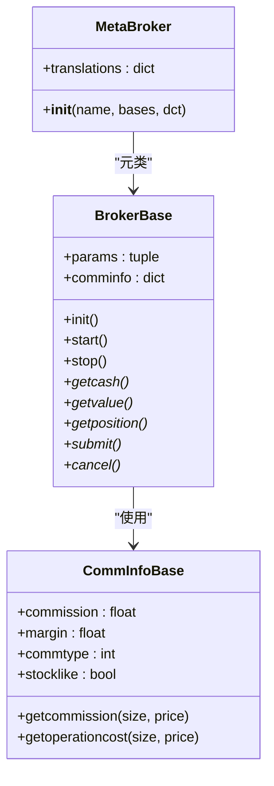
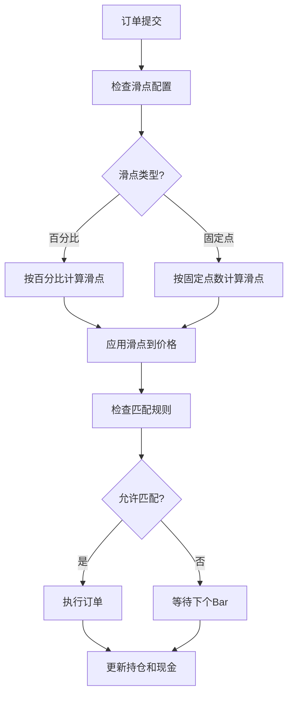
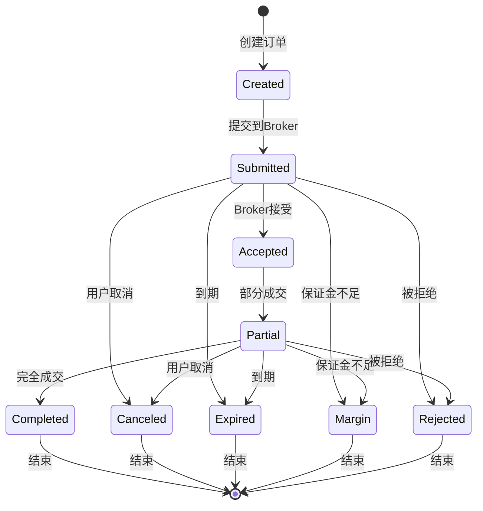
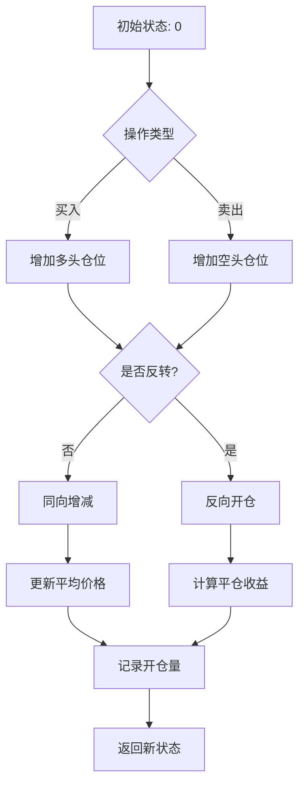
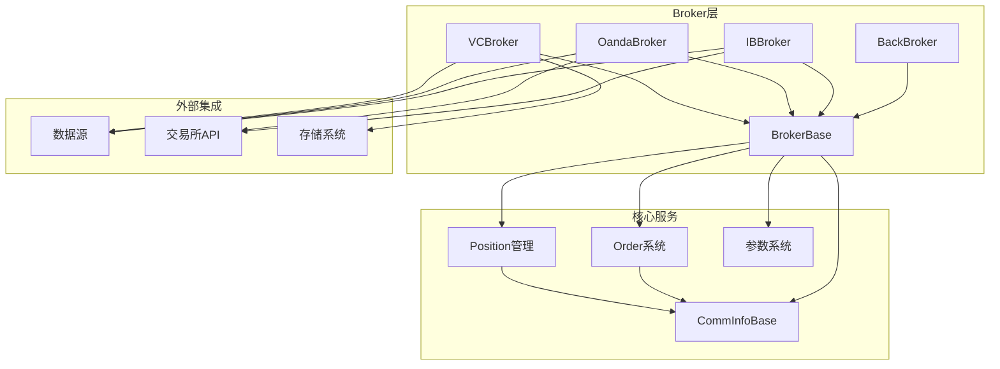

# Broker接口设计

<cite>
**本文档引用的文件**
- [backtrader/broker.py](file://backtrader/broker.py)
- [backtrader/brokers/bbroker.py](file://backtrader/brokers/bbroker.py)
- [backtrader/order.py](file://backtrader/order.py)
- [backtrader/position.py](file://backtrader/position.py)
- [backtrader/comminfo.py](file://backtrader/comminfo.py)
- [backtrader/commissions/__init__.py](file://backtrader/commissions/__init__.py)
- [backtrader/brokers/ibbroker.py](file://backtrader/brokers/ibbroker.py)
- [backtrader/brokers/oandabroker.py](file://backtrader/brokers/oandabroker.py)
- [backtrader/brokers/vcbroker.py](file://backtrader/brokers/vcbroker.py)
- [samples/order-execution/order-execution.py](file://samples/order-execution/order-execution.py)
</cite>

## 目录
1. [简介](#简介)
2. [项目结构](#项目结构)
3. [核心组件](#核心组件)
4. [架构概览](#架构概览)
5. [详细组件分析](#详细组件分析)
6. [依赖关系分析](#依赖关系分析)
7. [性能考虑](#性能考虑)
8. [故障排除指南](#故障排除指南)
9. [结论](#结论)

## 简介

Backtrader的Broker接口设计是一个高度模块化和可扩展的交易接口系统。该系统通过抽象基类BrokerBase为核心，结合元类MetaBroker的动态方法映射机制，为不同的交易执行环境提供了统一的接口标准。本文档深入分析了BrokerBase类的设计理念、元类工作机制、参数管理系统以及接口标准化设计，并详细说明了核心方法的实现要求和调用约定。

## 项目结构

Backtrader的Broker相关代码主要分布在以下目录中：

**图表来源**
- [backtrader/broker.py](file://backtrader/broker.py#L1-L169)
- [backtrader/brokers/bbroker.py](file://backtrader/brokers/bbroker.py#L1-L1238)

**章节来源**
- [backtrader/broker.py](file://backtrader/broker.py#L1-L169)
- [backtrader/brokers/bbroker.py](file://backtrader/brokers/bbroker.py#L1-L1238)

## 核心组件

### BrokerBase基础类

BrokerBase是所有Broker实现的基础抽象类，定义了完整的交易接口规范。其核心设计理念包括：

1. **抽象接口定义**：定义了所有Broker必须实现的标准方法
2. **参数管理系统**：通过MetaParams元类提供强大的参数配置能力
3. **佣金信息管理**：集成CommInfoBase提供灵活的费用计算机制
4. **生命周期管理**：包含完整的初始化、启动、停止流程

### 元类MetaBroker工作机制

MetaBroker元类实现了智能的方法映射功能：

**图表来源**
- [backtrader/broker.py](file://backtrader/broker.py#L32-L47)

**章节来源**
- [backtrader/broker.py](file://backtrader/broker.py#L32-L47)

## 架构概览

Backtrader的Broker架构采用分层设计模式：

**图表来源**
- [backtrader/broker.py](file://backtrader/broker.py#L49-L169)
- [backtrader/brokers/bbroker.py](file://backtrader/brokers/bbroker.py#L36-L1238)

## 详细组件分析

### BrokerBase类深度分析

#### 核心接口方法

BrokerBase定义了以下核心接口方法：

| 方法 | 类型 | 描述 | 实现要求 |
|------|------|------|----------|
| `getcash()` | 抽象方法 | 获取当前现金余额 | 必须返回浮点数 |
| `getvalue()` | 抽象方法 | 获取投资组合总价值 | 可选参数支持部分数据 |
| `getposition()` | 抽象方法 | 获取指定数据的持仓 | 返回Position对象 |
| `submit()` | 抽象方法 | 提交订单到Broker | 返回已提交的订单 |
| `cancel()` | 抽象方法 | 取消未成交订单 | 返回布尔值表示成功与否 |

#### 参数管理系统

BrokerBase通过参数系统提供了强大的配置能力：

**图表来源**
- [backtrader/broker.py](file://backtrader/broker.py#L49-L169)
- [backtrader/comminfo.py](file://backtrader/comminfo.py#L30-L329)

**章节来源**
- [backtrader/broker.py](file://backtrader/broker.py#L49-L169)
- [backtrader/comminfo.py](file://backtrader/comminfo.py#L30-L329)

### BackBroker模拟器实现

BackBroker是最完整的Broker实现，提供了丰富的功能特性：

#### 资金管理模式

BackBroker实现了完整的资金管理模式，包括：

1. **基金模式支持**：支持以基金份额形式跟踪投资组合表现
2. **杠杆计算**：自动计算和跟踪投资组合的杠杆水平
3. **未实现收益**：实时计算未实现的浮动盈亏

#### 订单执行机制

BackBroker提供了多种订单执行类型的支持：

| 执行类型 | 描述 | 特性 |
|----------|------|------|
| Market | 市价单 | 按下一个Bar的开盘价执行 |
| Close | 收盘单 | 在会话结束时按收盘价执行 |
| Limit | 限价单 | 当价格达到指定水平时执行 |
| Stop | 止损单 | 触发后转为市价单执行 |
| StopLimit | 止损限价单 | 触发后按限价执行 |

#### 滑点处理机制

BackBroker内置了灵活的滑点处理系统：

**图表来源**
- [backtrader/brokers/bbroker.py](file://backtrader/brokers/bbroker.py#L687-L800)

**章节来源**
- [backtrader/brokers/bbroker.py](file://backtrader/brokers/bbroker.py#L36-L1238)

### 佣金信息管理系统

CommInfoBase提供了完整的佣金和费用计算机制：

#### 佣金类型支持

| 佣金类型 | 描述 | 使用场景 |
|----------|------|----------|
| COMM_PERC | 百分比佣金 | 股票交易，按交易金额的百分比收取 |
| COMM_FIXED | 固定佣金 | 期货交易，按每手合约收取固定费用 |

#### 产品类型区分

| 产品类型 | 特征 | 佣金计算方式 |
|----------|------|-------------|
| Stock-like | 股票式产品 | 按价格计算交易成本 |
| Futures-like | 期货式产品 | 按保证金计算交易成本 |

**章节来源**
- [backtrader/comminfo.py](file://backtrader/comminfo.py#L30-L329)
- [backtrader/commissions/__init__.py](file://backtrader/commissions/__init__.py#L27-L65)

### 订单系统架构

Order系统提供了完整的订单生命周期管理：

**图表来源**
- [backtrader/order.py](file://backtrader/order.py#L250-L258)

**章节来源**
- [backtrader/order.py](file://backtrader/order.py#L222-L642)

### 持仓管理系统

Position类提供了精确的持仓追踪能力：

#### 持仓状态转换

**图表来源**
- [backtrader/position.py](file://backtrader/position.py#L124-L207)

**章节来源**
- [backtrader/position.py](file://backtrader/position.py#L28-L207)

## 依赖关系分析

### 组件间依赖关系

**图表来源**
- [backtrader/broker.py](file://backtrader/broker.py#L24-L29)
- [backtrader/brokers/bbroker.py](file://backtrader/brokers/bbroker.py#L27-L31)

**章节来源**
- [backtrader/broker.py](file://backtrader/broker.py#L24-L29)
- [backtrader/brokers/bbroker.py](file://backtrader/brokers/bbroker.py#L27-L31)

### 外部依赖集成

不同Broker实现针对特定平台的集成特点：

| Broker实现 | 主要依赖 | 集成特点 |
|------------|----------|----------|
| BackBroker | 内置数据源 | 完全模拟，无外部依赖 |
| IBBroker | ib.ext.Order | 直接连接IB API |
| OandaBroker | oandastore | REST API集成 |
| VCBroker | vcstore | COM接口集成 |

**章节来源**
- [backtrader/brokers/ibbroker.py](file://backtrader/brokers/ibbroker.py#L30-L42)
- [backtrader/brokers/oandabroker.py](file://backtrader/brokers/oandabroker.py#L29-L38)
- [backtrader/brokers/vcbroker.py](file://backtrader/brokers/vcbroker.py#L28-L35)

## 性能考虑

### 内存优化策略

1. **延迟加载**：Broker参数在首次使用时才初始化
2. **对象池**：复用Order和Position对象减少GC压力
3. **增量计算**：只在必要时重新计算投资组合价值

### 并发处理

BackBroker实现了基本的线程安全机制：
- 使用collections.deque保证队列操作的原子性
- 通过锁机制保护共享资源访问
- 异步通知系统避免阻塞主执行流程

### 扩展性设计

Broker接口设计充分考虑了扩展需求：
- 插件化的佣金计算系统
- 可配置的订单执行算法
- 灵活的资金管理模式

## 故障排除指南

### 常见问题诊断

#### 订单无法提交

**可能原因**：
1. 现金不足导致保证金不足
2. 订单参数配置错误
3. Broker状态异常

**解决方案**：
1. 检查getcash()返回值
2. 验证订单参数的有效性
3. 查看Broker日志输出

#### 滑点过大问题

**诊断步骤**：
1. 检查slip_perc和slip_fixed参数设置
2. 验证市场流动性状况
3. 分析订单执行时间

**调整建议**：
- 在高波动市场降低滑点参数
- 考虑使用更严格的执行条件
- 实施订单分割策略

#### 佣金计算不准确

**排查要点**：
1. 确认CommInfoBase配置正确
2. 检查产品类型的分类
3. 验证佣金率的单位格式

**修正方法**：
- 更新佣金方案配置
- 确保percabs参数设置正确
- 验证stocklike标志位

**章节来源**
- [backtrader/brokers/bbroker.py](file://backtrader/brokers/bbroker.py#L326-L347)
- [backtrader/comminfo.py](file://backtrader/comminfo.py#L169-L186)

## 结论

Backtrader的Broker接口设计体现了优秀的软件工程原则：

1. **接口标准化**：通过BrokerBase定义了清晰的抽象接口
2. **元类创新**：MetaBroker实现了智能的方法映射机制
3. **模块化设计**：各组件职责明确，耦合度低
4. **扩展性强**：支持多种Broker实现和自定义扩展
5. **性能优化**：内置多项性能优化策略

该设计为量化交易系统的开发提供了坚实的基础，既满足了简单场景的需求，也为复杂交易策略的实现提供了足够的灵活性。对于开发者而言，理解这些设计原理有助于更好地扩展和定制交易接口，构建符合业务需求的交易系统。