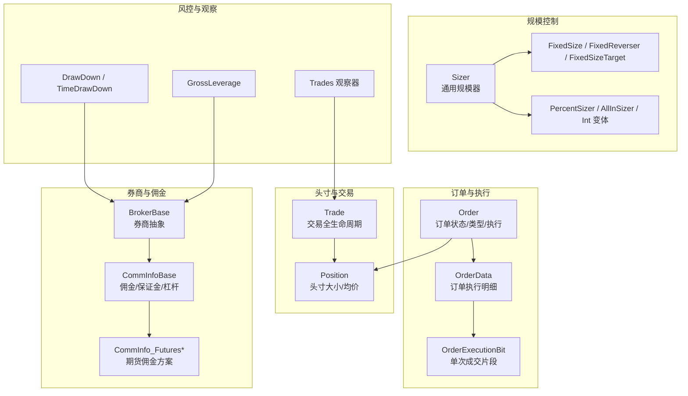
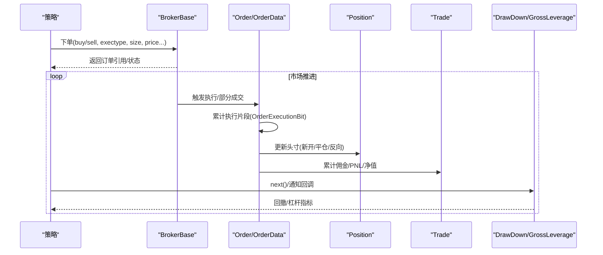
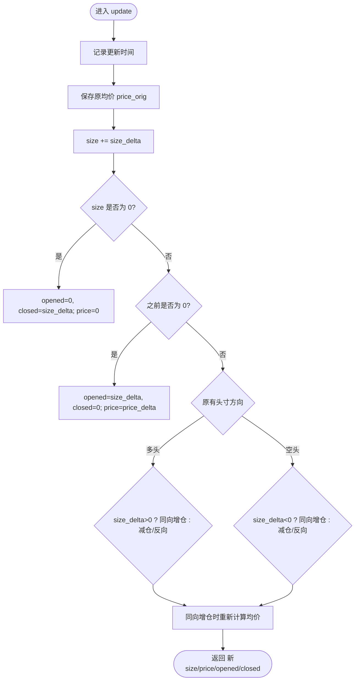
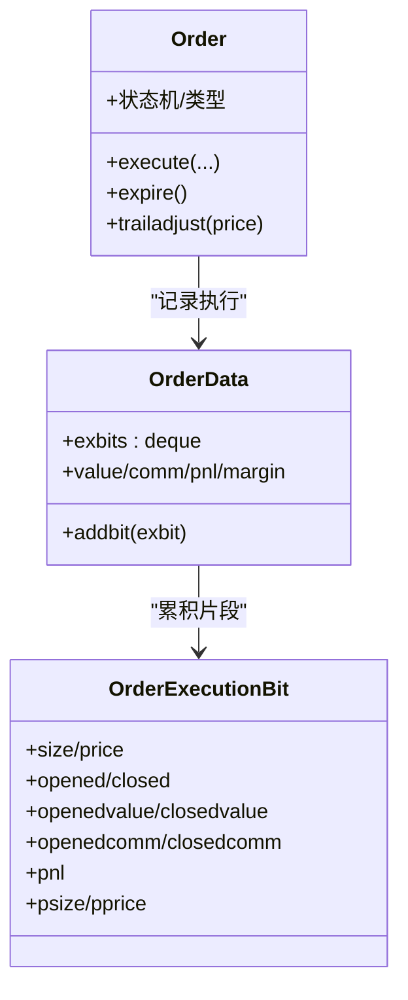
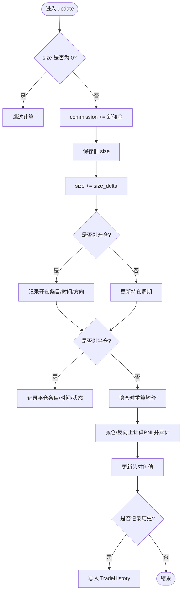
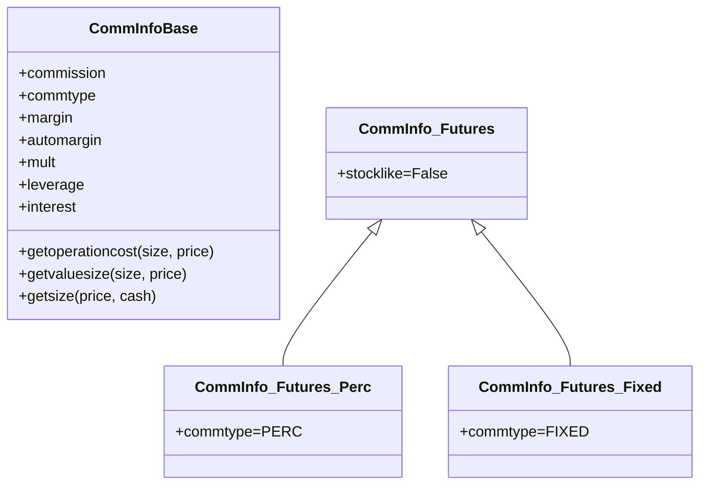
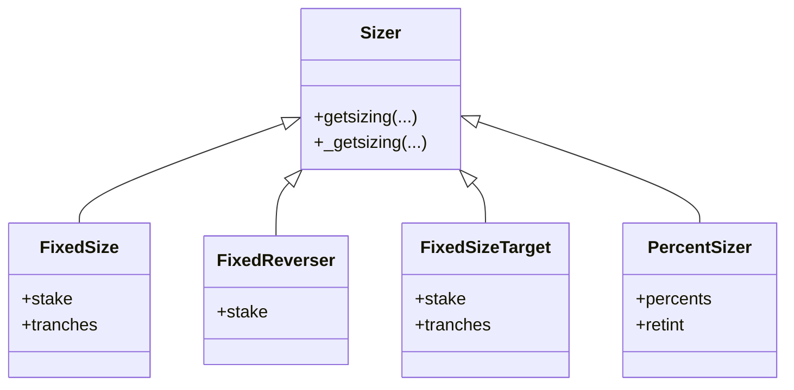
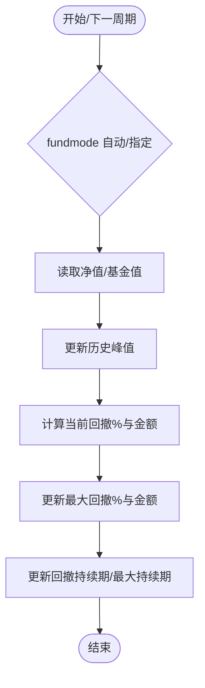
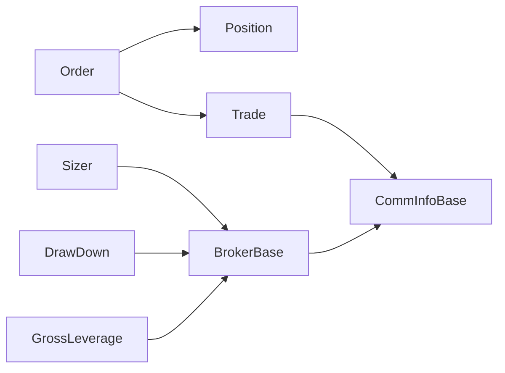

# 仓位与风险管理

<cite>
**本文引用的文件**   
- [backtrader/position.py](file://backtrader/position.py)
- [backtrader/order.py](file://backtrader/order.py)
- [backtrader/trade.py](file://backtrader/trade.py)
- [backtrader/broker.py](file://backtrader/broker.py)
- [backtrader/comminfo.py](file://backtrader/comminfo.py)
- [backtrader/commissions/__init__.py](file://backtrader/commissions/__init__.py)
- [backtrader/sizer.py](file://backtrader/sizer.py)
- [backtrader/sizers/fixedsize.py](file://backtrader/sizers/fixedsize.py)
- [backtrader/sizers/percents_sizer.py](file://backtrader/sizers/percents_sizer.py)
- [backtrader/analyzers/drawdown.py](file://backtrader/analyzers/drawdown.py)
- [backtrader/analyzers/leverage.py](file://backtrader/analyzers/leverage.py)
- [backtrader/observers/trades.py](file://backtrader/observers/trades.py)
- [samples/stop-trading/stop-loss-approaches.py](file://samples/stop-trading/stop-loss-approaches.py)
</cite>

## 目录
1. [引言](#引言)
2. [项目结构](#项目结构)
3. [核心组件](#核心组件)
4. [架构总览](#架构总览)
5. [详细组件分析](#详细组件分析)
6. [依赖关系分析](#依赖关系分析)
7. [性能考量](#性能考量)
8. [故障排查指南](#故障排查指南)
9. [结论](#结论)
10. [附录：风控策略配置与监控示例](#附录风控策略配置与监控示例)

## 引言
本文件面向Backtrader的仓位与风险控制系统，系统性梳理Position（持仓）、Order（订单）、Trade（交易）三者在仿真/实盘中的生命周期与交互；详解佣金模型（点数型、百分比型、期货保证金/杠杆）；给出最大回撤、止损、止盈追踪、仓位规模控制等风控策略的实现路径与配置建议，并提供可直接参考的示例与监控方法。

## 项目结构
围绕“仓位与风险管理”，Backtrader的关键模块分布如下：
- 持仓与头寸：position.py
- 订单与执行：order.py
- 交易记录与收益：trade.py
- 券商接口与佣金：broker.py、comminfo.py、commissions/__init__.py
- 仓位规模控制：sizer.py、sizers/fixedsize.py、sizers/percents_sizer.py
- 风险指标：analyzers/drawdown.py、analyzers/leverage.py
- 观察器：observers/trades.py
- 示例：samples/stop-trading/stop-loss-approaches.py

图示来源
- [backtrader/order.py](file://backtrader/order.py#L528-L642)
- [backtrader/position.py](file://backtrader/position.py#L28-L207)
- [backtrader/trade.py](file://backtrader/trade.py#L94-L312)
- [backtrader/broker.py](file://backtrader/broker.py#L49-L169)
- [backtrader/comminfo.py](file://backtrader/comminfo.py#L30-L212)
- [backtrader/commissions/__init__.py](file://backtrader/commissions/__init__.py#L27-L46)
- [backtrader/sizer.py](file://backtrader/sizer.py#L29-L85)
- [backtrader/sizers/fixedsize.py](file://backtrader/sizers/fixedsize.py#L27-L109)
- [backtrader/sizers/percents_sizer.py](file://backtrader/sizers/percents_sizer.py#L29-L91)
- [backtrader/analyzers/drawdown.py](file://backtrader/analyzers/drawdown.py#L31-L198)
- [backtrader/analyzers/leverage.py](file://backtrader/analyzers/leverage.py#L27-L72)
- [backtrader/observers/trades.py](file://backtrader/observers/trades.py#L32-L163)

章节来源
- [backtrader/position.py](file://backtrader/position.py#L28-L207)
- [backtrader/order.py](file://backtrader/order.py#L528-L642)
- [backtrader/trade.py](file://backtrader/trade.py#L94-L312)
- [backtrader/broker.py](file://backtrader/broker.py#L49-L169)
- [backtrader/comminfo.py](file://backtrader/comminfo.py#L30-L212)
- [backtrader/commissions/__init__.py](file://backtrader/commissions/__init__.py#L27-L46)
- [backtrader/sizer.py](file://backtrader/sizer.py#L29-L85)
- [backtrader/sizers/fixedsize.py](file://backtrader/sizers/fixedsize.py#L27-L109)
- [backtrader/sizers/percents_sizer.py](file://backtrader/sizers/percents_sizer.py#L29-L91)
- [backtrader/analyzers/drawdown.py](file://backtrader/analyzers/drawdown.py#L31-L198)
- [backtrader/analyzers/leverage.py](file://backtrader/analyzers/leverage.py#L27-L72)
- [backtrader/observers/trades.py](file://backtrader/observers/trades.py#L32-L163)

## 核心组件
- Position：维护单一标的的当前头寸规模与均价，支持增加、减少、反向与平仓的更新流程，返回本次更新中“新开仓”和“平仓”的数量，用于后续佣金与收益统计。
- Order：封装订单创建、状态流转、执行细节（含限价/止损/追踪止损等），并记录每次执行的片段（OrderExecutionBit），包含成交数量、价格、佣金、已平仓/新开仓价值、PNL等。
- Trade：跟踪一次从开仓到平仓的完整交易过程，累计佣金、净值/毛利、净值减去佣金后的净利，并可选记录历史明细。
- BrokerBase：抽象券商接口，提供佣金方案查询、下单、撤单、查询头寸等能力；默认持有CommInfoBase集合以按数据名或默认规则匹配。
- CommInfoBase：定义佣金类型（百分比/固定）、保证金/自动保证金、多倍/杠杆、利息等参数，提供操作成本、头寸价值、杠杆下单规模等计算。
- Sizer：根据可用资金、佣金方案、策略上下文决定下单规模；提供固定规模、分拆批次、按现金百分比等策略。
- 风控分析器：DrawDown/TimeDrawDown计算最大回撤与持续期；GrossLeverage计算杠杆水平。
- 观察器：Trades观察器输出每笔已平仓交易的净收益/损失，便于可视化与统计。

章节来源
- [backtrader/position.py](file://backtrader/position.py#L28-L207)
- [backtrader/order.py](file://backtrader/order.py#L528-L642)
- [backtrader/trade.py](file://backtrader/trade.py#L94-L312)
- [backtrader/broker.py](file://backtrader/broker.py#L49-L169)
- [backtrader/comminfo.py](file://backtrader/comminfo.py#L30-L212)
- [backtrader/sizer.py](file://backtrader/sizer.py#L29-L85)

## 架构总览
下图展示从策略下单到订单执行、头寸更新、交易记录与风控分析的整体流程。

图示来源
- [backtrader/order.py](file://backtrader/order.py#L528-L642)
- [backtrader/position.py](file://backtrader/position.py#L124-L207)
- [backtrader/trade.py](file://backtrader/trade.py#L220-L312)
- [backtrader/analyzers/drawdown.py](file://backtrader/analyzers/drawdown.py#L67-L112)
- [backtrader/analyzers/leverage.py](file://backtrader/analyzers/leverage.py#L54-L72)

## 详细组件分析

### Position 类设计与持仓计算
- 关键属性：size（当前头寸规模）、price（当前均价）、price_orig（上一周期均价）、upopened/upclosed（本次更新中新开/平仓数量）、adjbase（扩展用途字段）、datetime（更新时间戳）。
- update(size, price, dt)：根据新旧头寸与方向，计算新的size/price，并返回本次更新中“新开仓”和“平仓”的数量，用于后续佣金与收益统计。
- set(size, price)：用于批量设定头寸，内部同样区分“同向增仓/减仓/反向”场景，更新upopened与upclosed。
- clone/pseudoupdate：提供克隆与伪更新能力，便于策略侧进行模拟推演。

图示来源
- [backtrader/position.py](file://backtrader/position.py#L124-L207)

章节来源
- [backtrader/position.py](file://backtrader/position.py#L28-L207)

### 订单与执行：Order/OrderData/OrderExecutionBit
- Order：定义订单类型（市价/限价/止损/停价止损/追踪止损等）、状态机（Created/Submitted/Accepted/Partial/Completed/Canceled/Expired/Margin/Rejected），以及到期、追踪调整等行为。
- OrderData：聚合多次执行片段，维护累计成交数量、均价、佣金、价值、PNL、剩余未成交数量等。
- OrderExecutionBit：单次成交的原子片段，包含成交数量、价格、已平仓/新开仓价值与佣金、PNL、以及更新后头寸的规模与均价。

图示来源
- [backtrader/order.py](file://backtrader/order.py#L528-L642)

章节来源
- [backtrader/order.py](file://backtrader/order.py#L528-L642)

### 交易记录：Trade 生命周期与收益
- 跟踪一次从开仓到平仓的完整交易，累计佣金、净值与PNL，并可选记录历史明细。
- update(order, size, price, value, commission, pnl, comminfo)：根据size方向判断是“增仓/减仓/反向”，并在减仓/反向上计算对应PNL，累计佣金与净值，更新状态与历史。

图示来源
- [backtrader/trade.py](file://backtrader/trade.py#L220-L312)

章节来源
- [backtrader/trade.py](file://backtrader/trade.py#L94-L312)

### 券商与佣金：CommInfoBase 与 CommInfo_Futures*
- CommInfoBase：统一管理佣金类型（百分比/固定）、保证金/自动保证金、多倍/杠杆、利息等；提供操作成本、头寸价值、杠杆下单规模等计算。
- CommInfo_Futures*：针对期货市场的佣金方案变体，覆盖百分比/固定两种模式。
- BrokerBase：通过getcommissioninfo(data)按数据名或默认方案检索佣金信息，供Sizer与下单环节使用。

图示来源
- [backtrader/comminfo.py](file://backtrader/comminfo.py#L30-L212)
- [backtrader/commissions/__init__.py](file://backtrader/commissions/__init__.py#L27-L46)
- [backtrader/broker.py](file://backtrader/broker.py#L77-L111)

章节来源
- [backtrader/comminfo.py](file://backtrader/comminfo.py#L30-L212)
- [backtrader/commissions/__init__.py](file://backtrader/commissions/__init__.py#L27-L46)
- [backtrader/broker.py](file://backtrader/broker.py#L77-L111)

### 仓位规模控制：Sizer 体系
- Sizer：基类，提供getsizing(comminfo, cash, data, isbuy)入口，委托给子类的_getgetsizing实现。
- FixedSize：固定规模/分批规模。
- FixedReverser：开仓取固定规模，反手则翻倍（反转需求）。
- FixedSizeTarget：目标规模+分批，避免超买/超卖。
- PercentSizer：按可用资金百分比下单，支持整数截断版本。
- AllInSizer：全仓投入。

图示来源
- [backtrader/sizer.py](file://backtrader/sizer.py#L29-L85)
- [backtrader/sizers/fixedsize.py](file://backtrader/sizers/fixedsize.py#L27-L109)
- [backtrader/sizers/percents_sizer.py](file://backtrader/sizers/percents_sizer.py#L29-L91)

章节来源
- [backtrader/sizer.py](file://backtrader/sizer.py#L29-L85)
- [backtrader/sizers/fixedsize.py](file://backtrader/sizers/fixedsize.py#L27-L109)
- [backtrader/sizers/percents_sizer.py](file://backtrader/sizers/percents_sizer.py#L29-L91)

### 风险控制：最大回撤与杠杆
- DrawDown/TimeDrawDown：基于净值序列计算当前回撤、最大回撤、回撤持续期；支持资金模式（fundmode）切换。
- GrossLeverage：计算总杠杆（资产-现金）/资产，衡量资金效率与风险暴露。

图示来源
- [backtrader/analyzers/drawdown.py](file://backtrader/analyzers/drawdown.py#L67-L112)
- [backtrader/analyzers/leverage.py](file://backtrader/analyzers/leverage.py#L54-L72)

章节来源
- [backtrader/analyzers/drawdown.py](file://backtrader/analyzers/drawdown.py#L31-L198)
- [backtrader/analyzers/leverage.py](file://backtrader/analyzers/leverage.py#L27-L72)

### 观察器：交易收益可视化
- Trades/数据级 DataTrades：在每笔交易平仓时输出该交易的净/毛PNL，便于绘图与统计胜率、盈亏分布等。

章节来源
- [backtrader/observers/trades.py](file://backtrader/observers/trades.py#L32-L163)

## 依赖关系分析
- Position 与 Order：Order 在执行时调用 Position.update 返回的“新开/平仓”量，用于佣金与收益归因。
- Trade 与 Order/Position：Trade.update 接收 comminfo 与执行片段，累计佣金与PNL，并通过 comminfo.getvaluesize 计算头寸价值。
- BrokerBase 与 CommInfoBase：BrokerBase.getcommissioninfo 提供佣金方案，供 Sizer 与下单环节使用。
- 分析器与 Broker：DrawDown/TimeDrawDown 依赖 Broker 的净值/基金值；GrossLeverage 依赖 Broker 的净值与现金。

图示来源
- [backtrader/order.py](file://backtrader/order.py#L528-L642)
- [backtrader/position.py](file://backtrader/position.py#L124-L207)
- [backtrader/trade.py](file://backtrader/trade.py#L220-L312)
- [backtrader/broker.py](file://backtrader/broker.py#L77-L111)
- [backtrader/comminfo.py](file://backtrader/comminfo.py#L30-L212)
- [backtrader/analyzers/drawdown.py](file://backtrader/analyzers/drawdown.py#L67-L112)
- [backtrader/analyzers/leverage.py](file://backtrader/analyzers/leverage.py#L54-L72)

章节来源
- [backtrader/order.py](file://backtrader/order.py#L528-L642)
- [backtrader/position.py](file://backtrader/position.py#L124-L207)
- [backtrader/trade.py](file://backtrader/trade.py#L220-L312)
- [backtrader/broker.py](file://backtrader/broker.py#L77-L111)
- [backtrader/comminfo.py](file://backtrader/comminfo.py#L30-L212)
- [backtrader/analyzers/drawdown.py](file://backtrader/analyzers/drawdown.py#L67-L112)
- [backtrader/analyzers/leverage.py](file://backtrader/analyzers/leverage.py#L54-L72)

## 性能考量
- 订单执行片段聚合：OrderData 使用双端队列累积执行片段，避免频繁分配；注意在高频回测中控制日志与历史记录的开启。
- 头寸更新：Position.update 采用分支化处理，复杂度为常数级；建议在策略中尽量减少不必要的头寸微调。
- 佣金与杠杆计算：CommInfoBase 的 getoperationcost/getvaluesize/getsize 等方法均为常数时间；在大规模组合回测中，合理缓存佣金方案可降低重复初始化成本。
- 分析器：DrawDown/TimeDrawDown/Levgare 在每个周期调用，建议仅在需要时启用，避免额外开销。

## 故障排查指南
- 订单被拒/保证金不足：OrderBase.reject/margin/expired 状态变更会触发相应事件；检查 Broker 的资金与保证金方案设置。
- 追踪止损未生效：确认 Order.StopTrail/StopTrailLimit 的 trailamount/trailpercent 设置与方向一致，且 broker 执行阶段会调用 trailadjust。
- 回撤/杠杆异常：确认 fundmode 设置与 Broker 当前模式一致；DrawDown/TimeDrawDown/Levgare 依赖净值/基金值的正确性。
- 交易PNL不匹配：核对 comminfo 的 stocklike/commtype/mult/margin/leverage 参数，确保与实际产品一致。

章节来源
- [backtrader/order.py](file://backtrader/order.py#L471-L526)
- [backtrader/order.py](file://backtrader/order.py#L584-L618)
- [backtrader/analyzers/drawdown.py](file://backtrader/analyzers/drawdown.py#L67-L112)
- [backtrader/analyzers/leverage.py](file://backtrader/analyzers/leverage.py#L54-L72)

## 结论
Backtrader 的仓位与风险控制体系以 Position/Order/Trade 为核心，配合 BrokerBase 与 CommInfoBase 实现从下单到执行、从头寸到交易、从规模到风控的闭环。通过标准化的分析器与观察器，用户可以便捷地实现最大回撤、杠杆、交易收益等关键风控指标的监控与可视化。

## 附录：风控策略配置与监控示例
- 止损/追踪止损：参考示例脚本，使用 Order.Stop/Order.StopTrail/Order.StopTrailLimit，并结合 parent 子单实现“先建仓再挂止损”的组合策略。
- 仓位规模控制：根据策略信号选择 FixedSize/PercentSizer/AllInSizer 等，结合 tranches 实现分批建仓/减仓。
- 最大回撤与杠杆监控：在策略中注册 DrawDown/TimeDrawDown/GrossLeverage 分析器，并通过观察器输出交易PNL，形成完整的风控报告链路。

章节来源
- [samples/stop-trading/stop-loss-approaches.py](file://samples/stop-trading/stop-loss-approaches.py#L44-L162)
- [backtrader/sizers/fixedsize.py](file://backtrader/sizers/fixedsize.py#L27-L109)
- [backtrader/sizers/percents_sizer.py](file://backtrader/sizers/percents_sizer.py#L29-L91)
- [backtrader/analyzers/drawdown.py](file://backtrader/analyzers/drawdown.py#L31-L198)
- [backtrader/analyzers/leverage.py](file://backtrader/analyzers/leverage.py#L27-L72)
- [backtrader/observers/trades.py](file://backtrader/observers/trades.py#L32-L163)