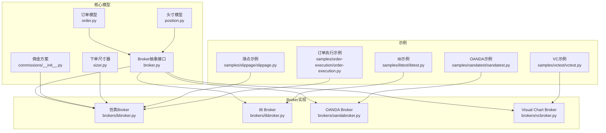
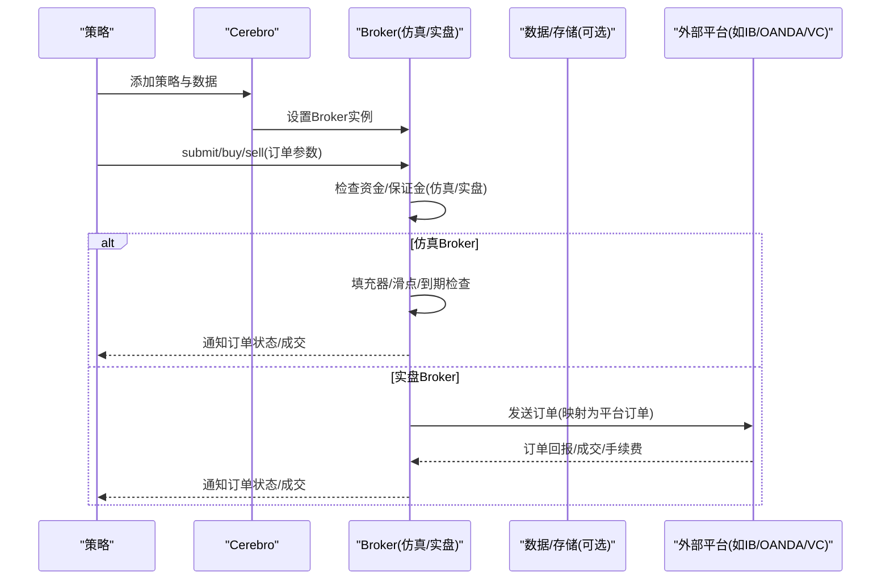
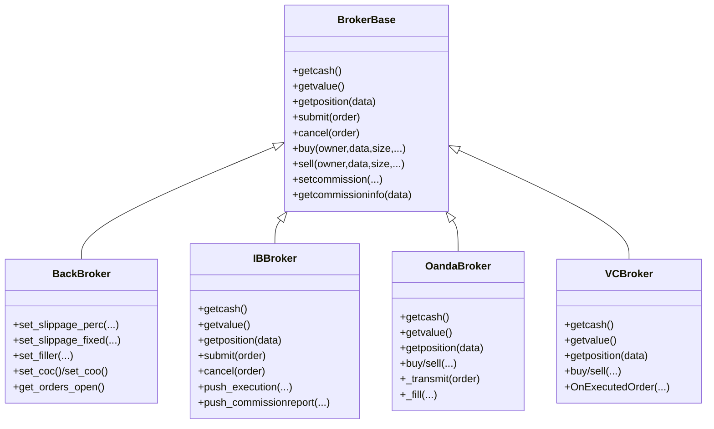
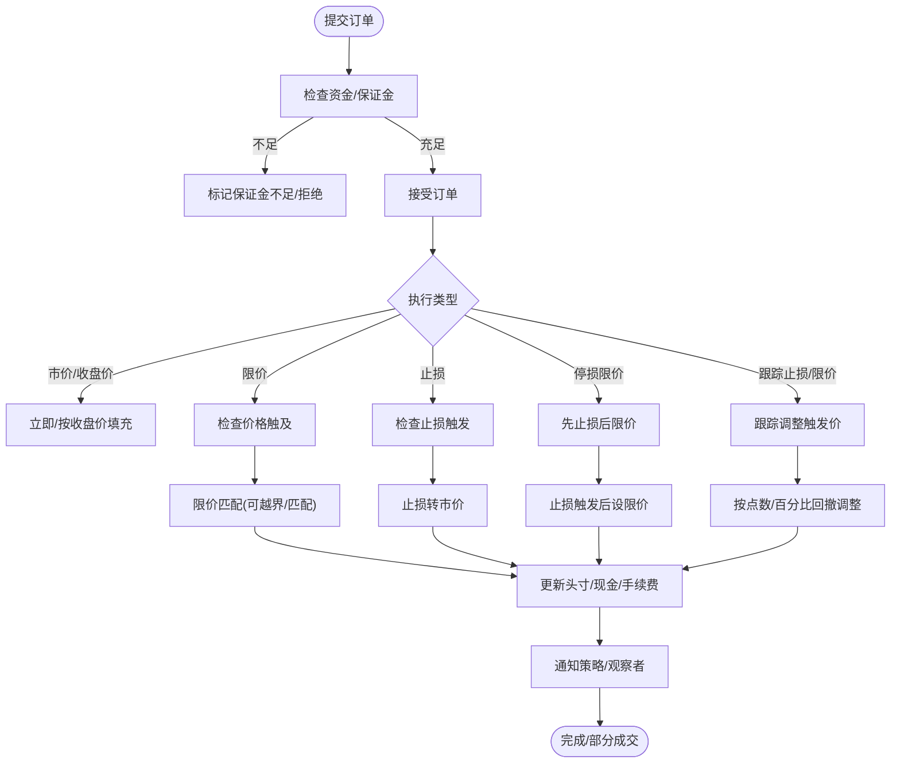
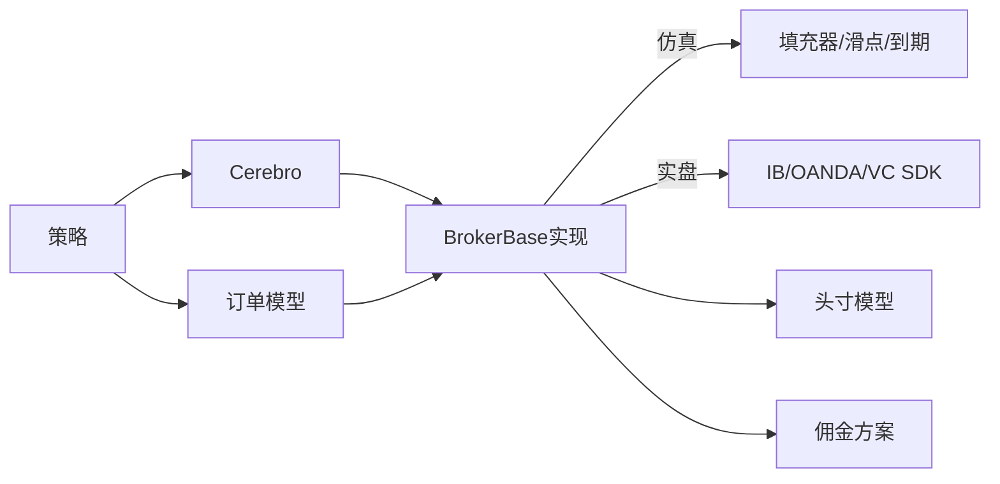

# 实时交易

<cite>
**本文引用的文件**
- [backtrader/broker.py](file://backtrader/broker.py)
- [backtrader/order.py](file://backtrader/order.py)
- [backtrader/position.py](file://backtrader/position.py)
- [backtrader/sizer.py](file://backtrader/sizer.py)
- [backtrader/commissions/__init__.py](file://backtrader/commissions/__init__.py)
- [backtrader/brokers/bbroker.py](file://backtrader/brokers/bbroker.py)
- [backtrader/brokers/ibbroker.py](file://backtrader/brokers/ibbroker.py)
- [backtrader/brokers/oandabroker.py](file://backtrader/brokers/oandabroker.py)
- [backtrader/brokers/vcbroker.py](file://backtrader/brokers/vcbroker.py)
- [samples/ibtest/ibtest.py](file://samples/ibtest/ibtest.py)
- [samples/oandatest/oandatest.py](file://samples/oandatest/oandatest.py)
- [samples/vctest/vctest.py](file://samples/vctest/vctest.py)
- [samples/slippage/slippage.py](file://samples/slippage/slippage.py)
- [samples/order-execution/order-execution.py](file://samples/order-execution/order-execution.py)
</cite>

## 目录
1. [简介](#简介)
2. [项目结构](#项目结构)
3. [核心组件](#核心组件)
4. [架构总览](#架构总览)
5. [详细组件分析](#详细组件分析)
6. [依赖关系分析](#依赖关系分析)
7. [性能考虑](#性能考虑)
8. [故障排查指南](#故障排查指南)
9. [结论](#结论)
10. [附录](#附录)

## 简介
本文件面向Backtrader实时交易系统的功能与实现，围绕Broker接口设计、订单执行机制、资金与风险管理、佣金与滑点、仓位管理等主题进行系统化梳理，并结合Interactive Brokers、OANDA、Visual Chart等第三方服务的集成方式，给出可操作的配置示例与最佳实践，帮助开发者在真实市场环境中部署交易策略。

## 项目结构
Backtrader将交易相关能力按职责拆分到多个模块：
- 订单与状态：order.py 定义订单生命周期、执行位、状态机与类型枚举
- 资金与头寸：broker.py 定义Broker抽象接口；position.py 提供头寸更新与损益计算
- 仿真与实盘Broker：brokers/bbroker.py（仿真）、brokers/ibbroker.py（IB）、brokers/oandabroker.py（OANDA）、brokers/vcbroker.py（Visual Chart）
- 佣金方案：commissions/__init__.py 提供股票/期货佣金模板
- 下单尺寸：sizer.py 提供下单量计算器接口
- 示例：samples 目录下包含各Broker的端到端示例

图表来源
- [backtrader/order.py](file://backtrader/order.py#L222-L642)
- [backtrader/position.py](file://backtrader/position.py#L28-L207)
- [backtrader/broker.py](file://backtrader/broker.py#L49-L169)
- [backtrader/brokers/bbroker.py](file://backtrader/brokers/bbroker.py#L36-L800)
- [backtrader/brokers/ibbroker.py](file://backtrader/brokers/ibbroker.py#L240-L576)
- [backtrader/brokers/oandabroker.py](file://backtrader/brokers/oandabroker.py#L60-L358)
- [backtrader/brokers/vcbroker.py](file://backtrader/brokers/vcbroker.py#L70-L467)
- [backtrader/commissions/__init__.py](file://backtrader/commissions/__init__.py#L27-L65)
- [backtrader/sizer.py](file://backtrader/sizer.py#L29-L85)
- [samples/ibtest/ibtest.py](file://samples/ibtest/ibtest.py#L211-L341)
- [samples/oandatest/oandatest.py](file://samples/oandatest/oandatest.py#L191-L320)
- [samples/vctest/vctest.py](file://samples/vctest/vctest.py#L155-L266)
- [samples/slippage/slippage.py](file://samples/slippage/slippage.py#L55-L102)
- [samples/order-execution/order-execution.py](file://samples/order-execution/order-execution.py#L164-L184)

章节来源
- [backtrader/broker.py](file://backtrader/broker.py#L49-L169)
- [backtrader/order.py](file://backtrader/order.py#L222-L642)
- [backtrader/position.py](file://backtrader/position.py#L28-L207)
- [backtrader/brokers/bbroker.py](file://backtrader/brokers/bbroker.py#L36-L800)
- [backtrader/brokers/ibbroker.py](file://backtrader/brokers/ibbroker.py#L240-L576)
- [backtrader/brokers/oandabroker.py](file://backtrader/brokers/oandabroker.py#L60-L358)
- [backtrader/brokers/vcbroker.py](file://backtrader/brokers/vcbroker.py#L70-L467)
- [backtrader/commissions/__init__.py](file://backtrader/commissions/__init__.py#L27-L65)
- [backtrader/sizer.py](file://backtrader/sizer.py#L29-L85)
- [samples/ibtest/ibtest.py](file://samples/ibtest/ibtest.py#L211-L341)
- [samples/oandatest/oandatest.py](file://samples/oandatest/oandatest.py#L191-L320)
- [samples/vctest/vctest.py](file://samples/vctest/vctest.py#L155-L266)
- [samples/slippage/slippage.py](file://samples/slippage/slippage.py#L55-L102)
- [samples/order-execution/order-execution.py](file://samples/order-execution/order-execution.py#L164-L184)

## 核心组件
- Broker接口设计
  - 抽象接口定义了资金查询、价值评估、头寸查询、提交/取消订单、设置佣金方案等能力，确保仿真与实盘Broker的一致性
  - 支持资金模式切换（如基金模式）与历史订单/净值记录
- 订单模型
  - 统一的订单生命周期：Created → Submitted → Accepted → Partial/Completed 或 Canceled/Expired/Margin/Rejected
  - 支持多种执行类型：市价、收盘价市价、限价、止损、停损限价、跟踪止损、跟踪止损限价
  - 执行位（OrderExecutionBit）记录每次成交的成交量、成交价、已平仓/新开仓部分、手续费、盈亏等
- 头寸模型
  - Position维护当前头寸规模与均价，提供更新、克隆、伪更新等方法，用于仿真与实盘Broker内部头寸演进
- 佣金与滑点
  - 通过CommInfo对象与Broker参数配置，支持百分比/固定佣金；仿真Broker支持滑点参数（百分比/固定点数、是否按开盘价滑点、是否匹配/越界滑点等）
- 尺寸器
  - Sizer接口根据可用资金、佣金方案与策略上下文计算下单数量，便于风控与资金管理

章节来源
- [backtrader/broker.py](file://backtrader/broker.py#L49-L169)
- [backtrader/order.py](file://backtrader/order.py#L35-L221)
- [backtrader/position.py](file://backtrader/position.py#L28-L207)
- [backtrader/commissions/__init__.py](file://backtrader/commissions/__init__.py#L27-L65)
- [backtrader/sizer.py](file://backtrader/sizer.py#L29-L85)

## 架构总览
Backtrader采用“策略驱动、Broker统一接口、多Broker实现”的架构。策略通过Cerebro调度，向Broker提交订单；Broker负责资金校验、订单执行、头寸更新与通知；不同Broker对接不同外部平台或仿真引擎。

图表来源
- [backtrader/brokers/bbroker.py](file://backtrader/brokers/bbroker.py#L532-L686)
- [backtrader/brokers/ibbroker.py](file://backtrader/brokers/ibbroker.py#L327-L403)
- [backtrader/brokers/oandabroker.py](file://backtrader/brokers/oandabroker.py#L281-L338)
- [backtrader/brokers/vcbroker.py](file://backtrader/brokers/vcbroker.py#L291-L342)

## 详细组件分析

### Broker接口与实现
- 接口职责
  - 资金与价值：getcash/getvalue、setcash/add_cash、get_leverage/fund模式
  - 订单：submit/cancel、buy/sell、get_orders_open、orderstatus
  - 头寸：getposition、内部Position维护
  - 佣金：setcommission/addcommissioninfo/getcommissioninfo
  - 历史与通知：add_order_history/set_fund_history/get_notification
- 仿真Broker（BackBroker）
  - 支持填充器（volume filler）与滑点参数，可配置按收盘/开盘/匹配/越界滑点等行为
  - 支持到期订单、COO/COC等高级特性
- 实盘Broker
  - IB：映射IB订单类型与参数，接收执行回报与手续费，维护本地头寸
  - OANDA：从账户读取现有头寸，支持Bracket订单族
  - Visual Chart：通过COM事件回调处理订单与成交，需显式配置佣金方案

图表来源
- [backtrader/broker.py](file://backtrader/broker.py#L49-L169)
- [backtrader/brokers/bbroker.py](file://backtrader/brokers/bbroker.py#L36-L800)
- [backtrader/brokers/ibbroker.py](file://backtrader/brokers/ibbroker.py#L240-L576)
- [backtrader/brokers/oandabroker.py](file://backtrader/brokers/oandabroker.py#L60-L358)
- [backtrader/brokers/vcbroker.py](file://backtrader/brokers/vcbroker.py#L70-L467)

章节来源
- [backtrader/broker.py](file://backtrader/broker.py#L49-L169)
- [backtrader/brokers/bbroker.py](file://backtrader/brokers/bbroker.py#L36-L800)
- [backtrader/brokers/ibbroker.py](file://backtrader/brokers/ibbroker.py#L240-L576)
- [backtrader/brokers/oandabroker.py](file://backtrader/brokers/oandabroker.py#L60-L358)
- [backtrader/brokers/vcbroker.py](file://backtrader/brokers/vcbroker.py#L70-L467)

### 订单类型与执行流程
- 订单类型
  - 市价、收盘价市价、限价、止损、停损限价、跟踪止损、跟踪止损限价
  - 时间有效期：当日、指定日期、相对时间差
  - OCO/Bracket/父子单：支持OCO组、Bracket三联单等组合单
- 执行流程
  - 仿真：根据填充器/滑点/到期规则推进，更新头寸、现金、手续费与未实现盈亏
  - 实盘：由外部平台回报触发，Broker解析回报、更新头寸与通知策略

图表来源
- [backtrader/order.py](file://backtrader/order.py#L222-L642)
- [backtrader/brokers/bbroker.py](file://backtrader/brokers/bbroker.py#L687-L800)
- [backtrader/brokers/ibbroker.py](file://backtrader/brokers/ibbroker.py#L477-L542)
- [backtrader/brokers/oandabroker.py](file://backtrader/brokers/oandabroker.py#L231-L280)
- [backtrader/brokers/vcbroker.py](file://backtrader/brokers/vcbroker.py#L393-L434)

章节来源
- [backtrader/order.py](file://backtrader/order.py#L222-L642)
- [backtrader/brokers/bbroker.py](file://backtrader/brokers/bbroker.py#L687-L800)
- [backtrader/brokers/ibbroker.py](file://backtrader/brokers/ibbroker.py#L477-L542)
- [backtrader/brokers/oandabroker.py](file://backtrader/brokers/oandabroker.py#L231-L280)
- [backtrader/brokers/vcbroker.py](file://backtrader/brokers/vcbroker.py#L393-L434)

### 佣金与滑点
- 佣金方案
  - 股票/期货两种基础方案，支持百分比/固定费用类型
  - 实盘Broker会根据平台返回的手续费进行分配（平仓/开仓部分）
- 滑点
  - 仿真Broker支持滑点百分比/固定点数、是否按开盘价滑点、是否匹配/越界滑点
  - 示例展示了如何在Cerebro中配置滑点参数

章节来源
- [backtrader/commissions/__init__.py](file://backtrader/commissions/__init__.py#L27-L65)
- [backtrader/brokers/bbroker.py](file://backtrader/brokers/bbroker.py#L224-L242)
- [samples/slippage/slippage.py](file://samples/slippage/slippage.py#L82-L93)

### 仓位管理与风险控制
- 仿真Broker
  - 支持到期订单、COO/COC、短仓现金处理、杠杆与未实现盈亏统计
  - 可配置资金模式（基金模式）以跟踪净值而非总资产
- 实盘Broker
  - IB/OANDA/VC均通过平台回报更新头寸，策略侧通过通知感知
  - Bracket订单族用于止盈止损一体化管理

章节来源
- [backtrader/brokers/bbroker.py](file://backtrader/brokers/bbroker.py#L224-L242)
- [backtrader/brokers/oandabroker.py](file://backtrader/brokers/oandabroker.py#L209-L230)
- [backtrader/brokers/ibbroker.py](file://backtrader/brokers/ibbroker.py#L522-L542)

### 第三方服务集成

#### Interactive Brokers（IB）
- 集成要点
  - 使用IBStore获取Broker实例或直接实例化IBBroker
  - 订单类型映射至IB订单类型，支持GTC/DAY/GTD有效期
  - 通过回调接收订单回报、执行回报与手续费，解析后更新头寸并通知策略
- 示例用法
  - 通过命令行参数选择store/broker模式、连接参数、数据与订单参数

章节来源
- [backtrader/brokers/ibbroker.py](file://backtrader/brokers/ibbroker.py#L240-L576)
- [samples/ibtest/ibtest.py](file://samples/ibtest/ibtest.py#L211-L341)

#### OANDA
- 集成要点
  - 可从账户读取现有头寸初始化Broker
  - 支持Bracket三联单：主单+止损+止盈，自动互斥取消
- 示例用法
  - 通过token/account选择账户，可启用Bracket或Limit/Stop等执行类型

章节来源
- [backtrader/brokers/oandabroker.py](file://backtrader/brokers/oandabroker.py#L60-L358)
- [samples/oandatest/oandatest.py](file://samples/oandatest/oandatest.py#L191-L320)

#### Visual Chart（VC）
- 集成要点
  - 通过COM事件回调处理订单回报与成交，需显式配置佣金方案
  - 支持账户选择、订单类型/时间限制映射
- 示例用法
  - 通过命令行参数选择store/broker模式、账户、数据与订单参数

章节来源
- [backtrader/brokers/vcbroker.py](file://backtrader/brokers/vcbroker.py#L70-L467)
- [samples/vctest/vctest.py](file://samples/vctest/vctest.py#L155-L266)

## 依赖关系分析
- 组件耦合
  - 订单模型与Broker强耦合：Broker负责订单生命周期推进与状态通知
  - 佣金方案与Broker松耦合：通过CommInfo注入，便于替换
  - 实盘Broker与平台SDK紧耦合：IB/OANDA/VC分别依赖其客户端库
- 关键依赖链
  - 策略 → Cerebro → Broker → 平台（或仿真填充器）
  - 订单 → 填充器/滑点/到期 → 头寸/资金 → 通知

图表来源
- [backtrader/order.py](file://backtrader/order.py#L222-L642)
- [backtrader/position.py](file://backtrader/position.py#L28-L207)
- [backtrader/broker.py](file://backtrader/broker.py#L49-L169)
- [backtrader/brokers/bbroker.py](file://backtrader/brokers/bbroker.py#L36-L800)
- [backtrader/commissions/__init__.py](file://backtrader/commissions/__init__.py#L27-L65)

章节来源
- [backtrader/order.py](file://backtrader/order.py#L222-L642)
- [backtrader/position.py](file://backtrader/position.py#L28-L207)
- [backtrader/broker.py](file://backtrader/broker.py#L49-L169)
- [backtrader/brokers/bbroker.py](file://backtrader/brokers/bbroker.py#L36-L800)
- [backtrader/commissions/__init__.py](file://backtrader/commissions/__init__.py#L27-L65)

## 性能考虑
- 仿真Broker
  - 填充器与滑点计算对回测性能有直接影响，建议在大批量回测时优化填充器逻辑
  - COO/COC等特性可能改变执行时序，需谨慎评估对策略信号的影响
- 实盘Broker
  - 订单回报与手续费解析存在网络延迟与解析成本，建议批量处理与异步通知
  - 大量并发订单时注意线程安全与锁竞争（如IBBroker中的锁）

## 故障排查指南
- 订单被拒/过期
  - 检查资金/保证金是否满足；确认有效期设置；核对价格/触发价是否合理
- 成交异常
  - 仿真：检查滑点参数与匹配策略；确认填充器返回的成交量
  - 实盘：检查平台回报是否完整（执行回报/手续费），确认订单映射正确
- 头寸不一致
  - 实盘Broker需关注平台回报顺序与策略通知边界（如IB的commissionreport与updatePortfolio时机）
- 资金/净值异常
  - 确认是否启用基金模式；检查短期现金与保证金处理差异

章节来源
- [backtrader/brokers/ibbroker.py](file://backtrader/brokers/ibbroker.py#L477-L542)
- [backtrader/brokers/oandabroker.py](file://backtrader/brokers/oandabroker.py#L231-L280)
- [backtrader/brokers/vcbroker.py](file://backtrader/brokers/vcbroker.py#L393-L434)

## 结论
Backtrader通过统一的Broker接口与完善的订单/头寸/佣金/滑点机制，实现了从仿真到实盘（IB/OANDA/VC）的一致体验。开发者可在策略层专注于信号与风控，在Broker层选择合适的实现与平台集成方式，快速落地真实市场的交易策略。

## 附录

### 实战配置示例与最佳实践
- 仿真滑点配置
  - 在Cerebro上设置滑点百分比/固定点数、是否按开盘价滑点、是否匹配/越界滑点
  - 示例参考：[samples/slippage/slippage.py](file://samples/slippage/slippage.py#L82-L93)
- 订单类型与有效期
  - 示例展示市价/收盘价/限价/止损/停损限价的创建与有效期设置
  - 示例参考：[samples/order-execution/order-execution.py](file://samples/order-execution/order-execution.py#L108-L162)
- IB实盘
  - 通过IBStore获取Broker或直接实例化IBBroker，配置连接参数与数据源
  - 示例参考：[samples/ibtest/ibtest.py](file://samples/ibtest/ibtest.py#L211-L341)
- OANDA实盘
  - 使用Token与账户初始化，可启用Bracket三联单
  - 示例参考：[samples/oandatest/oandatest.py](file://samples/oandatest/oandatest.py#L191-L320)
- Visual Chart实盘
  - 通过COM事件回调处理订单回报，需配置佣金方案
  - 示例参考：[samples/vctest/vctest.py](file://samples/vctest/vctest.py#L155-L266)