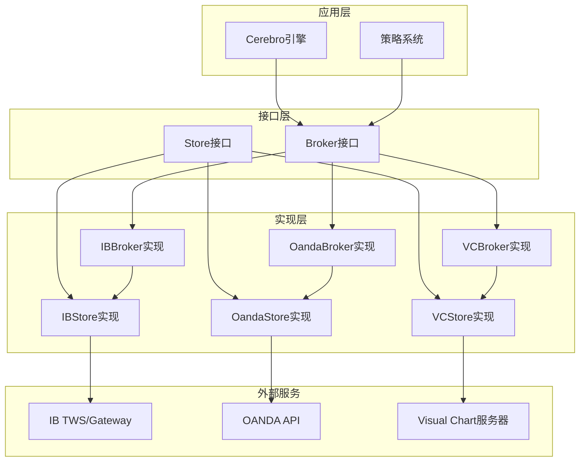
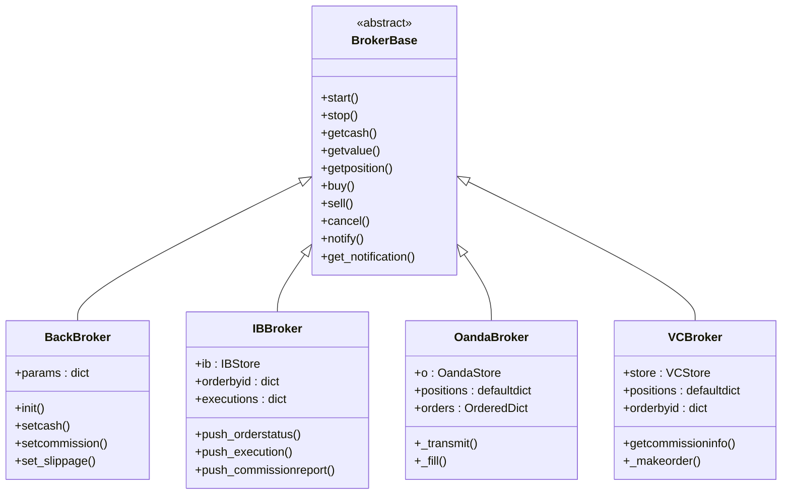
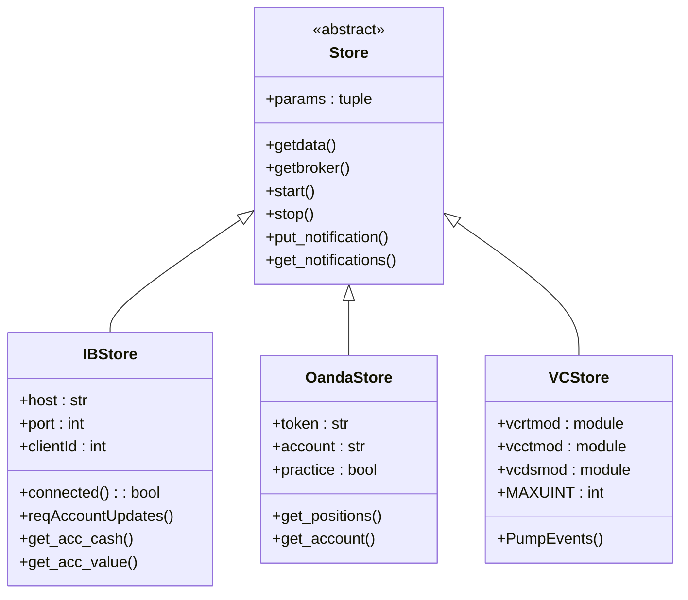
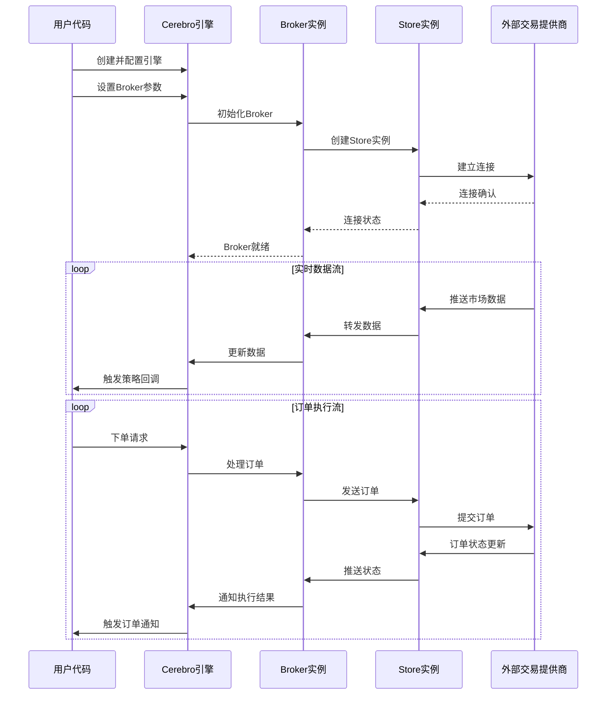
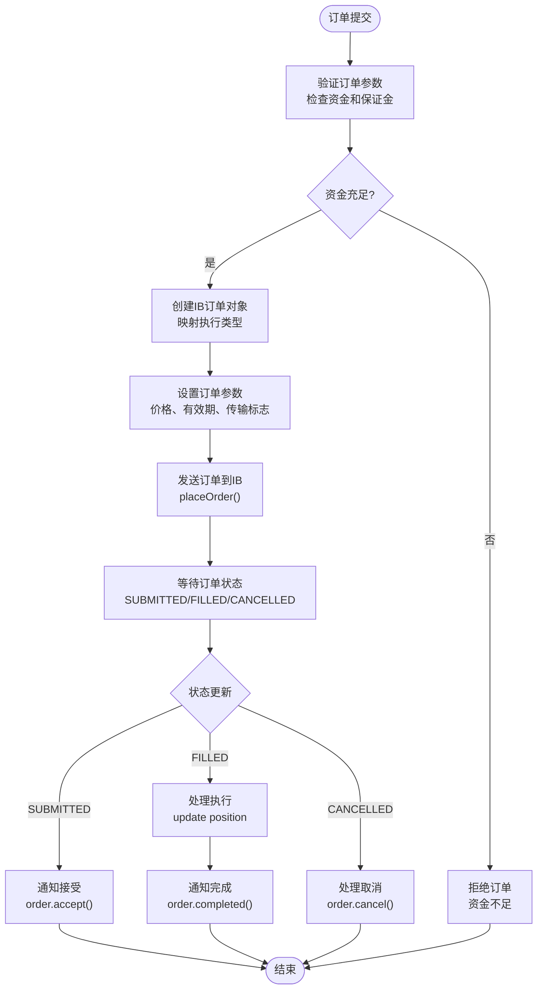
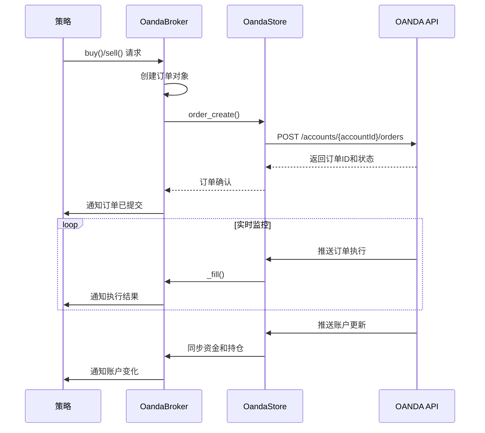
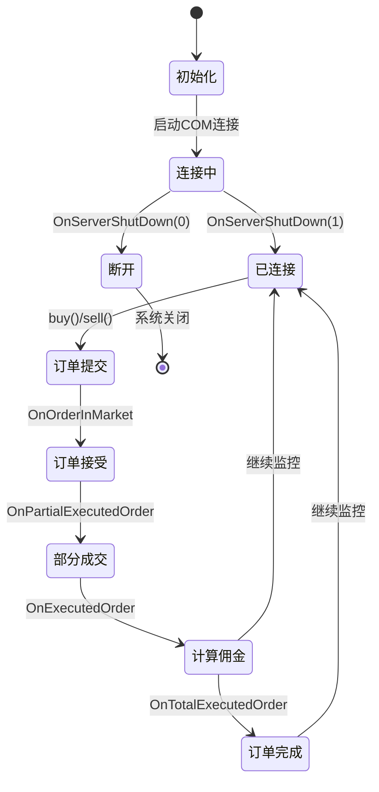
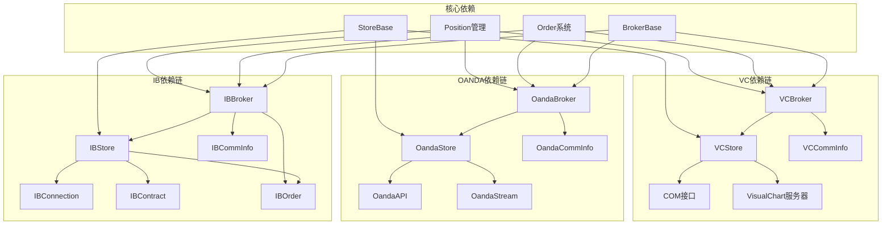

# 第三方接口集成

<cite>
**本文档引用的文件**
- [backtrader/brokers/__init__.py](file://backtrader/brokers/__init__.py)
- [backtrader/stores/__init__.py](file://backtrader/stores/__init__.py)
- [backtrader/brokers/bbroker.py](file://backtrader/brokers/bbroker.py)
- [backtrader/brokers/ibbroker.py](file://backtrader/brokers/ibbroker.py)
- [backtrader/brokers/oandabroker.py](file://backtrader/brokers/oandabroker.py)
- [backtrader/brokers/vcbroker.py](file://backtrader/brokers/vcbroker.py)
- [backtrader/store.py](file://backtrader/store.py)
- [backtrader/stores/ibstore.py](file://backtrader/stores/ibstore.py)
- [backtrader/stores/oandastore.py](file://backtrader/stores/oandastore.py)
- [backtrader/stores/vcstore.py](file://backtrader/stores/vcstore.py)
- [samples/ibtest/ibtest.py](file://samples/ibtest/ibtest.py)
- [samples/oandatest/oandatest.py](file://samples/oandatest/oandatest.py)
- [samples/vctest/vctest.py](file://samples/vctest/vctest.py)
</cite>

## 目录
1. [简介](#简介)
2. [项目结构](#项目结构)
3. [核心组件](#核心组件)
4. [架构概览](#架构概览)
5. [详细组件分析](#详细组件分析)
6. [依赖关系分析](#依赖关系分析)
7. [性能考虑](#性能考虑)
8. [故障排除指南](#故障排除指南)
9. [结论](#结论)

## 简介

Backtrader是一个强大的Python量化交易框架，提供了对多个第三方交易接口的完整集成支持。本文档深入介绍了Backtrader的第三方接口集成功能，重点涵盖以下主流交易提供商：

- **Interactive Brokers (IB)**：全球领先的电子交易平台，提供广泛的金融产品覆盖
- **OANDA外汇平台**：专业的外汇市场服务商，专注于外汇交易
- **Visual Chart (VC)**：专业的图表分析软件，提供实时市场数据和交易功能

每个Broker实现都针对其特定平台的特点进行了优化，提供了完整的订单执行、资金管理和风险控制功能。

## 项目结构

Backtrader的第三方接口集成采用模块化设计，主要分为以下几个核心层次：

**图表来源**
- [backtrader/brokers/__init__.py](file://backtrader/brokers/__init__.py#L27-L42)
- [backtrader/stores/__init__.py](file://backtrader/stores/__init__.py#L27-L43)

**章节来源**
- [backtrader/brokers/__init__.py](file://backtrader/brokers/__init__.py#L27-L42)
- [backtrader/stores/__init__.py](file://backtrader/stores/__init__.py#L27-L43)

## 核心组件

### Broker抽象层

所有Broker实现都继承自统一的抽象基类，确保了接口的一致性和可互换性：

**图表来源**
- [backtrader/brokers/bbroker.py](file://backtrader/brokers/bbroker.py#L36-L80)
- [backtrader/brokers/ibbroker.py](file://backtrader/brokers/ibbroker.py#L240-L290)
- [backtrader/brokers/oandabroker.py](file://backtrader/brokers/oandabroker.py#L60-L110)
- [backtrader/brokers/vcbroker.py](file://backtrader/brokers/vcbroker.py#L70-L140)

### Store抽象层

Store层负责与外部交易提供商建立和维护连接：

**图表来源**
- [backtrader/store.py](file://backtrader/store.py#L44-L95)
- [backtrader/stores/ibstore.py](file://backtrader/stores/ibstore.py#L105-L187)
- [backtrader/stores/oandastore.py](file://backtrader/stores/oandastore.py#L177-L200)
- [backtrader/stores/vcstore.py](file://backtrader/stores/vcstore.py#L187-L200)

**章节来源**
- [backtrader/brokers/bbroker.py](file://backtrader/brokers/bbroker.py#L36-L80)
- [backtrader/store.py](file://backtrader/store.py#L44-L95)

## 架构概览

Backtrader的第三方接口集成采用了分层架构设计，确保了系统的可扩展性和稳定性：

**图表来源**
- [backtrader/brokers/ibbroker.py](file://backtrader/brokers/ibbroker.py#L280-L295)
- [backtrader/brokers/oandabroker.py](file://backtrader/brokers/oandabroker.py#L94-L109)
- [backtrader/brokers/vcbroker.py](file://backtrader/brokers/vcbroker.py#L182-L188)

## 详细组件分析

### Interactive Brokers (IB) 集成

#### 特点和优势

IB集成是Backtrader最成熟的第三方接口之一，具有以下特点：

- **全球市场覆盖**：支持股票、期权、期货、外汇等多种金融产品
- **实时数据流**：通过TWS/Gateway提供高质量的实时市场数据
- **高级订单类型**：支持止损、止盈、OCO、Bracket等复杂订单类型
- **账户管理**：完整的账户资金和持仓管理功能

#### 关键实现特性

**图表来源**
- [backtrader/brokers/ibbroker.py](file://backtrader/brokers/ibbroker.py#L327-L340)
- [backtrader/brokers/ibbroker.py](file://backtrader/brokers/ibbroker.py#L413-L476)

#### 连接配置和认证

IB集成需要以下关键配置参数：

| 参数名称 | 默认值 | 描述 |
|---------|--------|------|
| `host` | `127.0.0.1` | TWS/Gateway服务器地址 |
| `port` | `7496` | 连接端口（模拟环境使用7497） |
| `clientId` | `None` | 客户端ID（自动分配随机值） |
| `notifyall` | `False` | 是否接收所有消息通知 |
| `_debug` | `False` | 调试模式开关 |

**章节来源**
- [backtrader/stores/ibstore.py](file://backtrader/stores/ibstore.py#L111-L166)
- [backtrader/brokers/ibbroker.py](file://backtrader/brokers/ibbroker.py#L265-L290)

### OANDA 外汇平台集成

#### 特点和优势

OANDA集成专为外汇交易设计，具有以下特色：

- **外汇专业性**：原生支持货币对交易和点差计算
- **灵活的时间框架**：支持从秒级到月级别的多种时间周期
- **实时报价**：提供双向报价（Bid/Ask）和市场深度
- **账户同步**：自动同步账户余额和持仓信息

#### 订单处理流程

**图表来源**
- [backtrader/brokers/oandabroker.py](file://backtrader/brokers/oandabroker.py#L281-L304)
- [backtrader/brokers/oandabroker.py](file://backtrader/brokers/oandabroker.py#L231-L280)

#### 配置参数详解

| 参数名称 | 默认值 | 描述 |
|---------|--------|------|
| `token` | `''` | API访问令牌 |
| `account` | `''` | 账户ID |
| `practice` | `False` | 是否使用模拟环境 |
| `account_tmout` | `10.0` | 账户信息刷新间隔 |

**章节来源**
- [backtrader/stores/oandastore.py](file://backtrader/stores/oandastore.py#L180-L199)
- [backtrader/brokers/oandabroker.py](file://backtrader/brokers/oandabroker.py#L74-L77)

### Visual Chart 集成

#### 特点和优势

Visual Chart集成提供了独特的图表分析功能：

- **图表功能**：深度集成Visual Chart的图表分析工具
- **COM接口**：通过COM接口与Visual Chart服务器通信
- **多账户支持**：支持同时管理多个交易账户
- **自定义佣金**：允许用户定义特定的佣金结构

#### COM事件处理机制

**图表来源**
- [backtrader/brokers/vcbroker.py](file://backtrader/brokers/vcbroker.py#L361-L370)
- [backtrader/brokers/vcbroker.py](file://backtrader/brokers/vcbroker.py#L393-L434)

#### 配置选项

| 参数名称 | 默认值 | 描述 |
|---------|--------|------|
| `account` | `None` | 指定要使用的账户名称 |
| `commission` | `None` | 自定义佣金方案对象 |

**章节来源**
- [backtrader/brokers/vcbroker.py](file://backtrader/brokers/vcbroker.py#L126-L129)
- [backtrader/brokers/vcbroker.py](file://backtrader/brokers/vcbroker.py#L361-L370)

## 依赖关系分析

Backtrader的第三方接口集成展现了清晰的依赖层次结构：

**图表来源**
- [backtrader/brokers/ibbroker.py](file://backtrader/brokers/ibbroker.py#L30-L42)
- [backtrader/brokers/oandabroker.py](file://backtrader/brokers/oandabroker.py#L29-L38)
- [backtrader/brokers/vcbroker.py](file://backtrader/brokers/vcbroker.py#L28-L35)

**章节来源**
- [backtrader/brokers/ibbroker.py](file://backtrader/brokers/ibbroker.py#L30-L42)
- [backtrader/brokers/oandabroker.py](file://backtrader/brokers/oandabroker.py#L29-L38)
- [backtrader/brokers/vcbroker.py](file://backtrader/brokers/vcbroker.py#L28-L35)

## 性能考虑

### 连接管理优化

1. **连接池管理**：Store实现采用单例模式，避免重复连接
2. **重连机制**：支持自动重连和指数退避算法
3. **超时控制**：合理的超时设置防止阻塞操作

### 内存管理

1. **数据缓存**：合理设置历史数据缓存大小
2. **事件队列**：使用高效的队列结构处理异步事件
3. **对象复用**：减少频繁的对象创建和销毁

### 网络优化

1. **批量请求**：合并多个小请求提高效率
2. **压缩传输**：启用数据压缩减少网络负载
3. **心跳检测**：定期发送心跳包维持连接稳定

## 故障排除指南

### 常见连接问题

#### IB连接问题

**症状**：无法连接到IB TWS/Gateway
**解决方案**：
1. 检查主机和端口配置
2. 验证clientId唯一性
3. 确认防火墙设置
4. 使用调试模式查看详细日志

#### OANDA连接问题

**症状**：API调用失败或返回错误
**解决方案**：
1. 验证token和account配置
2. 检查网络连接稳定性
3. 确认账户状态有效
4. 查看API限制和配额

#### Visual Chart连接问题

**症状**：COM接口调用失败
**解决方案**：
1. 确认Visual Chart服务器运行
2. 检查COM注册表设置
3. 验证用户权限
4. 查看事件回调函数实现

### 订单执行问题

#### 订单被拒绝

**可能原因**：
1. 资金不足
2. 价格超出滑点范围
3. 市场暂停交易
4. 风险控制触发

**解决方法**：
1. 检查账户资金和保证金
2. 调整订单价格和数量
3. 确认市场状态
4. 检查风控参数

#### 订单超时

**解决方法**：
1. 增加订单有效期
2. 检查市场流动性
3. 调整订单类型
4. 监控网络延迟

**章节来源**
- [backtrader/stores/ibstore.py](file://backtrader/stores/ibstore.py#L137-L147)
- [backtrader/stores/oandastore.py](file://backtrader/stores/oandastore.py#L41-L63)
- [backtrader/brokers/ibbroker.py](file://backtrader/brokers/ibbroker.py#L543-L564)

## 结论

Backtrader的第三方接口集成功能展现了卓越的架构设计和实现质量。通过统一的抽象接口和模块化的实现方式，Backtrader成功地将不同交易提供商的独特功能整合到一个一致的框架中。

### 主要优势

1. **统一接口**：所有Broker实现遵循相同的接口规范
2. **可扩展性**：易于添加新的交易提供商支持
3. **稳定性**：完善的错误处理和重连机制
4. **性能优化**：高效的内存管理和网络通信

### 适用场景

- **IB集成**：适合需要全球市场覆盖和复杂订单类型的用户
- **OANDA集成**：适合专注于外汇交易的专业用户
- **Visual Chart集成**：适合需要图表分析功能的用户

### 未来发展

Backtrader的第三方接口集成将继续演进，重点包括：
1. 支持更多交易提供商
2. 优化性能和稳定性
3. 增强实时数据处理能力
4. 扩展风险管理功能

通过持续的改进和优化，Backtrader将继续为量化交易用户提供强大而可靠的第三方接口集成解决方案。