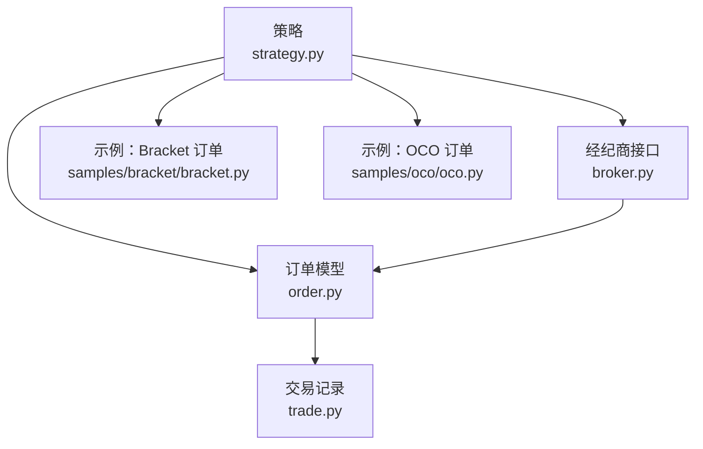
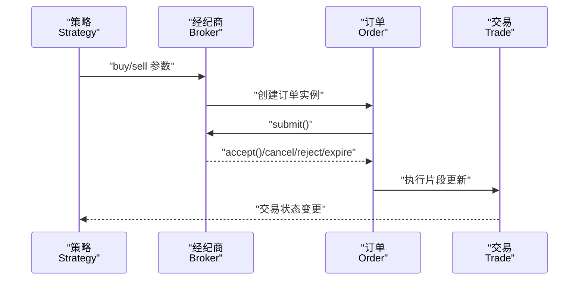
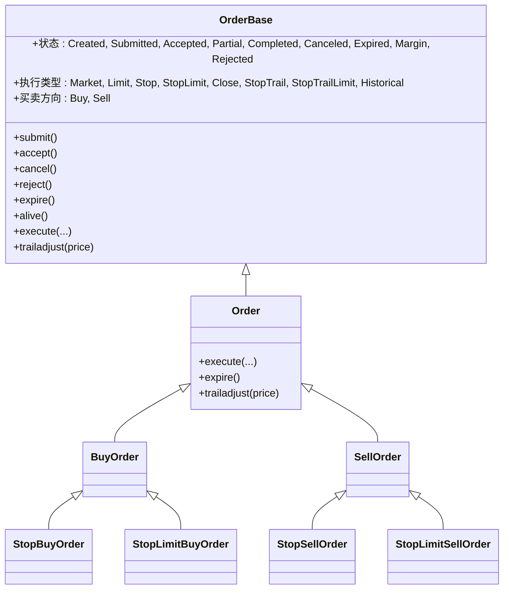
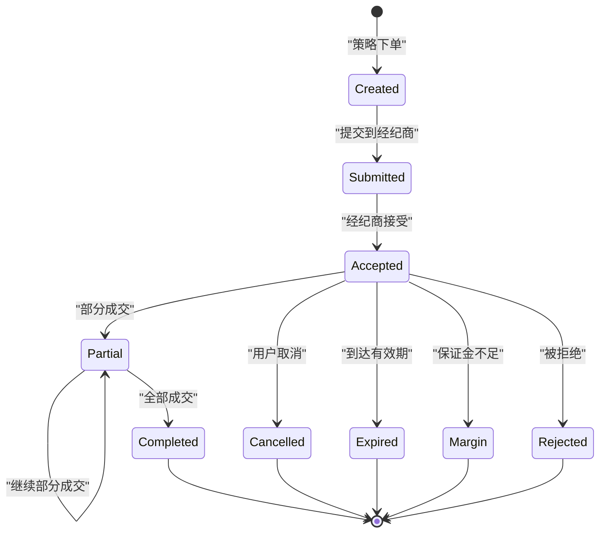
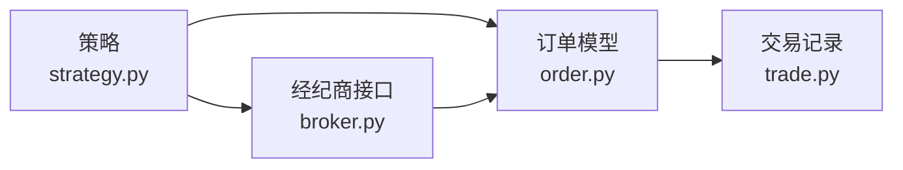

# 订单管理系统

<cite>
**本文引用的文件**
- [order.py](file://backtrader/order.py)
- [broker.py](file://backtrader/broker.py)
- [trade.py](file://backtrader/trade.py)
- [strategy.py](file://backtrader/strategy.py)
- [bracket.py](file://samples/bracket/bracket.py)
- [oco.py](file://samples/oco/oco.py)
- [architecture.md](file://.claude/architecture.md)
</cite>

## 目录
1. [简介](#简介)
2. [项目结构](#项目结构)
3. [核心组件](#核心组件)
4. [架构总览](#架构总览)
5. [详细组件分析](#详细组件分析)
6. [依赖关系分析](#依赖关系分析)
7. [性能考虑](#性能考虑)
8. [故障排除指南](#故障排除指南)
9. [结论](#结论)
10. [附录](#附录)

## 简介
本文件为 Backtrader 订单管理系统的全面功能文档，覆盖订单类型体系（市价单、限价单、止损单、跟踪止损等）、订单生命周期管理（提交、接受、部分成交、完成、取消、过期、保证金不足、被拒）、订单参数配置（价格限制、有效期、oco 订单、父子订单、传输控制）、订单状态跟踪与通知、执行队列与批量处理机制，并提供实际使用示例与性能优化建议。

## 项目结构
Backtrader 的订单管理由多个模块协同完成：
- 订单模型与生命周期：backtrader/order.py
- 经纪商接口：backtrader/broker.py
- 交易记录与历史：backtrader/trade.py
- 策略下单入口与参数解释：backtrader/strategy.py
- 示例：samples/bracket/bracket.py（Bracket 订单）、samples/oco/oco.py（OCO 订单）

图表来源
- [strategy.py](file://backtrader/strategy.py#L800-L999)
- [broker.py](file://backtrader/broker.py#L145-L163)
- [order.py](file://backtrader/order.py#L222-L527)
- [trade.py](file://backtrader/trade.py#L94-L312)
- [bracket.py](file://samples/bracket/bracket.py#L62-L120)
- [oco.py](file://samples/oco/oco.py#L72-L120)

章节来源
- [strategy.py](file://backtrader/strategy.py#L800-L999)
- [broker.py](file://backtrader/broker.py#L145-L163)
- [order.py](file://backtrader/order.py#L222-L527)
- [trade.py](file://backtrader/trade.py#L94-L312)
- [bracket.py](file://samples/bracket/bracket.py#L62-L120)
- [oco.py](file://samples/oco/oco.py#L72-L120)

## 核心组件
- 订单基类与状态机：定义订单生命周期状态、执行类型、买卖方向、有效期与过期逻辑、跟踪止损调整等。
- 执行数据容器：记录每次执行的片段（OrderExecutionBit）与累计执行（OrderData），支持克隆与增量更新。
- 经纪商接口：抽象提交、取消、查询资金/价值等能力，具体实现由各 Broker 子类提供。
- 交易对象：封装一次或多笔订单构成的持仓交易，记录开仓/平仓时间、盈亏、手续费等。
- 策略下单入口：提供 buy/sell/close 方法，解析参数并委托 Broker 下单。

章节来源
- [order.py](file://backtrader/order.py#L35-L220)
- [order.py](file://backtrader/order.py#L222-L527)
- [order.py](file://backtrader/order.py#L528-L641)
- [broker.py](file://backtrader/broker.py#L49-L168)
- [trade.py](file://backtrader/trade.py#L94-L312)
- [strategy.py](file://backtrader/strategy.py#L800-L999)

## 架构总览
Backtrader 的订单管理采用“策略-经纪商-订单-交易”的分层设计：
- 策略通过 buy/sell/close 发起订单请求，经由 Broker 抽象提交至具体实现。
- 订单在 Broker 处理后，状态变化通过通知机制回传给策略。
- 订单执行结果汇总为 Trade，用于统计与观察。

图表来源
- [strategy.py](file://backtrader/strategy.py#L933-L939)
- [broker.py](file://backtrader/broker.py#L145-L163)
- [order.py](file://backtrader/order.py#L450-L527)
- [trade.py](file://backtrader/trade.py#L220-L312)

## 详细组件分析

### 订单类型系统
Backtrader 支持多种订单类型，通过执行类型 exectype 区分：
- 市价单（Market）：以下一个可用价格执行，常用于回测的开盘价。
- 限价单（Limit）：仅在指定价格或更优价格成交。
- 止损单（Stop）：达到触发价后转为市价单执行。
- 止损限价单（StopLimit）：达到触发价后转为限价单执行。
- 收盘单（Close）：在会话收盘时按收盘价成交。
- 跟踪止损（StopTrail）：随价格移动动态调整触发价。
- 跟踪止损限价（StopTrailLimit）：跟踪止损基础上增加限价约束。
- 历史单（Historical）：用于历史回放评估。

图表来源
- [order.py](file://backtrader/order.py#L222-L527)
- [order.py](file://backtrader/order.py#L528-L641)

章节来源
- [order.py](file://backtrader/order.py#L242-L246)
- [order.py](file://backtrader/order.py#L250-L258)
- [order.py](file://backtrader/order.py#L528-L641)

### 订单生命周期管理
订单生命周期从创建到完成或取消的关键节点如下：

图表来源
- [architecture.md](file://.claude/architecture.md#L581-L612)
- [order.py](file://backtrader/order.py#L250-L258)
- [order.py](file://backtrader/order.py#L450-L527)

章节来源
- [order.py](file://backtrader/order.py#L250-L258)
- [order.py](file://backtrader/order.py#L450-L527)
- [architecture.md](file://.claude/architecture.md#L581-L612)

### 订单参数配置
策略下单方法支持丰富的参数，涵盖价格、有效期、oco、父子订单、传输控制等：

- 价格与限价
  - price：触发价或限价
  - plimit：StopLimit 的隐含限价
- 有效期 valid
  - None：有效直至取消（Good Till Cancel）
  - datetime/date：指定截止日期（Good Till Date）
  - Order.DAY 或 0 或 timedelta()：当日有效（Day）
  - 数值：matplotlib 时间编码（Good Till Date）
- OCO（Order Cancel Others）
  - oco：与其他订单组成互斥组，任一成交即取消其余
- 父子订单与传输控制
  - parent：父订单，控制子订单激活/取消
  - transmit：是否立即发送（用于 Bracket 订单等组合）
- 跟踪止损
  - trailamount：绝对距离
  - trailpercent：百分比距离
- 其他
  - exectype：执行类型
  - tradeid：同资产多笔交易分组标识

章节来源
- [strategy.py](file://backtrader/strategy.py#L800-L999)

### 订单状态跟踪与通知
- 订单状态变化通过策略回调 notify_order 获取，可据此更新内部状态与日志。
- 订单在执行过程中累积执行片段（OrderExecutionBit），并更新已执行数量、均价、盈亏与手续费。
- 交易对象 Trade 记录开仓/平仓时间、累计手续费、净值盈亏等，便于分析。

章节来源
- [order.py](file://backtrader/order.py#L502-L521)
- [trade.py](file://backtrader/trade.py#L220-L312)

### 执行队列与批量处理
- 订单执行队列由 Broker 实现管理，策略侧通过 submit/cancel 等接口与之交互。
- 批量订单可通过 parent/transmit 控制，先提交父单与若干子单，最后统一传输以形成组合订单（如 Bracket）。
- OCO 组内的订单一旦成交，会立即取消组内其他订单，避免重复成交。

章节来源
- [strategy.py](file://backtrader/strategy.py#L933-L939)
- [bracket.py](file://samples/bracket/bracket.py#L84-L120)
- [oco.py](file://samples/oco/oco.py#L92-L120)

### 实际使用示例

#### Bracket 订单（买入+止损+止盈）
- 使用 buy_bracket 或分步 buy/stop/limit 组合，parent/transmit 控制传输顺序，形成完整的多单组合。
- 示例展示了 limit/stop/limit 三单组合及有效期设置。

章节来源
- [bracket.py](file://samples/bracket/bracket.py#L84-L120)

#### OCO 订单（互斥成交）
- 通过 oco 参数将多个订单放入同一互斥组，任一成交即取消其余。
- 示例演示了多单 OCO 的构建与切换。

章节来源
- [oco.py](file://samples/oco/oco.py#L92-L120)

## 依赖关系分析
- 策略依赖 Broker 接口进行下单；Broker 内部持有订单并维护其状态。
- 订单执行结果写入 Trade，供策略与观察者使用。
- 订单类型与状态机独立于具体 Broker 实现，保证可扩展性。

图表来源
- [strategy.py](file://backtrader/strategy.py#L933-L939)
- [broker.py](file://backtrader/broker.py#L145-L163)
- [order.py](file://backtrader/order.py#L222-L527)
- [trade.py](file://backtrader/trade.py#L94-L312)

章节来源
- [strategy.py](file://backtrader/strategy.py#L933-L939)
- [broker.py](file://backtrader/broker.py#L145-L163)
- [order.py](file://backtrader/order.py#L222-L527)
- [trade.py](file://backtrader/trade.py#L94-L312)

## 性能考虑
- 使用内存节省模式：在策略初始化时启用 qbuffer，减少数据与指标的内存占用。
- 合理设置订单有效期：避免过多长期有效订单占用资源。
- 批量下单与传输控制：通过 parent/transmit 减少多次网络往返与状态同步成本。
- 选择合适的执行类型：市价单在高波动市场可能产生较大滑点，限价单可控制成交价格但可能无法成交。
- 利用 OCO：在多单场景下避免重复成交，降低无效订单数量。

章节来源
- [strategy.py](file://backtrader/strategy.py#L120-L149)
- [strategy.py](file://backtrader/strategy.py#L900-L907)

## 故障排除指南
- 订单未成交
  - 检查有效期设置与市场流动性；确认价格是否在可成交范围内。
  - 对于限价单，确认 price/plimit 设置是否合理。
- 订单被拒或保证金不足
  - 检查账户资金与保证金要求；适当调整下单规模或使用更保守的价格。
- 订单状态异常
  - 通过 notify_order 输出订单状态变化，定位问题阶段。
  - 对于跟踪止损，确认 trailamount/trailpercent 设置与市场波动匹配。
- OCO 组未生效
  - 确认 oco 指向的是同一组内的其他订单实例，且未提前取消。

章节来源
- [order.py](file://backtrader/order.py#L471-L493)
- [order.py](file://backtrader/order.py#L519-L522)
- [oco.py](file://samples/oco/oco.py#L92-L120)

## 结论
Backtrader 的订单管理系统以清晰的状态机与可扩展的订单类型为核心，结合策略下单接口、Broker 抽象与交易记录，提供了从下单到成交、从状态跟踪到历史分析的完整闭环。通过合理配置参数、利用 Bracket/OCO 等高级特性以及关注性能优化，可在仿真与实盘中高效地管理复杂订单策略。

## 附录
- 订单生命周期状态速查：Created、Submitted、Accepted、Partial、Completed、Canceled、Expired、Margin、Rejected
- 订单执行类型速查：Market、Limit、Stop、StopLimit、Close、StopTrail、StopTrailLimit、Historical
- 关键方法参考路径：
  - 策略下单：buy/sell/close（参数详解见 strategy.py）
  - 订单状态：submit/accept/cancel/reject/expire/completed/partial
  - 执行更新：execute（累计执行片段）
  - 跟踪止损：trailadjust

章节来源
- [order.py](file://backtrader/order.py#L250-L258)
- [order.py](file://backtrader/order.py#L450-L527)
- [order.py](file://backtrader/order.py#L502-L521)
- [order.py](file://backtrader/order.py#L595-L618)
- [strategy.py](file://backtrader/strategy.py#L933-L939)
- [strategy.py](file://backtrader/strategy.py#L943-L971)