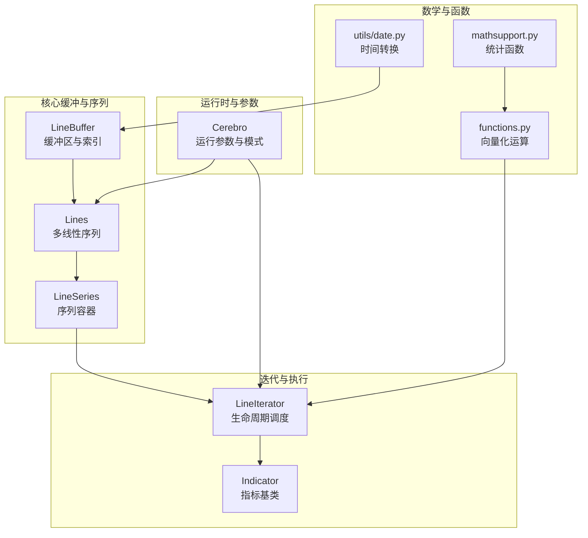
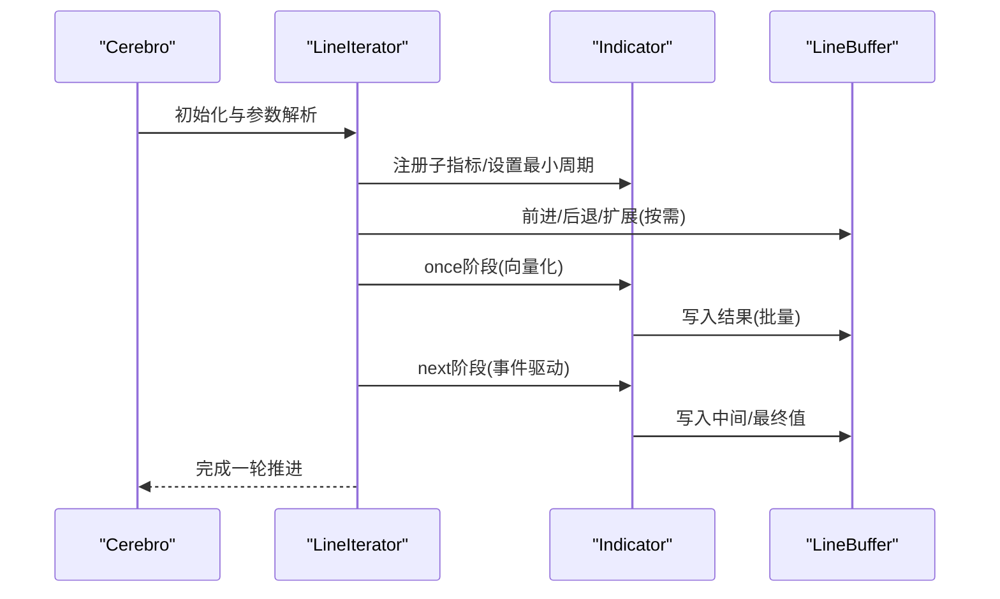
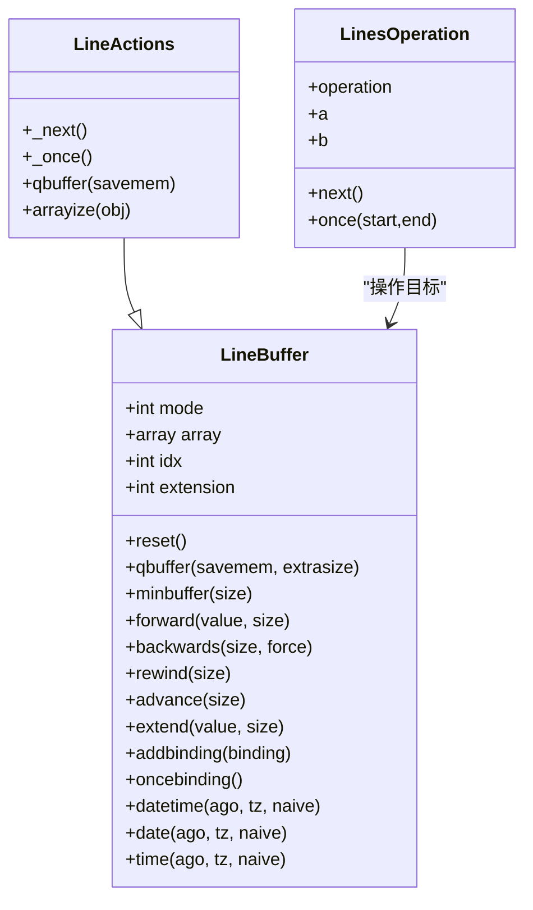
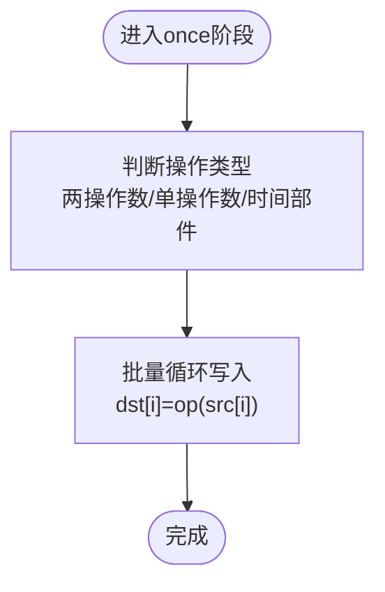
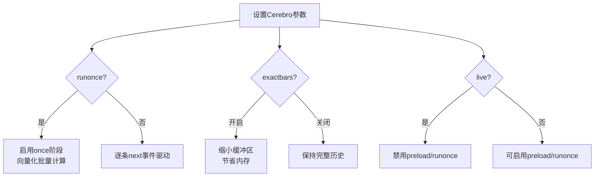
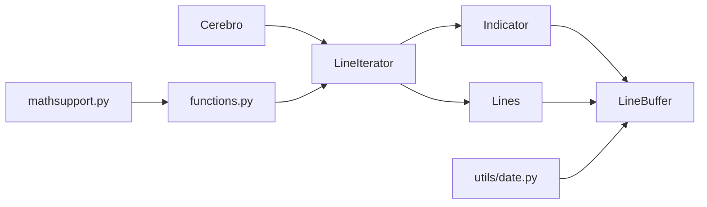

# 性能优化

<cite>
**本文引用的文件**
- [backtrader/linebuffer.py](file://backtrader/linebuffer.py)
- [backtrader/lineseries.py](file://backtrader/lineseries.py)
- [backtrader/lineiterator.py](file://backtrader/lineiterator.py)
- [backtrader/cerebro.py](file://backtrader/cerebro.py)
- [backtrader/indicator.py](file://backtrader/indicator.py)
- [backtrader/functions.py](file://backtrader/functions.py)
- [backtrader/mathsupport.py](file://backtrader/mathsupport.py)
- [backtrader/utils/date.py](file://backtrader/utils/date.py)
- [samples/memory-savings/memory-savings.py](file://samples/memory-savings/memory-savings.py)
- [samples/optimization/optimization.py](file://samples/optimization/optimization.py)
</cite>

## 目录
1. [简介](#简介)
2. [项目结构](#项目结构)
3. [核心组件](#核心组件)
4. [架构总览](#架构总览)
5. [详细组件分析](#详细组件分析)
6. [依赖关系分析](#依赖关系分析)
7. [性能考量](#性能考量)
8. [故障排查指南](#故障排查指南)
9. [结论](#结论)
10. [附录](#附录)

## 简介
本文件面向Backtrader量化回测框架的性能优化系统，围绕内存管理（LineBuffer高效实现与缓冲区策略）、向量化计算（基于内置运算与数学函数的批量处理）、多线程与并发（Cerebro运行模式与优化并行）、大数据集处理（预加载、精确内存保存、最小周期缓冲）以及性能调优工具与实证案例展开，帮助用户识别瓶颈并实施针对性优化。

## 项目结构
Backtrader的核心性能相关模块集中在以下文件：
- 数据与缓冲：linebuffer.py（LineBuffer、LineActions、操作类）
- 多线性序列容器：lineseries.py（Lines、LineSeries、元类与描述符）
- 迭代与执行调度：lineiterator.py（LineIterator、指标/观察器生命周期）
- 运行时与参数：cerebro.py（运行模式、内存节省、并行度控制）
- 指标基类与生命周期：indicator.py（MetaIndicator、Indicator）
- 数学与逻辑函数：functions.py（向量化运算、条件与聚合）
- 数学支持：mathsupport.py（均值、方差、标准差）
- 时间转换：utils/date.py（时间编码/解码）

**图表来源**
- [backtrader/linebuffer.py](file://backtrader/linebuffer.py#L50-L120)
- [backtrader/lineseries.py](file://backtrader/lineseries.py#L84-L303)
- [backtrader/lineiterator.py](file://backtrader/lineiterator.py#L148-L377)
- [backtrader/cerebro.py](file://backtrader/cerebro.py#L60-L294)
- [backtrader/indicator.py](file://backtrader/indicator.py#L90-L137)
- [backtrader/functions.py](file://backtrader/functions.py#L82-L220)
- [backtrader/mathsupport.py](file://backtrader/mathsupport.py#L27-L66)
- [backtrader/utils/date.py](file://backtrader/utils/date.py#L25-L30)

**章节来源**
- [backtrader/linebuffer.py](file://backtrader/linebuffer.py#L50-L120)
- [backtrader/lineseries.py](file://backtrader/lineseries.py#L84-L303)
- [backtrader/lineiterator.py](file://backtrader/lineiterator.py#L148-L377)
- [backtrader/cerebro.py](file://backtrader/cerebro.py#L60-L294)
- [backtrader/indicator.py](file://backtrader/indicator.py#L90-L137)
- [backtrader/functions.py](file://backtrader/functions.py#L82-L220)
- [backtrader/mathsupport.py](file://backtrader/mathsupport.py#L27-L66)
- [backtrader/utils/date.py](file://backtrader/utils/date.py#L25-L30)

## 核心组件
- LineBuffer：提供双模式缓冲（无界/队列缓冲），支持指针前进/后退、前瞻扩展、绑定传播、一次性批量写入等，是所有数值序列的底层存储与索引核心。
- Lines/LineSeries：封装多条LineBuffer，统一提供前进、后退、扩展、重置等操作，支持别名访问与元类派生。
- LineIterator/Indicator：定义“next/once”生命周期，按最小周期推进，支持子指标注册与级联执行。
- Cerebro：集中配置运行模式（runonce、preload、exactbars、live、maxcpus等），控制内存节省与并行优化。
- functions.py：提供向量化运算（除零处理、条件选择、多操作聚合、逻辑与/或/最大/最小/求和等）。
- mathsupport.py：提供统计函数（平均、方差、标准差），便于指标内部使用。
- utils/date.py：提供时间编码/解码，支撑LineBuffer的时间戳读取与比较。

**章节来源**
- [backtrader/linebuffer.py](file://backtrader/linebuffer.py#L50-L120)
- [backtrader/lineseries.py](file://backtrader/lineseries.py#L84-L303)
- [backtrader/lineiterator.py](file://backtrader/lineiterator.py#L148-L377)
- [backtrader/cerebro.py](file://backtrader/cerebro.py#L60-L294)
- [backtrader/indicator.py](file://backtrader/indicator.py#L90-L137)
- [backtrader/functions.py](file://backtrader/functions.py#L82-L220)
- [backtrader/mathsupport.py](file://backtrader/mathsupport.py#L27-L66)
- [backtrader/utils/date.py](file://backtrader/utils/date.py#L25-L30)

## 架构总览
Backtrader的性能优化以“缓冲区+迭代器+运行时参数”的组合为核心：
- 缓冲区层：LineBuffer/LineActions提供高效的数组式存储与索引，支持一次性批量写入与绑定传播，减少Python层循环开销。
- 序列层：Lines/LineSeries统一管理多条线，提供批量前进/后退/扩展，降低跨对象调用成本。
- 执行层：LineIterator/Indicator定义“once”向量化阶段与“next”事件驱动阶段，Cerebro根据参数选择运行模式。
- 数学层：functions.py与mathsupport.py提供向量化与统计函数，避免显式循环与重复计算。
- 时间层：utils/date.py提供时间编码/解码，支撑LineBuffer的时间比较与格式化。

**图表来源**
- [backtrader/cerebro.py](file://backtrader/cerebro.py#L60-L294)
- [backtrader/lineiterator.py](file://backtrader/lineiterator.py#L293-L377)
- [backtrader/indicator.py](file://backtrader/indicator.py#L90-L137)
- [backtrader/linebuffer.py](file://backtrader/linebuffer.py#L247-L298)

**章节来源**
- [backtrader/cerebro.py](file://backtrader/cerebro.py#L60-L294)
- [backtrader/lineiterator.py](file://backtrader/lineiterator.py#L293-L377)
- [backtrader/indicator.py](file://backtrader/indicator.py#L90-L137)
- [backtrader/linebuffer.py](file://backtrader/linebuffer.py#L247-L298)

## 详细组件分析

### 组件A：LineBuffer与缓冲区策略
- 双模式缓冲
  - 无界模式：使用array.array作为底层存储，适合一次性向量化写入。
  - 队列缓冲模式（QBuffer）：使用collections.deque(maxlen=...)，自动丢弃过期位置，适配重采样/回放场景。
- 指针与长度管理
  - idx指向当前索引；forward/backwards/rewind/advance移动逻辑指针；extend用于前瞻扩展。
  - buflen返回实际可持有的数据长度，考虑前瞻扩展量。
- 绑定传播
  - addbinding将多个LineBuffer绑定到同一值，一次写入同步更新多个目标，避免重复赋值。
- 一次性写入
  - oncebinding与once系列方法在“once”阶段批量写入，显著减少循环开销。
- 时间戳访问
  - 提供datetime/date/time与tm/raw时间部件访问，支持时区转换与比较。

**图表来源**
- [backtrader/linebuffer.py](file://backtrader/linebuffer.py#L50-L120)
- [backtrader/linebuffer.py](file://backtrader/linebuffer.py#L583-L634)
- [backtrader/linebuffer.py](file://backtrader/linebuffer.py#L705-L804)

**章节来源**
- [backtrader/linebuffer.py](file://backtrader/linebuffer.py#L50-L120)
- [backtrader/linebuffer.py](file://backtrader/linebuffer.py#L583-L634)
- [backtrader/linebuffer.py](file://backtrader/linebuffer.py#L705-L804)

### 组件B：向量化计算与数学函数
- 向量化运算
  - DivZeroByZero：对除零场景给出单/双默认值，支持一次性批量处理。
  - 条件与逻辑：Cmp、If、And、Or、Max、Min、Sum、Any、All等，均提供next/once实现，适合在once阶段批量执行。
- 统计函数
  - average、variance、standarddev：基于math.fsum与列表推导，兼顾精度与性能。
- 使用建议
  - 在指标中优先使用这些向量化类替代显式循环，结合Cerebro.runonce启用“once”阶段批量计算。

**图表来源**
- [backtrader/functions.py](file://backtrader/functions.py#L82-L118)
- [backtrader/functions.py](file://backtrader/functions.py#L179-L204)
- [backtrader/functions.py](file://backtrader/functions.py#L229-L258)
- [backtrader/mathsupport.py](file://backtrader/mathsupport.py#L27-L66)

**章节来源**
- [backtrader/functions.py](file://backtrader/functions.py#L82-L118)
- [backtrader/functions.py](file://backtrader/functions.py#L179-L204)
- [backtrader/functions.py](file://backtrader/functions.py#L229-L258)
- [backtrader/mathsupport.py](file://backtrader/mathsupport.py#L27-L66)

### 组件C：运行时参数与多线程/并行
- 关键参数
  - runonce：启用向量化一次性计算，关闭则逐条事件驱动。
  - preload：预加载数据，减少IO与解析开销。
  - exactbars：精确内存保存级别，影响缓冲大小与是否可绘图。
  - live：实时模式下禁用preload/runonce。
  - maxcpus：优化并行度，配合multiprocessing。
  - optdatas/optreturn：优化阶段的数据预加载与返回对象优化。
- 并发与并行
  - Cerebro内部使用multiprocessing进行优化并行，参数maxcpus控制CPU核数。
  - runonce与exactbars会影响内存占用与计算路径，需结合数据规模权衡。

**图表来源**
- [backtrader/cerebro.py](file://backtrader/cerebro.py#L60-L294)

**章节来源**
- [backtrader/cerebro.py](file://backtrader/cerebro.py#L60-L294)

### 组件D：大数据集处理最佳实践
- 数据分块与延迟加载
  - 使用exactbars=1/-1/-2控制内存占用与绘图能力，平衡性能与可视化需求。
  - preload开启可减少IO与解析成本，但会增加内存占用。
- 缓冲区策略
  - 对于重采样/回放场景，启用QBuffer并设置extrasize，确保边界行为正确。
- 时间与索引
  - 利用LineBuffer的datetime/date/time与tm系列方法，避免重复转换与比较误差。

**章节来源**
- [backtrader/linebuffer.py](file://backtrader/linebuffer.py#L121-L148)
- [backtrader/linebuffer.py](file://backtrader/linebuffer.py#L386-L497)
- [backtrader/cerebro.py](file://backtrader/cerebro.py#L121-L162)

## 依赖关系分析
- LineBuffer依赖LineIterator/Indicator的生命周期（_next/_once），通过oncebinding实现批量写入。
- Lines/LineSeries对LineBuffer进行批量操作，统一管理多条线。
- Cerebro通过参数控制运行模式，间接影响LineIterator/Indicator的执行路径。
- functions.py与mathsupport.py被指标广泛使用，提供向量化与统计能力。

**图表来源**
- [backtrader/cerebro.py](file://backtrader/cerebro.py#L60-L294)
- [backtrader/lineiterator.py](file://backtrader/lineiterator.py#L148-L377)
- [backtrader/indicator.py](file://backtrader/indicator.py#L90-L137)
- [backtrader/linebuffer.py](file://backtrader/linebuffer.py#L50-L120)
- [backtrader/lineseries.py](file://backtrader/lineseries.py#L84-L303)
- [backtrader/functions.py](file://backtrader/functions.py#L82-L220)
- [backtrader/mathsupport.py](file://backtrader/mathsupport.py#L27-L66)
- [backtrader/utils/date.py](file://backtrader/utils/date.py#L25-L30)

**章节来源**
- [backtrader/cerebro.py](file://backtrader/cerebro.py#L60-L294)
- [backtrader/lineiterator.py](file://backtrader/lineiterator.py#L148-L377)
- [backtrader/indicator.py](file://backtrader/indicator.py#L90-L137)
- [backtrader/linebuffer.py](file://backtrader/linebuffer.py#L50-L120)
- [backtrader/lineseries.py](file://backtrader/lineseries.py#L84-L303)
- [backtrader/functions.py](file://backtrader/functions.py#L82-L220)
- [backtrader/mathsupport.py](file://backtrader/mathsupport.py#L27-L66)
- [backtrader/utils/date.py](file://backtrader/utils/date.py#L25-L30)

## 性能考量
- 内存管理
  - 优先使用QBuffer与minbuffer控制缓冲上限，避免无界增长。
  - 通过addbinding减少重复写入，利用oncebinding在一次性阶段批量写入。
- 向量化计算
  - 在指标中使用DivZeroByZero、If、And/Or、Max/Min/Sum等向量化类，避免Python层循环。
  - 使用math.fsum与列表推导提高统计计算精度与速度。
- 运行模式
  - runonce=True可显著加速指标计算，但需确保指标实现支持once。
  - exactbars=1/-1/-2在内存与功能间折衷，大数据集建议开启以节省内存。
- 并行优化
  - 设置maxcpus为可用核数，结合optdatas/optreturn减少优化开销。
- 时间处理
  - 使用utils/date.py提供的num2date/time2num等，避免重复转换与精度问题。

[本节为通用指导，无需列出具体文件来源]

## 故障排查指南
- 指标未生效或结果异常
  - 检查是否满足最小周期（_minperiod），确认LineIterator的next/once路径。
  - 若使用一次性向量化，确保指标实现了once方法或通过辅助方法自动生成。
- 内存占用过高
  - 开启exactbars并调整为合适的级别；检查是否误用无界缓冲。
  - 使用memory-savings示例脚本评估各组件内存占用，定位大对象。
- 优化耗时过长
  - 启用optdatas与optreturn；合理设置maxcpus；减少不必要的指标数量。
- 时间相关错误
  - 确保使用LineBuffer的datetime/date/time接口，并正确传递时区参数。

**章节来源**
- [backtrader/lineiterator.py](file://backtrader/lineiterator.py#L293-L377)
- [backtrader/indicator.py](file://backtrader/indicator.py#L90-L137)
- [samples/memory-savings/memory-savings.py](file://samples/memory-savings/memory-savings.py#L72-L121)
- [samples/optimization/optimization.py](file://samples/optimization/optimization.py#L55-L102)

## 结论
Backtrader的性能优化体系以“高效缓冲区+向量化执行+运行时参数控制”为核心。通过合理使用LineBuffer的QBuffer与一次性写入、在指标中采用functions.py与mathsupport.py提供的向量化与统计函数、以及通过Cerebro参数在内存与速度之间取得平衡，可在保证功能完整性的同时显著提升回测效率。对于大规模数据集，建议结合exactbars、preload与并行参数进行综合优化。

[本节为总结性内容，无需列出具体文件来源]

## 附录

### 实战案例与对比分析
- 内存占用评估
  - 使用memory-savings示例脚本，输出各数据/指标/观察器的内存单元总数，定位内存热点。
  - 通过不同exactbars级别对比内存占用与运行时间，选择合适策略。
- 优化前后对比
  - 使用optimization示例脚本，记录优化开始/结束时间，统计总耗时。
  - 对比启用/禁用optdatas、optreturn、runonce等参数的差异，评估收益。
- 参数建议清单
  - 大数据集：runonce=True、preload=True、exactbars=1或-1、maxcpus=全部核数。
  - 小数据集/调试：runonce=False、preload=False、exactbars=0、开启绘图。

**章节来源**
- [samples/memory-savings/memory-savings.py](file://samples/memory-savings/memory-savings.py#L72-L121)
- [samples/optimization/optimization.py](file://samples/optimization/optimization.py#L83-L102)