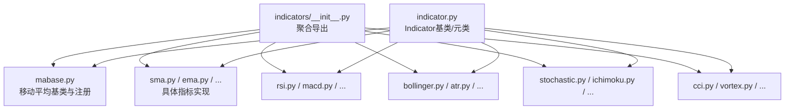
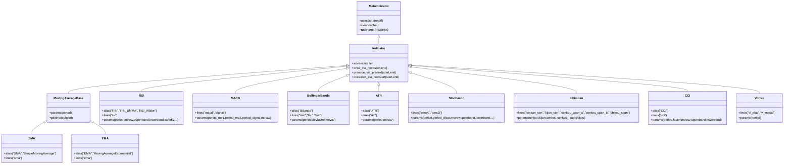
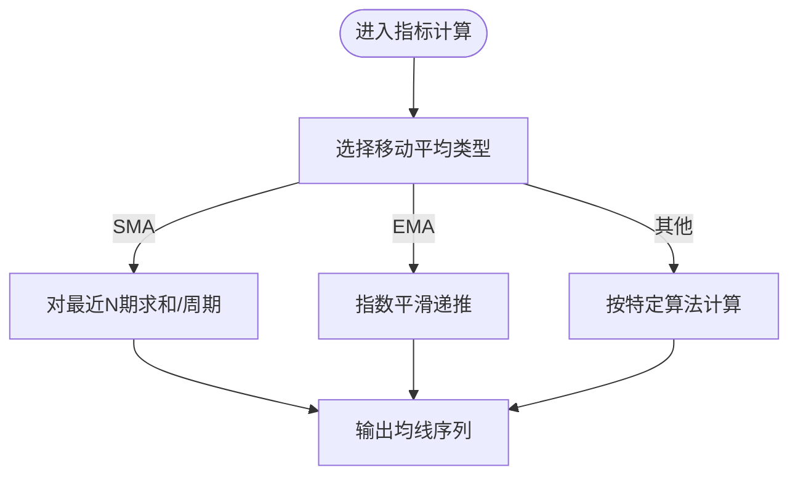
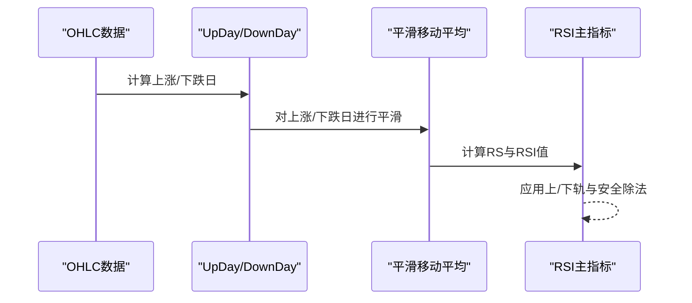
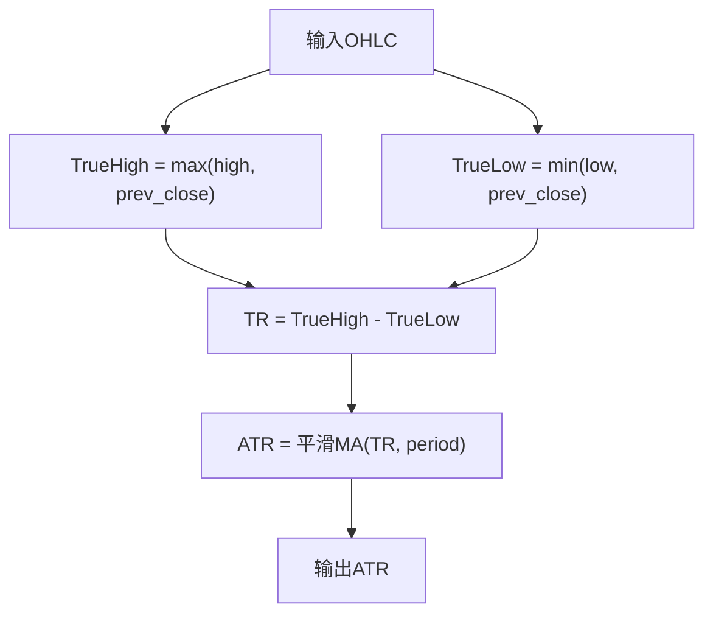
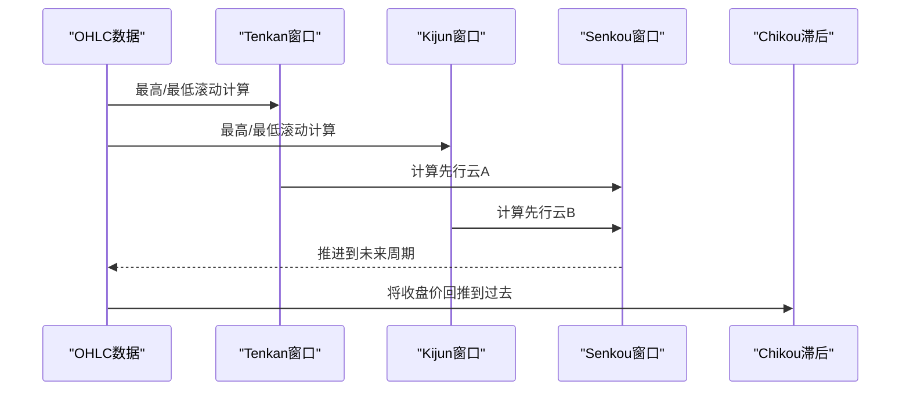
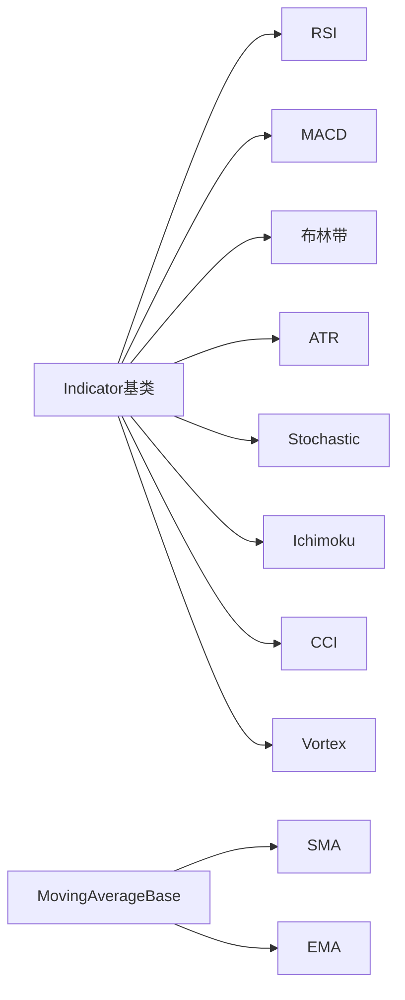

# 内置技术指标

<cite>
**本文引用的文件**
- [backtrader/indicators/__init__.py](file://backtrader/indicators/__init__.py)
- [backtrader/indicator.py](file://backtrader/indicator.py)
- [backtrader/indicators/mabase.py](file://backtrader/indicators/mabase.py)
- [backtrader/indicators/sma.py](file://backtrader/indicators/sma.py)
- [backtrader/indicators/ema.py](file://backtrader/indicators/ema.py)
- [backtrader/indicators/rsi.py](file://backtrader/indicators/rsi.py)
- [backtrader/indicators/macd.py](file://backtrader/indicators/macd.py)
- [backtrader/indicators/bollinger.py](file://backtrader/indicators/bollinger.py)
- [backtrader/indicators/atr.py](file://backtrader/indicators/atr.py)
- [backtrader/indicators/stochastic.py](file://backtrader/indicators/stochastic.py)
- [backtrader/indicators/ichimoku.py](file://backtrader/indicators/ichimoku.py)
- [backtrader/indicators/cci.py](file://backtrader/indicators/cci.py)
- [backtrader/indicators/vortex.py](file://backtrader/indicators/vortex.py)
</cite>

## 目录
1. [引言](#引言)
2. [项目结构](#项目结构)
3. [核心组件](#核心组件)
4. [架构总览](#架构总览)
5. [详细组件分析](#详细组件分析)
6. [依赖关系分析](#依赖关系分析)
7. [性能考量](#性能考量)
8. [故障排查指南](#故障排查指南)
9. [结论](#结论)
10. [附录](#附录)

## 引言
本文件面向Backtrader内置技术指标系统的使用者与研究者，系统梳理122个内置指标的分类体系与实现要点，覆盖移动平均线类（SMA、EMA、WMA等）、动量指标类（RSI、MACD、KDJ等）、波动率指标类（ATR、布林带等）、趋势指标类（Ichimoku、ADX/DMI等）与成交量指标类（OBV、Volume等）。文档以“可操作”的方式给出参数配置、使用场景、注意事项、协同策略与常见陷阱，并通过图示展示关键流程与数据流。

## 项目结构
Backtrader的指标系统位于backtrader/indicators目录，通过一个聚合入口统一导出所有指标。指标基类与元类定义在backtrader/indicator.py中，移动平均族的抽象与注册机制在backtrader/indicators/mabase.py中实现。

图表来源
- [backtrader/indicators/__init__.py](file://backtrader/indicators/__init__.py#L1-L91)
- [backtrader/indicator.py](file://backtrader/indicator.py#L1-L165)
- [backtrader/indicators/mabase.py](file://backtrader/indicators/mabase.py#L1-L92)

章节来源
- [backtrader/indicators/__init__.py](file://backtrader/indicators/__init__.py#L1-L91)
- [backtrader/indicator.py](file://backtrader/indicator.py#L1-L165)
- [backtrader/indicators/mabase.py](file://backtrader/indicators/mabase.py#L1-L92)

## 核心组件
- 指标基类与生命周期：Indicator类封装了next/once/preonce等模拟执行路径，支持不同长度数据源的推进与缓存控制。
- 元类与缓存：MetaIndicator提供对象级缓存开关与清理能力，避免重复实例化带来的minperiod信息干扰。
- 移动平均抽象：MovingAverageBase与MovAv注册机制，统一了SMA、EMA、SMMA、WMA、DEMA、KAMA、ZLEMA、HMA、ZLIND、DMA等族的构建方式，便于自动生成包络线与振荡器。

章节来源
- [backtrader/indicator.py](file://backtrader/indicator.py#L32-L137)
- [backtrader/indicators/mabase.py](file://backtrader/indicators/mabase.py#L29-L92)

## 架构总览
下图展示了指标系统的关键类关系与依赖：

图表来源
- [backtrader/indicator.py](file://backtrader/indicator.py#L32-L165)
- [backtrader/indicators/mabase.py](file://backtrader/indicators/mabase.py#L75-L92)
- [backtrader/indicators/sma.py](file://backtrader/indicators/sma.py#L27-L46)
- [backtrader/indicators/ema.py](file://backtrader/indicators/ema.py#L27-L56)
- [backtrader/indicators/rsi.py](file://backtrader/indicators/rsi.py#L122-L191)
- [backtrader/indicators/macd.py](file://backtrader/indicators/macd.py#L27-L64)
- [backtrader/indicators/bollinger.py](file://backtrader/indicators/bollinger.py#L27-L64)
- [backtrader/indicators/atr.py](file://backtrader/indicators/atr.py#L96-L122)
- [backtrader/indicators/stochastic.py](file://backtrader/indicators/stochastic.py#L27-L56)
- [backtrader/indicators/ichimoku.py](file://backtrader/indicators/ichimoku.py#L28-L86)
- [backtrader/indicators/cci.py](file://backtrader/indicators/cci.py#L27-L70)
- [backtrader/indicators/vortex.py](file://backtrader/indicators/vortex.py#L27-L54)

## 详细组件分析

### 移动平均线类（SMA、EMA、WMA、DEMA、KAMA、ZLEMA、HMA、ZLIND、DMA）
- 设计要点
  - 抽象层：MovingAverageBase定义周期参数与绘图属性；MovAv通过元类注册机制统一暴露各类移动平均。
  - 实现层：SMA直接对数据求和后除以周期；EMA采用指数平滑因子计算；其他如WMA、DEMA、KAMA、ZLEMA、HMA、ZLIND、DMA分别对应不同的权重或递推规则。
- 参数配置
  - period：平滑周期（默认值见各实现）。
  - movav：用于复合指标时的移动平均类型（如RSI的平滑平均类型可切换）。
- 使用场景
  - 趋势跟踪：EMA对近期价格更敏感；SMA稳定性较好。
  - 波段过滤：结合布林带或通道突破策略。
- 注意事项
  - 不同MA对首期缺失值的处理不同，需关注minperiod。
  - 多时间框架下，需确保数据推进步调一致。

图表来源
- [backtrader/indicators/mabase.py](file://backtrader/indicators/mabase.py#L75-L92)
- [backtrader/indicators/sma.py](file://backtrader/indicators/sma.py#L27-L46)
- [backtrader/indicators/ema.py](file://backtrader/indicators/ema.py#L27-L56)

章节来源
- [backtrader/indicators/mabase.py](file://backtrader/indicators/mabase.py#L29-L92)
- [backtrader/indicators/sma.py](file://backtrader/indicators/sma.py#L27-L46)
- [backtrader/indicators/ema.py](file://backtrader/indicators/ema.py#L27-L56)

### 动量指标类（RSI、MACD、KDJ、ROC、Momentum、TSI、UO、KST、LRSI、RMI、AwesomeOsc、ACCDEC、PGO、PriceOsc、PPO、PPOShort、Trix、WilliamsAD、WillamsR）
- RSI（相对强弱指数）
  - 组成：UpDay/DownDay子指标，配合平滑移动平均（默认Smoothed）。
  - 参数：period、movav、upperband、lowerband、safediv、safehigh、safelow、lookback。
  - 使用：超买超卖阈值结合趋势确认；safediv可避免0/0与x/0异常。
- MACD（异同移动平均线）
  - 组成：短/长EMA差值与信号线（可选柱状图）。
  - 参数：period_me1、period_me2、period_signal、movav。
  - 使用：金叉死叉与背离；柱状图用于强度判断。
- KDJ（随机指标）
  - 组成：最高/最低滚动窗口、K/D两条线（快线/慢线/全量）。
  - 参数：period、period_dfast、period_dslow、movav、upperband、lowerband、safediv、safezero。
  - 使用：短期震荡与超买超卖；与布林带结合提高准确度。
- 其他动量指标
  - ROC、Momentum、TSI、UO、KST、LRSI、RMI、AwesomeOsc、ACCDEC、PGO、PriceOsc、PPO、PPOShort、Trix、WilliamsAD、WillamsR等均通过继承Indicator实现，参数多围绕周期、平滑方式与阈值设定。

图表来源
- [backtrader/indicators/rsi.py](file://backtrader/indicators/rsi.py#L28-L191)

章节来源
- [backtrader/indicators/rsi.py](file://backtrader/indicators/rsi.py#L28-L233)
- [backtrader/indicators/macd.py](file://backtrader/indicators/macd.py#L27-L85)
- [backtrader/indicators/stochastic.py](file://backtrader/indicators/stochastic.py#L27-L149)

### 波动率指标类（ATR、Bollinger Bands、Keltner Channels、Donchian Channels、StdDev、ATR/ATR%）
- ATR（平均真实波幅）
  - 组成：TrueHigh、TrueLow、TR（真实波幅），再经平滑移动平均得到ATR。
  - 参数：period、movav。
  - 使用：动态止损/止盈；与ATR%结合衡量突破强度。
- 布林带（Bollinger Bands）
  - 组成：中轨（MA）、上下轨（中轨±devfactor×StdDev）。
  - 参数：period、devfactor、movav。
  - 扩展：BollingerBandsPct显示价格偏离百分比。

图表来源
- [backtrader/indicators/atr.py](file://backtrader/indicators/atr.py#L27-L122)
- [backtrader/indicators/bollinger.py](file://backtrader/indicators/bollinger.py#L27-L77)

章节来源
- [backtrader/indicators/atr.py](file://backtrader/indicators/atr.py#L27-L123)
- [backtrader/indicators/bollinger.py](file://backtrader/indicators/bollinger.py#L27-L77)

### 趋势指标类（Ichimoku、ADX/DMI、PSAR、Vortex、Parabolic SAR）
- Ichimoku（一目均衡表）
  - 组成：tenkan_sen（短期）、kijun_sen（中期）、senkou_span_a/b（先行云）、chikou_span（滞后确认）。
  - 参数：tenkan、kijun、senkou、senkou_lead、chikou。
  - 使用：多轨道共振与云层穿越作为趋势信号。
- Vortex（动向指标）
  - 组成：+VI与-VI两条线，反映上升/下降趋势强度。
  - 参数：period。
  - 使用：趋势确认与震荡识别。

图表来源
- [backtrader/indicators/ichimoku.py](file://backtrader/indicators/ichimoku.py#L67-L86)
- [backtrader/indicators/vortex.py](file://backtrader/indicators/vortex.py#L39-L54)

章节来源
- [backtrader/indicators/ichimoku.py](file://backtrader/indicators/ichimoku.py#L28-L87)
- [backtrader/indicators/vortex.py](file://backtrader/indicators/vortex.py#L27-L54)

### 成交量指标类（OBV、Volume、OBV带、Volume Ratio、Volume Profile）
- OBV（能量潮）
  - 定义：以成交量累积反映资金流向，当日涨跌决定加减量。
  - 使用：与价格背离提示反转；可叠加移动平均观察趋势。
- Volume
  - 表示交易量序列，常与价格配合分析突破有效性。
- OBV与Volume的协同
  - 放量上涨/缩量下跌增强趋势可信度；放量滞胀可能预示回调。

（注：本节为概念性说明，未直接分析具体代码文件）

### 其他重要指标（CCI、ROC、Momentum、TSI、UO、KST、LRSI、RMI、AwesomeOsc、ACCDEC、PGO、PriceOsc、PPO、PPOShort、Trix、WilliamsAD、WillamsR）
- CCI（商品通道指数）
  - 组成：典型价格、均值偏差与平均绝对偏差，再乘以系数。
  - 参数：period、factor、movav、upperband、lowerband。
  - 使用：极端值与零轴交叉作为买卖信号。
- ROC、Momentum、TSI、UO、KST、LRSI、RMI、AwesomeOsc、ACCDEC、PGO、PriceOsc、PPO、PPOShort、Trix、WilliamsAD、WillamsR等
  - 均通过Indicator实现，参数围绕周期、平滑与阈值设置，适合与趋势/波动指标组合使用。

章节来源
- [backtrader/indicators/cci.py](file://backtrader/indicators/cci.py#L27-L71)

## 依赖关系分析
- 指标间依赖
  - RSI依赖UpDay/DownDay与平滑移动平均；MACD依赖EMA；布林带依赖MA与StdDev；ATR依赖TR；Stochastic依赖Highest/Lowest与MA；Ichimoku依赖Highest/Lowest。
- 基类依赖
  - 所有指标继承Indicator，受MetaIndicator元类管理；移动平均族由MovingAverageBase与MovAv注册机制统一。
- 导入聚合
  - backtrader/indicators/__init__.py集中导入各模块，形成统一API。

图表来源
- [backtrader/indicator.py](file://backtrader/indicator.py#L90-L165)
- [backtrader/indicators/mabase.py](file://backtrader/indicators/mabase.py#L89-L92)
- [backtrader/indicators/rsi.py](file://backtrader/indicators/rsi.py#L122-L191)
- [backtrader/indicators/macd.py](file://backtrader/indicators/macd.py#L27-L64)
- [backtrader/indicators/bollinger.py](file://backtrader/indicators/bollinger.py#L27-L64)
- [backtrader/indicators/atr.py](file://backtrader/indicators/atr.py#L96-L122)
- [backtrader/indicators/stochastic.py](file://backtrader/indicators/stochastic.py#L27-L56)
- [backtrader/indicators/ichimoku.py](file://backtrader/indicators/ichimoku.py#L28-L86)
- [backtrader/indicators/cci.py](file://backtrader/indicators/cci.py#L27-L70)
- [backtrader/indicators/vortex.py](file://backtrader/indicators/vortex.py#L27-L54)

章节来源
- [backtrader/indicators/__init__.py](file://backtrader/indicators/__init__.py#L24-L91)
- [backtrader/indicator.py](file://backtrader/indicator.py#L32-L137)
- [backtrader/indicators/mabase.py](file://backtrader/indicators/mabase.py#L75-L92)

## 性能考量
- 缓存与复用
  - 可通过MetaIndicator.usecache开启对象缓存，减少重复实例化开销；必要时调用cleancache清理。
- 计算复杂度
  - 移动平均类多为O(N)滚动计算；含Highest/Lowest/StdDev的指标在大周期下成本较高，建议合理设置period。
- 数据推进
  - Indicator.advance保证多时间框架/不同长度数据源同步推进，避免越界访问。
- 绘图与输出
  - 合理使用plotinfo/plotlines减少冗余线条绘制，提升可视化性能。

章节来源
- [backtrader/indicator.py](file://backtrader/indicator.py#L39-L66)
- [backtrader/indicator.py](file://backtrader/indicator.py#L95-L137)

## 故障排查指南
- 除零与边界问题
  - RSI的safediv与safehigh/safelow；Stochastic的safediv与safezero；DivZeroByZero/DivByZero辅助处理。
- 首期缺失值
  - 关注minperiod，确保足够历史期后再做信号判定。
- 参数漂移
  - 在优化中固定关键参数（如lookback、period），避免过拟合。
- 多数据源不齐步
  - 确保advance调用顺序正确，避免跨数据源错位。

章节来源
- [backtrader/indicators/rsi.py](file://backtrader/indicators/rsi.py#L144-L199)
- [backtrader/indicators/stochastic.py](file://backtrader/indicators/stochastic.py#L49-L53)
- [backtrader/indicator.py](file://backtrader/indicator.py#L101-L137)

## 结论
Backtrader内置指标体系以统一的Indicator基类与元类为核心，辅以移动平均族的抽象与注册机制，实现了高度模块化与可扩展的指标生态。通过合理的参数配置、组合策略与缓存机制，可在多市场环境下稳定运行。建议优先从SMA/EMA、RSI、MACD、ATR、布林带与Ichimoku入手，逐步引入其他指标，结合实盘回测验证参数与信号质量。

## 附录
- 分类速览（按主题）
  - 移动平均线类：SMA、EMA、SMMA、WMA、DEMA、KAMA、ZLEMA、HMA、ZLIND、DMA
  - 动量指标类：RSI、MACD、KDJ、ROC、Momentum、TSI、UO、KST、LRSI、RMI、AwesomeOsc、ACCDEC、PGO、PriceOsc、PPO、PPOShort、Trix、WilliamsAD、WillamsR
  - 波动率指标类：ATR、Bollinger Bands、Keltner Channels、Donchian Channels、StdDev、ATR%
  - 趋势指标类：Ichimoku、ADX/DMI、PSAR、Vortex、Parabolic SAR
  - 成交量指标类：OBV、Volume、OBV带、Volume Ratio、Volume Profile
- 使用建议
  - 单一指标不应孤立使用，应与趋势、波动、成交量等多维度指标协同。
  - 参数调优应分阶段进行：先确定周期范围，再微调阈值与平滑方式。
  - 注意不同市场的参数差异，必要时按品种/周期单独优化。