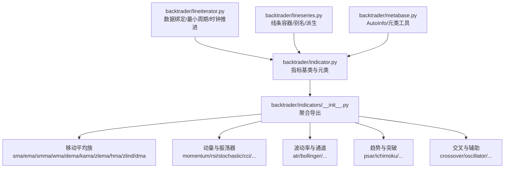
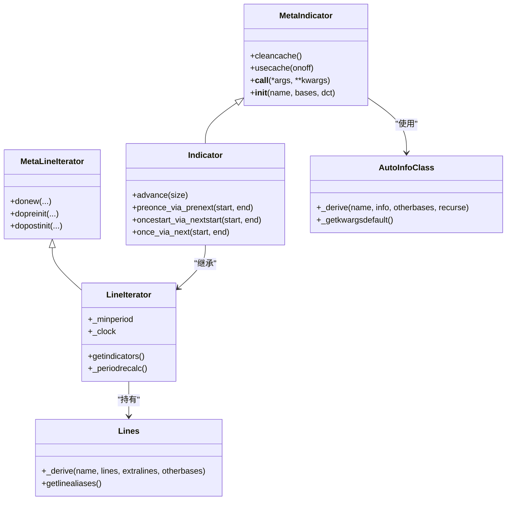
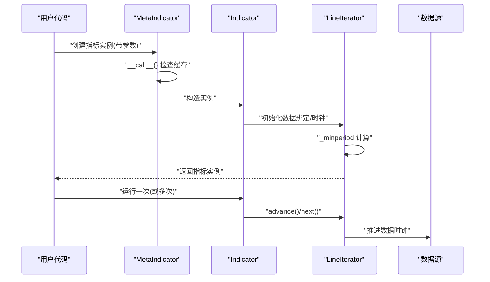
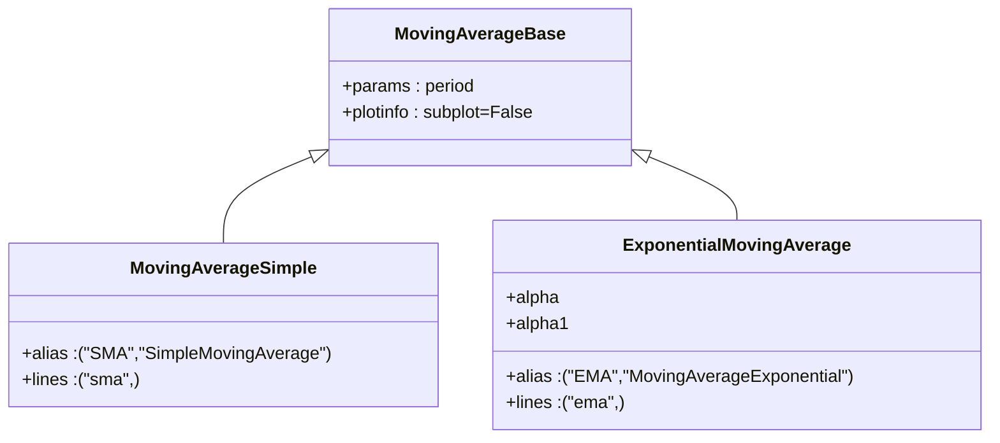
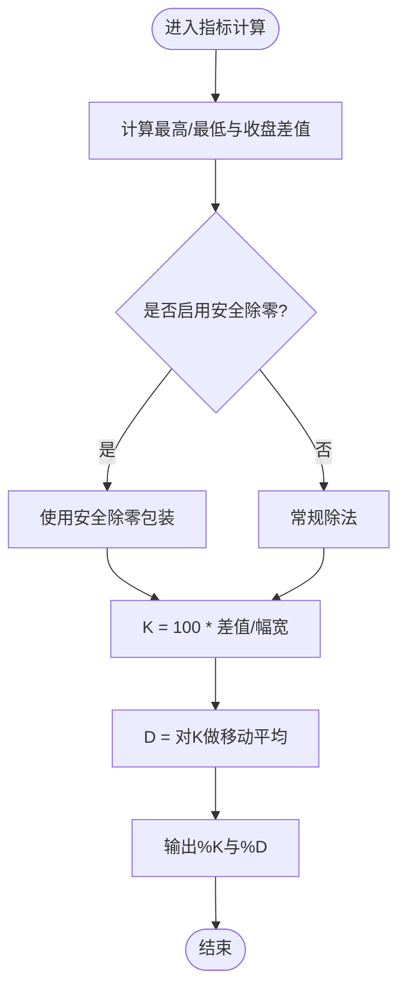
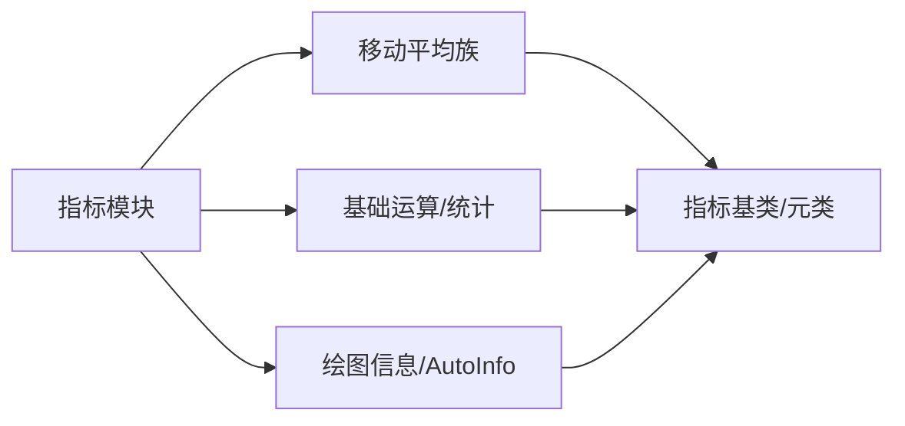

# 技术分析指标

<cite>
**本文引用的文件**
- [backtrader/indicator.py](file://backtrader/indicator.py)
- [backtrader/lineiterator.py](file://backtrader/lineiterator.py)
- [backtrader/lineseries.py](file://backtrader/lineseries.py)
- [backtrader/metabase.py](file://backtrader/metabase.py)
- [backtrader/indicators/__init__.py](file://backtrader/indicators/__init__.py)
- [backtrader/indicators/mabase.py](file://backtrader/indicators/mabase.py)
- [backtrader/indicators/sma.py](file://backtrader/indicators/sma.py)
- [backtrader/indicators/ema.py](file://backtrader/indicators/ema.py)
- [backtrader/indicators/macd.py](file://backtrader/indicators/macd.py)
- [backtrader/indicators/rsi.py](file://backtrader/indicators/rsi.py)
- [backtrader/indicators/stochastic.py](file://backtrader/indicators/stochastic.py)
- [backtrader/indicators/bollinger.py](file://backtrader/indicators/bollinger.py)
- [backtrader/__init__.py](file://backtrader/__init__.py)
</cite>

## 目录
1. [简介](#简介)
2. [项目结构](#项目结构)
3. [核心组件](#核心组件)
4. [架构总览](#架构总览)
5. [详细组件分析](#详细组件分析)
6. [依赖分析](#依赖分析)
7. [性能考虑](#性能考虑)
8. [故障排查指南](#故障排查指南)
9. [结论](#结论)
10. [附录](#附录)

## 简介
本文件面向Backtrader的技术分析指标体系，系统性梳理其指标基类设计、缓存与性能优化、指标组合策略与参数调优方法，并对122个内置指标进行分类与使用要点说明。Backtrader通过统一的指标基类与元类机制，实现指标的自动注册、参数派生、绘图标签生成与最小周期计算；同时提供丰富的移动平均、动量、波动率、趋势、震荡类指标，便于构建多因子策略。

## 项目结构
Backtrader将指标按功能域组织在独立模块中，通过顶层聚合导出，形成“按类别导入”的清晰结构。指标模块位于 backtrader/indicators/ 下，包含基础移动平均、动量、波动率、趋势、震荡、通道等子模块；顶层 backtrader/indicators/__init__.py 负责集中导出所有指标，便于用户直接从 backtrader.indicators 导入。

图表来源
- [backtrader/indicators/__init__.py](file://backtrader/indicators/__init__.py#L30-L91)
- [backtrader/indicator.py](file://backtrader/indicator.py#L90-L165)
- [backtrader/lineiterator.py](file://backtrader/lineiterator.py#L148-L200)
- [backtrader/lineseries.py](file://backtrader/lineseries.py#L84-L195)
- [backtrader/metabase.py](file://backtrader/metabase.py#L93-L200)

章节来源
- [backtrader/indicators/__init__.py](file://backtrader/indicators/__init__.py#L24-L91)
- [backtrader/__init__.py](file://backtrader/__init__.py#L69-L91)

## 核心组件
- 指标基类与元类
  - 指标类通过元类实现对象缓存、最小周期传播、绘图标签派生与注册表登记。元类支持在未显式覆盖某些生命周期方法时，自动切换到对应的“next模式”模拟路径，保证运行一致性。
  - 关键点：缓存开关、最小周期计算、时钟推进、绘图信息派生。
- 行迭代器与数据绑定
  - 行迭代器负责扫描传入的数据源，建立“主时钟”（第一个数据源），并据此计算指标的最小启动周期，确保在所有输入数据可用后再开始计算。
- 线条容器与别名
  - 线条容器支持动态派生新的线条集合，提供按名称访问的别名描述符，简化对多条输出线的引用。
- 自动信息派生
  - AutoInfo 支持参数与绘图信息的层次化派生，避免重复定义，提升可维护性。

章节来源
- [backtrader/indicator.py](file://backtrader/indicator.py#L32-L165)
- [backtrader/lineiterator.py](file://backtrader/lineiterator.py#L38-L146)
- [backtrader/lineseries.py](file://backtrader/lineseries.py#L84-L195)
- [backtrader/metabase.py](file://backtrader/metabase.py#L93-L200)

## 架构总览
Backtrader指标系统采用“元类驱动 + 数据时钟 + 最小周期传播”的架构。指标类通过元类在构造阶段完成数据绑定、最小周期计算与注册；运行阶段由主时钟推进，逐根Bar触发计算；线条容器提供多输出线的统一管理；AutoInfo负责参数与绘图信息的自动派生。

图表来源
- [backtrader/indicator.py](file://backtrader/indicator.py#L32-L165)
- [backtrader/lineiterator.py](file://backtrader/lineiterator.py#L38-L146)
- [backtrader/lineseries.py](file://backtrader/lineseries.py#L84-L195)
- [backtrader/metabase.py](file://backtrader/metabase.py#L93-L200)

## 详细组件分析

### 指标基类与元类设计
- 元类缓存与对象复用
  - 提供缓存开关与清理接口，避免重复实例化相同参数的指标对象，降低内存与初始化开销。
- 生命周期与运行模式
  - 当仅重写 next 时，自动注入 once 模拟路径，保证 preonce/oncestart 的一致性。
- 绘图标签与参数派生
  - 通过 _plotlabel/_plotinit 等钩子，结合 AutoInfo 的派生能力，自动生成绘图标签与水平线标注。

图表来源
- [backtrader/indicator.py](file://backtrader/indicator.py#L51-L137)
- [backtrader/lineiterator.py](file://backtrader/lineiterator.py#L106-L146)

章节来源
- [backtrader/indicator.py](file://backtrader/indicator.py#L32-L165)

### 移动平均类族
- 基础与别名
  - 通过 MovAv 占位类与元类注册，统一暴露 SMA/EMA/SMMA/WMA/DEMA/KAMA/ZLEMA/HMA/ZLIND/DMA 等族系，支持短名与全名访问。
- 简单移动平均(SMA)
  - 非加权平均，公式为最近N期价格和除以N。
- 指数移动平均(EMA)
  - 按平滑系数指数衰减，强调近期权重。

图表来源
- [backtrader/indicators/mabase.py](file://backtrader/indicators/mabase.py#L89-L92)
- [backtrader/indicators/sma.py](file://backtrader/indicators/sma.py#L27-L46)
- [backtrader/indicators/ema.py](file://backtrader/indicators/ema.py#L27-L56)

章节来源
- [backtrader/indicators/mabase.py](file://backtrader/indicators/mabase.py#L29-L92)
- [backtrader/indicators/sma.py](file://backtrader/indicators/sma.py#L27-L46)
- [backtrader/indicators/ema.py](file://backtrader/indicators/ema.py#L27-L56)

### 动量与振荡器
- MACD
  - 由短期与长期均线差值构成MACD线，再对MACD线做信号均线得到信号线；可选直方图。
- RSI
  - 威廉指标，通过“上涨/下跌日”平滑后求比值得RS，再映射到0-100区间；支持安全除零处理。
- 随机指标
  - Fast/Slow/Full三版本，基于最高最低与收盘价的相对位置，配合移动平均形成K/D线。

图表来源
- [backtrader/indicators/stochastic.py](file://backtrader/indicators/stochastic.py#L44-L56)

章节来源
- [backtrader/indicators/macd.py](file://backtrader/indicators/macd.py#L27-L85)
- [backtrader/indicators/rsi.py](file://backtrader/indicators/rsi.py#L122-L192)
- [backtrader/indicators/stochastic.py](file://backtrader/indicators/stochastic.py#L27-L149)

### 波动率与通道
- 布林带
  - 中轨为均线，上下轨为中轨±标准差×倍数；可扩展输出%b。
- ATR
  - 平均真实波幅，衡量波动强度，常用于止损与资金管理。

章节来源
- [backtrader/indicators/bollinger.py](file://backtrader/indicators/bollinger.py#L27-L77)

### 趋势与突破
- PSAR
  - 抛物线转向系统，用于判断趋势反转与跟踪止损。
- 一目均衡表(ICHIMOKU)
  - 多轨道指标，包含转换线、基准线、基准延后、上/下轨，用于趋势方向与支撑阻力判断。

章节来源
- [backtrader/indicators/macd.py](file://backtrader/indicators/macd.py#L27-L85)

### 交叉与辅助
- 交叉(Crossover)
  - 两条线的向上/向下交叉，常用于产生买卖信号。
- 振荡器(Oscillator)
  - 通用振荡器基类，便于派生具体振荡器。

章节来源
- [backtrader/indicators/__init__.py](file://backtrader/indicators/__init__.py#L55-L56)

## 依赖分析
- 指标导入聚合
  - 顶层 backtrader/indicators/__init__.py 将各功能域指标模块集中导出，形成统一入口。
- 指标间依赖
  - 多数指标依赖移动平均族与基础运算（如 Highest/Lowest/StdDev/DivZero 等）；部分指标（如 MACD）内部再组合其他指标（如 EMA）。
- 运行时依赖
  - 指标运行依赖 LineIterator 的数据绑定与时钟推进，以及最小周期传播机制。

图表来源
- [backtrader/indicators/__init__.py](file://backtrader/indicators/__init__.py#L30-L91)
- [backtrader/indicator.py](file://backtrader/indicator.py#L90-L165)
- [backtrader/metabase.py](file://backtrader/metabase.py#L93-L200)

章节来源
- [backtrader/indicators/__init__.py](file://backtrader/indicators/__init__.py#L24-L91)

## 性能考虑
- 缓存机制
  - 通过元类缓存避免重复实例化相同参数的指标，减少对象创建与初始化成本；可通过清理接口重置缓存。
- 最小周期传播
  - 指标最小启动周期由输入数据与内部子指标共同决定，确保在数据可用前不进行无意义计算。
- 数据推进与批处理
  - 通过主时钟推进与批量计算路径，减少不必要的状态检查与分支判断。
- 线条派生与别名
  - 使用线条派生与别名访问，避免重复索引查找，提升读取效率。

章节来源
- [backtrader/indicator.py](file://backtrader/indicator.py#L39-L65)
- [backtrader/lineiterator.py](file://backtrader/lineiterator.py#L116-L139)
- [backtrader/lineseries.py](file://backtrader/lineseries.py#L196-L200)

## 故障排查指南
- 指标未显示或数值异常
  - 检查最小周期是否满足：确认输入数据长度与指标参数是否足够；必要时调整参数或延长回测数据。
- 绘图标签缺失或错误
  - 检查 _plotlabel/_plotinit 是否被正确覆盖；确认 AutoInfo 的派生链路是否完整。
- 多次实例化导致内存占用高
  - 启用元类缓存并避免频繁改变参数；必要时调用缓存清理接口。
- 交叉/振荡器结果不稳定
  - 检查输入数据对齐与时钟推进路径；确认是否使用了安全除零或边界保护。

章节来源
- [backtrader/indicator.py](file://backtrader/indicator.py#L39-L65)
- [backtrader/lineiterator.py](file://backtrader/lineiterator.py#L116-L139)
- [backtrader/indicators/stochastic.py](file://backtrader/indicators/stochastic.py#L49-L53)

## 结论
Backtrader的指标系统以统一的基类与元类为核心，结合数据时钟、最小周期传播与线条容器，实现了高内聚、低耦合的指标生态。通过 AutoInfo 的参数与绘图信息派生，大幅降低了重复定义成本；通过缓存与批处理路径，兼顾了易用性与性能。建议在策略开发中优先使用内置指标族，遵循参数与周期的匹配原则，并善用指标组合与交叉信号，以提升策略稳定性与泛化能力。

## 附录
- 内置指标概览（按类别）
  - 移动平均类：SMA、EMA、SMMA、WMA、DEMA、KAMA、ZLEMA、HMA、ZLIND、DMA
  - 动量与振荡器：MACD、MACD Histogram、RSI、随机指标（Fast/Slow/Full）、CCI、ROC、TSI、KST、ROC
  - 波动率与通道：ATR、布林带（含%B）
  - 趋势与突破：PSAR、一目均衡表（Ichimoku）
  - 辅助与交叉：Crossover、Oscillator、Envelope、Price Oscillator、Ultimate Oscillator、Williams %R、Vortex、Acc/Dcc Oscillator、Pretty Good Oscillator、DPO、DMI/DM、Trix、LRSI、Hurst、OLS、HA（Heikin-Ashi）
- 开发自定义指标步骤
  - 继承 Indicator 或更具体的基类（如 MovingAverageBase）
  - 定义 lines 与 params，必要时覆盖 plotinfo/plotlines
  - 在 __init__ 中组合已有指标或基础运算，赋值给 self.lines[n]
  - 如需自动注册或派生，参考 AutoInfo 与元类行为
- 指标组合与参数调优建议
  - 趋势+震荡：如 EMA+RSI 或 MACD+布林带，注意参数互补（周期、平滑）
  - 安全性：启用安全除零与边界保护，避免极端行情下的异常
  - 回测验证：先在历史数据上验证信号质量，再逐步放宽参数范围