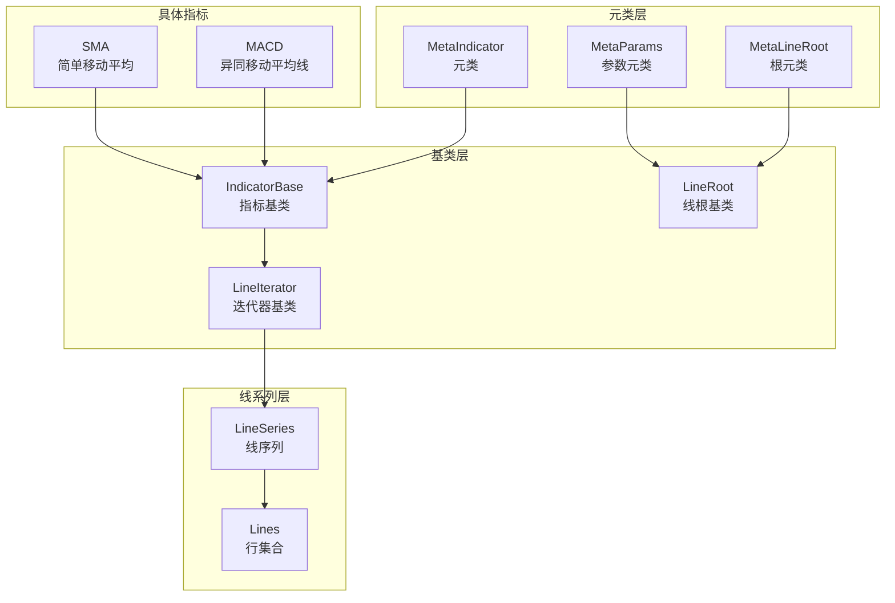
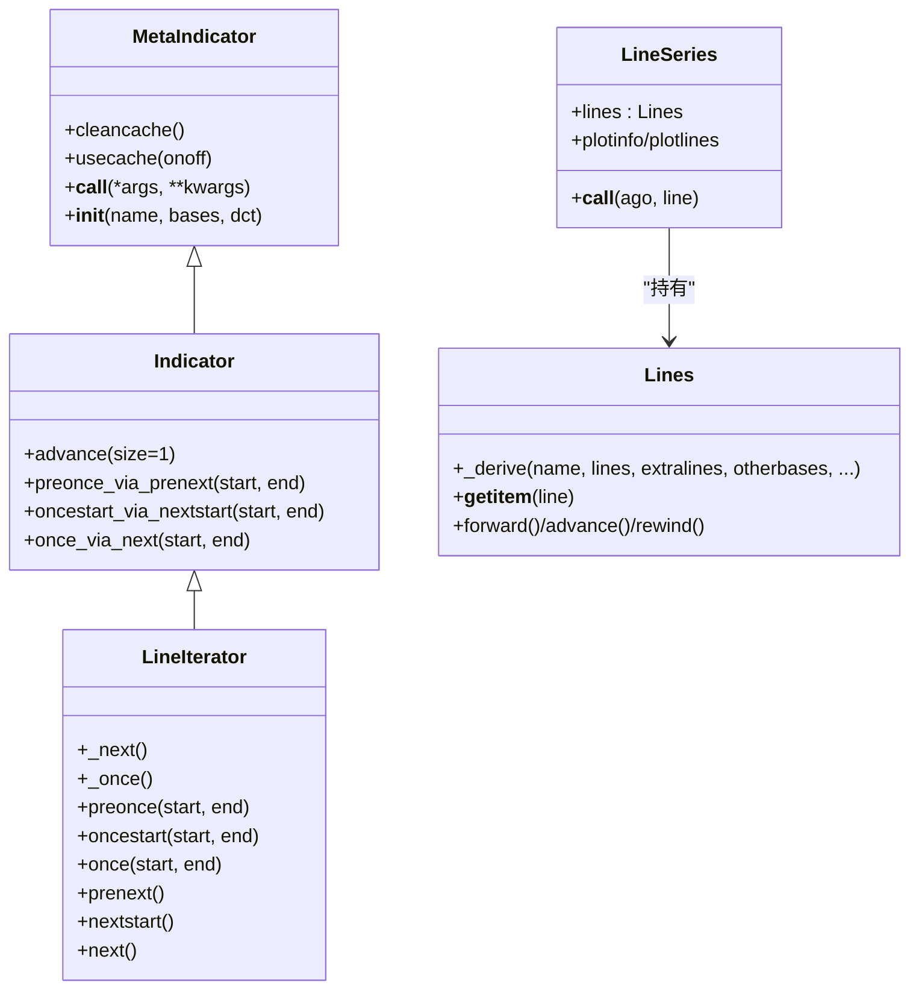
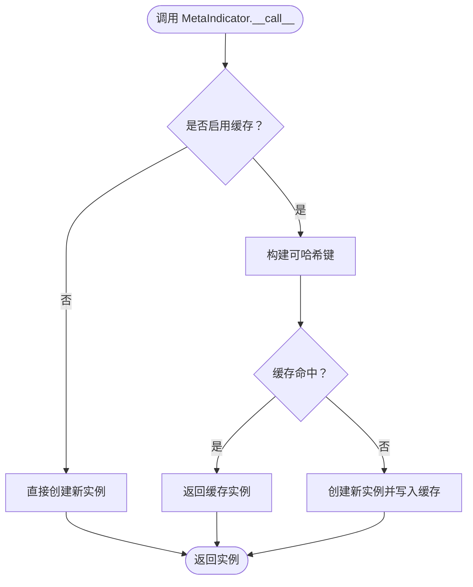
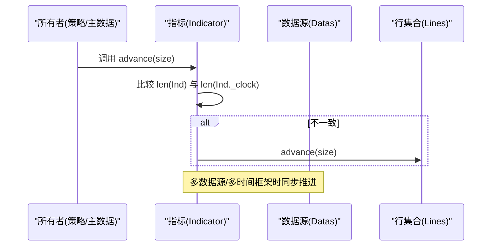
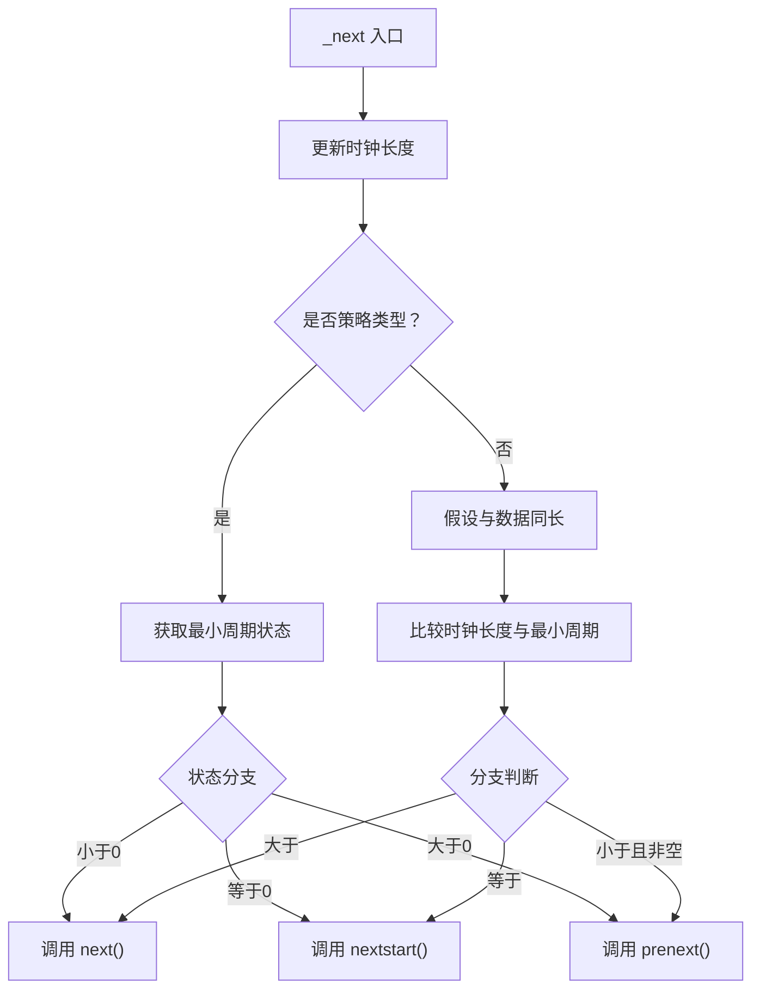
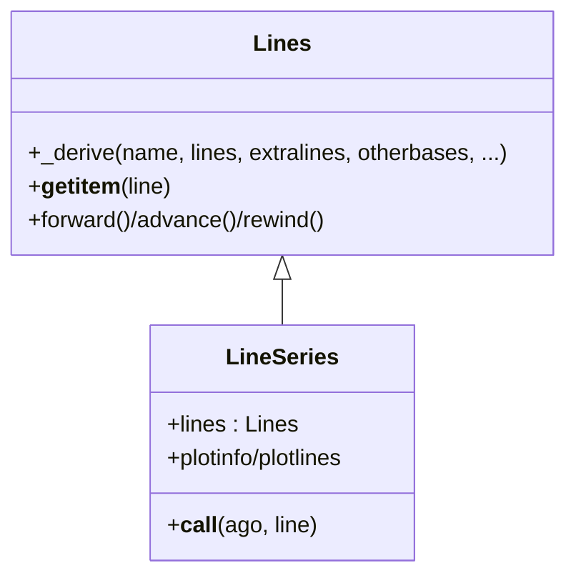
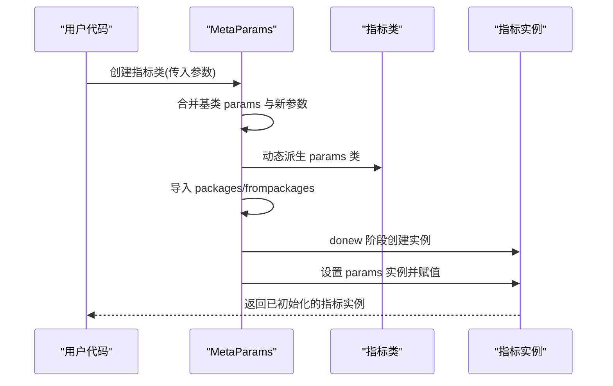
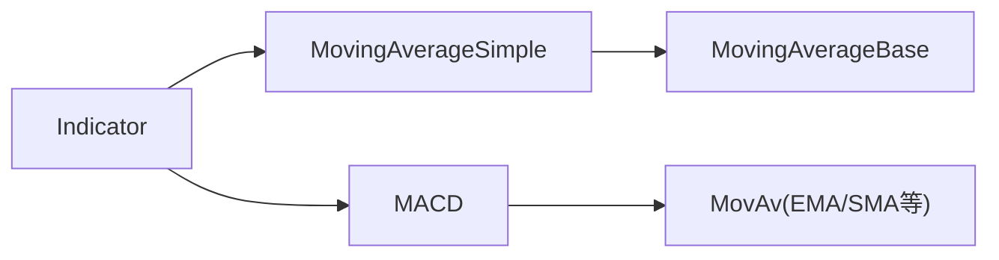
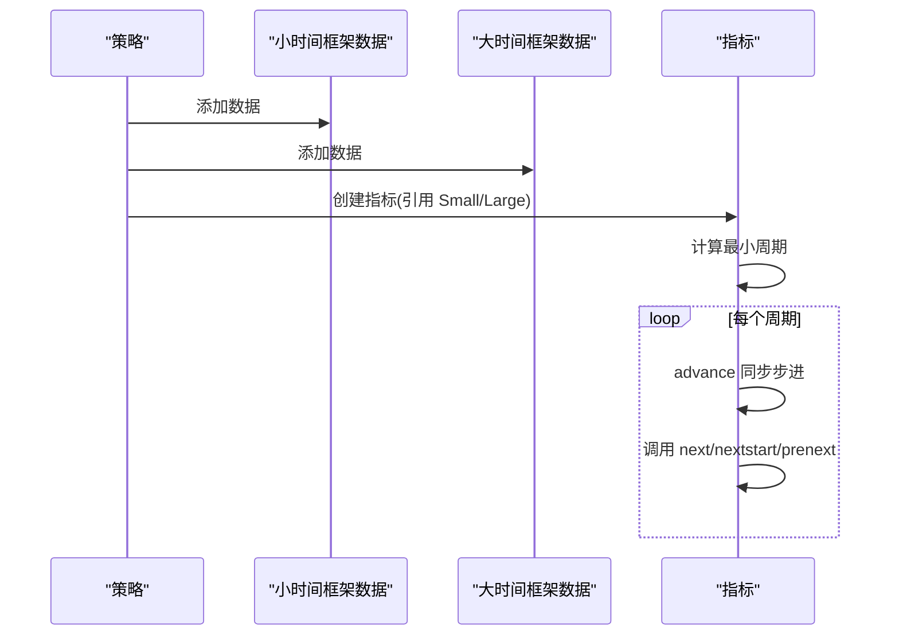
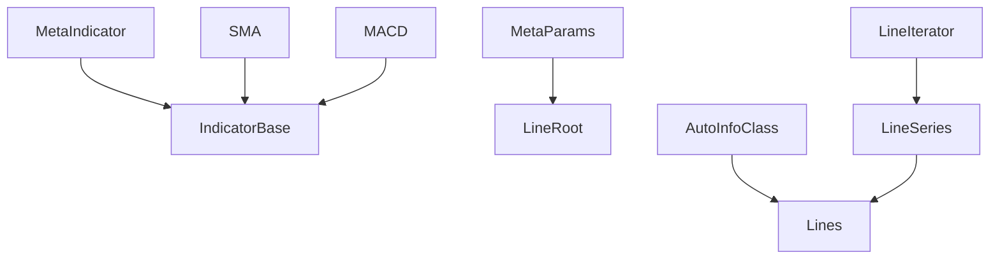

# 指标基类架构

<cite>
**本文档引用的文件**
- [backtrader/indicator.py](file://backtrader/indicator.py)
- [backtrader/lineiterator.py](file://backtrader/lineiterator.py)
- [backtrader/lineseries.py](file://backtrader/lineseries.py)
- [backtrader/lineroot.py](file://backtrader/lineroot.py)
- [backtrader/metabase.py](file://backtrader/metabase.py)
- [backtrader/linebuffer.py](file://backtrader/linebuffer.py)
- [backtrader/indicators/__init__.py](file://backtrader/indicators/__init__.py)
- [backtrader/indicators/sma.py](file://backtrader/indicators/sma.py)
- [backtrader/indicators/macd.py](file://backtrader/indicators/macd.py)
- [samples/data-multitimeframe/data-multitimeframe.py](file://samples/data-multitimeframe/data-multitimeframe.py)
- [tests/test_ind_sma.py](file://tests/test_ind_sma.py)
</cite>

## 目录
1. [引言](#引言)
2. [项目结构](#项目结构)
3. [核心组件](#核心组件)
4. [架构总览](#架构总览)
5. [详细组件分析](#详细组件分析)
6. [依赖关系分析](#依赖关系分析)
7. [性能考虑](#性能考虑)
8. [故障排除指南](#故障排除指南)
9. [结论](#结论)
10. [附录](#附录)

## 引言
本文件系统性梳理 Backtrader 指标基类架构，重点围绕 Indicator 基类及其元类 MetaIndicator 的设计理念与实现细节展开，深入解析以下主题：
- 元类 MetaIndicator 的工作机制与缓存策略
- 指标的生命周期管理（初始化、计算、更新、清理）
- 指标与数据流的交互机制（多数据源、多时间框架）
- 指标的继承体系与扩展机制（自定义指标开发流程）
- 参数配置、计算逻辑与输出格式的最佳实践

## 项目结构
Backtrader 的指标体系由多个层次组成：元类层（MetaIndicator）、基类层（IndicatorBase/LineIterator）、线系列层（Lines/LinesSeries）以及具体指标实现。下图展示了关键模块之间的关系：

**图表来源**
- [backtrader/indicator.py](file://backtrader/indicator.py#L32-L90)
- [backtrader/lineiterator.py](file://backtrader/lineiterator.py#L148-L198)
- [backtrader/lineseries.py](file://backtrader/lineseries.py#L444-L478)
- [backtrader/indicators/sma.py](file://backtrader/indicators/sma.py#L27-L46)
- [backtrader/indicators/macd.py](file://backtrader/indicators/macd.py#L27-L64)

**章节来源**
- [backtrader/indicator.py](file://backtrader/indicator.py#L32-L90)
- [backtrader/lineiterator.py](file://backtrader/lineiterator.py#L148-L198)
- [backtrader/lineseries.py](file://backtrader/lineseries.py#L444-L478)

## 核心组件
本节聚焦于指标基类架构中的关键组件及其职责：
- MetaIndicator：负责指标类的实例化、缓存控制与子类注册
- Indicator：指标类主体，封装 advance、生命周期方法与多数据源支持
- LineIterator：指标/观察者/策略的统一迭代器基类，管理最小周期、前向推进与通知
- Lines/LineSeries：行集合与线序列容器，提供多行输出与别名访问
- MetaParams/AutoInfoClass：参数派生与信息派生机制，支撑指标参数与绘图配置

**章节来源**
- [backtrader/indicator.py](file://backtrader/indicator.py#L32-L90)
- [backtrader/lineiterator.py](file://backtrader/lineiterator.py#L148-L198)
- [backtrader/lineseries.py](file://backtrader/lineseries.py#L84-L180)
- [backtrader/metabase.py](file://backtrader/metabase.py#L203-L294)

## 架构总览
Backtrader 指标架构采用“元类 + 迭代器 + 线系列”的分层设计。元类负责类级行为（如缓存、子类注册），迭代器负责运行时推进与生命周期调度，线系列负责多行输出与缓冲管理。

**图表来源**
- [backtrader/indicator.py](file://backtrader/indicator.py#L32-L90)
- [backtrader/lineiterator.py](file://backtrader/lineiterator.py#L148-L354)
- [backtrader/lineseries.py](file://backtrader/lineseries.py#L444-L573)

## 详细组件分析

### 元类 MetaIndicator：缓存与子类注册
- 缓存控制
  - 提供缓存开关与清理接口，用于避免重复实例化相同参数的指标对象
  - 在启用缓存时，通过类名、参数元组与关键字项元组作为键进行查找与存储
- 子类注册
  - 类初始化后自动将非别名且非私有名称的指标类登记到引用字典中，便于自动文档生成等用途
- 生命周期适配
  - 若仅重写 next 而未重写 once，则自动将 once/preonce/oncestart 适配为基于 next 的模拟实现，简化用户编写

**图表来源**
- [backtrader/indicator.py](file://backtrader/indicator.py#L40-L66)

**章节来源**
- [backtrader/indicator.py](file://backtrader/indicator.py#L32-L90)

### 指标类 Indicator：生命周期与多数据源支持
- advance 机制
  - 针对不同长度的数据源（多时间框架）进行步进同步，确保指标行与时钟长度一致
- 生命周期方法
  - preonce_via_prenext/oncestart_via_nextstart/once_via_next：在 preonce/oncestart/once 未显式实现时，基于 next 的适配实现，保证运行一致性
- CSV 输出标记
  - 默认关闭 CSV 导出，避免指标输出干扰策略日志

**图表来源**
- [backtrader/indicator.py](file://backtrader/indicator.py#L95-L100)
- [backtrader/lineiterator.py](file://backtrader/lineiterator.py#L259-L285)

**章节来源**
- [backtrader/indicator.py](file://backtrader/indicator.py#L90-L137)

### 迭代器基类 LineIterator：最小周期与推进调度
- 最小周期管理
  - 从数据源与自身行集合中取最大最小周期，确保在满足条件后再开始计算
- 推进调度
  - _next：根据时钟长度与最小周期状态决定调用 next/nextstart/prenext
  - _once：一次性推进至末尾，执行 preonce/oncestart/once，并对数据与指标进行 home 归位
- 行绑定与通知
  - 支持将指标行绑定到所有者的行，实现可视化与观测联动

**图表来源**
- [backtrader/lineiterator.py](file://backtrader/lineiterator.py#L259-L285)
- [backtrader/lineiterator.py](file://backtrader/lineiterator.py#L293-L331)

**章节来源**
- [backtrader/lineiterator.py](file://backtrader/lineiterator.py#L148-L354)

### 线系列与行集合：多行输出与别名访问
- Lines._derive
  - 动态派生新的行集合类，支持新增行、额外行与行别名映射
  - 自动生成行别名属性，便于按名称访问行
- LineSeries
  - 将 Lines 实例化为行集合，提供 plotinfo/plotlines 的参数派生与别名注入
  - 支持延迟与耦合器（LineDelay/LinesCoupler）以适配不同时间框架

**图表来源**
- [backtrader/lineseries.py](file://backtrader/lineseries.py#L84-L180)
- [backtrader/lineseries.py](file://backtrader/lineseries.py#L444-L573)

**章节来源**
- [backtrader/lineseries.py](file://backtrader/lineseries.py#L84-L180)
- [backtrader/lineseries.py](file://backtrader/lineseries.py#L444-L573)

### 参数与信息派生：MetaParams 与 AutoInfoClass
- MetaParams
  - 从类定义中提取 params/packages/frompackages，合并基类参数，动态派生 params 类
  - 在 donew 阶段导入指定包与符号，设置参数实例并提前赋值
- AutoInfoClass
  - 提供 _derive 递归派生机制，支持 plotinfo/plotlines 的层级合并与默认值继承
  - 提供参数键值获取、默认值判断与序列化工具方法

**图表来源**
- [backtrader/metabase.py](file://backtrader/metabase.py#L203-L294)

**章节来源**
- [backtrader/metabase.py](file://backtrader/metabase.py#L66-L91)
- [backtrader/metabase.py](file://backtrader/metabase.py#L93-L201)
- [backtrader/metabase.py](file://backtrader/metabase.py#L203-L294)

### 指标继承体系与扩展机制
- 继承路径
  - 用户自定义指标通常继承自 Indicator 或其子类（如 MovingAverageBase）
  - 通过 lines 定义输出行，通过 params 定义参数，通过 plotinfo/plotlines 控制可视化
- 扩展机制
  - 利用 Lines._derive 可动态扩展行集合
  - 利用 AutoInfoClass._derive 可叠加 plotinfo/plotlines
  - 通过 alias 与 __all__ 导出，便于模块化组织与自动发现

**图表来源**
- [backtrader/indicators/sma.py](file://backtrader/indicators/sma.py#L27-L46)
- [backtrader/indicators/macd.py](file://backtrader/indicators/macd.py#L27-L64)

**章节来源**
- [backtrader/indicators/sma.py](file://backtrader/indicators/sma.py#L27-L46)
- [backtrader/indicators/macd.py](file://backtrader/indicators/macd.py#L27-L85)

### 多数据源与多时间框架交互
- 数据接入
  - LineIterator 元类在 donew 阶段扫描构造参数，识别 LineRoot 对象并建立 datas 列表
  - 若未显式传入数据，使用所有者（owner）的主数据源
- 时间框架同步
  - Indicator.advance 根据 _clock 长度与指标行长度差异进行步进，确保不同时间框架数据对齐
  - LineIterator._next 根据时钟长度与最小周期状态选择合适的生命周期阶段

**图表来源**
- [samples/data-multitimeframe/data-multitimeframe.py](file://samples/data-multitimeframe/data-multitimeframe.py#L40-L47)
- [backtrader/lineiterator.py](file://backtrader/lineiterator.py#L259-L285)
- [backtrader/indicator.py](file://backtrader/indicator.py#L95-L100)

**章节来源**
- [samples/data-multitimeframe/data-multitimeframe.py](file://samples/data-multitimeframe/data-multitimeframe.py#L40-L47)
- [backtrader/lineiterator.py](file://backtrader/lineiterator.py#L38-L104)
- [backtrader/indicator.py](file://backtrader/indicator.py#L90-L137)

### 自定义指标开发流程（示例路径）
- 步骤
  - 定义类继承自 Indicator 或相关基类
  - 在类中声明 lines 与 params
  - 在 __init__ 中完成行赋值与参数读取
  - 实现 next/nextstart/prenext 等生命周期方法
- 示例参考
  - 简单移动平均：[MovingAverageSimple.__init__](file://backtrader/indicators/sma.py#L40-L46)
  - MACD 指标链：[MACD.__init__](file://backtrader/indicators/macd.py#L57-L64)

**章节来源**
- [backtrader/indicators/sma.py](file://backtrader/indicators/sma.py#L27-L46)
- [backtrader/indicators/macd.py](file://backtrader/indicators/macd.py#L27-L64)

## 依赖关系分析
- 元类依赖
  - MetaIndicator 依赖 IndicatorBase 的类继承关系，通过 with_metaclass 实现
  - MetaParams/AutoInfoClass 为参数与信息派生提供基础能力
- 运行时依赖
  - LineIterator 依赖 LineSeries/Lines 提供行集合与缓冲操作
  - LineRoot 提供最小周期与运算符重载的基础接口
- 具体指标依赖
  - SMA/MACD 等指标依赖具体移动平均实现与绘图配置

**图表来源**
- [backtrader/indicator.py](file://backtrader/indicator.py#L32-L90)
- [backtrader/lineiterator.py](file://backtrader/lineiterator.py#L148-L198)
- [backtrader/lineseries.py](file://backtrader/lineseries.py#L444-L573)
- [backtrader/metabase.py](file://backtrader/metabase.py#L93-L201)

**章节来源**
- [backtrader/indicator.py](file://backtrader/indicator.py#L32-L90)
- [backtrader/lineiterator.py](file://backtrader/lineiterator.py#L148-L198)
- [backtrader/lineseries.py](file://backtrader/lineseries.py#L444-L573)
- [backtrader/metabase.py](file://backtrader/metabase.py#L93-L201)

## 性能考虑
- 缓存策略
  - MetaIndicator 的缓存可减少重复实例化开销，但需注意参数变化导致的缓存失效问题
  - 使用 cleancache 清理缓存，或通过 usecache 开关控制
- 内存与缓冲
  - qbuffer/savemem 模式下，LineSeries/Lines 会调整缓冲大小，降低内存占用
  - 线延迟（LineDelay）与耦合器（LinesCoupler）可避免不必要的数据复制
- 最小周期优化
  - 通过 _minperiod 的传播与聚合，确保仅在满足条件时进行计算，减少无效工作量

**章节来源**
- [backtrader/indicator.py](file://backtrader/indicator.py#L39-L46)
- [backtrader/lineseries.py](file://backtrader/lineseries.py#L365-L377)
- [backtrader/lineiterator.py](file://backtrader/lineiterator.py#L365-L377)

## 故障排除指南
- 指标未输出或输出异常
  - 检查最小周期是否满足：确认数据源与内部行集合的最小周期聚合结果
  - 确认 next/nextstart/prenext 是否按预期被调用
- 多时间框架数据不同步
  - 确保使用 Indicator.advance 的同步机制
  - 检查 _clock 与指标行长度的一致性
- 参数未生效
  - 确认 MetaParams 已正确导入 packages/frompackages
  - 检查 params 实例是否在 donew 阶段完成赋值

**章节来源**
- [backtrader/lineiterator.py](file://backtrader/lineiterator.py#L120-L139)
- [backtrader/lineiterator.py](file://backtrader/lineiterator.py#L259-L285)
- [backtrader/metabase.py](file://backtrader/metabase.py#L243-L294)

## 结论
Backtrader 指标基类架构通过元类、迭代器与线系列的协同，实现了参数化、可扩展、跨时间框架的指标体系。MetaIndicator 的缓存与子类注册提升了开发效率；LineIterator 的生命周期调度与最小周期管理保障了计算的正确性；Lines/LineSeries 提供了灵活的多行输出与可视化支持。遵循本文档的开发流程与最佳实践，可以高效地构建稳定、可维护的自定义指标。

## 附录
- 测试与示例参考
  - SMA 指标测试：[tests/test_ind_sma.py](file://tests/test_ind_sma.py#L38-L47)
  - 多时间框架示例：[samples/data-multitimeframe/data-multitimeframe.py](file://samples/data-multitimeframe/data-multitimeframe.py#L40-L47)

**章节来源**
- [tests/test_ind_sma.py](file://tests/test_ind_sma.py#L38-L47)
- [samples/data-multitimeframe/data-multitimeframe.py](file://samples/data-multitimeframe/data-multitimeframe.py#L40-L47)