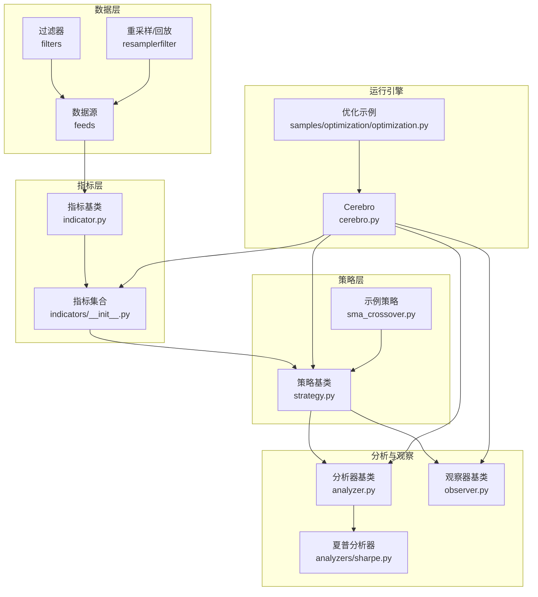
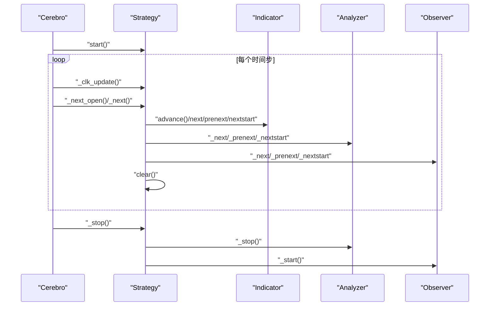
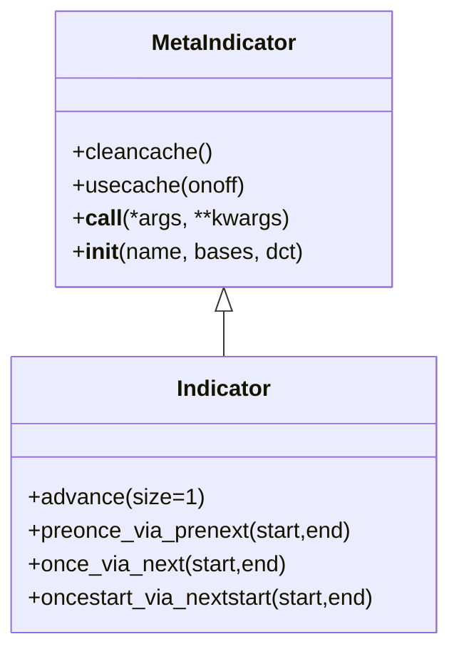
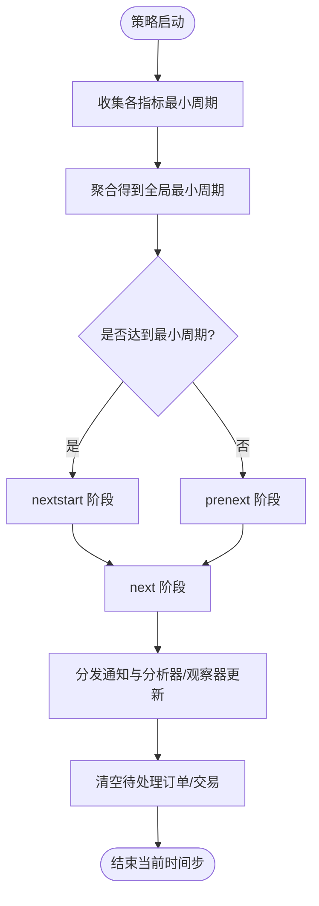
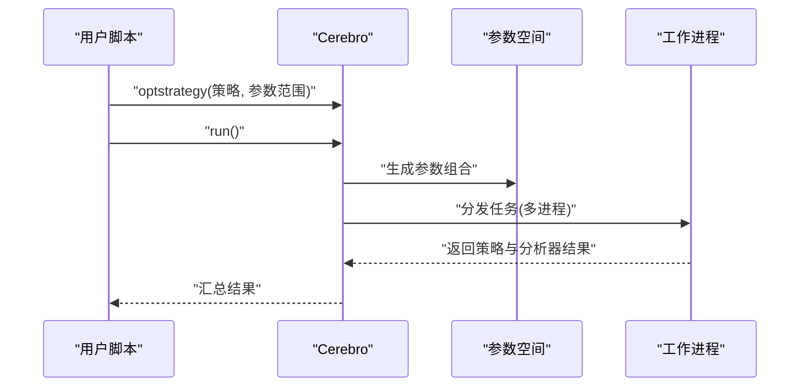
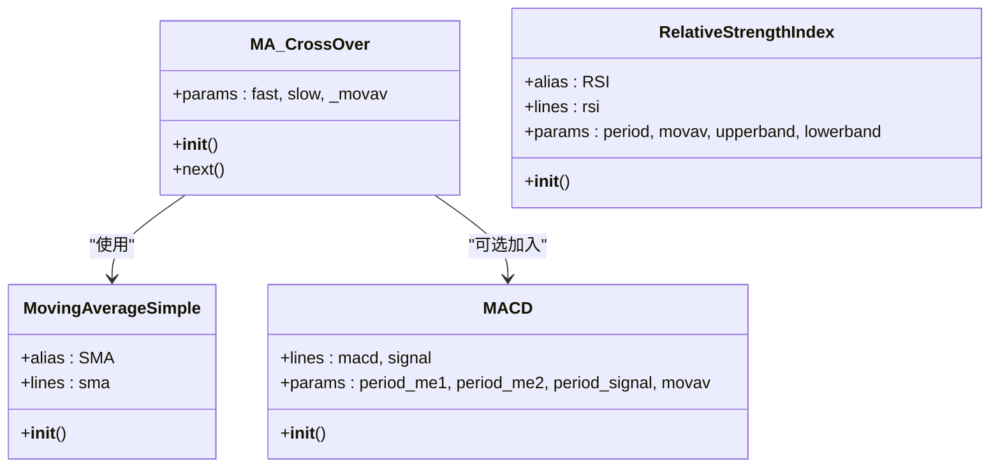
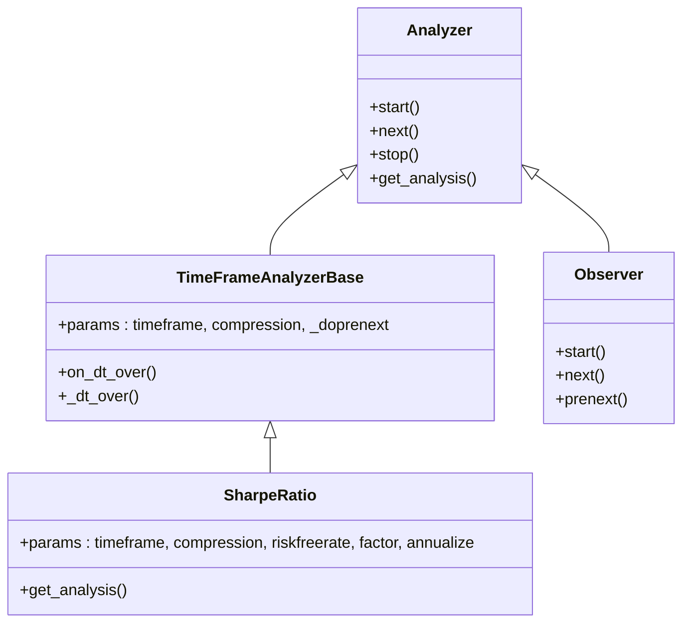
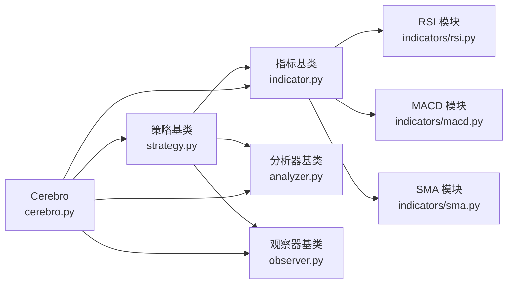

# 指标组合与优化

<cite>
**本文档引用的文件**
- [backtrader/__init__.py](file://backtrader/__init__.py)
- [backtrader/indicator.py](file://backtrader/indicator.py)
- [backtrader/strategy.py](file://backtrader/strategy.py)
- [backtrader/cerebro.py](file://backtrader/cerebro.py)
- [backtrader/analyzer.py](file://backtrader/analyzer.py)
- [backtrader/observer.py](file://backtrader/observer.py)
- [backtrader/indicators/__init__.py](file://backtrader/indicators/__init__.py)
- [backtrader/indicators/sma.py](file://backtrader/indicators/sma.py)
- [backtrader/indicators/rsi.py](file://backtrader/indicators/rsi.py)
- [backtrader/indicators/macd.py](file://backtrader/indicators/macd.py)
- [samples/optimization/optimization.py](file://samples/optimization/optimization.py)
- [backtrader/strategies/sma_crossover.py](file://backtrader/strategies/sma_crossover.py)
- [backtrader/analyzers/sharpe.py](file://backtrader/analyzers/sharpe.py)
</cite>

## 目录
1. [引言](#引言)
2. [项目结构](#项目结构)
3. [核心组件](#核心组件)
4. [架构总览](#架构总览)
5. [详细组件分析](#详细组件分析)
6. [依赖关系分析](#依赖关系分析)
7. [性能考量](#性能考量)
8. [故障排查指南](#故障排查指南)
9. [结论](#结论)
10. [附录](#附录)

## 引言
本指南面向希望在Backtrader中进行“指标组合与优化”的用户，系统讲解如何将多个技术指标协同使用以提升策略的准确性与稳定性；如何识别指标间相关性与潜在冲突；如何对指标参数进行网格搜索、多策略对比与回测评估；如何通过风险控制与过滤器设计避免过拟合并提升泛化能力；以及如何实现多时间框架、跨品种套利与因子模型构建等高级策略思路。同时给出实时监控与动态调整（含自适应参数）的实践路径，并总结性能评估指标与回测验证方法。

## 项目结构
Backtrader采用模块化分层设计：数据源与数据流在底层，策略与指标在中间层，分析器与观察器在上层，Cerebro作为运行时引擎协调整个流程。核心模块职责如下：
- 数据与数据流：数据源、重采样/回放、过滤器
- 指标体系：基础指标、移动平均、震荡与动量类、趋势类等
- 策略层：策略生命周期管理、最小周期计算、通知与执行
- 分析与观察：内置分析器（收益、夏普比率等）、观察器用于可视化与状态记录
- 运行引擎：Cerebro负责策略注册、回测/实盘调度、优化、并行与结果收集

**图表来源**
- [backtrader/indicator.py](file://backtrader/indicator.py#L90-L165)
- [backtrader/indicators/__init__.py](file://backtrader/indicators/__init__.py#L24-L91)
- [backtrader/strategy.py](file://backtrader/strategy.py#L107-L494)
- [backtrader/analyzer.py](file://backtrader/analyzer.py#L89-L287)
- [backtrader/observer.py](file://backtrader/observer.py#L46-L69)
- [backtrader/cerebro.py](file://backtrader/cerebro.py#L60-L294)
- [samples/optimization/optimization.py](file://samples/optimization/optimization.py#L51-L102)
- [backtrader/strategies/sma_crossover.py](file://backtrader/strategies/sma_crossover.py#L29-L75)
- [backtrader/analyzers/sharpe.py](file://backtrader/analyzers/sharpe.py#L112-L195)

**章节来源**
- [backtrader/__init__.py](file://backtrader/__init__.py#L24-L91)
- [backtrader/indicators/__init__.py](file://backtrader/indicators/__init__.py#L24-L91)

## 核心组件
- 指标基类与元类：MetaIndicator负责缓存、最小周期传播与调用序列；Indicator提供advance、preonce_via_prenext、once_via_next等生命周期钩子，确保多时间框架下同步推进。
- 策略基类：MetaStrategy注册策略类；Strategy负责最小周期聚合、内存节省模式、next/prenext/nextstart的分发、通知与执行。
- 运行引擎Cerebro：统一调度数据、策略、指标、分析器与观察器；支持优化（optstrategy）与并行（maxcpus）。
- 分析器与观察器：Analyzer提供按时间窗聚合、通知转发与分析结果输出；Observer用于记录状态与可视化。
- 示例策略与指标：SMA_CrossOver展示简单均线交叉策略；SMA、RSI、MACD等指标体现组合思路。

**章节来源**
- [backtrader/indicator.py](file://backtrader/indicator.py#L32-L165)
- [backtrader/strategy.py](file://backtrader/strategy.py#L43-L494)
- [backtrader/cerebro.py](file://backtrader/cerebro.py#L60-L294)
- [backtrader/analyzer.py](file://backtrader/analyzer.py#L89-L287)
- [backtrader/observer.py](file://backtrader/observer.py#L46-L69)
- [backtrader/indicators/sma.py](file://backtrader/indicators/sma.py#L27-L46)
- [backtrader/indicators/rsi.py](file://backtrader/indicators/rsi.py#L122-L192)
- [backtrader/indicators/macd.py](file://backtrader/indicators/macd.py#L27-L85)
- [backtrader/strategies/sma_crossover.py](file://backtrader/strategies/sma_crossover.py#L29-L75)

## 架构总览
Backtrader的运行时由Cerebro驱动，策略在每个时间步调用next系列方法，期间会触发所有已注册的指标、分析器与观察器的对应阶段。指标通过Indicator基类的生命周期保证在不同时间框架下的同步推进；策略侧通过最小周期聚合决定何时进入next或保持在预热期。

**图表来源**
- [backtrader/cerebro.py](file://backtrader/cerebro.py#L1030-L1048)
- [backtrader/strategy.py](file://backtrader/strategy.py#L320-L414)
- [backtrader/indicator.py](file://backtrader/indicator.py#L95-L137)
- [backtrader/analyzer.py](file://backtrader/analyzer.py#L178-L245)
- [backtrader/observer.py](file://backtrader/observer.py#L64-L69)

## 详细组件分析

### 指标基类与生命周期
- 缓存与复用：MetaIndicator提供对象级缓存，避免重复实例化相同参数的指标，减少开销。
- 最小周期传播：Indicator在advance中根据时钟长度推进，确保多时间框架下各指标同步。
- 生命周期钩子：preonce_via_prenext、once_via_next等确保在预热期与正式期分别调用合适的方法。

**图表来源**
- [backtrader/indicator.py](file://backtrader/indicator.py#L32-L165)

**章节来源**
- [backtrader/indicator.py](file://backtrader/indicator.py#L32-L165)

### 策略最小周期与内存节省
- 最小周期聚合：Strategy._periodset遍历所有指标与数据，计算全局最小周期，决定何时进入nextstart或保持在prenext。
- 内存节省：qbuffer支持按需释放历史缓冲，降低大样本回测内存占用。
- 通知与执行：notify_order/notify_trade/notify_cashvalue等回调贯穿交易生命周期。

**图表来源**
- [backtrader/strategy.py](file://backtrader/strategy.py#L155-L354)

**章节来源**
- [backtrader/strategy.py](file://backtrader/strategy.py#L155-L354)

### 运行引擎与优化
- 参数优化：Cerebro.optstrategy接受参数范围（如range），自动枚举组合并并行执行。
- 并行与加速：maxcpus控制CPU核数；optdatas/optreturn可显著提升优化速度。
- 结果收集：默认返回完整策略对象，也可启用optreturn仅返回必要信息以节省内存。

**图表来源**
- [backtrader/cerebro.py](file://backtrader/cerebro.py#L60-L294)
- [samples/optimization/optimization.py](file://samples/optimization/optimization.py#L62-L68)

**章节来源**
- [backtrader/cerebro.py](file://backtrader/cerebro.py#L60-L294)
- [samples/optimization/optimization.py](file://samples/optimization/optimization.py#L51-L102)

### 指标组合示例与策略
- 均线交叉策略：MA_CrossOver基于两条均线的交叉信号进行买卖决策，体现“趋势+信号”的组合思路。
- 多指标组合：可在策略中同时引入SMA、RSI、MACD等，形成“趋势确认+动量过滤+信号确认”的复合信号。
- 跨指标一致性：通过统一的最小周期与生命周期，确保不同时间框架下的指标同步。

**图表来源**
- [backtrader/strategies/sma_crossover.py](file://backtrader/strategies/sma_crossover.py#L29-L75)
- [backtrader/indicators/sma.py](file://backtrader/indicators/sma.py#L27-L46)
- [backtrader/indicators/rsi.py](file://backtrader/indicators/rsi.py#L122-L192)
- [backtrader/indicators/macd.py](file://backtrader/indicators/macd.py#L27-L85)

**章节来源**
- [backtrader/strategies/sma_crossover.py](file://backtrader/strategies/sma_crossover.py#L29-L75)
- [backtrader/indicators/sma.py](file://backtrader/indicators/sma.py#L27-L46)
- [backtrader/indicators/rsi.py](file://backtrader/indicators/rsi.py#L122-L192)
- [backtrader/indicators/macd.py](file://backtrader/indicators/macd.py#L27-L85)

### 分析器与风险控制
- 时间窗分析器：TimeFrameAnalyzerBase按日/周/月等时间窗聚合，便于分段评估。
- 夏普比率：SharpeRatio基于时间窗收益计算，支持年化与无风险利率调整，用于风险调整后收益评估。
- 观察器：Observer用于记录资金、头寸、交易等状态，便于后续分析与可视化。

**图表来源**
- [backtrader/analyzer.py](file://backtrader/analyzer.py#L89-L287)
- [backtrader/analyzers/sharpe.py](file://backtrader/analyzers/sharpe.py#L112-L195)
- [backtrader/observer.py](file://backtrader/observer.py#L46-L69)

**章节来源**
- [backtrader/analyzer.py](file://backtrader/analyzer.py#L89-L287)
- [backtrader/analyzers/sharpe.py](file://backtrader/analyzers/sharpe.py#L112-L195)
- [backtrader/observer.py](file://backtrader/observer.py#L46-L69)

## 依赖关系分析
- 指标依赖：指标通常依赖基础运算（如Max、DivZeroByZero）、移动平均族（MovAv）与基本操作（basicops）。
- 策略依赖：策略依赖指标、分析器与观察器；通过Cerebro统一注册与调度。
- 运行时耦合：Cerebro连接数据、策略、指标、分析器与观察器，形成闭环。

**图表来源**
- [backtrader/indicator.py](file://backtrader/indicator.py#L24-L30)
- [backtrader/indicators/rsi.py](file://backtrader/indicators/rsi.py#L24-L26)
- [backtrader/indicators/macd.py](file://backtrader/indicators/macd.py#L24-L25)
- [backtrader/indicators/sma.py](file://backtrader/indicators/sma.py#L24-L25)
- [backtrader/strategy.py](file://backtrader/strategy.py#L34-L40)
- [backtrader/analyzer.py](file://backtrader/analyzer.py#L29-L32)
- [backtrader/observer.py](file://backtrader/observer.py#L25-L27)
- [backtrader/cerebro.py](file://backtrader/cerebro.py#L34-L48)

**章节来源**
- [backtrader/indicators/__init__.py](file://backtrader/indicators/__init__.py#L24-L91)
- [backtrader/strategy.py](file://backtrader/strategy.py#L34-L40)
- [backtrader/cerebro.py](file://backtrader/cerebro.py#L34-L48)

## 性能考量
- 向量化与事件驱动：Cerebro.runonce控制指标向量化以提速，策略与观察器始终事件驱动。
- 内存节省：exactbars与qbuffer可显著降低内存占用，但会牺牲部分绘图与预加载能力。
- 并行优化：maxcpus并行执行优化任务；optdatas与optreturn可进一步加速。
- 指标缓存：MetaIndicator对象缓存可减少重复构造成本，但需注意缓存一致性与边界情况。

[本节为通用指导，无需特定文件来源]

## 故障排查指南
- 指标未生效：检查最小周期是否满足；确认Indicator.advance是否被正确调用。
- 多时间框架错位：确认各数据/指标的时钟层级与advance推进逻辑。
- 优化结果异常：检查参数范围与边界值；确认Cerebro的optdatas/optreturn设置。
- 分析器无输出：确认Analyzer的start/stop与get_analysis实现；检查时间窗聚合逻辑。
- 观察器不显示：确认Observer的prenext/next实现与plot配置。

**章节来源**
- [backtrader/strategy.py](file://backtrader/strategy.py#L155-L354)
- [backtrader/indicator.py](file://backtrader/indicator.py#L95-L137)
- [backtrader/cerebro.py](file://backtrader/cerebro.py#L1011-L1048)
- [backtrader/analyzer.py](file://backtrader/analyzer.py#L190-L268)
- [backtrader/observer.py](file://backtrader/observer.py#L58-L69)

## 结论
Backtrader通过清晰的层次化架构与完善的生命周期管理，为“指标组合与优化”提供了坚实基础。合理利用指标最小周期传播、策略通知机制、分析器时间窗聚合与Cerebro优化能力，可以有效提升策略的稳定性与泛化能力。建议在实践中优先进行指标相关性分析与冲突排查，再结合网格搜索与多策略对比，最终以风险调整收益等指标进行回测验证。

[本节为总结性内容，无需特定文件来源]

## 附录

### 指标组合与优化实践清单
- 组合设计
  - 明确目标：趋势识别、动量过滤、信号确认
  - 指标选择：避免高度相关的同类型指标重复
  - 冲突处理：通过阈值、过滤器或多时间框架一致性校验
- 参数优化
  - 网格搜索：使用Cerebro.optstrategy与参数范围
  - 多策略对比：通过分析器比较收益、回撤、夏普等
  - 并行加速：合理设置maxcpus、optdatas、optreturn
- 风险管理与过滤器
  - 设置止损止盈与最大回撤上限
  - 使用波动率过滤（如ATR）或成交量过滤
  - 分层信号：趋势+动量+过滤三段式
- 实时监控与动态调整
  - 定期评估指标稳定性与参数有效性
  - 引入自适应参数（如动态周期）与机器学习信号融合
- 回测验证
  - 使用时间窗分析器与夏普比率等指标
  - 对样本外区间进行检验，避免过拟合

[本节为实践建议，无需特定文件来源]