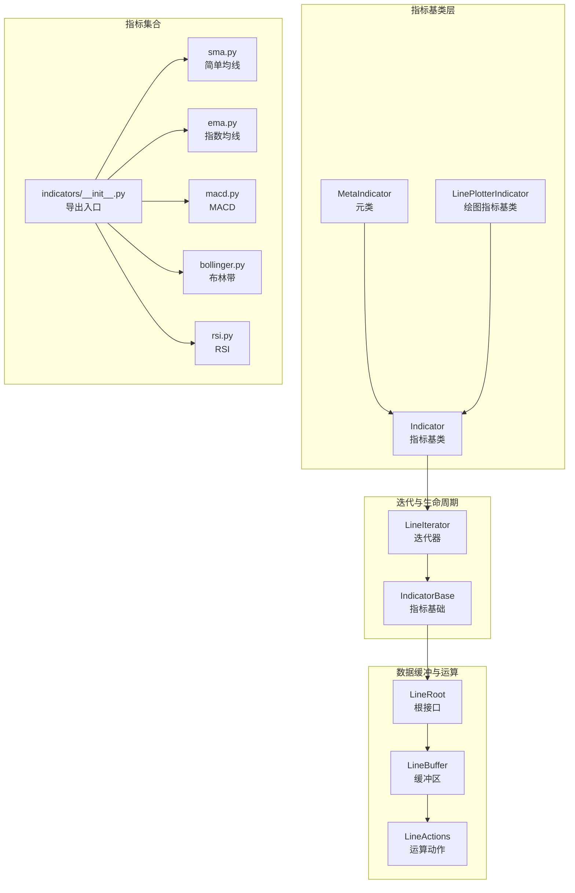
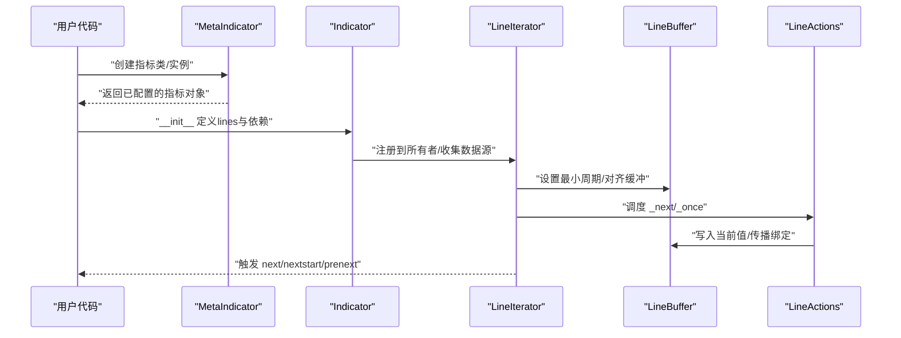
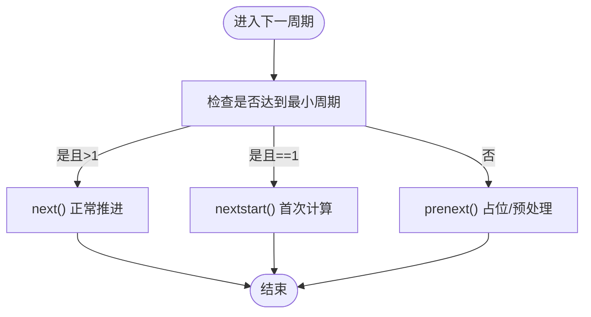
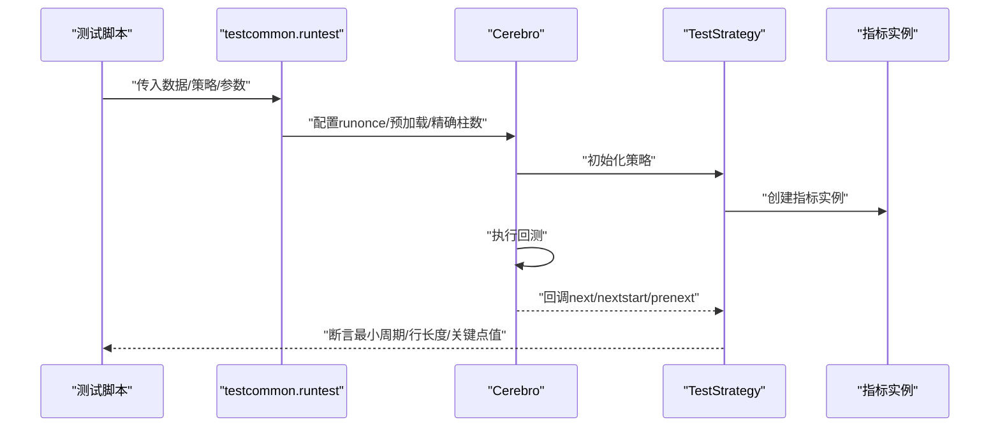
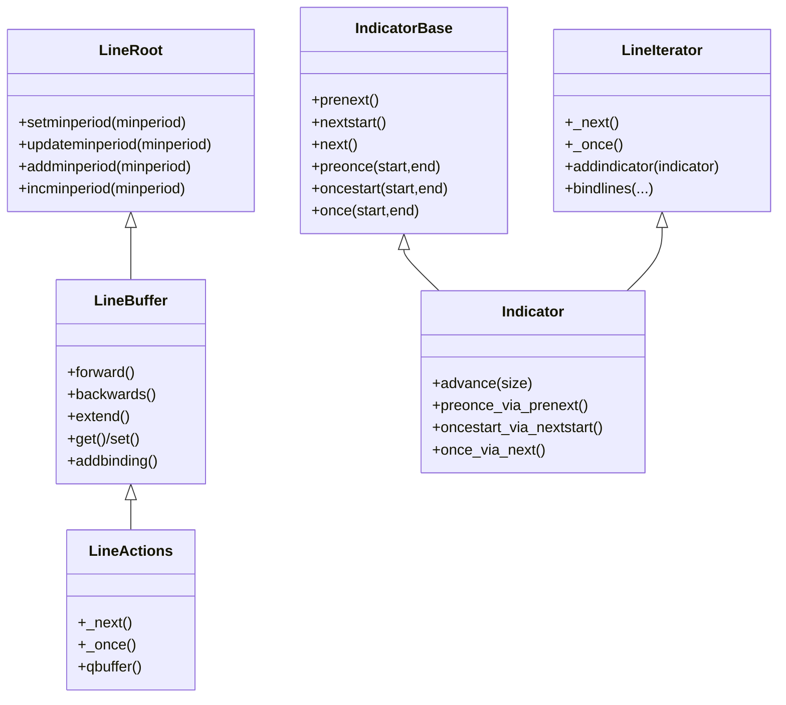
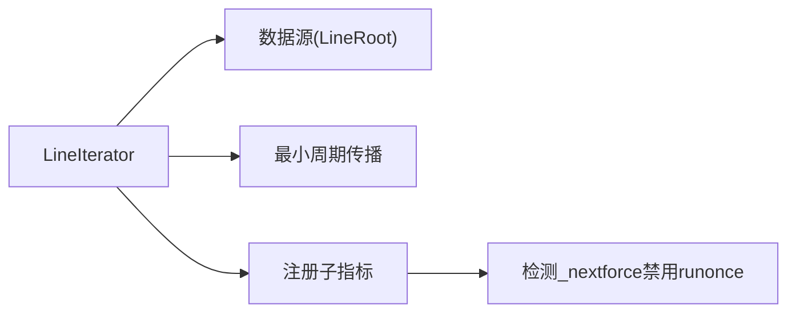

# 自定义指标开发

<cite>
**本文引用的文件**
- [backtrader/indicator.py](file://backtrader/indicator.py)
- [backtrader/lineiterator.py](file://backtrader/lineiterator.py)
- [backtrader/linebuffer.py](file://backtrader/linebuffer.py)
- [backtrader/lineroot.py](file://backtrader/lineroot.py)
- [backtrader/indicators/__init__.py](file://backtrader/indicators/__init__.py)
- [backtrader/indicators/sma.py](file://backtrader/indicators/sma.py)
- [backtrader/indicators/ema.py](file://backtrader/indicators/ema.py)
- [backtrader/indicators/macd.py](file://backtrader/indicators/macd.py)
- [backtrader/indicators/bollinger.py](file://backtrader/indicators/bollinger.py)
- [backtrader/indicators/rsi.py](file://backtrader/indicators/rsi.py)
- [backtrader/functions.py](file://backtrader/functions.py)
- [tests/test_ind_sma.py](file://tests/test_ind_sma.py)
- [tests/test_ind_ema.py](file://tests/test_ind_ema.py)
- [tests/testcommon.py](file://tests/testcommon.py)
</cite>

## 目录
1. [简介](#简介)
2. [项目结构](#项目结构)
3. [核心组件](#核心组件)
4. [架构总览](#架构总览)
5. [组件详解](#组件详解)
6. [依赖关系分析](#依赖关系分析)
7. [性能考量](#性能考量)
8. [故障排查指南](#故障排查指南)
9. [结论](#结论)
10. [附录](#附录)

## 简介
本指南面向Backtrader自定义指标开发者，系统讲解如何基于Indicator基类进行扩展，覆盖必需方法实现（如next、once、preonce、nextstart等）、参数与内部变量管理、数据访问与历史数据获取、计算优化技巧、调试与测试方法、打包与分发流程以及常见问题与性能优化建议。文档以仓库现有代码为依据，结合典型指标实现（如SMA、EMA、MACD、布林带、RSI）给出可操作的开发范式。

## 项目结构
Backtrader的核心指标体系由以下层次构成：
- 指标基类与元类：Indicator、MetaIndicator、LinePlotterIndicator
- 迭代与生命周期：LineIterator、IndicatorBase
- 数据缓冲与运算：LineBuffer、LineActions、LineRoot
- 指标集合导出：indicators/__init__.py
- 典型指标示例：sma.py、ema.py、macd.py、bollinger.py、rsi.py
- 辅助函数与运算：functions.py
- 测试框架与样例：tests/* 与 tests/testcommon.py

**图表来源**
- [backtrader/indicator.py](file://backtrader/indicator.py#L32-L165)
- [backtrader/lineiterator.py](file://backtrader/lineiterator.py#L148-L489)
- [backtrader/linebuffer.py](file://backtrader/linebuffer.py#L50-L830)
- [backtrader/lineroot.py](file://backtrader/lineroot.py#L61-L360)
- [backtrader/indicators/__init__.py](file://backtrader/indicators/__init__.py#L1-L91)

**章节来源**
- [backtrader/indicator.py](file://backtrader/indicator.py#L32-L165)
- [backtrader/lineiterator.py](file://backtrader/lineiterator.py#L148-L489)
- [backtrader/linebuffer.py](file://backtrader/linebuffer.py#L50-L830)
- [backtrader/lineroot.py](file://backtrader/lineroot.py#L61-L360)
- [backtrader/indicators/__init__.py](file://backtrader/indicators/__init__.py#L1-L91)

## 核心组件
- 指标基类与元类
  - MetaIndicator负责缓存、别名注册、以及在仅重写next时自动补齐once系列方法的适配。
  - Indicator继承自MetaIndicator派生的IndicatorBase，提供advance、preonce_via_prenext、oncestart_via_nextstart、once_via_next等机制，确保多数据源与不同时间尺度下的推进与计算。
  - LinePlotterIndicator用于派生支持绘图的指标，动态派生lines与plotlines信息。
- 迭代与生命周期
  - LineIterator定义了next/once/preonce/nextstart/prenext的生命周期钩子，并负责对齐各数据源的时钟（_clock），驱动子指标与观察者。
  - IndicatorBase/DataAccessor/ObserverBase/StrategyBase用于类型识别与便捷常量访问。
- 数据缓冲与运算
  - LineRoot定义最小接口与富比较、运算符重载；LineSingle/LineMultiple分别处理单行与多行场景。
  - LineBuffer提供缓冲区指针、前移/后退、绑定、绘图取值等能力；LineActions提供_qbuffer、_next/_once执行路径与最小周期传播。
- 指标集合导出
  - indicators/__init__.py集中导入各类指标，形成统一入口，便于按需使用或批量导出。

**章节来源**
- [backtrader/indicator.py](file://backtrader/indicator.py#L32-L165)
- [backtrader/lineiterator.py](file://backtrader/lineiterator.py#L148-L489)
- [backtrader/linebuffer.py](file://backtrader/linebuffer.py#L50-L830)
- [backtrader/lineroot.py](file://backtrader/lineroot.py#L61-L360)
- [backtrader/indicators/__init__.py](file://backtrader/indicators/__init__.py#L1-L91)

## 架构总览
下图展示指标实例从创建到运行的关键交互：元类注册与缓存、数据源接入、生命周期调度、计算与绘图绑定。

**图表来源**
- [backtrader/indicator.py](file://backtrader/indicator.py#L51-L137)
- [backtrader/lineiterator.py](file://backtrader/lineiterator.py#L169-L377)
- [backtrader/linebuffer.py](file://backtrader/linebuffer.py#L50-L148)

**章节来源**
- [backtrader/indicator.py](file://backtrader/indicator.py#L51-L137)
- [backtrader/lineiterator.py](file://backtrader/lineiterator.py#L169-L377)
- [backtrader/linebuffer.py](file://backtrader/linebuffer.py#L50-L148)

## 组件详解

### 指标基类与生命周期
- 必需方法
  - next：在满足最小周期后逐条推进计算。
  - nextstart：首次达到最小周期时调用一次，通常默认委托给next。
  - preonce/once/oncestart：一次性预热阶段的分段执行，用于填充早期缓冲。
  - prenext：在未满足最小周期前的占位/预处理。
- 元类行为
  - 若仅重写next，MetaIndicator会自动注入once_via_next、preonce_via_prenext、oncestart_via_nextstart，保证runonce模式下的正确性。
- 多数据源推进
  - Indicator.advance会在不同长度/时间尺度的数据源间推进自身与子指标，确保时序一致。

**图表来源**
- [backtrader/lineiterator.py](file://backtrader/lineiterator.py#L259-L285)
- [backtrader/indicator.py](file://backtrader/indicator.py#L95-L137)

**章节来源**
- [backtrader/lineiterator.py](file://backtrader/lineiterator.py#L259-L354)
- [backtrader/indicator.py](file://backtrader/indicator.py#L95-L137)

### 参数与内部变量管理
- 参数声明与默认值
  - 在类中通过params定义参数，例如period、devfactor、movav等。
- 行（lines）与绘图配置
  - 通过lines定义输出行名称；plotinfo/plotlines控制绘图行为与样式。
- 内部变量与依赖
  - 在__init__中构建依赖（如移动平均、标准差等），并将结果赋给self.lines[索引]或命名行。
- 标签与绘图标签
  - 可覆写_plotlabel以定制图表显示标签。

示例参考：
- [MovingAverageSimple.__init__](file://backtrader/indicators/sma.py#L40-L45)
- [ExponentialMovingAverage.__init__](file://backtrader/indicators/ema.py#L45-L55)
- [MACD.__init__](file://backtrader/indicators/macd.py#L57-L64)
- [BollingerBands.__init__](file://backtrader/indicators/bollinger.py#L57-L64)
- [RSI.__init__](file://backtrader/indicators/rsi.py#L178-L191)

**章节来源**
- [backtrader/indicators/sma.py](file://backtrader/indicators/sma.py#L27-L46)
- [backtrader/indicators/ema.py](file://backtrader/indicators/ema.py#L27-L56)
- [backtrader/indicators/macd.py](file://backtrader/indicators/macd.py#L27-L85)
- [backtrader/indicators/bollinger.py](file://backtrader/indicators/bollinger.py#L27-L77)
- [backtrader/indicators/rsi.py](file://backtrader/indicators/rsi.py#L122-L191)

### 数据访问与历史数据获取
- 基础数据访问
  - self.data、self.data_close/self.data_high等通过LineIterator自动注入，支持data0/data1等多数据源访问。
- 历史访问
  - 使用data(-n)向前访问n根K线的历史值；使用data[n]访问相对当前位置的偏移。
- 时间与时序
  - LineBuffer提供datetime/date/time/dt/tm等便捷方法，便于跨周期比较与定位。

参考实现：
- [UpDay/DownDay 使用data(-period)](file://backtrader/indicators/rsi.py#L45-L70)
- [MACD 使用不同period的移动平均] (file://backtrader/indicators/macd.py#L59-L63)

**章节来源**
- [backtrader/lineiterator.py](file://backtrader/lineiterator.py#L80-L99)
- [backtrader/linebuffer.py](file://backtrader/linebuffer.py#L386-L497)
- [backtrader/indicators/rsi.py](file://backtrader/indicators/rsi.py#L45-L70)
- [backtrader/indicators/macd.py](file://backtrader/indicators/macd.py#L59-L63)

### 计算逻辑与优化技巧
- 利用LineActions的once路径批量计算，减少条件判断开销。
- 使用辅助函数（DivByZero、DivZeroByZero、Max/Min/Sum、If/Cmp等）进行数值安全与逻辑分支的向量化。
- 合理设置最小周期，避免在缓冲未就绪时进行昂贵计算。
- 对于复合指标，优先复用已有指标（如MovAv）以获得稳定的最小周期传播与缓存。

参考实现：
- [DivZeroByZero在RSI中的安全除法] (file://backtrader/indicators/rsi.py#L183-L189)
- [functions.py中的逻辑与运算] (file://backtrader/functions.py#L43-L259)

**章节来源**
- [backtrader/indicators/rsi.py](file://backtrader/indicators/rsi.py#L183-L189)
- [backtrader/functions.py](file://backtrader/functions.py#L43-L259)

### 调试与测试
- 测试策略与断言
  - tests/testcommon.py提供TestStrategy，自动断言最小周期、行长度、关键点取值等。
- 示例测试
  - tests/test_ind_sma.py与tests/test_ind_ema.py演示如何指定指标类、最小周期与期望值列表进行验证。
- 运行模式
  - runtest会尝试多种runonce/预加载/exactbars组合，确保指标在不同模式下稳定。

**图表来源**
- [tests/testcommon.py](file://tests/testcommon.py#L61-L117)
- [tests/test_ind_sma.py](file://tests/test_ind_sma.py#L38-L47)
- [tests/test_ind_ema.py](file://tests/test_ind_ema.py#L38-L47)

**章节来源**
- [tests/testcommon.py](file://tests/testcommon.py#L61-L225)
- [tests/test_ind_sma.py](file://tests/test_ind_sma.py#L38-L51)
- [tests/test_ind_ema.py](file://tests/test_ind_ema.py#L38-L51)

### 开发示例

#### 示例一：简单移动平均（SMA）
- 实现要点
  - 定义alias/lines，使用Average(self.data, period=self.p.period)作为核心计算。
  - 将结果赋给self.lines[0]，并在super().__init__()之前完成，以便混入可见。
- 关键路径
  - [MovingAverageSimple.__init__](file://backtrader/indicators/sma.py#L40-L45)

**章节来源**
- [backtrader/indicators/sma.py](file://backtrader/indicators/sma.py#L27-L46)

#### 示例二：指数移动平均（EMA）
- 实现要点
  - 使用ExponentialSmoothing并传入alpha=2/(1+period)，将alpha与alpha1暴露给外部。
- 关键路径
  - [ExponentialMovingAverage.__init__](file://backtrader/indicators/ema.py#L45-L55)

**章节来源**
- [backtrader/indicators/ema.py](file://backtrader/indicators/ema.py#L27-L56)

#### 示例三：MACD（复合指标）
- 实现要点
  - 通过self.p.movav(self.data, period=...)构造短期与长期均线，再计算差值与信号线。
  - 可选派生MACDHisto，增加柱状图。
- 关键路径
  - [MACD.__init__](file://backtrader/indicators/macd.py#L57-L64)
  - [MACDHisto.__init__](file://backtrader/indicators/macd.py#L82-L85)

**章节来源**
- [backtrader/indicators/macd.py](file://backtrader/indicators/macd.py#L27-L85)

#### 示例四：布林带（含百分比线）
- 实现要点
  - 中轨为移动平均，上下轨为中轨±devfactor×StdDev。
  - 可扩展生成pctb（价格偏离百分比）。
- 关键路径
  - [BollingerBands.__init__](file://backtrader/indicators/bollinger.py#L57-L64)
  - [BollingerBandsPct.__init__](file://backtrader/indicators/bollinger.py#L74-L77)

**章节来源**
- [backtrader/indicators/bollinger.py](file://backtrader/indicators/bollinger.py#L27-L77)

#### 示例五：RSI（复杂复合指标）
- 实现要点
  - UpDay/DownDay分别计算上涨/下跌日的平滑量，再用movav平滑得到rs，最后转换为rsi。
  - 支持安全除法（DivZeroByZero）与不同移动平均族（SMMA/EMA）。
- 关键路径
  - [RSI.__init__](file://backtrader/indicators/rsi.py#L178-L191)
  - [DivZeroByZero实现](file://backtrader/functions.py#L76-L118)

**章节来源**
- [backtrader/indicators/rsi.py](file://backtrader/indicators/rsi.py#L122-L191)
- [backtrader/functions.py](file://backtrader/functions.py#L76-L118)

### 类关系图（代码级）

**图表来源**
- [backtrader/lineiterator.py](file://backtrader/lineiterator.py#L148-L377)
- [backtrader/linebuffer.py](file://backtrader/linebuffer.py#L50-L148)
- [backtrader/lineroot.py](file://backtrader/lineroot.py#L61-L131)
- [backtrader/indicator.py](file://backtrader/indicator.py#L90-L137)

## 依赖关系分析
- 指标到数据源
  - LineIterator在donew阶段扫描参数，收集LineRoot实例作为数据源，并注入data/dataX、dataX_Y等便捷属性。
- 最小周期传播
  - MetaLineIterator在dopreinit阶段根据所有数据源的最大_minperiod更新自身_minperiod，并向上游传播至lines。
- 指标注册与强制runonce
  - addindicator检测子指标的_nextforce，必要时禁用runonce以保证逐条推进。

**图表来源**
- [backtrader/lineiterator.py](file://backtrader/lineiterator.py#L38-L146)

**章节来源**
- [backtrader/lineiterator.py](file://backtrader/lineiterator.py#L38-L146)

## 性能考量
- 缓冲与内存
  - qbuffer与minbuffer配合，确保缓冲大小满足最小周期需求；在需要时启用队列缓冲以节省内存。
- 批量计算
  - once路径通过循环直接写数组，避免频繁条件判断；优先使用LineActions提供的once实现。
- 运算优化
  - 使用functions.py中的向量化逻辑（如Max/Min/Sum、If/Cmp、DivByZero/DivZeroByZero）替代Python层循环。
- 并行与缓存
  - MetaIndicator/MetaLineActions提供对象缓存开关，可在重复实例化时减少开销（默认关闭以避免状态污染）。

**章节来源**
- [backtrader/linebuffer.py](file://backtrader/linebuffer.py#L121-L148)
- [backtrader/linebuffer.py](file://backtrader/linebuffer.py#L625-L634)
- [backtrader/functions.py](file://backtrader/functions.py#L241-L259)
- [backtrader/indicator.py](file://backtrader/indicator.py#L40-L66)

## 故障排查指南
- 指标未输出或输出异常
  - 检查是否正确设置self.lines[索引]或命名行；确认最小周期是否满足；核对数据源是否注入成功。
- 除零或0/0不确定
  - 使用DivZeroByZero或DivByZero进行安全除法；在RSI中可通过safediv参数启用安全模式。
- 多数据源不同步
  - 确认Indicator.advance被调用；检查数据源时间尺度差异；必要时使用LineCoupler进行耦合。
- runonce与逐条推进冲突
  - 若指标需要逐条推进，确保子指标或自身设置_nextforce以禁用runonce。

**章节来源**
- [backtrader/indicators/rsi.py](file://backtrader/indicators/rsi.py#L183-L189)
- [backtrader/lineiterator.py](file://backtrader/lineiterator.py#L208-L222)
- [backtrader/lineiterator.py](file://backtrader/lineiterator.py#L408-L484)

## 结论
Backtrader的指标体系以Indicator/LineIterator为核心，通过Meta类与LineBuffer/LineActions提供生命周期、数据对齐与高效计算能力。开发者应遵循“先定义lines与参数，再构建依赖”的模式，合理利用once路径与辅助函数，结合测试框架验证最小周期与关键点值，最终形成可维护、可测试、可复用的指标库。

## 附录

### 开发清单
- 明确输入数据与输出行（lines）
- 定义参数（params）与默认值
- 在__init__中构建依赖并赋值到self.lines
- 必要时覆写next/nextstart/prenext/preonce/once/oncestart
- 设置plotinfo/plotlines以支持可视化
- 编写单元测试，覆盖runonce/预加载/精确柱数等场景
- 使用DivByZero/DivZeroByZero等安全运算

### 打包与分发（最佳实践）
- 模块组织
  - 将自定义指标放入backtrader/indicators/目录，确保在indicators/__init__.py中导出。
- 版本管理
  - 通过backtrader/version.py管理版本号；遵循语义化版本。
- 文档与示例
  - 提供README与简单示例脚本；在tests中添加对应测试用例。
- 发布
  - 使用setup.py构建wheel；上传至PyPI；提供变更日志。

**章节来源**
- [backtrader/indicators/__init__.py](file://backtrader/indicators/__init__.py#L1-L91)