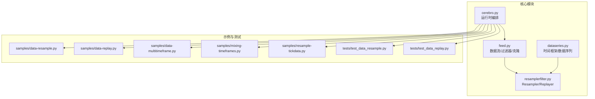
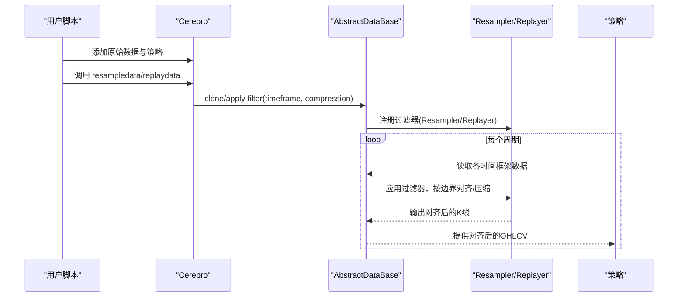
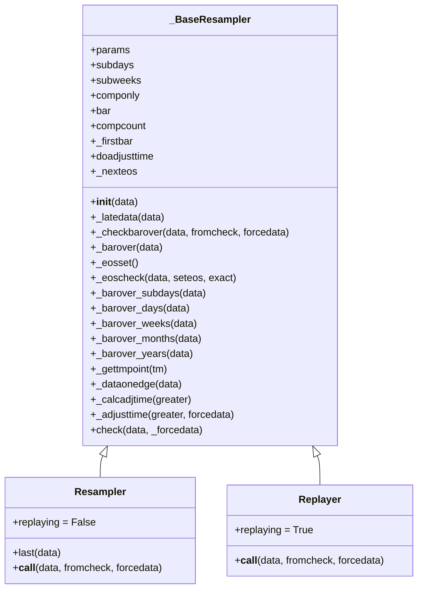
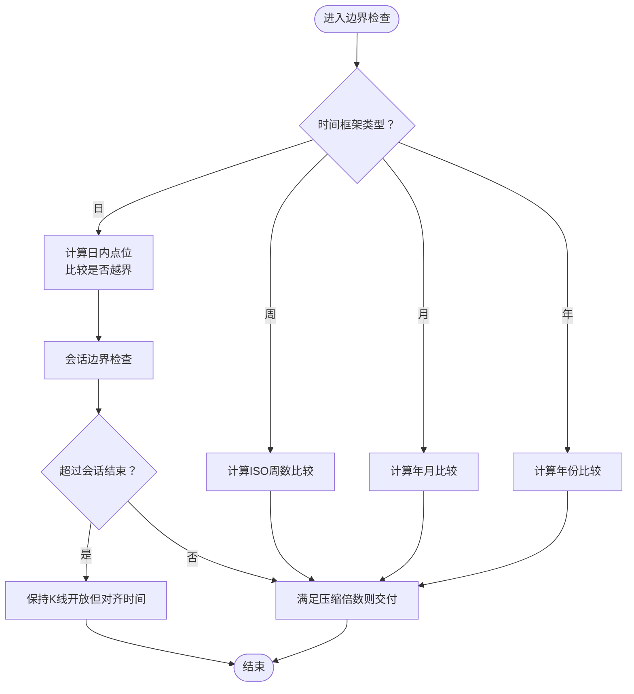
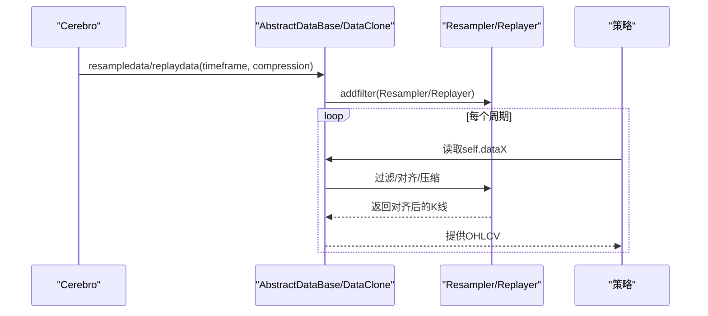
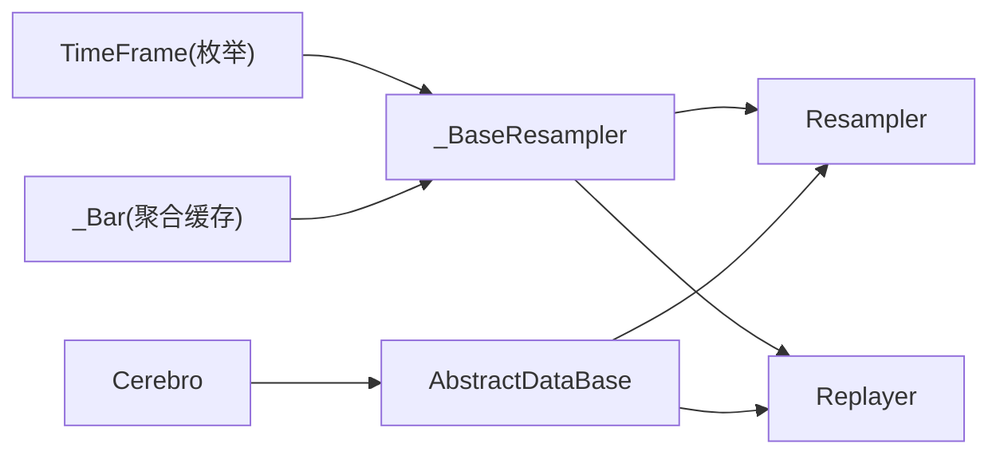

# 多时间框架支持

<cite>
**本文引用的文件**
- [resamplerfilter.py](file://backtrader/resamplerfilter.py)
- [dataseries.py](file://backtrader/dataseries.py)
- [feed.py](file://backtrader/feed.py)
- [cerebro.py](file://backtrader/cerebro.py)
- [data-multitimeframe.py](file://samples/data-multitimeframe/data-multitimeframe.py)
- [data-resample.py](file://samples/data-resample/data-resample.py)
- [data-replay.py](file://samples/data-replay/data-replay.py)
- [mixing-timeframes.py](file://samples/mixing-timeframes/mixing-timeframes.py)
- [resample-tickdata.py](file://samples/resample-tickdata/resample-tickdata.py)
- [test_data_resample.py](file://tests/test_data_resample.py)
- [test_data_replay.py](file://tests/test_data_replay.py)
</cite>

## 目录
1. [引言](#引言)
2. [项目结构](#项目结构)
3. [核心组件](#核心组件)
4. [架构总览](#架构总览)
5. [详细组件分析](#详细组件分析)
6. [依赖关系分析](#依赖关系分析)
7. [性能考量](#性能考量)
8. [故障排查指南](#故障排查指南)
9. [结论](#结论)
10. [附录：实践指南与示例路径](#附录实践指南与示例路径)

## 引言
本文件面向Backtrader的多时间框架（Multi-TimeFrame, MTF）支持系统，系统性阐述其架构设计与实现原理，重点覆盖以下主题：
- 时间轴对齐机制与边界条件处理
- 数据重采样与回放（Resample/Replay）算法
- 时间戳同步策略与会话边界管理
- Resampler与Replayer两类处理器的工作机制与差异
- 时间框架转换的数学原理（聚合、压缩、边界对齐）
- 多时间框架策略开发的实践指南（性能、内存、并发）

目标读者既包括需要深入理解实现细节的开发者，也包括希望高效使用MTF能力进行策略开发的使用者。

## 项目结构
围绕多时间框架的核心代码主要分布在如下模块：
- 时间框架定义与基础数据结构：dataseries.py
- 数据流与过滤器基础设施：feed.py
- 重采样与回放核心逻辑：resamplerfilter.py
- Cerebro入口对resample/replay的编排：cerebro.py
- 示例与测试：samples与tests目录下的脚本

图表来源
- [dataseries.py](file://backtrader/dataseries.py#L33-L58)
- [feed.py](file://backtrader/feed.py#L30-L39)
- [resamplerfilter.py](file://backtrader/resamplerfilter.py#L96-L131)
- [cerebro.py](file://backtrader/cerebro.py#L812-L848)

章节来源
- [dataseries.py](file://backtrader/dataseries.py#L33-L58)
- [feed.py](file://backtrader/feed.py#L30-L39)
- [resamplerfilter.py](file://backtrader/resamplerfilter.py#L96-L131)
- [cerebro.py](file://backtrader/cerebro.py#L812-L848)

## 核心组件
- 时间框架枚举与命名：TimeFrame定义了Ticks到Years等离散层级，用于统一表示时间粒度与压缩倍数。
- 数据序列与OHLC结构：DataSeries/LineSeries承载OHLCV与时间戳，是所有重采样/回放的基础载体。
- 过滤器与克隆：SimpleFilterWrapper将用户自定义过滤器包装为可执行的处理器；DataClone用于复制数据源以独立应用过滤器。
- 重采样与回放处理器：Resampler负责从低频向高频聚合并按边界对齐；Replayer模拟市场逐级构建过程，仅在完整K线完成后才“对外交付”。

章节来源
- [dataseries.py](file://backtrader/dataseries.py#L33-L58)
- [dataseries.py](file://backtrader/dataseries.py#L60-L105)
- [dataseries.py](file://backtrader/dataseries.py#L115-L144)
- [dataseries.py](file://backtrader/dataseries.py#L146-L212)
- [feed.py](file://backtrader/feed.py#L122-L139)
- [feed.py](file://backtrader/feed.py#L300-L300)

## 架构总览
Backtrader的多时间框架由“数据源 → 过滤器链 → 策略”构成。Cerebro在添加数据后，通过resample/replay接口为数据添加过滤器，形成新的数据视图，策略在统一的时间轴上读取不同时间框架的数据。

图表来源
- [cerebro.py](file://backtrader/cerebro.py#L812-L848)
- [feed.py](file://backtrader/feed.py#L300-L300)
- [resamplerfilter.py](file://backtrader/resamplerfilter.py#L435-L561)
- [resamplerfilter.py](file://backtrader/resamplerfilter.py#L563-L700)

## 详细组件分析

### 时间框架与数据结构
- TimeFrame枚举：定义Ticks、微秒、秒、分、日、周、月、年等离散层级，支持名称映射与压缩倍数表达。
- DataSeries/LineSeries：定义OHLCV字段顺序与写入头信息，提供Writer兼容输出。
- _Bar：内部缓存当前K线的聚合状态（open/high/low/close/volume/openinterest），支持bstart/bupdate等操作。

章节来源
- [dataseries.py](file://backtrader/dataseries.py#L33-L58)
- [dataseries.py](file://backtrader/dataseries.py#L60-L105)
- [dataseries.py](file://backtrader/dataseries.py#L146-L212)

### 过滤器与克隆机制
- SimpleFilterWrapper：将用户提供的过滤器对象包装为可调用处理器，返回True则移除当前条目，实现“过滤”效果。
- DataClone：复制一个数据源实例，使其独立应用过滤器而不影响原始数据流，常用于为同一数据源生成多个时间框架视图。

章节来源
- [dataseries.py](file://backtrader/dataseries.py#L115-L144)
- [feed.py](file://backtrader/feed.py#L749-L792)

### 重采样与回放处理器（Resampler/Replayer）
- 共同基类_BaseResampler：
  - 参数：bar2edge、adjbartime、rightedge、boundoff、timeframe、compression、takelate、sessionend等。
  - 关键流程：判断是否越界（_barover/_checkbarover）、计算边界对齐（_adjusttime/_calcadjtime）、按压缩倍数触发交付。
  - 边界检测：支持日、周、月、年的跨期判断；子日内的边界基于“点位”换算（小时分钟秒微秒）。
- Resampler：
  - 非实时场景下直接产出已对齐的K线，适合历史回测。
  - 支持“延迟数据”策略（takelate）与“检查模式”（check）以应对无新数据时的强制交付。
- Replayer：
  - 模拟市场逐步构建K线的过程，仅在完整K线完成后才对外交付，适合演示或教学用途。
  - 可选在边界时间插入额外tick以对齐时间戳。

图表来源
- [resamplerfilter.py](file://backtrader/resamplerfilter.py#L96-L131)
- [resamplerfilter.py](file://backtrader/resamplerfilter.py#L134-L181)
- [resamplerfilter.py](file://backtrader/resamplerfilter.py#L182-L213)
- [resamplerfilter.py](file://backtrader/resamplerfilter.py#L214-L298)
- [resamplerfilter.py](file://backtrader/resamplerfilter.py#L299-L361)
- [resamplerfilter.py](file://backtrader/resamplerfilter.py#L362-L433)
- [resamplerfilter.py](file://backtrader/resamplerfilter.py#L435-L561)
- [resamplerfilter.py](file://backtrader/resamplerfilter.py#L563-L700)

章节来源
- [resamplerfilter.py](file://backtrader/resamplerfilter.py#L96-L131)
- [resamplerfilter.py](file://backtrader/resamplerfilter.py#L134-L181)
- [resamplerfilter.py](file://backtrader/resamplerfilter.py#L182-L213)
- [resamplerfilter.py](file://backtrader/resamplerfilter.py#L214-L298)
- [resamplerfilter.py](file://backtrader/resamplerfilter.py#L299-L361)
- [resamplerfilter.py](file://backtrader/resamplerfilter.py#L362-L433)
- [resamplerfilter.py](file://backtrader/resamplerfilter.py#L435-L561)
- [resamplerfilter.py](file://backtrader/resamplerfilter.py#L563-L700)

### 时间轴对齐与边界条件
- 日内边界对齐：将时间映射为“当日累计分钟/秒/微秒”的点位，结合compression整除判断是否越界。
- 周/月/年边界：基于日历或ISO日期计算（如周数、年月、年份）比较，确保跨期正确触发。
- 会话边界：通过_getnexteos获取下一交易会话结束时间，避免在非交易时段产生无效K线。
- 对齐策略：adjbartime控制是否将K线时间调整至边界；rightedge控制使用左边界还是右边界。

图表来源
- [resamplerfilter.py](file://backtrader/resamplerfilter.py#L182-L213)
- [resamplerfilter.py](file://backtrader/resamplerfilter.py#L214-L241)
- [resamplerfilter.py](file://backtrader/resamplerfilter.py#L266-L298)
- [resamplerfilter.py](file://backtrader/resamplerfilter.py#L362-L433)

章节来源
- [resamplerfilter.py](file://backtrader/resamplerfilter.py#L182-L213)
- [resamplerfilter.py](file://backtrader/resamplerfilter.py#L214-L241)
- [resamplerfilter.py](file://backtrader/resamplerfilter.py#L266-L298)
- [resamplerfilter.py](file://backtrader/resamplerfilter.py#L362-L433)

### 数据重采样与回放的调用序列
- Cerebro在添加数据后，通过resampledata/replaydata为数据应用过滤器，形成新的数据视图。
- 策略在每个周期读取各时间框架数据，底层由过滤器完成对齐与交付。

图表来源
- [cerebro.py](file://backtrader/cerebro.py#L812-L848)
- [feed.py](file://backtrader/feed.py#L749-L792)
- [resamplerfilter.py](file://backtrader/resamplerfilter.py#L435-L561)
- [resamplerfilter.py](file://backtrader/resamplerfilter.py#L563-L700)

章节来源
- [cerebro.py](file://backtrader/cerebro.py#L812-L848)
- [feed.py](file://backtrader/feed.py#L749-L792)
- [resamplerfilter.py](file://backtrader/resamplerfilter.py#L435-L561)
- [resamplerfilter.py](file://backtrader/resamplerfilter.py#L563-L700)

### 时间框架转换的数学原理
- 聚合规则：_Bar.bupdate按OHLCV聚合，高取最大、低取最小、收盘取最新、成交量累加。
- 压缩与边界：通过“点位”整除判断是否跨越边界；compression参数决定压缩倍数。
- 插值与边界时间：adjbartime启用时，将K线时间调整至边界；rightedge决定使用左/右边界。
- 会话与日历：_getnexteos结合日历或会话结束时间，避免非交易时段的K线生成。

章节来源
- [dataseries.py](file://backtrader/dataseries.py#L187-L212)
- [resamplerfilter.py](file://backtrader/resamplerfilter.py#L242-L264)
- [resamplerfilter.py](file://backtrader/resamplerfilter.py#L362-L433)
- [resamplerfilter.py](file://backtrader/resamplerfilter.py#L211-L235)

### 多时间框架策略开发实践
- 使用Cerebro的resampledata/replaydata为同一数据源生成多个时间框架视图。
- 在策略中同时读取self.data（小周期）与self.data0（大周期），注意两者对齐节奏差异。
- 合理设置compression与bar2edge/adjbartime/rightedge，平衡对齐精度与数据量。
- 对于实时场景，优先使用Resampler；若需演示市场逐步构建过程，可选用Replayer。

章节来源
- [cerebro.py](file://backtrader/cerebro.py#L812-L848)
- [data-multitimeframe.py](file://samples/data-multitimeframe/data-multitimeframe.py#L93-L172)
- [mixing-timeframes.py](file://samples/mixing-timeframes/mixing-timeframes.py#L58-L71)

## 依赖关系分析
- 组件耦合：
  - _BaseResampler依赖TimeFrame与日期工具，以及数据序列的内部缓存结构。
  - Resampler/Replayer依赖AbstractDataBase的过滤器注册与交付机制。
  - Cerebro通过resampledata/replaydata间接驱动过滤器链。
- 外部依赖：
  - 交易日历（PandasMarketCalendar）用于会话边界计算。
  - 时间工具（date2num/num2date）用于UTC与本地化时间转换。

图表来源
- [dataseries.py](file://backtrader/dataseries.py#L33-L58)
- [dataseries.py](file://backtrader/dataseries.py#L146-L212)
- [resamplerfilter.py](file://backtrader/resamplerfilter.py#L96-L131)
- [feed.py](file://backtrader/feed.py#L30-L39)
- [cerebro.py](file://backtrader/cerebro.py#L812-L848)

章节来源
- [dataseries.py](file://backtrader/dataseries.py#L33-L58)
- [dataseries.py](file://backtrader/dataseries.py#L146-L212)
- [resamplerfilter.py](file://backtrader/resamplerfilter.py#L96-L131)
- [feed.py](file://backtrader/feed.py#L30-L39)
- [cerebro.py](file://backtrader/cerebro.py#L812-L848)

## 性能考量
- 内存管理：
  - qbuffer在resampling/replaying场景下预留额外缓冲，减少频繁扩容。
  - DataClone复制数据源，避免共享状态带来的锁竞争，但会增加内存占用。
- 并发与实时：
  - live数据源下，Cerebro禁用preload与runonce，过滤器需支持check模式以处理无新数据时的强制交付。
  - takelate参数允许处理“延迟到达”的数据，避免因上游数据滞后导致的空转。
- 压缩与边界计算：
  - compression越大，越少的K线输出，但可能损失细节；合理选择压缩倍数与边界策略。
  - adjbartime/rightedge提升对齐精度，但可能引入额外tick，影响回测速度。

章节来源
- [feed.py](file://backtrader/feed.py#L297-L300)
- [feed.py](file://backtrader/feed.py#L268-L273)
- [resamplerfilter.py](file://backtrader/resamplerfilter.py#L134-L141)
- [resamplerfilter.py](file://backtrader/resamplerfilter.py#L495-L561)
- [resamplerfilter.py](file://backtrader/resamplerfilter.py#L615-L700)

## 故障排查指南
- 症状：策略读取不到对齐的K线
  - 排查：确认是否正确调用resampledata/replaydata；检查timeframe/compression参数是否一致。
  - 参考：示例脚本中的调用方式。
- 症状：K线时间未对齐边界
  - 排查：检查bar2edge/adjbartime/rightedge参数；确认_getnexteos是否返回正确会话结束时间。
- 症状：回测速度过慢
  - 排查：降低compression；关闭adjbartime；减少额外tick插入。
- 症状：实时数据无进展
  - 排查：启用check模式；确保takelate策略正确；检查qcheck与通知队列。

章节来源
- [data-resample.py](file://samples/data-resample/data-resample.py#L30-L72)
- [data-replay.py](file://samples/data-replay/data-replay.py#L52-L94)
- [resamplerfilter.py](file://backtrader/resamplerfilter.py#L299-L361)
- [resamplerfilter.py](file://backtrader/resamplerfilter.py#L495-L561)
- [resamplerfilter.py](file://backtrader/resamplerfilter.py#L615-L700)

## 结论
Backtrader的多时间框架体系通过清晰的过滤器链与对齐机制，实现了从低频到高频的稳健重采样与逼真的回放模拟。开发者可通过合理配置参数与选择合适的处理器，在精度、性能与可读性之间取得平衡。建议在策略开发中：
- 明确时间框架与压缩倍数，优先使用Resampler进行历史回测；
- 在需要演示或教学时采用Replayer；
- 注意会话边界与日历配置，避免非交易时段的无效K线；
- 控制内存与tick数量，优化回测性能。

## 附录：实践指南与示例路径
- 基础重采样：使用Cerebro.resampledata与示例脚本
  - [data-resample.py](file://samples/data-resample/data-resample.py#L30-L72)
- 基础回放：使用Cerebro.replaydata与示例脚本
  - [data-replay.py](file://samples/data-replay/data-replay.py#L52-L94)
- 多时间框架策略：同时使用小周期与大周期数据
  - [data-multitimeframe.py](file://samples/data-multitimeframe/data-multitimeframe.py#L93-L172)
- 混合时间框架指标：在不同周期间耦合指标
  - [mixing-timeframes.py](file://samples/mixing-timeframes/mixing-timeframes.py#L58-L71)
- 精细控制重采样参数（ticks到更高时间框架）
  - [resample-tickdata.py](file://samples/resample-tickdata/resample-tickdata.py#L30-L76)
- 单元测试参考
  - [test_data_resample.py](file://tests/test_data_resample.py#L39-L54)
  - [test_data_replay.py](file://tests/test_data_replay.py#L40-L56)