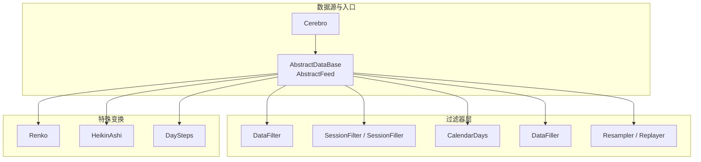
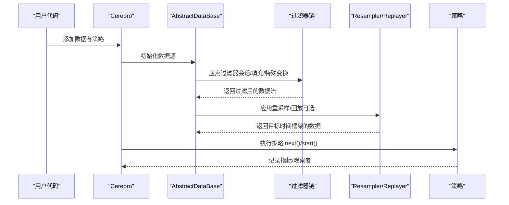
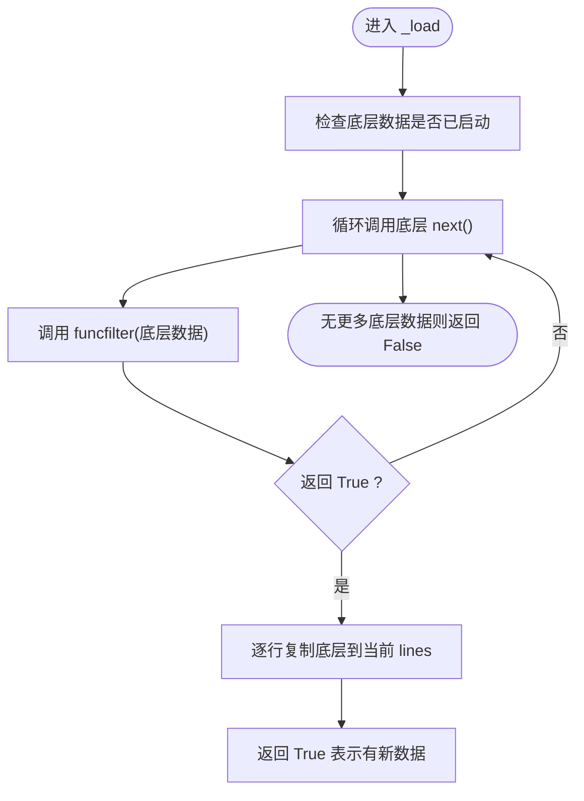
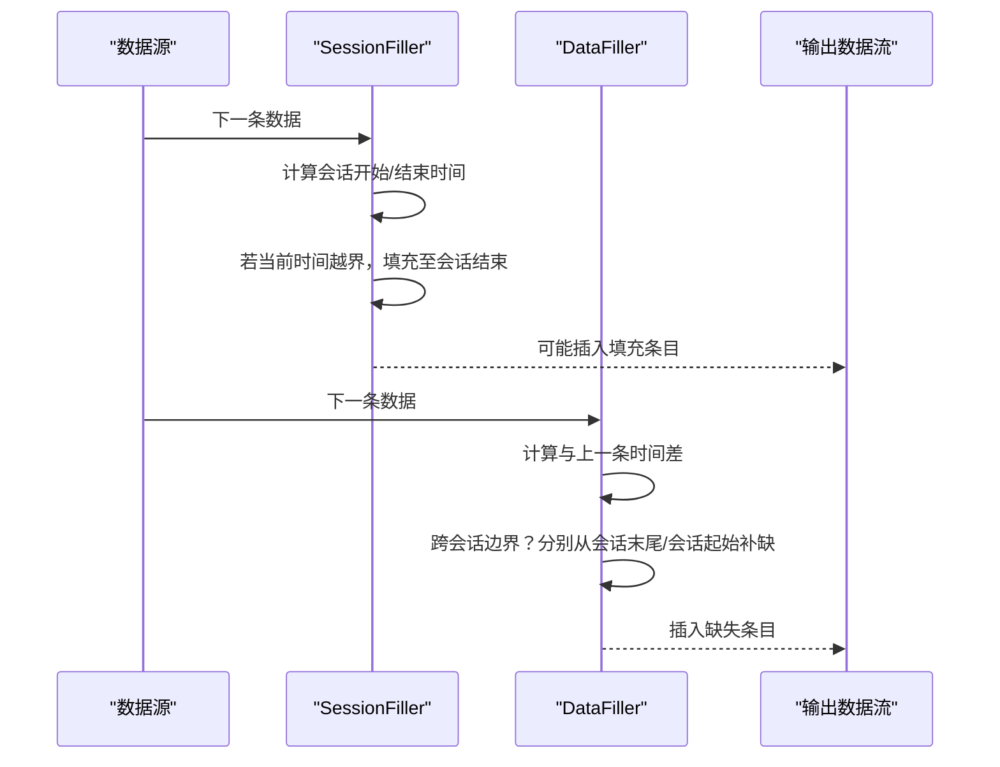
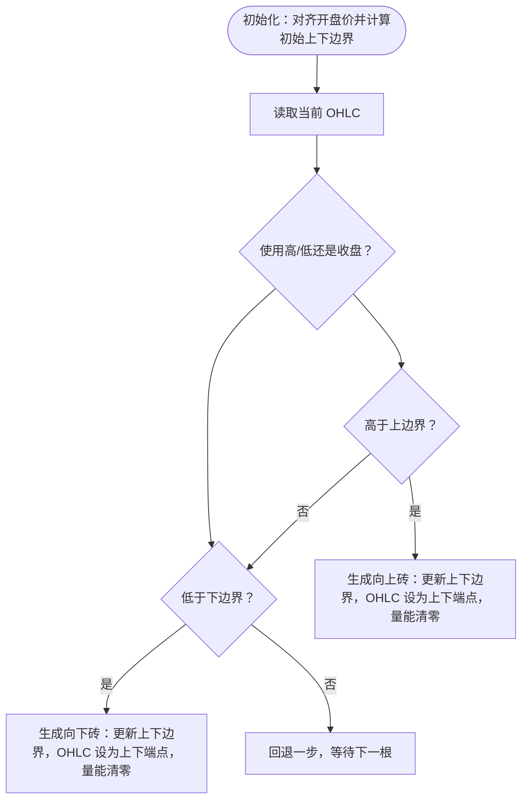
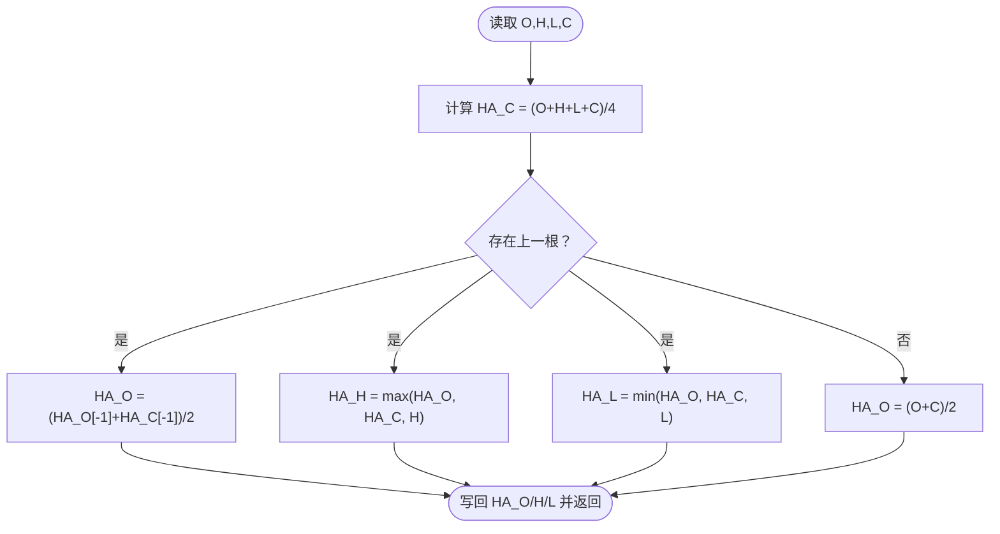
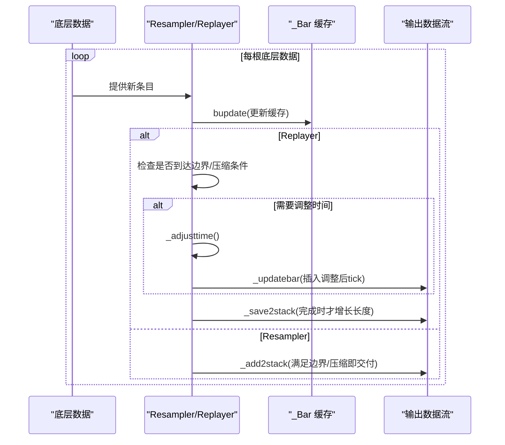
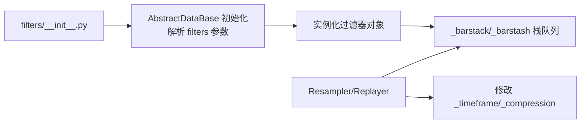

# 数据处理与过滤

<cite>
**本文引用的文件**
- [backtrader/filters/__init__.py](file://backtrader/filters/__init__.py)
- [backtrader/filters/datafilter.py](file://backtrader/filters/datafilter.py)
- [backtrader/filters/datafiller.py](file://backtrader/filters/datafiller.py)
- [backtrader/filters/session.py](file://backtrader/filters/session.py)
- [backtrader/filters/renko.py](file://backtrader/filters/renko.py)
- [backtrader/filters/heikinashi.py](file://backtrader/filters/heikinashi.py)
- [backtrader/filters/calendardays.py](file://backtrader/filters/calendardays.py)
- [backtrader/filters/daysteps.py](file://backtrader/filters/daysteps.py)
- [backtrader/resamplerfilter.py](file://backtrader/resamplerfilter.py)
- [backtrader/feed.py](file://backtrader/feed.py)
- [samples/data-resample/data-resample.py](file://samples/data-resample/data-resample.py)
- [samples/data-replay/data-replay.py](file://samples/data-replay/data-replay.py)
- [samples/renko/renko.py](file://samples/renko/renko.py)
- [samples/data-filler/data-filler.py](file://samples/data-filler/data-filler.py)
</cite>

## 目录
1. [简介](#简介)
2. [项目结构](#项目结构)
3. [核心组件](#核心组件)
4. [架构总览](#架构总览)
5. [详细组件分析](#详细组件分析)
6. [依赖关系分析](#依赖关系分析)
7. [性能考量](#性能考量)
8. [故障排查指南](#故障排查指南)
9. [结论](#结论)
10. [附录](#附录)

## 简介
本技术文档聚焦 Backtrader 的数据处理与过滤系统，系统性阐述以下主题：
- 数据过滤器工作原理：通用 DataFilter、会话过滤 SessionFilter/SessionFiller、日历天填充 CalendarDays、分步开盘 DaySteps 等。
- 特殊数据变换：Renko 砖型图、Heikin Ashi 均值蜡烛。
- 数据重采样与回放：Resampler（降采样）与 Replayer（回放）的边界对齐、压缩、时间调整与会话边界处理。
- 多时间框架支持：时间戳对齐、数据聚合与边界判断。
- 数据填充策略：缺失数据处理、连续性维护、异常值检测思路。
- 数据质量保障：数据验证、异常处理与性能优化建议。

## 项目结构
Backtrader 将数据过滤与重采样能力分布在 filters、resamplerfilter 与 feed 等模块中，并通过 Cerebro 驱动在策略执行时按序应用。

图表来源
- [backtrader/feed.py](file://backtrader/feed.py#L122-L200)
- [backtrader/filters/__init__.py](file://backtrader/filters/__init__.py#L25-L35)
- [backtrader/resamplerfilter.py](file://backtrader/resamplerfilter.py#L96-L133)

章节来源
- [backtrader/feed.py](file://backtrader/feed.py#L122-L200)
- [backtrader/filters/__init__.py](file://backtrader/filters/__init__.py#L25-L35)

## 核心组件
- 过滤器注册与导出：filters/__init__.py 聚合 DataFilter、DataFiller、Session、CalendarDays、DaySteps、HeikinAshi、Renko 等。
- 通用过滤器 DataFilter：以可调用函数对底层数据进行“允许/丢弃”判定，逐行复制满足条件的数据。
- 会话过滤与填充：SessionFilter/SessionFiller 在会话边界内过滤或填充缺失条目；DataFiller 在分钟级等时间粒度上跨会话边界自动补缺。
- 特殊变换：Renko 将 OHLC 流转换为“砖块”序列；HeikinAshi 对 OHLC 进行平滑变换。
- 重采样与回放：Resampler 将细粒度数据聚合到更长周期；Replayer 模拟市场逐步构建完整 K 线，仅在完成时才增长长度。
- 日历与步进：CalendarDays 补齐跨周末/节假日的缺失交易日；DaySteps 将日线拆分为开盘价先行的两段模拟回放。

章节来源
- [backtrader/filters/__init__.py](file://backtrader/filters/__init__.py#L25-L35)
- [backtrader/filters/datafilter.py](file://backtrader/filters/datafilter.py#L27-L74)
- [backtrader/filters/session.py](file://backtrader/filters/session.py#L31-L245)
- [backtrader/filters/datafiller.py](file://backtrader/filters/datafiller.py#L30-L177)
- [backtrader/filters/renko.py](file://backtrader/filters/renko.py#L31-L140)
- [backtrader/filters/heikinashi.py](file://backtrader/filters/heikinashi.py#L28-L55)
- [backtrader/filters/calendardays.py](file://backtrader/filters/calendardays.py#L31-L121)
- [backtrader/filters/daysteps.py](file://backtrader/filters/daysteps.py#L25-L85)
- [backtrader/resamplerfilter.py](file://backtrader/resamplerfilter.py#L96-L753)

## 架构总览
下图展示从数据源到策略执行期间，过滤器与重采样/回放在数据流中的位置与交互。

图表来源
- [backtrader/feed.py](file://backtrader/feed.py#L122-L200)
- [backtrader/resamplerfilter.py](file://backtrader/resamplerfilter.py#L495-L560)

## 详细组件分析

### 通用数据过滤器 DataFilter
- 工作机制：在 _load 循环中调用底层数据 next()，对每个底层条目调用 funcfilter 判定，返回 True 才复制到当前 lines。
- 关键点：预加载底层数据、复制底层 timeframe/compression；逐行复制底层所有 line 字段。
- 典型用途：基于自定义规则（如波动率阈值、成交量条件）筛选条目。

图表来源
- [backtrader/filters/datafilter.py](file://backtrader/filters/datafilter.py#L57-L74)

章节来源
- [backtrader/filters/datafilter.py](file://backtrader/filters/datafilter.py#L27-L74)

### 会话过滤与填充
- SessionFilter：简单过滤，不在会话时段的条目直接丢弃（调用 backwards），适合预过滤。
- SessionFiller：在会话内填充缺失条目，使用底层 timeframe/compression 计算时间间隔，按配置填充价格/成交量/持仓。
- DataFiller：跨会话边界自动补缺，按分钟/秒/微秒粒度计算时间差并插入缺失条目，使用前收盘价或指定值填充 OHLC。

图表来源
- [backtrader/filters/session.py](file://backtrader/filters/session.py#L81-L140)
- [backtrader/filters/datafiller.py](file://backtrader/filters/datafiller.py#L110-L177)

章节来源
- [backtrader/filters/session.py](file://backtrader/filters/session.py#L31-L245)
- [backtrader/filters/datafiller.py](file://backtrader/filters/datafiller.py#L30-L177)

### Renko 砖型图
- 参数：hilo（使用高/低还是收盘决定新砖）、size（固定砖高）、autosize（自适应砖高）、dynamic（动态重算）、align（价格对齐因子）、roundstart（初始对齐取整）。
- 算法要点：根据当前价格与上下边界比较，决定向上/向下生成新砖；可按 autosize 动态调整；对齐到 align 的整数倍；不改变数据流长度，仅修改 OHLC 并清零量能。

图表来源
- [backtrader/filters/renko.py](file://backtrader/filters/renko.py#L75-L140)

章节来源
- [backtrader/filters/renko.py](file://backtrader/filters/renko.py#L31-L140)

### Heikin Ashi 均值
- 输入：当前 OHLC。
- 输出：HA_O = (HA_O[-1] + HA_C[-1]) / 2；HA_H = max(HA_O, HA_C, H)；HA_L = min(HA_O, HA_C, L)；HA_C = (O+H+L+C)/4。
- 影响：平滑趋势、减少噪音，不改变数据流长度。

图表来源
- [backtrader/filters/heikinashi.py](file://backtrader/filters/heikinashi.py#L38-L55)

章节来源
- [backtrader/filters/heikinashi.py](file://backtrader/filters/heikinashi.py#L28-L55)

### 日历天填充 CalendarDays
- 逻辑：若相邻两条日线相隔超过 1 天，则按时间步长逐日填充，价格由参数控制（使用上一收盘、指定值或高低平均）。
- 适用：补齐周末/节假日导致的缺失交易日。

章节来源
- [backtrader/filters/calendardays.py](file://backtrader/filters/calendardays.py#L31-L121)

### 分步开盘 DaySteps（模拟回放）
- 逻辑：将日线拆成两段：第一段开盘价 OHLC 相等且量能为 0；第二段为原日线 OHLC 与量能。通过 _add2stack/_updatebar/_save2stack 控制输出顺序。
- 适用：无需 Replayer 的日线分步模拟。

章节来源
- [backtrader/filters/daysteps.py](file://backtrader/filters/daysteps.py#L25-L85)

### 重采样与回放（Resampler/Replayer）
- 边界对齐与压缩：根据 bar2edge/rightedge/boundoff 决定对齐到起始/结束边界及压缩倍数；subdays 场景下按“日内点位”计算是否越界。
- 时间调整：adjbartime 控制是否将时间调整到边界；calcadjtime 将内部 bar 时间映射到目标 timeframe 的边界。
- 会话边界：_eoscheck/_getnexteos 结合 _nexteos/_nextdteos 处理 end-of-session，避免跨会话截断。
- 回放特化：Replayer 在 bar 完整前不增加长度，仅在完成时通过 _add2stack 或 _updatebar 更新；可插入“调整后时间”的额外 tick。

图表来源
- [backtrader/resamplerfilter.py](file://backtrader/resamplerfilter.py#L495-L560)
- [backtrader/resamplerfilter.py](file://backtrader/resamplerfilter.py#L615-L700)

章节来源
- [backtrader/resamplerfilter.py](file://backtrader/resamplerfilter.py#L96-L753)

## 依赖关系分析
- 过滤器注册：filters/__init__.py 统一导入并导出各过滤器类，供外部通过 bt.filters.* 使用。
- 数据源集成：feed.py 中 AbstractDataBase 在初始化阶段解析 filters 参数，实例化过滤器并建立栈队列用于中间结果暂存。
- 重采样/回放耦合：Resampler/Replayer 直接修改数据的 _timeframe/_compression，并通过 _add2stack/_save2stack/_updatebar 与数据流交互。

图表来源
- [backtrader/filters/__init__.py](file://backtrader/filters/__init__.py#L25-L35)
- [backtrader/feed.py](file://backtrader/feed.py#L109-L118)
- [backtrader/resamplerfilter.py](file://backtrader/resamplerfilter.py#L126-L132)

章节来源
- [backtrader/filters/__init__.py](file://backtrader/filters/__init__.py#L25-L35)
- [backtrader/feed.py](file://backtrader/feed.py#L109-L118)
- [backtrader/resamplerfilter.py](file://backtrader/resamplerfilter.py#L126-L132)

## 性能考量
- 过滤器链顺序：将昂贵的过滤（如自定义函数）置于靠后位置，先用 SessionFilter/CalendarDays/DataFiller 等快速剔除明显无效区间。
- 时间边界计算：Resampler/Replayer 的 _barover_* 与 _gettmpoint 采用整数点位运算，避免浮点误差累积；合理设置 compression 降低边界判断频率。
- 栈操作成本：频繁 _add2stack/_save2stack 会带来内存与拷贝开销，建议在策略侧批量消费输出数据。
- 会话与日历：DataFiller/SessionFiller/CalendarDays 在分钟/秒级场景下可能产生大量中间条目，注意 fill_price/fill_vol/fill_oi 的默认值选择，避免过多 NaN/无效值影响后续指标计算。

## 故障排查指南
- 会话过滤后无数据
  - 检查 sessionstart/sessionend 是否正确传入（AbstractDataBase 会在启动阶段标准化为 time 类型）。
  - 使用 SessionFilterSimple 快速定位是否全部被过滤。
- 重采样/回放未对齐
  - 确认 timeframe/compression 设置与 bar2edge/rightedge/boundoff 协同。
  - 检查 adjbartime 是否启用以及 _adjusttime 的边界推导。
- 缺失数据导致指标异常
  - 启用 DataFiller/SessionFiller/CalendarDays 并设置 fill_price/fill_vol/fill_oi。
  - 对于 Renko/HeikinAshi 等变换，确认其在过滤链中的位置，避免对原始数据造成二次变换。
- 多时间框架不一致
  - 确保上游数据已按目标 timeframe 对齐；必要时先用 SessionFiller/CalendarDays 填充后再重采样。

章节来源
- [backtrader/feed.py](file://backtrader/feed.py#L79-L105)
- [backtrader/filters/session.py](file://backtrader/filters/session.py#L187-L245)
- [backtrader/filters/datafiller.py](file://backtrader/filters/datafiller.py#L103-L177)
- [backtrader/resamplerfilter.py](file://backtrader/resamplerfilter.py#L418-L433)

## 结论
Backtrader 的数据处理与过滤体系以“过滤器链 + 重采样/回放 + 特殊变换”为核心，既保证了灵活性（可插拔过滤器与变换），又提供了强大的时间对齐与填充能力。通过合理组合 SessionFilter/SessionFiller/CalendarDays、DataFiller、Renko/HeikinAshi 以及 Resampler/Replayer，可在不同时间尺度与市场环境下获得高质量、连续且符合业务需求的数据流。

## 附录

### 使用示例路径
- 重采样示例：samples/data-resample/data-resample.py
- 回放示例：samples/data-replay/data-replay.py
- Renko 示例：samples/renko/renko.py
- 数据填充示例：samples/data-filler/data-filler.py

章节来源
- [samples/data-resample/data-resample.py](file://samples/data-resample/data-resample.py#L30-L96)
- [samples/data-replay/data-replay.py](file://samples/data-replay/data-replay.py#L52-L121)
- [samples/renko/renko.py](file://samples/renko/renko.py#L42-L136)
- [samples/data-filler/data-filler.py](file://samples/data-filler/data-filler.py#L37-L153)