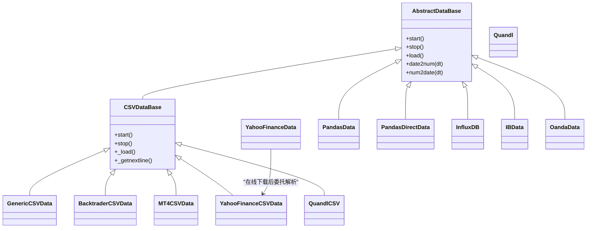

# 数据源类型

<cite>
**本文引用的文件**
- [backtrader/feeds/__init__.py](file://backtrader/feeds/__init__.py)
- [backtrader/feed.py](file://backtrader/feed.py)
- [backtrader/feeds/csvgeneric.py](file://backtrader/feeds/csvgeneric.py)
- [backtrader/feeds/btcsv.py](file://backtrader/feeds/btcsv.py)
- [backtrader/feeds/mt4csv.py](file://backtrader/feeds/mt4csv.py)
- [backtrader/feeds/yahoo.py](file://backtrader/feeds/yahoo.py)
- [backtrader/feeds/quandl.py](file://backtrader/feeds/quandl.py)
- [backtrader/feeds/pandafeed.py](file://backtrader/feeds/pandafeed.py)
- [backtrader/feeds/influxfeed.py](file://backtrader/feeds/influxfeed.py)
- [backtrader/feeds/ibdata.py](file://backtrader/feeds/ibdata.py)
- [backtrader/feeds/oanda.py](file://backtrader/feeds/oanda.py)
- [samples/data-pandas/data-pandas.py](file://samples/data-pandas/data-pandas.py)
- [samples/yahoo-test/yahoo-test.py](file://samples/yahoo-test/yahoo-test.py)
</cite>

## 目录
1. [简介](#简介)
2. [项目结构](#项目结构)
3. [核心组件](#核心组件)
4. [架构总览](#架构总览)
5. [详细组件分析](#详细组件分析)
6. [依赖关系分析](#依赖关系分析)
7. [性能考量](#性能考量)
8. [故障排查指南](#故障排查指南)
9. [结论](#结论)
10. [附录](#附录)

## 简介
本文件系统性梳理 Backtrader 的数据源类型与实现机制，覆盖以下数据源形态：
- CSV 文件数据源：通用 CSV、Backtrader 自定义 CSV、MetaTrader4 CSV
- 在线金融数据源：Yahoo Finance（含在线下载）、Quandl
- pandas DataFrame 数据源：直接迭代与列名自动匹配两种模式
- 实时/历史 API 数据源：Interactive Brokers、OANDA、InfluxDB
- 其他：链式数据源、回卷数据源等

文档重点阐述各数据源的实现原理、配置参数、适用场景、数据预处理与错误处理最佳实践，并给出在策略中集成的参考路径。

## 项目结构
Backtrader 将数据源以模块化方式组织在 feeds 包下，通过统一的基类体系实现解析、加载与标准化输出。核心基类位于 feed.py，具体数据源在 feeds 子模块中实现。

图表来源
- [backtrader/feeds/__init__.py](file://backtrader/feeds/__init__.py#L25-L55)
- [backtrader/feed.py](file://backtrader/feed.py#L599-L735)
- [backtrader/feeds/csvgeneric.py](file://backtrader/feeds/csvgeneric.py#L32-L163)
- [backtrader/feeds/btcsv.py](file://backtrader/feeds/btcsv.py#L30-L64)
- [backtrader/feeds/mt4csv.py](file://backtrader/feeds/mt4csv.py#L29-L53)
- [backtrader/feeds/yahoo.py](file://backtrader/feeds/yahoo.py#L37-L382)
- [backtrader/feeds/quandl.py](file://backtrader/feeds/quandl.py#L39-L240)
- [backtrader/feeds/pandafeed.py](file://backtrader/feeds/pandafeed.py#L30-L274)
- [backtrader/feeds/influxfeed.py](file://backtrader/feeds/influxfeed.py#L41-L116)
- [backtrader/feeds/ibdata.py](file://backtrader/feeds/ibdata.py#L45-L200)
- [backtrader/feeds/oanda.py](file://backtrader/feeds/oanda.py#L44-L200)

章节来源
- [backtrader/feeds/__init__.py](file://backtrader/feeds/__init__.py#L25-L55)
- [backtrader/feed.py](file://backtrader/feed.py#L599-L735)

## 核心组件
- 抽象基类与生命周期
  - AbstractDataBase/ DataBase：定义数据源生命周期、时间转换、过滤器、通知队列、预加载与回放等通用能力。
  - FeedBase：封装多数据源实例化流程，统一参数传递。
- CSV 基类
  - CSVDataBase：负责打开文件、跳过表头、按分隔符切分、逐行调用子类 _loadline 解析 OHLCV 等字段。
  - CSVFeedBase：提供基于 basepath 的便捷构造。
- 时间与日期处理
  - 统一使用 date2num/num2date 进行时区本地化与UTC转换；支持 sessionstart/sessionend 会话边界控制。

章节来源
- [backtrader/feed.py](file://backtrader/feed.py#L122-L598)
- [backtrader/feed.py](file://backtrader/feed.py#L649-L735)

## 架构总览
Backtrader 数据流从“数据源”到“策略”的典型序列如下：

图表来源
- [backtrader/feed.py](file://backtrader/feed.py#L603-L635)
- [backtrader/feed.py](file://backtrader/feed.py#L471-L537)

## 详细组件分析

### CSV 文件数据源

#### 通用 CSV（GenericCSV）
- 特点
  - 支持自定义 dtformat/tmformat，可接受字符串格式、整型标识（Unix秒戳）或可调用函数。
  - 支持 datetime 与 time 分离字段合并。
  - 支持 nullvalue 占位与缺失字段处理。
  - 对日线及以上时间框架，考虑 sessionend 与会话结束时间对齐。
- 参数要点
  - dtformat：日期格式或数值标识；tmformat：时间格式。
  - datetime/time/open/high/low/close/volume/openinterest：字段索引或-1表示缺失。
  - nullvalue：缺失值填充。
- 使用建议
  - 明确 dtformat 与 tmformat，避免解析歧义。
  - 对缺失字段传入 -1，确保后续逻辑不报错。
  - 日线以上时间框架建议配合 sessionend，避免跨日越界。

章节来源
- [backtrader/feeds/csvgeneric.py](file://backtrader/feeds/csvgeneric.py#L32-L163)

#### Backtrader 自定义 CSV（BacktraderCSV）
- 特点
  - 固定日期格式（YYYY-MM-DD），可选时间字段（HH:MM:SS）。
  - 若无时间字段，默认使用 sessionend。
- 适用场景
  - 内部测试或简单自定义格式。
- 注意
  - 字段顺序固定，无需额外映射。

章节来源
- [backtrader/feeds/btcsv.py](file://backtrader/feeds/btcsv.py#L30-L64)

#### MetaTrader4 CSV（MT4CSV）
- 特点
  - 预设 dtformat/tmformat 与字段映射，适配 MT4 导出格式。
- 适用场景
  - 从 MT4 导出的历史数据直接导入。
- 参数要点
  - datetime/time/open/high/low/close/volume/openinterest：默认映射已针对 MT4 CSV 调整。

章节来源
- [backtrader/feeds/mt4csv.py](file://backtrader/feeds/mt4csv.py#L29-L53)

#### CSV 解析流程图

图表来源
- [backtrader/feeds/csvgeneric.py](file://backtrader/feeds/csvgeneric.py#L87-L158)
- [backtrader/feed.py](file://backtrader/feed.py#L699-L726)

### Yahoo Finance 数据源

#### YahooFinanceCSVData（本地CSV）
- 特点
  - 支持 adjclose/adjvolume/round/decimals/roundvolume/swapcloses 等调整参数。
  - 可选择 reverse（原服务已反序，现默认正序）。
- 适用场景
  - 已下载的 Yahoo 格式 CSV 文件导入。

#### YahooFinanceData（在线下载）
- 特点
  - 依赖 yfinance，自动下载指定时间段与时间框架的数据。
  - 支持 proxies、period、retries 等参数。
  - 失败重试与代理环境变量设置。
- 适用场景
  - 直接在线获取历史数据，适合快速原型与研究。
- 注意
  - 需安装 yfinance；受网络与API限制影响，建议设置合理重试与延时。

#### YahooFinance（FeedBase）
- 提供统一入口，参数继承自 DataCls。

#### Yahoo 在线下载时序图

图表来源
- [backtrader/feeds/yahoo.py](file://backtrader/feeds/yahoo.py#L253-L376)

章节来源
- [backtrader/feeds/yahoo.py](file://backtrader/feeds/yahoo.py#L37-L382)

### Quandl 数据源
- 特点
  - 支持本地 CSV 与在线下载两种模式。
  - 在线模式支持 proxies、buffered、reverse、apikey、dataset 等参数。
  - 反向数据处理（reverse）与内容类型校验。
- 适用场景
  - 使用 Quandl 兼容服务或官方API获取历史数据。
- 注意
  - 在线模式需正确设置 API Key 与起止日期参数。

章节来源
- [backtrader/feeds/quandl.py](file://backtrader/feeds/quandl.py#L39-L240)

### pandas DataFrame 数据源

#### PandasData（列名自动匹配）
- 特点
  - 支持 nocase 控制大小写不敏感匹配。
  - datetime 可为 None（索引即时间）、-1（自动检测）、>=0（列索引）、字符串（列名）。
  - 其他字段 open/high/low/close/volume/openinterest 支持 None/-1/>=0/字符串。
  - 启动时构建列映射，运行时按索引访问。
- 性能与内存
  - 直接按行访问，避免额外对象创建；建议在外部完成数据清洗与类型转换。
- 适用场景
  - 已在外部用 pandas 加载并预处理好的数据。

#### PandasDirectData（直接迭代）
- 特点
  - 使用 DataFrame.itertuples 直接迭代元组，字段索引直接映射。
  - 适合字段索引明确、列名不规范或需要严格控制列顺序的场景。
- 适用场景
  - 与上游数据管道强耦合、列索引稳定的情形。

#### pandas 数据加载流程图

图表来源
- [backtrader/feeds/pandafeed.py](file://backtrader/feeds/pandafeed.py#L107-L274)

章节来源
- [backtrader/feeds/pandafeed.py](file://backtrader/feeds/pandafeed.py#L30-L274)

### 实时/历史 API 数据源

#### Interactive Brokers（IBData）
- 特点
  - 支持股票、期货、期权、外汇等多种合约规格。
  - 支持历史下载、实时5秒条形图、回填(backfill)、延迟透传(latethrough)等。
  - 与 IBStore 集成，状态机驱动。
- 参数要点
  - sectype/exchange/currency、historical、rtbar、backfill_start/backfill、backfill_from、latethrough、tradename 等。
- 适用场景
  - 需要真实市场数据与订单执行能力的实盘/回测结合场景。

章节来源
- [backtrader/feeds/ibdata.py](file://backtrader/feeds/ibdata.py#L45-L200)

#### OANDA（OandaData）
- 特点
  - 限定支持的时间框架与压缩组合。
  - 支持 bid/ask 或 midpoint，可配置是否使用 ask。
  - 断线重连、最大重连次数与超时。
- 适用场景
  - 外汇与差价合约的自动化交易与回测。

章节来源
- [backtrader/feeds/oanda.py](file://backtrader/feeds/oanda.py#L44-L200)

#### InfluxDB（InfluxDB）
- 特点
  - 通过 InfluxDBClient 查询并聚合数据，按 timeframe 与 compression 生成目标粒度。
  - 支持 host/port/username/password/database 等连接参数。
- 适用场景
  - 已将高频或多资产数据存入 InfluxDB 的回测/研究场景。

章节来源
- [backtrader/feeds/influxfeed.py](file://backtrader/feeds/influxfeed.py#L41-L116)

### 其他数据源
- Chain/Chainer：用于将多个数据源串联，形成链式数据流。
- RollOver：用于合约到期滚动等场景的数据源包装。

章节来源
- [backtrader/feeds/__init__.py](file://backtrader/feeds/__init__.py#L51-L55)

## 依赖关系分析

图表来源
- [backtrader/feed.py](file://backtrader/feed.py#L122-L598)
- [backtrader/feeds/csvgeneric.py](file://backtrader/feeds/csvgeneric.py#L32-L163)
- [backtrader/feeds/btcsv.py](file://backtrader/feeds/btcsv.py#L30-L64)
- [backtrader/feeds/mt4csv.py](file://backtrader/feeds/mt4csv.py#L29-L53)
- [backtrader/feeds/yahoo.py](file://backtrader/feeds/yahoo.py#L37-L382)
- [backtrader/feeds/quandl.py](file://backtrader/feeds/quandl.py#L39-L240)
- [backtrader/feeds/pandafeed.py](file://backtrader/feeds/pandafeed.py#L30-L274)
- [backtrader/feeds/influxfeed.py](file://backtrader/feeds/influxfeed.py#L41-L116)
- [backtrader/feeds/ibdata.py](file://backtrader/feeds/ibdata.py#L45-L200)
- [backtrader/feeds/oanda.py](file://backtrader/feeds/oanda.py#L44-L200)

## 性能考量
- CSV 数据源
  - 避免在 _loadline 中进行复杂计算，尽量在外部预处理。
  - 对大文件启用 preload 时注意内存占用，必要时分批加载或使用 PandasData。
- pandas 数据源
  - 在外部完成 dtype 转换与缺失值处理，减少运行时映射成本。
  - PandasDirectData 适合列索引稳定、列名不规范的场景，减少列名查找开销。
- 在线数据源
  - Yahoo/Quandl 等在线下载应设置合理的重试与退避策略，避免触发限流。
  - IB/OANDA 实时数据需关注网络抖动与断线重连，合理设置 qcheck 与重连参数。
- InfluxDB
  - 查询端尽量在数据库侧聚合，减少 Python 层循环处理。

## 故障排查指南
- CSV 解析失败
  - 检查 dtformat/tmformat 是否与输入一致；分离时间字段时确认 tmformat。
  - 缺失字段传入 -1，确保 nullvalue 生效。
- Yahoo Finance 下载失败
  - 确认 yfinance 安装；检查 proxies 与代理环境变量；适当增加 retries。
  - 如遇空数据，确认时间段与 ticker 正确。
- Quandl 在线异常
  - 校验 Content-Type；检查 apikey 与起止日期参数。
- pandas 数据源
  - 列名大小写不匹配时启用 nocase；列不存在抛出异常时检查映射。
- 实时数据源
  - IB/OANDA 断线通知与 NOTSUPPORTED_TF 状态需在策略中处理。
  - 合理设置 backfill 与 latethrough，避免回测偏差。

章节来源
- [backtrader/feeds/yahoo.py](file://backtrader/feeds/yahoo.py#L253-L376)
- [backtrader/feeds/quandl.py](file://backtrader/feeds/quandl.py#L189-L240)
- [backtrader/feeds/pandafeed.py](file://backtrader/feeds/pandafeed.py#L204-L274)
- [backtrader/feeds/ibdata.py](file://backtrader/feeds/ibdata.py#L560-L598)
- [backtrader/feeds/oanda.py](file://backtrader/feeds/oanda.py#L194-L200)

## 结论
Backtrader 的数据源体系以统一的基类为核心，围绕 CSV、pandas、在线API与数据库等多形态提供灵活接入。选择合适的数据源需综合考虑数据质量、延迟要求、扩展性与性能。建议在策略集成中优先进行数据预处理与验证，配合完善的错误处理与监控，确保回测/实盘一致性。

## 附录

### 在策略中集成数据源的参考路径
- pandas 数据源
  - 示例脚本展示了如何将 pandas DataFrame 作为数据源注入 Cerebro。
  - 参考路径：[samples/data-pandas/data-pandas.py](file://samples/data-pandas/data-pandas.py#L32-L75)
- Yahoo Finance 数据源
  - 示例脚本展示了如何通过 YahooFinanceData 指定时间段与指标。
  - 参考路径：[samples/yahoo-test/yahoo-test.py](file://samples/yahoo-test/yahoo-test.py#L33-L67)